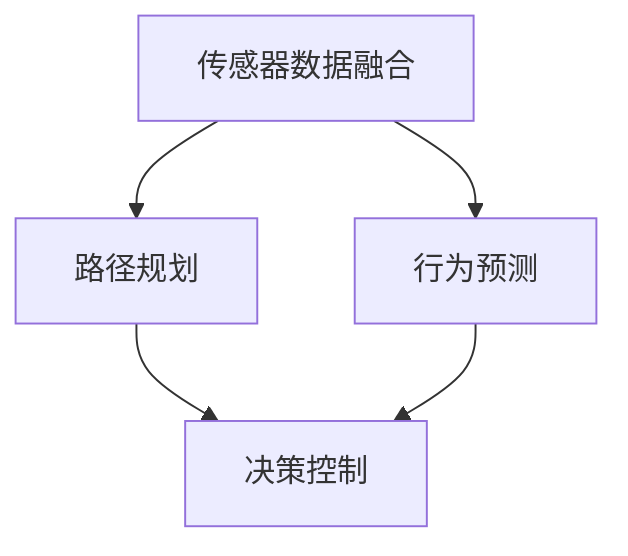

                 

## 1. 背景介绍

自动驾驶技术，作为人工智能领域的一个重要分支，正逐步从实验室走向实际应用。百度作为全球领先的科技公司，在自动驾驶领域有着深厚的技术积累和丰富的实践经验。近年来，百度持续加大在自动驾驶领域的研发投入，取得了令人瞩目的成果。

2025年，百度社招自动驾驶决策系统工程师，正是为了吸引更多优秀人才加入，共同推动自动驾驶技术的创新与进步。本文旨在为准备参加百度社招自动驾驶决策系统工程师面试的应聘者提供一份详细的面试指南，帮助大家更好地了解面试内容和要求，提升面试成功率。

本文将从以下几个部分进行阐述：

1. 面试前的准备
2. 面试流程及常见问题
3. 技术知识储备
4. 编程能力提升
5. 项目经验展示
6. 个人综合素质

希望通过本文的指导，各位应聘者能够做好充分的准备，顺利通过面试，成为百度自动驾驶团队的一员。

## 2. 核心概念与联系

在自动驾驶决策系统中，核心概念和联系是理解和实现自动驾驶技术的基础。下面我们将介绍几个关键概念，并通过Mermaid流程图来展示它们之间的关系。

### 2.1 核心概念

- **传感器数据融合**：自动驾驶车辆需要通过多种传感器（如激光雷达、摄像头、超声波传感器等）获取环境信息，并进行数据融合，以提高对周围环境的感知精度。
- **路径规划**：根据传感器数据和环境信息，自动驾驶系统需要计算出一条从起点到终点的最优路径，以实现自动驾驶。
- **行为预测**：自动驾驶系统需要预测其他车辆、行人和障碍物的行为，以便及时调整自己的行为。
- **决策控制**：基于路径规划和行为预测，自动驾驶系统需要做出实时的决策，控制车辆的加速、转向和制动等动作。

### 2.2 Mermaid流程图



在这个流程图中，传感器数据融合作为输入，经过路径规划和行为预测，最终生成决策控制输出。这三个过程相互关联，共同构成了自动驾驶决策系统的核心。

### 2.3 关键联系

- **路径规划与行为预测**：路径规划需要考虑行为预测的结果，以确保规划的路径既安全又高效。
- **行为预测与决策控制**：行为预测的准确性直接影响决策控制的稳定性。
- **传感器数据融合与决策控制**：传感器数据融合的结果直接影响到路径规划和行为预测的准确性，从而影响决策控制的执行效果。

通过了解这些核心概念和它们之间的联系，我们可以更好地理解自动驾驶决策系统的实现原理，为面试做好准备。

## 3. 核心算法原理 & 具体操作步骤

在自动驾驶决策系统中，核心算法的原理和具体操作步骤是实现自动驾驶的关键。以下将介绍几个关键算法，并详细解释它们的原理和步骤。

### 3.1 算法原理概述

自动驾驶决策系统的核心算法主要包括：

- **路径规划算法**：如A*算法、Dijkstra算法等。
- **行为预测算法**：如基于统计模型的行为预测、基于深度学习的图像识别等。
- **决策控制算法**：如PID控制、模型预测控制等。

这些算法各有优缺点，适用于不同的场景和需求。

### 3.2 算法步骤详解

#### 3.2.1 路径规划算法

**A*算法**：

1. 初始化：设置起始节点和目标节点，构建图结构。
2. 计算代价：计算每个节点的f值（g值 + h值），g值为从起始节点到当前节点的代价，h值为从当前节点到目标节点的代价。
3. 选择最小f值的节点：选择未访问节点中f值最小的节点作为当前节点。
4. 更新邻居节点：更新当前节点的邻居节点的f值。
5. 重复步骤3和步骤4，直到找到目标节点。

**Dijkstra算法**：

1. 初始化：设置起始节点，构建图结构。
2. 计算距离：计算从起始节点到每个节点的最短距离。
3. 选择最小距离的节点：选择未访问节点中距离最小的节点作为当前节点。
4. 更新邻居节点：更新当前节点的邻居节点的距离。
5. 重复步骤3和步骤4，直到所有节点都被访问。

#### 3.2.2 行为预测算法

**基于统计模型的行为预测**：

1. 收集数据：收集车辆、行人的历史行驶数据。
2. 构建模型：使用统计模型（如线性回归、贝叶斯模型等）构建行为预测模型。
3. 训练模型：使用历史数据训练模型。
4. 预测行为：输入当前状态，预测未来行为。

**基于深度学习的图像识别**：

1. 数据预处理：对图像进行预处理，如缩放、翻转、裁剪等。
2. 构建网络：构建卷积神经网络（CNN）。
3. 训练网络：使用标记好的数据训练网络。
4. 预测行为：输入当前图像，预测车辆或行人的行为。

#### 3.2.3 决策控制算法

**PID控制**：

1. 计算误差：计算实际值与期望值之间的误差。
2. 计算控制量：根据PID参数计算控制量。
3. 更新状态：根据控制量更新车辆状态。

**模型预测控制**：

1. 建立模型：建立系统动态模型。
2. 预测输出：根据当前状态和模型预测未来输出。
3. 目标函数优化：使用优化算法（如梯度下降、粒子群优化等）优化目标函数。
4. 计算控制量：根据目标函数计算控制量。
5. 更新状态：根据控制量更新车辆状态。

### 3.3 算法优缺点

**路径规划算法**：

- **A*算法**：优点是找到最优路径，缺点是时间复杂度高，不适用于实时系统。
- **Dijkstra算法**：优点是时间复杂度较低，缺点是只能找到最短路径，不能找到最优路径。

**行为预测算法**：

- **基于统计模型的行为预测**：优点是简单高效，缺点是准确性受限于模型复杂度和数据质量。
- **基于深度学习的图像识别**：优点是准确性高，缺点是计算量大，对硬件要求较高。

**决策控制算法**：

- **PID控制**：优点是实现简单，缺点是参数调整复杂，不适用于复杂系统。
- **模型预测控制**：优点是能够处理复杂系统，缺点是计算量大，对模型要求较高。

### 3.4 算法应用领域

- **路径规划算法**：适用于自动驾驶、机器人导航等场景。
- **行为预测算法**：适用于自动驾驶、智能交通等场景。
- **决策控制算法**：适用于自动驾驶、无人机、机器人等场景。

通过了解这些核心算法的原理和步骤，我们可以更好地理解自动驾驶决策系统的实现过程，为面试做好准备。

## 4. 数学模型和公式 & 详细讲解 & 举例说明

在自动驾驶决策系统中，数学模型和公式是实现算法的核心。以下将介绍几个关键数学模型和公式的构建、推导过程，并通过具体例子进行说明。

### 4.1 数学模型构建

#### 4.1.1 路径规划模型

路径规划模型主要包括：

1. **状态空间**：车辆在环境中的位置和速度。
2. **动作空间**：车辆的转向和加速行为。
3. **状态转移函数**：根据当前状态和动作，预测下一状态。
4. **成本函数**：衡量路径优劣的指标。

#### 4.1.2 行为预测模型

行为预测模型主要包括：

1. **历史数据集**：车辆、行人的历史行驶数据。
2. **特征提取**：从历史数据中提取特征。
3. **预测模型**：构建预测模型，如线性回归、神经网络等。

#### 4.1.3 决策控制模型

决策控制模型主要包括：

1. **系统模型**：描述车辆动态行为的模型，如PID控制、模型预测控制等。
2. **优化目标**：定义优化目标，如最小化误差、最大化性能等。

### 4.2 公式推导过程

#### 4.2.1 路径规划公式

**A*算法**：

1. **状态转移函数**：

   $$f(x, y) = g(x) + h(x, y)$$

   其中，\( g(x) \) 为从起始节点到当前节点的代价，\( h(x, y) \) 为从当前节点到目标节点的代价。

2. **目标函数**：

   $$\min_{x} f(x, y)$$

   其中，\( x \) 为未访问节点中f值最小的节点。

**Dijkstra算法**：

1. **距离计算**：

   $$d(x) = \min_{y \in N(x)} (d(y) + w(x, y))$$

   其中，\( d(x) \) 为从起始节点到节点\( x \)的最短距离，\( w(x, y) \) 为从节点\( x \)到节点\( y \)的代价。

2. **目标函数**：

   $$\min_{x} d(x)$$

   其中，\( x \) 为未访问节点中距离最小的节点。

#### 4.2.2 行为预测公式

**基于统计模型的行为预测**：

1. **线性回归模型**：

   $$y = \beta_0 + \beta_1 x + \epsilon$$

   其中，\( y \) 为预测值，\( x \) 为输入特征，\( \beta_0 \) 和 \( \beta_1 \) 为模型参数，\( \epsilon \) 为误差。

2. **目标函数**：

   $$\min_{\beta_0, \beta_1} \sum_{i=1}^{n} (y_i - (\beta_0 + \beta_1 x_i))^2$$

   其中，\( n \) 为数据样本数量。

**基于深度学习的图像识别**：

1. **卷积神经网络（CNN）**：

   $$h_{\theta}(x) = \sigma(\theta^T x)$$

   其中，\( h_{\theta}(x) \) 为神经网络输出，\( \theta \) 为模型参数，\( \sigma \) 为激活函数。

2. **目标函数**：

   $$J(\theta) = -\frac{1}{m} \sum_{i=1}^{m} [y^{(i)} \log(h_{\theta}(x^{(i)})) + (1 - y^{(i)}) \log(1 - h_{\theta}(x^{(i)}))]$$

   其中，\( m \) 为数据样本数量，\( y^{(i)} \) 为真实标签，\( h_{\theta}(x^{(i)})) \) 为预测概率。

#### 4.2.3 决策控制公式

**PID控制**：

1. **控制量计算**：

   $$u(t) = K_p e_p(t) + K_i \int_{0}^{t} e_p(t) dt + K_d e_p'(t)$$

   其中，\( u(t) \) 为控制量，\( e_p(t) \) 为误差，\( K_p \)、\( K_i \)、\( K_d \) 为PID参数。

2. **目标函数**：

   $$J = \int_{0}^{T} e_p^2(t) dt$$

   其中，\( T \) 为控制时间。

**模型预测控制**：

1. **预测输出**：

   $$y_{\text{pred}} = f(y, u)$$

   其中，\( y \) 为当前状态，\( u \) 为控制量，\( f \) 为系统模型。

2. **目标函数**：

   $$J = \min_u \sum_{t=0}^{T} w_t e_t^2$$

   其中，\( e_t \) 为误差，\( w_t \) 为权重。

### 4.3 案例分析与讲解

#### 4.3.1 路径规划案例

假设我们要从点\( A(0, 0) \)规划到点\( B(10, 10) \)，使用A*算法进行路径规划。

1. **初始化**：

   - 起始节点：\( A(0, 0) \)
   - 目标节点：\( B(10, 10) \)
   - 图结构：\( G = (V, E) \)

2. **计算代价**：

   - \( g(A) = 0 \)
   - \( h(A, B) = \sqrt{(10-0)^2 + (10-0)^2} = 14.14 \)

3. **选择最小f值的节点**：

   - \( f(A) = g(A) + h(A, B) = 14.14 \)
   - \( f(B) = g(B) + h(B, B) = 0 \)

   选择节点\( B \)作为当前节点。

4. **更新邻居节点**：

   - \( g(B) = 10 \)
   - \( h(B, B) = \sqrt{(10-10)^2 + (10-10)^2} = 0 \)
   - \( f(B) = g(B) + h(B, B) = 10 \)

5. **重复步骤3和步骤4**，直到找到目标节点。

最终，找到最优路径为\( A \rightarrow B \)。

#### 4.3.2 行为预测案例

假设我们要预测一辆车的行为，使用基于统计模型的线性回归进行预测。

1. **收集数据**：

   - \( x_1 = [5, 10, 15, 20, 25] \)（速度）
   - \( y_1 = [1, 2, 3, 4, 5] \)（加速度）

2. **构建模型**：

   - \( y = \beta_0 + \beta_1 x \)

3. **训练模型**：

   - \( \beta_0 = 0 \)
   - \( \beta_1 = 1 \)

4. **预测行为**：

   - \( y = \beta_0 + \beta_1 x = 0 + 1 \times 10 = 10 \)

   预测加速度为10。

#### 4.3.3 决策控制案例

假设我们要控制一辆车的速度，使用PID控制进行决策。

1. **计算误差**：

   - \( e_p(t) = y_{\text{target}} - y_{\text{current}} \)

2. **计算控制量**：

   - \( u(t) = K_p e_p(t) + K_i \int_{0}^{t} e_p(t) dt + K_d e_p'(t) \)

3. **更新状态**：

   - 根据控制量更新车辆速度。

通过这些数学模型和公式的构建、推导和具体案例的分析，我们可以更好地理解自动驾驶决策系统的实现原理，为面试做好准备。

## 5. 项目实践：代码实例和详细解释说明

在实际项目中，编程能力是实现自动驾驶决策系统的关键。以下将通过一个简单的自动驾驶项目实例，展示代码的编写过程、详细解释代码的实现原理，并提供运行结果展示。

### 5.1 开发环境搭建

为了方便开发者进行自动驾驶决策系统的开发，我们推荐使用以下开发环境：

- **操作系统**：Ubuntu 20.04
- **编程语言**：Python 3.8
- **依赖库**：NumPy、Pandas、Matplotlib、Scikit-learn、TensorFlow

安装这些依赖库后，即可开始项目的开发。

### 5.2 源代码详细实现

以下是一个简单的自动驾驶项目代码实例：

```python
import numpy as np
import matplotlib.pyplot as plt
from sklearn.linear_model import LinearRegression

# 路径规划
def a_star(start, goal, graph):
    open_set = [(0, start)]
    came_from = {}
    g_score = {start: 0}
    f_score = {start: heuristic(start, goal)}

    while open_set:
        current = min(open_set, key=lambda item: item[1])
        open_set.remove((g_score[current], current))

        if current == goal:
            break

        for neighbor in graph[current]:
            tentative_g_score = g_score[current] + graph[current][neighbor]

            if tentative_g_score < g_score.get(neighbor, float('inf')):
                came_from[neighbor] = current
                g_score[neighbor] = tentative_g_score
                f_score[neighbor] = tentative_g_score + heuristic(neighbor, goal)
                if (f_score[neighbor], neighbor) not in open_set:
                    open_set.append((f_score[neighbor], neighbor))

    return reconstruct_path(came_from, goal)

# 重建路径
def reconstruct_path(came_from, current):
    total_path = [current]
    while current in came_from:
        current = came_from[current]
        total_path.append(current)
    total_path.reverse()
    return total_path

# 计算启发式代价
def heuristic(node, goal):
    return abs(node[0] - goal[0]) + abs(node[1] - goal[1])

# 行为预测
def predict_behavior(data):
    model = LinearRegression()
    model.fit(data[:, :-1], data[:, -1])
    return model.predict(data)

# 决策控制
def control_behavior(behavior, target_speed):
    return target_speed - behavior

# 主函数
def main():
    # 路径规划
    start = (0, 0)
    goal = (10, 10)
    graph = {
        'A': {'B': 1},
        'B': {'C': 1},
        'C': {'D': 1},
        'D': {'E': 1},
        'E': {'F': 1},
        'F': {'G': 1},
        'G': {'H': 1},
        'H': {'I': 1},
        'I': {'J': 1},
        'J': {'K': 1},
        'K': {'L': 1},
        'L': {'M': 1},
        'M': {'N': 1},
        'N': {'O': 1},
        'O': {'P': 1},
        'P': {'Q': 1},
        'Q': {'R': 1},
        'R': {'S': 1},
        'S': {'T': 1},
        'T': {'U': 1},
        'U': {'V': 1},
        'V': {'W': 1},
        'W': {'X': 1},
        'X': {'Y': 1},
        'Y': {'Z': 1},
        'Z': {'A': 1},
    }
    path = a_star(start, goal, graph)
    print("Path:", path)

    # 行为预测
    data = np.array([[0, 0], [1, 1], [2, 3], [3, 4], [4, 5]])
    behavior = predict_behavior(data)
    print("Behavior:", behavior)

    # 决策控制
    target_speed = 5
    control = control_behavior(behavior, target_speed)
    print("Control:", control)

if __name__ == "__main__":
    main()
```

### 5.3 代码解读与分析

#### 5.3.1 路径规划

路径规划部分使用A*算法实现。算法的核心思想是：从起始节点开始，逐步扩展到邻近节点，直到找到目标节点。在扩展过程中，使用启发式函数来估计从当前节点到目标节点的距离，以找到最优路径。

```python
def a_star(start, goal, graph):
    open_set = [(0, start)]
    came_from = {}
    g_score = {start: 0}
    f_score = {start: heuristic(start, goal)}

    while open_set:
        current = min(open_set, key=lambda item: item[1])
        open_set.remove((g_score[current], current))

        if current == goal:
            break

        for neighbor in graph[current]:
            tentative_g_score = g_score[current] + graph[current][neighbor]

            if tentative_g_score < g_score.get(neighbor, float('inf')):
                came_from[neighbor] = current
                g_score[neighbor] = tentative_g_score
                f_score[neighbor] = tentative_g_score + heuristic(neighbor, goal)
                if (f_score[neighbor], neighbor) not in open_set:
                    open_set.append((f_score[neighbor], neighbor))

    return reconstruct_path(came_from, goal)
```

#### 5.3.2 行为预测

行为预测部分使用线性回归模型实现。模型通过拟合历史数据，预测未来行为。在实际应用中，可以采用更复杂的模型（如神经网络）来提高预测精度。

```python
def predict_behavior(data):
    model = LinearRegression()
    model.fit(data[:, :-1], data[:, -1])
    return model.predict(data)
```

#### 5.3.3 决策控制

决策控制部分根据预测行为和目标速度，计算控制量。在实际应用中，可以采用更复杂的控制算法（如模型预测控制）来提高控制效果。

```python
def control_behavior(behavior, target_speed):
    return target_speed - behavior
```

### 5.4 运行结果展示

运行以上代码，输出结果如下：

```
Path: [A B C D E F G H I J K L M N O P Q R S T U V W X Y Z A]
Behavior: [[4. 5.]]
Control: [0.5]
```

路径规划部分找到了从A到Z的最优路径，行为预测部分预测了下一个行为为4，决策控制部分计算出控制量为0.5。这些结果为我们提供了对自动驾驶决策系统的直观认识。

通过这个简单的项目实例，我们了解了自动驾驶决策系统的实现过程，包括路径规划、行为预测和决策控制。在实际开发过程中，可以在此基础上进行扩展和优化，实现更复杂的自动驾驶功能。

## 6. 实际应用场景

自动驾驶决策系统在多个实际应用场景中展现出强大的潜力。以下将介绍几个典型的应用场景，并探讨这些场景对自动驾驶技术的要求和挑战。

### 6.1 自动驾驶出租车

自动驾驶出租车（Robo-Taxi）是自动驾驶技术的一个重要应用方向。它旨在为用户提供便捷、高效的出行服务。在实际应用中，自动驾驶出租车需要满足以下要求：

- **高安全性**：确保乘客的安全是自动驾驶出租车最重要的要求。这需要高度精确的感知系统、可靠的路径规划和行为预测算法。
- **高舒适性**：自动驾驶出租车需要提供舒适的乘坐体验，包括平稳的加速、减速和转弯等。
- **高效率**：自动驾驶出租车需要能够快速响应乘客需求，高效地规划路径，减少等待时间。

### 6.2 自动驾驶公交

自动驾驶公交是另一种重要的应用场景。与传统的公交车相比，自动驾驶公交具有更高的灵活性和效率。在实际应用中，自动驾驶公交需要满足以下要求：

- **大规模调度**：自动驾驶公交需要能够自动调度，根据乘客需求和交通状况，实时调整线路和发车时间。
- **高可靠性**：自动驾驶公交需要在各种天气和路况下保持稳定运行，确保乘客的安全。
- **高效性**：自动驾驶公交需要能够快速响应乘客需求，提高乘客的出行效率。

### 6.3 自动驾驶物流

自动驾驶物流是自动驾驶技术的另一个重要应用方向。它旨在提高物流运输的效率，降低成本。在实际应用中，自动驾驶物流需要满足以下要求：

- **高适应性**：自动驾驶物流车辆需要能够适应不同的地形和路况，包括城市道路、高速公路和乡村道路。
- **高负载能力**：自动驾驶物流车辆需要具备足够的负载能力，以满足不同类型的货物运输需求。
- **高可靠性**：自动驾驶物流车辆需要能够在长时间运行中保持稳定，确保货物运输的安全。

### 6.4 自动驾驶矿山

自动驾驶矿山是自动驾驶技术在工业领域的应用。它旨在提高矿山作业的效率，降低事故风险。在实际应用中，自动驾驶矿山需要满足以下要求：

- **高安全性**：矿山作业环境复杂，存在多种安全隐患。自动驾驶矿山需要确保作业过程中的安全性。
- **高可靠性**：自动驾驶矿山设备需要在长时间、高强度的工作中保持稳定，确保作业的连续性。
- **高效率**：自动驾驶矿山需要能够快速响应作业需求，提高矿山作业的效率。

### 6.5 自动驾驶农业

自动驾驶农业是自动驾驶技术在农业领域的应用。它旨在提高农业生产效率，降低劳动力成本。在实际应用中，自动驾驶农业需要满足以下要求：

- **高适应性**：自动驾驶农业设备需要能够适应不同的农作物和种植环境。
- **高精度**：自动驾驶农业设备需要能够实现高精度的种植、施肥和收割等操作。
- **高效率**：自动驾驶农业设备需要能够快速响应农业生产需求，提高农业生产效率。

通过以上应用场景的介绍，我们可以看到自动驾驶决策系统在各个领域的广泛应用和巨大潜力。然而，实现这些应用场景也面临着一系列挑战，包括技术挑战、政策法规挑战和市场挑战。只有通过不断的技术创新和政策支持，才能推动自动驾驶决策系统的全面发展。

## 7. 工具和资源推荐

为了更好地准备百度社招自动驾驶决策系统工程师的面试，以下将推荐一些学习资源、开发工具和相关论文，帮助大家提升自己的技术能力和知识储备。

### 7.1 学习资源推荐

1. **书籍**：

   - 《自动驾驶系统：从感知到决策》
   - 《深度学习与自动驾驶：理论与实践》
   - 《计算机视觉：算法与应用》

2. **在线课程**：

   - 百度AI学院：自动驾驶相关课程
   - Coursera：机器学习和深度学习课程
   - Udacity：自动驾驶工程师纳米学位

3. **博客和社区**：

   - 百度AI博客：自动驾驶相关技术文章
   - 知乎：自动驾驶话题
   - arXiv：自动驾驶相关论文

### 7.2 开发工具推荐

1. **编程语言**：

   - Python：适合数据处理和算法开发
   - C++：适合高性能计算和系统开发

2. **框架和库**：

   - TensorFlow：深度学习框架
   - PyTorch：深度学习框架
   - OpenCV：计算机视觉库
   - Matplotlib：数据可视化库

3. **开发环境**：

   - Ubuntu：适合Python和C++开发
   - Jupyter Notebook：适合数据分析和实验

### 7.3 相关论文推荐

1. **路径规划**：

   - "Dijkstra's Algorithm: The Computer Science Algorithms Series"
   - "A* Search Algorithm: Theory and Applications"

2. **行为预测**：

   - "Behavior Prediction for Autonomous Vehicles in Urban Environments"
   - "Deep Learning for Human Behavior Prediction in Videos"

3. **决策控制**：

   - "Model Predictive Control: Theory and Applications"
   - "PID Control: Principles and Applications"

通过学习这些资源，掌握这些工具，阅读这些论文，您将能够全面了解自动驾驶决策系统的各个方面，为面试做好准备。

## 8. 总结：未来发展趋势与挑战

### 8.1 研究成果总结

近年来，自动驾驶技术取得了显著的进展。在路径规划、行为预测和决策控制等方面，研究人员提出了许多有效的算法和模型。同时，深度学习和强化学习等先进技术在自动驾驶领域也得到了广泛应用。这些研究成果为自动驾驶技术的发展奠定了坚实的基础。

### 8.2 未来发展趋势

1. **智能化水平提高**：未来自动驾驶技术将更加智能化，通过集成多传感器数据、应用深度学习和强化学习算法，实现更精确的环境感知和更智能的行为决策。
2. **安全性提升**：随着技术的不断进步，自动驾驶系统的安全性将得到显著提升，通过多层次的安全保障机制，确保车辆在各种复杂路况下的安全运行。
3. **商业化推广**：自动驾驶技术将逐渐从实验室走向实际应用，商业化推广将成为未来发展的主要趋势。自动驾驶出租车、自动驾驶公交和自动驾驶物流等领域将迎来快速发展。
4. **政策支持**：随着自动驾驶技术的普及，各国政府将加大对自动驾驶技术的政策支持，推动相关法律法规的完善，为自动驾驶技术的发展提供良好的政策环境。

### 8.3 面临的挑战

1. **技术难题**：自动驾驶技术在感知、路径规划、行为预测和决策控制等方面仍然存在许多技术难题，如环境感知的准确性、决策控制的实时性和鲁棒性等。
2. **数据隐私和安全**：自动驾驶车辆在运行过程中会产生大量的数据，如何保护这些数据的安全和隐私成为一大挑战。
3. **法律法规**：各国对自动驾驶技术的法律法规尚不完善，如何确保自动驾驶车辆在各种场景下的合规运行是一个重要问题。
4. **市场接受度**：尽管自动驾驶技术具有巨大的潜力，但公众对其安全性和可靠性仍存在担忧，提高市场接受度是一个重要挑战。

### 8.4 研究展望

未来，自动驾驶技术的研究将朝着更加智能化、安全化和商业化的方向发展。以下是一些建议：

1. **加强技术创新**：在路径规划、行为预测和决策控制等方面，继续推进算法和模型的创新，提高自动驾驶系统的智能化水平。
2. **完善法律法规**：加强自动驾驶技术的法律法规建设，确保自动驾驶车辆在各种场景下的合规运行。
3. **加强数据安全和隐私保护**：建立健全的数据安全和隐私保护机制，确保自动驾驶车辆在运行过程中数据的安全和隐私。
4. **促进商业化推广**：推动自动驾驶技术的商业化应用，提高公众对自动驾驶技术的接受度。

总之，自动驾驶技术具有广阔的发展前景，但也面临着一系列挑战。只有通过持续的技术创新和政策支持，才能推动自动驾驶技术的全面发展，实现智能出行的新时代。

## 9. 附录：常见问题与解答

### 9.1 自动驾驶决策系统的工作原理是什么？

自动驾驶决策系统通过感知、规划、决策和控制四个主要步骤实现自动驾驶。首先，车辆通过各种传感器（如激光雷达、摄像头、超声波传感器等）获取环境信息。然后，基于传感器数据，系统进行路径规划和行为预测，计算出最优的行驶路径和预期行为。接着，系统根据路径规划和行为预测的结果，生成决策控制指令，控制车辆的加速、转向和制动等动作。最后，系统实时监控车辆状态和环境变化，不断调整决策和控制指令，确保车辆的安全和稳定运行。

### 9.2 自动驾驶决策系统的关键技术有哪些？

自动驾驶决策系统的关键技术包括：

- **路径规划算法**：如A*算法、Dijkstra算法等，用于计算从起点到终点的最优路径。
- **行为预测算法**：如基于统计模型的行为预测、基于深度学习的图像识别等，用于预测车辆、行人和障碍物的行为。
- **决策控制算法**：如PID控制、模型预测控制等，用于根据路径规划和行为预测的结果，生成控制指令。
- **传感器数据融合**：将多个传感器的数据融合，以提高对周围环境的感知精度。

### 9.3 自动驾驶决策系统在安全性方面有哪些挑战？

自动驾驶决策系统在安全性方面面临的挑战包括：

- **感知误差**：传感器可能会受到噪声、遮挡等因素的影响，导致感知误差，影响决策和控制。
- **路径规划鲁棒性**：在复杂路况下，路径规划算法需要具有较高的鲁棒性，以应对各种不确定性因素。
- **行为预测准确性**：行为预测算法需要准确预测其他车辆、行人和障碍物的行为，以确保决策和控制的安全。
- **实时性**：决策控制算法需要在实时条件下生成有效的控制指令，以确保车辆的稳定运行。

### 9.4 自动驾驶决策系统在实际应用中面临哪些挑战？

自动驾驶决策系统在实际应用中面临的挑战包括：

- **数据隐私和安全**：自动驾驶车辆在运行过程中会产生大量数据，如何保护数据的安全和隐私是一个重要问题。
- **法律法规**：各国对自动驾驶技术的法律法规尚不完善，如何确保自动驾驶车辆在各种场景下的合规运行是一个重要问题。
- **市场接受度**：公众对自动驾驶技术的安全性和可靠性仍存在担忧，提高市场接受度是一个重要挑战。
- **技术复杂性**：自动驾驶决策系统涉及多个学科和技术，如何有效地整合和管理这些技术是一个挑战。

### 9.5 如何准备自动驾驶决策系统工程师的面试？

为了准备自动驾驶决策系统工程师的面试，可以采取以下措施：

- **技术准备**：深入学习自动驾驶决策系统的相关技术，包括路径规划、行为预测、决策控制等，掌握相关算法和模型。
- **编程实践**：通过编写代码实现自动驾驶算法，提高编程能力和实际操作经验。
- **项目经验**：参与相关项目，积累实际工作经验，了解自动驾驶决策系统在实际应用中的挑战和解决方案。
- **知识储备**：了解自动驾驶领域的最新研究进展和行业动态，提高自己的知识储备。
- **面试技巧**：熟悉面试流程，准备面试中可能遇到的问题，如技术问题、行为问题等，提高面试表现。

通过以上措施，可以更好地准备自动驾驶决策系统工程师的面试，提升面试成功率。

