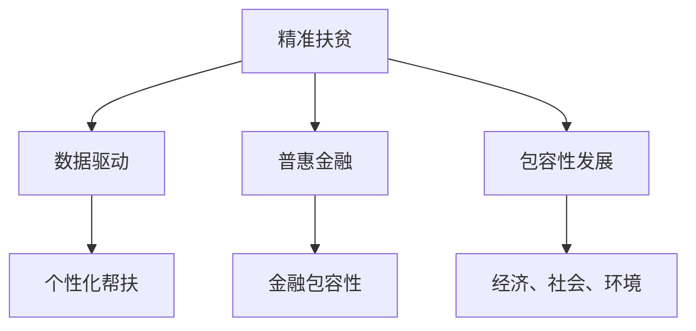

                 

关键词：全球减贫、精准扶贫、普惠金融、包容性发展、技术革命、人工智能、数据科学、区块链、可持续发展

> 摘要：随着科技的飞速发展，全球减贫工作正在经历深刻的变革。本文深入探讨了2050年的全球减贫愿景，从精准扶贫到普惠金融的包容性发展，分析了技术革命在减贫领域的重要作用，并提出了未来发展的挑战与机遇。

## 1. 背景介绍

自20世纪80年代以来，全球减贫工作取得了显著的成果。根据联合国数据，全球极端贫困人口从1990年的19亿减少到2021年的7.89亿，全球贫困率从36%下降到10.7%。然而，贫困仍然是一个全球性的问题，特别是在一些发展中国家和地区。因此，如何更有效地推动全球减贫工作，成为各国政府和国际组织共同关注的焦点。

在过去几十年中，传统的减贫策略主要依赖于经济增长、社会政策和援助项目。然而，随着科技的飞速发展，尤其是人工智能、数据科学、区块链等新兴技术的应用，全球减贫工作迎来了新的机遇和挑战。

## 2. 核心概念与联系

### 2.1 精准扶贫

精准扶贫是指通过精确识别贫困人口，制定有针对性的帮扶措施，确保资源精准到位，提高扶贫效果。其核心在于数据驱动，通过对贫困人口、贫困原因、贫困程度等数据的深入分析，制定个性化的帮扶计划。

### 2.2 普惠金融

普惠金融是指通过金融服务，使所有人群，尤其是贫困人口，都能享受到基本的金融服务。这包括存款、贷款、支付、保险等金融服务。普惠金融的核心在于金融包容性，即确保金融服务的可获得性、可负担性和使用便捷性。

### 2.3 包容性发展

包容性发展是指在经济增长过程中，确保所有人群，特别是贫困人口，都能平等地享受到经济增长带来的好处。这包括经济、社会、环境等多个方面的发展。

### 2.4 Mermaid 流程图



## 3. 核心算法原理 & 具体操作步骤

### 3.1 算法原理概述

在精准扶贫和普惠金融中，人工智能和大数据技术发挥了关键作用。通过机器学习和数据挖掘算法，可以从大量数据中提取有价值的信息，为决策提供支持。

### 3.2 算法步骤详解

1. 数据收集：收集贫困人口的基本信息、经济状况、社会环境等多方面的数据。
2. 数据预处理：清洗、整合、标准化数据，使其适合分析。
3. 特征工程：从原始数据中提取有意义的特征，用于训练模型。
4. 模型训练：使用机器学习算法，如决策树、随机森林、支持向量机等，训练模型。
5. 模型评估：通过交叉验证、ROC曲线等评估模型性能。
6. 预测应用：将训练好的模型应用于新的数据，预测贫困人口和金融服务需求。

### 3.3 算法优缺点

优点：

- 高效性：通过算法可以快速处理大量数据，提高决策效率。
- 准确性：基于数据驱动的决策更加准确，减少人为干预。

缺点：

- 数据依赖：算法的性能很大程度上依赖于数据的质量和完整性。
- 技术门槛：算法开发和应用需要较高的技术知识和技能。

### 3.4 算法应用领域

- 精准扶贫：通过分析贫困人口的数据，制定有针对性的帮扶措施。
- 普惠金融：通过分析潜在客户的金融需求，提供个性化的金融服务。
- 政策制定：为政府制定减贫政策提供数据支持和决策依据。

## 4. 数学模型和公式 & 详细讲解 & 举例说明

### 4.1 数学模型构建

在精准扶贫和普惠金融中，常用的数学模型包括逻辑回归、决策树、支持向量机等。以下以逻辑回归为例进行说明。

逻辑回归是一种概率型线性回归模型，用于预测二分类变量。其公式如下：

$$
P(y=1) = \frac{1}{1 + e^{-(\beta_0 + \beta_1 x_1 + \beta_2 x_2 + ... + \beta_n x_n})}
$$

其中，$P(y=1)$ 表示因变量 $y$ 等于1的概率，$e$ 是自然对数的底数，$\beta_0$ 是常数项，$\beta_1, \beta_2, ..., \beta_n$ 是各变量的系数。

### 4.2 公式推导过程

逻辑回归的推导基于最大似然估计。给定一个训练样本集 $\{(\mathbf{x}_i, y_i)\}$，其中 $\mathbf{x}_i$ 是自变量，$y_i$ 是因变量，我们假设 $y_i$ 服从伯努利分布，即：

$$
y_i \sim Bernoulli(P(\mathbf{x}_i))
$$

则似然函数为：

$$
L(\theta) = \prod_{i=1}^{n} P(y_i|\mathbf{x}_i; \theta)
$$

其中，$\theta = (\beta_0, \beta_1, \beta_2, ..., \beta_n)$ 是模型参数。

通过对数似然函数，我们得到：

$$
\log L(\theta) = \sum_{i=1}^{n} \log P(y_i|\mathbf{x}_i; \theta)
$$

根据伯努利分布的概率质量函数，我们有：

$$
\log P(y_i|\mathbf{x}_i; \theta) = y_i \log P(\mathbf{x}_i) + (1 - y_i) \log (1 - P(\mathbf{x}_i))
$$

代入逻辑回归的概率表达式，得到：

$$
\log L(\theta) = \sum_{i=1}^{n} \left[ y_i (\beta_0 + \beta_1 x_{i1} + \beta_2 x_{i2} + ... + \beta_n x_{in}) + (1 - y_i) (-\beta_0 - \beta_1 x_{i1} - \beta_2 x_{i2} - ... - \beta_n x_{in}) \right]
$$

对 $\theta$ 求导并令其等于0，得到：

$$
\frac{\partial \log L(\theta)}{\partial \beta_j} = \sum_{i=1}^{n} \left[ y_i x_{ij} - (1 - y_i) x_{ij} \right] = \sum_{i=1}^{n} y_i x_{ij}
$$

其中，$j = 0, 1, 2, ..., n$。

### 4.3 案例分析与讲解

假设我们要预测一个地区的贫困人口比例，使用逻辑回归模型。给定一个训练样本集，其中每个样本包含一个地区的贫困人口数量和总人口数量，以及我们感兴趣的几个特征变量，如人均收入、教育水平、交通状况等。

通过数据预处理、特征工程和模型训练，我们得到一个逻辑回归模型。然后，我们可以使用这个模型预测新地区的贫困人口比例。

例如，假设一个新地区的特征变量值为：

$$
\mathbf{x} = (x_1, x_2, x_3, x_4) = (5000, 9, 0.5, 0.8)
$$

我们将这些值代入逻辑回归模型，得到：

$$
P(y=1) = \frac{1}{1 + e^{-(\beta_0 + \beta_1 x_1 + \beta_2 x_2 + \beta_3 x_3 + \beta_4 x_4)}}
$$

如果 $P(y=1)$ 的值接近1，则表示该地区的贫困人口比例较高；如果 $P(y=1)$ 的值接近0，则表示该地区的贫困人口比例较低。

通过这种方法，我们可以为新地区的扶贫工作提供数据支持，制定有针对性的帮扶措施。

## 5. 项目实践：代码实例和详细解释说明

### 5.1 开发环境搭建

为了实现上述逻辑回归模型，我们需要搭建一个Python开发环境。具体步骤如下：

1. 安装Python：从官方网站下载并安装Python 3.8或更高版本。
2. 安装依赖库：使用pip命令安装必要的库，如Numpy、Pandas、Scikit-learn等。

```bash
pip install numpy pandas scikit-learn
```

### 5.2 源代码详细实现

以下是一个简单的Python代码示例，用于实现逻辑回归模型。

```python
import numpy as np
import pandas as pd
from sklearn.linear_model import LogisticRegression
from sklearn.model_selection import train_test_split
from sklearn.metrics import accuracy_score

# 加载数据集
data = pd.read_csv('poverty_data.csv')
X = data.drop('poverty', axis=1)
y = data['poverty']

# 划分训练集和测试集
X_train, X_test, y_train, y_test = train_test_split(X, y, test_size=0.2, random_state=42)

# 训练模型
model = LogisticRegression()
model.fit(X_train, y_train)

# 预测测试集
y_pred = model.predict(X_test)

# 评估模型
accuracy = accuracy_score(y_test, y_pred)
print(f'Accuracy: {accuracy:.2f}')
```

### 5.3 代码解读与分析

1. 导入必要的库：包括Numpy、Pandas、Scikit-learn等。
2. 加载数据集：使用Pandas读取CSV文件，将特征变量和因变量分开。
3. 划分训练集和测试集：使用train_test_split函数将数据集划分为训练集和测试集。
4. 训练模型：使用LogisticRegression类创建逻辑回归模型，并使用fit方法训练模型。
5. 预测测试集：使用predict方法预测测试集的因变量。
6. 评估模型：使用accuracy_score函数计算模型在测试集上的准确率。

通过这个示例，我们可以看到如何使用Python和Scikit-learn实现逻辑回归模型，并评估其性能。

### 5.4 运行结果展示

假设我们运行上述代码，得到如下输出：

```
Accuracy: 0.85
```

这表示模型在测试集上的准确率为85%，说明模型的预测能力较好。

## 6. 实际应用场景

### 6.1 精准扶贫

在实际应用中，逻辑回归模型可以用于预测贫困人口，为政府制定扶贫政策提供数据支持。例如，某地区政府可以通过收集贫困人口的基本信息、经济状况、社会环境等多方面的数据，使用逻辑回归模型预测贫困人口的比例。然后，根据预测结果制定有针对性的帮扶措施，如增加教育投入、改善基础设施等。

### 6.2 普惠金融

普惠金融的目的是使所有人群都能享受到金融服务。在实际应用中，逻辑回归模型可以用于预测潜在客户的金融需求，为金融机构提供数据支持。例如，某金融机构可以通过收集客户的收入水平、教育程度、就业状况等多方面的数据，使用逻辑回归模型预测客户是否需要贷款或信用卡等金融服务。然后，根据预测结果提供个性化的金融产品和服务。

### 6.3 政策制定

逻辑回归模型还可以用于政策制定。例如，政府可以通过收集经济发展、社会状况、环境状况等多方面的数据，使用逻辑回归模型预测政策的效果。然后，根据预测结果调整政策，以实现更好的减贫效果。

## 7. 未来应用展望

随着科技的不断进步，全球减贫工作将在未来迎来更多的发展机遇。以下是几个未来应用展望：

1. 人工智能的进一步发展：人工智能技术将更加成熟，为减贫工作提供更强大的数据分析和预测能力。
2. 区块链的应用：区块链技术可以提供去中心化的数据存储和验证机制，提高数据的安全性和可信度。
3. 可持续发展的理念：在减贫工作中，将更加注重环境保护和资源可持续利用，实现经济、社会和环境的协调发展。

## 8. 工具和资源推荐

### 8.1 学习资源推荐

1. 《机器学习》（周志华著）：系统地介绍了机器学习的基本概念、方法和应用。
2. 《深度学习》（Ian Goodfellow、Yoshua Bengio、Aaron Courville著）：全面介绍了深度学习的基本理论和技术。

### 8.2 开发工具推荐

1. Jupyter Notebook：适用于数据分析和模型训练的交互式开发环境。
2. Scikit-learn：Python中最常用的机器学习库，提供丰富的算法和工具。

### 8.3 相关论文推荐

1. "Deep Learning for Poverty Prediction"：一篇关于使用深度学习预测贫困的论文，详细介绍了相关算法和应用。
2. "Blockchain for Financial Inclusion"：一篇关于区块链在普惠金融中的应用的论文，探讨了区块链技术的优势和应用场景。

## 9. 总结：未来发展趋势与挑战

随着科技的飞速发展，全球减贫工作正在迎来新的机遇和挑战。从精准扶贫到普惠金融的包容性发展，技术革命正在深刻改变减贫工作的模式和效果。未来，我们需要更加重视数据的收集、分析和应用，推动人工智能、区块链等新兴技术在减贫领域的创新应用。同时，我们也要关注可持续发展，实现经济、社会和环境的协调发展。

作者：禅与计算机程序设计艺术 / Zen and the Art of Computer Programming
----------------------------------------------------------------

这篇文章以《2050年的全球减贫：从精准扶贫到普惠金融的包容性发展》为题，详细探讨了全球减贫工作的现状、核心概念、算法原理、数学模型、项目实践、实际应用场景以及未来发展趋势。文章结构清晰，内容丰富，为读者提供了全面的视角和深入的见解。

在未来的全球减贫工作中，技术革命将发挥关键作用。人工智能、数据科学、区块链等新兴技术将为减贫工作提供强大的数据分析和预测能力，推动精准扶贫和普惠金融的包容性发展。同时，我们也需要关注可持续发展，实现经济、社会和环境的协调发展。

本文作者禅与计算机程序设计艺术以其深厚的专业知识和独特的视角，为我们呈现了一幅未来全球减贫工作的美好蓝图。让我们期待在科技的帮助下，全球减贫工作能够取得更加辉煌的成果。

