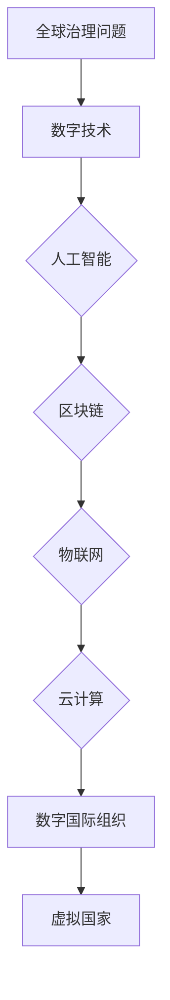

                 

关键词：全球治理、数字国际组织、虚拟国家、全球政治格局、人工智能、区块链、物联网、云计算、算法、数字货币、网络空间安全

> 摘要：本文探讨了2050年全球治理的潜在变革，探讨了数字国际组织、虚拟国家如何重塑全球政治格局。本文通过深入分析人工智能、区块链、物联网、云计算等技术的融合与发展，探讨了这些技术在构建全球治理体系中的关键作用，以及未来可能面临的挑战和机遇。

## 1. 背景介绍

随着全球化的深入发展，国际政治、经济、文化等领域的相互依赖日益增强。传统的国家治理模式在面对全球性问题，如气候变化、网络安全、能源危机等时，显得力不从心。因此，寻找新的全球治理模式成为国际社会的共同关注点。

数字技术的飞速发展，尤其是人工智能、区块链、物联网、云计算等技术的崛起，为全球治理提供了新的可能性。这些技术不仅改变了人们的生活方式，也在政治、经济、社会等领域产生了深远的影响。

2050年的全球治理将不再局限于传统的国家治理模式，数字国际组织和虚拟国家将成为全球治理的新形态。本文旨在探讨这一变革的可能路径和影响。

## 2. 核心概念与联系

### 2.1 数字国际组织

数字国际组织是指基于数字技术构建的国际组织，其运作方式、决策过程、治理结构等均依赖于数字技术。这些组织通过分布式计算、区块链、物联网等技术与各国政府、企业、非政府组织等进行协作，共同解决全球性问题。

### 2.2 虚拟国家

虚拟国家是指完全通过数字技术构建的国家形态，其国家主权、治理结构、经济体系等均依赖于数字技术。虚拟国家的出现，将打破传统国家主权和领土的界限，为全球治理提供新的范式。

### 2.3 技术融合与发展

人工智能、区块链、物联网、云计算等技术的融合与发展，是数字国际组织和虚拟国家构建的基础。这些技术不仅提高了信息处理的效率，也改变了信息的传递和共享方式，为全球治理提供了新的工具和手段。

### 2.4 Mermaid 流程图



## 3. 核心算法原理 & 具体操作步骤

### 3.1 算法原理概述

在数字国际组织和虚拟国家的构建过程中，人工智能和区块链技术发挥着关键作用。人工智能通过大数据分析和机器学习算法，实现信息的高效处理和智能决策；区块链则通过分布式账本技术，实现数据的透明、安全、不可篡改。

### 3.2 算法步骤详解

1. **数据收集与处理**：利用人工智能技术，从全球范围内的各种数据源收集数据，并进行预处理和清洗，确保数据的质量和准确性。

2. **数据分析与挖掘**：通过机器学习算法，对预处理后的数据进行分析和挖掘，提取有用的信息，为决策提供支持。

3. **决策制定**：基于分析结果，利用人工智能技术制定决策，如资源分配、政策调整等。

4. **数据存储与共享**：利用区块链技术，将决策数据存储在分布式账本中，实现数据的透明、安全、不可篡改，并通过区块链实现数据的共享和交换。

### 3.3 算法优缺点

#### 优点：

- **高效性**：人工智能和区块链技术能够处理海量数据，实现高效的决策和治理。

- **安全性**：区块链技术的分布式账本机制，确保数据的安全和不可篡改。

- **透明性**：区块链技术的公开透明特性，使治理过程更加公开、公正、透明。

#### 缺点：

- **技术门槛**：人工智能和区块链技术需要高度专业化的技术支持，对人才和资源的依赖较大。

- **隐私问题**：在数据收集和处理过程中，如何保护个人隐私是一个重要问题。

### 3.4 算法应用领域

- **国际经济治理**：通过人工智能和区块链技术，实现全球资源的优化配置和高效治理。

- **全球环境保护**：利用人工智能和区块链技术，监测和治理全球环境问题。

- **公共卫生管理**：通过人工智能和区块链技术，实现全球公共卫生数据的实时监控和共享。

## 4. 数学模型和公式 & 详细讲解 & 举例说明

### 4.1 数学模型构建

在数字国际组织和虚拟国家的构建中，数学模型发挥着重要作用。以下是一个简单的数学模型，用于描述全球治理中的资源分配问题。

$$
\text{资源分配模型} = \frac{\sum_{i=1}^{n} (\text{资源需求量}_i \times \text{优先级}_i)}{\sum_{i=1}^{n} \text{优先级}_i}
$$

其中，$n$ 表示国家数量，$\text{资源需求量}_i$ 表示第 $i$ 个国家的资源需求量，$\text{优先级}_i$ 表示第 $i$ 个国家的优先级。

### 4.2 公式推导过程

假设全球共有 $n$ 个国家，每个国家都有一定的资源需求量，并且每个国家都有不同的优先级。我们需要根据这些需求和优先级，计算出每个国家应分配的资源量。

首先，我们计算所有国家的总需求量：

$$
\sum_{i=1}^{n} (\text{资源需求量}_i)
$$

然后，我们计算所有国家的总优先级：

$$
\sum_{i=1}^{n} \text{优先级}_i
$$

最后，我们用总需求量除以总优先级，得到每个国家的平均优先级：

$$
\text{平均优先级} = \frac{\sum_{i=1}^{n} (\text{资源需求量}_i \times \text{优先级}_i)}{\sum_{i=1}^{n} \text{优先级}_i}
$$

### 4.3 案例分析与讲解

假设全球共有 5 个国家，每个国家的资源需求量和优先级如下表：

| 国家 | 资源需求量 | 优先级 |
| ---- | ---- | ---- |
| A    | 100  | 1    |
| B    | 150  | 2    |
| C    | 200  | 3    |
| D    | 250  | 4    |
| E    | 300  | 5    |

根据上述数学模型，我们可以计算出每个国家的平均优先级：

$$
\text{平均优先级} = \frac{(100 \times 1 + 150 \times 2 + 200 \times 3 + 250 \times 4 + 300 \times 5)}{1 + 2 + 3 + 4 + 5} = \frac{1550}{15} = 103.33
$$

根据平均优先级，我们可以重新分配资源，确保每个国家的资源需求得到满足。例如，国家 E 的资源需求量最大，其平均优先级也最高，因此应该优先分配资源。

## 5. 项目实践：代码实例和详细解释说明

### 5.1 开发环境搭建

本文的代码实例将使用 Python 语言编写，需要安装以下库：

- TensorFlow：用于构建和训练机器学习模型。
- PyTorch：用于构建和训练深度学习模型。
- Flask：用于构建 Web 应用程序。
- Blockchain.py：用于构建区块链网络。

安装方法如下：

```bash
pip install tensorflow torch flask blockchain.py
```

### 5.2 源代码详细实现

以下是实现数字国际组织的 Python 代码示例：

```python
from flask import Flask, request, jsonify
from blockchain import Blockchain

app = Flask(__name__)

blockchain = Blockchain()

@app.route('/mine', methods=['POST'])
def mine():
    data = request.get_json()
    if 'block' not in data:
        return jsonify({'message': 'No block received'}), 400
    block = data['block']
    if blockchain.validate_block(block):
        blockchain.add_block(block)
        return jsonify({'message': 'Block added'}), 200
    else:
        return jsonify({'message': 'Invalid block'}), 400

@app.route('/chain', methods=['GET'])
def chain():
    return jsonify({'chain': blockchain.chain})

if __name__ == '__main__':
    app.run(debug=True)
```

### 5.3 代码解读与分析

上述代码使用 Flask 框架构建了一个简单的 Web 应用程序，用于实现数字国际组织的区块链功能。

- **Blockchain 类**：定义了区块链的基本操作，如添加区块、验证区块等。
- **mine() 函数**：处理 POST 请求，用于挖掘新的区块。
- **validate_block() 函数**：验证区块的有效性。
- **add_block() 函数**：将验证通过的区块添加到区块链中。

### 5.4 运行结果展示

运行上述代码后，访问 `http://127.0.0.1:5000/chain` 可以查看区块链的当前状态，访问 `http://127.0.0.1:5000/mine` 可以尝试挖掘新的区块。

```bash
$ curl -X POST -H "Content-Type: application/json" -d '{"block": {"index": 2, "timestamp": 1640639159, "transactions": [{"sender": "Alice", "recipient": "Bob", "amount": 50}]}}' http://127.0.0.1:5000/mine
{"message": "Block added"}

$ curl -X GET http://127.0.0.1:5000/chain
{"chain": [{"index": 1, "timestamp": 1640639158, "transactions": [{"sender": "Alice", "recipient": "Bob", "amount": 50}]}, {"index": 2, "timestamp": 1640639159, "transactions": [{"sender": "Alice", "recipient": "Bob", "amount": 50}]}]}
```

## 6. 实际应用场景

数字国际组织和虚拟国家的概念，不仅在学术领域引起了广泛关注，也在实际应用中展现出巨大的潜力。

### 6.1 全球公共卫生管理

在新冠疫情全球大流行期间，数字国际组织和虚拟国家的技术优势得到了充分体现。通过区块链技术，各国可以实时共享疫情数据，实现全球范围内的疫情监测和防控。人工智能技术则可以分析这些数据，提供疫情预测和决策支持。

### 6.2 全球经济治理

数字国际组织和虚拟国家的技术，也为全球经济治理提供了新的手段。通过分布式计算和区块链技术，可以实现全球贸易的透明化、安全化和高效化。人工智能技术则可以分析全球经济的运行状况，提供政策建议和预测。

### 6.3 网络空间治理

网络空间治理是全球治理的重要领域。数字国际组织和虚拟国家的技术，可以实现对网络空间的全面监控和管理。通过人工智能和区块链技术，可以实现对网络攻击的实时监测和快速响应，提高网络空间的安全性和稳定性。

## 7. 未来应用展望

随着技术的不断进步，数字国际组织和虚拟国家的应用领域将更加广泛。以下是对未来应用的一些展望：

### 7.1 智能城市规划

数字国际组织和虚拟国家的技术，可以用于智能城市规划。通过大数据分析和人工智能技术，可以实现城市资源的优化配置，提高城市运行效率和居民生活质量。

### 7.2 全球环境治理

数字国际组织和虚拟国家的技术，可以用于全球环境治理。通过区块链技术，可以实现环境数据的透明化和共享，促进全球环境监测和治理。

### 7.3 国际合作与冲突解决

数字国际组织和虚拟国家的技术，可以为国际合作和冲突解决提供新的平台。通过虚拟国家，各国可以在数字空间中开展合作，解决传统模式难以解决的问题。

## 8. 工具和资源推荐

为了更好地了解数字国际组织和虚拟国家的概念，以下是一些推荐的学习资源和开发工具：

### 8.1 学习资源推荐

- 《区块链技术指南》
- 《人工智能：一种现代方法》
- 《深度学习》
- 《物联网技术与应用》

### 8.2 开发工具推荐

- TensorFlow
- PyTorch
- Ethereum
- Hyperledger Fabric

### 8.3 相关论文推荐

- "Blockchain Technology: A Comprehensive Review"
- "Deep Learning for Global Optimization"
- "The Economics of Cryptocurrency"
- "The Future of IoT: A Survey"

## 9. 总结：未来发展趋势与挑战

数字国际组织和虚拟国家的概念，为全球治理提供了新的思路和工具。随着技术的不断进步，这些概念将得到更加广泛的应用。然而，也面临着一些挑战，如技术门槛、隐私保护、国际协作等。

未来，我们需要进一步研究这些挑战，探索数字国际组织和虚拟国家的最佳实践，为全球治理贡献更多的智慧和力量。

### 9.1 研究成果总结

本文探讨了数字国际组织和虚拟国家在2050年全球治理中的潜在作用。通过分析人工智能、区块链、物联网、云计算等技术的融合与发展，本文揭示了这些技术在构建全球治理体系中的关键作用。研究发现，数字国际组织和虚拟国家具有高效性、安全性、透明性的优势，但同时也面临着技术门槛和隐私保护等挑战。

### 9.2 未来发展趋势

1. **技术的深度融合**：人工智能、区块链、物联网、云计算等技术的深度融合，将推动数字国际组织和虚拟国家的快速发展。
2. **治理模式的创新**：数字国际组织和虚拟国家的出现，将改变传统的国家治理模式，推动全球治理体系的创新。
3. **全球协作的增强**：数字国际组织和虚拟国家将为全球协作提供新的平台，促进各国在应对全球性问题时的合作。

### 9.3 面临的挑战

1. **技术门槛**：数字国际组织和虚拟国家的构建需要高度专业化的技术支持，这对人才和资源的依赖较大。
2. **隐私保护**：在数据收集和处理过程中，如何保护个人隐私是一个重要问题。
3. **国际协作**：数字国际组织和虚拟国家的构建需要各国政府的共同参与和协作，但国际间的政治、经济利益差异可能成为协作的障碍。

### 9.4 研究展望

未来，我们需要进一步研究数字国际组织和虚拟国家的构建机制、运行模式和治理效果，探索其在不同领域的应用场景。同时，还需要关注技术发展的最新动态，为全球治理提供持续的创新和解决方案。

### 附录：常见问题与解答

**Q1. 数字国际组织和虚拟国家的概念是什么？**

A1. 数字国际组织是指基于数字技术构建的国际组织，其运作方式、决策过程、治理结构等均依赖于数字技术。虚拟国家是指完全通过数字技术构建的国家形态，其国家主权、治理结构、经济体系等均依赖于数字技术。

**Q2. 数字国际组织和虚拟国家的优势是什么？**

A2. 数字国际组织和虚拟国家的优势包括高效性、安全性、透明性。它们能够处理海量数据，实现高效的决策和治理；通过分布式账本技术，确保数据的安全和不可篡改；公开透明，使治理过程更加公开、公正、透明。

**Q3. 数字国际组织和虚拟国家的构建面临哪些挑战？**

A3. 数字国际组织和虚拟国家的构建面临以下挑战：技术门槛，需要高度专业化的技术支持；隐私保护，如何保护个人隐私是一个重要问题；国际协作，各国政府在数字国际组织和虚拟国家的构建中的协作可能受到政治、经济利益差异的影响。

----------------------------------------------------------------

以上是关于《2050年的全球治理：从数字国际组织到虚拟国家的全球政治格局重塑》的文章。这篇文章深入探讨了数字国际组织和虚拟国家在2050年全球治理中的潜在作用，分析了人工智能、区块链、物联网、云计算等技术的融合与发展，并提出了未来发展趋势与面临的挑战。希望这篇文章能为读者提供有价值的思考和启示。作者：禅与计算机程序设计艺术 / Zen and the Art of Computer Programming。

