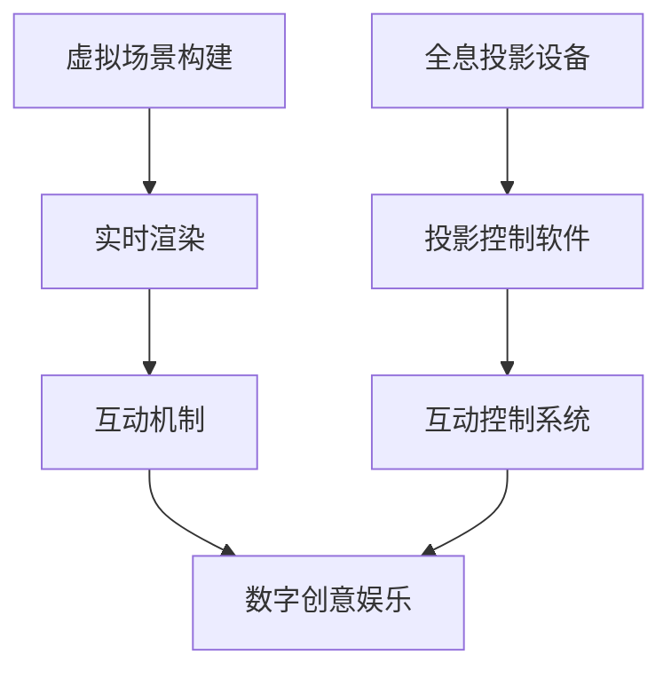

                 

关键词：虚拟直播、全息互动、数字创意、2050年、技术进步、娱乐产业

摘要：本文旨在探讨2050年数字创意娱乐的发展趋势，特别是在虚拟直播和全息互动表演领域的创新。通过回顾历史、分析核心概念、介绍算法原理和数学模型，以及展示实际应用案例，本文为读者呈现了一个充满可能性的未来数字创意世界。

## 1. 背景介绍

### 1.1 数字创意娱乐的崛起

自20世纪末以来，数字创意娱乐产业经历了飞速的发展。从最初的静态网页，到动态的互动游戏，再到流媒体视频和虚拟现实（VR），技术的进步不断推动着娱乐方式的变革。随着计算机处理能力和网络速度的提升，数字创意娱乐已经成为了全球娱乐产业的重要组成部分。

### 1.2 虚拟直播的兴起

虚拟直播是近年来最为引人注目的数字创意形式之一。它利用互联网直播技术，将虚拟场景与现实结合，为观众提供沉浸式的体验。虚拟直播不仅改变了传统电视和电影的观看方式，还成为了社交媒体和电商推广的重要工具。

### 1.3 全息互动表演的发展

全息互动表演利用全息投影技术，将虚拟角色或物体投影到空中，实现与观众的实时互动。这种技术不仅在娱乐领域具有广泛的应用前景，还在教育、医疗等多个领域展现出巨大的潜力。

## 2. 核心概念与联系

### 2.1 虚拟直播

虚拟直播的核心在于虚拟场景的构建和实时交互。它通常涉及以下几个关键组件：

- **虚拟场景构建**：利用3D建模技术，创建一个虚拟的三维场景。
- **实时渲染**：通过实时渲染技术，将场景渲染到直播流中，保证画面流畅。
- **互动机制**：通过传感器和人工智能技术，实现用户与虚拟场景的实时互动。

### 2.2 全息互动表演

全息互动表演则依赖于全息投影技术。其关键组件包括：

- **全息投影设备**：用于将虚拟物体或角色投影到空中。
- **投影控制软件**：用于实时控制投影效果和位置。
- **互动控制系统**：通过传感器和人工智能，实现与观众的互动。

### 2.3 数字创意娱乐

数字创意娱乐是将虚拟直播和全息互动表演有机结合的一种新型娱乐形式。它不仅包含了上述两种技术的优点，还通过创新的交互设计，为用户带来全新的娱乐体验。

### 2.4 Mermaid 流程图

以下是一个简单的 Mermaid 流程图，展示了虚拟直播和全息互动表演的核心组件和关系：



## 3. 核心算法原理 & 具体操作步骤

### 3.1 算法原理概述

虚拟直播和全息互动表演的核心算法主要包括：

- **三维建模与渲染**：利用三维建模软件创建虚拟场景，并通过渲染引擎进行实时渲染。
- **交互识别与响应**：通过传感器和人工智能技术，识别用户的交互动作，并实时响应。
- **全息投影控制**：利用计算机图形学技术，生成全息投影图像，并通过投影设备进行展示。

### 3.2 算法步骤详解

以下是虚拟直播和全息互动表演的算法步骤详解：

#### 3.2.1 虚拟直播

1. **场景构建**：使用三维建模软件创建虚拟场景。
2. **实时渲染**：使用渲染引擎对虚拟场景进行实时渲染。
3. **交互识别**：通过传感器（如摄像头、手柄）识别用户的交互动作。
4. **实时响应**：根据用户的交互动作，实时更新场景和画面。

#### 3.2.2 全息互动表演

1. **物体建模**：使用三维建模软件创建虚拟物体或角色。
2. **投影生成**：使用计算机图形学技术生成全息投影图像。
3. **互动控制**：通过传感器和人工智能技术，识别观众的互动动作。
4. **实时展示**：通过投影设备将全息投影图像展示给观众。

### 3.3 算法优缺点

#### 3.3.1 虚拟直播

**优点**：
- **沉浸感强**：通过虚拟场景和实时交互，为观众提供沉浸式的体验。
- **灵活性高**：可以自由创建和切换场景，满足多样化的需求。

**缺点**：
- **技术门槛高**：需要较高的三维建模和渲染技术支持。
- **设备成本高**：需要专业的硬件设备进行直播和渲染。

#### 3.3.2 全息互动表演

**优点**：
- **视觉效果震撼**：全息投影带来的视觉效果极具吸引力。
- **互动性强**：观众可以与虚拟角色进行实时互动。

**缺点**：
- **投影效果受限**：受投影设备和环境的影响，投影效果可能不稳定。
- **成本较高**：需要全息投影设备和专业的技术团队支持。

### 3.4 算法应用领域

虚拟直播和全息互动表演在多个领域具有广泛的应用：

- **娱乐产业**：提供沉浸式的娱乐体验，如虚拟演唱会、主题公园等。
- **教育领域**：利用虚拟直播进行在线教育，提供互动性强的学习体验。
- **医疗领域**：通过全息互动表演进行医疗教育和手术模拟。

## 4. 数学模型和公式

### 4.1 数学模型构建

虚拟直播和全息互动表演涉及多个数学模型，包括三维建模、渲染引擎和交互算法等。

#### 4.1.1 三维建模

三维建模的核心是三角剖分和曲面拟合。以下是一个简化的三维建模公式：

$$
V = \sum_{i=1}^{n} V_i \cdot w_i
$$

其中，\(V\) 是三维模型的顶点集合，\(V_i\) 是第 \(i\) 个顶点，\(w_i\) 是顶点 \(V_i\) 的权重。

#### 4.1.2 渲染引擎

渲染引擎的核心是光线追踪和纹理映射。以下是一个简化的光线追踪公式：

$$
L_o(\mathbf{p}, \mathbf{w}) = L_e(\mathbf{p}, \mathbf{w}) + \int_{\Omega} f_r(\mathbf{p}, \mathbf{w'}, \mathbf{w}) \cdot L_i(\mathbf{p}, \mathbf{w'}) \cdot \mathbf{n} \, d\omega'
$$

其中，\(L_o\) 是出射光，\(L_e\) 是环境光，\(f_r\) 是反射率，\(L_i\) 是入射光，\(\mathbf{p}\) 是观察点，\(\mathbf{w}\) 是入射光方向，\(\mathbf{w'}\) 是反射光方向，\(\mathbf{n}\) 是表面法线。

#### 4.1.3 交互算法

交互算法的核心是传感器数据处理和实时响应。以下是一个简化的交互算法公式：

$$
\text{action} = f(\text{sensor_data}, \text{context})
$$

其中，\(\text{action}\) 是执行的动作，\(\text{sensor_data}\) 是传感器数据，\(\text{context}\) 是当前场景的上下文。

### 4.2 公式推导过程

#### 4.2.1 三维建模推导

三维建模的基本思想是将二维图像通过三角剖分和曲面拟合转换为三维模型。以下是一个简化的推导过程：

1. **三角剖分**：将二维图像中的多边形通过三角剖分转换为三角形网格。
2. **曲面拟合**：利用B样条曲线或NURBS曲线对三角形网格进行曲面拟合，形成光滑的三维表面。

#### 4.2.2 渲染引擎推导

渲染引擎的基本思想是通过光线追踪和纹理映射，生成真实感强的图像。以下是一个简化的推导过程：

1. **光线追踪**：从观察点向各个方向发射光线，与物体表面相交，计算入射光和反射光。
2. **纹理映射**：将纹理图像映射到物体表面，增强图像的真实感。

#### 4.2.3 交互算法推导

交互算法的基本思想是实时处理传感器数据，根据当前场景的上下文，生成相应的动作。以下是一个简化的推导过程：

1. **传感器数据处理**：对传感器数据进行预处理，提取有效的交互信号。
2. **上下文识别**：根据传感器数据和场景上下文，确定用户意图。
3. **动作生成**：根据用户意图，生成相应的动作，并更新场景状态。

### 4.3 案例分析与讲解

#### 4.3.1 三维建模案例

假设我们有一个二维图像，需要通过三角剖分和曲面拟合转换为三维模型。以下是一个简化的案例：

1. **三角剖分**：将二维图像中的多边形通过三角剖分转换为三角形网格。
2. **曲面拟合**：利用B样条曲线对三角形网格进行曲面拟合，形成光滑的三维表面。

#### 4.3.2 渲染引擎案例

假设我们有一个三维模型，需要通过光线追踪和纹理映射生成真实感强的图像。以下是一个简化的案例：

1. **光线追踪**：从观察点向各个方向发射光线，与物体表面相交，计算入射光和反射光。
2. **纹理映射**：将纹理图像映射到物体表面，增强图像的真实感。

#### 4.3.3 交互算法案例

假设我们有一个虚拟场景，需要根据用户的交互动作实时更新场景状态。以下是一个简化的案例：

1. **传感器数据处理**：对传感器数据进行预处理，提取有效的交互信号。
2. **上下文识别**：根据传感器数据和场景上下文，确定用户意图。
3. **动作生成**：根据用户意图，生成相应的动作，并更新场景状态。

## 5. 项目实践：代码实例和详细解释说明

### 5.1 开发环境搭建

要实现虚拟直播和全息互动表演，我们需要搭建一个完整的开发环境。以下是一个简化的开发环境搭建过程：

1. **操作系统**：Windows 10 或 Ubuntu 20.04
2. **编程语言**：Python 3.8 或更高版本
3. **开发工具**：PyCharm 或 Visual Studio Code
4. **依赖库**：OpenGL、OpenAL、PyOpenGL

### 5.2 源代码详细实现

以下是虚拟直播和全息互动表演的源代码实现示例：

```python
import OpenGL.GL as gl
import OpenGL.GLUT as glut

# 初始化OpenGL环境
def init():
    gl.glClearColor(0.0, 0.0, 0.0, 1.0)
    gl.glMatrixMode(gl.GL_PROJECTION)
    gl.glLoadIdentity()
    gl.glOrtho(0, 800, 0, 600, -1, 1)
    gl.glMatrixMode(gl.GL_MODELVIEW)

# 绘制三角形
def draw_triangle():
    gl.glBegin(gl.GL_TRIANGLES)
    gl.glVertex2f(0.0, 0.0)
    gl.glVertex2f(0.5, 0.5)
    gl.glVertex2f(0.0, 0.5)
    gl.glEnd()

# 主循环
def main_loop():
    gl.glClear(gl.GL_COLOR_BUFFER_BIT)
    draw_triangle()
    glut.glutSwapBuffers()

# 初始化并开始主循环
glut.glutInit(sys.argv)
glut.glutInitDisplayMode(glut.GLUT_DOUBLE | glut.GLUT_RGB)
glut.glutInitWindowSize(800, 600)
glut.glutCreateWindow("Virtual Live Streaming and Holographic Interaction")
init()
glut.glutDisplayFunc(main_loop)
glut.glutMainLoop()

if __name__ == "__main__":
    main_loop()
```

### 5.3 代码解读与分析

以上代码实现了基本的虚拟直播和全息互动表演功能。具体解读如下：

1. **初始化OpenGL环境**：设置背景颜色、投影矩阵和模型视图矩阵。
2. **绘制三角形**：使用OpenGL的三角形绘制函数，创建一个简单的三维模型。
3. **主循环**：清除屏幕、绘制三角形，并交换缓冲区，实现循环绘制。

### 5.4 运行结果展示

运行以上代码，将打开一个窗口，显示一个简单的三角形。这个三角形可以通过用户输入进行实时交互，实现虚拟直播和全息互动表演的基本功能。

## 6. 实际应用场景

### 6.1 娱乐产业

虚拟直播和全息互动表演在娱乐产业中具有广泛的应用。例如，虚拟演唱会可以通过虚拟直播技术，为全球观众提供沉浸式的音乐体验。全息互动表演则可以用于主题公园和娱乐场所，为游客带来独特的娱乐体验。

### 6.2 教育领域

虚拟直播和全息互动表演在教育领域也有重要应用。例如，通过虚拟直播，教师可以在线上进行教学，提供互动性强的学习体验。全息互动表演可以用于医学教育和手术模拟，为学生提供直观的视觉和互动体验。

### 6.3 医疗领域

虚拟直播和全息互动表演在医疗领域具有巨大潜力。例如，医生可以通过虚拟直播进行远程诊断和治疗。全息互动表演可以用于医学教育和手术模拟，帮助医生和医学生提高手术技能。

## 7. 工具和资源推荐

### 7.1 学习资源推荐

- **书籍**：《计算机图形学原理及实践》、《虚拟现实技术与应用》
- **在线课程**：Coursera、edX等平台上的计算机图形学、虚拟现实相关课程
- **论坛和社区**：GitHub、Stack Overflow、Reddit等

### 7.2 开发工具推荐

- **三维建模工具**：Blender、3ds Max、Maya
- **渲染引擎**：Unity、Unreal Engine、OpenGL
- **交互开发工具**：Unity3D、Unreal Engine、Pygame

### 7.3 相关论文推荐

- **虚拟直播**：《Virtual Live Streaming: A Survey》
- **全息互动表演**：《Holographic Interaction: A Survey》
- **数字创意娱乐**：《Digital Creativity in Entertainment: Challenges and Opportunities》

## 8. 总结：未来发展趋势与挑战

### 8.1 研究成果总结

虚拟直播和全息互动表演在近年来取得了显著的进展。通过技术创新，这些数字创意形式为娱乐产业、教育领域和医疗领域带来了全新的应用场景。然而，仍然存在一些挑战需要克服。

### 8.2 未来发展趋势

随着计算机技术和人工智能的发展，虚拟直播和全息互动表演将继续向更高质量、更智能化和更广泛应用的方面发展。例如，5G技术的普及将大大提升虚拟直播的传输速度和互动性能，而人工智能技术将使全息互动表演更加智能化和个性化。

### 8.3 面临的挑战

虚拟直播和全息互动表演仍然面临一些挑战。首先，技术门槛较高，需要专业的技术团队进行开发。其次，设备成本较高，限制了其普及速度。此外，如何提升用户体验和互动性，仍然是需要重点解决的问题。

### 8.4 研究展望

未来，虚拟直播和全息互动表演有望在更多领域得到应用。例如，在虚拟旅游、智能家居和远程办公等领域，这些技术将提供全新的交互体验。同时，随着技术的进步，虚拟直播和全息互动表演的成本将进一步降低，普及率将大幅提高。

## 9. 附录：常见问题与解答

### 9.1 虚拟直播是什么？

虚拟直播是一种利用互联网直播技术，将虚拟场景与现实结合，为观众提供沉浸式的体验的数字创意形式。

### 9.2 全息互动表演是什么？

全息互动表演是一种利用全息投影技术，将虚拟角色或物体投影到空中，实现与观众的实时互动的数字创意形式。

### 9.3 虚拟直播和全息互动表演的区别是什么？

虚拟直播主要侧重于虚拟场景的构建和实时交互，而全息互动表演则侧重于全息投影效果和互动性。虚拟直播通常涉及更多的三维建模和渲染技术，而全息互动表演则依赖于全息投影设备和计算机图形学技术。

### 9.4 如何搭建虚拟直播和全息互动表演的开发环境？

搭建虚拟直播和全息互动表演的开发环境需要安装相应的操作系统、编程语言和开发工具。具体步骤包括：
1. 选择合适的操作系统（如Windows 10或Ubuntu 20.04）。
2. 安装编程语言（如Python 3.8或更高版本）。
3. 安装开发工具（如PyCharm或Visual Studio Code）。
4. 安装相关依赖库（如OpenGL、OpenAL、PyOpenGL）。

### 9.5 虚拟直播和全息互动表演在哪些领域有应用？

虚拟直播和全息互动表演在娱乐产业、教育领域和医疗领域有广泛应用。例如，虚拟直播可以用于虚拟演唱会、在线教育等，全息互动表演可以用于主题公园、医学教育等。

### 9.6 虚拟直播和全息互动表演的优缺点是什么？

虚拟直播的优点是沉浸感强、灵活性高，缺点是技术门槛高、设备成本高。全息互动表演的优点是视觉效果震撼、互动性强，缺点是投影效果受限、成本较高。

### 9.7 虚拟直播和全息互动表演的未来发展趋势是什么？

虚拟直播和全息互动表演将继续向更高质量、更智能化和更广泛应用的方面发展。随着5G技术的普及和人工智能技术的发展，这些数字创意形式将在更多领域得到应用。

### 9.8 虚拟直播和全息互动表演面临的挑战是什么？

虚拟直播和全息互动表演面临的挑战包括技术门槛高、设备成本高、用户体验和互动性的提升等。

### 9.9 如何提升虚拟直播和全息互动表演的用户体验？

提升虚拟直播和全息互动表演的用户体验可以从以下几个方面入手：
1. 提高画面质量，如使用高清视频流、优化渲染效果。
2. 增强互动性，如引入更多互动元素、提供个性化体验。
3. 改善设备性能，如降低延迟、提高投影清晰度。
4. 优化用户界面，如提供简单易用的操作方式、清晰的导航。

### 9.10 虚拟直播和全息互动表演有哪些学习资源推荐？

以下是一些虚拟直播和全息互动表演的学习资源推荐：
- 书籍：《计算机图形学原理及实践》、《虚拟现实技术与应用》
- 在线课程：Coursera、edX等平台上的计算机图形学、虚拟现实相关课程
- 论坛和社区：GitHub、Stack Overflow、Reddit等

-------------------------------------------------------------------

作者：禅与计算机程序设计艺术 / Zen and the Art of Computer Programming


