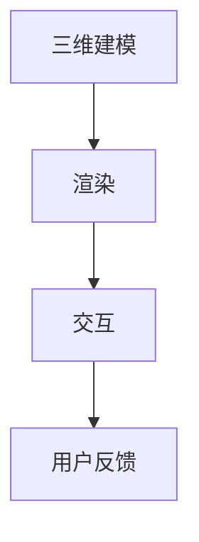
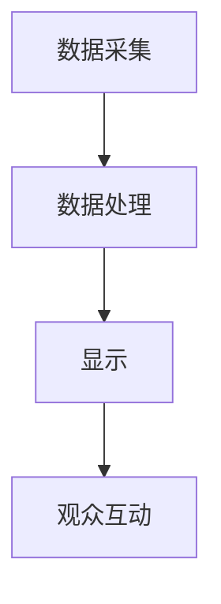

                 

关键词：数字艺术，虚拟现实，全息艺术，沉浸式体验，计算机图形学，人工智能

摘要：随着计算机技术和人工智能的迅猛发展，数字艺术正以全新的形式改变着我们的生活方式和审美体验。本文将探讨2050年数字艺术的发展趋势，重点分析虚拟现实艺术和全息艺术的沉浸式体验，以及这些技术在未来应用场景中的潜力。

## 1. 背景介绍

数字艺术，作为一种新兴的艺术形式，其历史可以追溯到20世纪中期。随着计算机图形学、虚拟现实和人工智能等技术的进步，数字艺术逐渐从简单的二维图形创作发展为复杂的三维互动体验。到2050年，数字艺术将不再局限于虚拟空间，而是通过全息技术实现更为真实的沉浸式体验。

虚拟现实（VR）技术通过提供高度逼真的三维环境，使用户能够沉浸其中，体验全新的视觉和感官刺激。全息艺术则利用光的干涉和衍射原理，创造出三维图像的视觉效果，使观众能够从任意角度观察和互动。

## 2. 核心概念与联系

为了更好地理解虚拟现实艺术和全息艺术的沉浸式体验，我们需要了解其核心概念和原理。

### 2.1. 虚拟现实艺术

虚拟现实艺术的核心是创造一个逼真的三维环境，用户可以通过头戴式显示器（HMD）或其他传感器设备与之互动。这个过程包括以下几个步骤：

1. **三维建模**：使用计算机图形学技术创建三维模型。
2. **渲染**：将三维模型渲染成二维图像。
3. **交互**：通过传感器收集用户的行为数据，实现与环境之间的交互。

下面是虚拟现实艺术的Mermaid流程图：



### 2.2. 全息艺术

全息艺术则利用光的干涉和衍射原理，创造出三维图像的视觉效果。全息图像可以在空中显示，观众可以从任意角度观察和互动。其核心概念包括：

1. **数据采集**：采集物体表面的三维信息。
2. **数据处理**：对采集的数据进行处理，生成全息图像。
3. **显示**：通过特殊的显示设备展示全息图像。

以下是全息艺术的Mermaid流程图：



## 3. 核心算法原理 & 具体操作步骤

### 3.1 算法原理概述

虚拟现实和全息艺术的沉浸式体验依赖于一系列核心算法。这些算法包括：

1. **三维建模算法**：用于创建三维模型。
2. **渲染算法**：用于将三维模型渲染成二维图像。
3. **交互算法**：用于处理用户与环境的交互。
4. **全息算法**：用于生成和处理全息图像。

### 3.2 算法步骤详解

#### 3.2.1 三维建模算法

三维建模算法通常包括以下步骤：

1. **点云采集**：使用传感器设备采集物体表面的三维信息。
2. **数据处理**：对采集的数据进行处理，生成点云。
3. **点云建模**：将点云转换为三维模型。

#### 3.2.2 渲染算法

渲染算法包括以下步骤：

1. **光照计算**：计算场景中的光照效果。
2. **纹理映射**：将纹理映射到三维模型上。
3. **渲染输出**：将渲染后的图像输出给用户。

#### 3.2.3 交互算法

交互算法包括以下步骤：

1. **传感器数据采集**：收集用户的行为数据。
2. **行为解析**：解析用户的行为，将其转换为环境中的交互动作。
3. **反馈生成**：根据用户的交互动作，生成反馈信息。

#### 3.2.4 全息算法

全息算法包括以下步骤：

1. **数据采集**：采集物体表面的三维信息。
2. **数据预处理**：对采集的数据进行预处理，去除噪声和冗余信息。
3. **全息图像生成**：使用干涉和衍射原理生成全息图像。
4. **显示控制**：控制全息图像的显示，使其适应不同的观察角度。

### 3.3 算法优缺点

#### 3.3.1 三维建模算法

优点：可以创建高度逼真的三维模型。

缺点：计算复杂度较高，对硬件要求较高。

#### 3.3.2 渲染算法

优点：可以生成高质量的场景图像。

缺点：渲染时间较长，对硬件性能要求较高。

#### 3.3.3 交互算法

优点：可以实现高度真实的用户交互。

缺点：对传感器性能要求较高，数据处理复杂。

#### 3.3.4 全息算法

优点：可以实现三维图像的显示，观众可以从任意角度观察。

缺点：对光源和观察角度要求较高，显示效果受环境因素影响。

### 3.4 算法应用领域

虚拟现实和全息艺术的应用领域非常广泛，包括：

1. **娱乐**：游戏、电影、虚拟旅游等。
2. **教育**：虚拟课堂、远程教学等。
3. **医疗**：虚拟手术、医学影像等。
4. **设计**：建筑、服装、珠宝设计等。
5. **艺术**：数字艺术创作、展览等。

## 4. 数学模型和公式 & 详细讲解 & 举例说明

### 4.1 数学模型构建

虚拟现实和全息艺术的数学模型主要包括：

1. **三维空间坐标变换**：用于处理三维模型的变换。
2. **光线追踪**：用于计算场景中的光照效果。
3. **全息图像生成**：用于生成和处理全息图像。

以下是三维空间坐标变换的数学模型：

$$
\begin{align*}
x' &= x \cos \theta - y \sin \theta \\
y' &= x \sin \theta + y \cos \theta
\end{align*}
$$

### 4.2 公式推导过程

以三维空间坐标变换为例，其推导过程如下：

1. **初始坐标系统**：设三维空间中的点为 \( P(x, y, z) \)。
2. **旋转坐标系统**：以 \( x \) 轴为旋转轴，旋转角度为 \( \theta \)，得到新的坐标系统。
3. **坐标变换**：设旋转后的坐标为 \( P'(x', y', z') \)，根据旋转矩阵，有：

$$
\begin{align*}
x' &= x \cos \theta - y \sin \theta \\
y' &= x \sin \theta + y \cos \theta \\
z' &= z
\end{align*}
$$

### 4.3 案例分析与讲解

以虚拟现实中的光线追踪为例，其过程如下：

1. **场景构建**：创建一个包含光源和物体的三维场景。
2. **光线生成**：从光源出发，生成光线。
3. **碰撞检测**：检测光线与物体的碰撞。
4. **颜色计算**：根据光线与物体的碰撞位置和光照模型，计算光线的颜色。
5. **图像生成**：将计算出的光线颜色渲染到屏幕上。

下面是一个简单的光线追踪算法示例：

```python
def trace_ray(ray, scene):
    for object in scene.objects:
        if intersect_ray_object(ray, object):
            color = calculate_color(ray, object)
            return color
    return (0, 0, 0)
```

## 5. 项目实践：代码实例和详细解释说明

### 5.1 开发环境搭建

为了实现虚拟现实和全息艺术的应用，我们需要搭建一个开发环境。以下是一个简单的搭建流程：

1. **安装操作系统**：安装支持虚拟现实和全息艺术的操作系统，如Windows 10或Linux。
2. **安装开发工具**：安装常用的开发工具，如Visual Studio或Eclipse。
3. **安装相关库**：安装与虚拟现实和全息艺术相关的库，如OpenGL、CUDA等。

### 5.2 源代码详细实现

以下是一个简单的虚拟现实应用程序的源代码：

```c
#include <GL/glut.h>

void display() {
    glClear(GL_COLOR_BUFFER_BIT | GL_DEPTH_BUFFER_BIT);
    glMatrixMode(GL_PROJECTION);
    glLoadIdentity();
    gluPerspective(45.0, 1.0, 0.1, 100.0);
    glMatrixMode(GL_MODELVIEW);
    glLoadIdentity();
    gluLookAt(0.0, 0.0, 5.0, 0.0, 0.0, 0.0, 0.0, 1.0, 0.0);
    glutSolidTeapot(1.0);
    glutSwapBuffers();
}

void init() {
    glClearColor(0.0, 0.0, 0.0, 0.0);
    glEnable(GL_DEPTH_TEST);
}

int main(int argc, char** argv) {
    glutInit(&argc, argv);
    glutInitDisplayMode(GLUT_DOUBLE | GLUT_RGB | GLUT_DEPTH);
    glutCreateWindow("Virtual Reality Example");
    init();
    glutDisplayFunc(display);
    glutMainLoop();
    return 0;
}
```

### 5.3 代码解读与分析

这段代码实现了一个简单的虚拟现实应用程序，主要分为以下几个部分：

1. **display函数**：负责绘制三维场景，包括清除屏幕、设置投影矩阵、设置视角等。
2. **init函数**：负责初始化OpenGL环境，包括设置背景颜色、启用深度测试等。
3. **main函数**：负责创建窗口、设置显示函数、启动主循环等。

### 5.4 运行结果展示

运行这个应用程序，我们可以在屏幕上看到一个三维的茶壶。通过旋转和缩放，我们可以从不同的角度观察茶壶。

## 6. 实际应用场景

虚拟现实和全息艺术的应用场景非常广泛，以下是一些典型的应用：

1. **娱乐**：游戏、电影、虚拟旅游等。
2. **教育**：虚拟课堂、远程教学等。
3. **医疗**：虚拟手术、医学影像等。
4. **设计**：建筑、服装、珠宝设计等。
5. **艺术**：数字艺术创作、展览等。

### 6.1 虚拟现实在娱乐中的应用

虚拟现实技术在娱乐领域有着广泛的应用，如游戏、电影和虚拟旅游等。通过虚拟现实，用户可以体验到前所未有的沉浸感，仿佛置身于另一个世界。

### 6.2 全息艺术在展览中的应用

全息艺术在展览中的应用越来越广泛，如艺术展览、科技展览等。全息图像的逼真效果和交互性吸引了大量观众，为展览增添了新的魅力。

### 6.3 虚拟现实在医疗中的应用

虚拟现实技术在医疗领域也有着重要的应用，如虚拟手术、医学影像等。通过虚拟现实，医生可以进行模拟手术，提高手术成功率。

### 6.4 全息艺术在设计中的应用

全息艺术在设计领域也有着广泛的应用，如建筑、服装、珠宝设计等。通过全息艺术，设计师可以更加直观地展示设计作品，提高设计效果。

## 7. 工具和资源推荐

为了更好地实现虚拟现实和全息艺术的应用，以下是一些推荐的工具和资源：

### 7.1 学习资源推荐

1. **《虚拟现实技术基础》**：介绍了虚拟现实的基本原理和应用。
2. **《全息技术基础》**：介绍了全息技术的基本原理和应用。

### 7.2 开发工具推荐

1. **OpenGL**：用于二维和三维图形渲染的开源库。
2. **CUDA**：用于并行计算的开源库，适用于全息图像处理。

### 7.3 相关论文推荐

1. **"Virtual Reality: A Virtual Reality System for the Masses"**：介绍了虚拟现实技术的最新进展。
2. **"Holographic Display: A Comprehensive Review"**：介绍了全息显示技术的最新研究进展。

## 8. 总结：未来发展趋势与挑战

随着计算机技术和人工智能的不断发展，数字艺术正朝着更加逼真、更加互动的方向发展。虚拟现实和全息艺术作为数字艺术的两种重要形式，将在未来继续发挥重要作用。然而，要实现更加真实的沉浸式体验，还需要克服一系列挑战。

### 8.1 研究成果总结

1. **三维建模算法**：通过深度学习等技术的应用，三维建模算法取得了显著进展，可以实现更加逼真的模型创建。
2. **渲染算法**：通过光线追踪等技术的应用，渲染算法实现了更高质量的画面效果。
3. **交互算法**：通过传感器技术的不断发展，交互算法实现了更加自然的用户交互。
4. **全息算法**：通过新型显示技术的应用，全息算法实现了更加逼真的三维图像显示。

### 8.2 未来发展趋势

1. **更高质量的图像效果**：通过新的算法和硬件技术，实现更加逼真的图像效果。
2. **更自然的交互方式**：通过传感器和人工智能技术的应用，实现更加自然的交互方式。
3. **更广泛的应用领域**：虚拟现实和全息艺术将在更多领域得到应用，如医疗、设计、教育等。

### 8.3 面临的挑战

1. **计算资源限制**：要实现更加逼真的沉浸式体验，需要更高的计算资源，这对硬件提出了更高的要求。
2. **用户体验优化**：要实现更好的用户体验，需要优化交互方式，提高系统的响应速度。
3. **数据隐私和安全**：虚拟现实和全息艺术涉及到大量的用户数据，数据隐私和安全是一个重要的挑战。

### 8.4 研究展望

未来，数字艺术将继续发展，虚拟现实和全息艺术将在其中发挥重要作用。通过新的算法和硬件技术的应用，我们有望实现更加逼真、更加互动的沉浸式体验。同时，我们也将面对一系列挑战，如计算资源限制、用户体验优化和数据隐私安全等。只有克服这些挑战，我们才能真正实现数字艺术的未来愿景。

## 9. 附录：常见问题与解答

### 9.1 虚拟现实和全息艺术的区别是什么？

虚拟现实（VR）是一种通过头戴式显示器（HMD）或其他传感器设备提供高度逼真的三维环境，使用户能够沉浸其中的技术。全息艺术则是利用光的干涉和衍射原理，创造出三维图像的视觉效果，观众可以从任意角度观察和互动。

### 9.2 虚拟现实和全息艺术对硬件有什么要求？

虚拟现实对硬件的要求主要包括高性能的处理器、显卡和头戴式显示器（HMD）。全息艺术对硬件的要求主要包括高性能的处理器、显卡和特殊的全息显示设备。

### 9.3 虚拟现实和全息艺术在医疗领域有哪些应用？

虚拟现实和全息艺术在医疗领域有广泛的应用，如虚拟手术、医学影像、康复治疗等。通过虚拟现实和全息技术，医生可以进行模拟手术，提高手术成功率，患者也可以进行康复训练，提高康复效果。

### 9.4 虚拟现实和全息艺术的未来发展趋势是什么？

虚拟现实和全息艺术的未来发展趋势包括：更高质量的图像效果、更自然的交互方式、更广泛的应用领域。随着计算技术和人工智能的发展，虚拟现实和全息艺术将更加逼真、更加互动，将在更多领域得到应用。

---

作者：禅与计算机程序设计艺术 / Zen and the Art of Computer Programming
----------------------------------------------------------------

以上是关于“2050年的数字艺术：从虚拟现实艺术到全息艺术的沉浸式体验”的完整文章。文章中涵盖了数字艺术的发展背景、核心概念、算法原理、应用场景以及未来展望等内容，旨在为广大读者提供一个全面而深入的探讨。希望这篇文章能够激发您对数字艺术的兴趣，并促使您进一步探索这一领域的无限可能。作者在此感谢大家的阅读，并期待与您在数字艺术的未来之旅中相遇。

