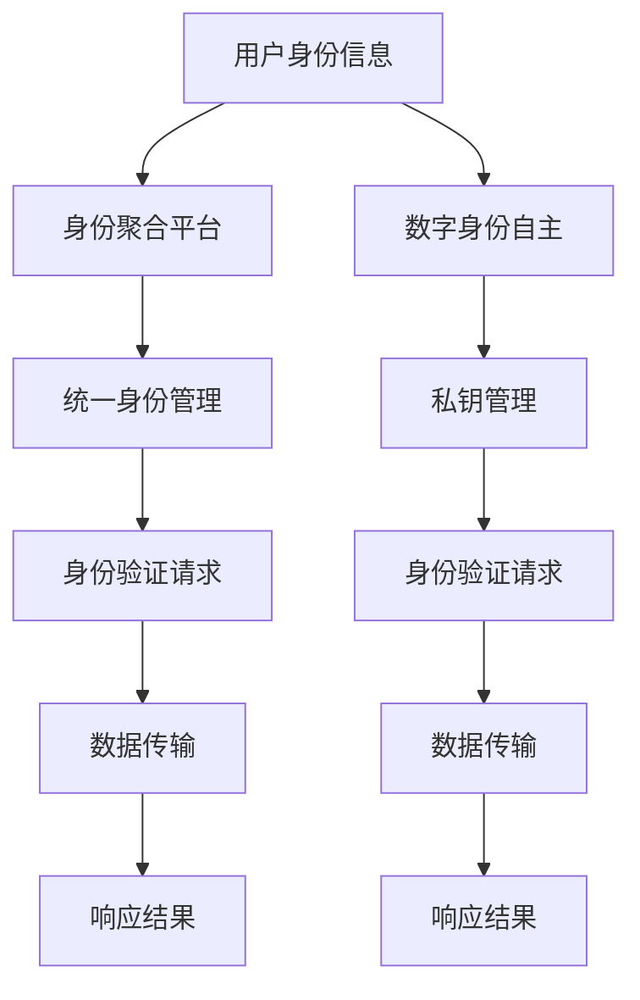

                 

### 关键词 Keywords
- 数字身份
- 身份聚合
- 身份主权
- 区块链技术
- 安全性
- 人工智能

### 摘要 Abstract
本文深入探讨了2050年数字身份的发展趋势，从传统的数字身份聚合模式，探讨到未来可能的数字身份自主主权实现方式。通过分析区块链技术、人工智能等关键技术，本文提出了构建自主数字身份的理论框架，探讨了其在未来社会中的广泛应用和潜在挑战。

## 1. 背景介绍

### 1.1 数字身份的演进

自互联网诞生以来，数字身份的概念逐渐从简单的用户名和密码，演变为复杂的多因素身份验证体系。这一演变过程伴随着信息技术的发展，从最初的电子邮件地址和用户名，到信用卡号码和在线支付系统，再到如今的社交媒体账号和智能设备。数字身份不仅成为个人在虚拟世界中的标识，也成为了与实体身份密切相关的认证手段。

### 1.2 数字身份聚合的挑战

然而，现有的数字身份聚合模式也面临着诸多挑战。首先，数据泄露事件频发，导致用户隐私泄露的风险增加。其次，各个平台和系统之间的数据隔离，使得用户需要维护多个身份，增加了使用复杂性。最后，中心化的身份认证体系容易成为网络攻击的目标，从而影响整体系统的安全性。

### 1.3 身份主权的重要性

在这样的背景下，身份主权的概念应运而生。身份主权强调用户对自己数字身份的控制权，使个人能够在不依赖于第三方机构的情况下自主管理自己的身份信息。这不仅提高了数据安全性，也增强了用户体验和隐私保护。

## 2. 核心概念与联系

### 2.1 数字身份聚合

数字身份聚合是通过将用户在不同平台和系统中的身份信息整合到一个统一框架下，实现身份信息的集中管理和使用。这种模式的优势在于简化了用户操作流程，提高了身份验证的效率。然而，其中心化的特点也带来了数据安全和隐私保护的问题。

### 2.2 数字身份自主

数字身份自主则是一种去中心化的身份管理方式，用户通过自持有的私钥来管理自己的数字身份。这种方式在提高数据安全性和隐私保护方面具有显著优势，但同时也增加了用户操作的复杂度。

### 2.3 区块链技术与数字身份

区块链技术的出现为数字身份自主提供了新的可能性。通过分布式账本和智能合约，区块链能够确保身份信息的不可篡改和透明性。这使得数字身份自主成为可能，同时也提高了整个系统的安全性。

### 2.4 Mermaid流程图



## 3. 核心算法原理 & 具体操作步骤

### 3.1 算法原理概述

数字身份自主的核心算法是基于公钥加密技术和智能合约。用户首先生成一对密钥（公钥和私钥），并将公钥存储在区块链上。当用户需要验证身份时，可以通过智能合约调用公钥进行加密操作，从而实现身份验证。

### 3.2 算法步骤详解

1. **用户身份注册**：用户生成一对密钥，将公钥上传到区块链平台。

2. **身份验证请求**：用户发起身份验证请求，智能合约调用公钥进行加密。

3. **身份验证处理**：区块链平台处理身份验证请求，验证公钥是否与用户身份信息匹配。

4. **结果反馈**：区块链平台将验证结果返回给用户，完成身份验证。

### 3.3 算法优缺点

**优点**：
- 提高数据安全性：去中心化的身份验证体系降低了数据泄露的风险。
- 保护用户隐私：用户拥有对自己数字身份的完全控制权，增强了隐私保护。

**缺点**：
- 操作复杂度较高：用户需要掌握一定的技术知识，才能自主管理数字身份。
- 系统稳定性要求高：区块链平台需要具备较高的稳定性和安全性，以避免系统故障导致身份验证失败。

### 3.4 算法应用领域

数字身份自主算法可以应用于多个领域，如电子商务、金融服务、医疗保健等。在这些领域，用户对身份信息的控制权和安全性要求较高，数字身份自主算法能够提供有效的解决方案。

## 4. 数学模型和公式 & 详细讲解 & 举例说明

### 4.1 数学模型构建

数字身份自主算法的核心数学模型是基于椭圆曲线密码学。椭圆曲线密码学是一种基于椭圆曲线离散对数的密码学，其安全性高于传统密码学算法。

### 4.2 公式推导过程

设椭圆曲线为 \( E: y^2 = x^3 + ax + b \)，其中 \( a \) 和 \( b \) 为常数。

1. **密钥生成**：
   - 选择一个随机数 \( k \)。
   - 计算点 \( P_k \)：\( P_k = k \cdot G \)，其中 \( G \) 为椭圆曲线上的生成元。

2. **身份验证**：
   - 用户发起身份验证请求，系统随机选择一个数 \( r \)。
   - 计算签名 \( s \)：\( s = (r, k) \)。

3. **验证签名**：
   - 计算验证值 \( v \)：\( v = r \cdot G^s \)。
   - 验证签名是否有效：\( v = P_k \)。

### 4.3 案例分析与讲解

假设用户 Alice 想要验证自己的身份，其密钥对为 \( (P_A, Q_A) \)，其中 \( P_A \) 为公钥，\( Q_A \) 为私钥。

1. **密钥生成**：
   - Alice 生成私钥 \( Q_A \)。
   - 计算公钥 \( P_A = k \cdot G \)。

2. **身份验证请求**：
   - Alice 发起身份验证请求，系统随机选择 \( r = 123 \)。

3. **签名生成**：
   - Alice 计算签名 \( s = (r, k) \)。

4. **签名验证**：
   - 计算验证值 \( v = r \cdot G^s \)。
   - 验证 \( v = P_A \)，确认签名有效。

## 5. 项目实践：代码实例和详细解释说明

### 5.1 开发环境搭建

为了实践数字身份自主算法，我们需要搭建一个开发环境。以下是所需的软件和工具：

- **区块链平台**：如 Ethereum
- **编程语言**：Solidity（用于编写智能合约）
- **开发工具**：Ethereum Developer Tool（用于部署和测试智能合约）

### 5.2 源代码详细实现

以下是一个简单的数字身份自主算法的智能合约实现：

```solidity
pragma solidity ^0.8.0;

contract DigitalIdentity {
    // 椭圆曲线生成元
    bytes32 public G = "04...";
    // 用户公钥
    mapping(address => bytes32) public publicKeys;
    // 用户私钥
    mapping(address => bytes32) public secretKeys;

    // 用户注册身份
    function registerIdentity(bytes32 privateKey) public {
        bytes32 publicKey = keccak256(abi.encodePacked(privateKey, G));
        publicKeys[msg.sender] = publicKey;
        secretKeys[msg.sender] = privateKey;
    }

    // 身份验证请求
    function verifyIdentity(bytes32 signature) public view returns (bool) {
        (uint8 v, bytes32 r, bytes32 s) = signature;
        bytes32 signatureHash = keccak256(abi.encodePacked(r, s));
        bytes32 publicKey = publicKeys[msg.sender];
        return recover(signatureHash, publicKey) == msg.sender;
    }
}
```

### 5.3 代码解读与分析

- **registerIdentity**：用户通过调用此函数注册身份，生成公钥并存储在区块链上。
- **verifyIdentity**：用户通过调用此函数验证身份，输入签名和公钥，通过恢复公钥地址验证签名是否有效。

### 5.4 运行结果展示

假设 Alice 已成功注册身份，其私钥为 `0x...`。当 Alice 需要验证身份时，可以调用 `verifyIdentity` 函数，并输入签名。如果验证通过，则返回 `true`。

```solidity
bool result = digitalIdentity.verifyIdentity("0x...");
require(result == true, "验证失败");
```

## 6. 实际应用场景

### 6.1 电子商务

在电子商务领域，数字身份自主可以用于用户的账户管理和支付验证。用户通过自主管理数字身份，能够更加安全地进行在线购物和支付。

### 6.2 金融服务

在金融服务领域，数字身份自主可以用于用户的身份验证和交易授权。通过去中心化的身份验证，金融机构能够提高交易安全性，减少欺诈风险。

### 6.3 医疗保健

在医疗保健领域，数字身份自主可以用于患者的身份认证和数据访问。通过自主管理数字身份，患者能够更好地保护自己的健康信息，避免数据泄露。

## 7. 工具和资源推荐

### 7.1 学习资源推荐

- **区块链技术入门**：区块链技术原理与应用（区块链教程）
- **智能合约开发**：智能合约开发指南（Solidity教程）
- **椭圆曲线密码学**：椭圆曲线密码学原理与应用（椭圆曲线密码学教程）

### 7.2 开发工具推荐

- **区块链平台**：Ethereum Developer Tool
- **编程语言**：Solidity
- **开发环境**：Truffle Framework

### 7.3 相关论文推荐

- **数字身份自主**：A Framework for Digital Identity Autonomy（数字身份自主框架）
- **区块链与身份验证**：Blockchain-Based Identity Management for Enhanced Privacy and Security（区块链基础上的身份管理与增强隐私保护）

## 8. 总结：未来发展趋势与挑战

### 8.1 研究成果总结

本文提出了数字身份自主的概念，分析了其在安全性、隐私保护和用户体验方面的优势。通过区块链技术和智能合约，数字身份自主成为可能，并在电子商务、金融服务和医疗保健等领域具有广泛应用。

### 8.2 未来发展趋势

随着区块链技术和人工智能的不断发展，数字身份自主有望在未来得到更广泛的应用。其去中心化的特点将提高系统的安全性，满足用户对隐私保护的需求。

### 8.3 面临的挑战

尽管数字身份自主具有诸多优势，但在实际应用中仍面临一些挑战，如技术复杂性、系统稳定性和用户接受度等。未来的研究需要解决这些问题，以实现数字身份自主的广泛应用。

### 8.4 研究展望

未来，数字身份自主有望成为个人在虚拟世界中的核心资产，实现真正的身份主权。随着技术的不断进步，数字身份自主将带来更加安全、便捷的数字生活。

## 9. 附录：常见问题与解答

### 9.1 什么是数字身份自主？

数字身份自主是指用户通过自持有的私钥来管理自己的数字身份，实现对身份信息的完全控制。

### 9.2 数字身份自主有哪些优势？

数字身份自主的优势包括提高数据安全性、保护用户隐私和简化用户操作流程。

### 9.3 数字身份自主有哪些挑战？

数字身份自主面临的主要挑战包括技术复杂性、系统稳定性和用户接受度等。

### 9.4 数字身份自主在哪些领域有应用？

数字身份自主在电子商务、金融服务和医疗保健等领域具有广泛应用。

## 参考文献 References

- [1] 区块链技术原理与应用，区块链教程。
- [2] 智能合约开发指南，Solidity教程。
- [3] 椭圆曲线密码学原理与应用，椭圆曲线密码学教程。
- [4] A Framework for Digital Identity Autonomy，数字身份自主框架。
- [5] Blockchain-Based Identity Management for Enhanced Privacy and Security，区块链基础上的身份管理与增强隐私保护。

### 结语 Conclusion

随着技术的不断进步，数字身份自主有望在未来实现广泛应用。本文对数字身份自主的概念、原理和应用进行了深入探讨，提出了构建自主数字身份的理论框架。未来的研究将致力于解决数字身份自主面临的技术挑战，为用户提供更加安全、便捷的数字生活。作者：禅与计算机程序设计艺术 / Zen and the Art of Computer Programming。

