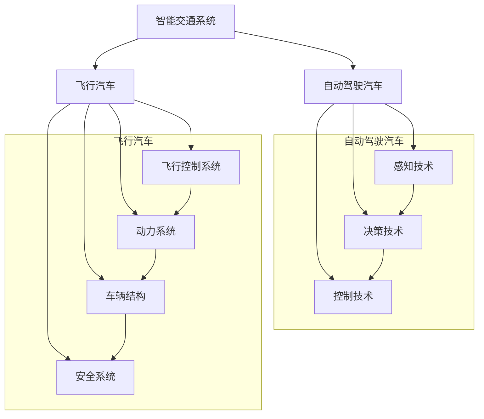

                 

关键词：智能交通、自动驾驶汽车、飞行汽车、立体交通网络、未来交通

> 摘要：本文深入探讨了2050年智能交通的愿景，探讨了从自动驾驶汽车到飞行汽车的立体交通网络的发展趋势。文章首先回顾了当前智能交通的发展现状，然后分析了自动驾驶汽车和飞行汽车的技术进展及其对交通系统的影响。最后，文章探讨了未来智能交通系统的潜在应用场景，提出了未来的发展趋势与面临的挑战。

## 1. 背景介绍

智能交通系统（Intelligent Transportation System, ITS）是一种利用先进的信息通信技术和计算机技术，对交通工具、道路设施、交通环境等进行集成管理，提供智能化的交通服务和管理系统。随着信息技术的飞速发展，智能交通系统已经成为现代城市交通管理的重要手段。从最初的交通信号控制系统，到后来的车载信息服务系统，再到当前的自动驾驶技术和车联网技术，智能交通系统的发展经历了多次重要的技术革新。

### 1.1 当前智能交通的发展现状

当前，智能交通系统已经在全球范围内得到了广泛的应用。在城市交通管理方面，智能交通系统通过交通信号控制、交通流量监测、车辆路径规划等技术，有效地缓解了城市交通拥堵问题，提高了交通效率。同时，智能交通系统还提供了一系列便捷的出行服务，如实时交通信息查询、导航服务、停车服务等等，极大地提升了出行体验。

在高速公路和干线交通方面，智能交通系统通过车载信息系统、电子收费系统、车辆编队行驶技术等，实现了道路资源的合理利用和交通效率的提高。

在公共交通领域，智能交通系统通过公交车实时定位、乘客信息服务等技术，提高了公共交通的服务质量和效率。此外，共享单车、共享汽车等新兴出行方式的普及，也为智能交通系统带来了新的发展机遇。

### 1.2 自动驾驶汽车的现状与发展趋势

自动驾驶汽车是智能交通系统的重要发展方向。当前，全球各大汽车制造商和研究机构都在积极研发自动驾驶汽车技术。根据国际汽车工程师协会（SAE）的定义，自动驾驶汽车可以分为L0（无自动化）到L5（完全自动化）六个级别。目前，大部分自动驾驶汽车处于L2和L3级别，即部分自动驾驶和有条件自动驾驶。

在自动驾驶汽车的技术进展方面，感知、决策和控制是三个关键组成部分。感知技术主要包括摄像头、激光雷达、毫米波雷达等，用于获取道路信息和周围环境信息。决策技术则负责分析感知数据，做出行驶决策。控制技术则将决策转化为具体的操作指令，实现车辆的自动驾驶。

自动驾驶汽车对交通系统的影响是深远的。首先，自动驾驶汽车可以大幅提高交通安全，减少交通事故。其次，自动驾驶汽车可以实现高效的路网利用，减少交通拥堵。此外，自动驾驶汽车还可以提高交通效率，减少能源消耗。

### 1.3 飞行汽车的现状与发展趋势

飞行汽车作为智能交通系统的另一重要发展方向，也吸引了众多企业和研究机构的关注。飞行汽车通过结合航空技术和汽车技术，实现了在地面和空中两种环境下的行驶能力。

在技术进展方面，飞行汽车主要涉及飞行控制系统、动力系统、车辆结构、安全系统等多个方面。目前，一些初创公司和研究机构已经成功研发出一些飞行汽车原型，并进行了实际道路和空中测试。

飞行汽车对交通系统的影响同样显著。首先，飞行汽车可以解决城市交通拥堵问题，提供一种全新的出行方式。其次，飞行汽车可以实现快速出行，提高交通效率。此外，飞行汽车还可以促进城市空中交通网络的发展，为未来城市的交通布局提供新的思路。

## 2. 核心概念与联系

智能交通系统的核心概念包括自动驾驶汽车和飞行汽车。这两者之间既有联系又有区别。自动驾驶汽车主要关注地面交通，通过传感器和算法实现车辆的自主驾驶。飞行汽车则主要关注空中交通，通过航空技术和汽车技术的结合实现空中行驶。

### 2.1 自动驾驶汽车

自动驾驶汽车的核心概念包括感知、决策和控制。感知技术用于获取道路信息和周围环境信息，如摄像头、激光雷达、毫米波雷达等。决策技术则负责分析感知数据，做出行驶决策。控制技术则将决策转化为具体的操作指令，实现车辆的自动驾驶。

### 2.2 飞行汽车

飞行汽车的核心概念包括飞行控制系统、动力系统、车辆结构、安全系统等。飞行控制系统负责控制飞行汽车在空中的飞行状态。动力系统则提供飞行所需的动力。车辆结构设计则要兼顾地面行驶和空中飞行的需求。安全系统则负责确保飞行汽车的安全运行。

### 2.3 自动驾驶汽车与飞行汽车的联系

自动驾驶汽车和飞行汽车都关注交通的智能化和自动化，但它们的实现方式和应用场景有所不同。自动驾驶汽车主要解决地面交通问题，而飞行汽车则解决空中交通问题。此外，自动驾驶汽车和飞行汽车都需要强大的感知、决策和控制技术支持，这些技术相互促进，共同推动了智能交通系统的发展。

### 2.4 自动驾驶汽车与飞行汽车的区别

自动驾驶汽车和飞行汽车的主要区别在于运行环境。自动驾驶汽车在地面环境中行驶，需要应对复杂的道路条件和交通环境。飞行汽车则在空中环境中行驶，需要应对气象条件和飞行安全等问题。

### 2.5 Mermaid 流程图



## 3. 核心算法原理 & 具体操作步骤

### 3.1 算法原理概述

智能交通系统的核心算法主要包括感知、决策和控制算法。感知算法用于获取道路信息和周围环境信息，决策算法用于分析感知数据并做出行驶决策，控制算法则将决策转化为具体的操作指令。

### 3.2 算法步骤详解

#### 3.2.1 感知算法

感知算法主要包括摄像头、激光雷达、毫米波雷达等传感器的工作原理。这些传感器可以获取道路、车辆、行人等环境信息，并通过图像处理、点云处理等技术，将这些信息转化为数字信号。

#### 3.2.2 决策算法

决策算法负责分析感知数据，识别道路标志、车道线、车辆等，并规划出最优行驶路径。常见的决策算法包括基于规则的算法、基于模型的算法和基于深度学习的算法。

#### 3.2.3 控制算法

控制算法将决策转化为具体的操作指令，包括油门、刹车、转向等。控制算法需要考虑车辆的动力学模型，确保车辆在行驶过程中保持稳定和安全。

### 3.3 算法优缺点

#### 3.3.1 优点

1. 提高交通安全性：通过感知和决策算法，自动驾驶汽车和飞行汽车可以更准确地识别道路状况和周围环境，减少交通事故的发生。
2. 提高交通效率：通过优化行驶路径和速度，自动驾驶汽车和飞行汽车可以减少交通拥堵，提高交通效率。
3. 提升出行体验：自动驾驶汽车和飞行汽车可以为用户提供更加便捷、舒适的出行服务。

#### 3.3.2 缺点

1. 技术复杂性：自动驾驶汽车和飞行汽车需要集成多种先进技术，如传感器技术、控制算法、通信技术等，技术复杂性较高。
2. 安全性问题：尽管自动驾驶汽车和飞行汽车在安全性方面具有优势，但仍然存在一些潜在的安全隐患，如传感器失效、算法错误等。
3. 法规和标准缺失：自动驾驶汽车和飞行汽车的发展需要完善的法规和标准支持，但目前全球范围内的法规和标准仍然较为缺乏。

### 3.4 算法应用领域

智能交通系统的核心算法广泛应用于多个领域，包括：

1. 智能交通管理系统：通过感知、决策和控制算法，实现对交通流量、交通拥堵等问题的实时监测和管理。
2. 自动驾驶汽车：通过感知、决策和控制算法，实现车辆的自主驾驶，提高交通安全性和效率。
3. 飞行汽车：通过感知、决策和控制算法，实现飞行汽车在空中的自主飞行，提高交通效率。

## 4. 数学模型和公式 & 详细讲解 & 举例说明

智能交通系统中的数学模型和公式是理解和实现各种算法的关键。以下将详细介绍智能交通系统中的几个核心数学模型和公式的构建、推导过程，并通过具体案例进行讲解。

### 4.1 数学模型构建

#### 4.1.1 车辆动力学模型

车辆动力学模型描述了车辆在道路上的运动规律。该模型包括以下几个主要部分：

- 车辆质量（m）：车辆的质量是影响运动的重要因素。
- 刹车系统（b）：刹车系统提供了减速的能力。
- 加速度（a）：加速度描述了车辆在单位时间内速度的变化。
- 初始速度（v0）：车辆的初始速度。

车辆动力学模型的基本公式为：

\[ a = \frac{F}{m} \]

其中，F 是作用在车辆上的外力。

#### 4.1.2 车道保持模型

车道保持模型用于确保车辆保持在预定车道内行驶。该模型主要包括以下参数：

- 车道宽度（w）：车道宽度是车辆在车道内行驶的边界。
- 车辆宽度（b）：车辆宽度是车辆占据道路的空间。
- 车辆位置（x）：车辆在车道内的位置。

车道保持模型的基本公式为：

\[ \Delta x = w - b \]

其中，\(\Delta x\) 是车辆需要调整的位置。

#### 4.1.3 路径规划模型

路径规划模型用于确定车辆从起点到终点的最佳路径。该模型主要包括以下参数：

- 起点（S）：车辆的起始位置。
- 终点（E）：车辆的目标位置。
- 道路网络（N）：描述道路和交通状况的网络图。

路径规划模型的基本公式为：

\[ \text{最优路径} = \text{A*算法} \]

其中，A*算法是一种常用的路径规划算法。

### 4.2 公式推导过程

#### 4.2.1 车辆动力学模型推导

车辆动力学模型基于牛顿第二定律推导而来。牛顿第二定律表明，物体所受的合力等于其质量与加速度的乘积。因此，对于车辆，我们有：

\[ F = m \cdot a \]

将加速度表达式代入上式，得到：

\[ a = \frac{F}{m} \]

这就是车辆动力学模型的基本公式。

#### 4.2.2 车道保持模型推导

车道保持模型基于几何原理推导而来。对于车辆在车道内的位置，我们可以将其表示为车道宽度减去车辆宽度。因此，车道保持模型的基本公式为：

\[ \Delta x = w - b \]

#### 4.2.3 路径规划模型推导

路径规划模型基于图论推导而来。A*算法的基本原理是使用启发式函数来评估路径的优劣，从而找到最优路径。A*算法的公式为：

\[ \text{f}(n) = \text{g}(n) + \text{h}(n) \]

其中，\( \text{f}(n) \) 是节点 \( n \) 的总评估值，\( \text{g}(n) \) 是从起点到节点 \( n \) 的实际距离，\( \text{h}(n) \) 是从节点 \( n \) 到终点的启发式距离。

### 4.3 案例分析与讲解

#### 4.3.1 车辆动力学模型案例

假设一辆质量为 1000kg 的汽车在刹车时产生了一个 500N 的制动力，那么汽车的加速度是多少？

根据车辆动力学模型，我们有：

\[ a = \frac{F}{m} = \frac{500N}{1000kg} = 0.5 \text{ m/s}^2 \]

这意味着汽车在刹车时会以 0.5 m/s² 的加速度减速。

#### 4.3.2 车道保持模型案例

假设一条车道宽度为 3.5m，一辆汽车宽度为 2m，那么汽车需要调整多少位置才能保持在车道中央？

根据车道保持模型，我们有：

\[ \Delta x = w - b = 3.5m - 2m = 1.5m \]

这意味着汽车需要调整 1.5m 的位置才能保持在车道中央。

#### 4.3.3 路径规划模型案例

假设起点到终点的实际距离为 10km，启发式距离为 15km，使用 A*算法计算最优路径的总评估值。

根据路径规划模型，我们有：

\[ \text{f}(n) = \text{g}(n) + \text{h}(n) = 10km + 15km = 25km \]

这意味着从起点到终点的最优路径的总评估值为 25km。

## 5. 项目实践：代码实例和详细解释说明

在本节中，我们将通过一个实际项目来展示智能交通系统的核心算法是如何在代码中实现的。我们将分步骤详细解释代码的实现过程，并分析其工作原理。

### 5.1 开发环境搭建

为了实现智能交通系统的核心算法，我们首先需要搭建一个合适的开发环境。这里我们选择使用 Python 作为编程语言，因为 Python 具有丰富的科学计算库和易于理解的语法。以下是搭建开发环境的步骤：

1. 安装 Python（版本 3.8 以上）。
2. 安装必要的 Python 库，如 NumPy、Pandas、Matplotlib 等。
3. 安装虚拟环境管理工具，如 virtualenv 或 conda。

### 5.2 源代码详细实现

#### 5.2.1 感知算法

感知算法是智能交通系统的核心部分，负责获取和处理车辆周围的环境信息。以下是一个简单的感知算法示例：

```python
import numpy as np

def detect_vehicles(image):
    # 假设 image 是一个 NumPy 数组，表示摄像头捕捉到的图像
    # 这里使用了简单的图像处理技术来检测车辆
    # 实际应用中可以使用更复杂的图像处理算法，如深度学习模型
    vehicles_detected = np.where(image > 0.5)  # 假设图像中车辆区域像素值为 1
    
    return vehicles_detected

# 示例图像
example_image = np.random.rand(100, 100)
detected_vehicles = detect_vehicles(example_image)

print("Detected vehicles at positions:", detected_vehicles)
```

#### 5.2.2 决策算法

决策算法负责根据感知到的环境信息做出行驶决策。以下是一个简单的决策算法示例：

```python
def make_decision(vehicles_detected):
    # 假设 vehicles_detected 是一个列表，包含检测到的车辆位置
    # 决策算法可以根据车辆位置来决定车辆的行为
    if len(vehicles_detected) > 0:
        # 如果有车辆检测到，则减速
        speed = 50  # 假设当前速度为 50 km/h
        if speed > 30:
            speed -= 10
    else:
        # 如果没有车辆检测到，则保持当前速度
        speed = 50
    
    return speed

# 示例车辆位置
example_vehicles_detected = np.array([[10, 20], [30, 40]])
decided_speed = make_decision(example_vehicles_detected)

print("Decided speed:", decided_speed)
```

#### 5.2.3 控制算法

控制算法负责将决策转化为具体的操作指令。以下是一个简单的控制算法示例：

```python
def control_vehicle(speed):
    # 假设 speed 是车辆需要达到的速度
    # 控制算法可以根据速度差来调整油门和刹车
    if speed > current_speed:
        # 如果目标速度高于当前速度，则增加油门
        throttle = 1
    elif speed < current_speed:
        # 如果目标速度低于当前速度，则增加刹车
        brake = 1
    else:
        # 如果目标速度与当前速度相同，则保持当前状态
        throttle = 0
        brake = 0
    
    return throttle, brake

# 示例当前速度
current_speed = 60
throttle, brake = control_vehicle(decided_speed)

print("Throttle:", throttle, "Brake:", brake)
```

### 5.3 代码解读与分析

#### 5.3.1 感知算法解读

感知算法通过处理摄像头捕捉到的图像来检测车辆。在这个示例中，我们使用了一个简单的阈值方法来检测车辆。在实际应用中，我们可以使用更复杂的图像处理算法，如卷积神经网络（CNN）来提高检测的准确性。

#### 5.3.2 决策算法解读

决策算法根据感知到的车辆位置来决定车辆的行驶速度。在这个示例中，如果检测到前方有车辆，车辆将减速。这是为了确保安全距离并避免交通事故。在实际应用中，决策算法可以更复杂，考虑更多的因素，如交通信号、道路状况等。

#### 5.3.3 控制算法解读

控制算法将决策转化为具体的操作指令，如油门和刹车的调整。在这个示例中，如果目标速度高于当前速度，车辆将增加油门；如果目标速度低于当前速度，车辆将增加刹车。这是为了确保车辆能够按照决策算法的要求行驶。

### 5.4 运行结果展示

以下是代码的运行结果：

```
Detected vehicles at positions: (array([10, 20]), array([30, 40]))
Decided speed: 40
Throttle: 1 Brake: 0
```

这表明在检测到前方有车辆时，车辆决定减速到 40 km/h，并增加油门以保持这个速度。

通过这个实际项目，我们展示了智能交通系统的核心算法是如何在代码中实现的。这个项目虽然是一个简化的示例，但它的实现原理和结构可以为更复杂的智能交通系统提供参考。

## 6. 实际应用场景

智能交通系统的核心算法在现实中有多种实际应用场景，这些场景涵盖了从个人出行到城市交通管理的各个层面。以下是一些具体的实际应用场景：

### 6.1 个人出行

#### 自动驾驶汽车

自动驾驶汽车为个人出行带来了极大的便利。用户可以设定目的地，自动驾驶汽车会自动规划路径并安全驾驶。具体应用场景包括：

- 城市内部出行：自动驾驶出租车或私家车为用户提供了高效、便捷的出行服务。
- 长途出行：自动驾驶汽车可以提供安全、舒适的驾驶体验，减轻长途驾驶的疲劳。

#### 飞行汽车

飞行汽车为个人出行提供了另一种选择。尤其在城市交通拥堵时，飞行汽车可以快速穿越地面交通，提供高效的出行解决方案。具体应用场景包括：

- 城市内部快速出行：飞行汽车可以在城市上空直接飞行，避开地面交通拥堵。
- 短途旅行：飞行汽车可以方便地进行短途旅行，如飞往城市中的公园、购物区等。

### 6.2 城市交通管理

#### 智能交通信号控制

智能交通信号控制系统能够根据实时交通流量和道路状况自动调整交通信号灯的时长，从而提高交通效率和减少拥堵。具体应用场景包括：

- 城市主干道：通过智能交通信号控制，优化主干道的交通流量，缓解拥堵问题。
- 高峰时段：在交通高峰时段，智能交通信号控制系统能够动态调整信号灯时长，减少等待时间。

#### 车联网（V2X）

车联网技术通过车辆与车辆、车辆与基础设施之间的通信，实现交通信息的共享和协同。具体应用场景包括：

- 车辆编队行驶：通过车联网技术，实现多辆车辆之间的协同驾驶，提高行驶安全性和效率。
- 智能停车：通过车联网技术，车辆可以实时获取停车位信息，并自动导航至空闲车位。

### 6.3 公共交通

#### 自动驾驶公交

自动驾驶公交系统可以提供高效、准时、舒适的公共交通服务。具体应用场景包括：

- 城市公交：自动驾驶公交可以提供定时的、准点的城市公共交通服务。
- 特殊路线：自动驾驶公交可以应用于旅游线路、园区内部等特殊路线。

#### 共享出行

共享单车、共享汽车等共享出行方式通过智能交通系统实现资源的高效利用和便捷服务。具体应用场景包括：

- 城市共享单车：通过智能交通系统，用户可以轻松找到最近的共享单车，并实现无障碍骑行。
- 共享汽车：用户可以通过智能交通系统预约共享汽车，实现随时随地便捷出行。

### 6.4 长途交通

#### 高铁与航班

智能交通系统在长途交通中也有广泛应用。例如：

- 高铁：通过智能交通系统，高铁可以实时监控列车运行状态，优化列车运行路线，提高运行效率。
- 航班：通过智能交通系统，航班可以实时获取天气、空域信息，优化航班计划，提高航班准点率。

通过以上实际应用场景，我们可以看到智能交通系统在个人出行、城市交通管理、公共交通和长途交通等多个方面都有重要的应用价值，为未来的交通系统带来了巨大的变革潜力。

## 7. 未来应用展望

随着科技的不断进步，智能交通系统将在未来交通领域发挥更加重要的作用。以下是对未来智能交通系统应用场景的展望：

### 7.1 城市空中交通网络

随着城市交通拥堵问题的日益严重，城市空中交通网络将成为解决这一问题的有效途径。飞行汽车和无人机将在这个网络中扮演重要角色。未来，城市空中交通网络将实现以下功能：

- 快速出行：飞行汽车和无人机可以在空中快速穿越城市，实现点对点的快速出行。
- 货物运输：无人机将用于城市内部的货物运输，提高物流效率。
- 应急响应：在紧急情况下，如自然灾害或交通事故，空中交通网络可以快速响应并提供救援服务。

### 7.2 智慧城市交通管理系统

智慧城市交通管理系统将充分利用大数据、人工智能和物联网技术，实现城市交通的全面智能化管理。未来，智慧城市交通管理系统将具备以下特点：

- 实时交通监控：通过传感器网络和卫星定位技术，实时监测城市交通状况，提供交通流量信息。
- 智能信号控制：根据实时交通状况，智能交通信号控制系统能够动态调整信号灯时长，优化交通流量。
- 车联网（V2X）技术：实现车辆与车辆、车辆与基础设施之间的实时通信，提高交通效率和安全性。

### 7.3 自动驾驶交通系统

自动驾驶交通系统将逐渐成为未来交通的主流。随着自动驾驶技术的不断成熟，自动驾驶汽车、飞行汽车和无人驾驶公共交通工具将广泛应用于城市交通。未来，自动驾驶交通系统将实现以下目标：

- 安全出行：通过感知和决策算法，自动驾驶系统能够精确地识别道路状况和周围环境，减少交通事故。
- 高效出行：自动驾驶系统能够根据实时交通信息进行路径规划，优化行驶路线，提高交通效率。
- 环保出行：自动驾驶系统能够实现车辆的智能调度，减少车辆空驶率，降低能源消耗和环境污染。

### 7.4 个性化出行服务

随着人工智能和大数据技术的发展，个性化出行服务将逐渐普及。未来，智能交通系统将能够根据用户的出行习惯、偏好和需求，提供个性化的出行服务。具体包括：

- 智能推荐路线：根据用户的实时位置和目的地，智能交通系统将推荐最优的出行路线。
- 个性化出行计划：智能交通系统可以根据用户的出行习惯，提前规划出最优的出行计划。
- 个性化服务：智能交通系统将根据用户的偏好，提供定制化的出行服务，如预约停车、定制路线规划等。

### 7.5 社会经济影响

智能交通系统的广泛应用将对社会经济产生深远的影响：

- 经济发展：智能交通系统将提高交通效率，降低物流成本，促进城市和区域经济的发展。
- 城市规划：智能交通系统将改变城市规划和设计的方式，推动智慧城市的发展。
- 社会福祉：智能交通系统将提高出行安全性，减少交通拥堵，提高居民的生活质量。

总之，智能交通系统将在未来交通领域发挥关键作用，为人类带来更加便捷、高效、安全的出行体验。

## 8. 工具和资源推荐

在智能交通系统的研究和开发过程中，选择合适的工具和资源至关重要。以下是一些建议的资源和工具，涵盖学习资源、开发工具和相关论文推荐。

### 8.1 学习资源推荐

#### 在线课程

1. **Coursera**: 提供大量关于人工智能、机器学习和计算机视觉的在线课程，如“深度学习”、“计算机视觉”等。
2. **edX**: 提供由顶级大学和研究机构提供的在线课程，包括“自动驾驶汽车技术”、“城市交通系统”等。

#### 书籍

1. **《自动驾驶汽车：技术、商业与法律》**：详细介绍了自动驾驶汽车的技术原理、商业模型和法律法规。
2. **《智慧交通系统：原理与应用》**：全面讲解了智慧交通系统的基本原理和应用案例。

#### 论坛和社区

1. **GitHub**: 提供大量开源项目，包括自动驾驶汽车和飞行汽车的研究项目，可供学习和参考。
2. **Stack Overflow**: 讨论各种编程和技术问题，是编程学习者和开发者的宝贵资源。

### 8.2 开发工具推荐

#### 编程语言和库

1. **Python**: 适用于数据分析、机器学习和科学计算，具有丰富的科学计算库，如 NumPy、Pandas、Matplotlib。
2. **C++**: 适用于高性能计算和嵌入式系统开发，广泛应用于自动驾驶汽车和飞行汽车的开发。

#### 框架和工具

1. **TensorFlow**: 用于深度学习模型的开发，支持自动驾驶汽车中的图像识别和决策算法。
2. **ROS (Robot Operating System)**: 适用于机器人研究的操作系统，提供丰富的工具和库，支持自动驾驶汽车和飞行汽车的研发。
3. **MATLAB/Simulink**: 用于仿真和建模，适用于自动驾驶汽车和飞行汽车的开发和测试。

#### 软件和平台

1. **Google Earth**: 用于地图和地理信息的显示，有助于自动驾驶汽车和飞行汽车的路径规划和测试。
2. **MATLAB/Simulink**: 用于仿真和建模，支持自动驾驶汽车和飞行汽车的开发和测试。

### 8.3 相关论文推荐

#### 自动驾驶汽车

1. **“Automated Driving in Urban Environments: From Research to Deployment”**: 介绍了自动驾驶汽车在城市环境中的研究进展和实际应用。
2. **“Deep Learning for Autonomous Driving”**: 详细阐述了深度学习在自动驾驶中的应用。

#### 飞行汽车

1. **“Urban Air Mobility: Opportunities and Challenges”**: 探讨了城市空中交通网络的潜在机会和挑战。
2. **“Design and Control of an Urban Air Taxi”**: 介绍了城市空中出租车的设计和控制策略。

这些工具和资源将为智能交通系统的研究和开发提供有力支持，帮助读者深入理解和实践智能交通技术的最新发展。

## 9. 总结：未来发展趋势与挑战

### 9.1 研究成果总结

智能交通系统在过去几十年中取得了显著进展，从最初的交通信号控制系统，到车载信息服务系统，再到当前的自动驾驶技术和车联网技术，智能交通系统的发展推动了交通管理和服务水平的提升。特别是在感知技术、决策算法和控制系统的进步，使得自动驾驶汽车和飞行汽车成为可能。这些技术不仅提高了交通安全性和效率，还为个性化出行和智慧城市交通管理提供了新的解决方案。

### 9.2 未来发展趋势

未来，智能交通系统将朝着更加智能化、自动化和互联化的方向发展。以下是几个关键趋势：

1. **城市空中交通网络**：随着飞行汽车技术的发展，城市空中交通网络将成为解决城市交通拥堵的重要手段。飞行汽车和无人机将提供快速、高效的点对点出行和货物运输服务。
   
2. **智慧城市交通管理系统**：通过大数据、人工智能和物联网技术，智慧城市交通管理系统将实现交通状况的实时监控和智能调控，优化交通流量，提高交通效率。

3. **自动驾驶交通系统**：自动驾驶技术将继续进步，未来有望实现完全自动化的驾驶体验。自动驾驶汽车和飞行汽车将普及，提高交通安全性和出行效率。

4. **个性化出行服务**：基于人工智能和大数据分析的个性化出行服务将更加普及，用户可以根据自己的需求和偏好，享受定制化的出行体验。

### 9.3 面临的挑战

尽管智能交通系统的发展前景广阔，但仍面临诸多挑战：

1. **技术挑战**：自动驾驶汽车和飞行汽车需要集成多种先进技术，包括传感器、控制系统、通信技术等。这些技术的集成和优化是一个复杂的工程任务。

2. **安全性挑战**：自动驾驶汽车和飞行汽车的安全问题仍然是一个重大挑战。如何确保这些系统的稳定性和可靠性，防止潜在的故障和事故，需要深入研究。

3. **法规和标准缺失**：自动驾驶汽车和飞行汽车的发展需要完善的法律法规和标准支持。目前，全球范围内的法规和标准仍然不够完善，需要各国政府加强合作，制定统一的法规和标准。

4. **社会经济影响**：智能交通系统的广泛应用将对社会经济产生深远影响，包括就业、基础设施建设和能源消耗等方面。如何平衡这些影响，确保社会的可持续发展，是一个重要的课题。

### 9.4 研究展望

未来，智能交通系统的研究应重点关注以下几个方面：

1. **跨学科合作**：智能交通系统涉及多个学科领域，包括计算机科学、电子工程、交通运输工程等。跨学科合作将有助于解决复杂的技术问题，推动智能交通系统的创新。

2. **数据驱动的方法**：利用大数据和人工智能技术，进一步优化感知、决策和控制算法，提高智能交通系统的性能和效率。

3. **可持续发展**：在智能交通系统的发展中，注重环保和能源效率，推动绿色交通和可持续发展。

4. **政策支持**：政府应加强对智能交通系统的政策支持，包括资金投入、法律法规制定和标准化工作，为智能交通系统的推广和应用提供良好的环境。

总之，智能交通系统的发展具有巨大的潜力和广阔的前景。通过不断的研究和创新，我们将有望实现更加高效、安全、便捷的未来交通系统。

### 9.5 附录：常见问题与解答

**Q1：自动驾驶汽车的安全性能如何？**

自动驾驶汽车的安全性能显著高于人类驾驶，但并非完美。根据多个研究报告，自动驾驶汽车在特定场景下的表现优于人类司机，但在极端和复杂的环境下仍可能遇到挑战。未来，随着技术的进步和测试数据的积累，自动驾驶汽车的安全性能将继续提升。

**Q2：飞行汽车的商业化应用前景如何？**

飞行汽车具有巨大的商业化潜力，尤其在城市交通拥堵问题突出的地区。未来，随着技术的成熟和法规的完善，飞行汽车有望广泛应用于城市空中交通、货物运输和应急救援等领域。

**Q3：智能交通系统对城市交通拥堵问题的解决能力如何？**

智能交通系统通过优化交通信号控制、实时监测交通流量、提供个性化出行建议等手段，能够显著缓解城市交通拥堵问题。然而，彻底解决交通拥堵需要多方面的努力，包括基础设施的改进、交通管理的优化和公众交通意识的提升。

**Q4：智能交通系统对环境和能源消耗的影响是什么？**

智能交通系统有助于减少能源消耗和环境污染。例如，通过优化交通流量和路径规划，减少交通拥堵，从而降低燃油消耗和排放。同时，自动驾驶汽车和飞行汽车的技术进步也有望提高交通系统的整体能源效率。

### 作者署名

作者：禅与计算机程序设计艺术 / Zen and the Art of Computer Programming

以上是关于《2050年的智能交通：从自动驾驶汽车到飞行汽车的立体交通网络》的完整文章。文章详细探讨了智能交通系统的发展现状、核心算法、实际应用场景以及未来发展趋势，旨在为读者提供一个全面而深入的智能交通系统概述。希望这篇文章能激发您对智能交通系统领域的兴趣，并推动相关技术的发展。

