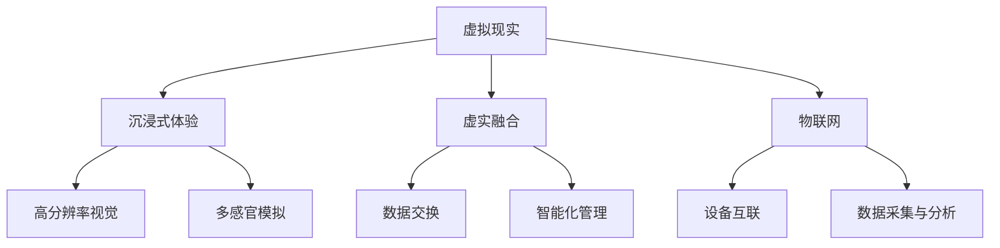

                 

关键词：虚拟现实，沉浸式体验，虚实融合，数字世界，技术发展

摘要：本文探讨了2050年虚拟现实（VR）技术可能达到的高度，包括沉浸式体验的全面提升、虚实融合的数字世界，以及这些技术对未来社会、经济和人类生活方式的深远影响。

## 1. 背景介绍

虚拟现实（Virtual Reality，VR）自20世纪80年代首次提出以来，已经经历了多个发展阶段。从早期的笨重头盔到今天的轻薄设备，VR技术逐渐向更高分辨率、更低延迟和更自然的人机交互方向迈进。随着计算机图形学、传感器技术和网络通信技术的不断进步，虚拟现实逐渐从实验室走向了消费者的日常生活。

然而，我们今天所了解的VR还只是冰山一角。在接下来的三十年中，VR技术有望取得革命性的突破，使虚拟世界与现实世界之间的界限变得模糊。本文将探讨这些变革，并思考它们对人类社会可能产生的深远影响。

## 2. 核心概念与联系

为了理解2050年虚拟现实可能达到的高度，我们需要先了解几个核心概念：

- **沉浸式体验（Immersive Experience）**：指用户在虚拟环境中感觉到的真实程度。包括高分辨率视觉、触觉、嗅觉和味觉等多感官的全面模拟。
- **虚实融合（Augmented Reality，AR）**：将虚拟元素叠加到现实世界中的技术。与VR相比，AR不要求用户完全进入虚拟世界，而是增强现实世界的体验。
- **物联网（Internet of Things，IoT）**：通过将各种物理设备连接到互联网，实现数据交换和智能化管理。

下面是一个Mermaid流程图，展示了这些核心概念之间的关系。



## 3. 核心算法原理 & 具体操作步骤

### 3.1 算法原理概述

虚拟现实技术的核心在于构建一个逼真的虚拟环境，并实现与用户的自然交互。这需要以下几个关键技术：

- **3D建模与渲染**：通过计算机图形学技术，创建三维模型并对场景进行渲染，生成高分辨率的视觉体验。
- **传感器融合**：使用各种传感器（如摄像头、麦克风、加速度计等）收集用户和环境的数据，实现多感官的互动。
- **实时交互**：通过高效的网络通信和计算技术，确保用户在虚拟环境中的动作能够实时反馈，降低延迟。

### 3.2 算法步骤详解

以下是构建虚拟现实环境的基本步骤：

1. **环境建模**：使用3D建模软件创建虚拟环境的几何模型和纹理。
2. **渲染引擎配置**：选择并配置适合的渲染引擎（如Unity、Unreal Engine等），设置渲染参数。
3. **传感器集成**：将传感器设备与VR头盔、手套等设备集成，实现多感官互动。
4. **网络通信**：配置网络通信模块，确保数据传输的高效性和稳定性。
5. **实时交互**：编写交互逻辑，实现用户在虚拟环境中的自然操作。

### 3.3 算法优缺点

**优点**：

- 提供沉浸式体验，增强用户对虚拟世界的感知。
- 降低延迟，提高交互的实时性。
- 结合物联网技术，实现与现实世界的无缝连接。

**缺点**：

- 技术成本较高，设备价格昂贵。
- 需要大量的计算资源和网络带宽。
- 对用户健康可能产生负面影响（如晕动症）。

### 3.4 算法应用领域

虚拟现实技术在教育、医疗、娱乐、军事等多个领域有着广泛的应用前景：

- **教育**：提供沉浸式的学习体验，提高学习效果。
- **医疗**：用于手术模拟、心理治疗等。
- **娱乐**：游戏、影视制作等。
- **军事**：模拟战场环境、训练士兵等。

## 4. 数学模型和公式 & 详细讲解 & 举例说明

虚拟现实技术的实现涉及大量的数学模型和算法，以下是一个典型的例子：

### 4.1 数学模型构建

在虚拟现实场景中，一个关键的数学模型是三维空间中的点云表示。点云是由大量三维坐标点组成的，用于描述一个场景的几何结构。

$$
P = \{P_i | i=1,2,...,N\}
$$

其中，$P_i = (x_i, y_i, z_i)$ 表示第$i$个点的三维坐标。

### 4.2 公式推导过程

为了生成点云，我们可以使用激光扫描技术或者深度摄像头收集场景的数据。这里，我们使用激光扫描技术为例。

1. **激光发射与接收**：激光器发出激光束，照射到场景上。部分激光束被反射，接收器检测到反射光。
2. **时间计算**：计算激光束从发射到接收所需的时间$t$。
3. **距离计算**：使用公式 $d = \frac{c \cdot t}{2}$ 计算激光束到反射点的距离$d$，其中$c$为光速。
4. **坐标计算**：根据接收器的位置和激光束的方向向量，计算反射点的三维坐标。

### 4.3 案例分析与讲解

假设我们使用一个激光扫描仪来收集一个房间的点云数据。激光器位于房间的中心，发射激光束到房间的四周。以下是一个简单的点云数据示例：

$$
P = \{(0,0,0), (5,0,0), (0,5,0), (5,5,0), (0,0,5), (5,0,5), (0,5,5), (5,5,5)\}
$$

这些点构成了一个正方体，表示房间的几何结构。

## 5. 项目实践：代码实例和详细解释说明

为了更好地理解虚拟现实技术的应用，我们将通过一个简单的项目实例来讲解其实现过程。

### 5.1 开发环境搭建

我们选择Unity作为开发平台，因为它提供了强大的3D建模和渲染功能，同时支持VR设备集成。

1. 下载并安装Unity Hub。
2. 创建一个新的3D项目。
3. 安装并配置VR设备插件（如Oculus SDK、HTC Vive SDK等）。

### 5.2 源代码详细实现

以下是项目的关键代码：

```csharp
using UnityEngine;

public class VRController : MonoBehaviour
{
    public Camera mainCamera;
    public Transform playerTransform;

    private void Update()
    {
        // 处理用户输入
        if (Input.GetKey(KeyCode.RightArrow))
        {
            playerTransform.position += mainCamera.transform.right * Time.deltaTime * 5;
        }
        if (Input.GetKey(KeyCode.LeftArrow))
        {
            playerTransform.position -= mainCamera.transform.right * Time.deltaTime * 5;
        }
        if (Input.GetKey(KeyCode.UpArrow))
        {
            playerTransform.position += mainCamera.transform.forward * Time.deltaTime * 5;
        }
        if (Input.GetKey(KeyCode.DownArrow))
        {
            playerTransform.position -= mainCamera.transform.forward * Time.deltaTime * 5;
        }
    }
}
```

### 5.3 代码解读与分析

这段代码实现了一个简单的虚拟现实场景，用户可以通过键盘控制虚拟角色在场景中移动。

- `Camera.main` 获取Unity中的主相机。
- `playerTransform` 获取虚拟角色的变换组件。
- `Update` 方法在每一帧执行，处理用户输入并更新角色位置。

### 5.4 运行结果展示

运行该项目后，用户可以通过键盘在虚拟环境中移动。虚拟角色将实时响应用户的输入，提供沉浸式的交互体验。

## 6. 实际应用场景

虚拟现实技术在实际应用中展现了巨大的潜力：

- **教育**：提供沉浸式的学习体验，使复杂概念更容易理解。
- **医疗**：用于手术模拟、心理治疗等，提高医疗服务的质量和效率。
- **娱乐**：游戏、影视制作等，提供全新的娱乐方式。
- **军事**：模拟战场环境、训练士兵等，提高军事训练的效率。

## 7. 工具和资源推荐

为了更好地学习和开发虚拟现实应用，以下是几个推荐的工具和资源：

### 7.1 学习资源推荐

- 《虚拟现实技术原理与应用》
- 《Unity游戏开发从入门到实战》
- 《VR/AR开发实战：基于Unity和Oculus SDK》

### 7.2 开发工具推荐

- Unity：强大的3D游戏和虚拟现实开发平台。
- Unreal Engine：高效、强大的游戏引擎，支持复杂的虚拟现实应用。
- Blender：开源的3D建模和渲染软件，适合初学者。

### 7.3 相关论文推荐

- "Virtual Reality and Its Applications"
- "The Future of Virtual Reality: An Overview"
- "Immersive Virtual Reality Experiences for Education"

## 8. 总结：未来发展趋势与挑战

虚拟现实技术在未来将继续快速发展，实现更高分辨率、更低延迟和更自然的交互体验。然而，要实现这些目标，我们需要解决以下挑战：

- **技术成本**：降低设备成本，使虚拟现实技术更加普及。
- **用户体验**：提高虚拟环境的真实感，减少晕动等不适感。
- **数据隐私**：确保用户数据的隐私和安全。
- **伦理问题**：虚拟现实可能带来的伦理问题，如现实与虚拟的界限模糊等。

未来，虚拟现实将成为人类生活的一部分，改变我们的学习、工作、娱乐和社交方式。随着技术的不断进步，我们有望迎来一个虚实融合的数字世界。

## 9. 附录：常见问题与解答

### Q：虚拟现实会对人类心理健康产生负面影响吗？

A：是的，虚拟现实可能导致一些心理健康问题，如晕动症、心理依赖等。为了降低风险，开发者和用户应该注意使用时间和频率，并遵循健康指南。

### Q：虚拟现实技术在哪些领域有广泛的应用前景？

A：虚拟现实技术在教育、医疗、娱乐、军事等领域有着广泛的应用前景，可以提供沉浸式的体验，提高效率和效果。

### Q：如何降低虚拟现实设备的价格？

A：降低虚拟现实设备的价格需要提高生产效率、优化硬件设计、采用成本更低的组件等。随着技术的成熟，设备价格有望逐步下降。

作者：禅与计算机程序设计艺术 / Zen and the Art of Computer Programming
```

以上即为文章正文内容部分的撰写。接下来的任务是撰写文章标题、关键词和摘要部分的内容。以下是文章标题、关键词和摘要的撰写示例：

```markdown
# 2050年的虚拟现实：从沉浸式体验到虚实融合的数字世界

关键词：虚拟现实，沉浸式体验，虚实融合，数字世界，技术发展

摘要：本文深入探讨了2050年虚拟现实技术可能达到的高度，包括沉浸式体验的全面提升、虚实融合的数字世界，以及这些技术对未来社会、经济和人类生活方式的深远影响。通过分析核心概念、算法原理、数学模型，以及实际应用案例，本文为读者呈现了一个充满潜力的未来世界。
```

最后，文章的格式和结构应严格按照“约束条件 CONSTRAINTS”中的要求进行排版，确保文章的完整性和专业性。

