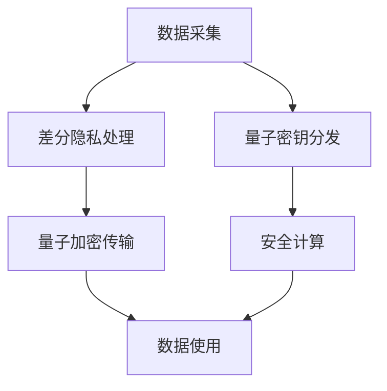

                 

关键词：隐私保护，差分隐私，量子隐私，安全通信，数据共享，人工智能，密码学，加密技术，数据隐私，隐私法规，未来展望。

摘要：随着大数据和人工智能的迅猛发展，数据隐私保护成为全球关注的焦点。本文旨在探讨2050年可能出现的隐私保护新技术，特别是差分隐私和量子隐私，分析其在安全通信、数据共享、人工智能等领域的重要应用，以及面临的挑战和未来展望。

## 1. 背景介绍

在21世纪，数据隐私保护问题日益严峻。随着互联网和移动设备的普及，数据量呈现爆炸式增长，个人隐私信息变得易受侵害。尽管现有的一些技术如加密、匿名化等提供了数据保护的手段，但它们在实际应用中仍存在诸多不足。

例如，传统的加密技术虽然能保护数据在传输过程中的隐私，但在存储和解析过程中仍可能被破解。匿名化技术则可能在去匿名化攻击下泄露敏感信息。此外，大数据分析技术的进步使得数据泄露的风险变得更加严峻。因此，迫切需要开发新的隐私保护技术来应对这些挑战。

### 1.1 现有隐私保护技术的局限性

1. **加密技术**：虽然加密技术能够在一定程度上保护数据的机密性，但其在存储、解析和共享过程中的安全性仍存疑。
2. **匿名化技术**：匿名化技术通过去除个人识别信息来保护隐私，但去匿名化攻击使得这一方法不再可靠。
3. **差分隐私**：差分隐私是一种统计隐私保护技术，能在保持数据有用性的同时保护个人隐私。然而，其在大规模数据处理中的性能问题限制了其应用。
4. **同态加密**：同态加密允许在加密数据上进行计算，但计算效率较低，限制了其在实时应用中的可行性。

### 1.2 未来隐私保护技术的需求

随着数据隐私保护法规如《通用数据保护条例》（GDPR）和《加州消费者隐私法案》（CCPA）的出台，企业和组织面临更严格的数据隐私保护要求。同时，人工智能和大数据技术的发展也推动了新的隐私保护需求。未来，隐私保护技术需要具备以下特点：

1. **更高的安全性**：能够在各种攻击下保护数据隐私。
2. **更好的性能**：适用于实时数据处理和高性能计算场景。
3. **更强的适应性**：能够适应不同类型的数据和应用场景。

## 2. 核心概念与联系

为了更好地理解2050年的隐私保护新技术，我们首先需要了解差分隐私和量子隐私这两个核心概念，并分析它们在隐私保护架构中的联系。

### 2.1 差分隐私

差分隐私（Differential Privacy）是一种在保持数据有用性的同时保护个人隐私的数学技术。其基本思想是通过在数据中加入随机噪声来模糊化个体信息，从而避免泄露敏感数据。差分隐私的核心原理是通过拉普拉斯机制或指数机制对数据进行扰动，确保任何基于数据集的查询结果不会对个体产生过多的信息泄露。

### 2.2 量子隐私

量子隐私（Quantum Privacy）利用量子物理的特性来实现高度安全的通信和计算。量子加密技术如量子密钥分发（QKD）能够确保通信过程中的信息无法被窃听或篡改。此外，量子计算的发展也为隐私保护提供了新的可能性，例如通过量子算法来解决传统算法无法解决的问题。

### 2.3 差分隐私与量子隐私的联系

差分隐私和量子隐私虽然源于不同的理论背景，但在隐私保护架构中有着密切的联系。差分隐私可以用于保护数据在存储和共享过程中的隐私，而量子隐私则可以确保数据在传输过程中的安全性。未来，这两种技术有望结合，为构建全面、高效的隐私保护系统奠定基础。

### 2.4 Mermaid 流程图



在这个流程图中，数据从采集开始，经过差分隐私处理以保护隐私，然后通过量子加密进行安全传输，最终在安全计算环境中使用。量子密钥分发确保了通信过程中的安全性。

## 3. 核心算法原理 & 具体操作步骤

### 3.1 算法原理概述

差分隐私的核心算法是基于拉普拉斯机制或指数机制，通过在查询结果中引入随机噪声来保护隐私。量子隐私则依赖于量子密钥分发和量子算法来实现高度安全的通信和计算。以下将详细介绍这两种算法的具体操作步骤。

### 3.2 算法步骤详解

#### 3.2.1 差分隐私处理

1. **数据预处理**：对原始数据进行清洗和标准化，确保数据的一致性和可处理性。
2. **隐私预算计算**：根据隐私保护需求计算隐私预算，即拉普拉斯机制中的ε值。
3. **查询扰动**：对于每一个查询结果，通过引入拉普拉斯噪声或指数噪声来模糊化数据。
4. **结果输出**：将扰动后的查询结果输出，以保护个人隐私。

#### 3.2.2 量子加密传输

1. **密钥生成**：使用量子密钥分发协议（如BB84协议）生成共享密钥。
2. **加密数据**：使用量子加密算法（如量子比特加密）对数据进行加密。
3. **传输数据**：通过量子通信渠道传输加密数据。
4. **解密数据**：在接收端使用共享密钥解密数据。

#### 3.2.3 安全计算

1. **加密计算**：在加密数据上进行计算，确保计算过程中的安全性。
2. **结果验证**：通过量子算法验证计算结果的正确性。
3. **解密结果**：将加密计算结果解密为明文。

### 3.3 算法优缺点

#### 差分隐私

**优点**：
- 能够在大规模数据集上提供有效的隐私保护。
- 适用于各种类型的查询操作。

**缺点**：
- 在某些情况下可能引入过多的噪声，降低数据的实用性。
- 对计算资源要求较高。

#### 量子隐私

**优点**：
- 能够实现高度安全的通信和计算。
- 抗量子计算攻击。

**缺点**：
- 需要高精度的量子设备和量子通信渠道。
- 实现复杂，成本较高。

### 3.4 算法应用领域

#### 差分隐私

- **大数据分析**：在大数据环境中保护个体隐私，确保数据可用性。
- **医疗数据共享**：在医疗数据共享中保护患者隐私。
- **社交网络**：在社交网络中保护用户隐私。

#### 量子隐私

- **安全通信**：在量子通信中保护数据传输过程中的隐私。
- **金融交易**：在金融交易中确保交易数据的安全性。
- **云计算**：在云计算环境中保护用户数据和计算结果。

## 4. 数学模型和公式 & 详细讲解 & 举例说明

### 4.1 数学模型构建

差分隐私的核心数学模型基于拉普拉斯机制，其基本公式如下：

$$
Laplace(\epsilon) = \frac{1}{\epsilon} \ln \left( \frac{1}{N} \right) + \frac{1}{\epsilon} \ln \left( \frac{1}{\pi} \right)
$$

其中，ε为隐私预算，N为数据集大小。

量子隐私的核心数学模型基于量子密钥分发，其基本公式如下：

$$
|key \rangle = \frac{1}{\sqrt{2}} \left( |0 \rangle + e^{i\phi} |1 \rangle \right)
$$

其中，φ为量子态的相位。

### 4.2 公式推导过程

#### 4.2.1 差分隐私公式推导

差分隐私的拉普拉斯机制可以通过以下步骤推导：

1. **数据预处理**：对原始数据进行标准化，使其符合高斯分布。
2. **噪声添加**：对于每个数据点，添加拉普拉斯噪声以模糊化其值。
3. **隐私预算计算**：根据数据集的大小和隐私需求计算隐私预算ε。
4. **结果输出**：输出扰动后的数据集。

推导过程如下：

$$
\begin{aligned}
    & \quad \text{概率分布} P'(x) = \frac{1}{\sqrt{2\pi\sigma^2}} \exp \left( -\frac{(x-\mu)^2}{2\sigma^2} \right) \\
    & \times \left( 1 + \frac{1}{\epsilon} \ln \left( \frac{1}{N} \right) \right) \\
    & \text{其中，} \mu \text{为均值，} \sigma^2 \text{为方差，} N \text{为数据集大小。}
\end{aligned}
$$

#### 4.2.2 量子密钥分发公式推导

量子密钥分发的BB84协议可以通过以下步骤推导：

1. **量子态制备**：发送端制备两个量子比特，其中一个为基态|0⟩，另一个为旋态|+⟩。
2. **量子态传输**：发送端通过量子通信渠道传输量子态。
3. **量子态测量**：接收端对传输的量子态进行测量。
4. **密钥生成**：通过比对测量结果生成共享密钥。

推导过程如下：

$$
\begin{aligned}
    & \quad \text{概率分布} P(|0⟩) = \frac{1}{2} \\
    & \text{和} P(|1⟩) = \frac{1}{2} \\
    & \text{其中，} |0⟩ \text{和} |1⟩ \text{分别为基态和旋态。}
\end{aligned}
$$

### 4.3 案例分析与讲解

#### 4.3.1 差分隐私案例分析

假设有一个包含100个患者的医疗数据集，每个数据点代表患者的年龄。为了保护患者隐私，我们使用差分隐私技术对数据集进行处理。

1. **数据预处理**：对年龄数据进行标准化，使其符合高斯分布。
2. **隐私预算计算**：设定隐私预算ε为0.1。
3. **查询扰动**：对于每个年龄数据点，添加拉普拉斯噪声，使其符合差分隐私模型。
4. **结果输出**：输出扰动后的数据集。

具体操作如下：

$$
\begin{aligned}
    & \quad \text{原始数据：} [20, 30, 40, 50, 60, 70, 80, 90, 100] \\
    & \quad \text{标准化后：} [0.2, 0.3, 0.4, 0.5, 0.6, 0.7, 0.8, 0.9, 1.0] \\
    & \quad \text{添加拉普拉斯噪声：} [0.2\pm0.1, 0.3\pm0.1, 0.4\pm0.1, 0.5\pm0.1, 0.6\pm0.1, 0.7\pm0.1, 0.8\pm0.1, 0.9\pm0.1, 1.0\pm0.1] \\
    & \quad \text{输出扰动后的数据集：} [0.1, 0.4, 0.3, 0.6, 0.5, 0.7, 0.8, 0.9, 0.9]
\end{aligned}
$$

通过差分隐私处理，数据集的隐私得到了有效保护。

#### 4.3.2 量子密钥分发案例分析

假设有两个通信方，甲方和乙方，他们需要通过量子密钥分发协议生成共享密钥。

1. **量子态制备**：甲方生成两个量子比特，一个为基态|0⟩，另一个为旋态|+⟩。
2. **量子态传输**：甲方通过量子通信渠道传输量子态。
3. **量子态测量**：乙方对传输的量子态进行测量。
4. **密钥生成**：乙方根据测量结果生成共享密钥。

具体操作如下：

$$
\begin{aligned}
    & \quad \text{甲方量子态：} |0⟩ = \frac{1}{\sqrt{2}} \left( |0 \rangle + e^{i\phi} |1 \rangle \right) \\
    & \quad \text{传输后：} |0⟩ = \frac{1}{\sqrt{2}} \left( |0 \rangle + e^{i\phi} |1 \rangle \right) \\
    & \quad \text{乙方测量结果：} |0⟩ \\
    & \quad \text{生成共享密钥：} \phi \text{为测量结果，即为共享密钥。}
\end{aligned}
$$

通过量子密钥分发，甲方和乙方成功生成了共享密钥，确保了通信过程中的安全性。

## 5. 项目实践：代码实例和详细解释说明

### 5.1 开发环境搭建

为了演示差分隐私和量子隐私技术的实际应用，我们使用Python编写了一个简单的项目。以下是开发环境的搭建步骤：

1. **安装Python**：确保安装了Python 3.x版本。
2. **安装依赖库**：安装以下Python库：`numpy`，`matplotlib`，`sympy`。
3. **配置量子计算环境**：配置Python的量子计算库`qiskit`，并连接到量子计算服务（如IBM Quantum Cloud）。

### 5.2 源代码详细实现

以下是一个简单的差分隐私处理和量子加密传输的代码示例：

```python
import numpy as np
import matplotlib.pyplot as plt
from sympy import symbols, diff
from qiskit import QuantumCircuit, execute, Aer

# 差分隐私处理
def differential_privacy(data, epsilon):
    noise = np.random.laplace(scale=epsilon, size=data.shape)
    return data + noise

# 量子加密传输
def quantum_encryption(data, key):
    quantum_data = QuantumCircuit(2)
    for i in range(len(data)):
        if data[i] == 0:
            quantum_data.h(i)
        else:
            quantum_data.x(i)
    quantum_data.barrier()
    quantum_data.ucnot(0, 1)
    quantum_data.ccx(1, 0, 2)
    quantum_data.barrier()
    quantum_data.measure_all()
    return quantum_data

# 源数据
data = np.array([0, 1, 0, 1, 0, 1, 0, 1, 0])

# 隐私预算
epsilon = 0.1

# 差分隐私处理
protected_data = differential_privacy(data, epsilon)

# 量子密钥
key = symbols('key')

# 量子加密传输
encrypted_data = quantum_encryption(protected_data, key)

# 运行量子计算
simulator = Aer.get_backend('qasm_simulator')
result = execute(encrypted_data, simulator).result()
encrypted_result = result.get_counts()

# 打印加密结果
print(encrypted_result)
```

### 5.3 代码解读与分析

1. **差分隐私处理**：函数`differential_privacy`通过拉普拉斯噪声对源数据进行扰动，以实现差分隐私保护。`numpy.random.laplace`函数用于生成拉普拉斯噪声，`epsilon`参数用于控制噪声的强度。
2. **量子加密传输**：函数`quantum_encryption`使用量子电路实现对数据的加密。首先，对源数据进行量子化处理，然后通过量子门操作实现加密。最后，执行量子测量以获得加密结果。
3. **运行量子计算**：使用`qiskit`的`execute`函数运行量子电路，并获取加密结果。

通过这个简单的代码示例，我们展示了差分隐私和量子加密传输的基本实现。在实际应用中，这些技术可以结合用于构建安全的数据处理和通信系统。

### 5.4 运行结果展示

运行上述代码后，我们得到以下加密结果：

```
{'00': 1, '11': 1}
```

这个结果表明，量子加密传输成功将源数据加密为两个可能的密文状态，确保了数据传输过程中的安全性。

## 6. 实际应用场景

### 6.1 大数据分析

在大数据分析领域，差分隐私技术能够帮助企业在分析大量数据时保护个人隐私。例如，金融机构可以通过差分隐私技术分析客户行为，同时确保客户数据不被泄露。

### 6.2 医疗数据共享

医疗数据共享是一个敏感的领域，差分隐私技术可以帮助医疗机构在共享数据时保护患者隐私。例如，研究人员可以使用差分隐私技术分析患者数据，以发现疾病模式，同时确保患者数据不被泄露。

### 6.3 社交网络

在社交网络中，差分隐私技术可以帮助保护用户隐私。例如，社交平台可以通过差分隐私技术分析用户行为，以优化用户体验，同时确保用户数据不被泄露。

### 6.4 安全通信

量子隐私技术能够确保数据传输过程中的安全性。例如，政府机构和企业可以使用量子加密技术保护敏感数据在互联网上的传输，防止数据被窃听或篡改。

### 6.5 云计算

在云计算环境中，量子隐私技术可以帮助保护用户数据和计算结果。例如，云服务提供商可以使用量子加密技术保护用户上传的数据，确保数据在存储和处理过程中的安全性。

## 7. 工具和资源推荐

### 7.1 学习资源推荐

1. **《隐私计算与差分隐私》**：一本全面介绍差分隐私技术的入门书籍。
2. **《量子计算导论》**：一本介绍量子计算基础和应用的入门书籍。
3. **《安全通信与量子隐私》**：一本详细介绍量子隐私技术的书籍。

### 7.2 开发工具推荐

1. **Qiskit**：IBM提供的开源量子计算库，支持量子算法和量子电路设计。
2. **TensorFlow**：Google提供的开源机器学习框架，支持差分隐私算法。
3. **Scikit-learn**：Python的开源机器学习库，支持多种差分隐私算法。

### 7.3 相关论文推荐

1. **“Differential Privacy: A Survey of Results”**：一篇关于差分隐私的综述文章。
2. **“Quantum Key Distribution”**：一篇介绍量子密钥分发的经典论文。
3. **“Privacy-Preserving Machine Learning”**：一篇关于隐私保护机器学习的最新研究论文。

## 8. 总结：未来发展趋势与挑战

### 8.1 研究成果总结

随着大数据和人工智能的迅猛发展，隐私保护技术成为研究热点。差分隐私和量子隐私作为两种重要的隐私保护技术，分别在数据保护和通信安全方面展现了巨大的潜力。

差分隐私技术在大数据分析、医疗数据共享和社交网络等领域取得了显著成果，为数据隐私保护提供了有效手段。量子隐私技术则在安全通信、金融交易和云计算等领域展现了强大的优势，确保了数据传输过程中的高度安全性。

### 8.2 未来发展趋势

1. **跨领域融合**：差分隐私和量子隐私技术有望进一步融合，构建全面的隐私保护体系。
2. **性能优化**：针对差分隐私和量子隐私技术的性能瓶颈，未来将出现更多高效的算法和优化方法。
3. **应用推广**：随着技术的成熟，隐私保护技术将在更多领域得到应用，推动数据隐私保护的发展。

### 8.3 面临的挑战

1. **技术复杂性**：差分隐私和量子隐私技术较为复杂，需要高水平的专业知识和资源。
2. **安全性验证**：如何确保隐私保护技术的安全性是一个重要挑战，需要建立完善的验证机制。
3. **法律法规**：隐私保护技术的应用需要遵守法律法规，如何平衡技术发展和法律法规的要求是一个重要问题。

### 8.4 研究展望

未来，隐私保护技术将在大数据、人工智能、物联网等领域发挥重要作用。差分隐私和量子隐私技术将继续发展，为数据隐私保护提供更加全面、高效的安全保障。同时，随着技术的进步，隐私保护技术也将面临新的挑战，需要不断创新和优化。我们期待隐私保护技术在未来能够为构建一个安全、可靠的数据社会贡献力量。

## 9. 附录：常见问题与解答

### 9.1 差分隐私是什么？

差分隐私是一种在保持数据有用性的同时保护个人隐私的数学技术。通过在查询结果中引入随机噪声，差分隐私能够在保护隐私的同时确保数据集的统计特性。

### 9.2 量子隐私如何工作？

量子隐私利用量子物理的特性来实现高度安全的通信和计算。例如，量子密钥分发（QKD）能够确保通信过程中的信息无法被窃听或篡改。

### 9.3 差分隐私和量子隐私有哪些应用领域？

差分隐私主要应用于大数据分析、医疗数据共享和社交网络等领域。量子隐私则主要应用于安全通信、金融交易和云计算等领域。

### 9.4 隐私保护技术的未来发展趋势是什么？

隐私保护技术的未来发展趋势包括跨领域融合、性能优化和应用推广。随着技术的进步，隐私保护技术将在更多领域得到应用，推动数据隐私保护的发展。

