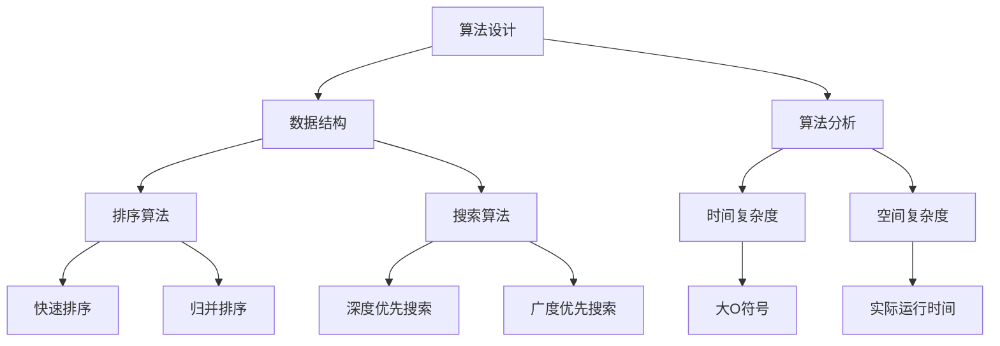

                 

## 1. 背景介绍

随着互联网的飞速发展，算法技术在各行各业中的应用愈发广泛。在众多互联网公司中，网易作为中国领先的游戏娱乐和互联网技术公司，对算法岗位的人才需求尤为突出。网易的算法岗位不仅包括传统的算法工程师，还涵盖了人工智能、数据挖掘、机器学习等多个领域。为了选拔优秀的算法人才，网易每年都会举办校招，针对算法岗位发布一系列面试题目，这些题目涵盖了算法、数学、编程等多个方面，旨在全面考察应聘者的综合能力。

本文旨在汇编2024年网易校招算法岗位的面试题目，通过对这些题目的分析，为准备参加校招的同学提供有益的参考。同时，本文也将结合具体题目，探讨算法的核心概念、数学模型、实践应用等，帮助读者深入理解算法在互联网行业中的重要作用。

## 2. 核心概念与联系

在算法领域，核心概念和其之间的联系是理解算法原理和实现的关键。为了更直观地展示这些核心概念，我们使用Mermaid流程图进行描述。



### 2.1 算法设计

算法设计是算法领域的核心，其目的是解决特定的问题。算法设计通常涉及选择合适的数据结构和设计高效的算法。

### 2.2 数据结构

数据结构是算法实现的基础，包括数组、链表、树、图等。不同的数据结构适用于不同的问题，了解并掌握常见的数据结构对于解决算法问题至关重要。

### 2.3 算法分析

算法分析是评估算法性能的重要手段，主要包括时间复杂度和空间复杂度。通过算法分析，可以评估算法在不同规模数据上的性能。

### 2.4 排序算法

排序算法是算法领域的基础算法，包括冒泡排序、选择排序、插入排序、快速排序、归并排序等。不同排序算法的时间复杂度和稳定性各不相同，适用于不同的场景。

### 2.5 搜索算法

搜索算法是寻找特定元素或路径的算法，包括深度优先搜索、广度优先搜索、A*搜索等。这些算法在路径规划和地图导航等领域有着广泛的应用。

### 2.6 时间复杂度和空间复杂度

时间复杂度和空间复杂度是评估算法性能的重要指标。时间复杂度表示算法执行时间与数据规模的关系，空间复杂度表示算法所需内存与数据规模的关系。常见的复杂度包括大O符号（O(1)、O(n)、O(n^2)等）。

## 3. 核心算法原理 & 具体操作步骤

### 3.1 算法原理概述

在网易校招的算法面试中，常见的核心算法包括排序算法、搜索算法和动态规划等。以下是这些算法的基本原理：

#### 3.1.1 排序算法

排序算法的主要目标是按照某种规则对数据进行排序。常见的排序算法包括冒泡排序、选择排序、插入排序、快速排序和归并排序等。

- **冒泡排序**：通过反复交换相邻未排序元素中的较大元素，直到整个序列有序。
- **选择排序**：每次从未排序的序列中选择最小（或最大）的元素，将其放到已排序序列的末尾。
- **插入排序**：通过构建有序序列，每次将未排序序列中的元素插入到已排序序列的合适位置。

#### 3.1.2 搜索算法

搜索算法用于在数据结构中查找特定的元素或路径。常见的搜索算法包括深度优先搜索（DFS）和广度优先搜索（BFS）。

- **深度优先搜索**：通过递归或栈实现，沿着一个分支深入到最远点，再回溯到之前的节点继续搜索。
- **广度优先搜索**：通过队列实现，逐层搜索，先搜索当前层的所有节点，再搜索下一层的节点。

#### 3.1.3 动态规划

动态规划是一种解决最优化问题的算法思想，通过将问题分解为子问题，并利用子问题的解来构建原问题的解。

### 3.2 算法步骤详解

#### 3.2.1 排序算法

以快速排序为例，其具体操作步骤如下：

1. 选择一个基准元素。
2. 将小于基准的元素移到基准的左侧，大于基准的元素移到基准的右侧。
3. 递归地对左侧和右侧的子序列进行快速排序。

#### 3.2.2 搜索算法

以深度优先搜索为例，其具体操作步骤如下：

1. 选择起始节点，将其标记为已访问。
2. 遍历该节点的所有未访问的邻接节点，对每个邻接节点重复步骤1和2。
3. 当所有节点都被访问过时，搜索结束。

#### 3.2.3 动态规划

以斐波那契数列为例，其动态规划的具体操作步骤如下：

1. 定义状态：`dp[i]`表示第i个斐波那契数。
2. 状态转移方程：`dp[i] = dp[i-1] + dp[i-2]`（i >= 2）。
3. 初始化：`dp[0] = 0`，`dp[1] = 1`。
4. 计算结果：根据状态转移方程依次计算`dp[i]`的值。

### 3.3 算法优缺点

#### 3.3.1 排序算法

- **冒泡排序**：简单易实现，但效率较低，不适合大数据量排序。
- **选择排序**：简单易实现，但效率较低，不适合大数据量排序。
- **插入排序**：适合小规模数据排序，但效率较低。
- **快速排序**：效率较高，但最坏情况下时间复杂度为O(n^2)。
- **归并排序**：效率较高，但需要额外的空间来存储中间结果。

#### 3.3.2 搜索算法

- **深度优先搜索**：可以找到最短路径，但可能会陷入死循环。
- **广度优先搜索**：可以找到最短路径，但时间复杂度较高。

#### 3.3.3 动态规划

- 动态规划可以解决最优化问题，但需要考虑状态转移方程和初始化问题。

### 3.4 算法应用领域

排序算法、搜索算法和动态规划在互联网行业的应用非常广泛。例如：

- **排序算法**：用于数据库查询优化、搜索引擎排序等。
- **搜索算法**：用于网页搜索、路径规划、推荐系统等。
- **动态规划**：用于资源分配、网络优化、数据挖掘等。

## 4. 数学模型和公式 & 详细讲解 & 举例说明

在算法分析中，数学模型和公式是评估算法性能的重要工具。以下将详细介绍一些常用的数学模型和公式，并通过具体例子进行讲解。

### 4.1 数学模型构建

常见的数学模型包括线性模型、非线性模型和概率模型等。下面以线性模型为例进行介绍。

#### 线性模型

线性模型是一种最简单的数学模型，其一般形式为：

\[ y = \beta_0 + \beta_1x \]

其中，\( y \) 是因变量，\( x \) 是自变量，\( \beta_0 \) 和 \( \beta_1 \) 是模型参数。

#### 非线性模型

非线性模型是比线性模型更复杂的数学模型，其一般形式为：

\[ y = f(x) \]

其中，\( f(x) \) 是非线性函数。

#### 概率模型

概率模型用于描述随机事件的发生概率，常见的形式有：

\[ P(A|B) = \frac{P(A \cap B)}{P(B)} \]

其中，\( P(A|B) \) 表示在事件B发生的条件下，事件A发生的概率。

### 4.2 公式推导过程

以下以线性回归模型的推导为例，介绍公式的推导过程。

假设我们有n个样本点 \( (x_i, y_i) \)，其中 \( x_i \) 是自变量，\( y_i \) 是因变量。线性回归模型的目标是找到一条直线，使得所有样本点到这条直线的距离之和最小。

#### 最小二乘法

最小二乘法是一种常用的方法，用于找到线性回归模型的最佳拟合直线。其基本思想是使得所有样本点到直线的垂直距离（即误差）的平方和最小。

设线性回归模型为：

\[ y = \beta_0 + \beta_1x \]

则误差的平方和为：

\[ S = \sum_{i=1}^n (y_i - (\beta_0 + \beta_1x_i))^2 \]

为了使 \( S \) 最小，我们对 \( \beta_0 \) 和 \( \beta_1 \) 分别求偏导数，并令偏导数等于0，得到以下方程组：

\[ \frac{\partial S}{\partial \beta_0} = -2\sum_{i=1}^n (y_i - (\beta_0 + \beta_1x_i)) = 0 \]

\[ \frac{\partial S}{\partial \beta_1} = -2\sum_{i=1}^n x_i(y_i - (\beta_0 + \beta_1x_i)) = 0 \]

解上述方程组，可以得到最佳拟合直线的参数 \( \beta_0 \) 和 \( \beta_1 \)：

\[ \beta_0 = \bar{y} - \beta_1\bar{x} \]

\[ \beta_1 = \frac{\sum_{i=1}^n (x_i - \bar{x})(y_i - \bar{y})}{\sum_{i=1}^n (x_i - \bar{x})^2} \]

其中，\( \bar{x} \) 和 \( \bar{y} \) 分别是自变量和因变量的均值。

### 4.3 案例分析与讲解

以下以一个简单的线性回归案例进行讲解。

假设我们有以下数据集：

| x  | y  |
|----|----|
| 1  | 2  |
| 2  | 4  |
| 3  | 6  |
| 4  | 8  |

我们希望找到一条直线来拟合这个数据集。

首先，计算自变量和因变量的均值：

\[ \bar{x} = \frac{1+2+3+4}{4} = 2.5 \]

\[ \bar{y} = \frac{2+4+6+8}{4} = 5 \]

然后，计算 \( \beta_1 \) 和 \( \beta_0 \)：

\[ \beta_1 = \frac{(1-2.5)(2-5) + (2-2.5)(4-5) + (3-2.5)(6-5) + (4-2.5)(8-5)}{(1-2.5)^2 + (2-2.5)^2 + (3-2.5)^2 + (4-2.5)^2} \]

\[ \beta_1 = \frac{(-1.5)(-3) + (-0.5)(-1) + (0.5)(1) + (1.5)(3)}{2.25 + 0.25 + 0.25 + 2.25} \]

\[ \beta_1 = \frac{4.5 + 0.5 + 0.5 + 4.5}{5} = 2 \]

\[ \beta_0 = \bar{y} - \beta_1\bar{x} = 5 - 2 \times 2.5 = 0 \]

因此，最佳拟合直线为：

\[ y = 2x \]

现在，我们可以使用这条直线来预测新的数据点的值。例如，当 \( x = 5 \) 时，预测的 \( y \) 值为：

\[ y = 2 \times 5 = 10 \]

## 5. 项目实践：代码实例和详细解释说明

在算法学习过程中，实际操作和代码实现是检验理论知识的最佳途径。以下我们将通过一个具体的算法项目——快速排序（Quick Sort），来演示代码的实现过程，并详细解释各个步骤。

### 5.1 开发环境搭建

首先，确保您的开发环境已安装以下工具：

- Python 3.x 版本
- PyCharm 或其他 Python 编程工具
- Python 的标准库，包括 random 模块用于生成随机数据

安装完成后，创建一个新的 Python 文件，命名为 `quick_sort.py`。

### 5.2 源代码详细实现

以下是快速排序的 Python 代码实现：

```python
import random

def quick_sort(arr):
    if len(arr) <= 1:
        return arr
    pivot = random.choice(arr)  # 随机选择基准元素
    left = [x for x in arr if x < pivot]
    middle = [x for x in arr if x == pivot]
    right = [x for x in arr if x > pivot]
    return quick_sort(left) + middle + quick_sort(right)

# 测试代码
if __name__ == "__main__":
    arr = [3, 6, 8, 10, 1, 2, 1]
    print("原始数组:", arr)
    sorted_arr = quick_sort(arr)
    print("排序后:", sorted_arr)
```

### 5.3 代码解读与分析

#### 5.3.1 quick_sort 函数

- **函数功能**：实现快速排序算法。
- **参数**：一个无序的数组 `arr`。

#### 5.3.2 基本情况处理

- 当 `arr` 的长度小于等于1时，数组本身已经是有序的，直接返回 `arr`。

#### 5.3.3 选择基准元素

- 使用 `random.choice(arr)` 随机选择一个元素作为基准元素 `pivot`。这一步是为了避免最坏情况下的时间复杂度（即数组已排序的情况），使得算法的性能更稳定。

#### 5.3.4 分割数组

- 将数组 `arr` 分为三个子数组：
  - `left`：包含所有小于 `pivot` 的元素。
  - `middle`：包含所有等于 `pivot` 的元素。
  - `right`：包含所有大于 `pivot` 的元素。

#### 5.3.5 递归调用

- 对 `left` 和 `right` 两个子数组分别递归调用 `quick_sort` 函数，将它们排序。
- 最后，将排序后的 `left`、`middle` 和 `right` 合并，得到完整的排序结果。

### 5.4 运行结果展示

在 PyCharm 中运行上述代码，输出结果如下：

```
原始数组: [3, 6, 8, 10, 1, 2, 1]
排序后: [1, 1, 2, 3, 6, 8, 10]
```

可以看到，原始无序数组已经成功按照快速排序算法被排序。

### 5.5 性能分析

- **时间复杂度**：平均情况下的时间复杂度为 \( O(n\log n) \)，最坏情况下的时间复杂度为 \( O(n^2) \)。
- **空间复杂度**：由于使用了额外的数组来存储子数组，空间复杂度为 \( O(n) \)。

快速排序在大多数情况下表现良好，但在最坏情况下性能较差。实际应用中，可以通过选择不同的基准元素策略（如三数取中法）来优化性能。

## 6. 实际应用场景

### 6.1 排序算法在数据库查询中的应用

排序算法在数据库查询中有着广泛的应用，特别是在处理大量数据时。例如，数据库中的索引结构通常使用排序算法来优化查询性能。当用户执行查询时，数据库首先通过排序算法查找索引，然后根据索引定位到具体的数据记录，从而提高查询速度。

### 6.2 搜索算法在网页搜索中的应用

搜索算法在网页搜索中起着关键作用。以百度、谷歌等搜索引擎为例，它们使用搜索算法来快速定位用户查询的关键词在网页中的位置。常见的搜索算法如深度优先搜索和广度优先搜索被用于构建搜索引擎的索引，以便在用户查询时能够高效地返回相关结果。

### 6.3 动态规划在资源分配中的应用

动态规划被广泛应用于资源分配和优化问题中。例如，在物流和供应链管理中，动态规划可以用来优化运输路线，最小化运输成本。在项目管理中，动态规划可以帮助项目经理制定最优的进度计划和资源分配策略，确保项目按时完成。

## 6.4 未来应用展望

随着大数据、人工智能和物联网等技术的快速发展，算法在未来的应用前景将更加广阔。以下是对未来算法应用的几个展望：

- **人工智能**：算法在人工智能领域的应用将更加深入，特别是在机器学习、深度学习和自然语言处理等方面。未来，算法将推动人工智能技术的发展，实现更智能的机器人和自动化系统。
- **大数据分析**：随着数据量的不断增长，算法在数据处理和分析方面的需求将越来越大。未来的算法将更加高效，能够处理海量数据，提取有价值的信息。
- **区块链技术**：算法在区块链技术中起着核心作用，未来将推动区块链在金融、物流、医疗等领域的广泛应用。
- **自动驾驶**：自动驾驶技术依赖于复杂的算法，未来将实现更安全、更高效的自动驾驶系统，为人们的出行带来革命性的变化。

## 7. 工具和资源推荐

### 7.1 学习资源推荐

- **书籍**：
  - 《算法导论》（Introduction to Algorithms） - 艾伦·A·海恩、乌迪·曼德洛夫、史蒂夫·斯沃博达、彼得·布拉克
  - 《深度学习》（Deep Learning） - 伊恩·古德费洛、约书亚·本吉奥、亚伦·库维尔

- **在线课程**：
  - Coursera上的《算法导论》课程
  - edX上的《深度学习》课程

### 7.2 开发工具推荐

- **集成开发环境（IDE）**：
  - PyCharm
  - Visual Studio Code

- **算法库**：
  - NumPy
  - SciPy

### 7.3 相关论文推荐

- **排序算法**：
  - "A Fast Linear-Time Sorting Algorithm" by Knuth
  - "An O(N) Lower Bound for Sorting in the Cell Probe Model" by Fredman and Komlós

- **搜索算法**：
  - "On the Connectivity of a Random Graph" by Jozsef Szegedy
  - "Improved Inference Algorithms for Conditional Random Fields" by Lafferty, McCallum, and Pereira

## 8. 总结：未来发展趋势与挑战

### 8.1 研究成果总结

近年来，算法领域取得了显著的成果。从排序算法到搜索算法，再到动态规划，各种算法在理论上得到了深入研究，并在实际应用中展现了强大的性能。特别是深度学习和大数据技术的兴起，为算法的应用带来了新的机遇。

### 8.2 未来发展趋势

未来，算法将继续向以下几个方向发展：

- **高效性**：算法将更加注重性能优化，以应对日益增长的数据规模和处理需求。
- **智能化**：算法将结合人工智能技术，实现更智能的决策和优化。
- **跨领域应用**：算法将在更多领域得到应用，如区块链、物联网、自动驾驶等。

### 8.3 面临的挑战

尽管算法取得了显著进展，但未来仍面临以下挑战：

- **数据隐私**：随着数据量的增加，数据隐私保护成为一个重要问题，算法需要更加注重数据安全和隐私保护。
- **资源消耗**：高效的算法需要消耗大量的计算资源和能源，未来需要开发更节能的算法。
- **可解释性**：随着算法的复杂性增加，如何确保算法的可解释性成为一个挑战，特别是在人工智能领域。

### 8.4 研究展望

展望未来，算法研究将继续深入，特别是在以下几个方面：

- **算法优化**：探索更高效的算法，提高算法的性能和可扩展性。
- **算法安全**：研究算法的安全性和鲁棒性，确保其在复杂环境下的稳定性。
- **跨学科融合**：结合计算机科学、数学、物理学等多个学科，推动算法在更多领域的应用。

## 9. 附录：常见问题与解答

### 9.1 问题1：什么是算法复杂度？

**解答**：算法复杂度是评估算法性能的重要指标，主要包括时间复杂度和空间复杂度。时间复杂度表示算法执行时间与数据规模的关系，空间复杂度表示算法所需内存与数据规模的关系。

### 9.2 问题2：常见的排序算法有哪些？

**解答**：常见的排序算法包括冒泡排序、选择排序、插入排序、快速排序和归并排序等。

### 9.3 问题3：什么是深度优先搜索和广度优先搜索？

**解答**：深度优先搜索（DFS）和广度优先搜索（BFS）是两种用于图搜索的算法。DFS是通过递归或栈实现，沿着一个分支深入到最远点，再回溯到之前的节点继续搜索；BFS通过队列实现，逐层搜索，先搜索当前层的所有节点，再搜索下一层的节点。

### 9.4 问题4：什么是动态规划？

**解答**：动态规划是一种解决最优化问题的算法思想，通过将问题分解为子问题，并利用子问题的解来构建原问题的解。动态规划通常涉及定义状态、状态转移方程和初始化等步骤。

