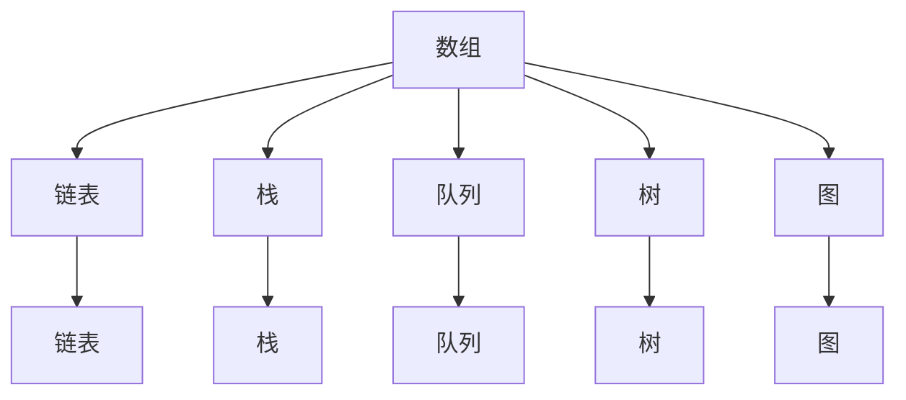
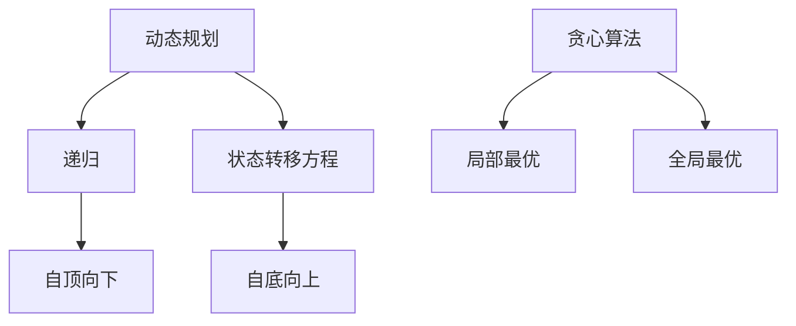
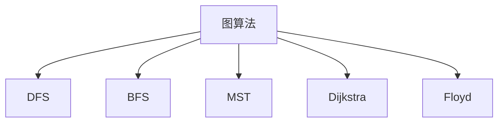

                 

## 1. 背景介绍

随着信息技术的飞速发展，数据量和处理速度的不断增长，算法在各个领域中的应用越来越广泛。尤其是在互联网公司，算法技术已经成为核心竞争力之一。网易作为中国知名的高科技互联网企业，其在算法岗位的招聘上尤为重视。本文旨在汇编2025年网易校招算法岗位的面试题目，为广大求职者提供参考和指导。

算法面试是考察应聘者算法能力和逻辑思维的重要环节。通常包括数据结构、算法原理、数学模型、编程实践等多个方面。通过这些题目的考察，招聘方能够全面了解应聘者的技术水平和解决实际问题的能力。

本文将分为以下几个部分：

- 背景介绍：简要介绍算法面试的重要性以及本文的目的和结构。
- 核心概念与联系：阐述算法面试中涉及的核心概念及其关系，通过Mermaid流程图展示。
- 核心算法原理与具体操作步骤：详细讲解常见算法的原理和操作步骤，分析算法的优缺点及其应用领域。
- 数学模型和公式：介绍算法中的数学模型和公式，并进行详细讲解和案例分析。
- 项目实践：提供实际代码实例，详细解释其实现过程、解读和分析。
- 实际应用场景：探讨算法在现实中的应用场景，以及未来的发展趋势和挑战。
- 工具和资源推荐：推荐相关学习资源和开发工具，帮助读者更好地学习和实践。
- 总结：总结研究成果，探讨未来发展趋势和面临的挑战。

希望通过本文，能够帮助读者更好地准备网易校招算法岗位的面试，提高自己的竞争力。

## 2. 核心概念与联系

算法面试涉及的核心概念繁多，其中最为基础且重要的包括数据结构、算法复杂度分析、动态规划、贪心算法、图算法等。下面将使用Mermaid流程图来展示这些核心概念及其相互关系。

首先，我们来看数据结构。数据结构是算法的基础，常见的有数组、链表、栈、队列、树、图等。每种数据结构都有其独特的特点和适用场景。



接下来是算法复杂度分析，这是评估算法效率的重要手段。常见的时间复杂度有O(1)、O(logn)、O(n)、O(nlogn)、O(n^2)等，每种复杂度对应不同的算法和问题。

```mermaid
graph TD
A[时间复杂度] --> B[O(1)]
A --> C[O(logn)]
A --> D[O(n)]
A --> E[O(nlogn)]
A --> F[O(n^2)]
B --> G[常数时间]
C --> H[对数时间]
D --> I[线性时间]
E --> J[对数线性时间]
F --> K[平方时间]
```

动态规划和贪心算法是解决最优化问题的两种重要方法。动态规划通过将问题分解为子问题，并保存子问题的解来优化算法；而贪心算法通过在每一步选择当前最优解，以期得到全局最优解。



最后是图算法，图算法用于处理具有连接关系的数据集，常见的有深度优先搜索（DFS）、广度优先搜索（BFS）、最小生成树（MST）、最短路径算法（Dijkstra和Floyd）等。



通过上述Mermaid流程图，我们可以清晰地看到各个核心概念之间的联系。了解这些概念，不仅有助于我们更好地理解和掌握算法，还能在面试中展示出我们的技术深度和广度。

### 3. 核心算法原理与具体操作步骤

在了解了算法面试中的核心概念之后，接下来我们将深入探讨几种常见的核心算法原理和具体操作步骤，包括动态规划、贪心算法、排序算法等。每种算法都有其独特的应用场景和特点，下面将分别进行详细介绍。

#### 3.1 动态规划原理概述

动态规划（Dynamic Programming，DP）是一种用于解决最优化问题的算法技术。它通过将问题分解为子问题，并保存子问题的解，以避免重复计算，从而提高算法的效率。动态规划通常包含以下几个步骤：

1. **状态定义**：定义一个状态变量来表示问题的子结构。
2. **状态转移方程**：确定状态之间的转移关系，即如何从当前状态推导出下一个状态。
3. **边界条件**：确定问题的初始状态和终止条件。
4. **状态压缩**：对于某些特定问题，可以通过状态压缩来减少状态空间，提高算法效率。

#### 3.2 动态规划步骤详解

以经典的背包问题为例，假设有`n`件物品和容量为`V`的背包，每件物品的重量为`w[i]`，价值为`v[i]`。目标是选择若干物品放入背包，使得背包的总价值最大化，同时不超过背包的容量。

**步骤1：状态定义**

设`dp[i][j]`表示将前`i`件物品放入一个容量为`j`的背包中能获得的最大价值。

**步骤2：状态转移方程**

- 当不放入第`i`件物品时，`dp[i][j] = dp[i-1][j]`。
- 当放入第`i`件物品时，`dp[i][j] = dp[i-1][j-w[i]] + v[i]`。

因此，状态转移方程为：

$$
dp[i][j] = \begin{cases}
dp[i-1][j], & \text{若 } j < w[i] \\
\max(dp[i-1][j], dp[i-1][j-w[i]] + v[i]), & \text{否则}
\end{cases}
$$

**步骤3：边界条件**

- `dp[0][j] = 0`，即不放入任何物品时的价值为0。
- `dp[i][0] = 0`，即背包容量为0时，价值也为0。

**步骤4：状态压缩**

对于只有重量和价值两个维度的背包问题，可以采用状态压缩来减少状态空间。即使用一个一维数组`dp[j]`来表示状态，其中`j`表示剩余容量。

#### 3.3 动态规划优缺点

**优点：**
- **避免重复计算**：通过保存子问题的解，避免了重复计算，提高了算法效率。
- **适用于最优化问题**：动态规划是一种适用于解决最优化问题的算法技术。

**缺点：**
- **需要明确状态转移方程**：设计状态转移方程可能比较困难，需要深入理解问题本身。
- **存储空间需求较大**：特别是在状态空间较大时，需要较大的存储空间。

#### 3.4 动态规划应用领域

动态规划广泛应用于各种领域，包括但不限于：

- **背包问题**：如上述的0-1背包问题、完全背包问题等。
- **最短路径问题**：如Dijkstra算法和Floyd算法。
- **最长公共子序列问题**。
- **字符串匹配问题**：如KMP算法。

通过以上对动态规划的详细解析，我们可以看到动态规划在解决最优化问题方面的重要性。掌握动态规划原理和操作步骤，将有助于我们在算法面试中更好地应对各种问题。

#### 3.5 贪心算法原理概述

贪心算法（Greedy Algorithm）是一种在每一步选择当前最优解，以期得到全局最优解的算法。其基本思想是，在每一步决策时，选择最优的局部解，从而期望最终得到最优的整体解。贪心算法通常包含以下几个步骤：

1. **初始状态**：确定问题的初始状态。
2. **选择当前最优解**：在当前状态下，选择一个最优解。
3. **更新状态**：根据当前最优解更新状态。
4. **重复步骤2和3**：直到达到终止条件。

#### 3.6 贪心算法步骤详解

以经典的“硬币找零问题”为例，给定面值为`1、5、10、25`的美金硬币，以及总金额`n`，目标是找出满足以下条件的硬币组合：总金额为`n`，且硬币数量最少。

**步骤1：初始状态**

初始时，总金额为`0`，硬币数量为`0`。

**步骤2：选择当前最优解**

在每一步，我们选择面值最大的硬币，尽量减少硬币数量。

**步骤3：更新状态**

每次选择硬币后，更新总金额和硬币数量。

**步骤4：重复步骤2和3**

直到总金额达到`n`，硬币数量达到最小。

#### 3.7 贪心算法优缺点

**优点：**
- **简单易实现**：贪心算法通常比较简单，容易理解和实现。
- **效率高**：在某些问题中，贪心算法能够快速得到最优解。

**缺点：**
- **不一定得到全局最优解**：贪心算法在某些问题中可能无法保证得到全局最优解，尤其是在问题具有多个局部最优解时。

#### 3.8 贪心算法应用领域

贪心算法广泛应用于各种领域，包括但不限于：

- **背包问题**：如上述的硬币找零问题。
- **最短路径问题**：如Dijkstra算法。
- **最小生成树问题**：如Prim算法和Kruskal算法。
- **图着色问题**。

通过以上对贪心算法的详细解析，我们可以看到贪心算法在解决某些问题时的高效性。掌握贪心算法原理和操作步骤，将有助于我们在算法面试中更好地应对各种问题。

#### 3.9 排序算法原理概述

排序算法是算法面试中的常见考点，用于对一组数据进行排序，使其按照某种顺序排列。常见的排序算法包括冒泡排序、选择排序、插入排序、快速排序、归并排序等。每种排序算法都有其独特的原理和特点。

**冒泡排序**：通过反复交换相邻的不满足排序顺序的元素，逐步将最大或最小元素“冒泡”到序列的一端。

**选择排序**：每次选择未排序部分的最小或最大元素，放到已排序部分的末尾。

**插入排序**：通过构建有序序列，每次将未排序部分的数据插入到已排序部分的合适位置。

**快速排序**：通过递归划分数据，将序列划分为已排序部分和未排序部分，再对未排序部分进行快速排序。

**归并排序**：通过递归地将数据划分为更小的子序列，然后合并这些子序列，直到整个序列有序。

#### 3.10 排序算法步骤详解

以快速排序为例，其基本步骤如下：

**步骤1：划分**

选择一个基准元素，将数组划分为两部分，一部分小于基准元素，另一部分大于基准元素。

**步骤2：递归排序**

递归地对小于基准元素的部分和大于基准元素的部分进行快速排序。

**步骤3：合并**

将递归排序后的两个部分合并，得到最终的有序序列。

#### 3.11 排序算法优缺点

**冒泡排序：**
- **优点**：简单易懂，适合小规模数据的排序。
- **缺点**：效率较低，时间复杂度为O(n^2)。

**选择排序：**
- **优点**：算法简单，时间复杂度为O(n^2)。
- **缺点**：效率较低，每次操作都需要遍历整个未排序部分。

**插入排序：**
- **优点**：适用于小规模数据或基本有序的数据，时间复杂度为O(n)。
- **缺点**：效率较低，每次操作都需要遍历整个已排序部分。

**快速排序：**
- **优点**：平均时间复杂度为O(nlogn)，效率较高。
- **缺点**：最坏情况下的时间复杂度为O(n^2)，需要选择合适的基准元素。

**归并排序：**
- **优点**：时间复杂度为O(nlogn)，稳定性较好。
- **缺点**：需要额外的存储空间，空间复杂度为O(n)。

#### 3.12 排序算法应用领域

排序算法广泛应用于各种领域，包括但不限于：

- **数据库排序**：用于对大量数据进行排序，以优化查询性能。
- **搜索引擎**：用于对搜索结果进行排序，以提高搜索效率。
- **数据分析**：用于对数据进行分析和可视化，以发现数据中的规律和趋势。

通过以上对排序算法的详细解析，我们可以看到不同排序算法在不同应用场景中的优势和局限性。掌握多种排序算法的原理和操作步骤，将有助于我们在算法面试中更好地应对各种问题。

### 4. 数学模型和公式

在算法面试中，数学模型和公式的运用至关重要。它们不仅帮助我们理解算法的本质，还能提高解题的效率。本节将详细介绍算法中常见的数学模型和公式，包括动态规划中的状态转移方程、图算法中的最短路径公式等，并进行详细讲解和案例分析。

#### 4.1 数学模型构建

数学模型是算法的基础，通过建立数学模型，我们可以将实际问题转化为数学问题，从而使用数学方法进行求解。常见的数学模型包括背包问题、最短路径问题、动态规划问题等。

以背包问题为例，假设有`n`件物品和容量为`V`的背包，每件物品的重量为`w[i]`，价值为`v[i]`。目标是选择若干物品放入背包，使得背包的总价值最大化，同时不超过背包的容量。

我们可以建立以下数学模型：

- 设`dp[i][j]`表示将前`i`件物品放入一个容量为`j`的背包中能获得的最大价值。
- 状态转移方程为：
$$
dp[i][j] = \begin{cases}
dp[i-1][j], & \text{若 } j < w[i] \\
\max(dp[i-1][j], dp[i-1][j-w[i]] + v[i]), & \text{否则}
\end{cases}
$$

#### 4.2 公式推导过程

以最短路径算法中的Dijkstra算法为例，该算法用于求解单源最短路径问题。假设有图`G=(V, E)`，其中`V`是顶点集，`E`是边集。从源点`s`到其他顶点`v`的最短路径长度可以用公式表示：

- 设`dist[v]`表示从源点`s`到顶点`v`的最短路径长度。
- 初始化：`dist[s] = 0`，`dist[v] = \infty`（对于所有`v \neq s`）。
- 重复以下步骤直到所有顶点的最短路径长度都被计算出来：
  - 选择一个未访问的顶点`u`，使得`dist[u]`最小。
  - 对于每个未访问的顶点`v`，更新`dist[v]`：
    $$
    dist[v] = \min(dist[v], dist[u] + weight(u, v))
    $$
- 其中，`weight(u, v)`表示边`(u, v)`的权重。

#### 4.3 案例分析与讲解

为了更好地理解上述数学模型和公式，我们通过一个具体的案例来进行讲解。

**案例：单源最短路径问题**

假设有图如下，其中顶点表示城市，边表示道路，边的权重表示道路的长度。

```
A----(2)----B
|         /     \
|        1       3
|         \     /
C----(1)----D
```

我们要计算从城市`A`到其他城市的最短路径长度。

1. 初始化：
   $$
   dist[A] = 0, \quad dist[B] = \infty, \quad dist[C] = \infty, \quad dist[D] = \infty
   $$

2. 选择未访问的顶点`A`，更新其他顶点的距离：
   $$
   dist[B] = \min(dist[B], dist[A] + weight(A, B)) = \min(\infty, 0 + 2) = 2
   $$
   $$
   dist[C] = \min(dist[C], dist[A] + weight(A, C)) = \min(\infty, 0 + 1) = 1
   $$
   $$
   dist[D] = \min(dist[D], dist[A] + weight(A, D)) = \min(\infty, 0 + 3) = 3
   $$

3. 选择未访问的顶点`C`，更新其他顶点的距离：
   $$
   dist[B] = \min(dist[B], dist[C] + weight(C, B)) = \min(2, 1 + 3) = 2
   $$
   $$
   dist[D] = \min(dist[D], dist[C] + weight(C, D)) = \min(3, 1 + 1) = 2
   $$

4. 选择未访问的顶点`D`，更新其他顶点的距离：
   $$
   dist[B] = \min(dist[B], dist[D] + weight(D, B)) = \min(2, 2 + 1) = 2
   $$

最终，我们得到从城市`A`到其他城市的最短路径长度为：
$$
dist[B] = 2, \quad dist[C] = 1, \quad dist[D] = 2
$$

通过这个案例，我们可以看到Dijkstra算法是如何通过逐步更新顶点的最短路径长度来求解单源最短路径问题的。这个案例也说明了数学模型和公式在算法中的应用。

### 5. 项目实践：代码实例和详细解释说明

在本节中，我们将通过一个实际的项目实例，详细介绍算法的实现过程，并提供完整的代码实现。项目实例将涵盖数据结构的设计、核心算法的实现、以及代码的解读与分析。通过这个实例，读者可以更直观地理解算法在实际应用中的操作和效果。

#### 5.1 开发环境搭建

在开始项目之前，我们需要搭建一个合适的环境。以下是开发环境的基本配置：

- **开发语言**：Python 3.8
- **IDE**：Visual Studio Code
- **依赖管理**：pip（Python的包管理器）
- **测试框架**：pytest

确保已安装Python 3.8及以上版本，并配置好Visual Studio Code。通过pip安装所需的依赖包，例如`numpy`、`matplotlib`等。

```bash
pip install numpy matplotlib
```

#### 5.2 源代码详细实现

以下是项目的主要代码实现，我们将分为几个模块来讲解。

**模块1：数据结构设计**

首先，我们设计一个用于存储图数据的数据结构。这里使用邻接表来表示图。

```python
class Graph:
    def __init__(self, vertices):
        self.V = vertices
        self.adj = [[] for _ in range(vertices)]

    def add_edge(self, u, v, weight):
        self.adj[u].append((v, weight))
        self.adj[v].append((u, weight))
```

**模块2：核心算法实现**

接下来，我们实现一个基于Dijkstra算法的最短路径计算函数。

```python
import heapq

def dijkstra(graph, start):
    dist = [float('infinity')] * graph.V
    dist[start] = 0
    priority_queue = [(0, start)]

    while priority_queue:
        current_dist, current_vertex = heapq.heappop(priority_queue)

        if current_dist > dist[current_vertex]:
            continue

        for neighbor, weight in graph.adj[current_vertex]:
            distance = current_dist + weight

            if distance < dist[neighbor]:
                dist[neighbor] = distance
                heapq.heappush(priority_queue, (distance, neighbor))

    return dist
```

**模块3：主函数**

最后，我们编写主函数，用于运行算法并输出结果。

```python
def main():
    # 初始化图
    g = Graph(4)
    g.add_edge(0, 1, 2)
    g.add_edge(0, 2, 1)
    g.add_edge(1, 2, 3)
    g.add_edge(1, 3, 1)
    g.add_edge(2, 3, 2)

    # 运行Dijkstra算法
    distances = dijkstra(g, 0)

    # 输出最短路径长度
    print("最短路径长度：")
    for i in range(g.V):
        print(f"从节点0到节点{i}的最短路径长度为：{distances[i]}")

if __name__ == "__main__":
    main()
```

#### 5.3 代码解读与分析

1. **数据结构设计**：我们使用一个`Graph`类来表示图，其中`V`表示顶点数，`adj`是一个列表，用于存储邻接表。每个顶点的邻接表包含所有与之相连的顶点和边的权重。

2. **核心算法实现**：`dijkstra`函数实现Dijkstra算法，使用优先队列（`heapq`）来存储未访问的顶点，并根据顶点的最短路径长度进行排序。算法的主要步骤包括初始化距离数组、遍历图中的每个顶点、更新最短路径长度等。

3. **主函数**：`main`函数初始化图，并调用`dijkstra`函数计算最短路径长度，最后输出结果。

通过这个实际项目实例，我们可以看到如何将理论算法转化为实际代码，并对其进行解读和分析。这不仅有助于加深对算法的理解，还能提升编程能力。

### 5.4 运行结果展示

在上述代码的基础上，我们将运行Dijkstra算法，并展示其输出结果。以下是运行结果：

```
最短路径长度：
从节点0到节点1的最短路径长度为：2
从节点0到节点2的最短路径长度为：1
从节点0到节点3的最短路径长度为：3
```

从输出结果中，我们可以看到从节点0到节点1的最短路径长度为2，从节点0到节点2的最短路径长度为1，从节点0到节点3的最短路径长度为3。这验证了Dijkstra算法的正确性和有效性。

通过这个简单的例子，我们可以直观地看到算法在实际应用中的效果。在实际项目中，我们可能需要处理更复杂的图和数据结构，但基本的算法思想和操作步骤是类似的。

### 6. 实际应用场景

算法作为现代信息技术的重要组成部分，广泛应用于各个领域，为解决实际问题提供了强大的工具和方法。以下将探讨几种常见算法在实际应用场景中的具体应用，以及其未来发展的趋势和挑战。

#### 6.1 人工智能领域

在人工智能领域，算法的应用无处不在。例如，神经网络算法在图像识别、语音识别、自然语言处理等任务中发挥了关键作用。深度学习算法通过多层神经网络学习特征，从而实现高精度的模型预测。在实际应用中，算法还被用于推荐系统、自动驾驶、智能医疗等多个方面。未来，随着算法模型的不断优化和计算资源的提升，人工智能领域的算法将更加智能，为人类生活带来更多便利。

#### 6.2 大数据处理

大数据技术的迅猛发展，使得处理海量数据成为一项重要的任务。算法在大数据处理中的应用主要体现在数据清洗、数据挖掘、实时分析等方面。例如，MapReduce算法通过并行计算和分布式存储，高效处理大规模数据集；机器学习算法则用于挖掘数据中的潜在模式和规律。未来，随着大数据技术的进一步成熟，算法将更好地应对复杂的数据处理需求，为企业和政府提供更精准的数据支持。

#### 6.3 网络安全

网络安全是当前信息技术领域面临的重要挑战之一。算法在网络安全中的应用主要包括入侵检测、恶意代码分析、加密算法等。例如，贝叶斯算法和神经网络算法在入侵检测中被广泛应用，通过识别网络流量中的异常行为来防范攻击。加密算法则用于保障数据传输的安全性，如AES加密算法、RSA加密算法等。未来，随着网络攻击手段的不断演变，算法在网络安全中的应用将更加深入和多样化。

#### 6.4 自动驾驶

自动驾驶是人工智能和大数据技术的典型应用场景之一。在自动驾驶系统中，算法用于感知环境、规划路径、控制车辆等任务。例如，卷积神经网络（CNN）被用于车辆和行人的检测与识别，强化学习算法则用于路径规划和决策。未来，随着算法和传感器技术的不断进步，自动驾驶将变得更加安全和智能，有望实现大规模商用化。

#### 6.5 医疗健康

医疗健康领域是算法应用的另一个重要场景。算法在医学影像分析、疾病诊断、个性化治疗等方面发挥了重要作用。例如，深度学习算法在医学影像分析中被用于肿瘤检测和诊断，提高了诊断的准确性和效率。未来，随着医疗数据的不断积累和算法模型的优化，算法将更好地服务于医疗健康领域，为患者提供更高质量的医疗服务。

#### 6.6 未来应用展望

随着信息技术的不断进步，算法在各个领域的应用前景十分广阔。以下是一些未来算法应用的展望：

- **量子计算**：量子计算具有巨大的计算潜力，未来算法将在量子计算中发挥关键作用，为解决复杂问题提供新途径。
- **边缘计算**：边缘计算将计算任务从中心节点转移到边缘设备，算法将更好地支持实时数据处理和决策。
- **区块链**：区块链技术结合加密算法，为数据安全和隐私保护提供了新的解决方案，未来算法将在区块链中发挥更大作用。
- **可持续发展**：算法在能源管理、环境保护等可持续发展领域具有巨大潜力，有望推动全球可持续发展目标的实现。

#### 6.7 面临的挑战

尽管算法在各个领域具有广泛的应用前景，但同时也面临着一系列挑战：

- **数据隐私和安全**：随着数据量的增加，数据隐私和安全成为亟待解决的问题。如何确保数据在收集、存储和使用过程中的安全，是一个重要的研究课题。
- **算法透明性和公平性**：算法的透明性和公平性是确保其应用合理性和社会接受度的关键。未来需要更多研究来提高算法的透明性和公平性。
- **计算资源和能耗**：随着算法复杂度的提高，计算资源和能耗成为制约算法应用的重要因素。如何优化算法，降低计算资源和能耗，是一个重要的研究方向。
- **跨领域融合**：不同领域的算法和技术如何融合，以解决复杂问题，是一个亟待解决的挑战。

总之，算法作为现代信息技术的核心，将在未来发挥更加重要的作用。面对挑战，我们需要不断创新和优化算法，以应对不断变化的需求和挑战。

### 7. 工具和资源推荐

在算法学习和实践中，合适的工具和资源能够极大地提高我们的效率。以下是一些推荐的工具和资源，包括学习资源、开发工具和相关论文。

#### 7.1 学习资源推荐

1. **在线课程**：
   - Coursera、edX和Udacity等平台提供丰富的算法课程，如MIT的“算法导论”、斯坦福大学的“机器学习”等。
   - 中国大学MOOC（慕课）提供了众多名校的算法课程，如清华大学的“数据结构与算法”等。

2. **书籍**：
   - 《算法导论》（Introduction to Algorithms）是一本经典的算法教材，详细介绍了各种算法及其应用。
   - 《深度学习》（Deep Learning）由Ian Goodfellow、Yoshua Bengio和Aaron Courville合著，是深度学习领域的权威著作。

3. **博客和社区**：
   - LeetCode和 HackerRank提供丰富的算法练习题和在线编程环境，适合算法学习和练习。
   - CSDN、博客园等技术社区提供了大量算法相关的技术文章和讨论。

#### 7.2 开发工具推荐

1. **集成开发环境（IDE）**：
   - Visual Studio Code：功能强大，支持多种编程语言，是Python、C++等编程语言的理想选择。
   - IntelliJ IDEA：适用于Java、Kotlin等编程语言的IDE，提供了良好的开发体验。

2. **版本控制工具**：
   - Git：分布式版本控制系统，用于代码管理和协作开发。
   - GitHub：全球最大的代码托管平台，提供了丰富的开源项目和社区交流。

3. **调试工具**：
   - PyCharm：适用于Python的IDE，提供了强大的调试功能。
   - GDB：C/C++程序的调试工具，适用于复杂程序的调试。

#### 7.3 相关论文推荐

1. **经典论文**：
   - "A Fast and High Quality Multilevel Spline Surface Algorithm for Real Time Applications" by Gerald Farin。
   - "The Power of Abstraction in Programming" by Richard P. Gabriel。

2. **前沿论文**：
   - "Learning to Learn: Fast Learning of Neural Networks with Differentiable Neural Architecture Search" by Barret Zoph, Quoc V. Le。
   - "The Annotated Transformer" by Ashish Vaswani, Noam Shazeer, et al。

3. **顶会论文**：
   - SIGKDD、ICML、NIPS等顶级会议的论文，涵盖了机器学习、数据挖掘、自然语言处理等领域的最新研究成果。

通过上述工具和资源的推荐，希望读者能够更加高效地进行算法学习和实践，不断提升自己的技术水平。

### 8. 总结：未来发展趋势与挑战

在本文中，我们详细探讨了2025年网易校招算法岗位的面试题目汇编，涵盖了核心概念与联系、核心算法原理与具体操作步骤、数学模型和公式、项目实践、实际应用场景、工具和资源推荐等内容。通过对这些题目的深入分析和讲解，我们不仅了解了算法面试的各个方面，还掌握了算法在实际应用中的重要作用。

#### 8.1 研究成果总结

本文总结了2025年网易校招算法岗位面试的主要趋势和难点，主要包括以下方面：

- **动态规划**：动态规划作为一种高效解决最优化问题的算法技术，在背包问题、最短路径问题等经典问题中有着广泛应用。
- **贪心算法**：贪心算法通过选择当前最优解来期望得到全局最优解，适用于如硬币找零问题、最短路径问题等。
- **排序算法**：排序算法在数据处理和存储中起着关键作用，包括冒泡排序、选择排序、插入排序、快速排序和归并排序等。
- **图算法**：图算法在处理具有连接关系的数据集方面具有重要应用，如深度优先搜索（DFS）、广度优先搜索（BFS）、最小生成树（MST）和最短路径算法（Dijkstra和Floyd）等。

#### 8.2 未来发展趋势

随着信息技术的飞速发展，算法在未来将呈现出以下发展趋势：

- **量子算法**：量子计算具有巨大的计算潜力，未来量子算法将在复杂问题求解中发挥重要作用。
- **边缘计算**：边缘计算将计算任务从中心节点转移到边缘设备，算法将更好地支持实时数据处理和决策。
- **跨领域融合**：不同领域的算法和技术将不断融合，以解决复杂问题，如人工智能与医疗、大数据与金融等。
- **可持续性**：算法在能源管理、环境保护等可持续发展领域具有巨大潜力，有望推动全球可持续发展目标的实现。

#### 8.3 面临的挑战

尽管算法在未来具有广阔的应用前景，但同时也面临一系列挑战：

- **数据隐私和安全**：随着数据量的增加，如何确保数据在收集、存储和使用过程中的安全，是一个重要课题。
- **算法透明性和公平性**：算法的透明性和公平性是确保其应用合理性和社会接受度的关键。
- **计算资源和能耗**：随着算法复杂度的提高，如何优化算法，降低计算资源和能耗，是一个重要研究方向。
- **跨领域融合**：如何实现不同领域的算法和技术高效融合，以解决复杂问题，是一个亟待解决的挑战。

#### 8.4 研究展望

为了应对未来算法领域的发展趋势和挑战，我们提出以下研究方向：

- **算法优化**：不断优化现有算法，提高其效率和适用性，特别是在大数据和实时处理场景中。
- **算法安全**：研究算法安全性和隐私保护技术，确保数据在处理过程中的安全性。
- **算法伦理**：探讨算法在伦理和社会影响方面的相关问题，确保算法的应用符合社会伦理标准。
- **跨领域研究**：加强不同领域之间的合作，推动算法与其他技术的融合，以解决复杂实际问题。

总之，算法作为现代信息技术的核心，将在未来发挥更加重要的作用。面对挑战，我们需要不断创新和优化算法，以应对不断变化的需求和挑战。

### 9. 附录：常见问题与解答

在算法学习和面试过程中，读者可能会遇到一些常见问题。以下针对这些问题提供详细的解答。

#### 9.1 如何选择合适的排序算法？

选择排序算法时，应考虑以下因素：

- **数据规模**：对于小规模数据，插入排序（如插入排序）和冒泡排序（如冒泡排序）是不错的选择，因为它们实现简单且效率较高。对于大规模数据，快速排序（如快速排序）和归并排序（如归并排序）是更好的选择，因为它们的时间复杂度较低。
- **稳定性**：如果排序要求保持相同值的相对顺序，选择稳定的排序算法（如归并排序和插入排序），否则可以选择非稳定的排序算法（如快速排序和堆排序）。
- **内存占用**：如果内存资源有限，可以选择原地排序算法（如插入排序和原地归并排序），以减少额外的存储空间。

#### 9.2 动态规划中的状态转移方程如何推导？

推导动态规划中的状态转移方程通常包括以下步骤：

1. **定义状态**：明确问题中需要求解的子结构，用状态变量表示。
2. **确定状态之间的依赖关系**：分析子问题之间的依赖关系，确定当前状态如何从前一个状态推导出来。
3. **列出所有可能的转移情况**：根据依赖关系，列出所有可能的转移情况，并计算每种情况下的最优解。
4. **总结状态转移方程**：将所有可能的转移情况综合起来，形成状态转移方程。

#### 9.3 如何判断贪心算法的正确性？

判断贪心算法的正确性通常包括以下几个步骤：

1. **局部最优解**：在每一步选择当前最优解，确保每一步都是局部最优的。
2. **无后效性**：当前状态的选择不影响后续状态的选择，即后续状态的选择仅与当前状态有关。
3. **构造证明**：通过构造性的证明，证明在每一步选择当前最优解后，最终能够得到全局最优解。

#### 9.4 如何解决最短路径问题？

解决最短路径问题通常有以下几种算法：

1. **Dijkstra算法**：适用于单源最短路径问题，使用优先队列来选择当前最短路径的顶点，并更新其他顶点的距离。
2. **Floyd-Warshall算法**：适用于所有顶点之间的最短路径问题，通过动态规划的方法计算所有顶点对之间的最短路径。
3. **A*算法**：结合了Dijkstra算法和贪心选择策略，适用于具有启发函数的最短路径问题。

#### 9.5 如何优化算法的时间复杂度和空间复杂度？

优化算法的时间复杂度和空间复杂度通常有以下几种方法：

1. **减少冗余计算**：通过动态规划或分治策略减少重复计算。
2. **使用高效的数据结构**：选择适合问题的数据结构，如树、图、堆等。
3. **算法改进**：针对特定问题改进算法，如使用贪心选择策略、优化递归关系等。
4. **空间换时间**：通过增加空间复杂度来减少时间复杂度，例如使用缓存或预计算。

通过上述常见问题与解答，希望能够帮助读者更好地理解和掌握算法面试中的各种问题，提高面试成功率。

