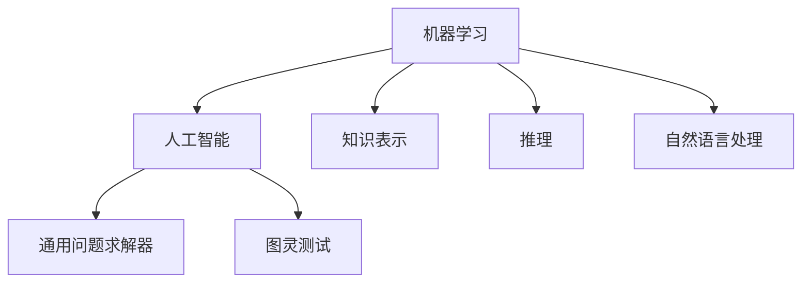
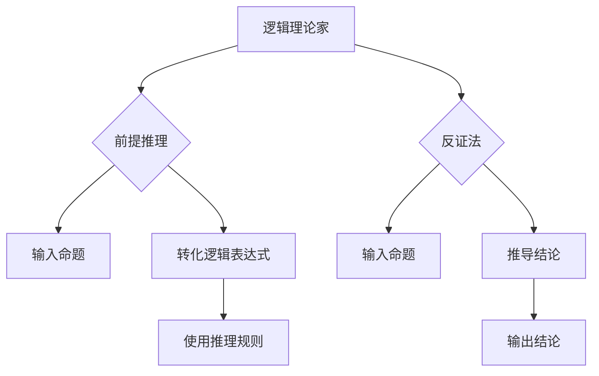

                 

 关键词：达特茅斯会议、人工智能、智能化时代、编程语言、计算机科学

> 摘要：1956年夏天，一场前所未有的会议在美国汉普顿举行，它标志着人工智能（AI）时代的正式开启。本文将从背景介绍、核心概念、算法原理、数学模型、项目实践、应用场景、工具和资源推荐、未来发展趋势与挑战等多个方面，深入探讨1956年达特茅斯会议对智能化时代的深远影响。

## 1. 背景介绍

### 达特茅斯会议的起源

1956年夏季，一群计算机科学家、心理学家、数学家和哲学家聚集在美国汉普顿，这场名为“1956年达特茅斯会议”的盛会就此拉开序幕。会议的发起者包括约翰·麦卡锡（John McCarthy）、阿伦·纽厄尔（Allen Newell）、赫伯特·西蒙（Herbert Simon）和马文·明斯基（Marvin Minsky）等人工智能领域的先驱。

会议的背景可以追溯到1950年，英国科学家艾伦·图灵（Alan Turing）发表了一篇具有划时代意义的论文《计算机器与智能》（Computing Machinery and Intelligence），提出了“图灵测试”的概念，为人工智能的发展奠定了理论基础。

### 达特茅斯会议的主要议题

达特茅斯会议的主要议题包括：

- 机器是否能够模仿人类的智能行为？
- 如何构建能够自主学习、推理和解决问题的计算机系统？
- 是否有可能开发出一种通用问题求解器（Universal Problem Solver）？

会议的参与者们就这些问题展开了热烈的讨论，他们共同认为，人工智能是计算机科学的一个重要分支，并且有望在未来实现。

### 达特茅斯会议的意义

达特茅斯会议被视为人工智能发展的里程碑，它具有以下几个重要意义：

- 正式宣告了人工智能时代的到来，激发了全球对人工智能的研究热情。
- 推动了计算机科学、心理学、数学和哲学等多学科的交叉融合。
- 促进了人工智能领域的学术交流和技术合作。

## 2. 核心概念与联系

在达特茅斯会议上，人工智能的核心概念被提出并讨论，这些概念为后来的计算机科学和人工智能发展奠定了基础。以下是核心概念及其联系：

### 2.1 机器学习

机器学习是人工智能的一个重要分支，它通过算法使计算机从数据中自动学习和改进。在达特茅斯会议上，麦卡锡等人提出了“机器学习”的概念，认为计算机可以通过不断学习和适应数据，实现类似于人类的学习过程。

### 2.2 人工智能

人工智能是指使计算机具备人类智能特征的技术。在达特茅斯会议上，人工智能被视为一个整体，包括机器学习、知识表示、推理、自然语言处理等多个方面。

### 2.3 通用问题求解器

通用问题求解器（Universal Problem Solver）是一个能够解决各种问题的计算机程序。在达特茅斯会议上，纽厄尔和西蒙提出了“逻辑理论家”程序，这是第一个能够进行逻辑推理的计算机程序，被认为是通用问题求解器的一个雏形。

### 2.4 图灵测试

图灵测试是衡量机器是否具有智能的一种方法。在达特茅斯会议上，图灵测试被广泛讨论，并被视为人工智能发展的重要方向。

### 2.5 Mermaid 流程图

为了更好地理解人工智能的核心概念及其联系，我们可以使用 Mermaid 流程图来表示：



## 3. 核心算法原理 & 具体操作步骤

在达特茅斯会议上，人工智能的核心算法被提出并讨论，这些算法为后来的计算机科学和人工智能发展奠定了基础。以下是核心算法的原理和具体操作步骤：

### 3.1 逻辑理论家

逻辑理论家是纽厄尔和西蒙提出的一个能够进行逻辑推理的计算机程序。其原理如下：

- 输入：一组命题和推理规则。
- 操作步骤：
  1. 将命题转化为逻辑表达式。
  2. 使用推理规则对逻辑表达式进行推导。
  3. 输出：推导结果。

### 3.2 机器学习算法

在达特茅斯会议上，麦卡锡等人提出了机器学习算法的基本概念，包括：

- 监督学习：通过已知的输入和输出数据，训练模型来预测新的输出。
- 无监督学习：通过未标记的数据，自动发现数据中的模式和结构。
- 强化学习：通过与环境交互，学习最优策略来最大化奖励。

### 3.3 推理算法

推理算法是人工智能中的一个重要分支，包括：

- 前提推理：根据前提和推理规则，推导出结论。
- 反证法：通过否定结论，推导出矛盾，从而证明前提的正确性。

### 3.4 Mermaid 流程图

为了更好地理解核心算法的原理和操作步骤，我们可以使用 Mermaid 流程图来表示：



## 4. 数学模型和公式 & 详细讲解 & 举例说明

在人工智能领域，数学模型和公式发挥着至关重要的作用。以下是常见的数学模型和公式的详细讲解及举例说明：

### 4.1 数学模型构建

数学模型是描述现实世界问题的一种方法，它通常由一组变量、方程和约束条件组成。以下是构建数学模型的一般步骤：

- 确定问题：明确需要解决的问题及其目标。
- 提取信息：从问题中提取有用的信息和约束条件。
- 设定变量：设定问题的决策变量和状态变量。
- 构建方程：根据问题的性质，建立变量之间的数学关系。
- 约束条件：对模型进行约束，以保证问题的可行性和稳定性。

### 4.2 公式推导过程

公式推导是数学模型构建的核心部分，以下是常见的推导方法：

- 前提法：根据已知条件和结论，逐步推导出新的结论。
- 反证法：假设结论不成立，推导出矛盾，从而证明结论的正确性。
- 数学归纳法：通过验证基础情况，并证明假设对某个情况成立时对下一个情况也成立，从而证明整个情况的正确性。

### 4.3 案例分析与讲解

以下是一个简单的线性规划问题的数学模型和公式推导过程及案例讲解：

#### 问题：

给定以下线性规划问题：

最大化 \( z = 3x + 2y \)

约束条件：

- \( x + y \leq 4 \)
- \( 2x + y \leq 6 \)
- \( x \geq 0, y \geq 0 \)

#### 数学模型构建：

- 变量：\( x \) 和 \( y \)
- 目标函数：\( z = 3x + 2y \)
- 约束条件：\( x + y \leq 4 \)，\( 2x + y \leq 6 \)，\( x \geq 0 \)，\( y \geq 0 \)

#### 公式推导过程：

1. **目标函数最大化**：

   将目标函数 \( z = 3x + 2y \) 转化为 \( y = -\frac{3}{2}x + \frac{z}{2} \)

2. **绘制约束条件的图形**：

   在坐标平面上绘制约束条件的直线，并标出可行域。

   - \( x + y \leq 4 \)：斜率为 -1，截距为 4 的直线
   - \( 2x + y \leq 6 \)：斜率为 -2，截距为 6 的直线
   - \( x \geq 0 \)：y 轴右侧的区域
   - \( y \geq 0 \)：x 轴上方的区域

3. **求解最优解**：

   在可行域内寻找目标函数的最大值。通过观察图形，可以发现最优解位于点 \( (2, 2) \)。

   将 \( x = 2 \) 和 \( y = 2 \) 代入目标函数，得到 \( z = 3 \cdot 2 + 2 \cdot 2 = 10 \)。

#### 举例说明：

以下是一个简单的线性规划问题求解示例：

给定以下线性规划问题：

最大化 \( z = 3x + 2y \)

约束条件：

- \( x + y \leq 4 \)
- \( 2x + y \leq 6 \)
- \( x \geq 0, y \geq 0 \)

求解最优解。

**步骤 1**：构建数学模型。

变量：\( x \) 和 \( y \)

目标函数：\( z = 3x + 2y \)

约束条件：\( x + y \leq 4 \)，\( 2x + y \leq 6 \)，\( x \geq 0 \)，\( y \geq 0 \)

**步骤 2**：绘制约束条件的图形。

在坐标平面上绘制约束条件的直线，并标出可行域。

- \( x + y \leq 4 \)：斜率为 -1，截距为 4 的直线


**步骤 3**：求解最优解。

通过观察图形，可以发现最优解位于点 \( (2, 2) \)。

将 \( x = 2 \) 和 \( y = 2 \) 代入目标函数，得到 \( z = 3 \cdot 2 + 2 \cdot 2 = 10 \)。

因此，最优解为 \( x = 2 \)，\( y = 2 \)，最大值为 \( z = 10 \)。

## 5. 项目实践：代码实例和详细解释说明

### 5.1 开发环境搭建

在本节中，我们将介绍如何搭建一个简单的机器学习项目开发环境。以下是所需的工具和步骤：

#### 工具：

- Python（版本 3.7 或更高）
- Jupyter Notebook（用于交互式编程）
- Scikit-learn（用于机器学习库）
- Matplotlib（用于数据可视化）

#### 步骤：

1. 安装 Python：从 [Python 官网](https://www.python.org/) 下载并安装 Python。
2. 安装 Jupyter Notebook：在命令行中运行 `pip install notebook`。
3. 安装 Scikit-learn 和 Matplotlib：在命令行中运行 `pip install scikit-learn matplotlib`。

### 5.2 源代码详细实现

以下是一个简单的线性回归项目的 Python 代码实现：

```python
# 导入必要的库
import numpy as np
import matplotlib.pyplot as plt
from sklearn.linear_model import LinearRegression

# 创建数据集
X = np.array([[1], [2], [3], [4], [5]])
y = np.array([1, 2, 2.5, 4, 5])

# 创建线性回归模型
model = LinearRegression()

# 训练模型
model.fit(X, y)

# 预测结果
predictions = model.predict(X)

# 可视化结果
plt.scatter(X, y, color='red', label='实际值')
plt.plot(X, predictions, color='blue', label='预测值')
plt.xlabel('X')
plt.ylabel('y')
plt.legend()
plt.show()
```

### 5.3 代码解读与分析

1. **导入库**：

   首先，我们导入必要的库，包括 NumPy（用于数据处理）、Matplotlib（用于数据可视化）和 Scikit-learn（用于机器学习库）。

2. **创建数据集**：

   接下来，我们创建一个简单的数据集。数据集包含自变量 \( X \) 和因变量 \( y \)。

3. **创建线性回归模型**：

   我们使用 Scikit-learn 中的 `LinearRegression` 类创建一个线性回归模型。

4. **训练模型**：

   使用 `fit` 方法训练模型，将数据集作为输入。

5. **预测结果**：

   使用 `predict` 方法对数据进行预测，得到预测值。

6. **可视化结果**：

   使用 Matplotlib 绘制散点图和回归线，展示实际值和预测值。

### 5.4 运行结果展示

运行上述代码后，我们将看到一个散点图，其中红色点表示实际值，蓝色线表示预测值。通过可视化结果，我们可以直观地了解线性回归模型的预测能力。


## 6. 实际应用场景

### 6.1 医疗诊断

人工智能在医疗诊断领域具有广泛应用。通过机器学习算法，医生可以更准确地诊断疾病，提高医疗效率。例如，人工智能可以分析医学图像，检测癌症、心脏病等疾病。

### 6.2 自动驾驶

自动驾驶技术是人工智能的一个重要应用领域。通过深度学习和计算机视觉技术，自动驾驶车辆可以识别道路标志、行人、车辆等，实现安全、高效的自动驾驶。

### 6.3 购物体验

人工智能可以优化购物体验，提供个性化的推荐。例如，电商网站可以使用机器学习算法分析用户的购物历史和喜好，为用户推荐相关的商品。

### 6.4 教育辅助

人工智能在教育领域也有广泛应用，如智能辅导系统、自适应学习平台等。通过分析学生的学习行为，人工智能可以为学生提供个性化的学习方案，提高学习效果。

## 7. 工具和资源推荐

### 7.1 学习资源推荐

- 《人工智能：一种现代方法》（Artificial Intelligence: A Modern Approach）作者：Stuart J. Russell & Peter Norvig
- 《深度学习》（Deep Learning）作者：Ian Goodfellow、Yoshua Bengio 和 Aaron Courville
- 《机器学习实战》（Machine Learning in Action）作者：Peter Harrington

### 7.2 开发工具推荐

- Jupyter Notebook：用于交互式编程和数据可视化。
- TensorFlow：用于深度学习研究和开发。
- Scikit-learn：用于机器学习和数据挖掘。

### 7.3 相关论文推荐

- 《计算机器与智能》（Computing Machinery and Intelligence）作者：Alan Turing
- 《机器学习的概率解释》（A Probabilistic Approach to Machine Learning）作者：David Barber
- 《神经网络与深度学习》（Neural Networks and Deep Learning）作者：Charu Aggarwal

## 8. 总结：未来发展趋势与挑战

### 8.1 研究成果总结

自1956年达特茅斯会议以来，人工智能领域取得了显著的成果。机器学习、深度学习、自然语言处理等技术不断进步，推动了人工智能应用的普及。人工智能在医疗、交通、金融、教育等领域发挥着越来越重要的作用。

### 8.2 未来发展趋势

未来，人工智能将向以下几个方向发展：

- 量子计算：量子计算将为人工智能带来更强大的计算能力，加速算法的优化和应用。
- 自主智能体：自主智能体将具备更高的自主性，能够模拟人类思考和决策过程。
- 伦理与法律：随着人工智能的发展，伦理和法律问题将越来越受到关注，确保人工智能的安全、公平和可解释性。

### 8.3 面临的挑战

尽管人工智能取得了显著成果，但仍面临以下几个挑战：

- 数据隐私：如何在保护个人隐私的同时，充分利用数据资源？
- 可解释性：如何提高人工智能模型的透明度和可解释性，使其更易于被人类理解和信任？
- 技术与应用的融合：如何将人工智能技术更好地应用于实际场景，实现技术的价值？

### 8.4 研究展望

未来，人工智能研究将更加注重跨学科合作，推动计算机科学、心理学、数学、哲学等领域的深度融合。同时，人工智能的发展也将为解决全球性问题提供新的思路和方法，如气候变化、疾病治疗、资源分配等。

## 9. 附录：常见问题与解答

### 9.1 人工智能的定义是什么？

人工智能（Artificial Intelligence，简称AI）是指通过计算机模拟人类智能的技术。它包括机器学习、深度学习、自然语言处理、计算机视觉等多个子领域。

### 9.2 人工智能的发展历程是怎样的？

人工智能的发展历程可以分为几个阶段，包括早期的逻辑推理、专家系统、机器学习、深度学习等。

### 9.3 人工智能有哪些应用领域？

人工智能在医疗诊断、自动驾驶、购物体验、教育辅助、金融分析等多个领域具有广泛应用。

### 9.4 人工智能是否会替代人类？

人工智能无法完全替代人类，但它可以在特定领域和任务中发挥重要作用，提高生产效率和生活质量。同时，人工智能的发展也将带来新的就业机会和挑战。

### 9.5 人工智能的安全问题如何解决？

人工智能的安全问题包括隐私保护、数据安全、算法偏见等。通过加强法律法规、伦理指导和安全技术，可以有效解决人工智能的安全问题。

---

作者：禅与计算机程序设计艺术 / Zen and the Art of Computer Programming

