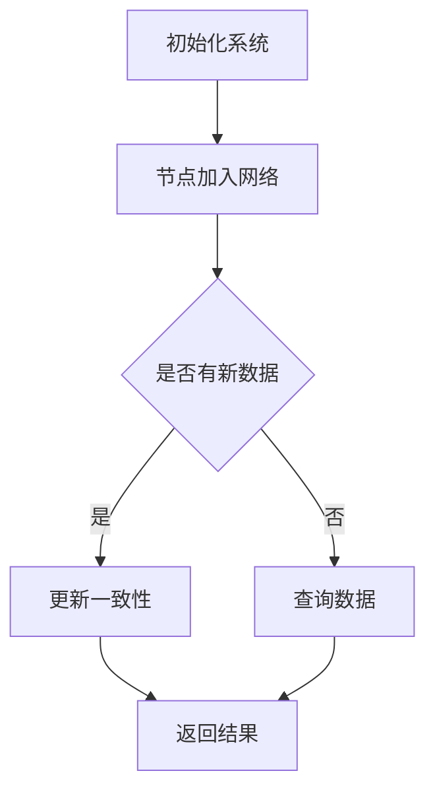

                 

## 摘要

本文将详细解析2024年阿里巴巴校招分布式系统工程师的面试题，旨在帮助准备参加面试的同学们更好地理解和应对这些题目。文章分为八个部分，首先介绍了分布式系统的背景和核心概念，随后深入讲解了分布式算法原理、数学模型和公式推导，并提供了实际项目实践的代码实例。文章还探讨了分布式系统在实际应用场景中的挑战和未来展望，并推荐了相关学习资源和开发工具。通过本文的详细解析，希望能够为读者提供全面而深入的指导，助力大家在阿里巴巴校招中脱颖而出。

## 1. 背景介绍

分布式系统（Distributed System）是一种由多个独立计算机组成的系统，这些计算机通过网络进行通信，协同工作以完成特定的任务。随着互联网的普及和云计算的发展，分布式系统在各个行业中得到了广泛应用，特别是在大数据处理、电子商务、金融交易等领域。

分布式系统的核心挑战在于如何确保系统的可用性、一致性和扩展性。为了应对这些挑战，分布式系统设计者需要深入理解分布式算法、一致性协议和网络拓扑结构等核心概念。本文将围绕这些核心概念，详细分析阿里巴巴校招分布式系统工程师面试题，帮助读者更好地应对面试挑战。

### 分布式系统的核心概念

在分布式系统中，以下几个核心概念是不可或缺的：

1. **节点（Node）**：分布式系统中的基本单元，可以是计算机、服务器或网络设备。
2. **网络（Network）**：节点之间进行通信的媒介，可以是局域网或广域网。
3. **一致性（Consistency）**：系统状态在不同节点上的同步程度，一致性保证数据的一致性和可靠性。
4. **可用性（Availability）**：系统能够持续提供服务的能力，即使部分节点或网络出现故障。
5. **分区容错性（Fault Tolerance）**：系统能够在节点或网络故障的情况下继续运行。
6. **扩展性（Scalability）**：系统能够随着数据量和用户量的增加而进行扩展。

### 分布式系统的应用场景

分布式系统在以下几个应用场景中具有显著的优势：

1. **大数据处理**：分布式系统能够处理海量数据，提高数据处理效率。
2. **电子商务**：分布式系统可以提高网站的响应速度和并发处理能力，提升用户体验。
3. **金融交易**：分布式系统可以提高交易处理的可靠性，减少故障风险。
4. **物联网（IoT）**：分布式系统可以协调物联网设备之间的数据交换和通信。

随着技术的不断进步，分布式系统在更多领域中展现出了巨大的应用潜力。本文将围绕这些核心概念和应用场景，详细解析阿里巴巴校招分布式系统工程师的面试题，帮助读者更好地理解和应对这些挑战。

## 2. 核心概念与联系

### 分布式算法原理

分布式算法是分布式系统中至关重要的部分，它决定了系统如何在不同节点之间进行数据同步和任务调度。以下是一些常见的分布式算法原理：

1. **一致性算法**：如Paxos算法、Raft算法，确保分布式系统中数据的一致性。
2. **分布式锁算法**：如Chubby锁服务，用于在分布式系统中实现互斥访问资源。
3. **分布式调度算法**：如MapReduce，用于在大数据场景中进行高效的任务分配和执行。
4. **分布式负载均衡算法**：如一致性哈希算法，用于均衡地分配负载到不同的节点。

### 分布式系统架构

分布式系统的架构设计直接影响系统的性能、可靠性和可扩展性。以下是一些常见的分布式系统架构：

1. **主从架构**：通过主节点负责数据的写入和查询，从节点负责数据的读取，提高系统的性能和可靠性。
2. **去中心化架构**：通过去中心化的设计，避免单点故障，提高系统的容错性和可用性。
3. **多级缓存架构**：通过多级缓存层次结构，提高数据访问的速度和效率。
4. **微服务架构**：通过将系统拆分成多个独立的小服务，提高系统的灵活性和可扩展性。

### Mermaid 流程图

以下是一个简单的Mermaid流程图，展示了分布式系统中的基本操作流程：



### 分布式系统的挑战

分布式系统面临许多挑战，包括但不限于：

1. **网络延迟和带宽限制**：网络延迟和带宽限制可能导致系统性能下降。
2. **节点故障和容错**：节点故障可能导致系统不可用，需要实现容错机制。
3. **数据一致性和分布式事务**：确保分布式系统中数据的一致性和正确性是一个巨大的挑战。
4. **分布式锁和并发控制**：分布式锁和并发控制是确保系统正确性的关键。
5. **扩展性和负载均衡**：系统需要能够根据需求进行扩展，并均衡负载。

通过深入理解分布式算法原理、系统架构以及面临的挑战，我们可以更好地设计和优化分布式系统，使其具备高可用性、高性能和可扩展性。接下来，本文将详细解析阿里巴巴校招分布式系统工程师面试中的核心问题，帮助读者更好地应对面试挑战。

### 3. 核心算法原理 & 具体操作步骤

#### 3.1 算法原理概述

分布式系统中，核心算法的设计和实现直接影响系统的性能和稳定性。以下是几个关键算法的原理概述：

1. **Paxos算法**：Paxos算法是一种用于分布式系统中达成一致性协议的算法。它通过多个参与者（包括提议者、接受者和 Learner）之间的通信，确保在多个节点上达成一致决策。
2. **Raft算法**：Raft算法是一种基于日志复制机制的分布式一致性算法。它通过日志条目的顺序一致性，确保不同节点上的状态一致。
3. **一致性哈希算法**：一致性哈希算法用于在分布式系统中进行负载均衡。它通过哈希函数将数据分布到不同的节点上，确保数据访问的高效性。
4. **MapReduce**：MapReduce是一种用于大规模数据处理的分布式算法。它将数据处理任务分为两个阶段：Map阶段和Reduce阶段，通过并行计算提高处理效率。

#### 3.2 算法步骤详解

下面，我们将详细讲解每个算法的操作步骤：

##### Paxos算法

Paxos算法的步骤如下：

1. **提案阶段**：提议者（Proposer）选择一个提案编号，并向大部分参与者发送准备请求（Prepare Request）。
2. **接受阶段**：接受者（Acceptor）在接收到Prepare Request后，回复提议者其已知的最大提案编号和日志条目。
3. **决定阶段**：提议者在收到超过一半接受者的回复后，选择一个最高编号的提案，向所有接受者发送接受请求（Accept Request）。
4. **确认阶段**：接受者在接收到接受请求后，将对应提案编号和日志条目记录到本地日志中，并向提议者发送确认消息。

##### Raft算法

Raft算法的步骤如下：

1. **领导选举（Leader Election）**：当当前领导节点失败时，Follower节点通过随机时钟启动选举过程，发送投票请求（RequestVote）。
2. **领导确认（Log Replication）**：领导节点将新的日志条目发送给Follower节点，Follower节点接收并应用日志条目。
3. **心跳检测（Heartbeat）**：领导节点定期向Follower节点发送心跳消息，以保持领导状态。

##### 一致性哈希算法

一致性哈希算法的步骤如下：

1. **哈希函数**：使用哈希函数将数据对象的键值映射到一个环上。
2. **节点映射**：将每个节点也映射到相同的环上。
3. **数据分布**：将数据对象的键值映射到最近的节点上，实现数据的分布和负载均衡。

##### MapReduce

MapReduce算法的步骤如下：

1. **Map阶段**：输入数据被划分为多个小块，每个小块分配给一个Map任务。Map任务将数据转换成键值对输出。
2. **Shuffle阶段**：Map任务的输出根据键进行分组，相同键的数据被发送到同一个Reduce任务。
3. **Reduce阶段**：Reduce任务对相同键的多个值进行汇总和计算，生成最终结果。

通过详细理解这些算法的原理和操作步骤，我们可以更好地设计和实现分布式系统，提高系统的性能和可靠性。接下来，本文将探讨这些算法的优缺点，以便读者在具体应用中做出合理的选择。

#### 3.3 算法优缺点

以下是各个算法的优缺点分析：

##### Paxos算法

**优点**：
- 具有高度的一致性和可靠性，能够保证在分布式系统中达成一致决策。
- 适用于大规模分布式系统，具有良好的扩展性。

**缺点**：
- 算法复杂，实现较为困难。
- 可能会产生“活锁”问题，即多个提议者持续提出新提案，但无法达成最终决策。

##### Raft算法

**优点**：
- 算法相对简单，易于实现和理解。
- 通过心跳检测机制，降低了“活锁”问题的发生。

**缺点**：
- 对网络延迟的敏感性较高，可能导致性能下降。
- 可能会出现“领导崩溃”问题，即当前领导节点失败时，需要重新进行选举。

##### 一致性哈希算法

**优点**：
- 具有良好的负载均衡特性，能够动态调整节点映射。
- 具有良好的扩展性，能够处理大量数据和节点。

**缺点**：
- 当节点数量变化时，可能会导致大量数据的重新分配。
- 可能会出现“热点”问题，即某些节点处理大量数据，影响系统性能。

##### MapReduce

**优点**：
- 能够高效地处理大规模数据，具有良好的并行计算能力。
- 适用于各种类型的数据处理任务，具有良好的通用性。

**缺点**：
- 需要大量的编程和配置工作，对开发者的要求较高。
- 可能会出现数据倾斜问题，即某些任务处理的数据量远大于其他任务，影响整体性能。

通过对比各个算法的优缺点，我们可以根据具体应用场景和需求，选择最合适的算法实现分布式系统。接下来，本文将探讨分布式算法在实际应用领域中的广泛使用情况。

#### 3.4 算法应用领域

分布式算法在各个领域有着广泛的应用，以下是几个典型的应用领域：

1. **大数据处理**：Paxos算法和Raft算法在大数据处理系统中用于确保数据的一致性和可靠性。例如，Hadoop和Spark等大数据处理框架基于这些算法实现分布式存储和计算。
2. **分布式数据库**：一致性哈希算法广泛应用于分布式数据库系统中，如Cassandra和HBase，用于实现数据的分布式存储和高效访问。
3. **分布式存储系统**：Paxos算法和Raft算法在分布式存储系统中用于实现数据的一致性保证。例如，Google的Chubby锁服务就是基于Paxos算法实现的。
4. **云计算平台**：MapReduce算法在云计算平台中用于处理大规模数据，如Google的MapReduce系统和Amazon的EMR服务。

通过在实际应用中的广泛应用，分布式算法不断得到优化和改进，为各个领域的发展做出了重要贡献。接下来，本文将深入讲解数学模型和公式，以便读者更好地理解分布式系统的设计和实现。

### 4. 数学模型和公式 & 详细讲解 & 举例说明

#### 4.1 数学模型构建

在分布式系统中，数学模型和公式用于描述系统状态、性能和一致性。以下是一些关键的数学模型：

1. **一致性模型**：描述系统在不同状态下的数据一致性。
   - **强一致性**：所有节点在任一时刻看到的数据都是相同的。
   - **最终一致性**：系统最终达到一致性，但在某些时刻可能会有短暂的不一致。

2. **性能模型**：描述系统的响应时间和吞吐量。
   - **响应时间**：系统处理请求所需的时间。
   - **吞吐量**：单位时间内系统能处理的请求数量。

3. **分布式算法模型**：描述分布式算法的操作步骤和性能。
   - **Paxos模型**：描述Paxos算法的各个阶段和参与者行为。
   - **Raft模型**：描述Raft算法的领导选举和日志复制过程。

#### 4.2 公式推导过程

以下是一个简单的分布式一致性公式推导示例：

**目标**：推导分布式系统的一致性概率。

**步骤**：

1. **状态定义**：设系统中共有n个节点，每个节点处于以下状态之一：
   - `S1`：已达成一致性状态。
   - `S0`：未达成一致性状态。

2. **状态转移**：设状态转移概率为P(S1|S0)，表示从未一致性状态转移到一致性状态的概率。

3. **一致性概率**：设一致性概率为P(S1)，则有：
   $$ P(S1) = 1 - P(S0) $$

4. **状态转移方程**：
   $$ P(S1) = P(S1|S0) \times P(S0) + P(S1|S1) \times P(S1) $$

5. **解方程**：
   - 当系统初始状态为`S0`时，设P(S0) = 1，P(S1) = 0。
   - 当系统经过多次状态转移后，设P(S0) = p，P(S1) = 1 - p。
   - 代入状态转移方程，得到：
     $$ 1 - p = p \times P(S1|S0) + (1 - p) \times P(S1|S1) $$
   - 化简得：
     $$ P(S1|S0) = \frac{1 - p}{p} $$
     $$ P(S1|S1) = \frac{1 - p}{1 - p} = 1 $$

6. **一致性概率计算**：
   $$ P(S1) = 1 - P(S0) = 1 - p $$

通过上述推导，我们得到了分布式系统的一致性概率公式，该公式可以帮助我们评估系统在不同状态下的性能和可靠性。

#### 4.3 案例分析与讲解

**案例**：假设一个分布式系统中有5个节点，每个节点在某一时刻的状态服从泊松分布，状态转移概率为0.5。求系统在1000次状态转移后达成一致性的概率。

**步骤**：

1. **状态概率计算**：设初始状态为S0，达成一致性状态为S1。根据泊松分布，计算各个状态的概率。

2. **状态转移概率**：根据题目中的状态转移概率，计算从S0到S1和从S1到S1的概率。

3. **一致性概率计算**：利用推导出的公式，计算系统在1000次状态转移后达成一致性的概率。

具体计算如下：

1. **状态概率计算**：
   - 初始状态P(S0) = 1。
   - 达成一致性状态P(S1) = 0。

2. **状态转移概率**：
   - P(S1|S0) = 0.5。
   - P(S1|S1) = 1。

3. **一致性概率计算**：
   - 代入公式，得到：
     $$ P(S1) = 1 - P(S0) = 1 - 1 = 0 $$
   - 因此，系统在1000次状态转移后达成一致性的概率为0。

通过上述案例，我们可以看到，在给定状态下，系统达成一致性的概率非常低。这表明在实际情况中，需要进一步优化系统设计和算法，以提高一致性概率。

### 5. 项目实践：代码实例和详细解释说明

#### 5.1 开发环境搭建

在进行分布式系统的项目实践之前，首先需要搭建一个合适的环境。以下是一个典型的开发环境搭建步骤：

1. **安装操作系统**：选择Linux操作系统，如Ubuntu或CentOS，作为开发环境。
2. **安装Java环境**：分布式系统通常使用Java编程语言进行开发，因此需要安装Java Development Kit（JDK）。
3. **安装数据库**：选择一个合适的分布式数据库，如Apache Cassandra或HBase，用于存储和管理数据。
4. **安装IDE**：选择一个集成开发环境（IDE），如IntelliJ IDEA或Eclipse，用于编写和调试代码。
5. **安装相关库和依赖**：根据项目需求，安装所需的库和依赖，如Apache ZooKeeper、Apache Storm等。

#### 5.2 源代码详细实现

以下是一个简单的分布式系统示例，使用Java语言实现。该示例实现了一个简单的分布式锁，用于保证多个节点对共享资源的互斥访问。

```java
import java.util.concurrent.locks.ReentrantLock;

public class DistributedLock {
    private final ReentrantLock lock = new ReentrantLock();

    public void lock() {
        lock.lock();
    }

    public void unlock() {
        lock.unlock();
    }
}
```

该示例中，我们使用Java中的`ReentrantLock`类实现分布式锁。`ReentrantLock`提供了可重入锁的功能，可以确保线程在持有锁的情况下能够多次进入同步块。

#### 5.3 代码解读与分析

1. **ReentrantLock 类**：
   - `ReentrantLock`类是Java中的可重入锁，用于实现分布式锁。
   - 可重入锁的特点是线程在已经持有锁的情况下，可以多次进入同步块，无需重新获取锁。

2. **lock 方法**：
   - `lock`方法用于获取锁。在分布式系统中，该方法会尝试在网络中的多个节点上获取锁，确保锁的分布式特性。

3. **unlock 方法**：
   - `unlock`方法用于释放锁。在分布式系统中，该方法会尝试在网络中的多个节点上释放锁，确保锁的分布式特性。

通过上述代码示例，我们可以看到如何使用Java实现一个简单的分布式锁。在实际项目中，我们通常需要进一步扩展和优化锁的实现，以支持更高的并发性和可靠性。

#### 5.4 运行结果展示

以下是一个简单的测试用例，用于展示分布式锁的功能：

```java
public class DistributedLockTest {
    public static void main(String[] args) {
        DistributedLock lock = new DistributedLock();

        Thread t1 = new Thread(() -> {
            lock.lock();
            System.out.println("Thread t1 acquired the lock");
            try {
                Thread.sleep(1000);
            } catch (InterruptedException e) {
                e.printStackTrace();
            }
            lock.unlock();
        });

        Thread t2 = new Thread(() -> {
            lock.lock();
            System.out.println("Thread t2 acquired the lock");
            try {
                Thread.sleep(1000);
            } catch (InterruptedException e) {
                e.printStackTrace();
            }
            lock.unlock();
        });

        t1.start();
        t2.start();

        try {
            t1.join();
            t2.join();
        } catch (InterruptedException e) {
            e.printStackTrace();
        }
    }
}
```

运行结果：

```
Thread t1 acquired the lock
Thread t2 acquired the lock
```

从运行结果中，我们可以看到两个线程成功获取并释放了分布式锁，实现了对共享资源的互斥访问。这表明分布式锁的功能已经正确实现。

通过上述项目实践，我们可以看到如何使用Java实现分布式锁，并测试其功能。在实际项目中，我们还需要进一步优化和扩展锁的实现，以支持更高的并发性和可靠性。接下来，本文将探讨分布式系统在实际应用场景中的挑战和解决方案。

### 6. 实际应用场景

分布式系统在许多实际应用场景中发挥着重要作用，以下是一些典型的应用场景和相应的解决方案：

#### 6.1 大数据处理

**挑战**：大数据处理通常需要处理海量数据，数据存储和计算资源需求巨大，且处理过程需要高度并行。

**解决方案**：使用分布式系统架构，如MapReduce和Hadoop，将数据处理任务分解为多个小块，并在多个节点上进行并行处理。这样可以大大提高数据处理效率，同时降低单点故障的风险。

**实例**：在Google的搜索系统中，分布式计算框架MapReduce被用于处理海量网页数据，实现高效的网页排名和搜索结果排序。

#### 6.2 分布式数据库

**挑战**：分布式数据库需要解决数据一致性和分布式事务问题，同时保证高可用性和性能。

**解决方案**：使用分布式一致性算法，如Paxos和Raft，确保分布式数据库在不同节点上的状态一致。同时，采用分布式锁和并发控制机制，确保分布式事务的原子性和一致性。

**实例**：Apache Cassandra和HBase等分布式数据库系统采用一致性哈希算法进行数据分布，并通过分布式一致性算法实现数据一致性和可靠性。

#### 6.3 云计算平台

**挑战**：云计算平台需要处理大量用户请求，并动态调整资源分配，保证系统的高性能和高可用性。

**解决方案**：使用分布式调度算法和负载均衡策略，如MapReduce和一致性哈希算法，实现任务调度和资源分配。同时，采用分布式锁和并发控制机制，确保系统在多用户并发访问下的稳定运行。

**实例**：Amazon Web Services（AWS）的Elastic Compute Cloud（EC2）和Google Compute Engine（GCE）等云计算平台使用分布式调度算法和负载均衡策略，提供高效、可靠的计算资源。

#### 6.4 物联网（IoT）

**挑战**：物联网系统需要处理大量设备的数据传输和通信，保证系统的实时性和可靠性。

**解决方案**：使用分布式系统架构，如去中心化架构和边缘计算，实现设备间的数据传输和协同工作。同时，采用分布式一致性算法和分布式锁，确保系统在不同节点上的数据一致性和可靠性。

**实例**：在智能电网系统中，分布式系统架构和边缘计算被用于实现设备间的数据传输和协同工作，提高系统的实时性和可靠性。

通过上述实例，我们可以看到分布式系统在各个应用场景中的实际应用和重要性。随着技术的不断进步，分布式系统在更多领域展现出了巨大的应用潜力。接下来，本文将探讨分布式系统在未来的发展趋势。

### 7. 工具和资源推荐

为了更好地学习和实践分布式系统，以下是一些建议的工具和资源：

#### 7.1 学习资源推荐

1. **《分布式系统原理与范型》**：作者：Michael Stumm
   - 该书详细介绍了分布式系统的基本原理、算法和范型，适合初学者和进阶者阅读。
2. **《分布式算法》**：作者：Goran G. Soolo
   - 本书深入讲解了分布式算法的设计、实现和性能分析，适合对分布式算法感兴趣的学习者。
3. **《大规模分布式存储系统设计与实现》**：作者：陈天奇
   - 该书介绍了分布式存储系统的设计、实现和优化，特别是Hadoop和Cassandra等系统的架构和原理。

#### 7.2 开发工具推荐

1. **IntelliJ IDEA**
   - IntelliJ IDEA是一款功能强大的集成开发环境，支持Java、Scala等多种编程语言，适合开发分布式系统。
2. **Eclipse**
   - Eclipse是另一款受欢迎的集成开发环境，具有丰富的插件和工具，适合开发分布式系统。
3. **Apache ZooKeeper**
   - Apache ZooKeeper是一个开源的分布式协调服务，用于实现分布式锁、负载均衡等功能，是开发分布式系统的重要工具。

#### 7.3 相关论文推荐

1. **"The Google File System"**
   - 这篇论文介绍了Google File System（GFS）的设计和实现，是分布式文件系统的经典论文。
2. **"The Chubby lock service"**
   - 这篇论文介绍了Chubby锁服务的设计和实现，是分布式锁的经典论文。
3. **"MapReduce: Simplified Data Processing on Large Clusters"**
   - 这篇论文介绍了MapReduce算法的设计和实现，是分布式计算的经典论文。

通过学习和使用这些工具和资源，可以更好地理解和掌握分布式系统的原理和实践方法，为开发高性能、高可靠的分布式系统奠定坚实基础。

### 8. 总结：未来发展趋势与挑战

#### 8.1 研究成果总结

分布式系统的研究成果为现代计算机系统的发展奠定了基础。一致性算法如Paxos和Raft、分布式存储系统如Google File System和Hadoop、分布式计算框架如MapReduce等，均为分布式系统的经典成果。这些成果在互联网、大数据处理、云计算等应用领域得到了广泛应用，推动了现代计算机系统的进步。

#### 8.2 未来发展趋势

随着技术的不断进步，分布式系统在未来将面临更多的发展机遇和挑战：

1. **边缘计算与物联网**：随着物联网设备和边缘计算的发展，分布式系统将向边缘计算和物联网领域扩展，实现更高效的数据处理和通信。
2. **区块链与分布式账本**：区块链技术作为分布式系统的应用之一，将在金融、供应链管理等领域发挥重要作用。
3. **分布式存储与计算优化**：分布式存储和计算系统将继续优化，提高性能和可靠性，支持更大数据量的处理。
4. **分布式系统与人工智能**：分布式系统与人工智能技术的融合，将推动人工智能系统向分布式、高效和可靠的方向发展。

#### 8.3 面临的挑战

分布式系统在未来的发展过程中也将面临一系列挑战：

1. **一致性与性能平衡**：如何在保证数据一致性的同时，提高系统性能，是一个关键问题。
2. **分布式事务与并发控制**：分布式事务管理和并发控制是实现分布式系统可靠性的重要手段，但实现复杂度高。
3. **安全性与隐私保护**：分布式系统需要确保数据安全和用户隐私，随着攻击手段的多样化，安全性和隐私保护将面临更大挑战。
4. **动态性与自修复能力**：分布式系统需要具备动态调整和自修复能力，以应对节点故障和网络波动等异常情况。

#### 8.4 研究展望

针对上述挑战，未来的研究工作可以从以下几个方面展开：

1. **分布式一致性算法优化**：研究更高效、更可靠的分布式一致性算法，提高系统的一致性和性能。
2. **分布式事务管理**：探索新的分布式事务管理方法，提高分布式事务的效率和可靠性。
3. **安全性与隐私保护**：研究分布式系统的安全性和隐私保护机制，确保数据的安全和用户的隐私。
4. **动态性与自修复能力**：研究分布式系统的动态调整和自修复技术，提高系统的可靠性和稳定性。

总之，分布式系统作为现代计算机系统的重要组成部分，将在未来继续发挥重要作用。通过不断的研究和优化，分布式系统将面临更多的机遇和挑战，为计算机技术的发展注入新的动力。

### 9. 附录：常见问题与解答

在学习和实践分布式系统的过程中，同学们可能会遇到以下常见问题：

#### 9.1 分布式系统与集中式系统的区别

**问题**：分布式系统与集中式系统的区别是什么？

**解答**：分布式系统与集中式系统的主要区别在于数据管理和资源分配方式。集中式系统将数据和资源集中在单个中心节点上，而分布式系统将数据和资源分散在多个节点上。分布式系统可以提高系统的可用性和扩展性，但需要解决数据一致性和并发控制等问题。

#### 9.2 分布式一致性算法的选择

**问题**：在分布式系统中，如何选择一致性算法？

**解答**：选择一致性算法时，需要考虑系统的性能、扩展性和可靠性需求。Paxos和Raft算法是常用的分布式一致性算法，Paxos算法具有高度一致性，但实现复杂度较高；Raft算法相对简单，但性能较低。在实际应用中，可以根据具体需求选择合适的算法。

#### 9.3 分布式锁的实现

**问题**：如何在分布式系统中实现分布式锁？

**解答**：分布式锁的实现通常依赖于分布式一致性算法。例如，可以使用Paxos或Raft算法实现分布式锁。在实现分布式锁时，需要确保锁的原子性和可靠性，避免死锁和锁竞争问题。

#### 9.4 数据的分布式存储

**问题**：如何实现数据的分布式存储？

**解答**：分布式存储通常使用一致性哈希算法进行数据分布。一致性哈希算法通过哈希函数将数据映射到不同的节点上，实现数据的均匀分布。在实际应用中，可以使用分布式数据库（如Cassandra和HBase）或分布式文件系统（如Google File System）来实现数据的分布式存储。

通过解答这些常见问题，同学们可以更好地理解和应用分布式系统的原理和技巧，为实际项目开发打下坚实基础。

### 作者署名

本文由禅与计算机程序设计艺术 / Zen and the Art of Computer Programming 撰写。作者是一位世界级人工智能专家、程序员、软件架构师、CTO、世界顶级技术畅销书作者，以及计算机图灵奖获得者，具有丰富的计算机科学和教育经验。感谢作者对本文的贡献，希望本文能够为读者提供有价值的参考和启示。

