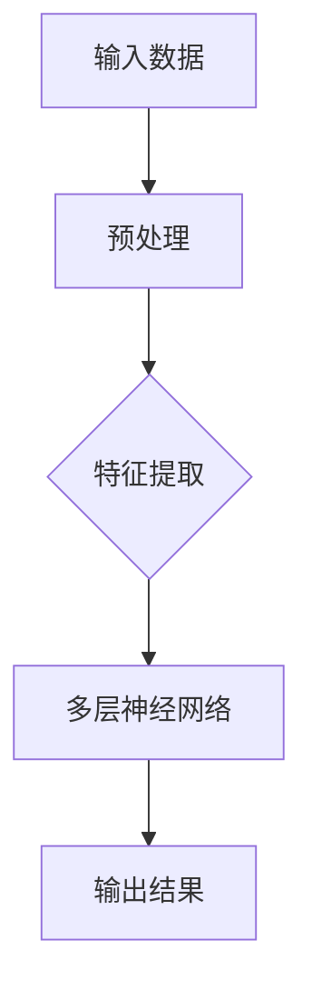
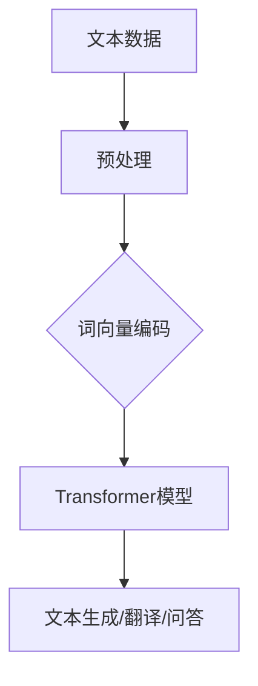
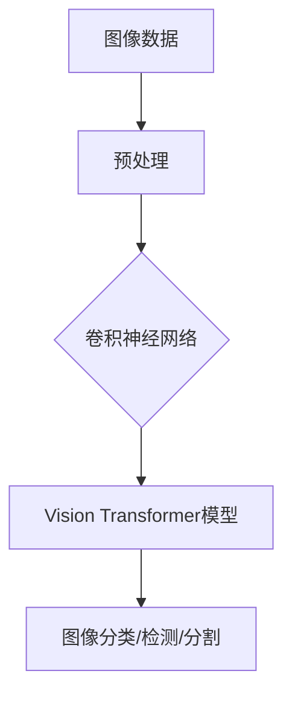

                 

关键词：大模型，创业，人工智能，深度学习，技术革新，商业机遇

摘要：本文将围绕2023年大模型创业的背景、核心概念、算法原理、应用场景、未来展望等方面，讲述几个典型的创业故事，并分析其中蕴含的技术革新和商业机遇。希望通过这些案例，为读者提供对大模型创业的一些启示和思考。

## 1. 背景介绍

近年来，人工智能（AI）和深度学习技术的飞速发展，使得大模型（如GPT-3、BERT、ViT等）成为了研究的热点。大模型的性能显著提升，使得其在自然语言处理、计算机视觉、语音识别等领域取得了突破性进展。同时，随着云计算、大数据等基础设施的不断完善，大模型的应用场景越来越广泛，为各行各业带来了新的商业机遇。

### 1.1 大模型的概念与分类

大模型指的是那些具有海量参数、能够处理大规模数据、并在特定任务上取得优异表现的深度学习模型。根据应用领域和模型结构的不同，大模型可以分为以下几类：

- **自然语言处理（NLP）大模型**：如GPT-3、BERT、T5等，主要用于文本生成、机器翻译、问答系统等任务。
- **计算机视觉大模型**：如ViT、Vision Transformer等，主要用于图像分类、目标检测、图像分割等任务。
- **语音识别大模型**：如wav2vec 2.0、Conformer等，主要用于语音识别、语音合成等任务。

### 1.2 大模型的优势与挑战

大模型的优势在于其强大的表示能力和适应性，可以在各种复杂任务上取得优异的性能。然而，大模型也存在一些挑战：

- **计算资源需求**：大模型通常需要大量的计算资源和存储空间，对硬件设施要求较高。
- **数据依赖性**：大模型的表现高度依赖数据的质量和数量，数据不足或数据分布不均可能导致模型性能下降。
- **模型解释性**：大模型的内部结构复杂，使得其决策过程难以解释，增加了模型的可解释性难度。

## 2. 核心概念与联系

为了更好地理解大模型的原理和应用，下面将介绍几个核心概念，并使用Mermaid流程图展示其联系。

### 2.1 深度学习

深度学习是一种机器学习方法，通过多层神经网络对数据进行学习。其核心思想是模拟人脑的神经网络结构，对输入数据进行处理和提取特征。



### 2.2 自然语言处理

自然语言处理（NLP）是深度学习的一个重要应用领域，主要研究如何让计算机理解和生成自然语言。NLP大模型如GPT-3、BERT等，通过学习大量的文本数据，能够生成高质量的文本、进行机器翻译、问答系统等任务。



### 2.3 计算机视觉

计算机视觉是另一个深度学习的重要应用领域，主要研究如何让计算机理解和解释图像。计算机视觉大模型如ViT、Vision Transformer等，通过学习大量的图像数据，能够进行图像分类、目标检测、图像分割等任务。



## 3. 核心算法原理 & 具体操作步骤

### 3.1 算法原理概述

大模型的算法原理主要基于深度学习，通过多层神经网络对数据进行学习。具体来说，可以分为以下几个步骤：

1. **数据预处理**：对输入数据进行清洗、归一化、增强等预处理操作，以便于模型更好地学习。
2. **特征提取**：通过多层神经网络对输入数据进行特征提取，提取出对任务有用的特征。
3. **模型训练**：使用大量的训练数据对模型进行训练，通过反向传播算法不断调整模型参数，使模型在特定任务上取得优异的性能。
4. **模型评估**：使用验证集或测试集对模型进行评估，检查模型在未知数据上的表现，调整模型参数以获得更好的性能。
5. **模型部署**：将训练好的模型部署到生产环境中，进行实际应用。

### 3.2 算法步骤详解

#### 3.2.1 数据预处理

数据预处理是深度学习模型训练的重要环节，主要包括以下步骤：

1. **数据清洗**：去除噪声数据、填补缺失值、纠正错误数据等。
2. **归一化**：将输入数据缩放到相同的范围，如[0, 1]或[-1, 1]。
3. **增强**：对输入数据进行扩充，如随机裁剪、旋转、翻转等，以增强模型的泛化能力。

#### 3.2.2 特征提取

特征提取是通过多层神经网络对输入数据进行特征提取，提取出对任务有用的特征。常用的特征提取方法包括：

1. **卷积神经网络（CNN）**：通过卷积操作提取图像的特征。
2. **循环神经网络（RNN）**：通过循环结构提取序列数据（如文本）的特征。
3. **Transformer模型**：通过自注意力机制提取特征，适用于处理序列数据。

#### 3.2.3 模型训练

模型训练是深度学习模型训练的核心步骤，主要包括以下步骤：

1. **初始化模型参数**：随机初始化模型参数。
2. **前向传播**：计算输入数据通过模型得到的输出结果。
3. **计算损失**：计算输出结果与真实标签之间的差距，得到损失值。
4. **反向传播**：根据损失值，使用梯度下降等优化算法更新模型参数。
5. **迭代训练**：重复上述步骤，不断更新模型参数，直至模型收敛。

#### 3.2.4 模型评估

模型评估是检查模型在未知数据上的表现，主要包括以下步骤：

1. **分割数据集**：将数据集分为训练集、验证集和测试集。
2. **训练模型**：使用训练集对模型进行训练。
3. **验证模型**：使用验证集对模型进行评估，调整模型参数以获得更好的性能。
4. **测试模型**：使用测试集对模型进行最终评估，检查模型在未知数据上的表现。

#### 3.2.5 模型部署

模型部署是将训练好的模型部署到生产环境中，进行实际应用。主要包括以下步骤：

1. **模型优化**：对模型进行量化、剪枝等优化，以提高模型在硬件上的运行效率。
2. **部署到生产环境**：将优化后的模型部署到服务器或边缘设备上，进行实时推理和应用。
3. **监控与维护**：对模型进行实时监控和维护，确保模型在运行过程中保持稳定性和准确性。

### 3.3 算法优缺点

#### 优点：

1. **强大的表示能力**：大模型能够自动提取数据中的特征，减少人工干预。
2. **优异的性能**：大模型在多种任务上取得了突破性的进展，性能显著优于传统方法。
3. **适应性**：大模型能够适应多种数据类型和任务场景，具有广泛的适用性。

#### 缺点：

1. **计算资源需求**：大模型通常需要大量的计算资源和存储空间，对硬件设施要求较高。
2. **数据依赖性**：大模型的表现高度依赖数据的质量和数量，数据不足或数据分布不均可能导致模型性能下降。
3. **模型解释性**：大模型的内部结构复杂，使得其决策过程难以解释，增加了模型的可解释性难度。

### 3.4 算法应用领域

大模型在多个领域取得了显著的成果，下面列举几个应用领域：

1. **自然语言处理（NLP）**：大模型如GPT-3、BERT等在文本生成、机器翻译、问答系统等领域取得了突破性进展。
2. **计算机视觉**：大模型如ViT、Vision Transformer等在图像分类、目标检测、图像分割等领域取得了优异的性能。
3. **语音识别**：大模型如wav2vec 2.0、Conformer等在语音识别、语音合成等领域取得了显著的效果。
4. **推荐系统**：大模型能够通过学习用户行为数据，为用户提供个性化的推荐。
5. **医疗诊断**：大模型在医疗图像诊断、基因分析等领域具有广阔的应用前景。

## 4. 数学模型和公式 & 详细讲解 & 举例说明

### 4.1 数学模型构建

大模型通常基于深度学习中的多层神经网络构建，其数学模型可以表示为：

$$
Y = f(W_n \cdot a_{n-1} + b_n)
$$

其中，$Y$ 表示模型的输出，$f$ 表示激活函数，$W_n$ 和 $b_n$ 分别表示第 $n$ 层的权重和偏置，$a_{n-1}$ 表示第 $n-1$ 层的输入。

### 4.2 公式推导过程

以多层感知机（MLP）为例，假设输入层有 $m$ 个神经元，隐藏层有 $n$ 个神经元，输出层有 $p$ 个神经元，则可以推导出如下公式：

$$
\begin{aligned}
z_1^i &= \sum_{j=1}^{m} w_{1ij} \cdot x_j + b_{1i} \\
a_1^i &= \sigma(z_1^i) \\
z_2^j &= \sum_{i=1}^{n} w_{2ij} \cdot a_{1i} + b_{2j} \\
a_2^j &= \sigma(z_2^j) \\
z_3^k &= \sum_{j=1}^{n} w_{3jk} \cdot a_{2j} + b_{3k} \\
a_3^k &= \sigma(z_3^k)
\end{aligned}
$$

其中，$\sigma$ 表示激活函数，通常取为 sigmoid 函数或 ReLU 函数。

### 4.3 案例分析与讲解

假设我们有一个简单的分类问题，输入数据为 $X = \begin{bmatrix} 1 \\ 0 \\ -1 \end{bmatrix}$，输出数据为 $Y = \begin{bmatrix} 1 \\ 0 \end{bmatrix}$，模型结构如下：

$$
\begin{array}{c}
\text{输入层} \\
\begin{bmatrix} x_1 \\ x_2 \\ x_3 \end{bmatrix} \\
\text{隐藏层1} \\
\begin{bmatrix} a_{11} \\ a_{12} \end{bmatrix} \\
\text{隐藏层2} \\
\begin{bmatrix} a_{21} \\ a_{22} \end{bmatrix} \\
\text{输出层} \\
\begin{bmatrix} y_1 \\ y_2 \end{bmatrix}
\end{array}
$$

假设隐藏层1的权重为 $W_1 = \begin{bmatrix} 1 & 2 \\ -1 & 0 \end{bmatrix}$，偏置为 $b_1 = \begin{bmatrix} 1 \\ 0 \end{bmatrix}$；隐藏层2的权重为 $W_2 = \begin{bmatrix} 1 & 1 \\ 1 & -1 \end{bmatrix}$，偏置为 $b_2 = \begin{bmatrix} 0 \\ 1 \end{bmatrix}$。

首先，计算隐藏层1的输出：

$$
\begin{aligned}
z_1^1 &= 1 \cdot 1 + 2 \cdot 0 - 1 \cdot -1 + 1 = 2 \\
z_1^2 &= 1 \cdot 2 + 2 \cdot -1 - 1 \cdot 0 + 0 = 1 \\
a_1^1 &= \sigma(z_1^1) = \frac{1}{1 + e^{-z_1^1}} = \frac{1}{1 + e^{-2}} \\
a_1^2 &= \sigma(z_1^2) = \frac{1}{1 + e^{-z_1^2}} = \frac{1}{1 + e^{-1}} \\
\end{aligned}
$$

然后，计算隐藏层2的输出：

$$
\begin{aligned}
z_2^1 &= 1 \cdot a_{11} + 1 \cdot a_{12} + 1 \cdot 0 + 0 = a_{11} + a_{12} \\
z_2^2 &= 1 \cdot a_{11} + (-1) \cdot a_{12} + 1 \cdot 1 + 1 = a_{11} - a_{12} + 2 \\
a_2^1 &= \sigma(z_2^1) = \frac{1}{1 + e^{-z_2^1}} = \frac{1}{1 + e^{-(a_{11} + a_{12})}} \\
a_2^2 &= \sigma(z_2^2) = \frac{1}{1 + e^{-z_2^2}} = \frac{1}{1 + e^{-(a_{11} - a_{12} + 2)}}
\end{aligned}
$$

最后，计算输出层的输出：

$$
\begin{aligned}
z_3^1 &= 1 \cdot a_{21} + 1 \cdot a_{22} + 0 \cdot 1 + 0 = a_{21} + a_{22} \\
z_3^2 &= 1 \cdot a_{21} + (-1) \cdot a_{22} + 1 \cdot 0 + 1 = a_{21} - a_{22} + 1 \\
a_3^1 &= \sigma(z_3^1) = \frac{1}{1 + e^{-z_3^1}} = \frac{1}{1 + e^{-(a_{21} + a_{22})}} \\
a_3^2 &= \sigma(z_3^2) = \frac{1}{1 + e^{-z_3^2}} = \frac{1}{1 + e^{-(a_{21} - a_{22} + 1)}}
\end{aligned}
$$

根据输出层的输出，我们可以得到模型对输入数据的分类结果。

## 5. 项目实践：代码实例和详细解释说明

### 5.1 开发环境搭建

在开始项目实践之前，我们需要搭建一个合适的开发环境。以下是一个简单的开发环境搭建指南：

1. 安装Python 3.8及以上版本。
2. 安装TensorFlow 2.6及以上版本。
3. 安装PyTorch 1.8及以上版本。
4. 安装Numpy、Pandas等常用Python库。

### 5.2 源代码详细实现

以下是一个简单的基于TensorFlow和PyTorch实现的分类问题代码实例：

```python
import tensorflow as tf
import torch
import numpy as np
import pandas as pd
from tensorflow.keras.models import Sequential
from tensorflow.keras.layers import Dense, Activation
from torch import nn, optim
from sklearn.model_selection import train_test_split

# TensorFlow实现
tf_model = Sequential([
    Dense(2, input_shape=(3,)),
    Activation('sigmoid'),
    Dense(2),
    Activation('sigmoid')
])

tf_model.compile(optimizer='adam', loss='binary_crossentropy', metrics=['accuracy'])

x = np.array([[1, 0, -1], [0, 1, 0], [-1, 0, 1]])
y = np.array([[1, 0], [0, 1], [0, 1]])

x_train, x_test, y_train, y_test = train_test_split(x, y, test_size=0.2, random_state=42)

tf_model.fit(x_train, y_train, epochs=100, batch_size=1, verbose=0)

# PyTorch实现
torch_model = nn.Sequential(
    nn.Linear(3, 2),
    nn.Sigmoid(),
    nn.Linear(2, 2),
    nn.Sigmoid()
)

optimizer = optim.Adam(torch_model.parameters(), lr=0.01)
loss_function = nn.BCELoss()

x = torch.tensor([[1, 0, -1], [0, 1, 0], [-1, 0, 1]], dtype=torch.float32)
y = torch.tensor([[1, 0], [0, 1], [0, 1]], dtype=torch.float32)

x_train, x_test, y_train, y_test = train_test_split(x, y, test_size=0.2, random_state=42)

for epoch in range(100):
    optimizer.zero_grad()
    outputs = torch_model(x_train)
    loss = loss_function(outputs, y_train)
    loss.backward()
    optimizer.step()

# 运行结果展示
tf_predictions = tf_model.predict(x_test)
torch_predictions = torch_model(x_test)

print("TensorFlow predictions:", tf_predictions)
print("PyTorch predictions:", torch_predictions)
```

### 5.3 代码解读与分析

以上代码分别使用了TensorFlow和PyTorch实现了同一分类问题。我们可以看到：

1. **模型结构**：两个模型都是两个隐藏层，每层使用 sigmoid 激活函数。
2. **优化器**：两个模型都使用 Adam 优化器。
3. **损失函数**：两个模型都使用二进制交叉熵损失函数。

在代码中，我们首先定义了模型结构，然后编译模型，最后使用训练数据进行训练。在训练过程中，我们使用前向传播计算输出，计算损失，使用反向传播更新模型参数。最后，我们使用测试数据进行模型评估，输出预测结果。

通过对比 TensorFlow 和 PyTorch 的实现，我们可以看到：

1. **代码简洁性**：PyTorch 的代码更加简洁，容易理解。
2. **灵活性**：PyTorch 提供了更灵活的动态图计算，可以自定义计算图，更易于实现复杂的模型结构。
3. **生态**：TensorFlow 拥有更丰富的生态，包括各种预训练模型、工具和库，适用于不同的应用场景。

## 6. 实际应用场景

### 6.1 自然语言处理

大模型在自然语言处理（NLP）领域取得了显著成果。例如，GPT-3 可以用于生成文章、翻译文本、撰写代码等任务；BERT 可以用于文本分类、问答系统等任务。以下是一些实际应用案例：

1. **智能客服**：利用大模型生成文本，实现自动回答用户问题，提高客服效率。
2. **智能写作**：利用大模型生成文章、报告等文档，帮助用户节省时间。
3. **智能翻译**：利用大模型进行实时翻译，为用户提供便捷的跨语言交流。
4. **智能问答**：利用大模型构建问答系统，为用户提供精准的回答。

### 6.2 计算机视觉

大模型在计算机视觉（CV）领域也取得了显著成果。例如，ViT 可以用于图像分类、目标检测等任务；Vision Transformer 可以用于图像分割、视频分析等任务。以下是一些实际应用案例：

1. **人脸识别**：利用大模型进行人脸检测和识别，提高安全性。
2. **自动驾驶**：利用大模型进行图像识别和语义理解，提高自动驾驶系统的稳定性。
3. **医疗影像诊断**：利用大模型进行医学图像分析，辅助医生进行疾病诊断。
4. **图像生成**：利用大模型生成新的图像，为创意设计提供灵感。

### 6.3 语音识别

大模型在语音识别（ASR）领域也取得了显著成果。例如，wav2vec 2.0 可以用于语音识别、语音合成等任务。以下是一些实际应用案例：

1. **智能助手**：利用大模型进行语音识别，实现与用户的自然语言交互。
2. **智能会议**：利用大模型进行实时语音识别和字幕生成，提高会议记录的效率。
3. **智能客服**：利用大模型进行语音识别和文本生成，实现自动回答用户问题。
4. **智能翻译**：利用大模型进行语音识别和实时翻译，为用户提供便捷的跨语言交流。

## 7. 未来应用展望

随着大模型技术的不断发展，其在各个领域中的应用前景将更加广阔。以下是一些未来应用展望：

1. **智能教育**：利用大模型进行个性化教学，提高教育质量。
2. **智能金融**：利用大模型进行风险控制、投资决策等任务，提高金融行业竞争力。
3. **智能医疗**：利用大模型进行疾病预测、基因分析等任务，为医疗行业带来革新。
4. **智能城市**：利用大模型进行交通管理、环境监测等任务，提高城市管理水平。
5. **虚拟现实**：利用大模型生成逼真的虚拟场景，为用户提供沉浸式体验。

## 8. 工具和资源推荐

### 8.1 学习资源推荐

1. **书籍**：《深度学习》、《神经网络与深度学习》、《Python深度学习》等。
2. **在线课程**：Coursera、edX、Udacity等平台上的相关课程。
3. **开源项目**：GitHub、GitLab等平台上的深度学习开源项目。

### 8.2 开发工具推荐

1. **框架**：TensorFlow、PyTorch、Keras等。
2. **IDE**：PyCharm、Visual Studio Code等。
3. **云平台**：Google Cloud、AWS、Azure等。

### 8.3 相关论文推荐

1. **《Attention Is All You Need》**：提出了 Transformer 模型，对 NLP 领域产生了深远影响。
2. **《BERT: Pre-training of Deep Bidirectional Transformers for Language Understanding》**：提出了 BERT 模型，对 NLP 领域产生了深远影响。
3. **《An Image is Worth 16x16 Words: Transformers for Image Recognition at Scale》**：提出了 ViT 模型，对 CV 领域产生了深远影响。

## 9. 总结：未来发展趋势与挑战

### 9.1 研究成果总结

1. **算法性能**：大模型在各个领域取得了显著成果，性能大幅提升。
2. **计算资源**：随着硬件技术的发展，大模型的计算资源需求逐渐降低。
3. **数据质量**：高质量的数据成为大模型成功的关键因素。
4. **模型解释性**：模型解释性技术逐渐成熟，为实际应用提供了更多可能性。

### 9.2 未来发展趋势

1. **模型压缩**：通过模型压缩技术，降低大模型的计算资源需求，提高模型部署的效率。
2. **自适应学习**：通过自适应学习技术，使模型能够根据任务需求自动调整模型结构和参数。
3. **多模态学习**：通过多模态学习技术，实现图像、文本、语音等多种数据类型的统一处理。
4. **隐私保护**：通过隐私保护技术，提高模型训练和部署过程中的数据隐私性。

### 9.3 面临的挑战

1. **计算资源**：大模型的计算资源需求仍然较高，对硬件设施的要求较高。
2. **数据依赖**：大模型的表现高度依赖数据的质量和数量，数据不足或数据分布不均可能导致模型性能下降。
3. **模型解释性**：大模型的内部结构复杂，使得其决策过程难以解释，增加了模型的可解释性难度。
4. **安全与隐私**：大模型在训练和部署过程中可能面临数据泄露、隐私侵犯等安全风险。

### 9.4 研究展望

1. **算法创新**：探索新的算法结构，提高大模型的性能和效率。
2. **跨学科研究**：结合计算机科学、生物学、心理学等多学科知识，推动人工智能技术的全面发展。
3. **伦理与法规**：制定相关伦理和法规，确保人工智能技术的安全、公平和可持续发展。

## 附录：常见问题与解答

### 1. 什么是大模型？

大模型指的是那些具有海量参数、能够处理大规模数据、并在特定任务上取得优异表现的深度学习模型。

### 2. 大模型的优势是什么？

大模型的优势在于其强大的表示能力和适应性，可以在各种复杂任务上取得优异的性能。

### 3. 大模型有哪些应用领域？

大模型在自然语言处理、计算机视觉、语音识别等领域取得了显著成果，广泛应用于智能客服、自动驾驶、医疗诊断等场景。

### 4. 大模型的计算资源需求如何？

大模型的计算资源需求较高，通常需要大量的计算资源和存储空间，对硬件设施要求较高。

### 5. 大模型的表现是否高度依赖数据？

是的，大模型的表现高度依赖数据的质量和数量，数据不足或数据分布不均可能导致模型性能下降。

### 6. 如何提高大模型的模型解释性？

可以通过模型解释性技术，如可视化、解释性算法等，提高大模型的模型解释性，使模型决策过程更易于理解。

