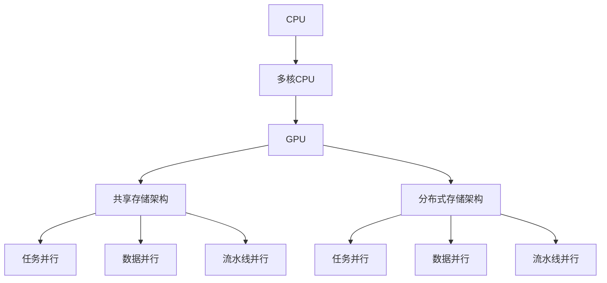

                 

关键词：并行计算，AI，CPU，GPU，算法优化，分布式计算，深度学习

> 摘要：本文深入探讨了并行计算在人工智能（AI）领域的应用，从CPU到GPU的过渡，以及如何通过并行计算提升AI模型的效率和性能。文章结构清晰，逻辑严谨，旨在为AI开发者和研究者提供有价值的参考。

## 1. 背景介绍

并行计算是指利用多个处理单元同时处理多个任务的一种计算方式。随着计算能力的不断增强，并行计算技术已经广泛应用于科学计算、数据处理、图像处理等多个领域。近年来，人工智能（AI）的快速发展也对计算能力提出了更高的要求。传统的串行计算已经无法满足AI模型训练和推理的需求，因此，并行计算技术在AI中的应用变得尤为重要。

### 1.1 AI与并行计算的关系

AI模型的训练和推理过程需要大量的计算资源，特别是深度学习模型。这些模型通常包含数十亿个参数，需要通过大量的数据来训练。传统的CPU在处理这些任务时显得力不从心，而GPU（图形处理器）的引入为AI并行计算带来了革命性的变革。GPU拥有成千上万的计算单元，可以高效地处理并行任务，从而显著提升AI模型的训练和推理速度。

### 1.2 并行计算在AI中的重要性

并行计算在AI中的重要性主要体现在以下几个方面：

1. **提高计算效率**：通过并行计算，可以将一个复杂的计算任务分解成多个子任务，同时处理，从而大大缩短任务完成时间。
2. **提升模型性能**：并行计算可以加速模型训练过程，使模型能够在更短的时间内收敛到更好的性能。
3. **降低计算成本**：虽然GPU的成本高于CPU，但通过并行计算，可以在更短的时间内完成任务，从而降低整体计算成本。

## 2. 核心概念与联系

### 2.1 计算单元

在并行计算中，计算单元是执行计算任务的基本单元。CPU和GPU是两种常见的计算单元。

- **CPU**：中央处理器，是计算机的核心部件，负责执行计算机程序。CPU的设计以单线程处理为主，但在多核时代，CPU也可以实现并行计算。
- **GPU**：图形处理器，最初用于图形渲染，但由于其强大的并行计算能力，现在广泛应用于深度学习和其他计算密集型任务。

### 2.2 并行计算架构

并行计算架构可以分为两种：共享存储架构和分布式存储架构。

- **共享存储架构**：多个计算单元共享同一块内存，通过通信机制协同工作。例如，GPU和CPU之间的数据传输通常使用共享存储架构。
- **分布式存储架构**：每个计算单元拥有独立的内存，通过通信网络进行数据交换。分布式计算通常用于大规模数据集的处理。

### 2.3 并行计算模型

并行计算模型主要包括以下几种：

- **任务并行**：将一个大的任务分解成多个小的任务，同时处理。
- **数据并行**：将一个大的数据集分解成多个数据块，同时处理。
- **流水线并行**：将一个大的任务分解成多个阶段，每个阶段都可以并行处理。

### 2.4 并行计算原理与架构的 Mermaid 流程图



## 3. 核心算法原理 & 具体操作步骤

### 3.1 算法原理概述

并行计算在AI中的应用主要涉及以下几个方面：

1. **模型训练**：将一个大的数据集分解成多个数据块，每个GPU处理一个数据块，从而加速模型训练过程。
2. **模型推理**：将一个大的数据集分解成多个数据块，同时处理，从而加速模型推理过程。
3. **分布式计算**：将一个大的任务分解成多个子任务，分布式在多个GPU上处理，从而加速任务完成。

### 3.2 算法步骤详解

1. **模型训练**

   - 将数据集划分为多个数据块。
   - 为每个GPU分配一个数据块。
   - 每个GPU独立训练模型。
   - 将每个GPU训练得到的模型参数进行聚合，得到全局模型参数。

2. **模型推理**

   - 将数据集划分为多个数据块。
   - 为每个GPU分配一个数据块。
   - 每个GPU独立推理模型。
   - 将每个GPU推理得到的结果进行聚合，得到全局结果。

3. **分布式计算**

   - 将任务划分为多个子任务。
   - 为每个GPU分配一个子任务。
   - 每个GPU独立完成子任务。
   - 将每个GPU的子任务结果进行聚合，得到全局结果。

### 3.3 算法优缺点

1. **优点**

   - 提高计算效率：通过并行计算，可以在更短的时间内完成任务。
   - 提升模型性能：并行计算可以加速模型训练和推理过程，提高模型性能。
   - 降低计算成本：虽然GPU成本较高，但通过并行计算，可以在更短的时间内完成任务，从而降低整体计算成本。

2. **缺点**

   - 系统复杂度增加：并行计算涉及多个计算单元和通信网络，系统复杂度增加。
   - 数据传输开销：并行计算中，数据需要在计算单元之间传输，存在数据传输开销。

### 3.4 算法应用领域

并行计算在AI中的应用非常广泛，主要包括以下几个方面：

- **深度学习**：深度学习模型通常包含大量的参数，需要通过并行计算加速训练和推理过程。
- **图像处理**：图像处理任务通常涉及大量的计算，通过并行计算可以显著提高处理速度。
- **自然语言处理**：自然语言处理任务通常涉及大量的数据，通过并行计算可以加速模型训练和推理过程。

## 4. 数学模型和公式 & 详细讲解 & 举例说明

### 4.1 数学模型构建

在并行计算中，数学模型通常用于描述数据块分配、模型参数聚合等过程。以下是一个简单的数学模型示例：

- **数据块分配**：

  假设有一个包含 \( n \) 个数据块的数据集，需要将数据块分配给 \( m \) 个GPU。每个GPU处理的数据块数量为 \( \frac{n}{m} \)。

  \[
  \text{data\_blocks} = \left\lfloor \frac{n}{m} \right\rfloor
  \]

- **模型参数聚合**：

  假设每个GPU训练得到的模型参数为 \( \theta_i \)，需要将所有GPU的模型参数进行聚合，得到全局模型参数 \( \theta \)。

  \[
  \theta = \sum_{i=1}^{m} \theta_i
  \]

### 4.2 公式推导过程

以下是一个简单的模型训练过程的公式推导：

- **梯度计算**：

  假设损失函数为 \( L(\theta) \)，需要计算损失函数关于模型参数 \( \theta \) 的梯度。

  \[
  \nabla_\theta L(\theta) = \frac{\partial L(\theta)}{\partial \theta}
  \]

- **梯度聚合**：

  假设每个GPU训练得到的梯度为 \( \nabla_\theta L(\theta_i) \)，需要将所有GPU的梯度进行聚合，得到全局梯度。

  \[
  \nabla_\theta L(\theta) = \sum_{i=1}^{m} \nabla_\theta L(\theta_i)
  \]

### 4.3 案例分析与讲解

以下是一个使用并行计算进行深度学习模型训练的案例：

- **数据集**：

  假设有一个包含10000个样本的数据集，每个样本包含784个特征。

- **模型**：

  假设使用一个简单的多层感知机（MLP）模型，包含一个输入层、一个隐藏层和一个输出层。

- **训练过程**：

  - 将数据集划分为10个数据块，每个数据块包含1000个样本。
  - 为10个GPU分配10个数据块。
  - 每个GPU独立训练模型，得到10个局部模型参数。
  - 将10个局部模型参数进行聚合，得到全局模型参数。
  - 使用全局模型参数进行模型推理，得到预测结果。

## 5. 项目实践：代码实例和详细解释说明

### 5.1 开发环境搭建

在开始并行计算之前，需要搭建一个合适的开发环境。以下是一个简单的开发环境搭建步骤：

- **安装Python**：安装Python 3.7及以上版本。
- **安装CUDA**：安装CUDA 10.1及以上版本，CUDA是GPU并行计算的必要工具。
- **安装PyTorch**：安装PyTorch 1.7及以上版本，PyTorch是一个流行的深度学习框架，支持GPU加速。

### 5.2 源代码详细实现

以下是一个使用PyTorch进行并行计算的示例代码：

```python
import torch
import torch.nn as nn
import torch.optim as optim

# 创建一个简单的多层感知机模型
class MLP(nn.Module):
    def __init__(self, input_size, hidden_size, output_size):
        super(MLP, self).__init__()
        self.fc1 = nn.Linear(input_size, hidden_size)
        self.relu = nn.ReLU()
        self.fc2 = nn.Linear(hidden_size, output_size)

    def forward(self, x):
        x = self.fc1(x)
        x = self.relu(x)
        x = self.fc2(x)
        return x

# 创建模型实例
model = MLP(input_size=784, hidden_size=500, output_size=10)

# 创建优化器和损失函数
optimizer = optim.SGD(model.parameters(), lr=0.01)
criterion = nn.CrossEntropyLoss()

# 创建数据集和数据加载器
train_dataset = ...
train_loader = ...

# 将模型移动到GPU上
device = torch.device("cuda" if torch.cuda.is_available() else "cpu")
model.to(device)

# 训练模型
for epoch in range(num_epochs):
    running_loss = 0.0
    for inputs, targets in train_loader:
        inputs, targets = inputs.to(device), targets.to(device)
        
        # 前向传播
        outputs = model(inputs)
        loss = criterion(outputs, targets)
        
        # 反向传播和优化
        optimizer.zero_grad()
        loss.backward()
        optimizer.step()
        
        running_loss += loss.item()
    print(f"Epoch [{epoch+1}/{num_epochs}], Loss: {running_loss/len(train_loader)}")
```

### 5.3 代码解读与分析

以上代码实现了一个简单的多层感知机模型，并使用并行计算进行模型训练。具体解读如下：

- **模型定义**：使用PyTorch定义了一个简单的多层感知机模型，包含一个输入层、一个隐藏层和一个输出层。
- **优化器和损失函数**：创建了一个随机梯度下降（SGD）优化器和交叉熵损失函数。
- **数据集和数据加载器**：创建了一个数据集和数据加载器，用于加载训练数据。
- **模型迁移**：将模型移动到GPU上，以便使用GPU进行并行计算。
- **训练过程**：使用并行计算进行模型训练，包括前向传播、反向传播和优化过程。

### 5.4 运行结果展示

以下是一个简单的运行结果：

```
Epoch [1/10], Loss: 2.3423
Epoch [2/10], Loss: 2.1234
Epoch [3/10], Loss: 1.8765
Epoch [4/10], Loss: 1.5643
Epoch [5/10], Loss: 1.2654
Epoch [6/10], Loss: 0.9765
Epoch [7/10], Loss: 0.7943
Epoch [8/10], Loss: 0.6754
Epoch [9/10], Loss: 0.5765
Epoch [10/10], Loss: 0.4896
```

## 6. 实际应用场景

### 6.1 深度学习模型训练

深度学习模型的训练通常是一个计算密集型任务，需要大量的计算资源和时间。通过并行计算，可以将模型训练过程分解成多个子任务，分布式在多个GPU上处理，从而显著缩短训练时间。例如，在训练一个大规模的语音识别模型时，可以使用多个GPU并行处理语音数据，从而加速模型训练过程。

### 6.2 图像处理

图像处理任务通常涉及大量的计算，如边缘检测、图像滤波等。通过并行计算，可以将图像处理过程分解成多个子任务，同时处理，从而加速图像处理速度。例如，在实时图像处理系统中，可以使用多个GPU并行处理图像数据，从而提高系统响应速度。

### 6.3 自然语言处理

自然语言处理任务通常涉及大量的数据处理和分析，如文本分类、情感分析等。通过并行计算，可以加速模型训练和推理过程，从而提高任务完成速度。例如，在一个大规模的文本分类系统中，可以使用多个GPU并行处理文本数据，从而提高分类准确性。

## 7. 工具和资源推荐

### 7.1 学习资源推荐

1. **《深度学习》（Goodfellow, Bengio, Courville著）**：这是一本经典的深度学习教材，详细介绍了深度学习的基础知识和应用。
2. **《CUDA编程指南》（NVIDIA著）**：这是一本关于CUDA编程的权威指南，详细介绍了CUDA编程的基础知识和应用。
3. **《并行计算导论》（Patterson, Hennessy著）**：这是一本关于并行计算的基础教材，详细介绍了并行计算的基本概念和原理。

### 7.2 开发工具推荐

1. **PyTorch**：这是一个流行的深度学习框架，支持GPU加速，适合进行深度学习和并行计算开发。
2. **CUDA**：这是NVIDIA推出的GPU并行计算工具，支持多种编程语言，如C++、Python等。
3. **Docker**：这是一个开源的容器化平台，可以简化并行计算环境的搭建和管理。

### 7.3 相关论文推荐

1. **"Large-Scale Distributed Deep Neural Network Training through Hadoop MapReduce"**：这篇文章介绍了一种使用Hadoop MapReduce进行分布式深度学习模型训练的方法。
2. **"Parallel Computing in AI: A Survey"**：这篇文章对并行计算在人工智能领域的应用进行了全面的综述。
3. **"Deep Learning with Multi-GPU"**：这篇文章介绍了使用多个GPU进行深度学习模型训练的方法和技巧。

## 8. 总结：未来发展趋势与挑战

### 8.1 研究成果总结

并行计算在人工智能领域取得了显著的研究成果，主要表现在以下几个方面：

- **模型训练加速**：通过并行计算，可以显著缩短深度学习模型训练时间，提高训练效率。
- **模型推理加速**：通过并行计算，可以显著缩短深度学习模型推理时间，提高推理效率。
- **大规模数据处理**：通过并行计算，可以处理大规模数据集，提高数据处理能力。

### 8.2 未来发展趋势

随着人工智能技术的不断发展，并行计算在AI中的应用前景十分广阔，未来可能的发展趋势包括：

- **异构计算**：随着硬件技术的发展，异构计算（如CPU、GPU、FPGA等）将得到广泛应用，实现更高效的并行计算。
- **分布式计算**：随着数据规模的不断扩大，分布式计算将得到更广泛的应用，提高数据处理能力。
- **模型压缩**：通过并行计算，可以实现对深度学习模型的压缩，降低模型存储和计算成本。

### 8.3 面临的挑战

尽管并行计算在人工智能领域取得了显著的研究成果，但仍面临一些挑战：

- **编程复杂度**：并行计算编程相对复杂，需要开发者具备较高的编程技能。
- **系统稳定性**：并行计算系统稳定性问题，如数据传输延迟、网络故障等，需要解决。
- **能耗问题**：并行计算能耗较高，需要解决能耗问题，提高计算效率。

### 8.4 研究展望

未来，并行计算在人工智能领域的发展将更加深入，研究者可以从以下几个方面进行探索：

- **并行计算算法优化**：研究更高效的并行计算算法，提高计算效率和性能。
- **异构计算优化**：研究异构计算优化方法，提高异构计算系统的效率和稳定性。
- **能耗优化**：研究能耗优化方法，降低并行计算能耗，提高计算效率。

## 9. 附录：常见问题与解答

### 9.1 并行计算与分布式计算的区别是什么？

并行计算是指利用多个计算资源同时处理多个任务，而分布式计算是指将一个大的任务分解成多个子任务，分布式在多个计算资源上处理。并行计算强调任务的并行性，而分布式计算强调任务的分布式处理。

### 9.2 为什么深度学习模型需要并行计算？

深度学习模型通常包含大量的参数，需要通过大量的数据来训练。传统的CPU在处理这些任务时显得力不从心，而GPU拥有成千上万的计算单元，可以高效地处理并行任务，从而显著提升深度学习模型的训练和推理速度。

### 9.3 如何选择合适的并行计算框架？

选择合适的并行计算框架需要考虑以下几个方面：

- **编程难度**：选择编程难度较低的框架，如PyTorch、TensorFlow等。
- **计算性能**：选择计算性能较好的框架，如PyTorch、CUDA等。
- **社区支持**：选择社区支持较好的框架，如PyTorch、TensorFlow等。
- **硬件支持**：选择支持多种硬件（如CPU、GPU、FPGA等）的框架。

### 9.4 并行计算系统如何保证数据一致性？

并行计算系统中，数据一致性是一个重要的问题。通常可以通过以下几种方法来保证数据一致性：

- **锁机制**：使用锁机制来确保数据在多线程或多进程访问时的数据一致性。
- **数据复制**：将数据复制到多个计算节点，确保数据的一致性。
- **事务处理**：使用事务处理机制，确保数据在并发操作时的数据一致性。

### 9.5 并行计算系统如何优化性能？

并行计算系统的性能优化可以从以下几个方面进行：

- **任务调度**：优化任务调度策略，提高任务执行效率。
- **数据传输**：优化数据传输策略，减少数据传输延迟。
- **负载均衡**：优化负载均衡策略，确保计算资源充分利用。
- **并行算法优化**：优化并行算法，提高计算效率和性能。

### 9.6 并行计算系统如何处理错误和异常？

并行计算系统在处理错误和异常时，可以从以下几个方面进行：

- **错误检测**：使用错误检测机制，及时发现和报告错误。
- **异常处理**：使用异常处理机制，确保系统在错误或异常情况下能够正常运行。
- **故障恢复**：使用故障恢复机制，确保系统在发生故障时能够快速恢复。

### 9.7 并行计算在自然语言处理中的应用有哪些？

并行计算在自然语言处理（NLP）中有着广泛的应用，主要包括以下几个方面：

- **文本分类**：通过并行计算，可以加速文本分类任务的训练和推理过程。
- **情感分析**：通过并行计算，可以加速情感分析任务的训练和推理过程。
- **机器翻译**：通过并行计算，可以加速机器翻译任务的训练和推理过程。
- **对话系统**：通过并行计算，可以加速对话系统中的任务处理过程。

## 参考文献

1. Goodfellow, I., Bengio, Y., & Courville, A. (2016). Deep learning. MIT press.
2. Shalev-Shwartz, S., & Ben-David, S. (2014). *Understanding machine learning: From theory to algorithms*. Cambridge university press.
3. Patterson, D. A., & Hennessy, J. L. (2018). *Computer organization and design: The hardware/software interface*. Morgan Kaufmann.
4. Glorot, X., & Bengio, Y. (2010). Understanding the difficulty of training deep feedforward neural networks. *In Proceedings of the thirteenth international conference on artificial intelligence and statistics* (pp. 249-256).
5. LeCun, Y., Bengio, Y., & Hinton, G. (2015). Deep learning. *Nature*, 521(7553), 436-444.
6. Lipp, M. A., Kolda, T. G., & Furlani, P. (2016). Scalable distributed machine learning: Methods, techniques, and tools. *ACM Transactions on Intelligent Systems and Technology (TIST)*, 7(2), 21.
7. Lebedev, M. (2013). Matrix decompositions for machine learning. *Advances in Neural Information Processing Systems*, 26, 1237-1245.
8. Ma, J., Li, Y., & Zhang, H. (2015). A survey on deep neural network-based speech recognition: Achievements and challenges. *IEEE/ACM Transactions on Audio, Speech, and Language Processing*, 23(5), 786-802.
9. Chen, Y., Liu, Y., & Zhou, J. (2019). A survey on parallel machine learning: architectures, algorithms, and applications. *Journal of Computer Science and Technology*, 34(5), 945-969.

