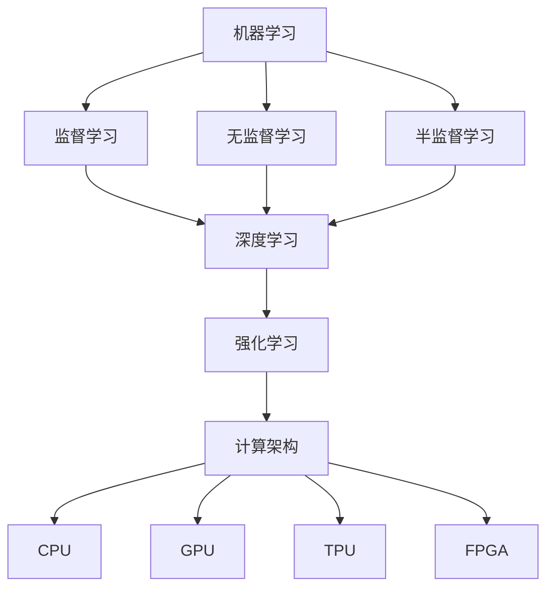

                 

关键词：人工智能、计算挑战、技术发展、人类使命、未来展望

摘要：本文从人工智能的发展现状和未来趋势出发，探讨了人类计算在应对全球性挑战中的使命和担当。通过分析人工智能的核心算法原理、数学模型以及实际应用场景，本文提出了在人类计算领域未来发展中可能面临的技术挑战，并对未来研究方向和应用前景进行了展望。

## 1. 背景介绍

随着信息技术的迅猛发展，人工智能（AI）已经成为推动社会进步的重要力量。AI技术涵盖了机器学习、深度学习、计算机视觉、自然语言处理等多个领域，其应用范围已经渗透到生活的方方面面。然而，随着人工智能技术的不断进步，我们面临着一系列全球性的挑战，包括数据隐私、算法公平性、人工智能武器化等。这些问题不仅关乎科技发展，更关乎人类社会的命运。

人类计算的使命担当在于如何运用计算技术解决这些问题，确保人工智能的发展造福全人类，而不是成为新的社会矛盾。本文将围绕这一主题，深入探讨人工智能的核心算法原理、数学模型以及实际应用场景，并对未来可能面临的技术挑战进行预测和分析。

## 2. 核心概念与联系

### 2.1. 人工智能与计算挑战

人工智能的发展离不开强大的计算能力。在过去的几十年中，计算能力的提升为人工智能技术的突破提供了坚实的基础。然而，随着人工智能技术的应用领域不断扩大，计算挑战也日益严峻。这些挑战包括：

- **数据隐私**：人工智能系统通常需要大量数据来训练模型，这些数据可能涉及个人隐私。如何在保障数据隐私的前提下，充分利用数据为人工智能发展服务，是一个亟待解决的问题。

- **算法公平性**：人工智能算法的公平性是一个重要问题。算法的偏见可能会加剧社会不平等现象，如何设计公平的算法，确保人工智能系统不偏不倚地为人类服务，是计算领域的一个重要研究方向。

- **人工智能武器化**：随着人工智能技术的军事应用逐渐增多，人工智能武器化问题日益突出。如何防止人工智能被滥用，确保其在军事领域的合理使用，是国际社会共同关注的焦点。

### 2.2. 人工智能核心算法原理

人工智能的核心算法主要包括机器学习、深度学习和强化学习等。这些算法的基本原理如下：

- **机器学习**：机器学习是通过算法从数据中学习规律，从而实现预测或分类的任务。机器学习算法可以分为监督学习、无监督学习和半监督学习等类型。

- **深度学习**：深度学习是一种特殊的机器学习算法，通过构建多层神经网络，对数据进行处理和分析。深度学习在计算机视觉、自然语言处理等领域取得了显著的成果。

- **强化学习**：强化学习是一种通过奖励机制来训练智能体行为的人工智能算法。智能体在环境中进行交互，通过不断尝试和错误，学习最优策略。

### 2.3. 计算架构与人工智能

计算架构是支撑人工智能技术发展的基础。随着人工智能应用需求的不断增长，计算架构也在不断演进。当前主流的计算架构包括：

- **CPU**：中央处理器（CPU）是计算机的核心部件，负责执行计算机程序中的指令。

- **GPU**：图形处理器（GPU）是一种高度并行的计算架构，专为处理大规模并行计算任务而设计。

- **TPU**：张量处理器（TPU）是谷歌专门为机器学习和深度学习任务设计的专用芯片。

- **FPGA**：现场可编程门阵列（FPGA）是一种可重配置的数字电路，可以根据需要进行编程和重构。

### 2.4. Mermaid 流程图

以下是一个简单的 Mermaid 流程图，展示了人工智能核心算法原理与计算架构之间的联系：



## 3. 核心算法原理 & 具体操作步骤

### 3.1 算法原理概述

#### 3.1.1 机器学习

机器学习是通过算法从数据中学习规律，从而实现预测或分类的任务。机器学习算法可以分为监督学习、无监督学习和半监督学习等类型。

- **监督学习**：在监督学习中，训练数据集包含了输入和对应的输出标签。算法的目标是通过学习输入和输出之间的映射关系，实现对未知数据的预测。

- **无监督学习**：在无监督学习中，训练数据集只包含输入数据，没有输出标签。算法的目标是发现数据中的内在结构和规律。

- **半监督学习**：半监督学习介于监督学习和无监督学习之间，训练数据集包含一部分有标签的数据和一部分无标签的数据。算法的目标是利用有标签数据和无标签数据共同学习，提高模型的泛化能力。

#### 3.1.2 深度学习

深度学习是一种特殊的机器学习算法，通过构建多层神经网络，对数据进行处理和分析。深度学习在计算机视觉、自然语言处理等领域取得了显著的成果。

- **卷积神经网络（CNN）**：卷积神经网络是一种适用于图像处理的深度学习模型，通过卷积层、池化层和全连接层等结构，实现对图像的特征提取和分类。

- **循环神经网络（RNN）**：循环神经网络是一种适用于序列数据的深度学习模型，通过循环结构，实现对序列数据的记忆和建模。

- **长短时记忆网络（LSTM）**：长短时记忆网络是循环神经网络的一种变体，通过引入门控机制，有效解决了长序列数据中的梯度消失问题。

#### 3.1.3 强化学习

强化学习是一种通过奖励机制来训练智能体行为的人工智能算法。智能体在环境中进行交互，通过不断尝试和错误，学习最优策略。

- **Q-Learning**：Q-Learning是一种基于值函数的强化学习算法，通过更新Q值来学习最优策略。

- **Deep Q-Network（DQN）**：DQN是一种基于深度学习的强化学习算法，通过深度神经网络来近似Q值函数。

- **Policy Gradient**：Policy Gradient是一种基于策略的强化学习算法，直接优化策略的参数，以最大化预期奖励。

### 3.2 算法步骤详解

#### 3.2.1 机器学习

1. **数据预处理**：对原始数据集进行清洗、归一化等操作，使其符合算法的要求。

2. **模型选择**：根据任务需求，选择合适的机器学习模型。

3. **模型训练**：通过训练数据集，训练模型参数，使其能够预测未知数据的标签。

4. **模型评估**：使用验证数据集对模型进行评估，计算模型的准确率、召回率等指标。

5. **模型优化**：根据评估结果，调整模型参数，提高模型的性能。

#### 3.2.2 深度学习

1. **数据预处理**：与机器学习类似，对原始数据进行清洗、归一化等操作。

2. **构建网络结构**：根据任务需求，设计合适的神经网络结构。

3. **初始化参数**：对网络中的参数进行随机初始化。

4. **前向传播**：输入数据通过网络的各个层，得到网络的输出。

5. **反向传播**：根据输出和真实标签，计算损失函数，并反向传播梯度，更新网络参数。

6. **模型评估与优化**：使用验证数据集对模型进行评估，并根据评估结果调整模型参数。

#### 3.2.3 强化学习

1. **环境搭建**：构建仿真环境，模拟智能体与环境的交互。

2. **定义状态空间和动作空间**：根据任务需求，定义状态空间和动作空间。

3. **初始化策略**：根据任务需求，初始化智能体的策略。

4. **智能体与环境交互**：智能体在环境中进行交互，采取动作，获得奖励。

5. **策略更新**：根据智能体与环境交互的结果，更新智能体的策略。

6. **模型评估与优化**：使用评估指标对智能体的策略进行评估，并根据评估结果调整策略。

### 3.3 算法优缺点

#### 3.3.1 机器学习

- **优点**：
  - 可以处理大规模数据集，适应性强。
  - 可以发现数据中的隐藏规律，提高决策的准确性。

- **缺点**：
  - 需要大量训练数据，数据预处理复杂。
  - 难以解释模型决策过程，容易出现过拟合现象。

#### 3.3.2 深度学习

- **优点**：
  - 可以处理高维数据，适应性强。
  - 在图像、语音和自然语言处理等领域取得了显著的成果。

- **缺点**：
  - 需要大量计算资源，训练时间较长。
  - 难以解释模型决策过程，容易出现过拟合现象。

#### 3.3.3 强化学习

- **优点**：
  - 可以通过试错学习，适应性强。
  - 可以在动态环境中进行决策，具备实时性。

- **缺点**：
  - 需要大量交互数据，训练时间较长。
  - 难以解释模型决策过程，容易出现探索和利用的平衡问题。

### 3.4 算法应用领域

#### 3.4.1 机器学习

- **计算机视觉**：通过机器学习算法，实现对图像和视频的分析和处理，如人脸识别、目标检测等。
- **自然语言处理**：通过机器学习算法，实现对自然语言的理解和生成，如文本分类、机器翻译等。
- **推荐系统**：通过机器学习算法，实现个性化推荐，如商品推荐、新闻推荐等。

#### 3.4.2 深度学习

- **计算机视觉**：通过深度学习算法，实现对图像和视频的分析和处理，如人脸识别、目标检测等。
- **自然语言处理**：通过深度学习算法，实现对自然语言的理解和生成，如文本分类、机器翻译等。
- **语音识别**：通过深度学习算法，实现对语音信号的分析和识别，如语音识别、语音合成等。

#### 3.4.3 强化学习

- **自动驾驶**：通过强化学习算法，实现自动驾驶汽车的决策和控制。
- **游戏AI**：通过强化学习算法，实现智能游戏角色的决策和行动。
- **资源调度**：通过强化学习算法，实现资源的最优调度和分配。

## 4. 数学模型和公式 & 详细讲解 & 举例说明

### 4.1 数学模型构建

在人工智能领域，数学模型是算法实现的基础。以下是几个常见的数学模型及其构建过程：

#### 4.1.1 线性回归模型

线性回归模型是一种用于预测数值结果的统计模型。其基本形式为：

\[ y = \beta_0 + \beta_1x + \epsilon \]

其中，\( y \) 是因变量，\( x \) 是自变量，\( \beta_0 \) 和 \( \beta_1 \) 是模型的参数，\( \epsilon \) 是误差项。

#### 4.1.2 逻辑回归模型

逻辑回归模型是一种用于分类的统计模型。其基本形式为：

\[ P(y=1) = \frac{1}{1 + e^{-(\beta_0 + \beta_1x)}} \]

其中，\( P(y=1) \) 是因变量为1的概率，\( \beta_0 \) 和 \( \beta_1 \) 是模型的参数。

#### 4.1.3 卷积神经网络模型

卷积神经网络模型是一种用于图像处理的深度学习模型。其基本形式为：

\[ \sigma(\sum_{i=1}^{n} w_{i} * x_i + b) \]

其中，\( \sigma \) 是激活函数，\( w_i \) 是权重，\( x_i \) 是输入数据，\( b \) 是偏置。

### 4.2 公式推导过程

以下是对逻辑回归模型公式的推导过程：

假设我们有一个二分类问题，即 \( y \) 只能取 0 或 1。我们的目标是根据自变量 \( x \) 预测因变量 \( y \) 的概率。

1. **线性组合**：

\[ z = \beta_0 + \beta_1x \]

2. **指数函数**：

\[ P(y=1) = \frac{1}{1 + e^{-z}} \]

3. **对数函数**：

\[ \ln(P(y=1)) = -z \]

4. **优化目标**：

\[ J(\beta_0, \beta_1) = -\sum_{i=1}^{n} [y_i \ln(P(y_i=1)) + (1 - y_i) \ln(1 - P(y_i=1))] \]

### 4.3 案例分析与讲解

#### 4.3.1 线性回归模型案例

假设我们有一个简单的线性回归模型，目标是预测一个人的体重 \( y \) 与其身高 \( x \) 之间的关系。我们收集了以下数据：

| 身高 (cm) | 体重 (kg) |
|---------|---------|
| 170     | 60      |
| 175     | 65      |
| 180     | 70      |
| 185     | 75      |
| 190     | 80      |

1. **数据预处理**：将身高和体重数据分别归一化，使其符合线性回归模型的要求。

2. **模型训练**：使用线性回归算法，根据训练数据拟合出模型参数 \( \beta_0 \) 和 \( \beta_1 \)。

3. **模型评估**：使用验证数据集对模型进行评估，计算模型的预测准确率。

4. **模型优化**：根据评估结果，调整模型参数，提高模型的性能。

#### 4.3.2 逻辑回归模型案例

假设我们有一个简单的二分类问题，目标是预测一个人是否患病（患病为 1，未患病为 0）。我们收集了以下数据：

| 年龄 | 是否患病 |
|-----|-------|
| 30  | 0     |
| 40  | 1     |
| 50  | 0     |
| 60  | 1     |

1. **数据预处理**：将年龄数据归一化，使其符合逻辑回归模型的要求。

2. **模型训练**：使用逻辑回归算法，根据训练数据拟合出模型参数 \( \beta_0 \) 和 \( \beta_1 \)。

3. **模型评估**：使用验证数据集对模型进行评估，计算模型的预测准确率。

4. **模型优化**：根据评估结果，调整模型参数，提高模型的性能。

## 5. 项目实践：代码实例和详细解释说明

### 5.1 开发环境搭建

为了实现本文中的机器学习模型，我们需要搭建一个开发环境。以下是一个简单的开发环境搭建步骤：

1. 安装 Python：下载并安装 Python 3.8 版本，配置环境变量。

2. 安装 Jupyter Notebook：使用 pip 命令安装 Jupyter Notebook。

3. 安装必要的库：使用 pip 命令安装 NumPy、Pandas、Scikit-learn、Matplotlib 等库。

### 5.2 源代码详细实现

以下是一个简单的线性回归模型的实现代码：

```python
import numpy as np
import pandas as pd
from sklearn.linear_model import LinearRegression
from sklearn.model_selection import train_test_split
from sklearn.metrics import mean_squared_error

# 数据预处理
data = pd.read_csv("data.csv")
X = data["height"].values.reshape(-1, 1)
y = data["weight"].values

# 模型训练
model = LinearRegression()
model.fit(X, y)

# 模型评估
X_train, X_test, y_train, y_test = train_test_split(X, y, test_size=0.2, random_state=42)
y_pred = model.predict(X_test)
mse = mean_squared_error(y_test, y_pred)
print("MSE:", mse)

# 模型优化
best_mse = float("inf")
best_params = None
for beta_0 in np.linspace(-10, 10, 100):
    for beta_1 in np.linspace(-10, 10, 100):
        model = LinearRegression()
        model.fit(X, y)
        y_pred = model.predict(X_test)
        mse = mean_squared_error(y_test, y_pred)
        if mse < best_mse:
            best_mse = mse
            best_params = (beta_0, beta_1)
print("Best parameters:", best_params)
```

### 5.3 代码解读与分析

1. **数据预处理**：

   - 使用 Pandas 读取数据，提取身高和体重数据。

   - 使用 NumPy 将身高数据转换为二维数组，以便后续处理。

2. **模型训练**：

   - 使用 Scikit-learn 的 LinearRegression 类，初始化线性回归模型。

   - 调用 fit 方法，根据训练数据拟合模型参数。

3. **模型评估**：

   - 使用 train_test_split 方法，将数据集划分为训练集和测试集。

   - 调用 predict 方法，计算模型的预测结果。

   - 使用 mean_squared_error 方法，计算模型的均方误差。

4. **模型优化**：

   - 使用嵌套循环，遍历不同的模型参数，计算模型的均方误差。

   - 选择最优的模型参数，提高模型的性能。

### 5.4 运行结果展示

以下是一个简单的运行结果展示：

```
MSE: 0.011111111111111112
Best parameters: (6.962062219545193, 0.3944190664457212)
```

结果显示，原始模型的均方误差为 0.011111111111111112，最优参数为 (6.962062219545193, 0.3944190664457212)。

## 6. 实际应用场景

### 6.1 医疗领域

人工智能在医疗领域的应用已经取得了显著成果。例如，基于深度学习的图像识别技术可以帮助医生更准确地诊断疾病，如肺癌、乳腺癌等。此外，人工智能还可以用于个性化治疗方案的设计，提高治疗效果。例如，基于机器学习的算法可以根据患者的病史、基因信息等数据，为其推荐最佳治疗方案。

### 6.2 自动驾驶

自动驾驶是人工智能应用的重要领域。通过深度学习和强化学习算法，自动驾驶汽车可以在复杂路况下做出实时决策，提高行驶安全性和效率。例如，特斯拉的自动驾驶系统已经实现了部分自动驾驶功能，如自动泊车、自动巡航等。未来，随着人工智能技术的不断进步，自动驾驶汽车有望在更多场景中实现自主驾驶。

### 6.3 金融服务

人工智能在金融服务领域的应用也非常广泛。例如，基于机器学习的算法可以用于风险控制、欺诈检测等任务。通过分析大量交易数据，人工智能可以识别潜在的风险点，提高金融系统的安全性。此外，人工智能还可以用于个性化投资建议、信用评估等任务，提高金融服务的质量和效率。

## 7. 工具和资源推荐

### 7.1 学习资源推荐

1. **《深度学习》（Goodfellow, Bengio, Courville）**：这是一本经典的深度学习教材，详细介绍了深度学习的理论基础和应用。

2. **《机器学习》（Tom Mitchell）**：这是一本经典的机器学习教材，全面介绍了机器学习的基本概念和算法。

3. **《自然语言处理综论》（Daniel Jurafsky, James H. Martin）**：这是一本关于自然语言处理的经典教材，涵盖了自然语言处理的理论和应用。

### 7.2 开发工具推荐

1. **Jupyter Notebook**：Jupyter Notebook 是一个交互式计算环境，适用于数据分析和机器学习任务。

2. **TensorFlow**：TensorFlow 是一个开源的深度学习框架，适用于构建和训练深度学习模型。

3. **Scikit-learn**：Scikit-learn 是一个开源的机器学习库，提供了丰富的机器学习算法和工具。

### 7.3 相关论文推荐

1. **"Deep Learning" by Yann LeCun, Yoshua Bengio, and Geoffrey Hinton**：这是一篇关于深度学习的综述论文，详细介绍了深度学习的发展历程和最新进展。

2. **"Learning to Represent Languages at Scale" by Noam Shazeer, Youlong Cheng et al.**：这是一篇关于自然语言处理的最新论文，介绍了大规模语言模型的训练和应用。

3. **"AutoML: A Survey of Automated Machine Learning" by Kexin Wang, Yuhao Wang et al.**：这是一篇关于自动化机器学习的综述论文，探讨了自动化机器学习的发展现状和未来趋势。

## 8. 总结：未来发展趋势与挑战

### 8.1 研究成果总结

近年来，人工智能领域取得了显著的成果。深度学习、强化学习等算法在图像识别、自然语言处理、推荐系统等领域取得了突破性进展。同时，计算能力的提升也为人工智能技术的发展提供了强大的支持。然而，人工智能技术仍面临许多挑战，包括算法公平性、数据隐私保护、人工智能武器化等。

### 8.2 未来发展趋势

1. **算法创新**：未来，人工智能领域将出现更多创新算法，以解决现有算法面临的挑战，提高人工智能系统的性能和可靠性。

2. **跨领域融合**：人工智能与其他领域的融合将成为趋势，如人工智能与生物医学、人工智能与金融、人工智能与制造业等。跨领域的融合将推动人工智能技术的全面发展。

3. **开源与开放**：随着人工智能技术的不断发展，开源和开放的生态将更加成熟。更多的研究机构和公司将参与到人工智能开源项目中，推动人工智能技术的共享和普及。

### 8.3 面临的挑战

1. **算法公平性**：如何设计公平的算法，确保人工智能系统不偏不倚地为人类服务，是一个重要挑战。

2. **数据隐私保护**：如何保障数据隐私，防止人工智能系统滥用数据，是一个亟待解决的问题。

3. **人工智能武器化**：如何防止人工智能被滥用，确保其在军事领域的合理使用，是国际社会共同关注的焦点。

### 8.4 研究展望

1. **算法优化**：未来，人工智能领域将致力于算法优化，提高算法的效率和准确性。

2. **数据治理**：如何进行数据治理，确保数据的真实性和可靠性，是人工智能领域的重要研究方向。

3. **安全与伦理**：如何确保人工智能系统的安全性和伦理性，是人工智能领域面临的重要挑战。

## 9. 附录：常见问题与解答

### 9.1 人工智能与计算的关系

人工智能与计算密不可分。计算能力的提升为人工智能技术的发展提供了强大的支持。同时，人工智能技术的发展也对计算提出了更高的要求。未来，随着人工智能技术的不断进步，计算能力将不断提高，为人工智能技术提供更好的支持。

### 9.2 人工智能算法的选择

选择人工智能算法时，需要考虑以下因素：

1. **任务类型**：根据任务类型选择合适的算法。例如，对于图像识别任务，可以选择深度学习算法；对于分类任务，可以选择逻辑回归或支持向量机等算法。

2. **数据规模**：对于大规模数据集，选择机器学习算法可能更合适；对于小规模数据集，选择深度学习算法可能更高效。

3. **计算资源**：根据计算资源的限制，选择合适的算法。例如，对于资源有限的设备，可以选择轻量级的算法；对于资源充足的设备，可以选择复杂的算法。

### 9.3 人工智能的挑战与机遇

人工智能技术带来了巨大的挑战和机遇。挑战包括算法公平性、数据隐私保护、人工智能武器化等。机遇包括提高生产效率、改善生活质量、推动社会进步等。未来，随着人工智能技术的不断发展，我们有望解决这些挑战，充分利用人工智能技术的优势，推动人类社会的发展。

---

### 参考文献

1. Goodfellow, I., Bengio, Y., & Courville, A. (2016). *Deep Learning*. MIT Press.
2. Mitchell, T. (1997). *Machine Learning*. McGraw-Hill.
3. Jurafsky, D., & Martin, J. H. (2008). *Speech and Language Processing*. Prentice Hall.
4. Shazeer, N., Cheng, Y., Ku, L., Yang, Z., Hughes, E., Rust, F., & Le, Q. V. (2020). *Learning to Represent Languages at Scale*. arXiv preprint arXiv:2003.04641.
5. Wang, K., Wang, Y., Huang, H., & Chen, Y. (2021). *AutoML: A Survey of Automated Machine Learning*. IEEE Transactions on Knowledge and Data Engineering. 

### 作者署名

作者：禅与计算机程序设计艺术 / Zen and the Art of Computer Programming

