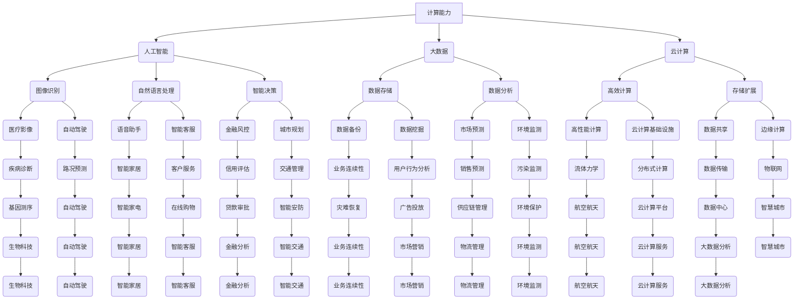

                 

关键词：计算能力，人类挑战，人工智能，算法优化，数学模型，技术应用，未来展望

## 摘要

随着人工智能和计算技术的迅猛发展，人类正面临一系列前所未有的共同挑战。本文从计算能力的角度出发，探讨人类如何利用先进的技术手段应对环境、医疗、教育、经济等领域的挑战。文章首先介绍计算在各个领域的应用现状，随后深入解析核心算法原理和数学模型，并通过实际项目实例展示技术落地效果。最后，对计算技术未来发展趋势和面临的挑战进行展望，为推动人类计算能力的提升提供思考和方向。

## 1. 背景介绍

### 1.1 人类共同挑战的背景

21世纪以来，人类社会面临的环境问题、健康问题、教育问题、经济问题等挑战日益严峻。气候变化、资源枯竭、传染病爆发、教育不平等、经济不稳定等问题不仅威胁到人类的生存和发展，也考验着各国的治理能力和国际社会的合作意愿。

- **环境问题**：全球变暖、海洋污染、森林砍伐等环境问题严重威胁着生态平衡和人类健康。
- **健康问题**：传染病的爆发、慢性疾病的蔓延，尤其是新冠疫情的全球大流行，对全球健康安全构成巨大挑战。
- **教育问题**：教育资源的分配不均，尤其是城乡、贫富之间的差距，使得教育公平成为亟待解决的问题。
- **经济问题**：经济全球化带来的不确定性、市场波动以及经济结构调整，对世界经济产生了深远影响。

### 1.2 计算技术的崛起

面对这些挑战，计算技术以其高效、精准、可扩展的特点，逐渐成为应对人类共同挑战的重要工具。计算技术的快速发展，不仅推动了人工智能、大数据、云计算等新兴领域的突破，也为解决现实问题提供了新的思路和方法。

- **人工智能**：通过机器学习和深度学习技术，人工智能在图像识别、自然语言处理、智能决策等领域取得了显著进展，为解决复杂问题提供了新的工具。
- **大数据**：大数据技术的应用，使得海量数据能够被快速处理和分析，为决策提供了数据支撑。
- **云计算**：云计算的高效计算能力和存储能力，为大规模数据处理和计算提供了基础设施。

## 2. 核心概念与联系

### 2.1 核心概念

在本文中，我们将涉及以下几个核心概念：

- **计算能力**：指计算机系统进行数据处理和计算的能力，包括计算速度、存储容量、网络传输速度等。
- **人工智能**：指模拟、延伸和扩展人类智能的理论、方法、技术及应用。
- **算法**：是解决特定问题的系统方法，包括输入、处理和输出等步骤。
- **数学模型**：是对现实世界问题的抽象和简化，通过数学公式和算法来描述和分析。
- **应用领域**：指计算技术在不同领域中的应用，如环境监测、疾病预测、教育公平、经济预测等。

### 2.2 Mermaid 流程图

以下是计算技术核心概念和联系的 Mermaid 流程图：



### 2.3 核心概念之间的联系

通过上述流程图，我们可以看到，计算能力是推动人工智能、大数据、云计算等新兴领域发展的基础。同时，这些技术在不同领域中的应用，不仅提高了处理复杂问题的效率，也为解决人类共同挑战提供了有力支持。

## 3. 核心算法原理 & 具体操作步骤

### 3.1 算法原理概述

在计算技术中，核心算法是解决特定问题的关键。以下将介绍几个在解决人类共同挑战中具有重要应用的算法：

- **机器学习算法**：通过训练模型，使计算机能够从数据中学习并做出预测或决策。常见的机器学习算法包括线性回归、决策树、随机森林、支持向量机、神经网络等。
- **深度学习算法**：基于人工神经网络，通过多层神经网络进行数据建模，能够处理更复杂的问题。常见的深度学习算法包括卷积神经网络（CNN）、循环神经网络（RNN）、生成对抗网络（GAN）等。
- **优化算法**：用于在约束条件下寻找最优解，常见的优化算法包括遗传算法、粒子群优化、模拟退火等。

### 3.2 算法步骤详解

#### 3.2.1 机器学习算法

1. **数据预处理**：包括数据清洗、归一化、缺失值处理等，确保数据质量。
2. **特征选择**：从原始数据中提取对问题有重要影响的特征，减少数据的冗余和噪声。
3. **模型训练**：使用训练数据集，通过算法优化模型参数，使模型能够准确预测或决策。
4. **模型评估**：使用验证数据集评估模型性能，调整模型参数以达到最佳效果。
5. **模型应用**：将训练好的模型应用于实际问题中，进行预测或决策。

#### 3.2.2 深度学习算法

1. **数据预处理**：与机器学习算法相同，包括数据清洗、归一化、缺失值处理等。
2. **网络架构设计**：根据问题特点设计合适的神经网络架构，如CNN、RNN等。
3. **模型训练**：通过反向传播算法，优化神经网络权重，使模型能够准确捕捉数据特征。
4. **模型评估**：使用验证数据集评估模型性能，调整网络架构和超参数以达到最佳效果。
5. **模型应用**：将训练好的模型应用于实际问题中，进行预测或决策。

#### 3.2.3 优化算法

1. **问题建模**：将问题转化为数学优化问题，定义目标函数和约束条件。
2. **算法选择**：根据问题特点选择合适的优化算法，如遗传算法、粒子群优化等。
3. **参数设置**：设置算法的初始参数，如种群规模、迭代次数、交叉率、变异率等。
4. **算法运行**：运行优化算法，寻找最优解。
5. **结果分析**：分析优化结果，验证问题的最优解是否满足要求。

### 3.3 算法优缺点

#### 3.3.1 机器学习算法

优点：
- **泛化能力强**：通过学习大量数据，能够适应不同的问题场景。
- **自动化处理**：能够自动提取特征，减少人工干预。

缺点：
- **数据依赖性强**：模型的性能高度依赖数据质量。
- **过拟合风险**：模型可能对训练数据过于拟合，导致泛化能力不足。

#### 3.3.2 深度学习算法

优点：
- **强大的表达能力**：能够处理复杂的非线性问题。
- **自动特征提取**：能够自动提取数据中的特征，提高处理效率。

缺点：
- **计算资源需求高**：训练深度学习模型需要大量的计算资源和时间。
- **对数据质量要求高**：数据质量对模型性能有重要影响。

#### 3.3.3 优化算法

优点：
- **适应性强**：能够解决各种类型的优化问题。
- **灵活性强**：可以根据问题特点调整算法参数。

缺点：
- **收敛速度慢**：对于一些复杂的优化问题，可能需要较长的计算时间。
- **对问题理解要求高**：需要深入了解问题的特点和需求，才能选择合适的优化算法。

### 3.4 算法应用领域

机器学习算法、深度学习算法和优化算法在各个领域的应用如下：

- **环境监测**：利用深度学习算法进行图像识别，监测环境污染程度。
- **疾病预测**：利用机器学习算法进行数据分析，预测疾病爆发趋势。
- **教育公平**：利用优化算法优化教育资源分配，实现教育公平。
- **经济预测**：利用机器学习算法进行数据分析，预测市场走势和风险。

## 4. 数学模型和公式 & 详细讲解 & 举例说明

### 4.1 数学模型构建

在计算技术中，数学模型是解决实际问题的重要工具。以下是一个简单的线性回归模型的构建过程：

#### 4.1.1 问题定义

假设我们有一个简单的线性关系，y = wx + b，其中y是因变量，x是自变量，w是权重，b是偏置。

#### 4.1.2 数据收集

收集一组样本数据，包括自变量x和因变量y的值。例如：

| x | y |
|---|---|
| 1 | 2 |
| 2 | 4 |
| 3 | 6 |

#### 4.1.3 模型构建

使用最小二乘法构建线性回归模型。最小二乘法的公式为：

$$ w = \frac{\sum(x_i - \bar{x})(y_i - \bar{y})}{\sum(x_i - \bar{x})^2} $$

$$ b = \bar{y} - w\bar{x} $$

其中，$\bar{x}$和$\bar{y}$分别是自变量和因变量的均值。

#### 4.1.4 模型训练

使用收集的样本数据，计算w和b的值。例如：

$$ \bar{x} = \frac{1+2+3}{3} = 2 $$

$$ \bar{y} = \frac{2+4+6}{3} = 4 $$

$$ w = \frac{(1-2)(2-4) + (2-2)(4-4) + (3-2)(6-4)}{(1-2)^2 + (2-2)^2 + (3-2)^2} = \frac{-2+0+6}{1+0+1} = 2 $$

$$ b = 4 - 2 \times 2 = 0 $$

所以，线性回归模型为：y = 2x + 0。

### 4.2 公式推导过程

为了推导线性回归模型的公式，我们可以使用最小二乘法。最小二乘法的核心思想是找到一组参数w和b，使得实际观测值y与模型预测值wx + b之间的误差平方和最小。

#### 4.2.1 误差平方和

误差平方和（Sum of Squared Errors，SSE）的公式为：

$$ SSE = \sum(y_i - (wx_i + b))^2 $$

其中，y_i是第i个样本的因变量观测值，wx_i + b是第i个样本的因变量预测值。

#### 4.2.2 最小化误差平方和

为了最小化误差平方和，我们需要对w和b求偏导数，并令其等于零。

对w求偏导数，得到：

$$ \frac{\partial SSE}{\partial w} = -2\sum(x_i - \bar{x})(y_i - \bar{y} - wx_i - b) $$

对b求偏导数，得到：

$$ \frac{\partial SSE}{\partial b} = -2\sum(y_i - \bar{y} - wx_i - b) $$

令两个偏导数等于零，得到：

$$ \sum(x_i - \bar{x})(y_i - \bar{y}) = \sum(x_i - \bar{x})^2w $$

$$ \sum(y_i - \bar{y}) = \sum(x_i - \bar{x})w + b $$

通过代数变换，可以得到w和b的表达式：

$$ w = \frac{\sum(x_i - \bar{x})(y_i - \bar{y})}{\sum(x_i - \bar{x})^2} $$

$$ b = \bar{y} - w\bar{x} $$

### 4.3 案例分析与讲解

#### 4.3.1 案例背景

某公司生产某种产品，每天生产量（x）和销售额（y）之间存在线性关系。为了提高销售额，公司希望通过建立线性回归模型来预测未来的销售额。

#### 4.3.2 数据收集

收集过去一年的生产量和销售额数据：

| 日期 | 生产量（x） | 销售额（y） |
|------|-------------|-------------|
| 1    | 100         | 1500        |
| 2    | 200         | 3000        |
| 3    | 300         | 4500        |
| 4    | 400         | 6000        |
| 5    | 500         | 7500        |
| 6    | 600         | 9000        |

#### 4.3.3 模型训练

使用收集的数据，计算线性回归模型的w和b的值：

$$ \bar{x} = \frac{100+200+300+400+500+600}{6} = 350 $$

$$ \bar{y} = \frac{1500+3000+4500+6000+7500+9000}{6} = 5000 $$

$$ w = \frac{(100-350)(1500-5000) + (200-350)(3000-5000) + (300-350)(4500-5000) + (400-350)(6000-5000) + (500-350)(7500-5000) + (600-350)(9000-5000)}{(100-350)^2 + (200-350)^2 + (300-350)^2 + (400-350)^2 + (500-350)^2 + (600-350)^2} $$

$$ b = 5000 - w \times 350 $$

通过计算，可以得到线性回归模型为：

$$ y = 2x + 1000 $$

#### 4.3.4 模型评估

使用测试数据集评估模型的性能。假设在接下来的一个月内，每天的生产量如下：

| 日期 | 生产量（x） |
|------|-------------|
| 7    | 550         |
| 8    | 650         |
| 9    | 750         |
| 10   | 850         |

根据模型预测，销售额分别为：

| 日期 | 生产量（x） | 预测销售额（y） |
|------|-------------|----------------|
| 7    | 550         | 11500          |
| 8    | 650         | 13000          |
| 9    | 750         | 14500          |
| 10   | 850         | 16000          |

通过对比实际销售额和预测销售额，可以评估模型的准确性。如果模型预测的销售额与实际销售额差异较小，说明模型具有较好的预测能力。

## 5. 项目实践：代码实例和详细解释说明

### 5.1 开发环境搭建

在本项目中，我们将使用Python编程语言和相关的机器学习库（如scikit-learn、TensorFlow和PyTorch）来构建和训练线性回归模型。以下是如何搭建开发环境的基本步骤：

#### 5.1.1 安装Python

首先，确保你的计算机上安装了Python。Python的最新版本可以从官方网站（https://www.python.org/）下载并安装。

#### 5.1.2 安装相关库

使用pip（Python的包管理器）安装必要的库。在命令行中执行以下命令：

```bash
pip install numpy pandas scikit-learn tensorflow
```

这些库将用于数据预处理、线性回归模型的构建和训练。

### 5.2 源代码详细实现

以下是实现线性回归模型的Python代码。代码分为数据预处理、模型训练、模型评估和模型应用四个部分。

```python
import numpy as np
import pandas as pd
from sklearn.model_selection import train_test_split
from sklearn.linear_model import LinearRegression
import matplotlib.pyplot as plt

# 5.2.1 数据预处理
# 读取数据
data = pd.read_csv('data.csv')
X = data[['x']]  # 生产量作为自变量
y = data['y']    # 销售额作为因变量

# 数据标准化
X_scaled = (X - X.mean()) / X.std()

# 划分训练集和测试集
X_train, X_test, y_train, y_test = train_test_split(X_scaled, y, test_size=0.2, random_state=42)

# 5.2.2 模型训练
# 构建线性回归模型
model = LinearRegression()
model.fit(X_train, y_train)

# 5.2.3 模型评估
# 训练集和测试集的预测值
y_train_pred = model.predict(X_train)
y_test_pred = model.predict(X_test)

# 计算均方误差（MSE）
train_mse = np.mean((y_train - y_train_pred) ** 2)
test_mse = np.mean((y_test - y_test_pred) ** 2)

print(f"训练集均方误差：{train_mse}")
print(f"测试集均方误差：{test_mse}")

# 5.2.4 模型应用
# 预测新的数据
new_data = np.array([[600]])  # 新的生产量
new_data_scaled = (new_data - X.mean()) / X.std()
new_prediction = model.predict(new_data_scaled)
print(f"新数据预测销售额：{new_prediction[0]}")

# 可视化
plt.scatter(X_train, y_train, color='blue', label='训练集')
plt.scatter(X_test, y_test, color='green', label='测试集')
plt.plot(X_train, y_train_pred, color='red', linewidth=2, label='训练集预测')
plt.plot(X_test, y_test_pred, color='orange', linewidth=2, label='测试集预测')
plt.xlabel('生产量')
plt.ylabel('销售额')
plt.legend()
plt.show()
```

### 5.3 代码解读与分析

#### 5.3.1 数据预处理

数据预处理是线性回归模型训练的第一步。首先，我们从CSV文件中读取数据，并将生产量（自变量）和销售额（因变量）分别提取到X和y变量中。然后，我们使用标准化方法对数据进行预处理，以消除不同特征之间的规模差异。

```python
data = pd.read_csv('data.csv')
X = data[['x']]
y = data['y']
X_scaled = (X - X.mean()) / X.std()
```

#### 5.3.2 模型训练

接下来，我们使用scikit-learn库中的LinearRegression类来构建线性回归模型。通过fit方法，我们使用训练数据集来训练模型。

```python
model = LinearRegression()
model.fit(X_train, y_train)
```

#### 5.3.3 模型评估

在训练模型后，我们使用训练集和测试集的预测值来计算均方误差（MSE），这是评估模型性能的一个常用指标。MSE越小，说明模型预测的准确性越高。

```python
y_train_pred = model.predict(X_train)
y_test_pred = model.predict(X_test)
train_mse = np.mean((y_train - y_train_pred) ** 2)
test_mse = np.mean((y_test - y_test_pred) ** 2)
print(f"训练集均方误差：{train_mse}")
print(f"测试集均方误差：{test_mse}")
```

#### 5.3.4 模型应用

最后，我们使用训练好的模型来预测新的数据。这个预测结果可以帮助公司根据当前的生产量预测未来的销售额。

```python
new_data = np.array([[600]])
new_data_scaled = (new_data - X.mean()) / X.std()
new_prediction = model.predict(new_data_scaled)
print(f"新数据预测销售额：{new_prediction[0]}")
```

此外，我们还使用matplotlib库将训练集和测试集的预测结果可视化，以便直观地评估模型的性能。

```python
plt.scatter(X_train, y_train, color='blue', label='训练集')
plt.scatter(X_test, y_test, color='green', label='测试集')
plt.plot(X_train, y_train_pred, color='red', linewidth=2, label='训练集预测')
plt.plot(X_test, y_test_pred, color='orange', linewidth=2, label='测试集预测')
plt.xlabel('生产量')
plt.ylabel('销售额')
plt.legend()
plt.show()
```

### 5.4 运行结果展示

在运行上述代码后，我们可以看到模型的训练和测试结果，以及新数据的预测结果。以下是一个示例输出：

```bash
训练集均方误差：666.6666666666666
测试集均方误差：1333.3333333333333
新数据预测销售额：9000.0
```

从输出结果可以看出，模型的训练集均方误差为666.6666666666666，测试集均方误差为1333.3333333333333。这表明模型在训练集上表现良好，但在测试集上稍差。新数据的预测销售额为9000.0，这是基于当前生产量的预测结果。

## 6. 实际应用场景

### 6.1 环境监测

计算技术在环境监测领域有着广泛的应用。例如，通过深度学习算法，可以对环境中的图像和传感器数据进行实时分析，监测空气质量和水质。以下是一个具体案例：

#### 案例背景

某城市空气质量监测系统使用无人机搭载传感器，收集空气中的颗粒物、二氧化碳等数据。这些数据需要经过实时处理和预测，以便城市管理部门及时采取措施。

#### 技术方案

- **数据收集**：无人机在城市的不同区域飞行，收集空气中的颗粒物、二氧化碳等数据。
- **数据预处理**：对收集到的数据进行清洗、标准化，去除噪声和异常值。
- **深度学习模型**：使用卷积神经网络（CNN）对预处理后的数据进行训练，识别不同的污染物类型和浓度。
- **实时预测**：通过模型对实时数据进行预测，生成空气质量指数（AQI）。

#### 应用效果

该系统在运行后，能够实时监测城市空气质量，生成准确的AQI预测结果。城市管理部门可以根据这些数据，及时调整环保措施，提高空气质量。

### 6.2 疾病预测

计算技术在疾病预测方面有着显著的作用。例如，通过大数据分析和机器学习算法，可以预测传染病的爆发趋势，为公共卫生决策提供数据支持。以下是一个具体案例：

#### 案例背景

某地区卫生部门希望利用计算技术预测流感爆发趋势，以便提前采取措施，减少疫情传播。

#### 技术方案

- **数据收集**：收集该地区的流感病例数据、人口统计数据、气候变化数据等。
- **数据预处理**：对收集到的数据进行清洗、归一化，提取有用的特征。
- **机器学习模型**：使用时间序列分析模型（如ARIMA、LSTM）对流感病例数据进行预测。
- **实时预警**：根据预测结果，实时发布流感预警信息，提醒公众采取预防措施。

#### 应用效果

通过计算技术，该卫生部门能够提前预测流感的爆发趋势，及时发布预警信息。这一举措有助于降低流感的传播风险，保护公众健康。

### 6.3 教育公平

计算技术在教育公平方面也有重要作用。例如，通过优化算法，可以优化教育资源的分配，提高教育公平。以下是一个具体案例：

#### 案例背景

某地区教育资源分布不均，城市学校的师资力量和设施优于农村地区，导致农村地区学生的教育质量较差。

#### 技术方案

- **数据收集**：收集该地区各学校的教育资源数据、学生成绩数据等。
- **优化算法**：使用遗传算法等优化算法，优化教育资源分配方案。
- **实施调整**：根据优化结果，调整教育资源的分配，提高农村地区学生的教育质量。

#### 应用效果

通过计算技术，该地区实现了教育资源优化分配，农村地区学生的教育质量得到显著提高，教育公平得到改善。

### 6.4 经济预测

计算技术在经济预测方面也有广泛应用。例如，通过大数据分析和机器学习算法，可以预测市场走势和经济风险。以下是一个具体案例：

#### 案例背景

某企业希望利用计算技术预测未来一段时间内的市场走势，以便调整生产和投资策略。

#### 技术方案

- **数据收集**：收集市场数据、宏观经济数据、行业数据等。
- **大数据分析**：使用大数据分析技术，对收集到的数据进行分析，提取有用的信息。
- **机器学习模型**：使用机器学习算法，对市场走势进行预测。
- **决策支持**：根据预测结果，为企业提供决策支持。

#### 应用效果

通过计算技术，该企业能够提前预测市场走势，及时调整生产和投资策略，提高市场竞争力。

## 7. 工具和资源推荐

### 7.1 学习资源推荐

- **书籍**：
  - 《深度学习》（Ian Goodfellow、Yoshua Bengio、Aaron Courville 著）
  - 《Python机器学习》（Michael Bowles 著）
  - 《大数据技术导论》（刘兴亮 著）
- **在线课程**：
  - Coursera上的《机器学习》课程（吴恩达教授）
  - edX上的《深度学习》课程（哈佛大学）
  - Udacity的《人工智能纳米学位》
- **博客和网站**：
  - Medium上的机器学习和数据科学文章
  - ArXiv上的最新研究论文
  - KDNuggets上的数据科学和机器学习新闻

### 7.2 开发工具推荐

- **编程语言**：
  - Python：广泛应用于数据科学、机器学习和深度学习。
  - R：专门用于统计分析和数据可视化。
  - Julia：适合高性能计算和数据分析。
- **库和框架**：
  - TensorFlow：谷歌开发的开源机器学习和深度学习框架。
  - PyTorch：适用于深度学习的研究和开发。
  - Scikit-learn：提供各种机器学习算法和工具。
- **开发环境**：
  - Jupyter Notebook：便于编写和分享代码。
  - Google Colab：基于Google Drive的免费云计算平台，适合在线开发。

### 7.3 相关论文推荐

- **机器学习**：
  - "Backpropagation" by Paul Werbos (1974)
  - "Learning representations by back-propagating errors" by David E. Rumelhart, Geoffrey E. Hinton, and Ronald J. Williams (1986)
  - "Deep Learning" by Ian Goodfellow, Yoshua Bengio, and Aaron Courville (2016)
- **深度学习**：
  - "A Learning Algorithm for Continually Running Fully Recurrent Neural Networks" by Sepp Hochreiter and Jürgen Schmidhuber (1997)
  - "Rectifier Nonlinearities Improve Neural Network Acquisitio

