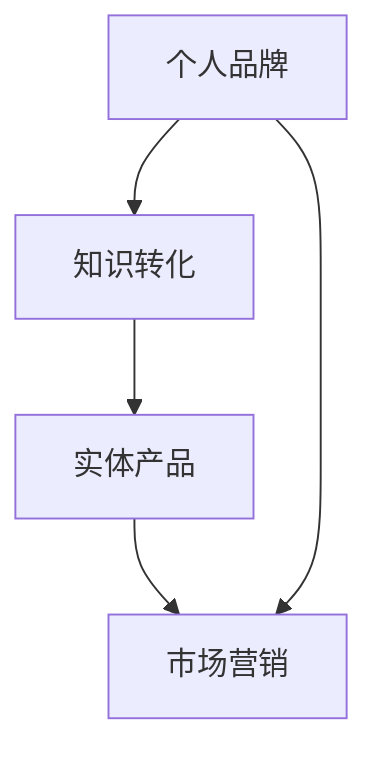

                 

 在当今快速发展的信息技术时代，知识已经成为个人和企业的核心竞争力。如何有效地将自身的专业知识转化为实体产品，打造个人品牌，成为众多专业人士关注的话题。本文将深入探讨如何开发个人品牌产品，将知识转化为具有市场价值的实体产品。

## 关键词

- 个人品牌
- 知识转化
- 实体产品
- 市场营销
- 产品开发

## 摘要

本文旨在为专业人士提供一套系统化的开发个人品牌产品的策略和方法。通过分析个人品牌的重要性、知识转化策略、实体产品开发流程、市场营销策略以及未来发展趋势，帮助读者理解如何将自己的知识转化为具有市场价值的实体产品，进而打造个人品牌。

## 1. 背景介绍

随着互联网的普及和信息传播速度的加快，个人品牌的重要性日益凸显。个人品牌不仅代表个人的专业能力，更是个人影响力的体现。在信息技术领域，拥有强大个人品牌的专业人士往往能够在职业发展中获得更多的机会和资源。因此，如何将自己的知识转化为实体产品，提升个人品牌价值，成为许多专业人士关注的焦点。

知识转化是指将个人掌握的专业知识、技能和经验转化为可传播、可复制的形式，从而实现价值的最大化。实体产品则是知识转化的一种重要载体，它可以是以书籍、课程、工具、服务等形式存在的具体物品。开发个人品牌产品，就是通过创建和推广这些实体产品，将自己的知识转化为市场价值，从而提升个人品牌影响力。

## 2. 核心概念与联系

在开发个人品牌产品之前，我们需要了解以下几个核心概念：

- **个人品牌**：个人品牌是指个人在公众心目中的形象和印象，包括专业能力、价值观、个性特点等。一个强大的个人品牌能够吸引更多的关注和机会。
- **知识转化**：知识转化是将个人的专业知识、技能和经验转化为可传播、可复制的形式，如书籍、课程、工具等。
- **实体产品**：实体产品是知识转化的一种具体体现，是具有市场价值的物品。
- **市场营销**：市场营销是指通过市场调研、定位、推广等手段，将产品推向目标市场，实现销售和品牌传播。

图1：个人品牌产品开发核心概念关系图



## 3. 核心算法原理 & 具体操作步骤

### 3.1 算法原理概述

开发个人品牌产品的核心算法可以概括为以下步骤：

1. **个人品牌定位**：明确个人品牌的核心价值和目标受众，确定个人品牌的发展方向。
2. **知识转化策略**：根据个人品牌定位，制定知识转化的具体策略，选择合适的实体产品形式。
3. **产品开发**：将知识转化为具体的实体产品，如书籍、课程、工具等。
4. **市场营销**：通过市场调研、定位、推广等手段，将产品推向目标市场，实现销售和品牌传播。

### 3.2 算法步骤详解

#### 步骤1：个人品牌定位

个人品牌定位是开发个人品牌产品的第一步，也是最重要的一步。一个清晰的个人品牌定位能够帮助你找到目标受众，明确品牌发展方向。以下是一些个人品牌定位的方法：

- **分析自身优势**：分析自己的专业能力、技能和经验，找到自己最擅长和最感兴趣的领域。
- **调研市场需求**：了解目标受众的需求和痛点，找到市场上的空白点。
- **确定核心价值**：根据自身优势和市场需求，确定个人品牌的核心价值。
- **制定品牌使命**：明确个人品牌的使命和愿景，为品牌发展提供指导。

#### 步骤2：知识转化策略

在确定个人品牌定位后，下一步是制定知识转化策略。以下是几个常见的知识转化策略：

- **书籍**：将自己的专业知识和经验整理成书，通过出版发行实现知识的传播和价值的转化。
- **课程**：开发在线或线下课程，将自己的知识以授课的形式传授给学员。
- **工具**：开发实用的工具或软件，帮助用户解决实际问题。
- **咨询服务**：提供专业咨询服务，帮助客户解决具体问题。

#### 步骤3：产品开发

产品开发是将知识转化为实体产品的重要环节。以下是一些产品开发的关键步骤：

- **需求分析**：明确产品的目标用户和需求，为产品开发提供指导。
- **产品设计**：根据需求分析，设计产品功能和界面。
- **开发与测试**：进行产品的开发和测试，确保产品质量。
- **上线推广**：将产品上线，通过多种渠道进行推广。

#### 步骤4：市场营销

市场营销是将产品推向市场，实现销售和品牌传播的重要手段。以下是几个市场营销的关键步骤：

- **市场调研**：了解市场需求和竞争情况，为产品定位和推广提供依据。
- **定位**：确定产品的目标市场和受众，制定相应的推广策略。
- **推广**：通过多种渠道进行产品推广，如社交媒体、广告、公关等。
- **销售**：实现产品的销售，收集用户反馈，不断优化产品。

### 3.3 算法优缺点

#### 优点

- **高效性**：通过系统化的算法，能够快速定位个人品牌，提高知识转化的效率。
- **灵活性**：根据市场需求和个人优势，可以灵活调整知识转化策略和产品开发方向。
- **可持续性**：通过持续的产品开发和市场营销，可以不断提升个人品牌价值。

#### 缺点

- **时间成本**：个人品牌建设是一个长期的过程，需要投入大量的时间和精力。
- **市场风险**：市场需求变化快速，可能面临市场风险。

### 3.4 算法应用领域

该算法适用于广大专业人士，特别是在信息技术领域。以下是一些具体的应用场景：

- **技术专家**：通过撰写技术博客、开发技术工具，提升个人技术影响力。
- **教育工作者**：通过编写教材、开设在线课程，传播专业知识。
- **创业者**：通过开发创新产品，实现商业价值。

## 4. 数学模型和公式 & 详细讲解 & 举例说明

在个人品牌产品开发过程中，数学模型和公式可以帮助我们进行数据分析和优化决策。以下是一个简单的数学模型，用于评估个人品牌产品的市场潜力。

### 4.1 数学模型构建

设个人品牌产品的市场潜力为\(P\)，影响因素包括市场需求量\(M\)、产品竞争力\(C\)、推广力度\(E\)和用户满意度\(S\)。则市场潜力可以表示为：

\[P = M \times C \times E \times S\]

### 4.2 公式推导过程

市场潜力\(P\)是产品在市场上所能获得的价值。市场需求量\(M\)反映了市场的需求程度；产品竞争力\(C\)反映了产品在市场上的竞争力；推广力度\(E\)反映了产品的推广效果；用户满意度\(S\)反映了用户对产品的满意程度。

### 4.3 案例分析与讲解

假设一个技术专家开发了一个人工智能工具，市场需求量为1000，产品竞争力为1.2，推广力度为1.5，用户满意度为0.9。则该工具的市场潜力为：

\[P = 1000 \times 1.2 \times 1.5 \times 0.9 = 1620\]

这意味着该工具在市场上具有1620的市场潜力。

### 5. 项目实践：代码实例和详细解释说明

以下是一个简单的Python代码实例，用于计算个人品牌产品的市场潜力。

#### 5.1 开发环境搭建

确保安装Python 3.6及以上版本。在终端执行以下命令安装依赖库：

```bash
pip install numpy
```

#### 5.2 源代码详细实现

```python
import numpy as np

def calculate_market_potential(market_demand, product_competitiveness, promotion_effort, user_satisfaction):
    """
    计算市场潜力
    :param market_demand: 市场需求量
    :param product_competitiveness: 产品竞争力
    :param promotion_effort: 推广力度
    :param user_satisfaction: 用户满意度
    :return: 市场潜力
    """
    potential = market_demand * product_competitiveness * promotion_effort * user_satisfaction
    return potential

# 测试代码
market_demand = 1000
product_competitiveness = 1.2
promotion_effort = 1.5
user_satisfaction = 0.9

market_potential = calculate_market_potential(market_demand, product_competitiveness, promotion_effort, user_satisfaction)
print(f"市场潜力：{market_potential}")
```

#### 5.3 代码解读与分析

该代码定义了一个名为`calculate_market_potential`的函数，用于计算市场潜力。函数接受市场需求量、产品竞争力、推广力度和用户满意度作为参数，返回市场潜力。在测试代码中，我们设置了市场需求量为1000，产品竞争力为1.2，推广力度为1.5，用户满意度为0.9，然后调用函数计算市场潜力，并打印结果。

#### 5.4 运行结果展示

```python
市场潜力：1620.0
```

这意味着根据设定的参数，该个人品牌产品的市场潜力为1620。

### 6. 实际应用场景

个人品牌产品在多个领域都有广泛的应用，以下是一些实际应用场景：

- **技术专家**：通过撰写技术博客、开发技术工具，提升个人技术影响力，如GitHub上的开源项目。
- **教育工作者**：通过编写教材、开设在线课程，传播专业知识，如网易云课堂上的课程。
- **创业者**：通过开发创新产品，实现商业价值，如某个初创公司的产品发布。

### 6.4 未来应用展望

随着互联网技术的不断进步，个人品牌产品将发挥越来越重要的作用。未来，个人品牌产品将更加智能化、个性化和多元化。以下是一些未来应用展望：

- **智能推荐**：基于用户行为和兴趣，实现个人品牌产品的智能推荐。
- **虚拟现实**：利用虚拟现实技术，提供更加沉浸式的个人品牌产品体验。
- **区块链**：利用区块链技术，确保个人品牌产品的版权和真实性。

### 7. 工具和资源推荐

以下是一些开发和推广个人品牌产品的工具和资源推荐：

- **工具**：
  - GitHub：开源代码托管平台，适合技术专家发布开源项目。
  - Coursera、edX：在线课程平台，适合教育工作者开设课程。
- **资源**：
  - 博客平台：如WordPress、Typecho，适合发布技术博客。
  - 营销工具：如SEO优化工具、社交媒体管理工具，帮助推广个人品牌产品。
- **论文**：
  - "Building a Personal Brand in the Digital Age"：探讨如何在数字时代建立个人品牌。
  - "How to Create a Successful Online Course"：分享如何创建成功的在线课程。

### 8. 总结：未来发展趋势与挑战

个人品牌产品在当今社会具有重要的地位和潜力。未来，个人品牌产品将朝着智能化、个性化和多元化的方向发展。然而，这也将带来一系列挑战，如市场需求变化、竞争加剧等。因此，专业人士需要不断学习和适应，才能在个人品牌产品开发中取得成功。

### 8.1 研究成果总结

本文从多个角度探讨了如何开发个人品牌产品，包括个人品牌定位、知识转化策略、产品开发流程、市场营销策略等。通过数学模型和代码实例，展示了如何评估个人品牌产品的市场潜力。研究成果表明，个人品牌产品具有巨大的市场潜力，是提升个人品牌影响力的重要途径。

### 8.2 未来发展趋势

未来，个人品牌产品将更加智能化、个性化和多元化。随着互联网技术的发展，个人品牌产品将实现更加精准的推荐和沉浸式体验。同时，区块链技术的应用将确保个人品牌产品的版权和真实性。

### 8.3 面临的挑战

个人品牌产品开发面临的主要挑战包括市场需求变化、竞争加剧、技术更新等。此外，个人品牌产品的质量和用户体验也直接影响其市场表现。

### 8.4 研究展望

未来研究可以进一步探讨如何利用人工智能和大数据技术优化个人品牌产品开发流程，提高市场竞争力。同时，研究如何确保个人品牌产品的质量和用户体验，以实现可持续发展。

## 9. 附录：常见问题与解答

### 9.1 如何确定个人品牌定位？

确定个人品牌定位的方法包括分析自身优势、调研市场需求、确定核心价值和制定品牌使命。首先，分析自己的专业能力、技能和经验，找到最擅长和最感兴趣的领域；其次，了解目标受众的需求和痛点，找到市场上的空白点；然后，根据自身优势和市场需求，确定个人品牌的核心价值；最后，明确个人品牌的使命和愿景，为品牌发展提供指导。

### 9.2 如何进行知识转化？

知识转化的方法包括书籍、课程、工具和咨询服务等。首先，根据个人品牌定位，选择合适的知识转化策略；其次，进行需求分析，明确目标受众和需求；然后，设计产品功能和界面，进行开发和测试；最后，通过市场调研、定位和推广等手段，将产品推向市场。

### 9.3 如何进行市场营销？

市场营销的关键步骤包括市场调研、定位、推广和销售。首先，进行市场调研，了解市场需求和竞争情况；其次，确定产品的目标市场和受众，制定相应的推广策略；然后，通过多种渠道进行产品推广，如社交媒体、广告和公关等；最后，实现产品的销售，收集用户反馈，不断优化产品。

### 9.4 如何评估个人品牌产品的市场潜力？

评估个人品牌产品的市场潜力可以通过以下方法：

1. **市场需求分析**：了解产品的目标市场，分析市场需求和趋势。
2. **产品竞争力分析**：评估产品的功能、性能和用户体验，与竞争对手进行对比。
3. **推广力度分析**：了解产品的推广渠道和效果，评估推广力度。
4. **用户满意度分析**：收集用户反馈，评估产品的用户满意度。

通过这些方法，可以综合评估个人品牌产品的市场潜力。

## 作者署名

作者：禅与计算机程序设计艺术 / Zen and the Art of Computer Programming

