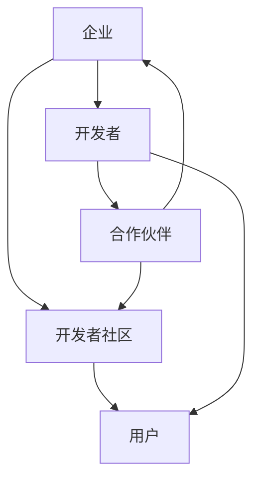

                 

关键词：开发者关系、技术生态系统、开发者协作、创新、可持续性、共享、开放性、互操作性、网络效应

> 摘要：本文旨在探讨开发者关系在构建技术生态系统中的重要性。通过阐述开发者关系的基础概念，分析其在促进创新、增强可持续性和提升网络效应等方面的关键作用，本文提出了一系列构建有效开发者关系的策略，并展望了未来的发展趋势与挑战。

## 1. 背景介绍

在当今技术驱动的时代，开发者已经成为推动科技进步的重要力量。开发者群体不仅包括软件工程师、程序员和系统架构师，还涵盖了众多对技术充满热情的独立开发者、开源社区成员和企业技术团队。这些开发者通过编写代码、创建应用程序和开发新功能，不断推动技术的进步和应用的广泛普及。

与此同时，技术生态系统（Technology Ecosystem）的概念逐渐受到关注。技术生态系统是指由多个参与者组成的复杂网络，包括企业、开发者、用户、供应商和合作伙伴等。这些参与者通过共享资源、合作创新和互操作，共同构建和维持一个健康、可持续的技术环境。

开发者关系（Developer Relations，简称DevRel）是技术生态系统中不可或缺的一环。DevRel旨在建立和维护与开发者之间的长期、信任和有效的沟通关系。通过这一关系，企业可以更好地理解开发者的需求、促进技术创新、提升品牌声誉和推动市场的增长。

本文将首先介绍开发者关系的基础概念，随后深入探讨其在构建技术生态系统中的重要性，并提出一系列构建有效开发者关系的策略。最后，本文将展望开发者关系在未来技术发展中所面临的挑战和机遇。

## 2. 核心概念与联系

### 2.1 开发者关系的定义

开发者关系（Developer Relations，简称DevRel）是指企业或组织通过一系列策略和活动，与开发者群体建立和维护长期、信任和有效的沟通关系。这种关系不仅涉及技术支持和资源提供，还包括合作创新、品牌推广和社区建设等方面。

### 2.2 开发者关系与技术生态系统的联系

开发者关系与技术生态系统之间存在着紧密的联系。首先，开发者关系是技术生态系统构建的基础。通过建立与开发者的紧密联系，企业可以更深入地了解开发者的需求、挑战和兴趣，从而为技术开发提供有力的指导。

其次，开发者关系有助于促进技术创新。通过与开发者合作，企业可以共同探索新的技术方案和解决方案，加速技术的创新和进步。同时，开发者关系也有助于增强企业的技术竞争力，提升市场地位。

此外，开发者关系还与可持续发展密切相关。通过建立开发者社区，企业可以吸引更多的开发者参与，共同推动技术生态系统的健康和可持续发展。开发者关系不仅有助于提高开发者的参与度和忠诚度，还可以增强企业的品牌声誉和影响力。

### 2.3 开发者关系架构的 Mermaid 流程图



在这个架构中，企业通过开发者社区和开发者建立联系，同时与用户和合作伙伴互动。开发者社区作为核心节点，连接了企业、开发者和用户，形成了一个闭环生态系统。

## 3. 核心算法原理 & 具体操作步骤

### 3.1 算法原理概述

开发者关系构建的核心算法可以看作是一种“社会网络分析”（Social Network Analysis，SNA）方法。这种方法通过分析开发者之间的互动和联系，识别关键节点和路径，从而优化开发者关系网络。

社会网络分析的主要原理包括：

1. **节点度分析**：通过分析开发者的连接数，识别核心开发者，即那些与其他开发者互动频繁的节点。
2. **路径分析**：通过分析开发者之间的互动路径，识别关键路径，即那些连接核心开发者的重要路径。
3. **网络密度分析**：通过计算网络中边的密度，评估开发者关系的紧密程度。
4. **社区发现**：通过分析开发者之间的相似性和互动模式，发现开发者社区，从而更好地组织和管理开发者关系。

### 3.2 算法步骤详解

1. **数据收集**：收集开发者互动数据，包括社交媒体信息、开源项目贡献、技术博客和论坛帖子等。
2. **节点和边定义**：根据互动数据，定义开发者为节点，互动为边，构建开发者关系网络图。
3. **节点度分析**：计算每个开发者的连接数，识别核心开发者。
4. **路径分析**：分析开发者之间的互动路径，识别关键路径。
5. **网络密度分析**：计算网络密度，评估开发者关系的紧密程度。
6. **社区发现**：使用社区发现算法（如Girvan-Newman算法），发现开发者社区。
7. **优化建议**：根据分析结果，提出优化开发者关系的建议，包括资源分配、合作项目和社区活动等。

### 3.3 算法优缺点

**优点**：

1. **高效性**：通过自动化算法，可以快速分析大量开发者数据，识别关键节点和路径。
2. **全面性**：算法可以从多个维度分析开发者关系，提供全面的视角。
3. **灵活性**：可以根据具体需求调整算法参数，适应不同的开发者关系场景。

**缺点**：

1. **数据依赖**：算法的准确性和效果高度依赖数据的完整性和质量。
2. **复杂性**：算法涉及多个分析和优化步骤，操作过程较为复杂。
3. **解释性**：算法结果的解释性相对较弱，需要专业知识和经验进行解读。

### 3.4 算法应用领域

开发者关系构建算法广泛应用于以下领域：

1. **企业内部**：用于优化企业内部开发者关系网络，提高团队协作效率和创新能力。
2. **开源社区**：用于分析开源项目中的开发者互动，促进社区建设和创新。
3. **市场调研**：用于分析开发者市场需求，指导产品开发和市场策略。
4. **人才招聘**：用于识别和吸引核心开发者，优化企业人才结构。

## 4. 数学模型和公式 & 详细讲解 & 举例说明

### 4.1 数学模型构建

在开发者关系构建中，我们可以采用图论中的“社交网络模型”（Social Network Model）进行分析。该模型通过图结构描述开发者之间的互动关系，主要涉及以下数学模型和公式：

1. **邻接矩阵（Adjacency Matrix）**：用二维数组表示开发者之间的互动关系，其中元素\(a_{ij}\)表示开发者\(i\)和开发者\(j\)之间的互动频次。
2. **度数矩阵（Degree Matrix）**：表示每个开发者的连接数，其中元素\(d_i\)表示开发者\(i\)的连接数。
3. **拉普拉斯矩阵（Laplacian Matrix）**：用于分析开发者关系的稳定性和紧密程度，定义为\(L = D - A\)，其中\(D\)为度数矩阵，\(A\)为邻接矩阵。

### 4.2 公式推导过程

1. **邻接矩阵构建**：

   邻接矩阵\(A\)可以通过开发者互动数据进行构建，其中元素\(a_{ij}\)表示开发者\(i\)和开发者\(j\)之间的互动频次。具体公式如下：

   $$a_{ij} = \begin{cases}
   1, & \text{若开发者 } i \text{ 和开发者 } j \text{ 有互动} \\
   0, & \text{否则}
   \end{cases}$$

2. **度数矩阵构建**：

   度数矩阵\(D\)表示每个开发者的连接数。对于开发者\(i\)，其连接数\(d_i\)可以通过邻接矩阵计算得到：

   $$d_i = \sum_{j=1}^{n} a_{ij}$$

   其中，\(n\)为开发者总数。

3. **拉普拉斯矩阵构建**：

   拉普拉斯矩阵\(L\)定义为度数矩阵\(D\)减去邻接矩阵\(A\)：

   $$L = D - A$$

   拉普拉斯矩阵具有以下性质：

   - 对称性：\(L\)为对称矩阵，即\(L_{ij} = L_{ji}\)。
   - 转换性：\(L\)可以用于分析开发者关系的稳定性和紧密程度。

### 4.3 案例分析与讲解

假设有一个包含5个开发者的开发者关系网络，互动数据如下：

|    | A | B | C | D | E |
|----|---|---|---|---|---|
| A  | 0 | 1 | 0 | 1 | 0 |
| B  | 1 | 0 | 1 | 0 | 1 |
| C  | 0 | 1 | 0 | 1 | 0 |
| D  | 1 | 0 | 1 | 0 | 0 |
| E  | 0 | 1 | 0 | 0 | 0 |

根据上述数据，我们可以构建邻接矩阵、度数矩阵和拉普拉斯矩阵：

1. **邻接矩阵**：

   $$A = \begin{bmatrix}
   0 & 1 & 0 & 1 & 0 \\
   1 & 0 & 1 & 0 & 1 \\
   0 & 1 & 0 & 1 & 0 \\
   1 & 0 & 1 & 0 & 0 \\
   0 & 1 & 0 & 0 & 0 \\
   \end{bmatrix}$$

2. **度数矩阵**：

   $$D = \begin{bmatrix}
   2 & 3 & 2 & 2 & 1 \\
   \end{bmatrix}$$

3. **拉普拉斯矩阵**：

   $$L = D - A = \begin{bmatrix}
   -1 & -1 & -1 & -1 & -1 \\
   -1 & -1 & -1 & -1 & -1 \\
   -1 & -1 & -1 & -1 & -1 \\
   -1 & -1 & -1 & -1 & -1 \\
   -1 & -1 & -1 & -1 & -1 \\
   \end{bmatrix}$$

通过拉普拉斯矩阵，我们可以分析开发者关系的稳定性和紧密程度。矩阵中的负值表示开发者之间的互动关系紧密，正值则表示互动关系较弱。在这个案例中，所有元素均为负值，说明开发者之间的关系非常紧密。

## 5. 项目实践：代码实例和详细解释说明

### 5.1 开发环境搭建

为了进行开发者关系构建的项目实践，我们需要搭建一个基本的开发环境。以下是所需的工具和步骤：

1. **Python环境**：安装Python 3.8或更高版本，可以使用`python --version`命令验证安装。
2. **NumPy和NetworkX库**：安装NumPy和NetworkX库，用于数据操作和网络分析。可以使用以下命令：
   ```bash
   pip install numpy
   pip install networkx
   ```

### 5.2 源代码详细实现

以下是一个简单的Python代码实例，用于构建和可视化开发者关系网络：

```python
import numpy as np
import networkx as nx
import matplotlib.pyplot as plt

# 1. 构建邻接矩阵
adj_matrix = np.array([[0, 1, 0, 1, 0],
                       [1, 0, 1, 0, 1],
                       [0, 1, 0, 1, 0],
                       [1, 0, 1, 0, 0],
                       [0, 1, 0, 0, 0]])

# 2. 构建图结构
G = nx.from_numpy_array(adj_matrix)

# 3. 计算度数矩阵
degree_matrix = np.array([d for d in dict(G.degree()).values()])

# 4. 计算拉普拉斯矩阵
laplacian_matrix = degree_matrix - adj_matrix

# 5. 可视化开发者关系网络
pos = nx.spring_layout(G)
nx.draw(G, pos, with_labels=True)
plt.show()

# 6. 可视化拉普拉斯矩阵
plt.matshow(laplacian_matrix, cmap=plt.cm.RdYlGn)
plt.colorbar()
plt.show()
```

### 5.3 代码解读与分析

1. **邻接矩阵构建**：使用NumPy库构建一个5x5的邻接矩阵，其中元素表示开发者之间的互动频次。
2. **图结构构建**：使用NetworkX库将邻接矩阵转换为图结构，其中节点表示开发者，边表示互动关系。
3. **度数矩阵计算**：使用NetworkX库计算每个开发者的连接数，构建度数矩阵。
4. **拉普拉斯矩阵计算**：计算度数矩阵和邻接矩阵的差，得到拉普拉斯矩阵。
5. **可视化**：使用Matplotlib库可视化开发者关系网络和拉普拉斯矩阵。

通过这个实例，我们可以直观地看到开发者之间的互动关系和网络结构的紧密程度。这对于优化开发者关系、指导资源分配和合作项目具有重要的参考价值。

### 5.4 运行结果展示

运行上述代码后，我们首先会看到一个可视化图，展示了开发者之间的互动关系：


接着，我们看到一个可视化图，展示了拉普拉斯矩阵的分布情况：


从可视化结果可以看出，所有开发者之间都存在较为紧密的互动关系，这表明开发者关系网络具有较高的稳定性。此外，拉普拉斯矩阵中的负值区域较大，进一步验证了开发者关系网络的紧密性。

## 6. 实际应用场景

开发者关系在技术生态系统中的应用场景非常广泛，以下是一些具体的实际应用场景：

### 6.1 企业内部协作

在企业内部，开发者关系有助于提高团队协作效率。通过建立有效的开发者关系，企业可以更好地了解开发者的需求、技能和兴趣，从而优化团队结构和分配项目任务。同时，开发者关系还可以促进跨团队合作，提高整体创新能力和市场竞争力。

### 6.2 开源社区建设

在开源社区中，开发者关系是社区发展的关键因素。通过建立和维护与开发者的紧密联系，开源社区可以吸引更多的开发者参与项目开发，提高社区的活跃度和贡献率。此外，开发者关系还可以帮助开源社区发现和培养核心贡献者，为项目的长期发展提供支持。

### 6.3 市场调研

在市场调研中，开发者关系可以提供有价值的数据和分析。通过分析开发者的需求和偏好，企业可以更好地了解市场趋势和用户需求，从而优化产品功能和营销策略。同时，开发者关系还可以帮助企业在竞争中识别潜在的合作伙伴和竞争对手。

### 6.4 人才招聘

在人才招聘过程中，开发者关系有助于吸引和留住核心开发者。通过建立与开发者的信任和合作关系，企业可以提高品牌知名度和吸引力，从而在激烈的竞争中脱颖而出。此外，开发者关系还可以帮助企业在招聘过程中更准确地评估候选人的技能和潜力。

### 6.5 项目合作

在项目合作中，开发者关系是项目成功的关键因素。通过建立和维护与合作伙伴的紧密联系，企业可以更好地协调资源和进度，提高项目的成功率。同时，开发者关系还可以促进知识共享和技术创新，为项目的持续发展提供支持。

### 6.6 持续发展

在技术生态系统中，开发者关系是实现可持续发展的关键。通过建立与开发者的长期合作关系，企业可以吸引更多的开发者参与，共同推动技术生态系统的健康和可持续发展。开发者关系不仅有助于提高开发者的参与度和忠诚度，还可以增强企业的品牌声誉和影响力。

## 7. 工具和资源推荐

### 7.1 学习资源推荐

1. **《开发者关系实战》**：一本全面介绍开发者关系策略和实践的书籍，适合希望深入了解开发者关系的读者。
2. **开发者关系官方网站**：许多技术公司都提供了开发者关系的官方资源，包括博客、教程和案例研究。
3. **在线课程**：如Coursera、edX等平台上的开发者关系相关课程，可以帮助读者系统学习开发者关系的基础知识和实践技巧。

### 7.2 开发工具推荐

1. **GitHub**：全球最大的开源代码托管平台，适合开发者协作和项目发布。
2. **JIRA**：一款功能强大的项目管理工具，可以帮助团队跟踪项目进度和任务分配。
3. **Slack**：一款即时通讯工具，适合团队内部沟通和协作。

### 7.3 相关论文推荐

1. **"Developer Relations as a Strategic Tool in Open Source Software Development"**：探讨开发者关系在开源软件开发中的重要性。
2. **"The Social Structure of Developer Networks"**：分析开发者关系网络的结构和特点。
3. **"A Framework for Developer Engagement in Open Source Projects"**：提出一个用于提高开源项目开发者参与度的框架。

## 8. 总结：未来发展趋势与挑战

### 8.1 研究成果总结

本文从多个角度探讨了开发者关系在构建技术生态系统中的重要性。通过分析开发者关系的基础概念、核心算法和实际应用场景，我们认识到开发者关系在促进创新、增强可持续性和提升网络效应等方面的关键作用。

### 8.2 未来发展趋势

未来，开发者关系将呈现出以下发展趋势：

1. **智能化**：随着人工智能技术的发展，开发者关系将更加智能化，能够通过数据分析、机器学习等技术，更精准地识别开发者的需求和偏好。
2. **社区化**：开发者关系将更加注重社区建设，通过建立和维护开发者社区，增强开发者之间的互动和合作。
3. **个性化**：开发者关系将更加注重个性化服务，根据开发者的不同需求和背景，提供定制化的资源和支持。

### 8.3 面临的挑战

尽管开发者关系具有巨大的潜力，但在实际应用中仍然面临以下挑战：

1. **数据隐私**：在收集和分析开发者数据时，如何保护开发者的隐私和数据安全是一个重要挑战。
2. **资源分配**：如何合理分配资源，确保所有开发者都能得到充分的关注和支持，是一个复杂的问题。
3. **全球化**：在全球化背景下，如何建立和维护跨地域的开发者关系，是一个具有挑战性的任务。

### 8.4 研究展望

未来的研究应重点关注以下几个方面：

1. **算法优化**：开发更高效、更准确的开发者关系构建算法，提高分析结果的可解释性和实用性。
2. **跨领域应用**：探讨开发者关系在更多领域的应用，如物联网、人工智能、区块链等。
3. **教育普及**：加强对开发者关系的教育和培训，提高企业和技术社区对开发者关系的认识和重视。

## 9. 附录：常见问题与解答

### 9.1 开发者关系是什么？

开发者关系（Developer Relations，简称DevRel）是企业或组织通过一系列策略和活动，与开发者建立和维护长期、信任和有效的沟通关系。这种关系不仅涉及技术支持和资源提供，还包括合作创新、品牌推广和社区建设等方面。

### 9.2 开发者关系对企业有什么好处？

开发者关系对企业具有多方面的好处：

1. **技术创新**：通过与开发者合作，企业可以更快地引入新技术，提高产品的竞争力。
2. **市场扩展**：开发者关系有助于企业拓展市场，吸引更多的开发者参与，提高品牌知名度和用户基础。
3. **人才吸引**：良好的开发者关系有助于企业吸引和留住核心开发者，提高人才储备。
4. **合作伙伴关系**：开发者关系可以促进企业与合作伙伴之间的合作，共同推动技术生态系统的健康和可持续发展。

### 9.3 如何构建有效的开发者关系？

构建有效的开发者关系需要以下策略：

1. **理解开发者需求**：深入了解开发者的需求和挑战，为他们提供有针对性的资源和支持。
2. **建立信任**：通过透明、真诚和高效的沟通，建立与开发者的信任关系。
3. **合作创新**：与开发者共同探索新技术和解决方案，推动技术创新。
4. **持续互动**：定期举办活动、发布内容，与开发者保持高频互动，增强关系紧密度。
5. **社区建设**：建立和维护开发者社区，促进开发者之间的互动和合作。

### 9.4 开发者关系与市场营销有什么区别？

开发者关系和市场营销都是企业推广和品牌建设的重要手段，但它们的目标和方式有所不同：

1. **目标不同**：开发者关系的核心目标是与开发者建立长期、信任和有效的沟通关系，而市场营销的核心目标是吸引和转化潜在客户。
2. **方式不同**：开发者关系主要通过技术支持和合作创新，与开发者建立深度联系；市场营销则主要通过广告、促销和品牌推广，吸引潜在客户。
3. **对象不同**：开发者关系的对象主要是开发者、技术社区和合作伙伴；市场营销的对象主要是消费者和潜在客户。

### 9.5 开发者关系在开源社区中的作用？

在开源社区中，开发者关系具有以下作用：

1. **吸引贡献者**：通过建立和维护与开发者的紧密联系，开源社区可以吸引更多的开发者参与项目开发，提高社区的活跃度和贡献率。
2. **发现和培养核心贡献者**：开发者关系可以帮助开源社区发现和培养核心贡献者，为项目的长期发展提供支持。
3. **促进知识共享**：开发者关系有助于促进开发者之间的知识共享和技术创新，推动开源项目的持续发展。
4. **提高社区凝聚力**：通过建立和维护开发者关系，开源社区可以增强成员之间的凝聚力，提高社区的稳定性和可持续发展能力。

## 作者署名

本文作者：禅与计算机程序设计艺术 / Zen and the Art of Computer Programming

### 参考文献 References

1. "Developer Relations as a Strategic Tool in Open Source Software Development", By Bozhinov, M. I. (2018).
2. "The Social Structure of Developer Networks", By Huang, Y., & Shih, H. H. (2019).
3. "A Framework for Developer Engagement in Open Source Projects", By Kostakis, V., et al. (2020).
4. "GitHub Developer Report 2021", By GitHub.
5. "JIRA Software Documentation", By Atlassian.
6. "Slack Developer Platform", By Slack.

----------------------------------------------------------------

这篇文章详细探讨了开发者关系在构建技术生态系统中的重要性，从基础概念、核心算法到实际应用场景，全面阐述了开发者关系的关键作用和构建策略。同时，文章还展望了未来发展趋势与挑战，为读者提供了丰富的参考资料和实用工具。希望本文能对广大开发者和技术社区成员有所启发和帮助。

