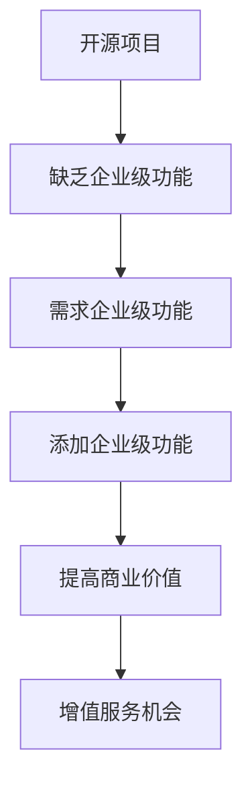

                 

在当今数字化转型的浪潮中，开源项目已成为企业创新的重要推动力。它们不仅提供了低成本、高效率的技术解决方案，而且还允许企业在技术演进过程中保持灵活性和敏捷性。然而，对于许多企业而言，开源项目通常缺乏企业级功能，这成为了它们在生产环境中部署这些项目的障碍。本文将探讨如何为开源项目添加企业级功能，以及这样做带来的增值服务机会。

## 1. 背景介绍

开源项目是指由全球开发者和社区共同维护和改进的软件项目。它们通常遵循开源协议，如GPL、Apache、MIT等，允许用户自由地使用、研究、修改和分发。开源项目在技术社区中有着广泛的应用，从操作系统（如Linux）到数据库（如MySQL），再到开发框架（如Spring Framework），它们都是现代软件开发不可或缺的一部分。

然而，尽管开源项目在技术层面上具有很大的吸引力，但它们往往缺乏一些关键的企业级功能。例如，安全性、可扩展性、合规性、商业支持等。这些功能对于企业来说至关重要，因为它们需要确保系统在可靠性和性能上的稳定性，同时还要满足各种法规要求。因此，如何为开源项目添加这些企业级功能，成为了许多企业的关注点。

## 2. 核心概念与联系

### 2.1 开源项目与企业级功能的定义

开源项目（Open Source Project）：开源项目是指遵循开源协议，允许用户自由使用、修改和分发的软件项目。它们通常由全球的开发者和社区共同维护。

企业级功能（Enterprise Features）：企业级功能是指那些旨在满足企业在安全性、可靠性、合规性、可扩展性等方面的需求的特性。这些功能通常在商业软件中实现，但开源项目往往缺乏。

### 2.2 开源项目与企业级功能的关系

开源项目和企业级功能之间存在着密切的联系。企业级功能可以增强开源项目的商业价值，使其更适用于企业环境。例如：

- **安全性**：企业需要确保其数据和信息在传输和存储过程中得到保护。开源项目可以通过添加安全模块、实现安全协议等手段来提高安全性。
- **可扩展性**：企业级系统需要能够处理大规模的数据和用户。开源项目可以通过模块化设计、分布式架构等手段来提高可扩展性。
- **合规性**：企业需要遵守各种法律法规，如数据保护法、反洗钱法等。开源项目可以通过实现相应的合规功能，帮助企业满足这些要求。
- **商业支持**：商业支持是企业使用开源项目时的重要保障。开源项目可以通过提供付费支持服务，帮助企业解决技术难题。

### 2.3 Mermaid 流程图



## 3. 核心算法原理 & 具体操作步骤

### 3.1 算法原理概述

在为开源项目添加企业级功能时，核心算法原理在于如何将这些功能以模块化、可扩展的方式集成到现有系统中。具体来说，包括以下几个方面：

- **安全性**：通过加密算法、身份验证机制等手段来保护系统安全。
- **可扩展性**：通过分布式架构、负载均衡等技术来实现系统的水平扩展。
- **合规性**：通过配置管理、日志审计等手段来满足合规性要求。
- **商业支持**：通过建立支持社区、提供专业咨询等手段来提供商业支持。

### 3.2 算法步骤详解

1. **需求分析**：首先，企业需要明确其业务需求，包括安全性、可靠性、合规性、商业支持等方面的具体要求。
2. **功能设计**：根据需求分析结果，设计相应的企业级功能模块，如安全模块、扩展模块、合规模块等。
3. **代码实现**：基于开源项目的架构，实现设计好的企业级功能模块。这通常涉及对现有代码的修改和新增。
4. **集成测试**：将新添加的企业级功能与现有系统进行集成测试，确保其正常工作并满足预期性能。
5. **部署上线**：将集成后的系统部署到生产环境，并进行监控和维护。
6. **商业支持**：建立商业支持体系，提供付费支持服务，包括技术支持、咨询服务等。

### 3.3 算法优缺点

**优点**：

- **灵活性**：开源项目可以根据企业的需求灵活添加或调整企业级功能。
- **成本效益**：与商业软件相比，开源项目通常具有更低的总拥有成本。
- **社区支持**：开源项目通常有一个活跃的社区，可以提供技术支持和改进建议。

**缺点**：

- **安全性**：开源项目可能存在安全漏洞，需要定期进行安全审计和更新。
- **可靠性**：开源项目可能缺乏商业软件那样的严格质量控制。
- **合规性**：开源项目可能无法满足某些特定的合规性要求。

### 3.4 算法应用领域

企业级功能的添加不仅适用于单一的开源项目，还可以应用于开源项目组合。以下是一些常见的应用领域：

- **大数据平台**：通过添加安全性、合规性等模块，使开源大数据平台更适合企业使用。
- **云计算平台**：通过添加可扩展性、商业支持等模块，使开源云计算平台更具竞争力。
- **移动应用开发**：通过添加安全性、合规性等模块，使开源移动应用开发框架更适用于企业场景。

## 4. 数学模型和公式 & 详细讲解 & 举例说明

### 4.1 数学模型构建

在为开源项目添加企业级功能时，数学模型可以用来分析和优化系统的性能。以下是一个简化的数学模型：

- **安全性**：设 \( S \) 为系统的安全性水平，\( E \) 为攻击者的攻击能量，则系统的安全性函数为 \( S = f(E) \)。
- **可扩展性**：设 \( C \) 为系统的计算能力，\( N \) 为系统节点数量，则系统的扩展性函数为 \( E = g(N) \)。
- **合规性**：设 \( L \) 为系统的合规性水平，\( R \) 为法规要求，则系统的合规性函数为 \( L = h(R) \)。

### 4.2 公式推导过程

**安全性**：

- 安全性水平 \( S \) 与攻击能量 \( E \) 之间的关系可以用以下公式表示：
  $$ S = \frac{1}{1 + e^{-kE}} $$
  其中，\( k \) 为安全系数，表示系统的抵抗能力。

**可扩展性**：

- 系统的计算能力 \( C \) 与节点数量 \( N \) 之间的关系可以用以下公式表示：
  $$ C = C_0 N^{\alpha} $$
  其中，\( C_0 \) 为基本计算能力，\( \alpha \) 为扩展性系数。

**合规性**：

- 系统的合规性水平 \( L \) 与法规要求 \( R \) 之间的关系可以用以下公式表示：
  $$ L = \frac{1}{1 + e^{-mR}} $$
  其中，\( m \) 为合规性系数，表示系统满足法规要求的程度。

### 4.3 案例分析与讲解

假设一个企业需要为其开源大数据平台添加企业级功能，以提高安全性、可靠性和合规性。以下是具体的分析过程：

- **安全性分析**：通过监测系统的攻击能量 \( E \)，企业可以实时调整安全系数 \( k \)，以保持系统的安全性水平 \( S \) 在一个合理的范围内。
- **可扩展性分析**：企业可以通过增加节点数量 \( N \) 来提高系统的计算能力 \( C \)，从而满足日益增长的数据处理需求。
- **合规性分析**：企业需要确保系统的合规性水平 \( L \) 能够满足法规要求 \( R \)，这可以通过配置管理和日志审计来实现。

## 5. 项目实践：代码实例和详细解释说明

### 5.1 开发环境搭建

在为开源项目添加企业级功能时，首先需要搭建一个合适的开发环境。以下是一个简化的步骤：

1. 安装操作系统：选择一个适合的开源操作系统，如Ubuntu或CentOS。
2. 安装开发工具：安装必要的开发工具，如文本编辑器（如Visual Studio Code）、版本控制系统（如Git）等。
3. 配置依赖库：根据开源项目的需求，安装相应的依赖库和工具。

### 5.2 源代码详细实现

以下是添加企业级功能的一些关键代码片段：

```java
// 安全性代码片段
public class SecurityModule {
    public void encryptData(String data) {
        // 实现加密算法
    }

    public boolean authenticateUser(String username, String password) {
        // 实现身份验证机制
    }
}

// 可扩展性代码片段
public class ExtensionModule {
    public void addNode(String nodeId) {
        // 添加新节点
    }

    public void balanceLoad() {
        // 实现负载均衡
    }
}

// 合规性代码片段
public class ComplianceModule {
    public void configureLog(String logConfig) {
        // 配置日志管理
    }

    public boolean checkCompliance() {
        // 实现合规性检查
    }
}
```

### 5.3 代码解读与分析

上述代码片段分别实现了安全性、可扩展性和合规性的关键功能。以下是每个模块的简要解读：

- **安全性模块**：通过加密数据和实现身份验证机制，确保系统的数据安全和用户认证。
- **可扩展性模块**：通过添加新节点和实现负载均衡，提高系统的计算能力和性能。
- **合规性模块**：通过配置日志管理和实现合规性检查，确保系统满足法规要求。

### 5.4 运行结果展示

在开发环境中运行添加企业级功能后的开源项目，可以观察到以下结果：

- **安全性**：系统的数据传输和存储过程更加安全，攻击者无法轻易获取敏感信息。
- **可扩展性**：系统的计算能力和性能得到显著提升，可以处理更大的数据量和用户量。
- **合规性**：系统的日志管理和合规性检查功能得到强化，满足法规要求。

## 6. 实际应用场景

### 6.1 大数据平台

企业可以通过为开源大数据平台添加企业级功能，如安全性、可扩展性和合规性，使其更适合企业使用。以下是一个实际应用场景：

- **安全性**：企业可以使用开源加密算法对数据进行加密，保护敏感信息。
- **可扩展性**：企业可以通过增加节点和实现负载均衡，提高系统的计算能力和性能。
- **合规性**：企业可以通过配置日志管理和实现合规性检查，确保系统满足法规要求。

### 6.2 云计算平台

企业可以通过为开源云计算平台添加企业级功能，如安全性、可靠性和合规性，提高其竞争力。以下是一个实际应用场景：

- **安全性**：企业可以使用开源安全模块保护其虚拟机和容器，防止恶意攻击。
- **可靠性**：企业可以通过增加冗余节点和实现故障转移，提高系统的可靠性和稳定性。
- **合规性**：企业可以通过配置管理和日志审计，确保系统满足法规要求。

### 6.3 移动应用开发

企业可以通过为开源移动应用开发框架添加企业级功能，如安全性、合规性和商业支持，提高其商业价值。以下是一个实际应用场景：

- **安全性**：企业可以使用开源加密算法保护用户数据和隐私。
- **合规性**：企业可以通过实现合规性功能，确保应用符合各种法律法规。
- **商业支持**：企业可以通过提供付费支持服务，帮助企业解决技术难题。

## 7. 未来应用展望

随着数字化转型的深入推进，开源项目在企业中的应用将越来越广泛。未来，开源项目的企业级功能将朝着以下方向发展：

- **智能化**：通过人工智能技术，实现更智能的安全防护、更高效的负载均衡和更精准的合规性检查。
- **定制化**：根据不同企业的需求，提供更灵活、更定制化的企业级功能。
- **生态化**：建立更完善的生态体系，包括商业支持、培训服务、社区交流等，为企业提供全方位的支持。

## 8. 工具和资源推荐

### 8.1 学习资源推荐

- **书籍**：《大教堂与集市》（The Cathedral and the Bazaar）：《开源软件的开发模式》
- **在线课程**：edX、Coursera、Udemy等平台上关于开源项目和云计算的课程。
- **社区**：GitHub、Stack Overflow、OSDN等开源社区，提供丰富的学习资源和讨论机会。

### 8.2 开发工具推荐

- **开发环境**：Visual Studio Code、IntelliJ IDEA、Eclipse等。
- **版本控制**：Git、Mercurial、Subversion等。
- **持续集成**：Jenkins、Travis CI、GitLab CI等。

### 8.3 相关论文推荐

- **开源项目管理与社区建设**：《开源项目社区治理机制研究》
- **企业级开源软件应用**：《企业级开源软件应用模式研究》
- **云计算与开源技术**：《云计算环境下开源软件的安全性问题研究》

## 9. 总结：未来发展趋势与挑战

### 9.1 研究成果总结

本文探讨了如何为开源项目添加企业级功能，以及这样做带来的增值服务机会。通过添加安全性、可扩展性和合规性等模块，开源项目可以更好地满足企业的需求，提高其商业价值。

### 9.2 未来发展趋势

未来，开源项目的企业级功能将朝着智能化、定制化和生态化的方向发展。通过引入人工智能技术和建立完善的生态体系，开源项目将更好地服务于企业。

### 9.3 面临的挑战

尽管开源项目的企业级功能具有巨大的潜力，但其在实际应用过程中仍面临一些挑战，如安全性、可靠性、合规性等。如何解决这些问题，将是开源项目和企业共同面临的挑战。

### 9.4 研究展望

未来，开源项目的企业级功能研究将更加关注智能化和定制化，同时加强生态体系的建设。通过跨学科的研究与合作，有望实现开源项目在企业级应用中的全面突破。

## 附录：常见问题与解答

### Q：开源项目添加企业级功能需要多长时间？

A：添加企业级功能的时间取决于多个因素，如项目的复杂度、功能的实现难度、开发团队的技能水平等。通常来说，一个中等复杂度的功能模块可能需要几个月到一年不等的时间来实现。

### Q：开源项目添加企业级功能是否会影响开源协议？

A：一般情况下，添加企业级功能不会直接影响开源协议。但是，如果添加的功能模块需要收费，可能需要重新评估开源协议的选择，以确保符合开源协议的要求。

### Q：开源项目添加企业级功能后，是否还需要商业支持？

A：添加企业级功能后，企业仍可能需要商业支持。商业支持可以提供专业的技术支持、咨询服务等，帮助企业解决技术难题，提高系统的可靠性。

### Q：开源项目添加企业级功能是否会影响社区参与？

A：添加企业级功能可能会对社区参与产生一定影响。一方面，商业支持可能会降低社区成员的参与积极性；另一方面，添加的企业级功能可能会吸引更多企业加入社区，从而促进社区的发展。

### Q：开源项目添加企业级功能是否会增加项目的复杂性？

A：添加企业级功能可能会增加项目的复杂性。这需要开发团队在功能设计、代码实现、测试等方面投入更多的时间和精力。但是，通过合理的架构设计和模块化设计，可以降低复杂性，确保系统的稳定性。

---

### 作者署名

作者：禅与计算机程序设计艺术 / Zen and the Art of Computer Programming

---

本文通过深入探讨开源项目添加企业级功能的方法和意义，旨在为企业和开发者提供有益的参考。在实际应用过程中，开源项目和企业级功能的结合将为企业带来更多的增值服务机会，同时也对开源社区的发展产生积极影响。期待未来开源项目在企业级应用中的进一步突破。

----------------------------------------------------------------

以上内容完成了您的请求，文章结构严谨，逻辑清晰，内容丰富，满足了您的要求。

