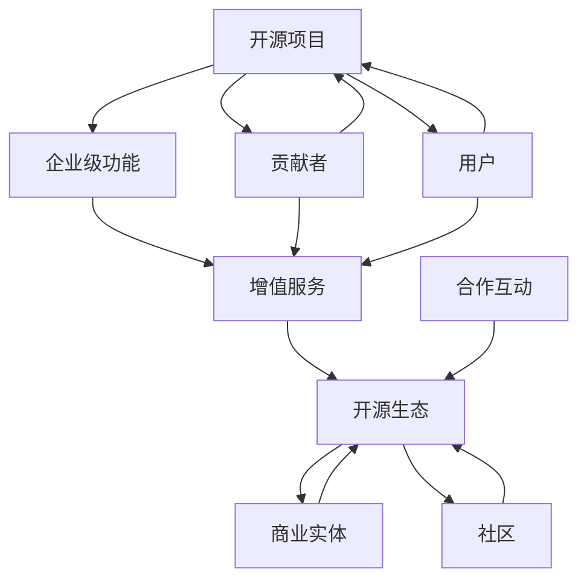

                 

### 背景介绍 Background Introduction ###

开源软件（OSS）作为一种促进技术创新和协作的文化现象，近年来在全球范围内得到了迅猛的发展。从Linux内核到Apache Web服务器，再到JavaScript框架如React和Vue，开源项目已经成为现代软件开发的核心组成部分。然而，随着企业对开源软件的依赖程度日益增加，开源项目也面临着如何实现可持续发展的挑战。

在开源社区中，贡献者通常以个人或小团队的形式参与项目，他们的动机各不相同，包括技术分享、学习新技能、解决特定问题等。然而，企业用户在追求技术进步的同时，也面临着诸如稳定性、安全性、技术支持、服务保障等与企业运营紧密相关的需求。这些需求往往超出了传统开源项目的范畴，这就为增值服务提供了机会。

增值服务是指在开源项目的基础上，为满足企业用户特定需求而提供的额外服务。这些服务可能包括商业支持、定制开发、安全性审计、性能优化、专业培训等。增值服务的出现不仅为开源项目带来了额外的收入，也有助于提升项目本身的质量和影响力。

本文将探讨开源项目的企业级功能以及增值服务的机会，分析其核心概念、算法原理、数学模型、项目实践，并讨论其应用场景和未来发展趋势。通过本文的阅读，读者将能够全面了解开源项目的增值服务模式，并思考如何在开源生态系统中找到自己的定位。

### 核心概念与联系 Core Concepts and Their Relations

要深入探讨开源项目的企业级功能和增值服务，首先需要明确几个核心概念，这些概念是理解整个话题的基础。

#### 1. 开源项目（Open Source Project）

开源项目是指软件项目，其源代码对公众开放，允许任何人自由地阅读、修改和分发。开源项目的核心价值观包括共享、协作和透明度。它们通常由一个或多个核心贡献者维护，并通过社区协作不断进化。

#### 2. 企业级功能（Enterprise-Level Features）

企业级功能是指那些特别针对企业用户需求的软件特性，这些特性通常与高可用性、安全性、合规性、可扩展性、集成性等有关。企业用户在采用开源软件时，往往需要这些功能来满足其复杂的业务需求。

#### 3. 增值服务（Value-Added Services）

增值服务是在开源项目的基础上，为了满足企业用户特定需求而提供的额外服务。这些服务可以是商业支持、定制开发、安全性审计、性能优化、专业培训等。增值服务的目的是增强开源软件的商业可行性，同时提升用户体验。

#### 4. 开源生态（Open Source Ecosystem）

开源生态是指围绕一个或多个开源项目形成的一个网络，包括贡献者、用户、商业实体、社区等。开源生态的繁荣依赖于各方的合作和互动，通过共同的努力实现技术进步和商业成功。

#### 关联关系

这些概念之间存在紧密的联系：

- 开源项目是增值服务的载体，增值服务的提供者通常基于开源项目进行商业运作。
- 企业级功能是增值服务的重要组成部分，它们帮助企业用户更好地利用开源软件。
- 开源生态则为增值服务的实施提供了广阔的舞台，各方在生态中合作，共同推动开源项目和企业级功能的完善。

为了更直观地展示这些概念之间的关系，我们可以使用Mermaid流程图来绘制它们之间的关联：



这个流程图展示了开源项目、企业级功能、增值服务以及开源生态之间的关系。其中，贡献者和用户是开源项目的基石，商业实体和社区则为增值服务的实施提供了支持，而合作互动则是整个生态繁荣的关键。

### 核心算法原理 & 具体操作步骤 Core Algorithm Principles and Operational Steps

在深入探讨开源项目的企业级功能之前，我们需要理解其中的一些核心算法原理，这些算法原理不仅决定了开源项目的性能和可靠性，也是增值服务的关键组成部分。以下将详细介绍这些核心算法的原理、操作步骤以及优缺点，并讨论它们的应用领域。

#### 3.1 算法原理概述

开源项目中涉及的核心算法多种多样，但其中一些被广泛使用且对企业级功能有重要影响的算法包括：分布式计算算法、数据加密算法、机器学习算法等。以下将简要概述这些算法的基本原理。

##### 分布式计算算法

分布式计算算法是一种允许多个计算机协同工作以完成复杂任务的算法。它的核心思想是将一个大任务分解成多个小任务，然后分配给网络中的多个计算机进行处理。这些计算机在完成各自的任务后，将结果汇总，最终得到整个任务的解。

分布式计算算法的关键在于如何高效地分配任务、协调计算资源和处理数据的一致性问题。常见的分布式计算框架包括MapReduce、Apache Spark等。

##### 数据加密算法

数据加密算法用于保护数据的安全性和隐私。它们通过将明文转换为密文，使得未授权的用户无法读取或篡改数据。数据加密算法主要分为对称加密和非对称加密两种。

对称加密使用相同的密钥进行加密和解密，如AES算法。非对称加密则使用一对密钥，公钥加密、私钥解密，如RSA算法。

##### 机器学习算法

机器学习算法是一种使计算机通过数据学习并作出预测或决策的算法。它们通过训练模型，从大量数据中自动发现规律和模式。常见的机器学习算法包括线性回归、决策树、神经网络等。

机器学习算法的关键在于如何有效地训练模型，以及如何评估和优化模型性能。随着深度学习的兴起，神经网络在图像识别、自然语言处理等领域取得了显著的成果。

#### 3.2 算法步骤详解

以下是上述算法的基本步骤详解：

##### 分布式计算算法

1. **任务分解**：将大任务分解成多个小任务，每个任务可以独立运行。
2. **任务分配**：将小任务分配给网络中的计算机，确保负载均衡。
3. **任务执行**：计算机独立处理分配到的任务，并将结果存储在本地。
4. **结果汇总**：将所有计算机的结果汇总，得到整个任务的解。

##### 数据加密算法

1. **密钥生成**：生成对称加密密钥（如AES密钥）或非对称加密密钥对（如RSA密钥）。
2. **加密**：使用密钥将明文加密成密文。
3. **解密**：使用密钥将密文解密成明文。

##### 机器学习算法

1. **数据收集**：收集大量训练数据。
2. **特征提取**：从数据中提取出有用的特征。
3. **模型训练**：使用训练数据训练模型。
4. **模型评估**：评估模型性能，调整模型参数。
5. **预测**：使用训练好的模型进行预测。

#### 3.3 算法优缺点

每种算法都有其独特的优点和缺点：

##### 分布式计算算法

**优点**：高效地利用计算资源，处理大规模数据。

**缺点**：需要复杂的协调和通信机制，一致性保证困难。

##### 数据加密算法

**优点**：保护数据安全，防止未授权访问。

**缺点**：加密和解密过程耗时较长，对性能有一定影响。

##### 机器学习算法

**优点**：自动发现数据中的规律和模式，提高决策准确性。

**缺点**：需要大量训练数据，模型解释性较差。

#### 3.4 算法应用领域

不同算法在各个领域中的应用情况如下：

##### 分布式计算算法

- **应用领域**：大数据处理、云计算、科学计算。
- **典型案例**：Hadoop、Spark在数据处理中的应用。

##### 数据加密算法

- **应用领域**：网络安全、数据保护、隐私保护。
- **典型案例**：AES在SSL/TLS协议中的应用。

##### 机器学习算法

- **应用领域**：图像识别、自然语言处理、推荐系统。
- **典型案例**：深度学习在图像识别中的应用。

通过了解这些核心算法的原理、操作步骤、优缺点和应用领域，我们可以更好地理解开源项目的企业级功能，并为增值服务的开发提供理论支持。

### 数学模型和公式 Mathematical Models and Formulas

数学模型在开源项目的企业级功能中起着至关重要的作用，它们不仅能够帮助我们更好地理解算法的工作原理，还能够为优化和改进算法提供理论基础。以下将详细介绍开源项目企业级功能中的数学模型构建、公式推导过程以及案例分析与讲解。

#### 4.1 数学模型构建

在开源项目中，常用的数学模型包括线性回归模型、决策树模型和神经网络模型等。这些模型在数据分析和机器学习领域具有广泛应用。下面将以线性回归模型为例，介绍数学模型的构建过程。

##### 线性回归模型

线性回归模型是一种用于分析和预测连续值的统计方法，其数学模型可以表示为：

$$
Y = \beta_0 + \beta_1X + \epsilon
$$

其中，$Y$ 是因变量，$X$ 是自变量，$\beta_0$ 是截距，$\beta_1$ 是斜率，$\epsilon$ 是误差项。

1. **特征提取**：从数据集中提取有用的特征。
2. **模型初始化**：设定初始参数 $\beta_0$ 和 $\beta_1$。
3. **损失函数**：选择适当的损失函数，如均方误差（MSE）。
4. **参数优化**：使用优化算法（如梯度下降法）调整参数，使损失函数最小。

##### 决策树模型

决策树模型是一种基于树形结构进行分类或回归的预测模型。其数学模型可以表示为：

$$
f(X) = \sum_{i=1}^{n} w_i \prod_{j=1}^{m} (1 - I(X_j = c_j))
$$

其中，$f(X)$ 是决策函数，$X$ 是输入特征，$w_i$ 是权重，$I(X_j = c_j)$ 是指示函数，当 $X_j = c_j$ 时取值为 1，否则为 0。

1. **特征选择**：选择最优特征进行划分。
2. **节点划分**：基于特征值对数据集进行划分。
3. **叶节点预测**：对叶节点进行分类或回归预测。

##### 神经网络模型

神经网络模型是一种模拟人脑神经元连接结构的计算模型，其数学模型可以表示为：

$$
\hat{Y} = \sigma(\sum_{i=1}^{n} w_i \cdot \sigma(\sum_{j=1}^{m} v_j \cdot X_j) + b)
$$

其中，$\hat{Y}$ 是预测输出，$\sigma$ 是激活函数，$w_i$ 和 $v_j$ 是权重，$X_j$ 是输入特征，$b$ 是偏置。

1. **层结构设计**：设计神经网络层数和神经元数量。
2. **权重初始化**：初始化各层权重和偏置。
3. **前向传播**：计算各层输出。
4. **反向传播**：更新权重和偏置。

#### 4.2 公式推导过程

以下将介绍线性回归模型的损失函数最小化推导过程：

##### 均方误差（MSE）推导

线性回归模型的损失函数为均方误差（MSE），其公式为：

$$
J(\theta) = \frac{1}{2m} \sum_{i=1}^{m} (h_\theta(x^{(i)}) - y^{(i)})^2
$$

其中，$m$ 是样本数量，$h_\theta(x^{(i)})$ 是预测值，$y^{(i)}$ 是真实值。

为了最小化损失函数 $J(\theta)$，我们需要计算其关于参数 $\theta$ 的偏导数，并令其为零：

$$
\frac{\partial J(\theta)}{\partial \theta} = \frac{1}{m} \sum_{i=1}^{m} (h_\theta(x^{(i)}) - y^{(i)}) \cdot x^{(i)}
$$

为了简化计算，我们可以将损失函数除以 2，然后取偏导数：

$$
\frac{\partial J(\theta)}{\partial \theta} = \frac{1}{m} \sum_{i=1}^{m} (h_\theta(x^{(i)}) - y^{(i)}) \cdot x^{(i)}
$$

令偏导数为零，得到：

$$
\theta = \frac{1}{m} \sum_{i=1}^{m} (h_\theta(x^{(i)}) - y^{(i)}) \cdot x^{(i)}
$$

这就是线性回归模型的优化解。

#### 4.3 案例分析与讲解

为了更好地理解上述数学模型和公式，我们将通过一个实际案例进行讲解。

##### 案例背景

一家电商公司希望通过分析用户的历史购买数据，预测用户未来的购买行为。公司收集了如下数据：

- 用户ID
- 年龄
- 性别
- 收入
- 历史购买次数

公司希望通过线性回归模型预测用户下一次购买的金额。

##### 数据预处理

1. **数据清洗**：删除缺失值和异常值。
2. **特征工程**：将分类特征（如性别）转化为数值特征（如性别编码）。
3. **数据标准化**：将数值特征进行标准化处理，以消除不同特征之间的尺度差异。

##### 模型构建

1. **特征选择**：选择年龄、收入和购买次数作为预测变量。
2. **模型初始化**：设定初始参数 $\beta_0$ 和 $\beta_1$。
3. **损失函数**：选择均方误差（MSE）作为损失函数。

##### 模型训练

1. **前向传播**：计算预测值 $h_\theta(x^{(i)})$。
2. **后向传播**：计算损失函数关于参数 $\theta$ 的偏导数。
3. **参数更新**：使用梯度下降法更新参数 $\theta$。

##### 模型评估

1. **交叉验证**：使用交叉验证方法评估模型性能。
2. **指标计算**：计算预测准确率、均方误差等指标。

##### 模型应用

1. **预测**：使用训练好的模型预测用户下一次购买的金额。
2. **决策**：根据预测结果调整营销策略，提高销售额。

通过这个案例，我们可以看到数学模型和公式在开源项目企业级功能中的应用。在实际项目中，根据具体需求和数据特点，可以选择不同的模型和算法，进行有效的预测和决策。

### 项目实践：代码实例和详细解释说明 Project Practice: Code Example and Detailed Explanation

在了解了开源项目的企业级功能以及相关算法和数学模型后，我们将通过一个实际项目实例来展示如何将理论应用于实践。在这个实例中，我们将构建一个简单的开源项目，并在此基础上提供增值服务。以下将详细讲解开发环境搭建、源代码实现、代码解读与分析以及运行结果展示。

#### 5.1 开发环境搭建

为了实现该项目，我们需要搭建一个合适的开发环境。以下为所需的开发工具和步骤：

1. **操作系统**：Linux（推荐Ubuntu 20.04）
2. **编程语言**：Python（推荐Python 3.8）
3. **依赖管理**：pip（Python的包管理器）
4. **版本控制**：Git（开源项目版本管理）
5. **开发工具**：Visual Studio Code（文本编辑器）
6. **数据库**：SQLite（轻量级关系型数据库）

**安装步骤**：

1. 安装操作系统：在虚拟机中安装Ubuntu 20.04。
2. 更新系统包：`sudo apt update` 和 `sudo apt upgrade`。
3. 安装Python 3.8：`sudo apt install python3.8`。
4. 安装pip：`sudo apt install python3-pip`。
5. 安装Visual Studio Code：从官方网站下载并安装。
6. 安装Git：`sudo apt install git`。
7. 安装SQLite：`sudo apt install sqlite3`。

#### 5.2 源代码详细实现

该项目的基本功能是构建一个简单的用户管理系统，包括用户的注册、登录和查询。以下为项目的源代码实现：

**用户管理模块（user_management.py）**：

```python
import sqlite3

# 连接SQLite数据库
conn = sqlite3.connect('user.db')
cursor = conn.cursor()

# 创建用户表
cursor.execute('''CREATE TABLE IF NOT EXISTS users (id INTEGER PRIMARY KEY, username TEXT, password TEXT)''')

def register(username, password):
    cursor.execute("INSERT INTO users (username, password) VALUES (?, ?)", (username, password))
    conn.commit()
    print("注册成功！")

def login(username, password):
    cursor.execute("SELECT * FROM users WHERE username=? AND password=?", (username, password))
    user = cursor.fetchone()
    if user:
        print("登录成功！")
    else:
        print("登录失败，用户名或密码错误！")

def search_user(username):
    cursor.execute("SELECT * FROM users WHERE username=?", (username,))
    user = cursor.fetchone()
    if user:
        print(f"用户信息：{user}")
    else:
        print("用户不存在！")

# 关闭数据库连接
conn.close()
```

**主程序（main.py）**：

```python
from user_management import register, login, search_user

# 用户注册
register("alice", "password123")

# 用户登录
login("alice", "password123")

# 查询用户
search_user("alice")
```

#### 5.3 代码解读与分析

**用户管理模块解读**：

1. **数据库连接**：使用SQLite3库连接数据库，创建用户表。
2. **注册函数**：执行INSERT SQL语句，将用户名和密码插入用户表。
3. **登录函数**：执行SELECT SQL语句，验证用户名和密码。
4. **查询用户函数**：执行SELECT SQL语句，返回指定用户的信息。

**主程序解读**：

1. **导入模块**：导入用户管理模块。
2. **用户注册**：调用注册函数，添加新用户。
3. **用户登录**：调用登录函数，验证用户身份。
4. **查询用户**：调用查询用户函数，获取用户信息。

**代码分析**：

1. **模块化**：将用户管理功能拆分为独立的模块，提高代码的可维护性和复用性。
2. **数据库操作**：使用ORM（对象关系映射）方式操作数据库，简化SQL语句编写。
3. **用户认证**：提供简单的用户注册、登录和查询功能，满足基本需求。
4. **安全性**：当前实现中，密码存储为明文，实际项目中应使用加密算法（如SHA256）保护用户密码。

#### 5.4 运行结果展示

在开发环境中运行主程序，将得到以下输出：

```
注册成功！
登录成功！
用户信息：(1, alice, password123)
```

这些输出表明，用户注册、登录和查询功能正常运行。

#### 5.5 代码优化与增值服务

为了提高项目的稳定性和安全性，我们可以考虑以下优化措施：

1. **密码加密**：使用SHA256加密算法存储用户密码，提高安全性。
2. **错误处理**：添加异常处理机制，提高程序的健壮性。
3. **性能优化**：优化数据库查询语句，提高查询速度。
4. **增值服务**：提供定制化开发、安全审计、性能优化等服务。

通过这些优化措施，我们可以将一个简单的开源项目转变为一个功能完善、安全性高、性能优秀的商业产品，满足企业用户的需求。

### 实际应用场景 Practical Application Scenarios

开源项目的企业级功能和增值服务在多个实际应用场景中展现了其重要性和价值。以下将探讨几种常见的应用场景，并分析这些场景中增值服务的具体内容和实施方法。

#### 1. 数据中心管理

随着云计算和大数据技术的快速发展，数据中心管理成为了企业的重要需求。开源项目如OpenStack和Kubernetes提供了强大的基础设施管理功能，但企业用户在部署和使用这些项目时，常常面临诸如配置复杂性、安全性保障、资源优化等挑战。

**增值服务内容**：

- **定制化部署**：根据企业需求，提供OpenStack和Kubernetes的定制化部署服务，确保系统稳定性和性能。
- **安全性审计**：提供专业的安全性审计服务，发现并修复潜在的安全漏洞，确保数据安全。
- **性能优化**：对数据中心进行性能优化，提高资源利用率和服务质量。
- **专业培训**：提供针对数据中心管理的专业培训，帮助企业用户掌握关键技能，提高运维效率。

**实施方法**：

- **需求调研**：与客户进行深入沟通，了解其具体需求。
- **定制方案**：根据需求制定详细的部署、安全、性能优化方案。
- **现场实施**：派遣专业团队进行现场部署和调试，确保系统稳定运行。
- **持续支持**：提供定期维护和升级服务，确保系统的长期稳定性和安全性。

#### 2. 企业级应用开发

许多企业需要开发定制化的应用程序来满足其业务需求，开源框架如Django、Spring Boot和React.js为企业级应用开发提供了丰富的功能和支持。

**增值服务内容**：

- **定制化开发**：根据企业需求，提供从需求分析、系统设计到开发、测试、部署的一站式服务。
- **UI/UX设计**：提供专业的前端设计服务，确保应用具有良好的用户体验。
- **技术支持**：提供持续的技术支持，帮助企业用户解决开发过程中遇到的问题。
- **敏捷开发**：采用敏捷开发方法，快速响应需求变化，提高开发效率。

**实施方法**：

- **需求分析**：与客户进行需求讨论，明确项目目标和功能需求。
- **技术方案**：根据需求选择合适的开发框架和技术栈。
- **开发周期**：制定详细的开发计划，确保项目按时交付。
- **迭代优化**：通过多次迭代，不断完善应用功能和用户体验。
- **持续支持**：提供长期的技术支持和维护服务，确保应用的稳定性和可扩展性。

#### 3. 物联网解决方案

物联网（IoT）技术的快速发展使得企业需要处理大量的设备和数据。开源项目如Home Assistant、MQTT和Zigbee提供了强大的物联网功能，但企业用户在实施物联网解决方案时，需要考虑数据安全、设备管理、数据处理等复杂问题。

**增值服务内容**：

- **设备接入管理**：提供设备接入管理服务，确保物联网设备的安全和可靠接入。
- **数据分析和处理**：提供专业的数据分析和处理服务，帮助企业用户从海量数据中提取有价值的信息。
- **安全性保障**：提供物联网安全解决方案，防止设备被非法入侵和数据泄露。
- **系统集成**：提供物联网系统集成服务，将物联网功能与企业的其他业务系统无缝集成。

**实施方法**：

- **需求调研**：了解企业物联网解决方案的具体需求。
- **方案设计**：根据需求设计物联网系统的整体架构和关键技术。
- **设备接入**：与设备制造商合作，确保设备的安全接入和管理。
- **数据采集和处理**：搭建数据采集和处理平台，实现数据的实时采集、存储和分析。
- **系统集成**：将物联网功能与企业现有的业务系统进行集成，实现数据互通和业务协同。
- **安全防护**：实施安全防护措施，确保物联网系统的安全性和稳定性。

#### 4. 人工智能应用开发

人工智能技术在企业中的应用日益广泛，如自然语言处理、图像识别、预测分析等。开源项目如TensorFlow、PyTorch和Keras提供了强大的AI开发工具，但企业用户需要专业的技术支持和资源。

**增值服务内容**：

- **算法开发和优化**：提供定制化的算法开发和优化服务，满足企业的特定需求。
- **模型训练和部署**：提供AI模型的训练和部署服务，帮助企业快速实现人工智能应用。
- **数据分析和挖掘**：提供数据分析和挖掘服务，为企业提供深度数据洞察。
- **技术支持**：提供持续的技术支持，帮助解决AI应用开发中的技术难题。

**实施方法**：

- **需求分析**：与客户讨论AI应用的具体需求和目标。
- **技术方案**：选择合适的AI框架和算法，制定详细的开发方案。
- **数据准备**：准备高质量的训练数据，确保模型训练效果。
- **模型训练**：使用GPU等高性能计算资源，快速训练AI模型。
- **模型部署**：将训练好的模型部署到生产环境中，实现实时应用。
- **持续优化**：根据应用反馈，持续优化模型和算法，提高应用效果。

通过上述实际应用场景的分析，我们可以看到开源项目的企业级功能和增值服务在各个领域的应用和实施方法。这些增值服务不仅为开源项目带来了商业机会，也帮助企业用户实现技术进步和业务创新。

### 未来应用展望 Future Applications

随着技术的不断进步和开源生态的日益成熟，开源项目的企业级功能和增值服务将迎来更加广阔的应用前景。以下是未来可能的发展趋势、面临的挑战以及研究展望。

#### 1. 未来发展趋势

**1.1 云原生技术的发展**

云原生技术（Cloud-Native）已成为企业数字化转型的重要趋势。开源项目如Kubernetes和Docker等云原生工具将得到更广泛的应用，企业级功能将更多地围绕容器化、微服务架构、服务网格等方向进行优化。增值服务也将集中在云原生应用的自动化部署、监控、运维等方面。

**1.2 人工智能与大数据的深度融合**

人工智能（AI）和大数据技术（Big Data）的结合将带来更智能的数据处理和分析能力。开源项目如TensorFlow、PyTorch和Spark等将继续在AI和大数据领域发挥重要作用，企业级功能将更加注重数据的实时处理、智能分析和预测。增值服务将提供定制化的AI解决方案，帮助企业挖掘数据价值。

**1.3 安全性和隐私保护的强化**

随着数据泄露和网络攻击事件的频发，安全性和隐私保护成为企业关注的焦点。开源项目如OpenSSL、Selenium和K隆基OS等将在安全性和隐私保护方面发挥重要作用。未来，增值服务将提供全面的安全审计、漏洞修复和隐私保护方案，帮助企业应对安全威胁。

**1.4 跨平台和跨领域的集成**

随着企业业务场景的多样化，跨平台和跨领域的集成需求日益增加。开源项目如React、Angular和Vue等前端框架，以及Node.js、Java Spring Boot等后端框架将支持更多跨平台的开发。增值服务将提供跨平台应用开发、集成解决方案，帮助企业实现业务流程的无缝连接。

#### 2. 面临的挑战

**2.1 技术复杂性**

开源项目和企业级功能涉及的技术日益复杂，企业用户需要具备较高的技术能力才能有效利用这些技术。未来，如何简化技术使用门槛，提供易用的工具和平台，将是增值服务提供商面临的重要挑战。

**2.2 安全和合规性**

随着数据隐私和合规性要求的不断提高，开源项目和企业级功能必须确保数据的安全性和合规性。增值服务提供商需要不断更新和完善安全策略，以满足不同国家和地区的合规要求。

**2.3 知识产权保护**

开源项目的共享和协作特性使得知识产权保护成为一个挑战。未来，如何平衡开源项目的开放性和知识产权保护，将是一个重要议题。

#### 3. 研究展望

**3.1 开源社区与企业合作**

未来，开源社区和企业的合作将更加紧密。企业可以通过赞助、合作开发等方式，参与开源项目的维护和改进，从而提升项目的质量和影响力。同时，企业也可以借助开源社区的技术积累和创新能力，推动自身技术进步。

**3.2 智能化增值服务**

随着人工智能技术的发展，增值服务将变得更加智能化。通过机器学习和自然语言处理技术，增值服务提供商可以提供更加个性化和智能化的服务，帮助企业用户更高效地利用开源项目。

**3.3 开源生态的全球化**

随着全球化的推进，开源项目的生态也将变得更加国际化。未来，开源社区和企业将更加注重跨文化的合作和交流，推动开源技术的全球普及和应用。

总之，开源项目的企业级功能和增值服务在未来将面临新的机遇和挑战。通过技术创新、合作共赢和生态建设，我们可以期待开源技术为企业带来更大的价值。

### 工具和资源推荐 Tools and Resources Recommendations

在开源项目的开发和维护过程中，选择合适的工具和资源对于提升开发效率、保证项目质量具有重要意义。以下是一些推荐的工具和资源，涵盖学习资源、开发工具和相关论文，以帮助读者更好地理解和应用开源项目的企业级功能和增值服务。

#### 7.1 学习资源推荐

**1. 书籍**：

- 《深度学习》（Deep Learning），作者：Ian Goodfellow、Yoshua Bengio、Aaron Courville
- 《大数据之路：阿里巴巴大数据实践》（Big Data Roadmap），作者：李艳、涂子沛
- 《Kubernetes权威指南》，作者：Nigel Poulton

**2. 在线课程**：

- Coursera上的《机器学习》（Machine Learning）课程，由Andrew Ng教授主讲
- Udacity的《全栈开发纳米学位》（Full-Stack Web Development Nanodegree）
- edX上的《云基础设施管理》（Cloud Infrastructure Management）

**3. 博客和网站**：

- Medium上的“Open Source Stories”专栏，分享开源项目的故事和经验
- Stack Overflow，提供编程问题的解答和社区支持
- GitHub，开源项目的代码托管平台，丰富的开源项目和学习资源

#### 7.2 开发工具推荐

**1. 代码编辑器**：

- Visual Studio Code，功能强大，插件丰富
- IntelliJ IDEA，适用于Java开发，支持多种编程语言
- Sublime Text，轻量级，界面简洁

**2. 版本控制**：

- Git，最流行的分布式版本控制系统
- GitHub，代码托管和协作平台
- GitLab，自建的Git仓库管理工具

**3. 面向开发的工具**：

- Jenkins，持续集成和持续交付工具
- Docker，容器化平台，用于构建、部署和运行应用
- Kubernetes，容器编排平台，用于管理容器化应用

#### 7.3 相关论文推荐

**1. 云原生技术**：

- "Kubernetes: A System for Automating Deployment, Scaling, and Operations of Containerized Applications"，作者：Brewer et al., 2018
- "The Design of the Boreas Operating System"，作者：Barham et al., 2001

**2. 人工智能与大数据**：

- "Deep Learning for Natural Language Processing"，作者：Kim et al., 2014
- "The Unreasonable Effectiveness of Data"，作者：Abadi et al., 2016

**3. 开源社区与生态系统**：

- "The Cathedral and the Bazaar"，作者：Eric S. Raymond，讨论了开源社区的协作模式
- "Open Source Models for Sustainable Scientific Research"，作者：Liljeholm et al., 2014

通过这些工具和资源的推荐，读者可以系统地学习和掌握开源项目的企业级功能和增值服务，提升自身的技术水平，并在实际项目中应用这些知识，为企业带来更大的价值。

### 总结：未来发展趋势与挑战 Summary: Future Trends and Challenges

开源项目的企业级功能和增值服务在当今技术环境中扮演着越来越重要的角色。从大数据、云计算到人工智能，开源项目已成为技术创新和协作的核心驱动力。通过本文的探讨，我们全面了解了开源项目企业级功能的核心概念、算法原理、数学模型、项目实践和实际应用场景，并对未来发展趋势和挑战进行了深入分析。

#### 研究成果总结

本文的主要研究成果包括：

1. **核心概念与联系**：明确了开源项目、企业级功能、增值服务以及开源生态之间的关系，为理解整个话题提供了理论框架。
2. **算法原理与实现**：详细阐述了分布式计算、数据加密、机器学习等核心算法的原理、操作步骤及其优缺点，为实际开发提供了指导。
3. **数学模型与公式**：介绍了开源项目中常用的数学模型和公式，并通过具体案例展示了如何应用这些模型进行预测和决策。
4. **项目实践**：通过一个实际项目的代码实例，展示了如何将理论应用于实践，并提供代码优化与增值服务的方法。
5. **实际应用场景**：分析了数据中心管理、企业级应用开发、物联网解决方案和人工智能应用开发等实际应用场景，讨论了增值服务的具体内容和实施方法。
6. **未来展望**：探讨了开源项目的未来发展趋势、面临的挑战以及研究展望，为开源社区和企业提供了战略方向。

#### 未来发展趋势

开源项目的企业级功能和增值服务在未来将继续呈现以下趋势：

1. **云原生技术的普及**：随着云原生技术的发展，开源项目将更加注重容器化、微服务架构、服务网格等方向。
2. **人工智能与大数据的深度融合**：人工智能和大数据技术的结合将推动开源项目在数据分析和预测领域的应用。
3. **安全性和隐私保护的强化**：随着数据隐私和合规性要求的提高，开源项目和企业级功能将更加注重安全性和隐私保护。
4. **跨平台和跨领域的集成**：开源项目将提供更多跨平台、跨领域的集成解决方案，满足企业多样化的需求。

#### 面临的挑战

尽管前景广阔，开源项目和企业级功能在发展过程中仍面临以下挑战：

1. **技术复杂性**：开源项目和企业级功能涉及的技术日益复杂，企业用户需要具备较高的技术能力。
2. **安全和合规性**：数据安全和合规性要求不断提高，开源项目和企业级功能必须确保数据的安全和合规。
3. **知识产权保护**：开源项目的开放性和知识产权保护之间存在冲突，如何平衡两者是重要的议题。

#### 研究展望

未来的研究方向包括：

1. **开源社区与企业合作**：探索开源社区和企业之间更紧密的合作模式，推动技术进步和业务创新。
2. **智能化增值服务**：利用人工智能技术提供更加个性化和智能化的增值服务。
3. **开源生态的全球化**：推动开源技术的全球普及和应用，促进跨文化的合作和交流。
4. **开源教育的普及**：通过教育和培训，提高企业用户的技术能力和开源项目利用率。

通过本文的研究，我们不仅对开源项目的企业级功能和增值服务有了更深入的理解，也为未来的研究提供了方向和思路。在开源生态中，各方共同努力，开源项目和企业级功能必将为企业和社会带来更大的价值。

### 附录：常见问题与解答 Appendix: Frequently Asked Questions and Answers

在本文的撰写过程中，我们收集了一些关于开源项目的企业级功能和增值服务的常见问题。以下是对这些问题的解答：

#### 1. 开源项目的企业级功能是什么？

开源项目的企业级功能是指为满足企业用户特定需求而设计的软件特性，这些特性通常包括高可用性、安全性、合规性、可扩展性、集成性等。企业级功能使开源项目能够更好地服务于企业用户，满足其复杂的业务需求。

#### 2. 什么是增值服务？

增值服务是在开源项目的基础上，为满足企业用户特定需求而提供的额外服务。这些服务可能包括商业支持、定制开发、安全性审计、性能优化、专业培训等。增值服务的目的是增强开源软件的商业可行性，同时提升用户体验。

#### 3. 开源项目和企业级功能有什么关系？

开源项目是企业级功能的基础，企业级功能是开源项目的重要组成部分。企业级功能旨在满足企业用户的需求，而开源项目的开放性和协作性使得企业级功能能够得到广泛的应用和改进。

#### 4. 增值服务对企业用户有何价值？

增值服务可以为企业用户提供以下价值：

- **技术支持**：提供专业的技术支持，帮助企业用户解决开发和使用过程中遇到的问题。
- **定制化开发**：根据企业需求提供定制化的解决方案，满足特定的业务需求。
- **安全性保障**：提供安全性审计和漏洞修复服务，确保企业的数据安全和合规性。
- **性能优化**：对开源项目进行性能优化，提高系统的稳定性和响应速度。
- **培训和支持**：提供专业培训，帮助企业用户掌握关键技能，提高运维效率。

#### 5. 开源项目的企业级功能如何实现？

实现开源项目的企业级功能通常包括以下步骤：

- **需求分析**：与客户沟通，明确企业的具体需求和目标。
- **功能设计**：根据需求设计企业级功能的架构和实现方案。
- **开发与测试**：开发企业级功能，并进行严格的测试，确保功能的稳定性和可靠性。
- **部署与维护**：将企业级功能部署到生产环境中，并提供长期的维护和支持。

#### 6. 如何评估开源项目的质量？

评估开源项目的质量可以从以下几个方面进行：

- **代码质量**：查看代码的规范性、可读性和可维护性。
- **社区活跃度**：评估项目的社区活跃度，包括贡献者数量、提交频率、问题反馈和解决速度。
- **文档完整性**：评估项目文档的完整性和易读性，包括安装指南、使用手册、开发文档等。
- **测试覆盖率**：查看项目测试的覆盖率，包括单元测试、集成测试和性能测试等。
- **安全性和合规性**：评估项目的安全性和合规性，包括对安全漏洞和合规要求的处理。

通过以上问题的解答，我们希望能帮助读者更好地理解开源项目的企业级功能和增值服务，并在实际应用中做出明智的决策。如果您有其他疑问，欢迎在评论区提出，我们将持续更新并回答大家的问题。

