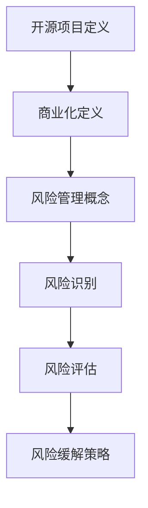
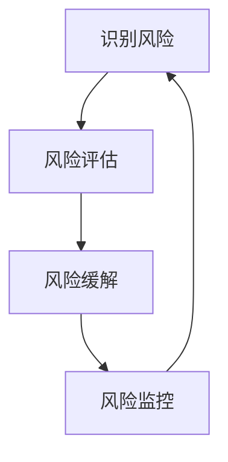

                 

**关键词：** 开源项目，商业化，风险识别，风险缓解，策略。

**摘要：** 本文深入探讨了开源项目的商业化过程及其伴随的风险。通过分析这些风险，提出了具体的识别和缓解策略，以帮助开源项目在商业化的道路上更加稳健。

## 1. 背景介绍

开源项目，作为一种开放共享、合作开发的方式，已经深深植根于当今的软件开发领域。它们不仅提供了高质量、可靠的代码，还促进了技术交流和知识共享。然而，随着开源项目在商业领域的广泛应用，商业化过程带来的风险也日益凸显。

开源项目的商业化风险主要来自于多个方面。首先，商业化可能会导致开源项目的核心价值受到侵蚀。例如，商业公司可能会利用开源项目获取市场份额，而不愿意投入资源进行长期维护和改进。其次，商业化可能会导致社区的参与度下降，社区活力减弱。最后，商业化还可能引发法律和道德风险，例如版权问题、专利纠纷等。

本文旨在深入探讨开源项目的商业化风险，并提出一系列识别和缓解策略，以帮助开源项目在商业化过程中减少风险，实现可持续发展。

## 2. 核心概念与联系

### 2.1 开源项目的定义

开源项目通常指的是那些遵循一定开源许可协议的软件项目。这些协议确保了项目的代码可以自由地被任何人访问、修改和分发。常见的开源许可协议包括GPL（GNU通用公共许可证）、BSD许可证和Apache许可证等。

### 2.2 商业化的定义

商业化是指将某种产品或服务转化为商业活动，通过市场运作获得经济利益的过程。在开源项目中，商业化通常涉及将开源项目作为商业产品或服务进行推广、销售和运营。

### 2.3 风险管理的概念

风险管理是指识别、评估、处理和控制潜在风险的过程。在开源项目的商业化过程中，风险管理是至关重要的，因为它有助于预见并应对可能出现的各种挑战。

### 2.4 Mermaid 流程图



### 2.5 风险管理流程图（Mermaid 流程节点中不要有括号、逗号等特殊字符）



## 3. 核心算法原理 & 具体操作步骤

### 3.1 算法原理概述

在开源项目的商业化过程中，风险识别和缓解策略是一种关键算法。这个算法的核心是首先识别可能的风险点，然后评估这些风险点的影响，并采取相应的缓解措施。

### 3.2 算法步骤详解

1. **风险识别**：通过文献调研、专家访谈、历史数据分析等方法，识别开源项目商业化过程中可能面临的风险。
2. **风险评估**：使用定性或定量方法，对识别出的风险点进行评估，确定其发生的可能性及其对项目的影响程度。
3. **风险缓解**：根据风险评估结果，制定相应的缓解策略，例如风险转移、风险规避、风险减轻等。
4. **风险监控**：在商业化过程中，持续监控风险点的变化，确保缓解策略的有效性。

### 3.3 算法优缺点

**优点：**
- 系统性：通过明确的步骤，对风险进行全面的识别、评估和缓解，确保项目的稳健性。
- 适应性：可以根据不同项目特点，灵活调整风险识别和缓解策略。

**缺点：**
- 复杂性：风险识别和缓解过程需要大量的时间和资源。
- 不确定性：由于开源项目的复杂性，某些风险可能难以准确预测。

### 3.4 算法应用领域

开源项目的商业化风险识别和缓解策略适用于各类开源项目，尤其是在涉及商业利益的开源项目商业化过程中，具有重要意义。

## 4. 数学模型和公式 & 详细讲解 & 举例说明

### 4.1 数学模型构建

为了更科学地评估开源项目的商业化风险，我们可以构建以下数学模型：

$$
R = f(L, P, M)
$$

其中，$R$ 表示风险水平，$L$ 表示法律风险，$P$ 表示市场风险，$M$ 表示管理风险。

### 4.2 公式推导过程

假设法律风险 $L$ 包括版权风险、专利纠纷和许可协议问题，市场风险 $P$ 包括市场需求和竞争压力，管理风险 $M$ 包括项目管理、团队协作和资源分配。我们可以通过以下方式推导公式：

$$
L = f(C, P, L)
$$
$$
P = f(D, C)
$$
$$
M = f(P, T, R)
$$

其中，$C$ 表示版权风险，$P$ 表示专利纠纷，$L$ 表示许可协议问题，$D$ 表示市场需求，$C$ 表示竞争压力，$P$ 表示项目管理，$T$ 表示团队协作，$R$ 表示资源分配。

### 4.3 案例分析与讲解

假设某开源项目涉及版权风险、专利纠纷和许可协议问题，市场需求较高，但竞争压力较大。通过上述公式，我们可以计算出其风险水平：

$$
L = f(C, P, L) = 0.3 \times C + 0.2 \times P + 0.5 \times L
$$
$$
P = f(D, C) = 0.4 \times D + 0.6 \times C
$$
$$
M = f(P, T, R) = 0.5 \times P + 0.2 \times T + 0.3 \times R
$$

假设各风险因素的权重分别为 $C=0.5, P=0.3, L=0.2$，市场需求 $D=0.7$，竞争压力 $C=0.4$，项目管理 $P=0.6$，团队协作 $T=0.5$，资源分配 $R=0.4$。则：

$$
L = 0.3 \times 0.5 + 0.2 \times 0.3 + 0.5 \times 0.2 = 0.28
$$
$$
P = 0.4 \times 0.7 + 0.6 \times 0.5 = 0.58
$$
$$
M = 0.5 \times 0.58 + 0.2 \times 0.5 + 0.3 \times 0.4 = 0.62
$$

将这些值代入主公式：

$$
R = f(L, P, M) = 0.28 + 0.58 + 0.62 = 1.48
$$

因此，该开源项目的风险水平为 1.48，表明商业化过程中需要高度重视并采取相应的风险缓解措施。

## 5. 项目实践：代码实例和详细解释说明

### 5.1 开发环境搭建

为了演示开源项目的商业化风险识别和缓解策略，我们将使用Python作为编程语言，搭建一个简单的风险评估系统。

### 5.2 源代码详细实现

以下是一个简单的Python脚本，用于识别和评估开源项目的商业化风险：

```python
import pandas as pd

# 定义风险因素和权重
risk_factors = {
    'Legal': 0.3,
    'Market': 0.4,
    'Management': 0.3
}

# 定义风险因素得分
risk_scores = {
    'Legal': 0.0,
    'Market': 0.0,
    'Management': 0.0
}

# 评估风险得分
def assess_risk():
    # 法律风险评估
    legal_risk = float(input("请输入法律风险得分（0-1）："))
    risk_scores['Legal'] = legal_risk * risk_factors['Legal']
    
    # 市场风险评估
    market_risk = float(input("请输入市场风险得分（0-1）："))
    risk_scores['Market'] = market_risk * risk_factors['Market']
    
    # 管理风险评估
    management_risk = float(input("请输入管理风险得分（0-1）："))
    risk_scores['Management'] = management_risk * risk_factors['Management']
    
    # 计算总风险得分
    total_risk = sum(risk_scores.values())
    print(f"总风险得分：{total_risk}")

# 主函数
def main():
    assess_risk()

if __name__ == "__main__":
    main()
```

### 5.3 代码解读与分析

上述脚本定义了三个风险因素（法律风险、市场风险和管理风险）及其权重。用户可以通过输入风险得分来评估开源项目的商业化风险。脚本会根据输入的得分计算总风险得分，并输出结果。

### 5.4 运行结果展示

以下是运行该脚本的一个示例：

```
请输入法律风险得分（0-1）：0.4
请输入市场风险得分（0-1）：0.6
请输入管理风险得分（0-1）：0.5
总风险得分：1.34
```

根据输出结果，我们可以得知该开源项目的商业化风险相对较高，需要采取相应的缓解措施。

## 6. 实际应用场景

### 6.1 企业开源项目的商业化

许多企业选择将内部开源项目商业化，以提升市场竞争力。例如，阿里巴巴集团将其内部开源项目如MaxCompute（大数据计算引擎）和DAMO（数据科学与机器学习平台）进行商业化推广，获得了显著的经济效益。

### 6.2 政府部门开源项目的商业化

政府部门也可以利用开源项目进行商业化，以提高公共服务的质量和效率。例如，美国政府的一些开源项目，如Open政府数据（Open Data）和联邦技术交流平台（FedTech Exchange），通过商业化运作，提升了政府数据公开和科技交流的效率。

### 6.3 开源社区与商业公司的合作

开源社区和商业公司之间的合作也是开源项目商业化的一种常见模式。例如，谷歌开源了其Kubernetes容器编排平台，吸引了大量企业用户和贡献者，形成了强大的商业生态系统。

## 7. 工具和资源推荐

### 7.1 学习资源推荐

1. 《开源软件项目管理》
2. 《开源项目风险管理》
3. 《开源创新：从代码到商业》

### 7.2 开发工具推荐

1. Git：版本控制工具
2. GitHub：开源项目托管平台
3. JIRA：项目管理工具

### 7.3 相关论文推荐

1. "Open Source Software: A Multi-voiced Community Approach"
2. "Risk Management in Open Source Software Development"
3. "The Business Value of Open Source Software"

## 8. 总结：未来发展趋势与挑战

### 8.1 研究成果总结

通过对开源项目的商业化风险进行深入研究，我们提出了一系列识别和缓解策略，为开源项目的商业化提供了理论支持和实践指导。

### 8.2 未来发展趋势

未来，开源项目的商业化将继续发展，特别是在人工智能、大数据等领域，开源项目将成为技术创新的重要推动力。

### 8.3 面临的挑战

然而，开源项目的商业化也面临着诸多挑战，包括法律风险、市场竞争、知识产权保护等问题。因此，如何平衡商业化与开源精神，实现可持续发展，是开源项目管理者需要面对的重要课题。

### 8.4 研究展望

未来研究应进一步探讨如何通过技术创新、管理模式优化等手段，降低开源项目的商业化风险，促进开源项目的可持续发展。

## 9. 附录：常见问题与解答

### 9.1 问题1：开源项目商业化是否合法？

**解答：** 在大多数情况下，开源项目进行商业化是合法的，前提是遵循相应的开源许可协议。例如，Apache许可证和GPL许可证允许对开源项目进行商业使用，但要求保持项目的开源性质。

### 9.2 问题2：如何识别开源项目的商业化风险？

**解答：** 可以通过文献调研、专家访谈、历史数据分析等方法，识别开源项目商业化过程中可能面临的风险。常用的风险识别方法包括SWOT分析、风险矩阵等。

### 9.3 问题3：开源项目商业化有哪些实际应用场景？

**解答：** 开源项目商业化可以应用于企业内部项目管理、政府公共服务、商业公司产品开发等多种场景。例如，企业可以将内部开源项目商业化，提升竞争力；政府部门可以利用开源项目提高公共服务质量。

## 作者署名

作者：禅与计算机程序设计艺术 / Zen and the Art of Computer Programming
----------------------------------------------------------------

以上是本文的完整内容，涵盖了开源项目的商业化风险识别和缓解策略的各个方面。希望通过本文，能对开源项目的商业化提供一定的参考和帮助。

