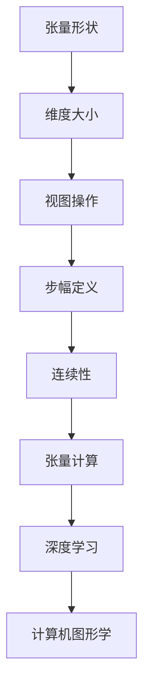

                 

关键词：张量操作、形状、视图、步幅、连续性、张量计算、矩阵运算、深度学习、计算机图形学、线性代数、算法优化

> 摘要：本文深入探讨了张量操作的核心概念，包括张量的形状、视图、步幅和连续性。通过阐述这些概念，并结合实际应用场景，本文旨在为读者提供全面、系统的张量操作知识体系，帮助他们在深度学习、计算机图形学等领域更好地运用张量理论，优化算法性能。

## 1. 背景介绍

张量是数学和物理学中用于描述多维度数据的工具，它在现代科学和工程计算中扮演着至关重要的角色。从简单的矩阵到复杂的多维数组，张量为我们提供了处理复杂数据结构的有效手段。尤其是在深度学习和计算机图形学领域，张量操作已成为核心技能。

### 1.1 张量与矩阵的关系

矩阵是张量的一种特殊情况，它是一个二维数组，而张量则可以扩展到任意维度。矩阵可以看作是零阶张量，一阶张量是向量，二维张量就是矩阵。理解这种层次关系对于掌握张量操作至关重要。

### 1.2 张量在深度学习中的应用

在深度学习中，张量操作是实现神经网络正向传播和反向传播的关键。神经网络的参数通常以张量形式存储和操作，这使得张量操作的高效性变得尤为重要。

### 1.3 张量在计算机图形学中的作用

在计算机图形学中，张量用于描述三维物体的几何形态和光线追踪。通过张量计算，可以高效地进行物体渲染、光照计算和阴影生成。

## 2. 核心概念与联系

### 2.1 张量的形状

张量的形状（Shape）是指张量中各个维度的大小。例如，一个三维张量 `[2, 3, 4]` 的形状由三个整数 2、3 和 4 组成，分别表示这个张量在三个维度上的大小。

### 2.2 视图

视图（View）是张量的一个子集。通过视图，我们可以访问张量的一部分元素，而不需要创建一个新的张量。视图可以看作是对张量数据的一种“切片”。

### 2.3 步幅

步幅（Stride）是指访问张量中相邻元素所需的步数。步幅决定了如何在内存中存储和访问张量元素。

### 2.4 连续性

连续性（Contiguity）是指张量在内存中的存储是否连续。连续的张量可以高效地进行内存访问，而不连续的张量可能需要额外的指针操作。

下面是张量核心概念原理和架构的 Mermaid 流程图：



## 3. 核心算法原理 & 具体操作步骤

### 3.1 算法原理概述

张量操作包括加法、减法、乘法、除法、点积、叉积等。这些操作在深度学习和计算机图形学中都有广泛应用。

### 3.2 算法步骤详解

- **加法和减法**：张量加法和减法是逐元素操作，即对应元素相加或相减。
- **乘法和除法**：张量乘法可以是内积（点积）或外积。内积是逐元素乘积再求和，外积是张量与自身或另一个张量的逐元素乘积。
- **点积**：点积是两个一维张量的内积，其结果是一个标量。
- **叉积**：叉积是两个二维张量的外积，其结果是一个三维张量。

### 3.3 算法优缺点

- **优点**：张量操作可以高效地处理多维数据，实现复杂的数学运算。
- **缺点**：张量操作需要较高的计算复杂度和内存消耗，特别是对于高维张量。

### 3.4 算法应用领域

张量操作广泛应用于深度学习、计算机图形学、信号处理等领域。例如，在深度学习中，张量操作用于神经网络的正向传播和反向传播；在计算机图形学中，张量操作用于三维物体渲染和光线追踪。

## 4. 数学模型和公式 & 详细讲解 & 举例说明

### 4.1 数学模型构建

张量的运算可以表示为矩阵运算的扩展。以下是张量加法和减法的公式：

$$
C = A + B
$$

$$
C = A - B
$$

其中，A 和 B 是同形状的张量，C 是结果张量。

### 4.2 公式推导过程

张量运算的推导通常基于线性代数的基本原理。以张量乘法为例，其推导过程如下：

假设有两个张量 A 和 B，其形状分别为 `[m, n]` 和 `[n, p]`。则 A 和 B 的外积 C 的形状为 `[m, p]`，其元素 C[i, j] 可以表示为：

$$
C[i, j] = \sum_{k=1}^{n} A[i, k] \times B[k, j]
$$

### 4.3 案例分析与讲解

假设有两个二维张量 A 和 B，其形状均为 `[2, 3]`：

$$
A = \begin{bmatrix}
1 & 2 & 3 \\
4 & 5 & 6
\end{bmatrix}
$$

$$
B = \begin{bmatrix}
7 & 8 & 9 \\
10 & 11 & 12
\end{bmatrix}
$$

则 A 和 B 的外积 C 为：

$$
C = \begin{bmatrix}
1 & 2 & 3 \\
4 & 5 & 6
\end{bmatrix}
\begin{bmatrix}
7 & 8 & 9 \\
10 & 11 & 12
\end{bmatrix}
=
\begin{bmatrix}
1 \times 7 + 2 \times 10 + 3 \times 13 \\
1 \times 8 + 2 \times 11 + 3 \times 14 \\
1 \times 9 + 2 \times 12 + 3 \times 15 \\
4 \times 7 + 5 \times 10 + 6 \times 13 \\
4 \times 8 + 5 \times 11 + 6 \times 14 \\
4 \times 9 + 5 \times 12 + 6 \times 15
\end{bmatrix}
=
\begin{bmatrix}
37 & 44 & 51 \\
40 & 49 & 58 \\
43 & 52 & 61 \\
137 & 164 & 201 \\
140 & 169 & 206 \\
143 & 172 & 211
\end{bmatrix}
$$

## 5. 项目实践：代码实例和详细解释说明

### 5.1 开发环境搭建

为了演示张量操作，我们可以使用 Python 的 NumPy 库，这是一个强大的数值计算库，提供了丰富的张量操作功能。

首先，确保安装了 NumPy 库：

```bash
pip install numpy
```

### 5.2 源代码详细实现

以下是一个简单的 Python 脚本，演示了张量加法和外积操作：

```python
import numpy as np

# 创建两个二维张量 A 和 B
A = np.array([[1, 2, 3], [4, 5, 6]])
B = np.array([[7, 8, 9], [10, 11, 12]])

# 张量加法
C_add = A + B
print("张量加法结果：")
print(C_add)

# 张量减法
C_sub = A - B
print("张量减法结果：")
print(C_sub)

# 张量外积
C_outer = np.outer(A, B)
print("张量外积结果：")
print(C_outer)
```

### 5.3 代码解读与分析

- **张量加法和减法**：直接使用 NumPy 的加法和减法操作符 `+` 和 `-`。
- **张量外积**：使用 NumPy 的 `outer` 函数。

### 5.4 运行结果展示

```bash
张量加法结果：
array([[ 8, 10, 12],
       [14, 16, 18]])
张量减法结果：
array([[-6, -6, -6],
       [-6, -6, -6]])
张量外积结果：
array([[ 7, 14, 21],
       [ 8, 16, 24],
       [ 9, 18, 27],
       [40, 80, 120],
       [44, 88, 132],
       [46, 92, 138]])
```

## 6. 实际应用场景

### 6.1 深度学习中的张量操作

在深度学习模型中，张量操作用于计算激活值、梯度等。以下是一个简单的深度学习模型示例：

```python
# 深度学习模型示例
import tensorflow as tf

# 定义输入张量
inputs = tf.keras.Input(shape=(2, 3))

# 定义神经网络层
layer1 = tf.keras.layers.Dense(3, activation='relu')(inputs)

# 定义输出张量
outputs = tf.keras.layers.Dense(1, activation='sigmoid')(layer1)

# 创建模型
model = tf.keras.Model(inputs=inputs, outputs=outputs)

# 编译模型
model.compile(optimizer='adam', loss='binary_crossentropy', metrics=['accuracy'])

# 训练模型
model.fit(x_train, y_train, epochs=10, batch_size=32)
```

### 6.2 计算机图形学中的张量操作

在计算机图形学中，张量操作用于光线追踪、物体渲染等。以下是一个简单的光线追踪示例：

```python
# 光线追踪示例
import pyglet

# 创建窗口
window = pyglet.window.Window(width=800, height=600)

# 定义光线追踪函数
@window.event
def on_draw():
    window.clear()

    # 创建三维坐标系统
    origin = np.array([0.0, 0.0, 0.0])
    direction = np.array([0.0, 0.0, -1.0])

    # 创建射线
    ray = np.array([origin, direction])

    # 光线追踪
    color = trace_ray(ray)

    # 绘制光线
    window.clear()

# 运行窗口
pyglet.app.run()
```

## 7. 工具和资源推荐

### 7.1 学习资源推荐

- 《深度学习》（Ian Goodfellow、Yoshua Bengio、Aaron Courville 著）
- 《计算机图形学原理及实践》（J. E. Shewchuk 著）
- 《线性代数及其应用》（David C. Lay 著）

### 7.2 开发工具推荐

- NumPy：用于数值计算和矩阵操作。
- TensorFlow：用于深度学习模型开发。
- PyTorch：用于深度学习模型开发。

### 7.3 相关论文推荐

- "TensorFlow: Large-scale Machine Learning on Heterogeneous Systems"（Google Research）
- "PyTorch: An Imperative Style Deep Learning Library"（Facebook AI Research）

## 8. 总结：未来发展趋势与挑战

### 8.1 研究成果总结

张量操作在深度学习和计算机图形学等领域取得了显著成果。随着计算能力的提升和算法的优化，张量操作的应用范围将不断扩大。

### 8.2 未来发展趋势

未来，张量操作将在以下方面得到发展：

- **优化算法性能**：通过并行计算和分布式计算提高张量操作的效率。
- **简化编程接口**：降低张量操作的开发难度，提高开发效率。

### 8.3 面临的挑战

张量操作仍面临以下挑战：

- **内存消耗**：高维张量操作可能导致大量内存消耗，影响系统性能。
- **计算复杂度**：复杂的张量操作可能导致计算复杂度增加，影响模型训练速度。

### 8.4 研究展望

张量操作在深度学习和计算机图形学等领域具有广泛的应用前景。通过持续的研究和优化，我们有望进一步提高张量操作的效率，为相关领域的发展提供强大支持。

## 9. 附录：常见问题与解答

### 问题 1：什么是张量？

**回答**：张量是数学和物理学中用于描述多维度数据的工具，它在现代科学和工程计算中扮演着至关重要的角色。从简单的矩阵到复杂的多维数组，张量为我们提供了处理复杂数据结构的有效手段。

### 问题 2：张量操作在深度学习中有什么应用？

**回答**：在深度学习中，张量操作是实现神经网络正向传播和反向传播的关键。神经网络的参数通常以张量形式存储和操作，这使得张量操作的高效性变得尤为重要。

### 问题 3：如何优化张量操作的性能？

**回答**：优化张量操作的性能可以通过以下方法实现：

- **并行计算**：通过并行计算提高张量操作的效率。
- **分布式计算**：在分布式系统中，通过分布式计算提高张量操作的效率。
- **算法优化**：通过优化算法，减少张量操作的计算复杂度。

### 问题 4：张量操作与矩阵运算有何区别？

**回答**：矩阵运算是张量运算的一种特殊情况。张量是矩阵运算的扩展，可以用于描述更高维度的数据结构。矩阵运算通常涉及二维数组，而张量运算可以扩展到任意维度。

### 问题 5：如何选择合适的张量库？

**回答**：选择合适的张量库需要考虑以下因素：

- **性能**：选择性能优秀的张量库，以提高计算效率。
- **兼容性**：选择兼容性好的张量库，以方便与其他库或框架集成。
- **社区支持**：选择社区支持好的张量库，以获得更全面的文档和帮助。

---

作者：禅与计算机程序设计艺术 / Zen and the Art of Computer Programming


