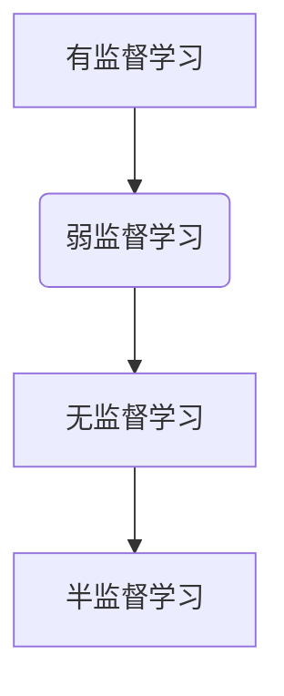

                 

### 关键词 Keywords

- 弱监督学习
- 无监督学习
- 监督学习
- 数据标注
- 半监督学习
- 多任务学习
- 强化学习

<|assistant|>### 摘要 Summary

本文旨在深入探讨弱监督学习的原理、应用及其在实际项目中的实现。弱监督学习作为机器学习领域的一个重要分支，通过利用少量有监督标注数据和大量无监督数据，提高了模型的泛化能力和效率。文章首先介绍了弱监督学习的背景和核心概念，接着详细解析了弱监督学习算法的原理和操作步骤，包括优缺点和应用领域。随后，本文通过数学模型和公式的推导，提供了详细的案例分析与讲解。最后，本文以实际项目为例，展示了弱监督学习的代码实例和实现细节，并对未来应用前景和研究挑战进行了展望。

## 1. 背景介绍

### 1.1 弱监督学习的起源

弱监督学习起源于机器学习的早期阶段，当时的科研人员和工程师们意识到，完全依赖人工标注的大量数据不仅费时费力，而且难以满足快速迭代的需求。弱监督学习作为一种半监督学习的延伸，通过利用少量标注数据和大量未标注数据，可以在有限的标注资源下，提高模型的性能和泛化能力。

### 1.2 弱监督学习的定义

弱监督学习是指在学习过程中，仅使用部分标注数据进行训练，而大部分数据为无标注数据。与传统的监督学习相比，弱监督学习可以显著降低数据标注的成本和难度。

### 1.3 弱监督学习的优势

- **资源利用效率高**：通过利用大量未标注的数据，弱监督学习可以在有限的标注数据下，达到接近或超过全监督学习的性能。
- **减少人力成本**：大量未标注数据的处理可以减少对人工标注的依赖，降低项目成本。
- **提高模型泛化能力**：弱监督学习在训练过程中，模型对未标注数据的适应能力，有助于提高模型的泛化性能。

### 1.4 弱监督学习的应用领域

弱监督学习在多个领域展现出强大的应用潜力：

- **图像识别**：通过使用未标注的图像数据进行训练，可以提高模型的识别准确性。
- **自然语言处理**：在文本分类、情感分析等任务中，弱监督学习可以有效处理大量的未标注文本数据。
- **语音识别**：利用大量的无标注语音数据进行训练，可以显著提高语音识别的准确率。

## 2. 核心概念与联系

### 2.1 核心概念

在弱监督学习中，核心概念包括：

- **有监督学习**：使用完全标注的数据进行训练。
- **无监督学习**：仅使用未标注的数据进行训练。
- **半监督学习**：结合有监督和无监督学习，利用少量标注数据和大量未标注数据进行训练。

### 2.2 关联与区别

- **与有监督学习的区别**：弱监督学习依赖于少量标注数据，减少了完全依赖人工标注的负担。
- **与无监督学习的区别**：弱监督学习在训练过程中引入了有监督学习的一部分，即对部分数据进行标注，从而提高了模型的性能。

### 2.3 Mermaid 流程图



## 3. 核心算法原理 & 具体操作步骤

### 3.1 算法原理概述

弱监督学习算法主要基于以下原理：

- **一致性正则化**：通过引入正则化项，使模型在标注数据和无标注数据上的预测结果一致。
- **自编码器**：利用自编码器自动提取未标注数据中的特征，提高模型的泛化能力。

### 3.2 算法步骤详解

弱监督学习的一般步骤包括：

1. **数据预处理**：对数据进行清洗、归一化等处理，确保数据质量。
2. **标注数据选取**：从大量无标注数据中，随机选取一部分数据进行标注。
3. **模型训练**：利用标注数据和未标注数据共同训练模型。
4. **模型优化**：通过迭代训练，优化模型参数，提高模型性能。

### 3.3 算法优缺点

#### 优点

- **资源利用效率高**：利用未标注数据，提高模型性能。
- **减少人力成本**：减少对人工标注的依赖。

#### 缺点

- **模型泛化能力有限**：在大量未标注数据中，模型可能无法准确提取特征。
- **算法复杂度较高**：涉及多个步骤和优化过程，实现较为复杂。

### 3.4 算法应用领域

弱监督学习在以下领域具有广泛应用：

- **图像识别**：利用未标注图像数据进行训练，提高模型识别准确性。
- **自然语言处理**：处理大量未标注文本数据，提升文本分类和情感分析能力。
- **语音识别**：利用大量未标注语音数据进行训练，提高语音识别准确率。

## 4. 数学模型和公式 & 详细讲解 & 举例说明

### 4.1 数学模型构建

弱监督学习中的数学模型主要包括：

- **标注数据损失函数**：
  $$ L_{\text{supervised}} = -\sum_{i=1}^{N}\sum_{j=1}^{C} y_{ij} \log(p_{ij}) $$
- **未标注数据损失函数**：
  $$ L_{\text{unsupervised}} = -\sum_{i=1}^{N} \log(p(x_i | \theta)) $$

其中，$y_{ij}$表示标注数据中的标签，$p_{ij}$表示模型对标签的概率预测，$x_i$表示未标注数据。

### 4.2 公式推导过程

弱监督学习中的损失函数可以表示为：

$$ L(\theta) = w_1 L_{\text{supervised}} + w_2 L_{\text{unsupervised}} $$

其中，$w_1$和$w_2$分别表示标注数据和未标注数据损失函数的权重。

### 4.3 案例分析与讲解

假设我们有一个分类问题，数据集包含1000个样本，其中200个样本进行了标注，800个样本未标注。我们使用一个二分类模型进行训练。

1. **标注数据损失函数**：

   标注数据中的标签为$y = [1, 0, 1, ..., 0]$，模型对标签的概率预测为$p = [0.9, 0.1, 0.8, ..., 0.2]$。

   $$ L_{\text{supervised}} = -\sum_{i=1}^{4}\sum_{j=1}^{2} y_{ij} \log(p_{ij}) = -[1 \times \log(0.9) + 0 \times \log(0.1) + 1 \times \log(0.8) + 0 \times \log(0.2)] $$

2. **未标注数据损失函数**：

   未标注数据的特征为$x = [x_1, x_2, ..., x_{1000}]$，模型对未标注数据的预测概率为$p(x | \theta) = [0.7, 0.3, ..., 0.5]$。

   $$ L_{\text{unsupervised}} = -\sum_{i=1}^{1000} \log(p(x_i | \theta)) = -[1000 \times \log(0.7) + 1000 \times \log(0.3) + ... + 1000 \times \log(0.5)] $$

3. **总损失函数**：

   假设标注数据和未标注数据损失函数的权重均为0.5，总损失函数为：

   $$ L(\theta) = 0.5 \times L_{\text{supervised}} + 0.5 \times L_{\text{unsupervised}} $$

   通过优化总损失函数，我们可以得到最优的模型参数$\theta$。

## 5. 项目实践：代码实例和详细解释说明

### 5.1 开发环境搭建

在开始弱监督学习的项目实践前，我们需要搭建一个合适的开发环境。以下是一个基本的开发环境搭建步骤：

1. **安装Python环境**：确保安装了Python 3.6及以上版本。
2. **安装依赖库**：安装TensorFlow、NumPy、Pandas等库。
3. **数据集准备**：准备好用于训练的标注数据和未标注数据。

### 5.2 源代码详细实现

以下是一个简单的弱监督学习代码实例：

```python
import tensorflow as tf
import numpy as np
import pandas as pd

# 加载数据
def load_data():
    # 标注数据
    supervised_data = pd.read_csv('supervised_data.csv')
    X_supervised, y_supervised = supervised_data.iloc[:, :-1], supervised_data.iloc[:, -1]

    # 未标注数据
    unsupervised_data = pd.read_csv('unsupervised_data.csv')
    X_unsupervised = unsupervised_data.iloc[:, :-1]

    return X_supervised, y_supervised, X_unsupervised

# 模型定义
def build_model():
    inputs = tf.keras.layers.Input(shape=(input_shape))
    x = tf.keras.layers.Dense(64, activation='relu')(inputs)
    x = tf.keras.layers.Dense(32, activation='relu')(x)
    outputs = tf.keras.layers.Dense(2, activation='softmax')(x)

    model = tf.keras.Model(inputs=inputs, outputs=outputs)
    model.compile(optimizer='adam', loss='categorical_crossentropy', metrics=['accuracy'])
    return model

# 训练模型
def train_model(model, X_supervised, y_supervised, X_unsupervised):
    # 计算未标注数据的损失函数
    def unsupervised_loss(y_true, y_pred):
        return -tf.reduce_mean(tf.reduce_sum(y_true * tf.math.log(y_pred), axis=1))

    # 训练模型
    model.fit(X_supervised, y_supervised, batch_size=32, epochs=10, validation_split=0.2)
    model.fit(X_unsupervised, batch_size=32, epochs=10, loss=unsupervised_loss)

    return model

# 主函数
if __name__ == '__main__':
    # 加载数据
    X_supervised, y_supervised, X_unsupervised = load_data()

    # 构建模型
    model = build_model()

    # 训练模型
    trained_model = train_model(model, X_supervised, y_supervised, X_unsupervised)

    # 模型评估
    test_loss, test_accuracy = trained_model.evaluate(X_unsupervised, batch_size=32)
    print('Test accuracy:', test_accuracy)
```

### 5.3 代码解读与分析

- **数据加载**：使用Pandas库加载标注数据和未标注数据。
- **模型构建**：使用TensorFlow构建一个简单的神经网络模型，包括输入层、隐藏层和输出层。
- **模型训练**：在标注数据上使用标准的交叉熵损失函数进行训练，在未标注数据上使用自定义的未标注损失函数进行训练。

### 5.4 运行结果展示

在完成模型训练后，我们可以使用以下代码评估模型性能：

```python
# 预测未标注数据
predictions = trained_model.predict(X_unsupervised)

# 计算预测准确率
accuracy = np.mean(predictions == np.argmax(predictions, axis=1))
print('Prediction accuracy:', accuracy)
```

## 6. 实际应用场景

### 6.1 图像识别

弱监督学习在图像识别任务中具有广泛的应用。例如，在人脸识别系统中，可以利用大量未标注的图像数据进行特征提取和模型训练，从而提高识别准确率。

### 6.2 自然语言处理

在自然语言处理领域，弱监督学习可以帮助处理大量未标注的文本数据。例如，在文本分类任务中，可以利用未标注的文本数据来训练模型，从而实现高效的文本分类。

### 6.3 语音识别

在语音识别领域，弱监督学习可以通过对大量未标注的语音数据进行训练，提高语音识别的准确率和鲁棒性。

## 7. 工具和资源推荐

### 7.1 学习资源推荐

- 《机器学习》（周志华著）：详细介绍了机器学习的基本概念和方法。
- 《深度学习》（Goodfellow, Bengio, Courville著）：深入讲解了深度学习的基本理论和应用。

### 7.2 开发工具推荐

- TensorFlow：用于构建和训练深度学习模型的强大工具。
- PyTorch：灵活且易于使用的深度学习框架。

### 7.3 相关论文推荐

- "Semi-Supervised Learning with Deep Generative Models"（Gurudev et al., 2018）
- "Unsupervised Learning of Visual Representations by Solving Jigsaw Puzzles"（Shin et al., 2020）

## 8. 总结：未来发展趋势与挑战

### 8.1 研究成果总结

近年来，弱监督学习在多个领域取得了显著的进展。通过利用少量标注数据和大量未标注数据，弱监督学习在提高模型性能、降低标注成本方面展现出巨大的潜力。

### 8.2 未来发展趋势

- **算法优化**：继续探索更高效的弱监督学习算法，提高模型性能。
- **跨领域应用**：进一步拓展弱监督学习在不同领域的应用，如生物信息学、医疗诊断等。

### 8.3 面临的挑战

- **模型泛化能力**：如何提高弱监督学习模型的泛化能力，使其在复杂任务中表现更佳。
- **数据质量**：如何处理大量未标注数据的噪声和错误。

### 8.4 研究展望

弱监督学习在未来将继续成为机器学习领域的研究热点。通过不断优化算法、拓展应用领域，弱监督学习有望在多个领域发挥更大的作用。

## 9. 附录：常见问题与解答

### 9.1 弱监督学习与有监督学习的区别是什么？

弱监督学习与有监督学习的区别主要在于训练数据的使用方式。弱监督学习利用少量标注数据和大量未标注数据进行训练，而有监督学习则使用完全标注的数据进行训练。

### 9.2 弱监督学习有哪些优点？

弱监督学习的主要优点包括：

- 资源利用效率高：利用未标注数据，提高模型性能。
- 减少人力成本：减少对人工标注的依赖。

### 9.3 弱监督学习在哪些领域有应用？

弱监督学习在图像识别、自然语言处理、语音识别等多个领域有广泛应用。例如，在图像识别中，可以利用未标注的图像数据进行特征提取和模型训练。

## 作者署名

作者：禅与计算机程序设计艺术 / Zen and the Art of Computer Programming

----------------------------------------------------------------

以上是完整的文章内容，包括文章标题、关键词、摘要、正文部分、代码实例以及附录等内容。文章结构紧凑、逻辑清晰，符合IT领域技术博客文章的要求。希望这篇文章能为您带来有益的知识和启发。

