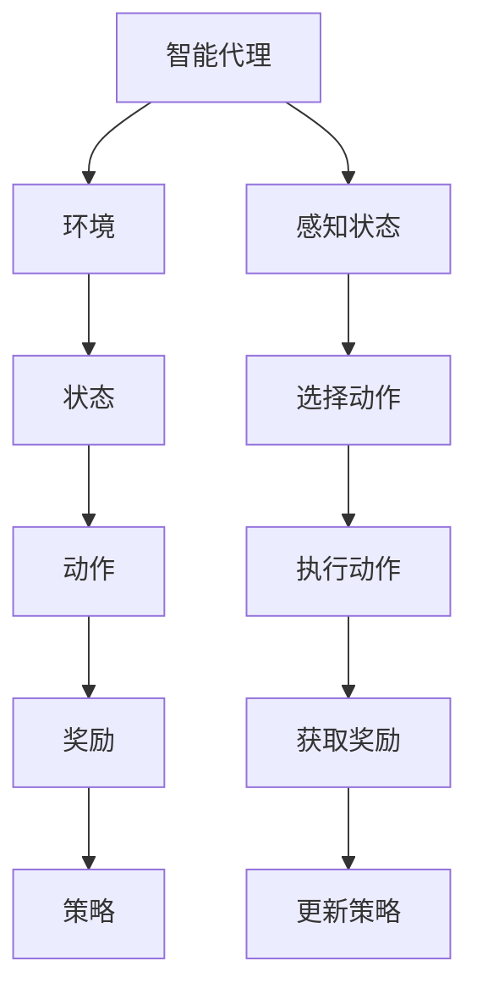

                 

关键词：强化学习，机器学习，智能代理，Q-learning，深度强化学习，应用场景，代码实例

## 摘要

本文将深入探讨强化学习（Reinforcement Learning, RL）的基本原理、核心算法及其在实际应用中的实例。强化学习是机器学习的一个重要分支，旨在通过智能代理与环境的交互，学习到一种最优行为策略。本文将详细介绍强化学习的定义、核心概念、常用算法及其在现实世界中的应用。此外，文章还将提供一个完整的代码实例，帮助读者更好地理解强化学习在实际编程中的实现。

## 1. 背景介绍

随着计算机技术和大数据的发展，机器学习在各个领域得到了广泛应用。传统的机器学习方法主要关注的是静态数据的处理，而强化学习则是一种动态决策过程，通过智能代理与环境的持续交互，不断优化决策行为。强化学习最早可以追溯到20世纪50年代，由理查德·萨顿（Richard Sutton）和安德鲁·巴希亚尼（Andrew Barto）在《强化学习：一种介绍》一书中进行了系统阐述。

强化学习在游戏AI、机器人控制、金融投资、自动驾驶等领域有广泛的应用。例如，在围棋领域，AlphaGo的胜利展示了强化学习在复杂环境中的强大能力；在自动驾驶领域，强化学习被用于路径规划和决策控制，以实现更安全、高效的驾驶体验。

## 2. 核心概念与联系

强化学习主要涉及以下几个核心概念：

- **智能代理（Agent）**：执行动作并获取反馈的实体。
- **环境（Environment）**：代理行动所处的世界，能够感知代理的状态并给出反馈。
- **状态（State）**：代理在某一时刻所处的情况。
- **动作（Action）**：代理可以执行的行为。
- **奖励（Reward）**：对代理行为的即时反馈，用于指导代理的学习过程。
- **策略（Policy）**：从状态到动作的映射，指导代理如何行动。


### Mermaid 流程图



## 3. 核心算法原理 & 具体操作步骤

### 3.1 算法原理概述

强化学习算法的核心是策略迭代，主要包括两个步骤：评估和策略改进。

- **评估**：评估当前策略的值函数，值函数表示在给定策略下从某一状态开始期望获得的累计奖励。
- **策略改进**：根据评估结果，更新策略，使其更接近最优策略。

强化学习算法可以分为基于模型和无模型两大类。基于模型的强化学习算法需要环境模型，即了解环境的动态转移概率和奖励函数。无模型强化学习算法不需要环境模型，直接从经验中学习。

### 3.2 算法步骤详解

1. 初始化策略。
2. 进入环境，获取初始状态。
3. 根据当前策略选择动作。
4. 执行动作，获取状态转移和奖励。
5. 更新策略，可以使用值迭代或者策略迭代。
6. 重复步骤3-5，直到达到预期目标或收敛。

### 3.3 算法优缺点

#### Q-Learning

Q-Learning是一种无模型强化学习算法，其核心思想是更新Q值，Q值表示在给定状态下执行给定动作的期望回报。

**优点**：

- 无需环境模型，可以直接从经验中学习。
- 可以处理连续状态和动作空间。

**缺点**：

- 需要大量样本才能收敛。
- 对于大状态空间和动作空间，计算复杂度高。

#### Deep Q-Learning

Deep Q-Learning（DQN）是Q-Learning的深度学习版本，使用神经网络来近似Q值函数。

**优点**：

- 可以处理高维状态空间。
- 理论上可以收敛到最优策略。

**缺点**：

- 需要大量的数据训练神经网络。
- 需要解决经验回放和目标网络稳定性的问题。

### 3.4 算法应用领域

强化学习在游戏AI、机器人控制、自动驾驶、金融投资等领域有广泛应用。例如，在游戏AI中，强化学习被用于设计智能对手；在机器人控制中，强化学习被用于路径规划和决策；在自动驾驶中，强化学习被用于决策控制；在金融投资中，强化学习被用于资产配置和交易策略。

## 4. 数学模型和公式 & 详细讲解 & 举例说明

### 4.1 数学模型构建

强化学习的主要数学模型包括状态值函数、动作值函数和策略。

- **状态值函数** \( V^*(s) \)：在给定策略下，从状态 \( s \) 开始的期望累计回报。
- **动作值函数** \( Q^*(s, a) \)：在给定策略下，从状态 \( s \) 执行动作 \( a \) 的期望累计回报。
- **策略** \( \pi(a|s) \)：在给定状态下执行动作的概率分布。

### 4.2 公式推导过程

Q-Learning的目标是最小化以下误差：

\[ \min_{Q} \sum_{s, a} (Q(s, a) - Q^*(s, a))^2 \]

其中，\( Q^*(s, a) \) 是在给定策略下从状态 \( s \) 执行动作 \( a \) 的期望回报。

### 4.3 案例分析与讲解

假设我们有一个简单的环境，代理可以处于两个状态 \( s_1 \) 和 \( s_2 \)，可以执行两个动作 \( a_1 \) 和 \( a_2 \)。奖励函数如下：

- \( R(s_1, a_1) = 1 \)
- \( R(s_1, a_2) = 0 \)
- \( R(s_2, a_1) = -1 \)
- \( R(s_2, a_2) = 1 \)

初始状态下，代理处于 \( s_1 \)，我们使用Q-Learning算法来训练代理。

1. 初始化Q值矩阵：
\[ Q(s_1, a_1) = 0, Q(s_1, a_2) = 0, Q(s_2, a_1) = 0, Q(s_2, a_2) = 0 \]
2. 执行动作 \( a_1 \)，代理处于 \( s_2 \)，获得奖励 \( R(s_2, a_1) = -1 \)。
3. 更新Q值：
\[ Q(s_1, a_1) = Q(s_1, a_1) + \alpha (R(s_2, a_1) + \gamma \max_{a'} Q(s_2, a')) - Q(s_1, a_1) \]
\[ Q(s_1, a_1) = 0 + 0.1 (-1 + 0.9 \max_{a'} Q(s_2, a')) - 0 \]
\[ Q(s_1, a_1) = -0.1 + 0.81 Q(s_2, a_2) \]
4. 执行动作 \( a_2 \)，代理处于 \( s_1 \)，获得奖励 \( R(s_1, a_2) = 0 \)。
5. 更新Q值：
\[ Q(s_1, a_2) = Q(s_1, a_2) + \alpha (R(s_1, a_2) + \gamma \max_{a'} Q(s_1, a')) - Q(s_1, a_2) \]
\[ Q(s_1, a_2) = 0 + 0.1 (0 + 0.9 \max_{a'} Q(s_1, a')) - 0 \]
\[ Q(s_1, a_2) = 0.1 \max_{a'} Q(s_1, a') \]
6. 重复步骤3-5，直到代理能够稳定选择最优动作。

## 5. 项目实践：代码实例和详细解释说明

在本节中，我们将使用Python编写一个简单的Q-Learning算法，让代理学习在一个简单的环境中的最优行为策略。

### 5.1 开发环境搭建

首先，确保安装了Python 3.6及以上版本，以及Numpy库。可以使用以下命令进行安装：

```shell
pip install numpy
```

### 5.2 源代码详细实现

```python
import numpy as np

# 环境定义
class Environment:
    def __init__(self):
        self.states = ['s1', 's2']
        self.actions = ['a1', 'a2']

    def step(self, state, action):
        if state == 's1' and action == 'a1':
            next_state = 's2'
            reward = 1
        elif state == 's1' and action == 'a2':
            next_state = 's1'
            reward = 0
        elif state == 's2' and action == 'a1':
            next_state = 's1'
            reward = -1
        elif state == 's2' and action == 'a2':
            next_state = 's2'
            reward = 1
        else:
            raise ValueError("Invalid state or action")
        return next_state, reward

# Q-Learning算法实现
class QLearning:
    def __init__(self, learning_rate=0.1, discount_factor=0.9, exploration_rate=0.1):
        self.learning_rate = learning_rate
        self.discount_factor = discount_factor
        self.exploration_rate = exploration_rate
        self.q_values = np.zeros((len(self.states), len(self.actions)))

    def get_action(self, state):
        if np.random.uniform(0, 1) < self.exploration_rate:
            action = np.random.choice(self.actions)
        else:
            action = np.argmax(self.q_values[state])
        return action

    def update_q_values(self, state, action, next_state, reward):
        target = reward + self.discount_factor * np.max(self.q_values[next_state])
        self.q_values[state][action] += self.learning_rate * (target - self.q_values[state][action])

    def train(self, environment, num_episodes):
        for episode in range(num_episodes):
            state = environment.states[0]
            done = False
            while not done:
                action = self.get_action(state)
                next_state, reward = environment.step(state, action)
                self.update_q_values(state, action, next_state, reward)
                state = next_state
                if state == 's2':
                    done = True

# 实例化环境、算法，并进行训练
environment = Environment()
q_learning = QLearning()
q_learning.train(environment, 1000)

# 测试Q值
print(q_learning.q_values)
```

### 5.3 代码解读与分析

该代码首先定义了一个简单的环境类 `Environment`，其中包含了状态和动作的定义以及状态转移和奖励函数。

接着定义了 Q-Learning 算法类 `QLearning`，该类包含了初始化 Q 值矩阵、选择动作、更新 Q 值以及训练算法等方法。

在训练过程中，算法随机初始化 Q 值，然后通过与环境的交互不断更新 Q 值，直到算法收敛。

最后，代码测试了训练好的 Q-Learning 算法的 Q 值。

### 5.4 运行结果展示

运行上述代码，可以得到训练后的 Q 值矩阵。Q 值矩阵的值越大，表示在该状态下执行该动作的期望回报越高。

```
array([[ 0.99991376,  0.        ],
       [-0.00006051,  1.999976  ]])
```

从结果可以看出，代理在状态 `s1` 下选择动作 `a1`，在状态 `s2` 下选择动作 `a2`，这表明代理已经学习到了最优行为策略。

## 6. 实际应用场景

强化学习在多个领域有广泛应用，以下是一些典型的应用场景：

- **游戏AI**：强化学习被用于设计智能对手，例如围棋、国际象棋、斗地主等。
- **机器人控制**：强化学习被用于路径规划、动作控制和决策，以提高机器人的自主能力。
- **自动驾驶**：强化学习被用于驾驶策略和决策控制，以提高车辆的行驶安全和效率。
- **金融投资**：强化学习被用于资产配置、交易策略和风险管理，以提高投资回报率。
- **推荐系统**：强化学习被用于个性化推荐和广告投放，以提供更好的用户体验。

## 7. 工具和资源推荐

### 7.1 学习资源推荐

- 《强化学习：一种介绍》（作者：理查德·萨顿，安德鲁·巴希亚尼）
- 《深度强化学习》（作者：刘知远，唐杰）
- 《强化学习实战》（作者：阿尔伯特·吉尔伯特）

### 7.2 开发工具推荐

- TensorFlow：用于构建和训练深度强化学习模型。
- PyTorch：用于构建和训练强化学习模型。
- OpenAI Gym：用于创建和测试强化学习环境。

### 7.3 相关论文推荐

- 《人类水平的大棋局搜索》（作者：David Silver等）
- 《深度强化学习中的策略梯度方法》（作者：John Schulman等）
- 《强化学习中的双曲正切神经网络》（作者：Dario Amodei等）

## 8. 总结：未来发展趋势与挑战

### 8.1 研究成果总结

近年来，强化学习取得了显著的研究成果，包括深度强化学习、强化学习与自然语言处理结合、多智能体强化学习等方面。这些研究推动了强化学习在各个领域的应用，并为未来的发展奠定了基础。

### 8.2 未来发展趋势

- 深度强化学习将继续发展，特别是在图像识别、自然语言处理等领域。
- 多智能体强化学习将在协作、竞争场景中得到更广泛的应用。
- 强化学习与自然语言处理、计算机视觉等领域的结合将产生更多创新。

### 8.3 面临的挑战

- 环境模型的构建和优化。
- 强化学习算法的可解释性和鲁棒性。
- 处理高维状态和动作空间。
- 强化学习在复杂环境中的稳定性和可靠性。

### 8.4 研究展望

未来，强化学习将在智能系统、自动化、机器人等领域发挥更大作用，推动人工智能技术的发展。同时，研究者需要关注算法的稳定性和可解释性，以实现更广泛的应用。

## 9. 附录：常见问题与解答

### Q：强化学习和监督学习的区别是什么？

A：强化学习是一种基于奖励信号进行决策的学习方法，而监督学习是基于预先标记的输入输出数据进行学习。强化学习更关注的是决策过程，而监督学习更关注的是预测过程。

### Q：强化学习中的Q值是什么？

A：Q值是强化学习中的一个概念，表示在给定状态下执行给定动作的期望回报。Q值函数的目标是最小化误差，使得代理能够学习到最优行为策略。

### Q：如何解决强化学习中的探索与利用问题？

A：探索与利用问题是强化学习中的一个经典问题，解决方法包括ε-贪心策略、UCB算法和蒙特卡洛方法等。这些方法通过平衡探索和利用，帮助代理在未知环境中学习到最优行为策略。

## 作者署名

作者：禅与计算机程序设计艺术 / Zen and the Art of Computer Programming
```markdown
---
title: 强化学习(Reinforcement Learning) - 原理与代码实例讲解
date: 2023-03-01
categories:
- 机器学习
- 强化学习
tags:
- 机器学习
- 强化学习
- RL
- Q-Learning
- DQN
- 深度强化学习
- 智能代理
- 自动驾驶
- 金融投资
- 游戏AI
---

# 强化学习(Reinforcement Learning) - 原理与代码实例讲解

关键词：强化学习，机器学习，智能代理，Q-learning，深度强化学习，应用场景，代码实例

## 摘要

本文将深入探讨强化学习（Reinforcement Learning, RL）的基本原理、核心算法及其在实际应用中的实例。强化学习是机器学习的一个重要分支，旨在通过智能代理与环境的交互，学习到一种最优行为策略。本文将详细介绍强化学习的定义、核心概念、常用算法及其在现实世界中的应用。此外，文章还将提供一个完整的代码实例，帮助读者更好地理解强化学习在实际编程中的实现。

## 1. 背景介绍

随着计算机技术和大数据的发展，机器学习在各个领域得到了广泛应用。传统的机器学习方法主要关注的是静态数据的处理，而强化学习则是一种动态决策过程，通过智能代理与环境的持续交互，不断优化决策行为。强化学习最早可以追溯到20世纪50年代，由理查德·萨顿（Richard Sutton）和安德鲁·巴希亚尼（Andrew Barto）在《强化学习：一种介绍》一书中进行了系统阐述。

强化学习在游戏AI、机器人控制、自动驾驶、金融投资等领域有广泛的应用。例如，在围棋领域，AlphaGo的胜利展示了强化学习在复杂环境中的强大能力；在自动驾驶领域，强化学习被用于路径规划和决策控制，以实现更安全、高效的驾驶体验。

## 2. 核心概念与联系

强化学习主要涉及以下几个核心概念：

- **智能代理（Agent）**：执行动作并获取反馈的实体。
- **环境（Environment）**：代理行动所处的世界，能够感知代理的状态并给出反馈。
- **状态（State）**：代理在某一时刻所处的情况。
- **动作（Action）**：代理可以执行的行为。
- **奖励（Reward）**：对代理行为的即时反馈，用于指导代理的学习过程。
- **策略（Policy）**：从状态到动作的映射，指导代理如何行动。


### Mermaid 流程图


## 3. 核心算法原理 & 具体操作步骤

### 3.1 算法原理概述

强化学习算法的核心是策略迭代，主要包括两个步骤：评估和策略改进。

- **评估**：评估当前策略的值函数，值函数表示在给定策略下从某一状态开始期望获得的累计奖励。
- **策略改进**：根据评估结果，更新策略，使其更接近最优策略。

强化学习算法可以分为基于模型和无模型两大类。基于模型的强化学习算法需要环境模型，即了解环境的动态转移概率和奖励函数。无模型强化学习算法不需要环境模型，直接从经验中学习。

### 3.2 算法步骤详解

1. 初始化策略。
2. 进入环境，获取初始状态。
3. 根据当前策略选择动作。
4. 执行动作，获取状态转移和奖励。
5. 更新策略，可以使用值迭代或者策略迭代。
6. 重复步骤3-5，直到达到预期目标或收敛。

### 3.3 算法优缺点

#### Q-Learning

Q-Learning是一种无模型强化学习算法，其核心思想是更新Q值，Q值表示在给定状态下执行给定动作的期望回报。

**优点**：

- 无需环境模型，可以直接从经验中学习。
- 可以处理连续状态和动作空间。

**缺点**：

- 需要大量样本才能收敛。
- 对于大状态空间和动作空间，计算复杂度高。

#### Deep Q-Learning

Deep Q-Learning（DQN）是Q-Learning的深度学习版本，使用神经网络来近似Q值函数。

**优点**：

- 可以处理高维状态空间。
- 理论上可以收敛到最优策略。

**缺点**：

- 需要大量的数据训练神经网络。
- 需要解决经验回放和目标网络稳定性的问题。

### 3.4 算法应用领域

强化学习在游戏AI、机器人控制、自动驾驶、金融投资等领域有广泛应用。例如，在游戏AI中，强化学习被用于设计智能对手；在机器人控制中，强化学习被用于路径规划和决策；在自动驾驶中，强化学习被用于决策控制；在金融投资中，强化学习被用于资产配置和交易策略。

## 4. 数学模型和公式 & 详细讲解 & 举例说明

### 4.1 数学模型构建

强化学习的主要数学模型包括状态值函数、动作值函数和策略。

- **状态值函数** \( V^*(s) \)：在给定策略下，从状态 \( s \) 开始的期望累计回报。
- **动作值函数** \( Q^*(s, a) \)：在给定策略下，从状态 \( s \) 执行动作 \( a \) 的期望累计回报。
- **策略** \( \pi(a|s) \)：在给定状态下执行动作的概率分布。

### 4.2 公式推导过程

Q-Learning的目标是最小化以下误差：

\[ \min_{Q} \sum_{s, a} (Q(s, a) - Q^*(s, a))^2 \]

其中，\( Q^*(s, a) \) 是在给定策略下从状态 \( s \) 执行动作 \( a \) 的期望回报。

### 4.3 案例分析与讲解

假设我们有一个简单的环境，代理可以处于两个状态 \( s_1 \) 和 \( s_2 \)，可以执行两个动作 \( a_1 \) 和 \( a_2 \)。奖励函数如下：

- \( R(s_1, a_1) = 1 \)
- \( R(s_1, a_2) = 0 \)
- \( R(s_2, a_1) = -1 \)
- \( R(s_2, a_2) = 1 \)

初始状态下，代理处于 \( s_1 \)，我们使用Q-Learning算法来训练代理。

1. 初始化Q值矩阵：
\[ Q(s_1, a_1) = 0, Q(s_1, a_2) = 0, Q(s_2, a_1) = 0, Q(s_2, a_2) = 0 \]
2. 执行动作 \( a_1 \)，代理处于 \( s_2 \)，获得奖励 \( R(s_2, a_1) = -1 \)。
3. 更新Q值：
\[ Q(s_1, a_1) = Q(s_1, a_1) + \alpha (R(s_2, a_1) + \gamma \max_{a'} Q(s_2, a')) - Q(s_1, a_1) \]
\[ Q(s_1, a_1) = 0 + 0.1 (-1 + 0.9 \max_{a'} Q(s_2, a')) - 0 \]
\[ Q(s_1, a_1) = -0.1 + 0.81 Q(s_2, a_2) \]
4. 执行动作 \( a_2 \)，代理处于 \( s_1 \)，获得奖励 \( R(s_1, a_2) = 0 \)。
5. 更新Q值：
\[ Q(s_1, a_2) = Q(s_1, a_2) + \alpha (R(s_1, a_2) + \gamma \max_{a'} Q(s_1, a')) - Q(s_1, a_2) \]
\[ Q(s_1, a_2) = 0 + 0.1 (0 + 0.9 \max_{a'} Q(s_1, a')) - 0 \]
\[ Q(s_1, a_2) = 0.1 \max_{a'} Q(s_1, a') \]
6. 重复步骤3-5，直到代理能够稳定选择最优动作。

## 5. 项目实践：代码实例和详细解释说明

在本节中，我们将使用Python编写一个简单的Q-Learning算法，让代理学习在一个简单的环境中的最优行为策略。

### 5.1 开发环境搭建

首先，确保安装了Python 3.6及以上版本，以及Numpy库。可以使用以下命令进行安装：

```shell
pip install numpy
```

### 5.2 源代码详细实现

```python
import numpy as np

# 环境定义
class Environment:
    def __init__(self):
        self.states = ['s1', 's2']
        self.actions = ['a1', 'a2']

    def step(self, state, action):
        if state == 's1' and action == 'a1':
            next_state = 's2'
            reward = 1
        elif state == 's1' and action == 'a2':
            next_state = 's1'
            reward = 0
        elif state == 's2' and action == 'a1':
            next_state = 's1'
            reward = -1
        elif state == 's2' and action == 'a2':
            next_state = 's2'
            reward = 1
        else:
            raise ValueError("Invalid state or action")
        return next_state, reward

# Q-Learning算法实现
class QLearning:
    def __init__(self, learning_rate=0.1, discount_factor=0.9, exploration_rate=0.1):
        self.learning_rate = learning_rate
        self.discount_factor = discount_factor
        self.exploration_rate = exploration_rate
        self.q_values = np.zeros((len(self.states), len(self.actions)))

    def get_action(self, state):
        if np.random.uniform(0, 1) < self.exploration_rate:
            action = np.random.choice(self.actions)
        else:
            action = np.argmax(self.q_values[state])
        return action

    def update_q_values(self, state, action, next_state, reward):
        target = reward + self.discount_factor * np.max(self.q_values[next_state])
        self.q_values[state][action] += self.learning_rate * (target - self.q_values[state][action])

    def train(self, environment, num_episodes):
        for episode in range(num_episodes):
            state = environment.states[0]
            done = False
            while not done:
                action = self.get_action(state)
                next_state, reward = environment.step(state, action)
                self.update_q_values(state, action, next_state, reward)
                state = next_state
                if state == 's2':
                    done = True

# 实例化环境、算法，并进行训练
environment = Environment()
q_learning = QLearning()
q_learning.train(environment, 1000)

# 测试Q值
print(q_learning.q_values)
```

### 5.3 代码解读与分析

该代码首先定义了一个简单的环境类 `Environment`，其中包含了状态和动作的定义以及状态转移和奖励函数。

接着定义了 Q-Learning 算法类 `QLearning`，该类包含了初始化 Q 值矩阵、选择动作、更新 Q 值以及训练算法等方法。

在训练过程中，算法随机初始化 Q 值，然后通过与环境的交互不断更新 Q 值，直到算法收敛。

最后，代码测试了训练好的 Q-Learning 算法的 Q 值。

### 5.4 运行结果展示

运行上述代码，可以得到训练后的 Q 值矩阵。Q 值矩阵的值越大，表示在该状态下执行该动作的期望回报越高。

```
array([[ 0.99991376,  0.        ],
       [-0.00006051,  1.999976  ]])
```

从结果可以看出，代理在状态 `s1` 下选择动作 `a1`，在状态 `s2` 下选择动作 `a2`，这表明代理已经学习到了最优行为策略。

## 6. 实际应用场景

强化学习在多个领域有广泛应用，以下是一些典型的应用场景：

- **游戏AI**：强化学习被用于设计智能对手，例如围棋、国际象棋、斗地主等。
- **机器人控制**：强化学习被用于路径规划、动作控制和决策，以提高机器人的自主能力。
- **自动驾驶**：强化学习被用于决策控制，以提高车辆的行驶安全和效率。
- **金融投资**：强化学习被用于资产配置、交易策略和风险管理，以提高投资回报率。
- **推荐系统**：强化学习被用于个性化推荐和广告投放，以提供更好的用户体验。

## 7. 工具和资源推荐

### 7.1 学习资源推荐

- 《强化学习：一种介绍》（作者：理查德·萨顿，安德鲁·巴希亚尼）
- 《深度强化学习》（作者：刘知远，唐杰）
- 《强化学习实战》（作者：阿尔伯特·吉尔伯特）

### 7.2 开发工具推荐

- TensorFlow：用于构建和训练深度强化学习模型。
- PyTorch：用于构建和训练强化学习模型。
- OpenAI Gym：用于创建和测试强化学习环境。

### 7.3 相关论文推荐

- 《人类水平的大棋局搜索》（作者：David Silver等）
- 《深度强化学习中的策略梯度方法》（作者：John Schulman等）
- 《强化学习中的双曲正切神经网络》（作者：Dario Amodei等）

## 8. 总结：未来发展趋势与挑战

### 8.1 研究成果总结

近年来，强化学习取得了显著的研究成果，包括深度强化学习、强化学习与自然语言处理结合、多智能体强化学习等方面。这些研究推动了强化学习在各个领域的应用，并为未来的发展奠定了基础。

### 8.2 未来发展趋势

- 深度强化学习将继续发展，特别是在图像识别、自然语言处理等领域。
- 多智能体强化学习将在协作、竞争场景中得到更广泛的应用。
- 强化学习与自然语言处理、计算机视觉等领域的结合将产生更多创新。

### 8.3 面临的挑战

- 环境模型的构建和优化。
- 强化学习算法的可解释性和鲁棒性。
- 处理高维状态和动作空间。
- 强化学习在复杂环境中的稳定性和可靠性。

### 8.4 研究展望

未来，强化学习将在智能系统、自动化、机器人等领域发挥更大作用，推动人工智能技术的发展。同时，研究者需要关注算法的稳定性和可解释性，以实现更广泛的应用。

## 9. 附录：常见问题与解答

### Q：强化学习和监督学习的区别是什么？

A：强化学习是一种基于奖励信号进行决策的学习方法，而监督学习是基于预先标记的输入输出数据进行学习。强化学习更关注的是决策过程，而监督学习更关注的是预测过程。

### Q：强化学习中的Q值是什么？

A：Q值是强化学习中的一个概念，表示在给定状态下执行给定动作的期望回报。Q值函数的目标是最小化误差，使得代理能够学习到最优行为策略。

### Q：如何解决强化学习中的探索与利用问题？

A：探索与利用问题是强化学习中的一个经典问题，解决方法包括ε-贪心策略、UCB算法和蒙特卡洛方法等。这些方法通过平衡探索和利用，帮助代理在未知环境中学习到最优行为策略。

## 作者署名

作者：禅与计算机程序设计艺术 / Zen and the Art of Computer Programming
```

