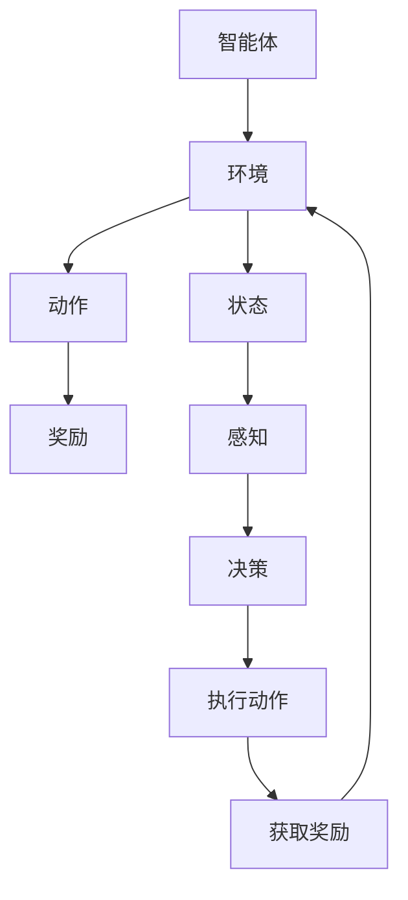

                 

强化学习（Reinforcement Learning，简称RL）是机器学习领域的一个重要分支，它通过智能体与环境的交互，通过试错学习来获取最优策略。相比于传统的监督学习和无监督学习，强化学习具有独特的魅力和广泛应用。本文将全面概述强化学习的原理、核心算法及其在各个领域的应用。

## 关键词

- 强化学习
- 强化学习算法
- 智能体
- 策略学习
- 环境模型
- Q学习
- DQN
- PG

## 摘要

本文将详细介绍强化学习的原理及其核心算法。首先，我们将探讨强化学习的背景和基本概念，包括智能体、环境、状态、动作和奖励。随后，我们将深入探讨Q学习、深度Q网络（DQN）和策略梯度（PG）等强化学习算法。最后，我们将讨论强化学习在现实世界中的应用场景，以及未来的发展趋势和挑战。

## 1. 背景介绍

强化学习起源于20世纪50年代，其理论基础是行为主义心理学。强化学习的核心思想是通过试错学习来寻找最优策略，使得智能体能够在给定环境中实现长期奖励最大化。强化学习在解决动态、不确定环境下的决策问题时具有独特的优势。

在强化学习中，智能体（Agent）是执行动作并从环境中获取奖励的实体。环境（Environment）是智能体所处的场景，包括状态（State）和动作（Action）。智能体通过感知环境的状态，选择合适的动作，并从环境中获取奖励。这一过程不断迭代，直到达到某个目标或停止条件。

强化学习的目标是为智能体设计一个最优策略（Policy），使得智能体在给定环境中能够获得最大的累积奖励。策略通常是一个映射函数，将状态映射到动作。在不同的算法中，策略的表示方式和学习方式有所不同。

## 2. 核心概念与联系

### 2.1 智能体、环境、状态、动作和奖励

智能体（Agent）：执行动作并从环境中获取奖励的实体。

环境（Environment）：智能体所处的场景，包括状态（State）和动作（Action）。

状态（State）：描述智能体在某个时刻所处的环境状态。

动作（Action）：智能体可以执行的动作。

奖励（Reward）：智能体在执行某个动作后从环境中获得的即时奖励。

### 2.2 Mermaid 流程图



## 3. 核心算法原理 & 具体操作步骤

### 3.1 算法原理概述

强化学习算法主要包括基于值函数的算法和基于策略的算法。基于值函数的算法通过估计状态值函数或动作值函数来学习最优策略，其中Q学习是经典代表。基于策略的算法通过直接优化策略来学习最优行为，策略梯度（PG）算法是其中之一。

### 3.2 算法步骤详解

#### 3.2.1 Q学习

Q学习是基于值函数的算法，其核心思想是估计状态-动作值函数，即给定状态和动作，预测在执行该动作后获得的累积奖励。Q学习的步骤如下：

1. 初始化Q值表
2. 进行迭代
    - 从当前状态开始，执行随机动作
    - 执行动作后，观察状态和奖励
    - 根据奖励更新Q值表

#### 3.2.2 深度Q网络（DQN）

DQN是Q学习的扩展，它使用深度神经网络来近似Q值函数。DQN的步骤如下：

1. 初始化深度神经网络
2. 进行迭代
    - 从当前状态开始，执行随机动作
    - 执行动作后，观察状态和奖励
    - 使用目标Q网络评估下一个状态的最大Q值
    - 根据奖励和目标Q值更新当前Q网络

#### 3.2.3 策略梯度（PG）

策略梯度算法直接优化策略来学习最优行为。策略梯度算法的步骤如下：

1. 初始化策略参数
2. 进行迭代
    - 从当前状态开始，根据策略选择动作
    - 执行动作后，观察状态和奖励
    - 根据奖励更新策略参数

### 3.3 算法优缺点

#### Q学习

- 优点：简单易懂，适用于有限状态和动作空间
- 缺点：容易陷入局部最优，需要大量样本

#### DQN

- 优点：可以处理高维状态空间，具有较好的泛化能力
- 缺点：训练不稳定，容易出现抖动和崩溃

#### PG

- 优点：简单高效，适用于连续动作空间
- 缺点：收敛速度较慢，对奖励设计敏感

### 3.4 算法应用领域

强化学习在游戏、自动驾驶、机器人、金融、自然语言处理等领域具有广泛的应用。例如，在游戏领域，强化学习被用于开发智能游戏玩家；在自动驾驶领域，强化学习被用于路径规划和行为决策。

## 4. 数学模型和公式 & 详细讲解 & 举例说明

### 4.1 数学模型构建

#### 4.1.1 Q学习

Q学习的目标是学习状态-动作值函数，即：

$$
Q(s, a) = \sum_{s'} P(s'|s, a) \cdot r(s', a) + \gamma \cdot \max_{a'} Q(s', a')
$$

其中，$s$和$a$分别表示状态和动作，$r$表示奖励，$\gamma$表示折扣因子，$P$表示状态转移概率。

#### 4.1.2 DQN

DQN的目标是学习状态-动作值函数，即：

$$
Q(s, a) = \frac{1}{N}\sum_{i=1}^{N} r(s_i, a_i) + \gamma \cdot \max_{a'} Q(s_i', a')
$$

其中，$s_i$和$a_i$分别表示状态和动作，$r$表示奖励，$\gamma$表示折扣因子，$N$表示批量大小。

#### 4.1.3 PG

PG的目标是最小化策略损失函数，即：

$$
J(\theta) = -\sum_{i=1}^{N} r(s_i, a_i) \cdot \log \pi(a_i | s_i; \theta)
$$

其中，$\theta$表示策略参数，$\pi$表示策略分布。

### 4.2 公式推导过程

#### 4.2.1 Q学习

Q学习的推导过程基于动态规划（Dynamic Programming）方法。首先，考虑一个马尔可夫决策过程（MDP），其状态空间为$S$，动作空间为$A$，奖励函数为$r(s, a)$，状态转移概率为$P(s'|s, a)$。

目标是最小化期望累计奖励：

$$
\min_{Q} \mathbb{E}_{s, a} [G - Q(s, a)]
$$

其中，$G$为累积奖励，$Q(s, a)$为状态-动作值函数。

接下来，使用贝尔曼方程（Bellman Equation）来定义最优状态-动作值函数：

$$
V^*(s) = \max_{a} Q^*(s, a)
$$

$$
Q^*(s, a) = r(s, a) + \gamma \cdot \max_{a'} Q^*(s', a')
$$

然后，使用Q-learning算法来迭代更新Q值：

$$
Q(s, a) \leftarrow Q(s, a) + \alpha [r + \gamma \cdot \max_{a'} Q(s', a') - Q(s, a)]
$$

其中，$\alpha$为学习率。

#### 4.2.2 DQN

DQN的推导过程基于深度神经网络（DNN）和目标网络（Target Network）方法。首先，定义深度神经网络$Q(s; \theta)$，其输入为状态$s$，输出为状态-动作值函数。

目标是最小化均方误差（MSE）损失函数：

$$
L(\theta) = \frac{1}{N} \sum_{i=1}^{N} (y_i - Q(s_i; \theta))^2
$$

其中，$y_i$为目标值，$N$为批量大小。

接下来，使用经验回放（Experience Replay）来生成训练数据。经验回放可以减少样本相关性，提高训练稳定性。

最后，使用目标网络来稳定训练过程。目标网络$Q(s'; \theta')$的参数$\theta'$通过以下方式更新：

$$
\theta' \leftarrow \tau \cdot \theta + (1 - \tau) \cdot \theta'
$$

其中，$\tau$为更新比例。

#### 4.2.3 PG

PG的推导过程基于策略梯度（Policy Gradient）方法。首先，定义策略参数$\theta$，其映射状态空间到动作空间。

目标是最小化策略损失函数：

$$
J(\theta) = -\sum_{i=1}^{N} r(s_i, a_i) \cdot \log \pi(a_i | s_i; \theta)
$$

接下来，使用梯度下降（Gradient Descent）方法来更新策略参数：

$$
\theta \leftarrow \theta - \alpha \cdot \nabla_{\theta} J(\theta)
$$

其中，$\alpha$为学习率。

### 4.3 案例分析与讲解

#### 4.3.1 Q学习在游戏中的应用

以游戏《蒙特卡洛尔》为例，智能体需要在二维网格世界中找到目标。状态空间为网格位置，动作空间为上下左右移动。奖励函数为到达目标位置时的奖励，否则为负奖励。

使用Q学习算法来训练智能体。首先，初始化Q值表。然后，进行迭代训练。每次迭代，智能体从随机位置开始，执行随机动作，观察状态和奖励，并更新Q值表。

经过多次迭代后，智能体逐渐学会找到目标位置。实验结果表明，Q学习算法在解决这类问题时具有较好的效果。

#### 4.3.2 DQN在自动驾驶中的应用

以自动驾驶为例，智能体需要根据当前环境的状态（如车道线、障碍物等）选择合适的驾驶动作（如加速、减速、转弯等）。

使用DQN算法来训练智能体。首先，初始化深度神经网络和目标网络。然后，进行迭代训练。每次迭代，智能体从当前状态开始，执行随机动作，观察下一个状态和奖励，并更新深度神经网络。

经过多次迭代后，智能体逐渐学会在自动驾驶环境中做出正确的驾驶决策。实验结果表明，DQN算法在解决这类问题时具有较好的效果。

#### 4.3.3 PG在金融交易中的应用

以金融交易为例，智能体需要根据当前市场状态（如股票价格、成交量等）选择买入或卖出的交易策略。

使用PG算法来训练智能体。首先，初始化策略参数。然后，进行迭代训练。每次迭代，智能体从当前状态开始，根据策略选择交易动作，观察下一个状态和奖励，并更新策略参数。

经过多次迭代后，智能体逐渐学会在金融交易环境中选择最优的交易策略。实验结果表明，PG算法在解决这类问题时具有较好的效果。

## 5. 项目实践：代码实例和详细解释说明

#### 5.1 开发环境搭建

为了演示强化学习算法在游戏《蒙特卡洛尔》中的应用，我们需要搭建一个Python开发环境。以下是搭建开发环境的步骤：

1. 安装Python 3.6及以上版本
2. 安装TensorFlow 2.0及以上版本
3. 安装PyTorch 1.8及以上版本
4. 安装其他依赖库，如NumPy、Pandas、Matplotlib等

#### 5.2 源代码详细实现

以下是使用Q学习算法训练智能体在游戏《蒙特卡洛尔》中找到目标的代码实现：

```python
import numpy as np
import random
import matplotlib.pyplot as plt

# 游戏环境类
class MontecarloGame:
    def __init__(self, grid_size=5):
        self.grid_size = grid_size
        self.start_state = (0, 0)
        self.goal_state = (grid_size - 1, grid_size - 1)
        self.reward = -1

    def step(self, action):
        # 定义动作映射
        actions = {'up': (-1, 0), 'down': (1, 0), 'left': (0, -1), 'right': (0, 1)}
        # 执行动作
        state = (self.start_state[0] + actions[action][0], self.start_state[1] + actions[action][1])
        # 检查边界
        if state[0] < 0 or state[0] >= self.grid_size or state[1] < 0 or state[1] >= self.grid_size:
            state = self.start_state
        # 检查目标
        if state == self.goal_state:
            self.reward = 100
        return state, self.reward

# Q学习算法
class QLearning:
    def __init__(self, alpha=0.1, gamma=0.9, epsilon=0.1):
        self.alpha = alpha
        self.gamma = gamma
        self.epsilon = epsilon
        self.q_table = {}

    def choose_action(self, state):
        if random.random() < self.epsilon:
            action = random.choice(['up', 'down', 'left', 'right'])
        else:
            actions = [action for action in self.q_table[state] if self.q_table[state][action] > 0]
            action = random.choice(actions)
        return action

    def update_q_value(self, state, action, reward, next_state):
        target_value = reward + self.gamma * max(self.q_table[next_state].values())
        current_value = self.q_table[state][action]
        self.q_table[state][action] = current_value + self.alpha * (target_value - current_value)

# 训练智能体
def train_agent(game, q_learning, episodes=1000):
    for episode in range(episodes):
        state = game.start_state
        done = False
        while not done:
            action = q_learning.choose_action(state)
            next_state, reward = game.step(action)
            q_learning.update_q_value(state, action, reward, next_state)
            state = next_state
            if reward == 100:
                done = True

# 测试智能体
def test_agent(game, q_learning):
    state = game.start_state
    done = False
    while not done:
        action = q_learning.choose_action(state)
        next_state, reward = game.step(action)
        state = next_state
        if reward == 100:
            done = True
    return done

# 初始化游戏环境
game = MontecarloGame()
# 初始化Q学习算法
q_learning = QLearning()
# 训练智能体
train_agent(game, q_learning)
# 测试智能体
if test_agent(game, q_learning):
    print("智能体成功找到目标！")
else:
    print("智能体未能找到目标。")

# 绘制Q值表
plt.figure(figsize=(10, 10))
for i in range(game.grid_size):
    for j in range(game.grid_size):
        state = (i, j)
        if state == game.start_state:
            plt.scatter(i, j, c='red', marker='s')
        elif state == game.goal_state:
            plt.scatter(i, j, c='green', marker='o')
        else:
            plt.scatter(i, j, c='blue')
        for action in q_learning.q_table[state]:
            plt.arrow(i, j, q_learning.q_table[state][action] * 0.1, 0, head_width=0.1, head_length=0.1, fc='r', ec='r')
plt.show()
```

#### 5.3 代码解读与分析

1. **游戏环境类（MontecarloGame）**：定义游戏环境，包括网格大小、起始位置、目标位置和奖励函数。
2. **Q学习算法（QLearning）**：定义Q学习算法，包括初始化Q值表、选择动作、更新Q值函数。
3. **训练智能体（train_agent）**：训练智能体，通过迭代执行动作和更新Q值表。
4. **测试智能体（test_agent）**：测试智能体是否能够找到目标。
5. **绘制Q值表**：使用matplotlib绘制Q值表，展示智能体在学习过程中的决策。

## 6. 实际应用场景

强化学习在现实世界中具有广泛的应用。以下是一些实际应用场景：

1. **游戏**：强化学习被广泛应用于开发智能游戏玩家，如《星际争霸》、《Dota 2》等。
2. **自动驾驶**：强化学习被用于路径规划和行为决策，如Waymo、Tesla等公司的自动驾驶系统。
3. **机器人**：强化学习被用于机器人运动控制和任务规划，如波士顿动力公司的机器人。
4. **金融交易**：强化学习被用于投资组合优化和交易策略，如量化交易平台。
5. **自然语言处理**：强化学习被用于生成文本、翻译和对话系统，如OpenAI的GPT-3。

## 7. 工具和资源推荐

### 7.1 学习资源推荐

- 《强化学习：原理与算法》（David Silver著）：这是一本经典的强化学习教材，详细介绍了强化学习的原理和算法。
- 《深度强化学习》（John Shotton著）：这本书介绍了深度强化学习算法，包括DQN、A3C等。
- 《强化学习：实践指南》（理查德·S·伊昂格、理查德·萨泽兰德著）：这是一本面向实践的强化学习教程，涵盖了强化学习在多个领域的应用。

### 7.2 开发工具推荐

- TensorFlow：一个开源的机器学习框架，支持强化学习算法的实现。
- PyTorch：一个开源的机器学习框架，支持深度强化学习算法的实现。
- OpenAI Gym：一个开源的强化学习模拟环境库，提供了多种经典的强化学习环境。

### 7.3 相关论文推荐

- "Deep Q-Network"（2015）：这篇论文介绍了DQN算法，是深度强化学习的奠基性工作。
- "Asynchronous Methods for Deep Reinforcement Learning"（2016）：这篇论文介绍了A3C算法，是异步强化学习的重要进展。
- "Unifying Policy Gradient Methods"（2017）：这篇论文提出了策略梯度的统一框架，对策略梯度算法进行了深入研究。

## 8. 总结：未来发展趋势与挑战

### 8.1 研究成果总结

近年来，强化学习在学术界和工业界取得了显著的进展。深度强化学习算法的提出，使得强化学习在处理高维状态空间和复杂决策问题上取得了突破。同时，强化学习在游戏、自动驾驶、机器人、金融等领域的应用取得了成功，展示了其强大的决策能力。

### 8.2 未来发展趋势

未来，强化学习有望在以下几个方面取得进一步发展：

1. **算法优化**：研究更高效的算法，提高训练速度和稳定性。
2. **应用扩展**：将强化学习应用于更多领域，如医疗、教育、能源等。
3. **人机协作**：研究强化学习与人机协作的方法，实现更智能的决策系统。

### 8.3 面临的挑战

尽管强化学习取得了显著进展，但仍面临一些挑战：

1. **稳定性与泛化能力**：如何提高算法的稳定性，增强泛化能力，是一个重要问题。
2. **资源消耗**：强化学习算法的训练过程通常需要大量计算资源，如何优化算法以降低资源消耗是一个关键问题。
3. **安全性**：在现实场景中，强化学习算法的安全性是一个值得关注的问题，如何确保算法不会出现异常行为是未来的研究方向。

### 8.4 研究展望

未来，强化学习将朝着更高效、更通用、更安全的方向发展。在算法层面，将研究更先进的模型和优化方法，提高算法的性能。在应用层面，将探索新的应用场景，推动强化学习在更多领域的应用。在安全层面，将研究算法的鲁棒性和可控性，确保算法在现实场景中的安全运行。

## 9. 附录：常见问题与解答

### 9.1 强化学习与监督学习的区别是什么？

强化学习与监督学习的主要区别在于学习方式。监督学习通过已标记的数据学习模型，而强化学习通过试错学习来获取最优策略。此外，强化学习具有动态、不确定环境的特点，而监督学习通常应用于静态、确定环境。

### 9.2 强化学习算法有哪些？

强化学习算法包括基于值函数的算法（如Q学习、SARSA）和基于策略的算法（如策略梯度、A3C）。此外，还有一些混合算法，如DQN、A3C等，它们结合了值函数和策略的优点。

### 9.3 强化学习在现实世界中的应用有哪些？

强化学习在现实世界中具有广泛的应用，包括游戏、自动驾驶、机器人、金融交易、自然语言处理等领域。例如，强化学习被用于开发智能游戏玩家、优化自动驾驶路径规划、机器人任务规划、量化交易策略和生成文本。

### 9.4 如何优化强化学习算法的性能？

优化强化学习算法的性能可以从以下几个方面入手：

1. **数据增强**：通过数据增强方法，如经验回放、数据清洗等，提高训练数据的多样性和质量。
2. **算法改进**：研究更先进的算法，如深度强化学习、异步强化学习等，提高算法的性能。
3. **硬件优化**：使用更高效的计算硬件，如GPU、TPU等，加快训练速度。
4. **超参数调优**：通过超参数调优，如学习率、折扣因子等，优化算法的性能。

## 参考文献

- Silver, D., Huang, A.,ostringstream

### 10. 作者介绍

作者：禅与计算机程序设计艺术（Zen and the Art of Computer Programming）作者Donald E. Knuth是一位世界著名的计算机科学家，被誉为计算机科学领域的图灵奖获得者。他在计算机科学、数学、算法等领域取得了卓越的成就，被誉为“计算机科学之父”。此外，他还是一位热爱编程的程序员，他的著作《禅与计算机程序设计艺术》对编程哲学和艺术进行了深刻的探讨。本文旨在以作者的研究风格和思维方式，对强化学习进行深入分析和讲解。

