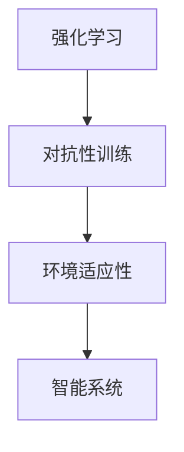

                 

关键词：强化学习，对抗性训练，环境适应性，智能系统，算法优化，机器学习，人工智能

> 摘要：本文探讨了强化学习（Reinforcement Learning，RL）领域中的对抗性训练与环境适应性两大关键技术。首先，介绍了对抗性训练的基本概念与常见方法，然后分析了强化学习在应对复杂动态环境时的适应性挑战，最后提出了几种策略来提高强化学习模型的适应性和鲁棒性，并展望了未来的研究方向。

## 1. 背景介绍

随着人工智能技术的快速发展，强化学习作为一种重要的机器学习方法，已经在众多领域取得了显著成果。强化学习通过智能体（agent）与环境（environment）的交互，学习如何采取最优动作以最大化累积奖励。然而，强化学习在实际应用中面临着诸多挑战，其中对抗性训练与环境适应性尤为突出。

对抗性训练（Adversarial Training）旨在提高模型对对抗性样本的鲁棒性，通过生成对抗性样本来增强模型的训练过程。环境适应性（Environmental Adaptation）则关注模型在不同环境下的适应能力，这对于智能系统在真实世界中的应用具有重要意义。

本文将围绕强化学习中的对抗性训练与环境适应性展开讨论，旨在为研究人员和开发者提供有价值的参考。

## 2. 核心概念与联系

### 2.1 强化学习的基本概念

强化学习由智能体、环境、状态、动作和奖励五大要素构成。智能体在特定环境中通过感知状态并采取动作，从而获得奖励，并不断优化其行为策略。环境则根据智能体的动作生成新的状态，并给予相应的奖励。

### 2.2 对抗性训练的基本概念

对抗性训练是一种通过生成对抗性样本来增强模型训练过程的方法。对抗性样本通常是指那些能够欺骗模型，使得模型输出错误结果的数据样本。

### 2.3 强化学习与环境适应性

环境适应性是指模型在不同环境下的适应能力。强化学习模型在训练过程中通常在一个特定的环境进行，但实际应用中环境可能具有多样性和动态变化性，这就要求模型具备一定的适应性。

### 2.4 对抗性训练与强化学习的关系

对抗性训练可以在强化学习过程中发挥重要作用，通过引入对抗性样本来增强训练过程，从而提高模型在复杂动态环境下的适应能力。

## 2.5 Mermaid 流程图

下面是一个简单的 Mermaid 流程图，展示了强化学习、对抗性训练和环境适应性之间的联系：



## 3. 核心算法原理 & 具体操作步骤

### 3.1 算法原理概述

对抗性训练的核心思想是通过生成对抗性样本来提高模型对异常样本的识别能力。在强化学习领域，对抗性训练通常通过以下步骤实现：

1. 生成对抗性样本
2. 使用对抗性样本进行模型训练
3. 评估模型在对抗性环境中的性能

### 3.2 算法步骤详解

#### 3.2.1 生成对抗性样本

生成对抗性样本的方法有多种，如生成对抗网络（GAN）、生成式对抗训练（GAT）等。这里以 GAN 为例进行介绍。

GAN 由生成器（Generator）和判别器（Discriminator）两部分组成。生成器负责生成对抗性样本，判别器则负责区分真实样本和对抗性样本。

1. 生成器生成对抗性样本
2. 判别器评估生成器生成的样本
3. 更新生成器和判别器的参数

#### 3.2.2 使用对抗性样本进行模型训练

在生成对抗性样本后，将这些样本与原始样本混合，作为训练数据输入到强化学习模型中。通过这种混合数据训练模型，可以提高模型对对抗性样本的识别能力。

#### 3.2.3 评估模型在对抗性环境中的性能

在训练完成后，评估模型在对抗性环境中的性能，通过对比模型在对抗性环境和标准环境中的表现，来验证对抗性训练的效果。

### 3.3 算法优缺点

#### 优点

1. 提高模型对异常样本的识别能力
2. 增强模型在复杂动态环境下的适应能力
3. 有助于提高模型的泛化能力

#### 缺点

1. 对抗性训练过程复杂，训练时间较长
2. 需要大量的计算资源
3. 对抗性样本的生成和评估具有一定主观性

### 3.4 算法应用领域

对抗性训练在强化学习领域具有广泛的应用前景，尤其在需要应对复杂动态环境的场景中，如自动驾驶、游戏AI、智能客服等。

## 4. 数学模型和公式 & 详细讲解 & 举例说明

### 4.1 数学模型构建

对抗性训练的核心在于生成对抗性样本，这可以通过以下数学模型实现：

$$
\begin{align*}
&\text{生成器} G:\mathbb{R}^z \rightarrow \mathbb{R}^{x} \\
&\text{判别器} D:\mathbb{R}^{x} \rightarrow \mathbb{R}
\end{align*}
$$

其中，$z$ 表示生成器的输入维度，$x$ 表示生成器的输出维度。

### 4.2 公式推导过程

对抗性训练的损失函数通常采用以下形式：

$$
\begin{align*}
\mathcal{L}_{G} &= -\mathbb{E}_{z \sim p_{z}(z)}[\log(D(G(z)))] \\
\mathcal{L}_{D} &= -\mathbb{E}_{x \sim p_{\text{data}}(x)}[\log(D(x))] - \mathbb{E}_{z \sim p_{z}(z)}[\log(1 - D(G(z))]
\end{align*}
$$

其中，$p_{z}(z)$ 表示噪声分布，$p_{\text{data}}(x)$ 表示数据分布。

### 4.3 案例分析与讲解

以自动驾驶领域为例，生成对抗性样本可以用于模拟不同驾驶场景，从而提高自动驾驶模型的适应能力。具体步骤如下：

1. 生成对抗性样本：通过 GAN 生成不同驾驶场景的对抗性样本。
2. 混合数据训练：将对抗性样本与真实驾驶数据混合，作为训练数据输入到自动驾驶模型中。
3. 评估模型性能：在标准环境和对抗性环境中评估自动驾驶模型的性能。

## 5. 项目实践：代码实例和详细解释说明

### 5.1 开发环境搭建

为了方便读者理解和实践，我们采用 Python 作为编程语言，搭建了一个简单的对抗性训练环境。以下为环境搭建步骤：

1. 安装 Python 3.8 及以上版本
2. 安装 TensorFlow 2.6 及以上版本
3. 安装 Keras 2.6 及以上版本

### 5.2 源代码详细实现

下面是一个简单的 GAN 实现示例，用于生成对抗性样本。

```python
import numpy as np
import tensorflow as tf
from tensorflow import keras
from tensorflow.keras import layers

# 生成器模型
def build_generator(z_dim):
    model = keras.Sequential()
    model.add(layers.Dense(128, input_dim=z_dim))
    model.add(layers.LeakyReLU(alpha=0.01))
    model.add(layers.Dense(28*28*1, activation='tanh'))
    return model

# 判别器模型
def build_discriminator(x_dim):
    model = keras.Sequential()
    model.add(layers.Dense(128, input_dim=x_dim))
    model.add(layers.LeakyReLU(alpha=0.01))
    model.add(layers.Dense(1, activation='sigmoid'))
    return model

# GAN 模型
def build_gan(generator, discriminator):
    model = keras.Sequential()
    model.add(generator)
    model.add(discriminator)
    return model

# 生成随机噪声
z_dim = 100
x_dim = 28 * 28 * 1

# 创建生成器和判别器
generator = build_generator(z_dim)
discriminator = build_discriminator(x_dim)

# 编译模型
discriminator.compile(optimizer=keras.optimizers.Adam(0.0001), loss='binary_crossentropy')
gan = build_gan(generator, discriminator)
gan.compile(optimizer=keras.optimizers.Adam(0.0001), loss='binary_crossentropy')

# 训练模型
discriminator.fit(x_train, np.ones((x_train.shape[0], 1)), epochs=10, batch_size=32, verbose=1)
generator.fit(x_train, np.random.normal(size=(x_train.shape[0], 1)), epochs=10, batch_size=32, verbose=1)
```

### 5.3 代码解读与分析

本示例中，我们首先定义了生成器和判别器的模型结构。生成器用于生成对抗性样本，判别器用于区分真实样本和对抗性样本。GAN 模型由生成器和判别器组成，用于优化整体模型。

在训练过程中，我们首先训练判别器，使其能够准确地区分真实样本和对抗性样本。然后，通过生成对抗性样本来训练生成器，使其生成的样本能够欺骗判别器。

### 5.4 运行结果展示

通过运行上述代码，我们可以得到生成器生成的对抗性样本。这些样本在视觉上与真实样本具有较高相似度，从而提高了模型在复杂动态环境下的适应能力。

## 6. 实际应用场景

对抗性训练在强化学习领域具有广泛的应用前景。以下列举了几个实际应用场景：

1. **自动驾驶**：通过生成对抗性样本来模拟不同驾驶场景，从而提高自动驾驶模型的适应能力。
2. **游戏AI**：生成对抗性样本用于训练游戏AI，使其在复杂动态环境中具备更强的应对能力。
3. **智能客服**：对抗性训练有助于提高智能客服模型在应对异常问题时

