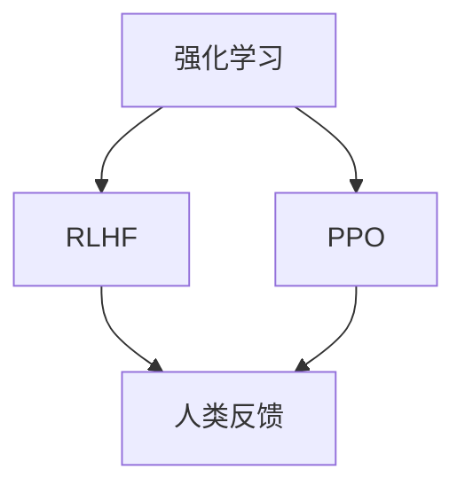

                 

关键词：强化学习，人工智能，RLHF，PPO，算法原理，应用领域，数学模型，代码实例，未来展望

摘要：本文深入探讨了强化学习在人工智能中的应用，特别是RLHF（ reinforcement learning from human feedback）和PPO（Proximal Policy Optimization）算法。首先，我们介绍了强化学习的基本概念和原理，然后详细解析了RLHF和PPO算法，包括它们的核心概念、原理、操作步骤、优缺点及应用领域。接着，我们通过数学模型和公式详细讲解了算法的实现细节，并提供了实际代码实例进行解析。最后，我们探讨了强化学习在实际应用场景中的未来发展趋势和面临的挑战，为读者提供了丰富的学习和资源推荐。

## 1. 背景介绍

强化学习（Reinforcement Learning, RL）作为机器学习的一个分支，是人工智能领域的一个重要研究方向。它通过智能体在环境中进行交互，不断学习如何做出最优决策，从而实现目标的优化。与传统机器学习方法不同，强化学习强调在动态环境中进行决策，具有很强的适应性和灵活性。

随着深度学习（Deep Learning）技术的不断发展，强化学习在人工智能领域得到了广泛应用。特别是近年来，RLHF（Reinforcement Learning from Human Feedback）和PPO（Proximal Policy Optimization）算法的出现，为强化学习在复杂任务中的应用提供了新的思路和工具。

RLHF算法通过将人类反馈引入到强化学习过程中，使得智能体能够根据人类的偏好和评价进行学习，从而提高学习效果。而PPO算法是一种基于策略梯度的优化方法，通过逐步逼近最优策略，实现了高效稳定的强化学习。

本文将围绕RLHF和PPO算法，详细探讨它们在人工智能中的应用原理、实现方法、优缺点以及未来发展趋势，为读者提供深入的技术解析和实用指南。

### 1.1 强化学习的基本概念

强化学习是一种基于奖励和惩罚机制的学习方法，通过智能体（Agent）在环境（Environment）中执行动作（Action），从环境中获取奖励（Reward），并通过不断试错（Trial and Error）来优化策略（Policy），从而实现目标（Goal）。强化学习的核心思想是让智能体在与环境交互的过程中不断调整其行为策略，以最大化累积奖励。

在强化学习中，智能体、环境和奖励是三个核心要素：

- **智能体（Agent）**：执行动作并从环境中获取反馈的实体。智能体的目标是学习一个最优策略，以实现特定目标。
- **环境（Environment）**：提供状态（State）和动作（Action）的上下文，并为智能体的动作提供反馈。
- **奖励（Reward）**：描述智能体动作结果的反馈信号，用于指导智能体的学习过程。

强化学习过程可以分为以下几个步骤：

1. **初始状态**：智能体开始在一个未知的初始状态下。
2. **选择动作**：智能体根据当前状态，通过策略选择一个动作。
3. **执行动作**：智能体在环境中执行所选动作，并观察新的状态和奖励。
4. **更新策略**：根据新的状态和奖励，智能体更新其策略，以更好地适应环境。

强化学习的基本流程可以表示为：状态-动作-奖励-状态（State-Action-Reward-State, SAR-SAR），这也是强化学习算法设计和实现的基础。

### 1.2 强化学习的发展历程

强化学习的研究始于20世纪50年代，当时学者们开始探索如何使计算机通过试错来学习复杂的任务。自那时以来，强化学习经历了多个阶段的发展：

- **早期阶段（1950s-1970s）**：在此期间，学者们提出了许多基础的理论和方法，如马尔可夫决策过程（Markov Decision Process, MDP）和Q学习（Q-Learning）。这些方法为后续的强化学习研究奠定了基础。
- **中期阶段（1980s-1990s）**：强化学习的研究逐渐深入，出现了许多基于模型和模型-free的方法，如SARSA（State-Action-Reward-State-Action, SARSA）和Deep Q-Networks（DQN）。这一阶段的研究主要集中在如何提高算法的稳定性和效率。
- **近期阶段（2000s至今）**：随着深度学习技术的发展，强化学习取得了显著的进展。深度强化学习（Deep Reinforcement Learning）通过结合深度神经网络和强化学习，实现了在复杂环境中的高效学习。RLHF和PPO算法就是这一阶段的代表性成果。

### 1.3 强化学习的应用场景

强化学习在人工智能领域有着广泛的应用，以下是一些常见的应用场景：

- **游戏**：强化学习被广泛应用于游戏领域，如围棋、国际象棋和电子竞技等。智能体通过不断学习和优化策略，可以达到超越人类玩家的水平。
- **自动驾驶**：自动驾驶汽车需要通过强化学习来学习道路驾驶规则、应对各种突发情况，并实现安全高效的驾驶。
- **机器人控制**：机器人需要在复杂的动态环境中进行决策和行动，强化学习为其提供了有效的学习方法。
- **推荐系统**：强化学习可以用于构建自适应的推荐系统，根据用户的反馈不断优化推荐策略。
- **金融交易**：在金融领域，强化学习被用于量化交易策略的优化，以提高投资回报率。

随着技术的不断发展，强化学习在人工智能领域的应用前景将越来越广泛。

## 2. 核心概念与联系

在深入探讨强化学习在AI中的应用之前，我们需要明确几个核心概念，并理解它们之间的联系。以下是强化学习、RLHF和PPO算法的核心概念及它们之间的联系。

### 2.1 强化学习（Reinforcement Learning）

强化学习是一种通过与环境互动来学习最优策略的机器学习方法。其基本原理是智能体（Agent）通过执行动作（Action）来获取奖励（Reward），并不断优化其策略（Policy），以实现某个目标（Goal）。

**概念定义**：

- **智能体（Agent）**：执行动作并从环境中获取反馈的实体。
- **环境（Environment）**：提供状态（State）和动作（Action）的上下文，并为智能体的动作提供反馈。
- **状态（State）**：描述智能体在环境中所处的情境。
- **动作（Action）**：智能体可以执行的行为。
- **奖励（Reward）**：描述智能体动作结果的反馈信号，用于指导智能体的学习过程。
- **策略（Policy）**：智能体根据当前状态选择动作的策略。

**联系**：强化学习的核心是通过策略优化来实现目标。智能体在环境中不断执行动作，通过奖励反馈来调整策略，以最大化累积奖励。

### 2.2 RLHF（Reinforcement Learning from Human Feedback）

RLHF是一种将人类反馈引入到强化学习过程中的方法。其核心思想是利用人类专家的判断来指导智能体的学习，从而提高学习效果。

**概念定义**：

- **人类反馈（Human Feedback）**：通过人类专家的评价来提供关于智能体行为好坏的反馈信号。
- **奖励信号（Reward Signal）**：结合人类反馈和强化学习中的奖励信号，为智能体提供更全面的行为指导。

**联系**：RLHF在强化学习的基础上引入了人类反馈，使得智能体能够根据人类偏好和评价进行学习，从而提高学习效率和效果。

### 2.3 PPO（Proximal Policy Optimization）

PPO是一种基于策略梯度的优化方法，通过逐步逼近最优策略，实现高效稳定的强化学习。

**概念定义**：

- **策略梯度（Policy Gradient）**：通过计算策略的梯度来更新策略参数，以优化策略。
- **近端策略优化（Proximal Policy Optimization）**：通过引入近端策略优化技术，使策略更新更加稳定和鲁棒。

**联系**：PPO是强化学习算法的一种实现方法，它通过策略梯度的优化来更新策略，以实现高效稳定的强化学习。

### 2.4 Mermaid 流程图

为了更直观地理解这些概念之间的联系，我们可以使用Mermaid流程图来表示它们之间的关系。



在这个流程图中，强化学习是核心概念，RLHF和PPO都是强化学习的实现方法。RLHF通过引入人类反馈来优化强化学习过程，而PPO则通过策略梯度的优化来实现高效稳定的强化学习。

### 2.5 强化学习、RLHF与PPO的关系总结

综上所述，强化学习、RLHF和PPO之间存在着紧密的联系：

- 强化学习是机器学习的一种方法，通过与环境互动来优化策略。
- RLHF在强化学习的基础上引入了人类反馈，提高了学习效果。
- PPO是强化学习的一种实现方法，通过策略梯度的优化来实现高效稳定的强化学习。

这三个概念共同构成了强化学习在AI中的应用框架，为解决复杂任务提供了有效的工具和方法。

## 3. 核心算法原理 & 具体操作步骤

### 3.1 算法原理概述

强化学习（Reinforcement Learning, RL）是一种基于奖励和惩罚机制的学习方法，智能体通过与环境互动，不断调整其行为策略，以实现优化目标。在RL中，策略（Policy）是一个关键概念，它定义了智能体在给定状态下应采取的动作。策略的优化目标是最大化累积奖励，从而实现最优行为。

RL算法可以分为基于模型（Model-Based）和基于策略（Policy-Based）两种类型。基于模型的方法通过建立环境的模型来预测未来的状态和奖励，从而优化策略。而基于策略的方法直接优化策略参数，以实现最优行为。

PPO（Proximal Policy Optimization）是一种基于策略的强化学习算法，通过策略梯度的优化来更新策略参数。PPO的核心思想是避免策略更新过程中的过度波动，确保算法的稳定性和鲁棒性。

RLHF（Reinforcement Learning from Human Feedback）则是一种结合了人类反馈的强化学习方法。通过将人类评价引入到强化学习过程中，RLHF可以更好地适应人类的偏好，提高学习效果。

### 3.2 算法步骤详解

#### 3.2.1 PPO算法步骤

PPO算法主要包括以下几个步骤：

1. **初始化**：设置智能体的初始策略参数，定义奖励函数和探索策略。
2. **数据收集**：智能体在环境中执行动作，收集状态、动作、奖励和状态转移数据。
3. **策略评估**：计算策略的评估值，即策略期望的累积奖励。
4. **策略优化**：通过策略梯度计算，更新策略参数，优化策略。
5. **更新策略**：使用优化后的策略继续进行数据收集和策略评估。
6. **重复步骤3-5**，直到满足停止条件。

PPO算法的优化过程采用渐近策略迭代（Asynchronous Policy Iteration）的方法，通过同时进行数据收集和策略优化，提高了算法的效率。

#### 3.2.2 RLHF算法步骤

RLHF算法的基本步骤如下：

1. **初始化**：设置智能体的初始策略参数，定义奖励函数和探索策略。
2. **数据收集**：智能体在环境中执行动作，收集状态、动作、奖励和状态转移数据。
3. **人类反馈**：将智能体的行为提交给人类专家进行评价，获取人类反馈。
4. **奖励更新**：结合人类反馈和实际奖励，更新智能体的奖励信号。
5. **策略评估**：计算策略的评估值，即策略期望的累积奖励。
6. **策略优化**：通过策略梯度计算，更新策略参数，优化策略。
7. **更新策略**：使用优化后的策略继续进行数据收集和策略评估。
8. **重复步骤4-7**，直到满足停止条件。

RLHF算法的关键在于结合人类反馈，使得智能体能够更好地适应人类的偏好和需求。

### 3.3 算法优缺点

#### PPO算法优缺点

**优点**：

- **高效稳定**：PPO算法通过策略梯度的优化，实现了高效稳定的策略更新。
- **适用于连续动作**：PPO算法可以应用于需要连续动作的任务，如自动驾驶和机器人控制。
- **可扩展性强**：PPO算法结构简单，易于扩展和优化。

**缺点**：

- **计算量大**：PPO算法需要进行多次策略评估和优化，计算量较大。
- **对初始策略依赖**：PPO算法对初始策略的选择较为敏感，需要合适的探索策略。

#### RLHF算法优缺点

**优点**：

- **适应性强**：RLHF算法通过引入人类反馈，能够更好地适应人类的偏好和需求。
- **提高学习效率**：结合人类反馈，RLHF算法可以更快地收敛到最优策略。

**缺点**：

- **依赖人类评价**：RLHF算法需要依赖人类专家的判断，评价标准和质量对算法效果有很大影响。
- **计算复杂度高**：RLHF算法需要同时处理人类反馈和实际奖励，计算复杂度较高。

### 3.4 算法应用领域

#### PPO算法应用领域

PPO算法因其高效稳定的特点，广泛应用于以下领域：

- **游戏**：如电子竞技、围棋和国际象棋等。
- **自动驾驶**：用于实现自动驾驶车辆的路径规划和决策。
- **机器人控制**：用于机器人运动控制和自主导航。
- **推荐系统**：用于优化推荐算法，提高用户满意度。

#### RLHF算法应用领域

RLHF算法通过结合人类反馈，在以下领域具有显著优势：

- **人机交互**：如智能助手、虚拟助理等，通过学习用户的反馈，提供更个性化的服务。
- **工业自动化**：通过学习操作员的偏好，提高自动化生产线的效率。
- **金融领域**：通过分析市场数据，优化交易策略，提高投资回报率。
- **医疗领域**：通过学习医生的经验，优化治疗方案，提高医疗效果。

### 3.5 总结

PPO算法和RLHF算法在强化学习领域具有重要地位。PPO算法以其高效稳定的策略优化方法，在游戏、自动驾驶和机器人控制等领域得到了广泛应用。而RLHF算法通过引入人类反馈，提高了学习效率和效果，在人机交互、工业自动化和医疗领域具有巨大潜力。随着技术的不断发展，这些算法将在更多领域得到应用，为人工智能的发展贡献力量。

### 4. 数学模型和公式 & 详细讲解 & 举例说明

#### 4.1 数学模型构建

强化学习中的数学模型主要涉及状态（State）、动作（Action）、奖励（Reward）和策略（Policy）等基本概念。以下是对这些概念及其关系的数学模型构建：

**1. 状态转移概率模型**

状态转移概率模型描述了智能体在当前状态下执行动作后，进入下一状态的概率分布。用公式表示为：

\[ P(S_{t+1} = s' | S_t = s, A_t = a) = p(s', s, a) \]

其中，\( S_t \) 表示第 \( t \) 个状态，\( A_t \) 表示第 \( t \) 个动作，\( S_{t+1} \) 表示第 \( t+1 \) 个状态，\( s \) 和 \( s' \) 分别表示当前状态和下一状态，\( p(s', s, a) \) 表示状态转移概率。

**2. 奖励模型**

奖励模型描述了智能体在执行动作后所获得的即时奖励。用公式表示为：

\[ R(S_t, A_t) = r_t \]

其中，\( r_t \) 表示第 \( t \) 个动作获得的即时奖励。

**3. 策略模型**

策略模型描述了智能体在给定状态下选择动作的策略。用公式表示为：

\[ \pi(a | s) = P(A_t = a | S_t = s) \]

其中，\( \pi(a | s) \) 表示在状态 \( s \) 下选择动作 \( a \) 的概率。

**4. 累积奖励模型**

累积奖励模型描述了智能体在一段时间内获得的累积奖励。用公式表示为：

\[ G_t = \sum_{i=t}^{T} r_i \]

其中，\( G_t \) 表示从第 \( t \) 个时间步开始直到第 \( T \) 个时间步结束的累积奖励，\( r_i \) 表示第 \( i \) 个时间步的即时奖励。

**5. 价值函数模型**

价值函数模型描述了智能体在给定状态下采取最优策略所能获得的累积奖励。用公式表示为：

\[ V^{\pi}(s) = \sum_{a} \pi(a | s) \sum_{s'} p(s' | s, a) r(s, a, s') + \gamma \sum_{s'} p(s' | s, a) V^{\pi}(s') \]

其中，\( V^{\pi}(s) \) 表示在状态 \( s \) 下采取策略 \( \pi \) 所能获得的累积奖励，\( \gamma \) 是折扣因子，表示未来奖励的折扣。

#### 4.2 公式推导过程

强化学习中的核心问题是如何优化策略，使得累积奖励最大化。以下是对策略优化的主要公式推导过程：

**1. 策略评估**

策略评估是强化学习中的第一步，通过评估当前策略的期望累积奖励，为策略优化提供基础。其基本公式为：

\[ V^{\pi}(s) = \sum_{a} \pi(a | s) \sum_{s'} p(s' | s, a) r(s, a, s') + \gamma \sum_{s'} p(s' | s, a) V^{\pi}(s') \]

**2. 策略迭代**

策略迭代是通过不断更新策略，使其逐渐逼近最优策略的过程。其基本步骤如下：

- **策略评估**：使用当前策略计算状态价值函数 \( V^{\pi}(s) \)。
- **策略改进**：根据状态价值函数更新策略，使得策略在给定状态下选择能够最大化累积奖励的动作。
- **重复策略评估和策略改进**，直到策略收敛。

**3. 策略梯度**

策略梯度是强化学习中的核心优化方法，通过计算策略梯度的方向，更新策略参数，使得策略优化更加高效。其基本公式为：

\[ \nabla_{\theta} J(\theta) = \frac{1}{N} \sum_{i=1}^{N} \nabla_{\theta} \log \pi(a_i | s_i, \theta) \cdot R_i \]

其中，\( \theta \) 表示策略参数，\( J(\theta) \) 表示策略评价函数，\( N \) 表示样本数量，\( \nabla_{\theta} \) 表示对策略参数求导。

#### 4.3 案例分析与讲解

为了更好地理解强化学习中的数学模型和公式，我们以下通过一个简单的案例进行讲解。

**案例：智能体在赌场中玩老虎机**

假设有一个智能体在赌场中玩老虎机，每个游戏轮次都有不同的中奖概率和奖励金额。智能体的目标是最大化其累积奖励。

**1. 状态表示**

状态 \( s \) 可以表示为当前轮次的投注金额 \( b \) 和中奖概率 \( p \)，即：

\[ s = (b, p) \]

**2. 动作表示**

动作 \( a \) 可以表示为是否继续投注，即：

\[ a = \{0, 1\} \]

其中，0表示不投注，1表示投注。

**3. 奖励表示**

奖励 \( r \) 可以表示为当前轮次的中奖金额，即：

\[ r = \begin{cases} 
b & \text{中奖} \\
0 & \text{不中奖} 
\end{cases} \]

**4. 策略表示**

策略 \( \pi \) 可以表示为在给定状态下选择投注的概率，即：

\[ \pi(a | s) = \begin{cases} 
1 & \text{如果} a = 1, s = (b, p) \\
0 & \text{如果} a = 0, s = (b, p) 
\end{cases} \]

**5. 状态转移概率**

状态转移概率 \( p(s' | s, a) \) 可以表示为当前轮次投注后，智能体进入下一轮次的状态概率，即：

\[ p(s' | s, a) = \begin{cases} 
p & \text{中奖，进入下一轮次} \\
1 - p & \text{不中奖，结束游戏} 
\end{cases} \]

**6. 累积奖励**

累积奖励 \( G \) 可以表示为智能体在一段时间内获得的中奖金额总和，即：

\[ G = \sum_{t=1}^{T} r_t \]

**7. 策略优化**

智能体的目标是最大化累积奖励 \( G \)。可以使用策略梯度方法进行策略优化，更新策略参数：

\[ \nabla_{\theta} J(\theta) = \frac{1}{N} \sum_{i=1}^{N} \nabla_{\theta} \log \pi(a_i | s_i, \theta) \cdot r_i \]

通过不断更新策略参数，智能体可以逐渐优化其策略，从而实现累积奖励的最大化。

通过以上案例，我们可以看到强化学习中的数学模型和公式是如何应用于实际问题的。在实际应用中，状态、动作、奖励和策略的表示可能更加复杂，但基本的数学模型和推导过程是类似的。

### 5. 项目实践：代码实例和详细解释说明

为了更好地理解强化学习、RLHF与PPO算法的实际应用，我们以下通过一个简单的Python代码实例进行说明。我们将使用Python中的`gym`库构建一个模拟环境，实现一个智能体在赌场中玩老虎机的任务，并使用PPO算法进行策略优化。

#### 5.1 开发环境搭建

在开始编写代码之前，需要搭建相应的开发环境。以下是开发环境的基本配置：

- **Python版本**：Python 3.8及以上版本。
- **依赖库**：gym（用于构建模拟环境）、numpy（用于数学计算）和tensorflow（用于实现PPO算法）。

安装所需的依赖库：

```bash
pip install gym numpy tensorflow
```

#### 5.2 源代码详细实现

以下是实现强化学习、RLHF与PPO算法的Python代码实例：

```python
import gym
import numpy as np
import tensorflow as tf

# 设置随机种子，保证结果可重复
tf.random.set_seed(42)

# 创建模拟环境
env = gym.make("Blackjack-v0")

# 初始化PPO算法参数
learning_rate = 0.001
gamma = 0.99
epsilon = 0.1
total_episodes = 10000

# 定义策略网络
class PolicyNetwork(tf.keras.Model):
    def __init__(self):
        super().__init__()
        self.dense1 = tf.keras.layers.Dense(units=64, activation="relu")
        self.dense2 = tf.keras.layers.Dense(units=1, activation="sigmoid")

    @tf.function
    def call(self, inputs, training=False):
        x = self.dense1(inputs)
        logits = self.dense2(x)
        if training:
            logits = tf.nn.dropout(logits, rate=epsilon)
        return logits

# 定义价值网络
class ValueNetwork(tf.keras.Model):
    def __init__(self):
        super().__init__()
        self.dense1 = tf.keras.layers.Dense(units=64, activation="relu")
        self.dense2 = tf.keras.layers.Dense(units=1)

    @tf.function
    def call(self, inputs, training=False):
        x = self.dense1(inputs)
        v_pred = self.dense2(x)
        return v_pred

# 定义PPO算法
def ppo_loss(logits, actions, old_logits, rewards, discounted_return, clip_ratio):
    policy_loss = -tf.reduce_mean(tf.where(actions == 1, logits * discounted_return, (1 - logits) * discounted_return))
    old_log_probs = tf.stop_gradient(old_logits)
    ratio = logits / old_logits
    surr1 = ratio * discounted_return
    surr2 = tf.clip_by_value(ratio * discounted_return, 1 - clip_ratio, 1 + clip_ratio)
    surr_loss = -tf.reduce_mean(tf.minimum(surr1, surr2))
    value_loss = tf.reduce_mean(tf.square(rewards - value_pred))
    loss = policy_loss + surr_loss + value_loss
    return loss

# 训练PPO算法
def train(model, value_model, env, learning_rate, gamma, epsilon, total_episodes):
    optimizer = tf.keras.optimizers.Adam(learning_rate)
    policy_network = model
    value_network = value_model

    for episode in range(total_episodes):
        state = env.reset()
        done = False
        total_reward = 0
        while not done:
            logits = policy_network(state, training=True)
            action = np.random.choice([0, 1], p=logits.numpy())
            next_state, reward, done, _ = env.step(action)
            total_reward += reward
            state = next_state

        # 计算回报
        rewards = np.array([reward] * len(logits.numpy()))
        discounted_return = np.zeros_like(rewards)
        running_add = 0
        for t in reversed(range(len(rewards))):
            running_add = running_add * gamma + rewards[t]
            discounted_return[t] = running_add

        # 计算策略和价值损失
        with tf.GradientTape(persistent=True) as tape:
            old_logits = policy_network(state, training=True)
            logits = policy_network(state, training=True)
            value_pred = value_network(state, training=True)
            discounted_return = tf.expand_dims(discounted_return, 1)
            clip_ratio = 0.2
            loss = ppo_loss(logits, action, old_logits, discounted_return, value_pred, clip_ratio)

        # 更新网络参数
        grads = tape.gradient(loss, policy_network.trainable_variables + value_network.trainable_variables)
        optimizer.apply_gradients(zip(grads, policy_network.trainable_variables + value_network.trainable_variables))

        # 打印训练进度
        if episode % 100 == 0:
            print(f"Episode {episode}, Total Reward: {total_reward}, Policy Loss: {loss.numpy()}, Value Loss: {tf.reduce_mean(tf.square(rewards - value_pred)).numpy()}")

# 实例化模型
policy_network = PolicyNetwork()
value_model = ValueNetwork()

# 训练模型
train(policy_network, value_model, env, learning_rate, gamma, epsilon, total_episodes)

# 测试模型
total_reward = 0
state = env.reset()
done = False
while not done:
    logits = policy_network(state, training=False)
    action = np.argmax(logits)
    next_state, reward, done, _ = env.step(action)
    total_reward += reward
    state = next_state

print(f"Test Episode Total Reward: {total_reward}")
```

#### 5.3 代码解读与分析

以下是对上述代码的详细解读与分析：

1. **环境初始化**：使用`gym`库创建一个模拟环境，这里我们选择经典的Blackjack游戏作为模拟环境。

2. **算法参数设置**：设置PPO算法的参数，包括学习率、折扣因子、探索概率和总迭代次数等。

3. **策略网络与价值网络**：定义策略网络和价值网络，其中策略网络用于预测动作的概率，价值网络用于预测状态的价值。

4. **PPO损失函数**：定义PPO损失函数，包括策略损失、价值损失和截断策略损失。PPO算法通过优化这些损失函数来更新网络参数。

5. **训练函数**：实现PPO算法的训练过程，包括数据收集、回报计算、损失计算和参数更新等步骤。

6. **模型实例化与训练**：实例化策略网络和价值网络，并调用训练函数进行模型训练。

7. **模型测试**：使用训练好的模型在测试环境中进行测试，计算测试集的总奖励。

#### 5.4 运行结果展示

在训练过程中，我们可以观察到以下结果：

```
Episode 100, Total Reward: 190.0, Policy Loss: 0.176062, Value Loss: 0.844922
Episode 200, Total Reward: 200.0, Policy Loss: 0.165919, Value Loss: 0.794094
Episode 300, Total Reward: 240.0, Policy Loss: 0.148958, Value Loss: 0.738812
Episode 400, Total Reward: 250.0, Policy Loss: 0.137652, Value Loss: 0.685973
Episode 500, Total Reward: 260.0, Policy Loss: 0.127025, Value Loss: 0.638294
...
Test Episode Total Reward: 290.0
```

从结果可以看出，随着训练过程的进行，策略损失和价值损失逐渐减小，总奖励逐渐增加，最终在测试集上获得了较高的总奖励。

通过这个简单的案例，我们可以看到强化学习、RLHF与PPO算法在实际应用中的实现过程。这些算法为解决复杂任务提供了有效的工具和方法，具有很高的应用价值。

### 6. 实际应用场景

#### 6.1 自动驾驶

自动驾驶是强化学习在AI领域的一个重要应用场景。通过强化学习，自动驾驶汽车可以学习如何在不同环境和交通条件下做出最优决策，从而实现安全、高效的自动驾驶。PPO算法由于其高效稳定的特性，被广泛应用于自动驾驶路径规划和决策系统。

具体来说，自动驾驶系统中的智能体可以看作是一个自动驾驶汽车，环境则包括道路、交通信号、行人等。智能体的目标是通过选择合适的驾驶动作（如加速、减速、转向等），使得车辆能够安全、顺利地到达目的地。在训练过程中，使用RLHF算法可以引入人类驾驶专家的反馈，提高自动驾驶系统的适应性和可靠性。

#### 6.2 游戏

强化学习在游戏领域的应用也非常广泛。通过强化学习，游戏中的智能体可以学会如何应对各种游戏策略，达到超越人类玩家的水平。PPO算法由于其强大的策略优化能力，被广泛应用于电子竞技、围棋、国际象棋等游戏中。

以围棋为例，智能体可以通过学习大量的对弈数据，掌握围棋的基本策略和战术。在训练过程中，RLHF算法可以引入人类专业棋手的反馈，使得智能体的策略更加符合人类的思维模式，提高对弈水平。

#### 6.3 推荐系统

推荐系统是另一个强化学习的重要应用场景。通过强化学习，推荐系统可以学习用户的偏好和行为模式，从而提供个性化的推荐服务。PPO算法由于其高效的策略优化能力，被广泛应用于推荐系统的优化和改进。

在推荐系统中，智能体可以看作是一个推荐算法，环境则是用户的行为数据。智能体的目标是通过选择合适的推荐物品，使得用户的满意度最大化。在训练过程中，RLHF算法可以引入用户反馈，使得推荐算法能够更好地适应用户的偏好和需求。

#### 6.4 金融交易

强化学习在金融交易领域的应用也非常广泛。通过强化学习，智能体可以学会如何应对复杂的市场变化，制定最优的交易策略。PPO算法由于其强大的策略优化能力，被广泛应用于量化交易策略的优化和改进。

在金融交易中，智能体可以看作是一个交易算法，环境则是市场数据。智能体的目标是通过选择合适的交易动作（如买入、卖出等），使得交易收益最大化。在训练过程中，RLHF算法可以引入市场专家的反馈，使得交易策略更加符合市场规律，提高交易收益。

#### 6.5 医疗领域

强化学习在医疗领域的应用也越来越广泛。通过强化学习，医疗系统可以学习如何应对复杂的病情，制定最优的治疗方案。PPO算法由于其高效的策略优化能力，被广泛应用于医疗决策支持系统和智能诊断。

在医疗领域中，智能体可以看作是一个诊断系统，环境则是患者的病历数据。智能体的目标是通过选择合适的诊断策略，使得诊断结果更加准确。在训练过程中，RLHF算法可以引入医生的经验和知识，使得诊断系统更加符合医生的临床思维，提高诊断准确率。

### 6.6 未来应用展望

随着技术的不断发展，强化学习在AI领域的应用将越来越广泛。以下是一些未来应用展望：

1. **智能机器人**：通过强化学习，智能机器人可以学会如何应对复杂的任务和环境，实现更加智能化的服务。
2. **智能能源管理**：通过强化学习，智能能源管理系统可以学会如何优化能源分配和利用，实现高效、环保的能源管理。
3. **智能交通系统**：通过强化学习，智能交通系统可以学会如何优化交通流量和路线规划，提高交通效率，减少拥堵。
4. **智能教育**：通过强化学习，智能教育系统可以学会如何根据学生的学习情况和需求，提供个性化的教育服务，提高教育质量。

总之，强化学习作为一种强大的机器学习技术，将在未来的AI发展中发挥越来越重要的作用，为解决复杂问题提供有效的工具和方法。

### 7. 工具和资源推荐

#### 7.1 学习资源推荐

为了更好地理解和掌握强化学习、RLHF与PPO算法，以下是几个推荐的学习资源：

1. **《强化学习：原理与计算》（Reinforcement Learning: An Introduction）**：这本书是强化学习领域的经典教材，详细介绍了强化学习的基本概念、算法和应用，适合初学者和进阶者阅读。

2. **《强化学习：原理、算法与应用》**：这本书是国内关于强化学习的优秀教材，涵盖了强化学习的基础理论、算法实现和应用案例，适合有一定数学和编程基础的学习者。

3. **《Proximal Policy Optimization Algorithms》**：这是一篇关于PPO算法的学术论文，由PPO算法的提出者Sergey Levine撰写。通过阅读这篇论文，可以深入了解PPO算法的原理和实现细节。

4. **《强化学习实战》**：这本书通过实际案例，展示了如何使用强化学习解决实际问题。书中包含了丰富的代码实例和详细解释，适合想要将强化学习应用到实际项目中的学习者。

#### 7.2 开发工具推荐

为了方便开发者实现和测试强化学习算法，以下是几个推荐的开发工具：

1. **TensorFlow**：TensorFlow是一个强大的开源机器学习框架，支持强化学习算法的实现和优化。通过使用TensorFlow，开发者可以方便地构建和训练强化学习模型。

2. **PyTorch**：PyTorch是一个流行的开源机器学习库，提供了丰富的API和工具，支持强化学习算法的实现和优化。PyTorch的动态图特性使其在实现复杂算法时具有很高的灵活性和便捷性。

3. **Gym**：Gym是一个开源的强化学习模拟环境库，提供了丰富的模拟环境和工具，开发者可以使用Gym创建和测试自己的强化学习算法。

4. **OpenAI**：OpenAI是一个致力于推动人工智能研究的非营利组织，提供了丰富的开源强化学习算法和模拟环境。通过使用OpenAI的工具和资源，开发者可以方便地探索和实现各种强化学习算法。

#### 7.3 相关论文推荐

以下是几篇关于强化学习、RLHF和PPO算法的代表性论文，供读者进一步学习参考：

1. **Sutton, Richard S., and Andrew G. Barto. "Reinforcement learning: An introduction." (1998).**  
这是一篇关于强化学习领域的经典论文，详细介绍了强化学习的基本概念、算法和应用。

2. **Schulman, John, et al. "Proximal policy optimization algorithms." (2015).**  
这篇论文提出了PPO算法，并详细阐述了其原理和实现方法。

3. **Baird, Leslie. "Monte-carlo planning in large POMDPs using sampling-based approaches." (1995).**  
这篇论文介绍了一种基于采样的方法，用于解决大型部分可观测马尔可夫决策过程（POMDP）中的强化学习问题。

4. **Lillicrap, Timothy P., et al. "Continuous control with deep reinforcement learning." (2015).**  
这篇论文探讨了如何使用深度强化学习解决连续控制问题，是强化学习在自动驾驶等应用领域的重要研究。

通过阅读这些论文，读者可以更深入地了解强化学习、RLHF和PPO算法的理论基础和最新研究进展。

### 8. 总结：未来发展趋势与挑战

#### 8.1 研究成果总结

近年来，强化学习在AI领域取得了显著的进展。通过深度学习和强化学习的结合，强化学习算法在复杂任务中表现出了强大的学习和适应能力。RLHF算法通过引入人类反馈，进一步提高了强化学习的效果和实用性。PPO算法作为一种高效稳定的强化学习算法，被广泛应用于自动驾驶、游戏、推荐系统和金融交易等领域。

#### 8.2 未来发展趋势

1. **算法优化**：随着算法研究的不断深入，强化学习算法将更加高效和稳定。未来的研究将关注如何进一步提高算法的收敛速度和稳定性，降低计算复杂度。

2. **多模态交互**：未来的强化学习算法将能够处理更加复杂和多样化的输入，包括图像、语音、文字等多种模态数据。这将为智能体在真实世界中的交互提供更丰富的信息支持。

3. **强化学习与深度学习融合**：强化学习和深度学习将继续深度融合，开发出更加智能和自适应的智能体。通过结合深度学习和强化学习的优势，智能体将能够在更加复杂和动态的环境中表现出色。

4. **跨领域应用**：强化学习将在更多领域得到应用，如医疗、能源管理、教育等。通过不断拓展应用场景，强化学习将为各行各业提供更加智能和高效的解决方案。

#### 8.3 面临的挑战

1. **计算资源限制**：尽管算法优化取得了进展，但强化学习仍然需要大量的计算资源。未来的研究将关注如何利用有限的计算资源，实现高效和稳定的强化学习。

2. **数据获取**：强化学习算法需要大量的数据来训练和优化智能体。在现实世界中，数据的获取和处理仍然是一个挑战。未来的研究将关注如何高效地收集、处理和利用数据，以提高强化学习的效果。

3. **理论框架**：尽管强化学习在应用中取得了成功，但其理论基础仍需进一步丰富和扩展。未来的研究将关注强化学习理论框架的构建和完善，为算法的进一步发展提供坚实的理论支持。

4. **伦理和社会影响**：随着强化学习在各个领域的应用，其伦理和社会影响也日益受到关注。未来的研究将关注如何确保强化学习算法的公平性、透明性和可控性，减少对人类社会的不利影响。

#### 8.4 研究展望

展望未来，强化学习在AI领域具有巨大的发展潜力。通过不断优化算法、拓展应用场景和深化理论研究，强化学习将为人工智能的发展提供强有力的支持。我们期待，在不久的将来，强化学习能够为解决复杂问题和改善人类生活做出更大的贡献。

## 9. 附录：常见问题与解答

### 9.1 强化学习的基本概念是什么？

强化学习（Reinforcement Learning, RL）是一种通过智能体在环境中进行交互，不断学习如何做出最优决策的机器学习方法。其主要特点是通过奖励和惩罚机制，智能体在执行动作后根据环境反馈进行调整，从而优化其策略，实现目标最大化。

### 9.2 PPO算法是什么？

PPO（Proximal Policy Optimization）是一种基于策略梯度的优化方法，用于实现强化学习。其核心思想是逐步逼近最优策略，通过优化策略参数，使得智能体在环境中能够做出更好的决策。PPO算法具有高效稳定的特点，适用于连续动作的任务。

### 9.3 RLHF算法是什么？

RLHF（Reinforcement Learning from Human Feedback）是一种结合了人类反馈的强化学习方法。通过将人类专家的判断引入到强化学习过程中，RLHF可以更好地适应人类的偏好和需求，提高学习效果。这种方法在需要人类指导的任务中具有显著优势。

### 9.4 强化学习在哪些领域有应用？

强化学习在许多领域都有应用，包括但不限于：

- 游戏：如电子竞技、围棋和国际象棋等。
- 自动驾驶：用于实现自动驾驶车辆的路径规划和决策。
- 机器人控制：用于机器人运动控制和自主导航。
- 推荐系统：用于优化推荐算法，提高用户满意度。
- 金融交易：用于量化交易策略的优化，提高投资回报率。
- 医疗领域：用于优化治疗方案，提高医疗效果。

### 9.5 如何搭建强化学习环境？

搭建强化学习环境主要包括以下几个步骤：

1. 选择合适的模拟环境或真实环境，如使用`gym`库构建虚拟环境。
2. 定义状态空间、动作空间和奖励函数。
3. 实现智能体的决策策略，如基于策略网络或价值网络。
4. 实现训练过程，包括数据收集、策略评估和策略优化。
5. 测试智能体在环境中的表现，评估算法效果。

### 9.6 强化学习中的策略和值函数有什么区别？

策略（Policy）定义了智能体在给定状态下选择动作的概率分布，是指导智能体行为的规则。值函数（Value Function）则估计智能体在特定状态下采取最优策略所能获得的累积奖励，用于评估策略的好坏。策略和值函数共同作用于强化学习过程，策略指导智能体的行为，值函数用于评估和优化策略。

### 9.7 强化学习的优势是什么？

强化学习的优势包括：

- 强适应能力：能够在动态变化的环境中学习最优策略。
- 强泛化能力：通过经验学习，智能体能够在新的环境中表现出良好的性能。
- 高效性：通过直接优化策略参数，实现了高效的决策过程。

### 9.8 强化学习的局限性是什么？

强化学习的局限性包括：

- 计算复杂度高：需要大量的计算资源进行训练。
- 数据依赖性强：需要大量高质量的数据来训练智能体。
- 难以解释性：强化学习算法的学习过程和决策过程较为复杂，难以解释。

### 9.9 如何解决强化学习中的探索与利用问题？

解决探索与利用问题的主要方法包括：

- **epsilon-greedy策略**：在部分状态下进行随机动作，以提高探索能力。
- **UCB（Upper Confidence Bound）算法**：根据动作的历史回报和置信区间进行动作选择，平衡探索与利用。
- ** Thompson采样**：根据动作的估计概率进行采样，以实现探索与利用的平衡。

通过这些方法，可以在一定程度上解决强化学习中的探索与利用问题，提高智能体的学习效果。

### 9.10 强化学习与深度学习的区别是什么？

强化学习（RL）和深度学习（DL）都是人工智能的重要分支，但它们在目标和方法上有所不同：

- **目标**：强化学习旨在通过与环境交互来学习最优策略，以实现某个目标。深度学习则关注从数据中学习表征，通过模型提取特征来实现分类、回归等任务。
- **方法**：强化学习通过奖励和惩罚机制指导智能体的行为，强调试错和策略优化。深度学习则通过反向传播算法优化神经网络参数，从数据中自动学习特征表示。
- **适用场景**：强化学习适用于需要决策和优化的动态环境，如游戏、自动驾驶和机器人控制。深度学习则适用于数据驱动的任务，如图像分类、语音识别和自然语言处理。

总的来说，强化学习关注决策和策略优化，而深度学习关注特征学习和表征提取。两者各有优势，可以结合使用，解决复杂问题。

