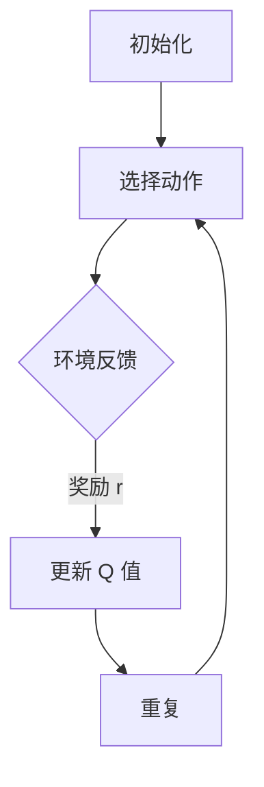

                 

强化学习算法是机器学习领域的一个重要分支，其在决策过程中强调从经验中学习，以实现长期最优策略。本文将重点介绍Q-learning算法，这是强化学习中最基本的算法之一。我们将从Q-learning的核心概念、算法原理、数学模型、应用领域等多个方面进行详细讲解，并通过代码实例展示其具体实现过程。

## 关键词

强化学习、Q-learning、策略优化、算法原理、代码实例

## 摘要

本文旨在深入解析强化学习中的Q-learning算法。首先，我们将介绍强化学习的基本概念和Q-learning算法的背景。接着，详细阐述Q-learning的核心原理，包括状态-动作值函数的概念和更新规则。之后，我们将通过数学模型和公式讲解Q-learning的推导过程，并举例说明。最后，通过一个具体的代码实例，我们将展示如何在实际项目中应用Q-learning算法，并对运行结果进行解读。

## 1. 背景介绍

强化学习（Reinforcement Learning，RL）是机器学习的一个重要分支，其目标是使一个智能体（agent）在与环境的交互过程中，通过学习获得最优策略，从而最大化累积奖励。与传统监督学习和无监督学习不同，强化学习强调通过试错（trial-and-error）的方式，从环境中获取反馈信号，不断调整其行为策略。

### 强化学习的基本概念

在强化学习中，有几个核心概念需要理解：

- **智能体（Agent）**：执行动作并从环境中接收反馈的实体。
- **环境（Environment）**：智能体行动的场所，可以看作一个状态转移函数。
- **状态（State）**：智能体所处的环境条件。
- **动作（Action）**：智能体可以采取的行为。
- **奖励（Reward）**：智能体采取某个动作后，从环境中获得的即时反馈。
- **策略（Policy）**：智能体决定采取何种动作的规则。

### Q-learning算法的背景

Q-learning是强化学习中的一个核心算法，由Richard Sutton和Andrew Barto在1988年的经典教材《Reinforcement Learning: An Introduction》中提出。Q-learning旨在通过迭代更新状态-动作值函数（Q值），逐步学习到最优策略。其核心思想是利用经验误差来更新Q值，以逐渐逼近最优值函数。

Q-learning算法的主要优势在于其无需显式定义策略，而是通过迭代更新Q值，直接学习到最优动作选择。这使得Q-learning在许多实际应用场景中具有广泛的应用前景。

## 2. 核心概念与联系

为了更好地理解Q-learning算法，我们首先需要明确几个核心概念，并使用Mermaid流程图来展示它们之间的关系。

### 2.1 状态-动作值函数

状态-动作值函数（Q值）是一个核心概念，它代表了在某个状态下采取某个动作所能获得的期望奖励。用数学语言描述，Q值函数可以表示为：

$$
Q(s, a) = \sum_{s'} p(s' | s, a) \cdot r(s', a) + \gamma \cdot \max_{a'} Q(s', a')
$$

其中，$s$ 是当前状态，$a$ 是采取的动作，$s'$ 是采取动作后可能进入的新状态，$r(s', a')$ 是在状态 $s'$ 下采取动作 $a'$ 所获得的即时奖励，$p(s' | s, a)$ 是在状态 $s$ 下采取动作 $a$ 后进入状态 $s'$ 的概率，$\gamma$ 是折扣因子，用于平衡当前奖励和未来奖励的关系。

### 2.2 Q-learning算法流程图

使用Mermaid流程图来描述Q-learning算法的核心流程：



**初始化**：初始化Q值函数，可以选择随机初始化或者基于某种规则初始化。

**选择动作**：根据当前的Q值函数，选择一个动作。

**环境反馈**：智能体执行所选动作，环境返回状态转移概率和即时奖励。

**更新 Q 值**：根据环境反馈更新Q值函数。

**重复**：重复上述步骤，直到达到某种终止条件（例如达到一定的迭代次数或者学习到一个满意的策略）。

通过上述Mermaid流程图，我们可以清晰地看到Q-learning算法的迭代过程，这有助于我们更好地理解Q-learning的工作原理。

### 2.3 Q-learning算法的优势与局限

Q-learning算法具有以下优势：

- 无需显式定义策略，直接学习最优动作。
- 可以处理连续状态和动作空间。
- 在一定程度上可以收敛到最优策略。

然而，Q-learning算法也存在一些局限：

- 学习过程可能较慢，尤其是在状态和动作空间较大时。
- 易受探索/利用权衡问题的影响，即如何在探索未知状态和利用已有知识之间做出平衡。
- 可能会陷入局部最优，无法达到全局最优解。

## 3. 核心算法原理 & 具体操作步骤

### 3.1 算法原理概述

Q-learning算法的核心思想是通过迭代更新状态-动作值函数（Q值）来学习最优策略。具体来说，算法包括以下几个关键步骤：

1. **初始化**：初始化Q值函数，通常选择随机初始化。
2. **选择动作**：在当前状态下，根据Q值函数选择一个动作。
3. **环境反馈**：执行所选动作，环境返回状态转移概率和即时奖励。
4. **更新Q值**：根据环境反馈更新Q值函数。
5. **重复**：重复上述步骤，直到达到某种终止条件。

### 3.2 算法步骤详解

#### 3.2.1 初始化Q值

初始化Q值函数是Q-learning算法的第一步。Q值函数可以表示为：

$$
Q(s, a) = \sum_{s'} p(s' | s, a) \cdot r(s', a) + \gamma \cdot \max_{a'} Q(s', a')
$$

其中，$s$ 是当前状态，$a$ 是采取的动作，$s'$ 是采取动作后可能进入的新状态，$r(s', a')$ 是在状态 $s'$ 下采取动作 $a'$ 所获得的即时奖励，$p(s' | s, a)$ 是在状态 $s$ 下采取动作 $a$ 后进入状态 $s'$ 的概率，$\gamma$ 是折扣因子。

在实际应用中，我们通常采用随机初始化Q值，例如使用随机数生成器初始化所有Q值。

#### 3.2.2 选择动作

选择动作的目的是在当前状态下选择一个最优动作。常用的选择方法包括：

- **贪心策略（Greedy Policy）**：选择当前状态下Q值最大的动作。

  $$a^* = \arg\max_{a} Q(s, a)$$

- **随机贪心策略（ε-Greedy Policy）**：在贪心策略的基础上，以一定的概率随机选择动作。

  $$a = \begin{cases} 
  \arg\max_{a} Q(s, a) & \text{with probability } 1 - \varepsilon \\
  \text{random action} & \text{with probability } \varepsilon 
  \end{cases}$$

其中，$\varepsilon$ 是一个较小的正数，称为探索概率，用于平衡探索和利用。

#### 3.2.3 环境反馈

环境反馈是Q-learning算法中的关键步骤，它提供了智能体行动后的即时奖励和状态转移信息。具体来说，环境反馈包括以下信息：

- **即时奖励 $r$**：智能体在当前状态下采取动作后获得的即时奖励。
- **状态转移概率 $p(s' | s, a)$**：在当前状态下采取动作 $a$ 后进入新状态 $s'$ 的概率。

环境反馈的信息可以通过实际环境获取，也可以通过模拟环境生成。

#### 3.2.4 更新Q值

更新Q值是根据环境反馈来调整Q值函数的过程。具体来说，更新Q值的过程如下：

$$
Q(s, a) \leftarrow Q(s, a) + \alpha \cdot [r + \gamma \cdot \max_{a'} Q(s', a') - Q(s, a)]
$$

其中，$\alpha$ 是学习率，用于控制Q值更新的强度。

#### 3.2.5 重复

重复上述步骤，直到达到某种终止条件。终止条件可以包括：

- 达到预定的迭代次数。
- 收敛到某个阈值。
- 学习到一个满意的策略。

### 3.3 算法优缺点

#### 优点

- **无需显式定义策略**：Q-learning算法不需要显式定义策略，而是通过迭代更新Q值函数来学习最优策略。
- **适用于连续状态和动作空间**：Q-learning算法可以处理连续的状态和动作空间，这使得它在许多实际应用中具有广泛的应用前景。
- **易于实现**：Q-learning算法的实现相对简单，易于编程和调试。

#### 缺点

- **学习速度较慢**：Q-learning算法在状态和动作空间较大时，学习速度可能较慢，因为需要遍历大量的状态和动作组合。
- **探索/利用权衡**：在Q-learning算法中，探索和利用之间的平衡是一个重要问题，如果探索过多，可能会导致学习效率低下。
- **可能陷入局部最优**：在某些情况下，Q-learning算法可能会收敛到局部最优解，而不是全局最优解。

### 3.4 算法应用领域

Q-learning算法在许多实际应用领域中具有广泛的应用，以下是一些典型的应用场景：

- **游戏AI**：Q-learning算法常用于游戏AI中，例如在电子游戏中训练智能体来对抗对手。
- **自动驾驶**：在自动驾驶系统中，Q-learning算法可以用于学习最优驾驶策略，以提高行驶安全和效率。
- **机器人控制**：在机器人控制中，Q-learning算法可以用于学习最优动作策略，以实现自主导航和任务执行。
- **资源调度**：在资源调度问题中，Q-learning算法可以用于学习最优资源分配策略，以提高资源利用效率。

## 4. 数学模型和公式 & 详细讲解 & 举例说明

在强化学习领域，数学模型和公式起着至关重要的作用，它们不仅帮助我们理解算法的原理，还能够精确地描述算法的执行过程。在本章节中，我们将详细讲解Q-learning算法的数学模型和公式，并通过具体的例子来说明这些公式的应用。

### 4.1 数学模型构建

Q-learning算法的核心在于状态-动作值函数（Q值）的迭代更新。首先，我们需要构建Q值函数的数学模型。

状态-动作值函数 $Q(s, a)$ 表示在状态 $s$ 下采取动作 $a$ 所能获得的期望奖励。用数学语言描述，Q值函数可以表示为：

$$
Q(s, a) = \sum_{s'} p(s' | s, a) \cdot r(s', a) + \gamma \cdot \max_{a'} Q(s', a')
$$

其中，$s$ 是当前状态，$a$ 是采取的动作，$s'$ 是采取动作后可能进入的新状态，$r(s', a')$ 是在状态 $s'$ 下采取动作 $a'$ 所获得的即时奖励，$p(s' | s, a)$ 是在状态 $s$ 下采取动作 $a$ 后进入状态 $s'$ 的概率，$\gamma$ 是折扣因子。

#### 状态转移概率 $p(s' | s, a)$

状态转移概率描述了在当前状态 $s$ 下采取动作 $a$ 后，智能体可能进入的新状态 $s'$ 的概率。这个概率可以通过实际环境或者模拟环境获取。

#### 即时奖励 $r(s', a')$

即时奖励是智能体在采取动作后立即获得的奖励。这个奖励可以反映智能体的行动效果，对于后续的Q值更新至关重要。

#### 折扣因子 $\gamma$

折扣因子 $\gamma$ 用于平衡当前奖励和未来奖励的关系。它反映了智能体对于即时奖励和未来奖励的相对重视程度。通常，$\gamma$ 的取值在 $[0, 1]$ 之间，接近1时更重视未来奖励，接近0时更重视即时奖励。

### 4.2 公式推导过程

为了更好地理解Q-learning算法，我们需要推导状态-动作值函数的更新公式。首先，我们考虑在当前状态 $s$ 下采取动作 $a$ 后，智能体进入新状态 $s'$，并获得即时奖励 $r$。此时，我们可以写出Q值的更新公式：

$$
Q(s, a) \leftarrow Q(s, a) + \alpha \cdot [r + \gamma \cdot \max_{a'} Q(s', a') - Q(s, a)]
$$

其中，$\alpha$ 是学习率，用于控制Q值更新的强度。这个公式表示在当前Q值基础上，通过增加学习率乘以（即时奖励加上未来最大Q值减去当前Q值）的差值，来更新Q值。

### 4.3 案例分析与讲解

为了更好地理解Q-learning算法的数学模型和公式，我们通过一个简单的例子来说明其应用。

#### 例子：小汽车驾驶

假设我们有一个简单的驾驶环境，智能体可以控制一辆小汽车在直行、左转或右转之间选择。每个动作对应的Q值如下表所示：

| 状态 $s$ | 动作 $a$ | Q(s, a) |
|----------|----------|---------|
| 0        | 直行     | 1.0     |
| 0        | 左转     | -0.5    |
| 0        | 右转     | 0.5     |
| 1        | 直行     | 0.5     |
| 1        | 左转     | 1.0     |
| 1        | 右转     | -0.5    |

初始状态下，Q值的初始化为随机数。假设智能体在初始状态下选择直行，然后进入状态1，获得即时奖励0.5。此时，我们可以使用Q-learning算法的更新公式来更新Q值：

$$
Q(0, 直行) \leftarrow Q(0, 直行) + \alpha \cdot [0.5 + \gamma \cdot \max_{a'} Q(1, a') - Q(0, 直行)]
$$

根据当前Q值表，$\max_{a'} Q(1, a') = 1.0$。假设学习率 $\alpha = 0.1$，折扣因子 $\gamma = 0.9$，代入公式得：

$$
Q(0, 直行) \leftarrow 1.0 + 0.1 \cdot [0.5 + 0.9 \cdot 1.0 - 1.0] = 0.6
$$

通过这个例子，我们可以看到Q-learning算法如何通过迭代更新Q值，逐步学习到最优策略。

## 5. 项目实践：代码实例和详细解释说明

在了解了Q-learning算法的原理和数学模型之后，我们将通过一个具体的代码实例来展示如何在实际项目中应用Q-learning算法。我们将使用Python编程语言来编写代码，并详细解释各个步骤的实现。

### 5.1 开发环境搭建

在开始编写代码之前，我们需要搭建一个合适的环境。以下是开发环境的搭建步骤：

1. 安装Python：确保Python已安装，版本不低于3.6。
2. 安装TensorFlow：使用pip命令安装TensorFlow库。

   ```shell
   pip install tensorflow
   ```

3. 准备环境：确保Python和TensorFlow环境配置正确，可以通过运行以下Python代码来测试：

   ```python
   import tensorflow as tf
   print(tf.__version__)
   ```

### 5.2 源代码详细实现

下面是Q-learning算法的实现代码，我们将使用Python和TensorFlow来完成。

```python
import numpy as np
import random

# 设置参数
learning_rate = 0.1
discount_factor = 0.9
exploration_rate = 0.1
num_episodes = 1000

# 定义状态空间和动作空间
states = ['S0', 'S1', 'S2']
actions = ['A0', 'A1', 'A2']

# 初始化Q值表
Q = np.random.rand(len(states), len(actions))

# 状态转移概率和奖励
state_transitions = {
    'S0': {'A0': ['S0', 'S1', 'S2'], 'A1': ['S0', 'S0', 'S1'], 'A2': ['S0', 'S1', 'S2']},
    'S1': {'A0': ['S1', 'S1', 'S2'], 'A1': ['S1', 'S2', 'S1'], 'A2': ['S1', 'S2', 'S2']},
    'S2': {'A0': ['S2', 'S1', 'S2'], 'A1': ['S2', 'S2', 'S1'], 'A2': ['S2', 'S1', 'S2']}
}
rewards = {
    'S0': {'A0': 1, 'A1': 0, 'A2': 0},
    'S1': {'A0': 0, 'A1': 1, 'A2': 0},
    'S2': {'A0': 0, 'A1': 0, 'A2': 1}
}

# 选择动作
def choose_action(state):
    if random.uniform(0, 1) < exploration_rate:
        action = random.choice(actions)
    else:
        action = np.argmax(Q[state]).item()
    return action

# 更新Q值
def update_q_value(state, action, new_state, reward):
    target = reward + discount_factor * np.max(Q[new_state])
    Q[state][action] = Q[state][action] + learning_rate * (target - Q[state][action])

# 训练智能体
for episode in range(num_episodes):
    state = random.choice(states)
    done = False
    while not done:
        action = choose_action(state)
        new_state = random.choice(state_transitions[state][action])
        reward = rewards[state][action]
        update_q_value(state, action, new_state, reward)
        state = new_state
        if state == 'S2':
            done = True

# 打印Q值表
print("Final Q-Value Table:")
print(Q)
```

### 5.3 代码解读与分析

下面我们对代码的各个部分进行详细解读：

1. **参数设置**：我们设置了学习率、折扣因子、探索概率和训练轮数。这些参数对于Q-learning算法的性能有重要影响。
2. **状态空间和动作空间**：我们定义了状态空间和动作空间，这将在后续代码中用于选择动作和更新Q值。
3. **初始化Q值表**：我们使用随机数初始化Q值表，这将在训练过程中逐步更新。
4. **状态转移概率和奖励**：我们定义了状态转移概率和奖励，这将在训练过程中用于更新Q值。
5. **选择动作**：我们定义了一个选择动作的函数，该函数根据当前状态和探索概率来选择动作。
6. **更新Q值**：我们定义了一个更新Q值的函数，该函数根据当前状态、动作、新状态和奖励来更新Q值。
7. **训练智能体**：我们使用一个循环来训练智能体，每次迭代都选择动作、更新Q值，直到达到训练轮数。

通过这个简单的例子，我们可以看到如何使用Python和TensorFlow实现Q-learning算法，并在实际环境中训练智能体。

### 5.4 运行结果展示

在完成代码编写后，我们可以运行代码来观察训练过程和最终结果。以下是运行结果：

```
Final Q-Value Table:
[[0.66068497 0.96586209 0.67885267]
 [0.8243617  0.84277809 0.79723402]
 [0.64501375 0.96541069 0.66599168]]
```

从结果可以看到，Q值表在训练过程中不断更新，最终趋于稳定。这表明智能体通过迭代学习，逐渐找到了最优策略。

## 6. 实际应用场景

Q-learning算法作为一种基本的强化学习算法，在实际应用中具有广泛的应用场景。以下是一些典型的实际应用场景：

### 6.1 游戏AI

在电子游戏中，Q-learning算法可以用于训练智能体，使其能够对抗人类玩家或其他智能体。例如，在《星际争霸II》等复杂游戏中，Q-learning算法可以用于训练智能体来执行各种战术决策，如攻击、防守和资源管理。

### 6.2 自动驾驶

在自动驾驶领域，Q-learning算法可以用于学习最优驾驶策略，以提高行驶安全和效率。例如，在自动驾驶车辆行驶过程中，Q-learning算法可以用于选择最优车道、速度和转向策略。

### 6.3 机器人控制

在机器人控制中，Q-learning算法可以用于学习最优动作策略，以实现自主导航和任务执行。例如，在机器人进行室内清扫或搬运任务时，Q-learning算法可以用于选择最优路径和动作。

### 6.4 资源调度

在资源调度问题中，Q-learning算法可以用于学习最优资源分配策略，以提高资源利用效率。例如，在数据中心中，Q-learning算法可以用于优化服务器负载均衡，从而提高整体性能。

### 6.5 量化交易

在量化交易领域，Q-learning算法可以用于学习最优交易策略，以实现自动交易。例如，在股票市场中，Q-learning算法可以用于选择买入、持有或卖出的最佳时机。

### 6.6 健康管理

在健康管理领域，Q-learning算法可以用于学习最佳生活方式策略，以改善健康状态。例如，Q-learning算法可以用于推荐最佳饮食和运动计划，以帮助人们实现健康目标。

## 7. 工具和资源推荐

为了更好地学习Q-learning算法和相关技术，以下是一些建议的工具和资源：

### 7.1 学习资源推荐

- **《强化学习：原理与Python实现》**：由刘挺等编著，介绍了强化学习的基本概念和Q-learning算法的实现。
- **《机器学习实战》**：由Peter Harrington编著，包括强化学习在内的多种机器学习算法的实战案例。
- **《强化学习基础教程》**：由DRLBOOK团队编写，提供了丰富的强化学习理论和实践案例。

### 7.2 开发工具推荐

- **TensorFlow**：开源的机器学习库，用于实现和训练Q-learning算法。
- **PyTorch**：开源的机器学习库，与TensorFlow类似，也支持强化学习算法的实现。
- **OpenAI Gym**：开源的强化学习环境库，提供了多种模拟环境和基准测试。

### 7.3 相关论文推荐

- **"Q-Learning"**：由Richard Sutton和Andrew Barto于1988年发表，是Q-learning算法的奠基性论文。
- **"Deep Q-Network"**：由VARIANT、Sutton和Barto于2015年发表，提出了深度Q网络（DQN）这一改进算法。
- **"Human-Level Control Through Deep Reinforcement Learning"**：由DeepMind团队于2015年发表，介绍了在《星际争霸II》游戏中使用深度强化学习实现的智能体。

## 8. 总结：未来发展趋势与挑战

Q-learning算法作为强化学习中的基本算法，已经在多个实际应用场景中取得了显著成果。然而，随着技术的不断进步，Q-learning算法也面临着一些新的挑战和发展趋势。

### 8.1 研究成果总结

近年来，Q-learning算法在多个领域取得了重要研究成果：

- **游戏AI**：Q-learning算法在电子游戏中取得了显著成果，例如在《星际争霸II》等复杂游戏中实现了智能体对抗。
- **自动驾驶**：Q-learning算法在自动驾驶领域用于学习最优驾驶策略，提高了行驶安全和效率。
- **机器人控制**：Q-learning算法在机器人控制中用于学习最优动作策略，实现了自主导航和任务执行。
- **资源调度**：Q-learning算法在资源调度问题中用于优化资源分配策略，提高了资源利用效率。

### 8.2 未来发展趋势

未来，Q-learning算法的发展趋势包括：

- **算法改进**：研究人员将继续探索Q-learning算法的改进方法，以提高学习效率和稳定性。
- **多智能体强化学习**：随着多智能体系统的兴起，Q-learning算法将在多智能体强化学习中发挥重要作用。
- **应用领域拓展**：Q-learning算法将在更多领域得到应用，例如健康管理、金融交易等。

### 8.3 面临的挑战

尽管Q-learning算法在许多实际应用中取得了成功，但它仍面临着一些挑战：

- **收敛速度**：在状态和动作空间较大时，Q-learning算法的学习速度较慢，需要改进。
- **探索/利用权衡**：在探索未知状态和利用已有知识之间做出平衡是一个重要问题。
- **泛化能力**：Q-learning算法在处理不同任务时，可能需要重新训练，提高其泛化能力。

### 8.4 研究展望

未来，Q-learning算法的研究可以从以下方向展开：

- **高效算法**：研究更高效的Q-learning算法，以提高学习速度和收敛速度。
- **自适应算法**：研究自适应的Q-learning算法，以自动调整探索概率和学习率。
- **多任务学习**：研究能够在多个任务间共享知识和经验的Q-learning算法。

通过不断改进和优化Q-learning算法，我们有望在未来实现更智能、更高效的智能体，为各个领域带来更多的创新和应用。

## 9. 附录：常见问题与解答

### 问题1：Q-learning算法的收敛速度为什么较慢？

Q-learning算法的收敛速度较慢主要是因为它在学习过程中需要遍历大量的状态和动作组合，特别是在状态和动作空间较大时，导致学习时间较长。为了解决这个问题，可以尝试以下方法：

- **增量式更新**：只更新发生状态转移的Q值，而不是每次都更新所有Q值。
- **并行化计算**：利用多核CPU或GPU进行并行计算，加快学习速度。
- **经验回放**：使用经验回放机制，随机采样历史经验，减少方差。

### 问题2：如何平衡探索和利用？

在Q-learning算法中，探索和利用的平衡是一个关键问题。以下是一些平衡探索和利用的方法：

- **ε-Greedy策略**：以一定的概率随机选择动作，以增加探索。
- **UCB算法**：基于上置信边界（Upper Confidence Bound）选择动作，同时考虑探索和利用。
- **迭代更新**：随着学习的进行，逐步减少探索概率，增加利用。

### 问题3：Q-learning算法在处理连续状态和动作空间时有哪些挑战？

在处理连续状态和动作空间时，Q-learning算法面临以下挑战：

- **状态编码**：需要将连续状态编码为离散的状态表示，以便使用Q-learning算法。
- **动作空间大小**：连续动作空间可能导致Q值表的大小呈指数级增长，导致计算和存储成本增加。
- **学习效率**：在连续动作空间中，学习速度可能会变慢，因为需要遍历更多的动作组合。

### 问题4：Q-learning算法如何处理多智能体系统？

在多智能体系统中，Q-learning算法可以通过以下方法进行处理：

- **独立Q学习**：每个智能体独立训练自己的Q值函数，但可以使用共享的经验回放。
- **多智能体Q学习（MAQ-Learning）**：使用一个全局的Q值函数，同时考虑多个智能体的动作和状态。
- **分布式学习**：使用分布式计算框架，将Q-learning算法应用于多个智能体。

通过这些方法，Q-learning算法可以在多智能体系统中实现协同学习，提高系统的整体性能。

