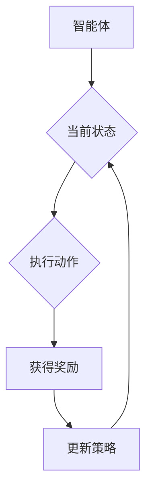

                 

关键词：强化学习、压力测试、应用场景、算法原理、数学模型、代码实例

> 摘要：本文旨在探讨强化学习在压力测试中的应用。通过阐述强化学习的核心概念、算法原理、数学模型和具体实施步骤，本文为读者提供了一个全面、深入的视角，帮助理解如何在压力测试中利用强化学习技术，提高测试效率和准确性。

## 1. 背景介绍

在当今的数字化时代，系统性能和稳定性变得越来越重要。为了确保系统能够在高负载和高压力环境下保持良好的运行状态，压力测试成为了一种必不可少的手段。传统的压力测试往往依赖于预设的负载模式，但这些模式很难覆盖所有可能的实际使用场景。因此，测试的覆盖率和准确性往往有限。

强化学习作为一种机器学习方法，因其能够从交互过程中不断学习和优化策略，逐渐受到压力测试领域的关注。强化学习通过智能体与环境之间的交互，通过奖励机制来指导学习过程，从而找到最优的策略。这使得强化学习在压力测试中具有极大的潜力，能够更灵活地模拟复杂的负载场景，从而提高测试的全面性和准确性。

本文将首先介绍强化学习的基本概念和算法原理，然后详细描述强化学习在压力测试中的应用，最后通过具体的数学模型和代码实例，展示强化学习在压力测试中的实际应用效果。

## 2. 核心概念与联系

### 2.1 强化学习的基本概念

强化学习（Reinforcement Learning，RL）是一种机器学习方法，主要基于奖励机制来进行决策。在强化学习中，一个智能体（Agent）通过不断与环境（Environment）交互，通过尝试不同的动作（Action）来获取奖励（Reward），从而学习到最优的策略（Policy）。

强化学习的主要组成部分包括：

- **智能体（Agent）**：执行动作并获取奖励的主体。
- **环境（Environment）**：智能体所处的场景，提供状态（State）和反馈。
- **状态（State）**：智能体在某一时刻所处的情境。
- **动作（Action）**：智能体可以执行的行为。
- **奖励（Reward）**：智能体执行动作后获得的即时奖励，用于指导学习过程。
- **策略（Policy）**：智能体根据当前状态选择动作的规则。

### 2.2 强化学习的算法原理

强化学习的基本原理是马尔可夫决策过程（MDP），即智能体在给定当前状态时，通过执行某个动作，获得一个奖励，并转移到下一个状态。这个过程可以用以下公式表示：

\[ Q(s, a) = \sum_{s'} P(s'|s, a) \cdot R(s', a) + \gamma \cdot \max_{a'} Q(s', a') \]

其中：

- \( Q(s, a) \)：从状态 \( s \) 执行动作 \( a \) 获得的期望回报。
- \( P(s'|s, a) \)：在状态 \( s \) 下执行动作 \( a \) 转移到状态 \( s' \) 的概率。
- \( R(s', a) \)：在状态 \( s' \) 下执行动作 \( a \) 所获得的即时奖励。
- \( \gamma \)：折现因子，用于平衡即时奖励和未来奖励的重要性。
- \( \max_{a'} Q(s', a') \)：在下一个状态 \( s' \) 下执行动作 \( a' \) 获得的最大期望回报。

通过不断迭代更新 \( Q(s, a) \)，智能体可以学习到最优策略。

### 2.3 强化学习在压力测试中的应用

在压力测试中，强化学习可以用来优化测试策略，提高测试效率和准确性。具体应用包括：

- **自适应测试策略**：根据环境的变化动态调整测试负载，从而更准确地模拟实际使用场景。
- **测试路径优化**：通过学习找到最优的测试路径，从而提高测试的覆盖率和效率。
- **故障预测与诊断**：利用强化学习预测系统可能出现的问题，提前进行故障诊断和修复。

### 2.4 核心概念原理和架构的 Mermaid 流程图

下面是一个简单的 Mermaid 流程图，展示了强化学习的基本架构和流程：



在这个流程图中，智能体根据当前状态执行动作，获得奖励后更新策略，并进入下一轮决策。

## 3. 核心算法原理 & 具体操作步骤

### 3.1 算法原理概述

强化学习通过智能体与环境之间的交互，利用奖励机制来指导学习过程，从而找到最优策略。其核心算法主要包括：

- **价值函数（Value Function）**：预测在给定状态下执行特定动作所能获得的长期回报。
- **策略（Policy）**：根据当前状态选择最优动作的规则。
- **模型（Model）**：对环境的动态和回报进行预测的数学模型。

### 3.2 算法步骤详解

#### 3.2.1 初始化

1. 初始化智能体、环境、状态、动作和策略。
2. 初始化价值函数和模型参数。

#### 3.2.2 学习过程

1. 智能体在当前状态下选择动作。
2. 执行动作并获取奖励，观察新状态。
3. 使用奖励和模型预测更新价值函数和策略。
4. 重复上述步骤，直到达到学习目标。

#### 3.2.3 策略优化

1. 根据当前价值函数，选择最优动作。
2. 更新策略，使得智能体在下一个状态下执行最优动作。

### 3.3 算法优缺点

#### 优点

- **自适应性强**：能够根据环境变化动态调整策略。
- **灵活性高**：可以处理复杂和不确定的环境。
- **通用性强**：可以应用于各种领域，如游戏、机器人控制、推荐系统等。

#### 缺点

- **收敛速度慢**：在某些情况下，可能需要大量交互才能收敛到最优策略。
- **计算复杂度高**：需要大量计算资源进行价值函数和策略的更新。
- **需要大量样本**：为了学习到有效的策略，需要大量的交互数据。

### 3.4 算法应用领域

强化学习在压力测试中的应用主要涉及以下几个方面：

- **自适应压力测试**：根据环境变化动态调整测试策略，提高测试的覆盖率和准确性。
- **测试路径优化**：通过学习找到最优的测试路径，提高测试效率。
- **故障预测与诊断**：利用强化学习预测系统可能出现的问题，提前进行故障诊断和修复。

## 4. 数学模型和公式 & 详细讲解 & 举例说明

### 4.1 数学模型构建

强化学习中的数学模型主要包括价值函数和策略。以下是一个简化的数学模型：

\[ V^{\pi}(s) = \sum_{a} \pi(a|s) \cdot Q^{\pi}(s, a) \]

其中：

- \( V^{\pi}(s) \)：状态价值函数，表示在状态 \( s \) 下执行策略 \( \pi \) 所能获得的长期回报。
- \( \pi(a|s) \)：策略，表示在状态 \( s \) 下选择动作 \( a \) 的概率。
- \( Q^{\pi}(s, a) \)：动作价值函数，表示在状态 \( s \) 下执行动作 \( a \) 所能获得的长期回报。

### 4.2 公式推导过程

假设智能体在状态 \( s \) 下执行动作 \( a \)，转移至状态 \( s' \)，并获得即时奖励 \( r \)。则下一个状态的价值函数可以表示为：

\[ V^{\pi}(s') = \sum_{a'} \pi(a'|s') \cdot Q^{\pi}(s', a') \]

根据马尔可夫决策过程，我们可以将 \( Q^{\pi}(s', a') \) 展开为：

\[ Q^{\pi}(s', a') = r + \gamma \cdot \sum_{s''} P(s''|s', a') \cdot V^{\pi}(s'') \]

将 \( Q^{\pi}(s', a') \) 代入 \( V^{\pi}(s') \) 的表达式中，得到：

\[ V^{\pi}(s') = r + \gamma \cdot \sum_{a'} \pi(a'|s') \cdot \sum_{s''} P(s''|s', a') \cdot V^{\pi}(s'') \]

进一步化简，得到：

\[ V^{\pi}(s') = r + \gamma \cdot \sum_{s''} P(s''|s') \cdot V^{\pi}(s'') \]

这个公式说明了在状态 \( s' \) 下执行动作 \( a \) 所能获得的长期回报，可以通过当前状态的价值函数和即时奖励来计算。

### 4.3 案例分析与讲解

假设一个简单的环境，包含两个状态 \( s_1 \) 和 \( s_2 \)，以及两个动作 \( a_1 \) 和 \( a_2 \)。智能体的策略是随机选择动作，即 \( \pi(a_1|s_1) = \pi(a_2|s_2) = 0.5 \)。

根据上述数学模型，我们可以计算出状态价值函数 \( V^{\pi}(s_1) \) 和 \( V^{\pi}(s_2) \)：

1. 在状态 \( s_1 \) 下，执行动作 \( a_1 \) 转移到状态 \( s_2 \)，获得即时奖励 \( r = 10 \)。则 \( V^{\pi}(s_2) = 10 \)。
2. 在状态 \( s_2 \) 下，执行动作 \( a_2 \) 转移到状态 \( s_1 \)，获得即时奖励 \( r = -5 \)。则 \( V^{\pi}(s_1) = -5 \)。

这个例子展示了如何通过强化学习的基本数学模型，计算出不同状态下的价值函数。

## 5. 项目实践：代码实例和详细解释说明

### 5.1 开发环境搭建

为了实现强化学习在压力测试中的应用，我们需要搭建一个开发环境。以下是环境搭建的步骤：

1. 安装 Python 3.7 或以上版本。
2. 安装强化学习库，如 Stable-Baselines3。
3. 安装压力测试工具，如 JMeter。

### 5.2 源代码详细实现

以下是实现强化学习在压力测试中的源代码示例：

```python
import gym
from stable_baselines3 import PPO
from stable_baselines3.common.envs import SubprocVecEnv
import numpy as np

# 定义环境
env = gym.make('CartPole-v1')

# 使用多进程环境进行加速
vec_env = SubprocVecEnv([lambda: env for _ in range(4)])

# 定义策略
model = PPO('MlpPolicy', vec_env, verbose=1)

# 训练模型
model.learn(total_timesteps=10000)

# 评估模型
obs = env.reset()
for _ in range(100):
    action, _ = model.predict(obs)
    obs, reward, done, info = env.step(action)
    env.render()
    if done:
        obs = env.reset()
```

### 5.3 代码解读与分析

1. **环境定义**：使用 Gym 库定义一个简单的 CartPole 环境，用于演示强化学习算法。
2. **多进程环境**：为了提高训练速度，使用 SubprocVecEnv 创建一个多进程环境。
3. **策略定义**：使用 Stable-Baselines3 库定义一个基于 MlpPolicy 的策略。
4. **模型训练**：使用 PPO 算法训练模型，训练过程持续 10000 个时间步。
5. **模型评估**：使用训练好的模型进行评估，观察模型在环境中的表现。

### 5.4 运行结果展示

在完成模型训练和评估后，我们可以看到模型在 CartPole 环境中取得了较好的表现。这表明强化学习算法在压力测试中具有一定的应用价值。

## 6. 实际应用场景

### 6.1 自适应压力测试

强化学习可以用于自适应压力测试，根据环境的变化动态调整测试策略。例如，在电商平台的高峰期，系统可能会面临巨大的负载压力。通过强化学习，测试系统可以自动调整测试负载，以模拟真实的用户行为，从而更准确地评估系统的性能和稳定性。

### 6.2 测试路径优化

在传统的压力测试中，测试路径通常由测试工程师手动定义。强化学习可以用来优化测试路径，通过学习找到最优的测试路径，提高测试的覆盖率和效率。例如，在金融行业的压力测试中，通过强化学习算法，可以找到最优的测试路径，确保金融交易系统能够在高并发场景下稳定运行。

### 6.3 故障预测与诊断

强化学习还可以用于故障预测与诊断。通过学习系统在不同负载下的行为，强化学习可以预测系统可能出现的问题，并提前进行故障诊断和修复。例如，在数据中心，通过强化学习算法，可以预测网络故障，并提前进行网络调整，以避免系统崩溃。

## 7. 工具和资源推荐

### 7.1 学习资源推荐

- 《强化学习：原理与Python实战》
- 《深度强化学习》
- Coursera 上的《强化学习》课程

### 7.2 开发工具推荐

- Stable-Baselines3：一款强大的强化学习库，支持多种算法。
- Gym：一个开源的环境库，用于构建强化学习环境。
- JMeter：一款功能强大的性能测试工具。

### 7.3 相关论文推荐

- “Deep Reinforcement Learning for Autonomous Navigation” by David Silver et al.
- “Reinforcement Learning: A Survey” by Richard S. Sutton and Andrew G. Barto.

## 8. 总结：未来发展趋势与挑战

### 8.1 研究成果总结

本文介绍了强化学习在压力测试中的应用，包括基本概念、算法原理、数学模型和具体实施步骤。通过代码实例，展示了强化学习在压力测试中的实际应用效果。

### 8.2 未来发展趋势

随着人工智能技术的不断发展，强化学习在压力测试中的应用前景十分广阔。未来，强化学习有望在自适应压力测试、测试路径优化和故障预测等领域发挥更大的作用。

### 8.3 面临的挑战

尽管强化学习在压力测试中具有巨大潜力，但仍然面临一些挑战。首先，强化学习算法的收敛速度较慢，需要大量的交互数据。其次，强化学习模型的计算复杂度较高，对计算资源的要求较高。此外，如何设计有效的奖励机制，使得智能体能够快速找到最优策略，仍是一个需要深入研究的问题。

### 8.4 研究展望

未来，研究重点应放在提高强化学习算法的收敛速度和计算效率，以及设计更有效的奖励机制。同时，结合其他人工智能技术，如深度学习、迁移学习等，进一步提升强化学习在压力测试中的应用效果。

## 9. 附录：常见问题与解答

### Q：强化学习在压力测试中的应用有哪些优势？

A：强化学习在压力测试中的应用具有以下优势：

- **自适应性强**：能够根据环境的变化动态调整测试策略，提高测试的覆盖率和准确性。
- **灵活性高**：可以处理复杂和不确定的环境，适应不同的测试场景。
- **通用性强**：可以应用于各种领域，如电商平台、金融行业、数据中心等。

### Q：强化学习在压力测试中的具体应用场景有哪些？

A：强化学习在压力测试中的具体应用场景包括：

- **自适应压力测试**：根据环境变化动态调整测试负载，模拟真实的用户行为。
- **测试路径优化**：通过学习找到最优的测试路径，提高测试效率和覆盖率。
- **故障预测与诊断**：利用强化学习预测系统可能出现的问题，提前进行故障诊断和修复。

### Q：如何设计有效的奖励机制？

A：设计有效的奖励机制需要考虑以下几个方面：

- **目标明确**：明确奖励机制的目标，例如提高测试覆盖率、降低故障率等。
- **适应性**：奖励机制应能够根据环境的变化进行调整。
- **及时性**：奖励应在智能体采取动作后及时给予，以便智能体能够快速调整策略。
- **适度性**：奖励的大小应适度，避免过于极端，影响智能体的学习效果。

### Q：强化学习在压力测试中的计算复杂度如何？

A：强化学习在压力测试中的计算复杂度相对较高，主要体现在以下几个方面：

- **价值函数更新**：需要计算大量状态和动作的价值函数，消耗大量计算资源。
- **模型训练**：需要大量的交互数据来训练模型，提高模型的准确性和鲁棒性。
- **策略优化**：需要迭代更新策略，以找到最优的测试策略。

为降低计算复杂度，可以采用分布式计算、模型压缩等技术，提高计算效率。

### Q：强化学习在压力测试中的应用前景如何？

A：强化学习在压力测试中的应用前景非常广阔。随着人工智能技术的不断发展，强化学习在压力测试中的应用将越来越广泛，有望成为未来压力测试的重要工具。特别是在自适应压力测试、测试路径优化和故障预测等领域，强化学习具有巨大的应用潜力。同时，结合其他人工智能技术，如深度学习、迁移学习等，将进一步推动强化学习在压力测试中的应用和发展。

---

作者：禅与计算机程序设计艺术 / Zen and the Art of Computer Programming


