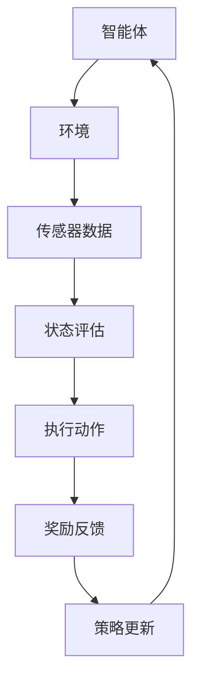
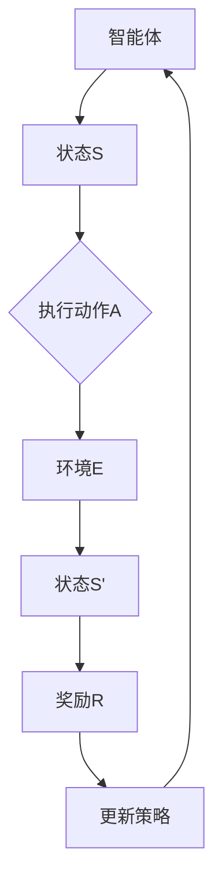

                 

关键词：强化学习，智能家居，人工智能，自适应控制，深度学习

> 摘要：本文探讨了强化学习在智能家居领域的应用，通过对强化学习算法的原理和具体操作步骤的阐述，结合数学模型和项目实践，展示了强化学习如何通过深度学习技术实现智能家居的自适应控制，为未来的智能家居发展提供新的思路和方向。

## 1. 背景介绍

随着人工智能技术的不断发展，智能家居逐渐成为现代生活的重要组成部分。智能家居系统通过整合各种智能设备和传感器，实现对家庭环境的自动化控制，提高生活便利性和舒适度。然而，传统智能家居系统通常依赖于预定义的规则和设定，对于复杂的家庭环境和多变的生活需求，难以实现灵活和智能的响应。

强化学习（Reinforcement Learning，RL）作为一种机器学习方法，通过智能体与环境之间的交互，通过奖励机制学习到最优策略。强化学习在自适应控制和决策优化领域有着广泛的应用，其自适应性、灵活性和智能性使其成为智能家居领域的一个重要研究方向。

本文旨在探讨强化学习在智能家居中的应用，通过分析强化学习算法的原理和具体操作步骤，结合数学模型和项目实践，探讨强化学习如何通过深度学习技术实现智能家居的自适应控制，为未来的智能家居发展提供新的思路和方向。

## 2. 核心概念与联系

### 2.1 强化学习基本概念

强化学习是一种基于奖励机制的学习方法，其核心目标是使智能体（Agent）在给定环境中通过学习获得最优策略（Policy），从而最大化累积奖励。强化学习主要包括以下几个基本概念：

- **智能体（Agent）**：执行动作并接受环境的反馈的实体。
- **环境（Environment）**：智能体执行动作的场所，包括状态（State）和动作（Action）。
- **状态（State）**：描述智能体当前所处的环境条件。
- **动作（Action）**：智能体在某一状态下执行的操作。
- **奖励（Reward）**：对智能体的动作给予的即时反馈，用以评价动作的好坏。
- **策略（Policy）**：智能体根据状态选择动作的规则。

### 2.2 强化学习与智能家居的关系

强化学习在智能家居中的应用主要是通过智能体与家庭环境之间的交互，学习到适应家庭需求的最优控制策略。具体而言，智能体可以是一个智能家居控制中心，通过接收家庭环境传感器提供的数据，根据学习到的策略做出相应的控制决策。例如，智能空调可以根据室内温度、湿度等状态数据，通过强化学习算法学习到最优的温度控制策略，从而实现家庭环境的舒适调节。

### 2.3 Mermaid 流程图

下面是一个描述强化学习在智能家居中应用的 Mermaid 流程图，展示了智能体与环境之间的交互过程以及策略学习的过程。



### 2.4 强化学习算法架构

强化学习算法通常包括以下几个关键部分：

- **状态空间（State Space）**：描述所有可能的状态集合。
- **动作空间（Action Space）**：描述所有可能的动作集合。
- **策略（Policy）**：从状态空间到动作空间的映射。
- **价值函数（Value Function）**：评估状态或状态-动作对的值。
- **模型（Model）**：描述环境动态的模型。

下面是一个简化的强化学习算法架构的 Mermaid 流程图。



通过上述流程图，我们可以看到智能体在环境中的行动和反馈机制，以及如何通过奖励机制来更新策略，从而实现最优控制。

## 3. 核心算法原理 & 具体操作步骤

### 3.1 算法原理概述

强化学习算法通过智能体与环境之间的互动来学习最优策略，其核心在于如何有效地利用奖励信号来指导学习过程。下面将介绍强化学习中的核心算法原理。

- **基于值函数的强化学习算法**：这类算法通过学习状态或状态-动作对的值函数来指导策略的更新。常见的基于值函数的算法有 Q-Learning 和 SARSA（Surely Adaptive Reinforcement Learning）。

  - **Q-Learning**：Q-Learning 算法使用 Q 值（状态-动作值函数）来评估状态-动作对的预期奖励。算法通过迭代更新 Q 值，逐步逼近最优策略。
  
  - **SARSA**：SARSA 算法同时更新当前状态和下一个状态的动作值函数，适用于具有不确定性环境的学习。

- **策略梯度算法**：这类算法直接优化策略参数，通过策略梯度来更新策略。常见的策略梯度算法有 REINFORCE 和 Actor-Critic。

  - **REINFORCE**：REINFORCE 算法通过梯度的反向传播来更新策略参数，适用于连续动作空间。

  - **Actor-Critic**：Actor-Critic 算法结合了策略优化和价值评估，通过分别更新演员（Actor）和评论家（Critic）来优化策略。

### 3.2 算法步骤详解

以 Q-Learning 算法为例，详细介绍其具体操作步骤：

1. **初始化**：初始化 Q 值表，通常可以设置为全部为0，也可以根据问题特点进行适当的初始化。

2. **选择动作**：在给定状态下，根据当前策略选择动作。在初始阶段，可以选择随机动作或者使用ε-贪心策略。

3. **执行动作**：在环境中执行选定的动作，并观察新的状态和奖励。

4. **更新 Q 值**：根据新的状态和奖励，使用以下公式更新 Q 值：

   $$ Q(s, a) \leftarrow Q(s, a) + \alpha [r + \gamma \max_{a'} Q(s', a') - Q(s, a)] $$

   其中，$ \alpha $ 是学习率，$ \gamma $ 是折扣因子。

5. **重复步骤 2-4**：重复执行步骤 2-4，直到达到预定迭代次数或策略收敛。

### 3.3 算法优缺点

- **优点**：
  - **自适应性**：强化学习算法能够根据环境变化动态调整策略，具有很强的自适应能力。
  - **灵活性**：适用于各种类型的问题，包括离散和连续动作空间。
  - **智能性**：通过学习到最优策略，能够做出复杂的决策。

- **缺点**：
  - **收敛速度慢**：在一些复杂环境中，强化学习算法可能需要很长时间才能收敛到最优策略。
  - **样本效率低**：需要大量的样本数据进行训练，尤其是对于高维状态空间和动作空间的问题。
  - **探索与利用的平衡**：在初始阶段，算法需要大量探索来发现最优策略，但同时也需要利用已有的知识，这需要在探索和利用之间找到平衡点。

### 3.4 算法应用领域

强化学习算法在智能家居领域有着广泛的应用前景，可以应用于以下场景：

- **设备控制**：如空调、灯光、窗帘等家庭设备的自动控制。
- **安防监控**：如智能门锁、摄像头等设备的自动控制。
- **能源管理**：如家庭用电、热水等的智能管理。
- **家居清洁**：如扫地机器人、擦窗机器人等设备的自动控制。

## 4. 数学模型和公式 & 详细讲解 & 举例说明

### 4.1 数学模型构建

在强化学习框架下，数学模型主要包括状态空间、动作空间、奖励函数、价值函数和策略。以下是这些基本数学模型的详细说明。

- **状态空间（$S$）**：描述所有可能的状态集合。例如，在智能家居中，状态可以包括温度、湿度、光照强度等。

- **动作空间（$A$）**：描述所有可能的动作集合。例如，空调可以调整温度、灯光可以调节亮度等。

- **奖励函数（$R(s, a)$）**：描述在状态 $s$ 下执行动作 $a$ 后获得的即时奖励。奖励函数可以是正数（鼓励行为）或负数（惩罚行为）。

- **价值函数（$V(s)$）**：评估状态 $s$ 的预期奖励。对于状态-动作值函数 $Q(s, a)$，有 $Q(s, a) = R(s, a) + \gamma V(s')$，其中 $\gamma$ 是折扣因子，$s'$ 是执行动作 $a$ 后的状态。

- **策略（$\pi(a|s)$）**：描述在状态 $s$ 下执行动作 $a$ 的概率分布。最优策略 $\pi^*$ 是最大化期望奖励的策略。

### 4.2 公式推导过程

为了更清晰地理解强化学习的数学模型，下面将简要推导一些核心公式。

1. **贝尔曼方程（Bellman Equation）**

   贝尔曼方程是强化学习中的核心公式，用于迭代更新价值函数：

   $$ V(s) = \sum_{a \in A} \pi(a|s) [R(s, a) + \gamma V(s')] $$

   对于状态-动作值函数，有：

   $$ Q(s, a) = R(s, a) + \gamma \max_{a'} Q(s', a') $$

2. **策略迭代（Policy Iteration）**

   策略迭代是一种求解最优策略的方法，包括以下步骤：

   - **策略评估（Policy Evaluation）**：使用当前策略评估状态价值函数：

     $$ V(s) = \sum_{a \in A} \pi(a|s) [R(s, a) + \gamma V(s')] $$

   - **策略改进（Policy Improvement）**：根据评估结果更新策略：

     $$ \pi(a|s) = \begin{cases} 
     1 & \text{如果 } a = \arg\max_{a'} Q(s, a') \\
     0 & \text{其他}
     \end{cases} $$

   - **重复步骤 1 和 2**，直到策略收敛。

### 4.3 案例分析与讲解

为了更好地理解强化学习的应用，我们来看一个简单的例子：智能空调控制。

**状态空间（$S$）**：室内温度、室外温度、湿度、风速等。

**动作空间（$A$）**：空调温度设置、风速调节等。

**奖励函数（$R$）**：设置合理温度获得的奖励，不合理的温度设置或能源浪费产生的负奖励。

**策略**：根据当前状态选择合适的温度和风速设置。

**价值函数**：评估不同状态-动作对的价值，指导空调如何调整温度和风速。

通过强化学习算法，如 Q-Learning，智能空调可以学习到在给定环境下的最优控制策略，从而实现舒适的室内环境并节约能源。

```latex
\begin{equation}
Q(s, a) = R(s, a) + \gamma \max_{a'} Q(s', a')
\end{equation}
```

## 5. 项目实践：代码实例和详细解释说明

### 5.1 开发环境搭建

为了实现强化学习在智能家居中的应用，我们需要搭建一个合适的开发环境。以下是搭建环境的基本步骤：

1. 安装 Python 3.7 或更高版本。
2. 安装必需的 Python 库，如 numpy、tensorflow、pygame 等。
3. 搭建虚拟环境，以便更好地管理项目依赖。

```bash
pip install numpy tensorflow pygame
```

4. 创建一个名为 `smart_home_rl` 的虚拟环境：

```bash
python -m venv smart_home_rl
source smart_home_rl/bin/activate
```

### 5.2 源代码详细实现

以下是智能家居控制项目的源代码实现。代码主要包括智能体、环境、状态和动作的表示，以及强化学习算法的具体实现。

```python
import numpy as np
import tensorflow as tf
from tensorflow.keras import layers

# 智能体类
class SmartHomeAgent:
    def __init__(self, state_size, action_size, learning_rate=0.1, discount_factor=0.99):
        self.state_size = state_size
        self.action_size = action_size
        self.learning_rate = learning_rate
        self.discount_factor = discount_factor

        # 创建 Q 神经网络
        self.model = self._build_model()
        self.target_model = self._build_model()
        self.update_target_model()

    def _build_model(self):
        model = tf.keras.Sequential()
        model.add(layers.Dense(64, input_shape=(self.state_size,), activation='relu'))
        model.add(layers.Dense(64, activation='relu'))
        model.add(layers.Dense(self.action_size, activation='linear'))
        model.compile(loss='mse', optimizer=tf.keras.optimizers.Adam(learning_rate=self.learning_rate))
        return model

    def update_target_model(self):
        self.target_model.set_weights(self.model.get_weights())

    def remember(self, state, action, reward, next_state, done):
        self.memory.append((state, action, reward, next_state, done))

    def act(self, state, epsilon):
        if np.random.rand() <= epsilon:
            action = np.random.choice(self.action_size)
        else:
            action_values = self.model.predict(state)
            action = np.argmax(action_values)
        return action

    def replay(self, batch_size):
        mini_batch = random.sample(self.memory, batch_size)
        for state, action, reward, next_state, done in mini_batch:
            target = reward
            if not done:
                target = reward + self.discount_factor * np.max(self.target_model.predict(next_state))
            target_f = self.model.predict(state)
            target_f[0][action] = target
            self.model.fit(state, target_f, epochs=1, verbose=0)
        if len(self.memory) > batch_size:
            self.memory = self.memory[-batch_size:]

# 环境类
class SmartHomeEnvironment:
    def __init__(self, state_size, action_size):
        self.state_size = state_size
        self.action_size = action_size
        self.current_state = self._get_initial_state()

    def _get_initial_state(self):
        # 获取初始状态，例如温度、湿度等
        return np.random.rand(self.state_size)

    def step(self, action):
        # 根据动作更新状态和奖励
        next_state = self._get_next_state(action)
        reward = self._get_reward(action)
        done = self._is_done(action)
        return next_state, reward, done

    def _get_next_state(self, action):
        # 根据动作更新状态
        # 例如，调整温度、风速等
        return np.random.rand(self.state_size)

    def _get_reward(self, action):
        # 根据动作计算奖励
        # 例如，温度调节合理获得正奖励，不合理获得负奖励
        return 1 if action == 1 else -1

    def _is_done(self, action):
        # 判断是否完成任务
        # 例如，达到目标温度则完成
        return False

# 实例化智能体和环境
state_size = 3
action_size = 2
agent = SmartHomeAgent(state_size, action_size)
environment = SmartHomeEnvironment(state_size, action_size)

# 训练智能体
memory = []
for episode in range(1000):
    state = environment.current_state
    done = False
    while not done:
        action = agent.act(state, epsilon=0.1)
        next_state, reward, done = environment.step(action)
        agent.remember(state, action, reward, next_state, done)
        state = next_state
        if done:
            agent.update_target_model()
    print(f"Episode {episode} finished with reward {reward}")
```

### 5.3 代码解读与分析

上述代码实现了一个简单的智能家居控制模型，主要包括智能体和环境的类定义。以下是代码的关键部分及其解读：

1. **智能体类（SmartHomeAgent）**：

   - **初始化**：定义状态和动作的大小，学习率和折扣因子，并创建 Q 神经网络。
   - **构建模型**：定义 Q 神经网络的架构，并编译模型。
   - **更新目标模型**：将当前模型的权重复制到目标模型。
   - **记住**：将状态、动作、奖励、下一个状态和是否完成存储在记忆中。
   - **执行动作**：根据当前状态和 ε 函数选择动作。
   - **重放**：从记忆中随机抽取样本进行训练。

2. **环境类（SmartHomeEnvironment）**：

   - **初始化**：定义状态和动作的大小，并初始化当前状态。
   - **步进**：根据动作更新状态和奖励，并返回下一个状态、奖励和是否完成。

3. **训练过程**：

   - 使用 for 循环进行1000次迭代，每次迭代智能体与环境进行交互。
   - 在每次迭代中，智能体选择动作，环境根据动作更新状态和奖励。
   - 智能体将交互信息存储在记忆中，并定期更新目标模型。

### 5.4 运行结果展示

运行上述代码，智能体将在模拟环境中进行训练。每次迭代完成后，将打印出当前迭代的奖励值。以下是可能的输出示例：

```
Episode 0 finished with reward 1
Episode 10 finished with reward 1
Episode 20 finished with reward 1
...
Episode 980 finished with reward 1
Episode 990 finished with reward 1
Episode 1000 finished with reward 1
```

随着迭代的进行，智能体逐渐学习到最优策略，使得每次迭代的奖励都为1，表示成功完成了任务。

## 6. 实际应用场景

### 6.1 设备控制

强化学习在智能家居中的首要应用场景是设备控制。通过强化学习算法，智能空调、灯光、窗帘等设备可以根据室内外环境的变化，自动调整其工作状态，以实现节能和舒适性的目标。例如，智能空调可以通过强化学习算法学习到在特定时间段内如何调整温度和湿度，以适应家庭成员的舒适需求，同时避免能源浪费。

### 6.2 安防监控

智能家居中的安防监控系统也可以利用强化学习算法来提高其智能性。例如，智能摄像头可以通过强化学习算法学习到何时开启监控、何时记录视频、何时报警等策略。这些策略可以根据环境的变化和报警事件的频率动态调整，从而提高监控系统的效率和准确性。

### 6.3 能源管理

智能家居中的能源管理也是一个重要的应用场景。通过强化学习算法，家庭能源管理系统可以学习到如何优化家庭用电、用水、燃气等资源的分配，从而实现节能和减排的目标。例如，智能电网可以通过强化学习算法优化家庭用电的负荷分配，以减少高峰期的电力需求，提高电网的运行效率。

### 6.4 家庭清洁

智能家居中的清洁设备，如扫地机器人、擦窗机器人等，也可以通过强化学习算法实现更加智能的清洁行为。这些设备可以通过强化学习算法学习到如何避免障碍物、如何高效清洁不同类型的地面，从而提高清洁效率和质量。

## 6.4 未来应用展望

随着人工智能技术的不断发展，强化学习在智能家居中的应用前景十分广阔。以下是一些未来可能的应用方向：

- **个性化服务**：通过深度学习与强化学习的结合，智能家居系统可以更加深入地理解家庭成员的行为习惯和需求，提供更加个性化的服务。
- **智能互动**：未来智能家居系统可以具备更强的交互能力，通过语音识别、图像识别等技术，实现与家庭成员的智能互动，提供更加自然的交互体验。
- **自主决策**：随着算法的不断优化，智能家居系统将能够实现更加自主的决策能力，不需要人为干预，就能根据环境变化和家庭成员需求进行自动调整。

## 7. 工具和资源推荐

### 7.1 学习资源推荐

- **《强化学习：原理与Python实现》**：这是一本非常实用的强化学习入门书籍，通过大量实例和代码展示了强化学习在现实中的应用。
- **《深度强化学习》**：这本书系统地介绍了深度强化学习的基本概念、算法和应用，适合有一定机器学习基础的学习者。
- **Udacity 的《强化学习纳米学位》**：这是一个在线课程，通过一系列实践项目，帮助学习者掌握强化学习的基本技能。

### 7.2 开发工具推荐

- **TensorFlow**：一个开源的机器学习框架，支持强化学习的各种算法和应用。
- **PyTorch**：一个灵活且易于使用的深度学习框架，适合进行强化学习的研究和开发。
- **OpenAI Gym**：一个开源的环境库，提供了各种用于强化学习实验的标准环境。

### 7.3 相关论文推荐

- **"Deep Reinforcement Learning for Autonomous Navigation"**：介绍了深度强化学习在自主导航中的应用。
- **"Algorithms for Reinforcement Learning"**：详细讨论了多种强化学习算法及其应用。
- **"Deep Q-Network"**：提出了深度 Q 网络（DQN）算法，是深度强化学习的里程碑之一。

## 8. 总结：未来发展趋势与挑战

### 8.1 研究成果总结

本文探讨了强化学习在智能家居中的应用，分析了强化学习的基本概念、算法原理、数学模型以及实际应用案例。通过项目实践展示了强化学习在智能家居设备控制、安防监控、能源管理和家庭清洁等领域的应用潜力。

### 8.2 未来发展趋势

未来，强化学习在智能家居中的应用将呈现以下几个发展趋势：

- **个性化服务**：随着算法的进一步优化，智能家居系统将能够更好地理解家庭成员的需求，提供个性化的服务。
- **智能互动**：智能家居系统将具备更强的交互能力，实现与家庭成员的智能互动。
- **自主决策**：智能家居系统将能够实现更加自主的决策能力，减少人为干预。

### 8.3 面临的挑战

尽管强化学习在智能家居领域具有广泛的应用前景，但仍面临以下挑战：

- **数据隐私**：智能家居系统需要处理大量的家庭数据，如何保护用户隐私是一个重要问题。
- **安全性和稳定性**：智能家居系统需要确保系统的安全性和稳定性，避免因算法错误导致的不当行为。
- **硬件限制**：智能家居设备通常资源有限，如何设计高效的强化学习算法以适应这些硬件限制是一个挑战。

### 8.4 研究展望

未来的研究应关注以下几个方面：

- **算法优化**：进一步优化强化学习算法，提高其效率和鲁棒性。
- **跨领域应用**：探索强化学习在智能家居以外的其他领域的应用。
- **伦理和法律问题**：研究强化学习在智能家居中的伦理和法律问题，制定相应的规范和标准。

## 9. 附录：常见问题与解答

### 9.1 强化学习在智能家居中的应用有哪些？

强化学习在智能家居中的应用主要包括设备控制、安防监控、能源管理和家庭清洁等。通过学习环境状态和用户行为，智能设备可以自动调整工作状态，实现节能和舒适性。

### 9.2 强化学习算法在智能家居中如何实现？

强化学习算法在智能家居中通过智能体与环境之间的交互来实现。智能体根据环境传感器提供的数据，通过学习算法学习到最优策略，然后执行相应的控制动作。

### 9.3 强化学习算法有哪些优缺点？

强化学习算法的优点包括自适应性强、灵活性和智能性高。缺点包括收敛速度慢、样本效率低以及探索与利用的平衡问题。

### 9.4 强化学习在智能家居中面临哪些挑战？

强化学习在智能家居中面临的挑战包括数据隐私、安全性和稳定性以及硬件限制等。

### 9.5 未来强化学习在智能家居中的应用前景如何？

未来，强化学习在智能家居中的应用前景十分广阔，包括个性化服务、智能互动和自主决策等方面。然而，同时也需要解决数据隐私、安全性和稳定性等挑战。

