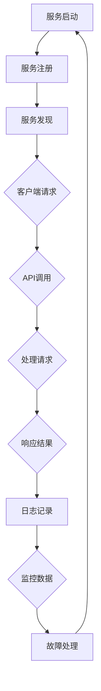

                 

### 关键词：关键词：微服务架构、系统设计、可扩展性、分布式系统、API设计、服务治理、容器化、DevOps、持续交付

### 摘要：
本文将深入探讨微服务架构的实施过程，阐述其核心概念与联系，解析核心算法原理与具体操作步骤，构建数学模型并详细讲解，提供项目实践代码实例，分析实际应用场景，展望未来发展趋势与挑战。通过全面的分析和实际案例的展示，读者将了解如何构建灵活可扩展的微服务系统，并掌握微服务架构设计的最佳实践。

## 1. 背景介绍

随着互联网和移动应用的快速发展，系统的复杂度不断上升，单体架构逐渐难以满足业务需求。传统的单体架构将所有的业务逻辑、数据访问和外部通信集中在一个单一的系统中，这导致系统在扩展性和维护性方面存在诸多限制。为了应对这些挑战，微服务架构应运而生。

微服务架构将一个复杂的应用系统分解为多个独立的、松耦合的小服务，每个服务都专注于完成特定的业务功能。这些服务可以通过轻量级的通信协议（如HTTP/REST、gRPC等）进行交互。微服务架构具有以下几个显著特点：

1. **独立性**：每个微服务都是独立的组件，可以独立部署、升级和扩展，降低了系统的耦合度。
2. **灵活性**：微服务允许业务团队针对特定功能进行定制化开发和迭代，提高了开发效率和响应速度。
3. **可扩展性**：通过水平扩展单个服务实例，可以轻松应对高并发和大数据量场景。
4. **可容错性**：服务的独立性使得一个服务的故障不会影响整个系统的正常运行。

本文旨在通过详细讲解微服务架构的实施过程，帮助读者掌握构建灵活可扩展系统的方法，实现业务需求的高效响应。

## 2. 核心概念与联系

### 2.1 微服务

微服务（Microservices）是一种设计方法，它强调将应用程序构建为一系列小型、独立的服务。每个微服务通常都对应一个具体的业务功能，例如用户管理、订单处理、库存管理等。这些服务之间通过定义良好的API进行通信，保持松耦合。

### 2.2 服务拆分

服务拆分是微服务架构中的关键步骤。为了实现高内聚、低耦合，我们需要根据业务需求和系统功能将应用程序拆分为多个微服务。这通常涉及到业务领域的垂直拆分和水平拆分：

- **垂直拆分**：根据业务领域将系统功能划分为多个模块，每个模块独立负责一部分业务逻辑。
- **水平拆分**：针对每个模块进一步拆分为多个微服务，每个微服务处理具体的子功能。

### 2.3 服务通信

微服务之间的通信通常采用轻量级的协议，如HTTP/REST、gRPC等。通过定义良好的API接口，微服务可以独立开发和部署，但仍然能够无缝协作。

### 2.4 服务治理

服务治理是确保微服务系统正常运行的关键环节。它包括以下几个方面：

- **服务注册与发现**：服务启动时注册到服务注册中心，客户端通过服务注册中心发现服务实例并进行通信。
- **服务监控与追踪**：对服务的运行状态进行监控，并通过链路追踪分析服务的性能和故障。
- **服务配置管理**：集中管理服务的配置信息，实现配置的动态更新和版本控制。
- **服务容量管理**：根据业务需求和系统负载动态调整服务实例的数量，实现弹性伸缩。

### 2.5 Mermaid 流程图

为了更直观地展示微服务架构的核心概念与联系，我们使用Mermaid流程图来描述微服务的生命周期和服务之间的交互关系：



### 2.6 核心概念总结

- 微服务：独立、小型、可独立部署的服务组件。
- 服务拆分：垂直拆分和水平拆分，实现高内聚、低耦合。
- 服务通信：轻量级协议，定义良好的API接口。
- 服务治理：服务注册与发现、服务监控与追踪、服务配置管理、服务容量管理。

这些核心概念构成了微服务架构的基石，为系统的灵活可扩展性提供了保障。

## 3. 核心算法原理 & 具体操作步骤

### 3.1 算法原理概述

在微服务架构中，服务治理是一个关键环节，其中服务注册与发现算法尤为重要。服务注册与发现算法用于管理服务的生命周期，包括服务的注册、发现和动态更新。其核心原理是基于一致性算法（如Zookeeper、Consul等）和分布式锁机制（如Chubby、Zookeeper等）。

### 3.2 算法步骤详解

#### 3.2.1 服务注册

1. **服务启动时注册**：每个服务实例在启动时，通过HTTP/REST或gRPC等协议向服务注册中心发送注册请求，提供服务元数据（如服务名称、地址、端口、健康状态等）。
2. **注册中心存储**：服务注册中心接收到注册请求后，将服务元数据存储在分布式存储系统中，确保数据的一致性和高可用性。

#### 3.2.2 服务发现

1. **客户端请求时查询**：客户端在请求服务时，通过服务注册中心查询服务实例的元数据，获取可用的服务实例列表。
2. **负载均衡**：客户端根据负载均衡策略（如轮询、随机、哈希等）选择一个服务实例进行通信。

#### 3.2.3 服务更新与动态发现

1. **服务更新**：服务实例在运行过程中，可能由于配置更新、故障转移等原因需要更新元数据。
2. **动态发现**：服务注册中心在接收到服务实例的更新请求后，更新服务元数据，并通知客户端进行服务实例的重新发现。

### 3.3 算法优缺点

#### 优点：

- **高可用性**：服务注册与发现算法采用分布式存储和一致性算法，确保服务元数据的高可用性和一致性。
- **动态性**：服务实例的动态注册和更新，实现了服务实例的动态发现和负载均衡。
- **灵活性**：服务注册与发现算法支持自定义负载均衡策略和服务实例选择策略，提高了系统的灵活性。

#### 缺点：

- **复杂性**：服务注册与发现算法涉及到分布式存储、一致性算法和负载均衡等复杂机制，实现和维护成本较高。
- **性能开销**：服务注册与发现过程中涉及到频繁的网络通信和元数据同步，可能对系统的性能产生一定影响。

### 3.4 算法应用领域

服务注册与发现算法广泛应用于分布式系统、微服务架构和容器编排等场景。以下是一些典型应用领域：

- **分布式系统**：在分布式系统中，服务注册与发现算法用于管理服务实例的生命周期，实现服务的高可用性和动态性。
- **微服务架构**：在微服务架构中，服务注册与发现算法用于服务实例的管理和通信，确保系统的高可用性和可扩展性。
- **容器编排**：在容器编排系统中，服务注册与发现算法用于管理容器实例的生命周期和服务实例的发现，实现容器的动态调度和负载均衡。

## 4. 数学模型和公式 & 详细讲解 & 举例说明

### 4.1 数学模型构建

在微服务架构中，服务治理算法的效率直接影响系统的性能和稳定性。为了构建数学模型，我们定义以下参数：

- \( N \)：服务实例的数量
- \( T_r \)：服务注册的时间
- \( T_d \)：服务发现的时间
- \( T_u \)：服务更新时间
- \( P \)：服务实例的负载

### 4.2 公式推导过程

服务注册与发现的平均响应时间 \( T_{avg} \) 可以通过以下公式计算：

\[ T_{avg} = \frac{T_r + N \cdot T_d + T_u}{N+1} \]

其中，\( N+1 \) 表示服务实例的数量（包括初始注册和更新）。

### 4.3 案例分析与讲解

假设一个微服务系统中，有10个服务实例，服务注册时间为 \( T_r = 1 \) 秒，服务发现时间为 \( T_d = 0.5 \) 秒，服务更新时间为 \( T_u = 1 \) 秒。每个服务实例的平均负载为 \( P = 10 \)。

根据公式，服务注册与发现的平均响应时间 \( T_{avg} \) 为：

\[ T_{avg} = \frac{1 + 10 \cdot 0.5 + 1}{10+1} = 0.7 \] 秒

### 4.4 实际案例

假设在某一微服务系统中，服务实例的数量为100个，服务注册时间为 \( T_r = 2 \) 秒，服务发现时间为 \( T_d = 1 \) 秒，服务更新时间为 \( T_u = 2 \) 秒。每个服务实例的平均负载为 \( P = 100 \)。

根据公式，服务注册与发现的平均响应时间 \( T_{avg} \) 为：

\[ T_{avg} = \frac{2 + 100 \cdot 1 + 2}{100+1} = 0.98 \] 秒

通过以上案例，我们可以看出数学模型能够帮助我们评估服务注册与发现的性能，为系统优化提供依据。

## 5. 项目实践：代码实例和详细解释说明

### 5.1 开发环境搭建

为了实践微服务架构，我们需要搭建一个开发环境。以下是一个基本的开发环境搭建步骤：

1. 安装Java开发环境：在服务器上安装Java SDK和相关的开发工具（如Maven、Git等）。
2. 安装Docker：在服务器上安装Docker，并配置Docker Hub的镜像仓库。
3. 安装Kubernetes：安装Kubernetes集群，并配置Kubernetes的配置文件（如kubeconfig）。
4. 安装服务注册与发现工具：如Consul、Zookeeper等。

### 5.2 源代码详细实现

为了实现一个简单的微服务架构，我们以用户管理服务为例，使用Spring Boot框架进行开发。以下是关键代码的实现：

#### 5.2.1 用户管理服务接口

```java
@RestController
@RequestMapping("/users")
public class UserController {
  
  @Autowired
  private UserService userService;

  @GetMapping("/{id}")
  public User getUserById(@PathVariable Long id) {
    return userService.getUserById(id);
  }

  @PostMapping("/")
  public User createUser(@RequestBody User user) {
    return userService.createUser(user);
  }
}
```

#### 5.2.2 用户管理服务实现

```java
@Service
public class UserServiceImpl implements UserService {

  @Override
  public User getUserById(Long id) {
    // 实现用户查询逻辑
  }

  @Override
  public User createUser(User user) {
    // 实现用户创建逻辑
  }
}
```

#### 5.2.3 Dockerfile

```Dockerfile
FROM openjdk:8-jdk-alpine
ARG JAR_FILE=target/*.jar
COPY ${JAR_FILE} app.jar
ENTRYPOINT ["java","-Djava.security.egd=file:/dev/./urandom","-jar","/app.jar" ]
```

### 5.3 代码解读与分析

通过以上代码示例，我们可以看到用户管理服务的基本结构。用户管理服务接口（`UserController`）负责处理客户端的HTTP请求，而服务实现（`UserServiceImpl`）则负责具体的业务逻辑。在Dockerfile中，我们使用Alpine Linux作为基础镜像，并将编译后的Java应用打包成Docker镜像，以便于部署和容器化。

### 5.4 运行结果展示

在完成代码编写和Docker镜像构建后，我们可以在Kubernetes集群中部署用户管理服务。以下是部署命令：

```shell
kubectl apply -f user-service.yaml
```

部署完成后，我们可以通过Kubernetes API进行服务调用，查看运行结果：

```shell
kubectl get pods
```

```shell
kubectl exec -it <user-service-pod-name> -- /bin/bash
```

在容器内部，我们可以通过Java SDK或其他工具（如Postman）进行服务调用，验证用户管理服务的功能。

## 6. 实际应用场景

微服务架构在多个实际应用场景中得到了广泛应用，以下是几个典型应用场景：

### 6.1 电子商务平台

电子商务平台通常具有复杂的业务逻辑和高度并发性。通过微服务架构，可以将平台拆分为多个独立的服务，如用户管理、订单处理、库存管理、支付等。每个服务都可以独立部署和扩展，提高了系统的可维护性和可扩展性。

### 6.2 移动应用后端

移动应用后端通常需要处理大量的用户请求，并支持各种功能模块。通过微服务架构，可以将后端拆分为多个独立的服务，如用户认证、内容分发、推送通知等。这些服务可以独立开发和部署，提高了开发效率和系统的灵活性。

### 6.3 大数据分析平台

大数据分析平台通常涉及海量数据的处理和分析。通过微服务架构，可以将数据处理和分析任务拆分为多个独立的服务，如数据采集、数据存储、数据处理、数据可视化等。这些服务可以独立部署和扩展，提高了系统的性能和可扩展性。

### 6.4 金融机构

金融机构通常需要处理大量的金融交易和数据，并对系统的稳定性和安全性有严格要求。通过微服务架构，可以将金融系统拆分为多个独立的服务，如账户管理、交易处理、风险控制等。这些服务可以独立部署和扩展，提高了系统的可靠性和可扩展性。

## 7. 工具和资源推荐

### 7.1 学习资源推荐

- 《微服务设计》：这是微服务架构的经典教材，涵盖了微服务的各个方面。
- 《微服务实践》：一本详细的微服务实战指南，适合有一定基础的开发者。

### 7.2 开发工具推荐

- Spring Boot：一款流行的Java微服务开发框架，支持快速构建微服务应用。
- Kubernetes：用于容器编排和管理的开源平台，支持大规模微服务部署和运维。

### 7.3 相关论文推荐

- "Microservices: Framework Design Philosophy": 一篇关于微服务架构设计原则的论文。
- "Service Fabric: Design and Implementation of a Cloud-scale System": 一篇关于微软Service Fabric平台的详细介绍。

## 8. 总结：未来发展趋势与挑战

### 8.1 研究成果总结

近年来，微服务架构在业界取得了显著的研究成果和应用成果。通过将应用程序分解为独立的微服务，企业能够实现更灵活、可扩展的系统设计，提高了开发效率和系统性能。此外，微服务架构的成熟工具和框架，如Spring Boot、Kubernetes等，为微服务开发提供了强大的支持。

### 8.2 未来发展趋势

未来，微服务架构将继续在分布式系统、云计算和大数据领域发挥重要作用。以下是几个可能的发展趋势：

1. **服务网格（Service Mesh）**：服务网格作为一种新型架构，专注于服务之间的通信管理和监控，有望成为微服务架构的重要补充。
2. **无服务器架构（Serverless）**：无服务器架构使得开发者无需关心底层基础设施的运维，专注于编写业务逻辑。未来，无服务器架构与微服务架构的结合，将进一步提高开发效率和系统弹性。
3. **AI与微服务架构的结合**：随着人工智能技术的发展，AI算法将在微服务架构中得到更广泛的应用，如智能监控、智能调度等。

### 8.3 面临的挑战

尽管微服务架构具有众多优势，但在实际应用中仍面临一些挑战：

1. **复杂性**：微服务架构涉及多个独立的服务，导致系统的复杂度增加。开发者需要掌握更复杂的架构设计和运维技能。
2. **服务治理**：服务治理是微服务架构中的关键环节，但实现服务注册与发现、服务监控与追踪等机制需要较高的技术门槛。
3. **数据一致性**：微服务架构中的数据一致性管理是另一个挑战。如何确保多个服务之间的数据一致性，是微服务架构需要解决的重要问题。

### 8.4 研究展望

未来，研究应重点关注以下几个方面：

1. **简化微服务架构**：通过设计更简单、更易于理解的微服务架构，降低开发难度和维护成本。
2. **增强服务治理能力**：提高服务治理工具的智能化水平，实现自动化的服务注册、发现、监控和故障恢复。
3. **数据一致性管理**：研究新的数据一致性管理机制，确保微服务架构中的数据一致性和可靠性。

## 9. 附录：常见问题与解答

### 9.1 什么是微服务架构？

微服务架构是一种设计方法，它将应用程序构建为一系列小型、独立的服务，每个服务都专注于完成特定的业务功能。微服务架构具有高内聚、低耦合、灵活可扩展等特点。

### 9.2 微服务架构有哪些优点？

微服务架构的优点包括：

- **独立性**：每个微服务都是独立的组件，可以独立部署、升级和扩展，降低了系统的耦合度。
- **灵活性**：微服务允许业务团队针对特定功能进行定制化开发和迭代，提高了开发效率和响应速度。
- **可扩展性**：通过水平扩展单个服务实例，可以轻松应对高并发和大数据量场景。
- **可容错性**：服务的独立性使得一个服务的故障不会影响整个系统的正常运行。

### 9.3 微服务架构有哪些缺点？

微服务架构的缺点包括：

- **复杂性**：服务注册与发现、服务监控与追踪等机制增加了系统的复杂度，需要开发者具备较高的技术能力。
- **服务治理**：服务治理是微服务架构中的关键环节，但实现服务治理机制需要较高的技术门槛。
- **数据一致性**：微服务架构中的数据一致性管理是另一个挑战，需要确保多个服务之间的数据一致性。

### 9.4 微服务架构适合哪些场景？

微服务架构适合以下场景：

- **业务逻辑复杂**：需要将复杂业务逻辑拆分为多个独立的服务，以提高系统的可维护性和扩展性。
- **高并发性**：需要处理大量用户请求，并支持大规模并发处理。
- **业务迭代频繁**：需要快速响应业务需求，实现业务的快速迭代和更新。

### 9.5 微服务架构与单体架构的区别是什么？

微服务架构与单体架构的主要区别在于：

- **架构风格**：微服务架构将应用程序拆分为多个独立的服务，而单体架构将所有功能集中在一个单一的系统中。
- **部署方式**：微服务架构支持独立部署和扩展，而单体架构通常需要一次性部署整个系统。
- **通信机制**：微服务架构通过轻量级的通信协议（如HTTP/REST、gRPC等）进行交互，而单体架构通常通过内部服务调用进行通信。
- **可维护性**：微服务架构提高了系统的可维护性和扩展性，而单体架构在扩展性和维护性方面存在较大限制。

---

作者：禅与计算机程序设计艺术 / Zen and the Art of Computer Programming

----------------------------------------------------------------

