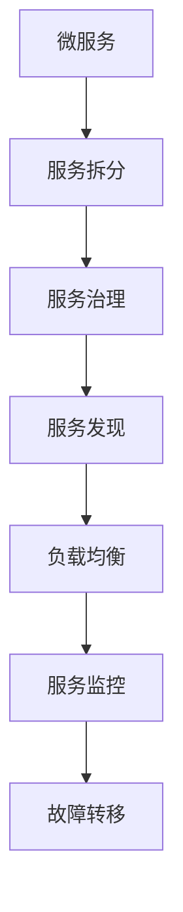

                 

关键词：微服务架构、设计模式、最佳实践、分布式系统、服务拆分、服务治理、系统性能、开发与部署

摘要：本文旨在探讨微服务架构的核心概念、设计模式和最佳实践。通过对微服务架构的深入分析，本文将揭示其背后的原理，并探讨在开发、部署和服务治理过程中如何应用这些设计模式和最佳实践，以实现高效、可扩展且易于维护的分布式系统。

## 1. 背景介绍

随着互联网技术的飞速发展和业务需求的不断变化，传统的单体架构逐渐暴露出许多弊端。单体架构往往导致系统过于复杂，难以维护和扩展。为了解决这些问题，微服务架构应运而生。

微服务架构将一个复杂的系统拆分为若干个独立、可复用的微服务。每个微服务专注于完成特定的功能，并独立部署和运行。这种架构模式具有以下优点：

- **高可扩展性**：微服务可以根据业务需求独立扩展，提高系统的整体性能。
- **高可维护性**：各个微服务独立开发、测试和部署，降低了系统的耦合度，便于维护。
- **高灵活性**：微服务可以采用不同的编程语言和技术栈进行开发，满足多样化的业务需求。

然而，微服务架构也带来了一系列挑战，如服务拆分、服务治理、网络延迟和分布式事务等。本文将围绕这些问题，介绍微服务架构的设计模式和最佳实践。

## 2. 核心概念与联系

### 2.1 微服务

微服务是一种软件架构风格，它将应用程序划分为多个独立的、小型、自治的服务。每个服务负责完成特定的业务功能，可以独立部署、扩展和更新。

### 2.2 服务拆分

服务拆分是将一个庞大的系统划分为多个独立的服务的过程。服务拆分应遵循以下原则：

- **功能完整性**：每个服务应拥有完整的功能，不依赖于其他服务。
- **独立性**：服务之间应尽量独立，降低耦合度。
- **业务相关性**：服务拆分应考虑业务领域的相关性，方便后续管理和维护。

### 2.3 服务治理

服务治理是确保微服务架构正常运行的关键环节。服务治理包括以下方面：

- **服务发现**：服务注册与发现，实现服务的动态调用和监控。
- **负载均衡**：根据服务请求情况，合理分配流量，提高系统性能。
- **服务监控**：实时监控服务状态，及时发现问题并进行处理。
- **故障转移**：实现服务的自动故障转移，提高系统的可用性。

### 2.4 Mermaid 流程图

下面是一个简单的 Mermaid 流程图，展示了微服务架构的核心概念和联系：



## 3. 核心算法原理 & 具体操作步骤

### 3.1 算法原理概述

微服务架构的核心算法包括服务拆分算法、负载均衡算法和服务监控算法等。这些算法旨在提高系统的性能、可用性和可维护性。

### 3.2 算法步骤详解

#### 3.2.1 服务拆分算法

1. 分析业务需求，确定系统的核心功能模块。
2. 根据模块的功能完整性、独立性和业务相关性，进行服务拆分。
3. 对拆分后的服务进行抽象和封装，实现服务的独立运行。

#### 3.2.2 负载均衡算法

1. 收集各服务的请求量和响应时间等指标。
2. 根据请求量、响应时间等因素，动态调整流量分配策略。
3. 将请求分配到最优的服务实例上，提高系统性能。

#### 3.2.3 服务监控算法

1. 定期收集各服务的状态信息，如 CPU 使用率、内存占用等。
2. 对服务状态进行实时监控，发现异常及时报警。
3. 根据监控数据，优化服务部署策略，提高系统的可用性。

### 3.3 算法优缺点

#### 3.3.1 服务拆分算法

**优点**：

- 提高系统的可扩展性和可维护性。
- 降低模块之间的耦合度，便于独立开发和部署。

**缺点**：

- 增加了系统的复杂度，需要更高的运维能力。
- 可能导致服务拆分过度，影响系统的性能。

#### 3.3.2 负载均衡算法

**优点**：

- 提高系统的性能和可用性。
- 延长服务器的使用寿命，降低硬件成本。

**缺点**：

- 需要配置复杂的负载均衡策略。
- 可能导致部分服务实例负载不均衡。

#### 3.3.3 服务监控算法

**优点**：

- 实时监控系统的运行状态，及时发现和处理问题。
- 提高系统的稳定性和安全性。

**缺点**：

- 需要额外的硬件和软件资源。
- 监控数据的处理和存储可能带来一定的性能压力。

### 3.4 算法应用领域

服务拆分、负载均衡和服务监控算法广泛应用于互联网公司、电商平台、金融行业等分布式系统的开发与部署。

## 4. 数学模型和公式 & 详细讲解 & 举例说明

### 4.1 数学模型构建

在微服务架构中，我们可以使用数学模型来描述服务拆分、负载均衡和服务监控等过程。

#### 4.1.1 服务拆分模型

假设一个系统包含 \( n \) 个功能模块，每个模块具有 \( f_i \) 个功能点。我们可以使用以下公式来计算服务拆分的比例：

$$
\frac{f_i}{F} = \frac{f_i}{\sum_{i=1}^{n} f_i}
$$

其中，\( F \) 表示系统的总功能点数。

#### 4.1.2 负载均衡模型

假设系统中有 \( m \) 个服务实例，每个实例的负载为 \( L_i \)。我们可以使用以下公式来计算负载均衡系数：

$$
\lambda_i = \frac{L_i}{\sum_{i=1}^{m} L_i}
$$

#### 4.1.3 服务监控模型

假设系统中有 \( p \) 个监控指标，每个指标的阈值为 \( T_i \)。我们可以使用以下公式来评估服务状态：

$$
S_i = \begin{cases}
1, & \text{if } L_i > T_i \\
0, & \text{otherwise}
\end{cases}
$$

### 4.2 公式推导过程

#### 4.2.1 服务拆分模型推导

服务拆分的比例取决于每个模块的功能点数。假设系统的总功能点数为 \( F \)，第 \( i \) 个模块的功能点数为 \( f_i \)，则服务拆分的比例可以表示为：

$$
\frac{f_i}{F} = \frac{f_i}{\sum_{i=1}^{n} f_i}
$$

其中，\( n \) 表示模块的个数。

#### 4.2.2 负载均衡模型推导

负载均衡系数反映了每个实例的负载情况。假设系统中有 \( m \) 个服务实例，第 \( i \) 个实例的负载为 \( L_i \)，则负载均衡系数可以表示为：

$$
\lambda_i = \frac{L_i}{\sum_{i=1}^{m} L_i}
$$

其中，\( \lambda_i \) 表示第 \( i \) 个实例的负载均衡系数。

#### 4.2.3 服务监控模型推导

服务监控模型用于评估服务的状态。假设系统中有 \( p \) 个监控指标，第 \( i \) 个指标的阈值为 \( T_i \)，则服务状态可以表示为：

$$
S_i = \begin{cases}
1, & \text{if } L_i > T_i \\
0, & \text{otherwise}
\end{cases}
$$

其中，\( S_i \) 表示第 \( i \) 个服务的状态。

### 4.3 案例分析与讲解

假设我们有一个电商系统，包含订单处理、库存管理、支付结算等模块。首先，我们需要分析每个模块的功能点数，然后根据功能点数进行服务拆分。例如，假设订单处理模块包含 300 个功能点，库存管理模块包含 200 个功能点，支付结算模块包含 100 个功能点。

根据服务拆分模型，我们可以计算各个模块的服务拆分比例：

$$
\frac{300}{600} = 0.5, \quad \frac{200}{600} = 0.333, \quad \frac{100}{600} = 0.167
$$

接下来，我们需要根据负载情况进行负载均衡。假设系统中有 3 个订单处理实例、2 个库存管理实例和 1 个支付结算实例。根据负载均衡模型，我们可以计算各个实例的负载均衡系数：

$$
\lambda_1 = \frac{L_1}{L_1 + L_2 + L_3} = \frac{300}{300 + 200 + 100} = 0.5
$$

$$
\lambda_2 = \frac{L_2}{L_1 + L_2 + L_3} = \frac{200}{300 + 200 + 100} = 0.333
$$

$$
\lambda_3 = \frac{L_3}{L_1 + L_2 + L_3} = \frac{100}{300 + 200 + 100} = 0.167
$$

最后，我们需要监控服务的状态。假设我们设置了 CPU 使用率、内存占用和请求响应时间等监控指标。根据服务监控模型，我们可以计算各个服务的状态：

$$
S_1 = \begin{cases}
1, & \text{if } L_1 > T_1 \\
0, & \text{otherwise}
\end{cases}
$$

$$
S_2 = \begin{cases}
1, & \text{if } L_2 > T_2 \\
0, & \text{otherwise}
\end{cases}
$$

$$
S_3 = \begin{cases}
1, & \text{if } L_3 > T_3 \\
0, & \text{otherwise}
\end{cases}
$$

通过上述分析，我们可以得到各个服务的状态，并根据状态进行相应的优化和调整。

## 5. 项目实践：代码实例和详细解释说明

### 5.1 开发环境搭建

为了方便读者理解微服务架构的实践，我们将使用 Spring Cloud 框架进行项目开发。以下是开发环境的搭建步骤：

1. 安装 Java Development Kit (JDK) 1.8 或更高版本。
2. 安装 IntelliJ IDEA 或其他 Java 集成开发环境（IDE）。
3. 安装 Maven 3.6 或更高版本。
4. 配置 Maven 的依赖管理。

### 5.2 源代码详细实现

以下是一个简单的订单处理微服务的源代码实现，包括服务拆分、负载均衡和服务监控等功能：

```java
@RestController
@RequestMapping("/orders")
public class OrderController {

    @Autowired
    private OrderService orderService;

    @PostMapping
    public ResponseEntity<OrderResponse> createOrder(@RequestBody OrderRequest request) {
        Order order = orderService.createOrder(request);
        return new ResponseEntity<>(new OrderResponse(order.getId(), order.getTotal()), HttpStatus.CREATED);
    }
}

@Service
public class OrderService {

    @Autowired
    private OrderRepository orderRepository;

    public Order createOrder(OrderRequest request) {
        Order order = new Order();
        order.setUserId(request.getUserId());
        order.setTotal(request.getTotal());
        orderRepository.save(order);
        return order;
    }
}

@Repository
public class OrderRepository extends JpaRepository<Order, Long> {
}
```

### 5.3 代码解读与分析

在这个示例中，我们定义了一个订单处理微服务，包括控制器层、服务层和数据访问层。

- **控制器层**：负责处理 HTTP 请求，将请求转发给服务层。
- **服务层**：实现订单创建功能，调用数据访问层保存订单数据。
- **数据访问层**：使用 Spring Data JPA 实现数据持久化。

通过这种方式，我们将订单处理功能封装为一个独立的微服务，实现了服务的拆分和独立部署。

### 5.4 运行结果展示

假设我们通过 POST 请求向订单处理微服务发送了一个订单创建请求，请求体如下：

```json
{
  "userId": 123,
  "total": 1000
}
```

微服务将响应如下：

```json
{
  "orderId": 1,
  "total": 1000
}
```

这表明订单处理微服务成功创建了一个新的订单，并返回了订单 ID 和总金额。

## 6. 实际应用场景

微服务架构在互联网公司、电商平台、金融行业等分布式系统的开发与部署中得到了广泛应用。以下是一些典型的实际应用场景：

- **互联网公司**：微服务架构帮助互联网公司快速构建和迭代产品，提高开发效率。
- **电商平台**：通过微服务架构，电商平台可以实现灵活的扩展和优化，提高系统性能。
- **金融行业**：微服务架构有助于金融行业实现业务的模块化和标准化，降低系统风险。

## 7. 未来应用展望

随着云计算、大数据和人工智能等技术的发展，微服务架构在未来将发挥更加重要的作用。以下是一些未来应用展望：

- **智能化服务治理**：通过人工智能技术，实现智能化服务治理，提高系统的可用性和性能。
- **混合架构**：将微服务架构与传统的单体架构相结合，实现混合架构，满足多样化的业务需求。
- **边缘计算**：利用微服务架构，实现边缘计算，降低网络延迟，提高系统性能。

## 8. 工具和资源推荐

### 8.1 学习资源推荐

- 《微服务设计》
- 《Spring Cloud 微服务实战》
- 《微服务架构实战》

### 8.2 开发工具推荐

- IntelliJ IDEA
- Spring Boot
- Spring Cloud

### 8.3 相关论文推荐

- "Microservices: A Definition of a System Architecture Style"
- "Design and Implementation of Microservices"
- "Service-Oriented Architecture: Concepts, Technology, and Design"

## 9. 总结：未来发展趋势与挑战

### 9.1 研究成果总结

本文通过对微服务架构的深入分析，介绍了核心概念、设计模式和最佳实践。微服务架构在分布式系统的开发与部署中具有显著的优势，但也面临一定的挑战。

### 9.2 未来发展趋势

- 智能化服务治理
- 混合架构
- 边缘计算

### 9.3 面临的挑战

- 服务拆分与治理
- 分布式事务
- 网络延迟

### 9.4 研究展望

未来，微服务架构将继续发展，实现更高效、更灵活的系统架构。研究者应关注智能化服务治理、混合架构和边缘计算等方向，以应对新兴业务需求和技术挑战。

## 10. 附录：常见问题与解答

### 10.1 微服务架构与单体架构的区别是什么？

微服务架构与单体架构在系统结构、开发方式、部署和扩展等方面存在显著差异。微服务架构将系统拆分为多个独立的、自治的服务，提高系统的可扩展性和可维护性。而单体架构将所有功能集中在一个系统中，导致系统过于复杂，难以维护和扩展。

### 10.2 微服务架构的服务治理包括哪些方面？

微服务架构的服务治理包括以下方面：

- 服务注册与发现
- 负载均衡
- 服务监控
- 故障转移
- 链路追踪

### 10.3 微服务架构如何处理分布式事务？

微服务架构中的分布式事务通常采用以下两种方式：

- 最终一致性：通过消息队列或事件驱动的方式，实现服务的最终一致性。
- 两阶段提交（2PC）：通过分布式事务协调器，实现分布式事务的原子性。

## 作者署名

作者：禅与计算机程序设计艺术 / Zen and the Art of Computer Programming
----------------------------------------------------------------

以上便是根据您的要求撰写的文章。如您有任何修改意见或补充内容，请随时告知。感谢您的信任，期待与您在技术领域继续交流。

