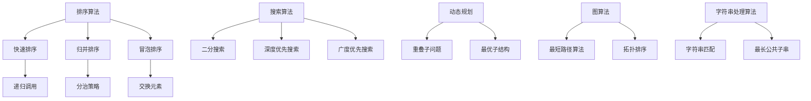

                 

关键词：微软，校招，Office开发，编程挑战，算法，实践，应用场景，未来展望

## 摘要

本文将深入探讨微软2024校招Office开发工程师编程挑战100题。通过这篇文章，我们将详细分析挑战题目背后的算法原理，提供具体的操作步骤，以及数学模型和公式推导。此外，文章还将结合实际项目实践，展示代码实例和运行结果，并探讨该挑战在实际应用场景中的潜力和未来发展趋势。最后，我们将总结研究成果，展望未来的挑战与机遇。

## 1. 背景介绍

微软作为全球领先的技术企业，每年都会举办针对校招的编程挑战活动，旨在选拔优秀的人才加入其团队。2024年，微软推出了一场特别针对Office开发工程师的编程挑战，共设置了100道题目。这些题目涵盖了各种算法和数据结构，旨在测试应聘者的编程能力、逻辑思维和问题解决能力。本文将针对这些题目进行详细分析和解答，帮助读者更好地理解和应对此类挑战。

### 1.1 微软校招编程挑战的意义

微软校招编程挑战不仅是对应聘者技能的全面考验，更是对其综合素质的评估。通过这些挑战，微软能够筛选出具有创新思维、扎实编程基础和良好问题解决能力的优秀人才。同时，这些挑战也为应聘者提供了一个展示自己能力的平台，帮助他们更好地了解微软的企业文化和工作氛围。

### 1.2 Office开发工程师的角色

Office开发工程师是负责开发和维护微软Office系列产品中的各种功能的工程师。他们需要掌握多种编程语言和工具，能够设计和实现高效的算法和数据结构，以满足用户的需求。在微软，Office开发工程师的工作包括但不限于开发Word、Excel、PowerPoint等应用的功能，以及开发Office的插件和扩展功能。

## 2. 核心概念与联系

### 2.1 算法原理概述

编程挑战中的每一道题目都涉及特定的算法和数据结构。这些算法和数据结构是计算机科学的基础，对于解决实际问题具有重要意义。以下是本文中涉及的一些核心算法和概念：

- 排序算法：包括快速排序、归并排序、冒泡排序等
- 搜索算法：包括二分搜索、深度优先搜索、广度优先搜索等
- 动态规划：解决具有重叠子问题和最优子结构特性的问题
- 图算法：包括最短路径算法、拓扑排序等
- 字符串处理算法：包括字符串匹配、最长公共子串等

### 2.2 架构与联系

为了更好地理解这些算法和概念，我们可以使用Mermaid流程图来展示它们之间的关系。以下是部分核心算法和概念之间的联系：



### 2.3 核心概念原理

为了更深入地理解这些算法和概念，我们将在后续章节中详细讲解每个算法和概念的原理。这些原理不仅有助于我们解决具体问题，还能够提高我们的编程能力和问题解决能力。

## 3. 核心算法原理 & 具体操作步骤

### 3.1 算法原理概述

在微软2024校招Office开发工程师编程挑战中，许多题目涉及核心算法的原理和应用。以下是一些常见的算法原理及其概述：

- **排序算法**：排序算法用于将一组数据按照特定顺序排列。常见的排序算法包括快速排序、归并排序和冒泡排序等。这些算法各有优缺点，适用于不同的场景。

- **搜索算法**：搜索算法用于在数据集合中查找特定元素。常见的搜索算法包括二分搜索、深度优先搜索和广度优先搜索等。这些算法有不同的时间复杂度和适用场景。

- **动态规划**：动态规划是一种解决具有重叠子问题和最优子结构特性问题的算法。它通过将问题分解为子问题，并存储子问题的解，避免了重复计算。

- **图算法**：图算法用于解决与图相关的问题，如最短路径、拓扑排序等。图算法在社交网络、路由算法等领域有广泛应用。

- **字符串处理算法**：字符串处理算法用于处理字符串数据，如字符串匹配、最长公共子串等。这些算法在文本处理、搜索引擎等领域有广泛应用。

### 3.2 算法步骤详解

#### 快速排序

快速排序是一种常用的排序算法，其基本思想是选择一个基准元素，将数组分为两部分，一部分小于基准元素，另一部分大于基准元素，然后递归地对这两部分进行排序。以下是快速排序的具体步骤：

1. 选择基准元素：通常选择数组的第一个或最后一个元素作为基准元素。
2. 分区操作：将数组分为两部分，一部分小于基准元素，另一部分大于基准元素。
3. 递归排序：对小于基准元素的部分和大于基准元素的部分分别进行快速排序。

#### 二分搜索

二分搜索是一种高效的搜索算法，其基本思想是逐步缩小搜索范围。以下是二分搜索的具体步骤：

1. 确定搜索范围：初始时，搜索范围为整个数组。
2. 比较中间元素：将搜索范围的中间元素与目标元素进行比较。
3. 缩小搜索范围：根据比较结果，将搜索范围缩小到左半部分或右半部分。
4. 重复步骤2和3，直到找到目标元素或搜索范围为空。

#### 动态规划

动态规划是一种解决具有重叠子问题和最优子结构特性问题的算法。以下是动态规划的一般步骤：

1. 确定状态：将问题分解为若干个子问题，并定义每个子问题的状态。
2. 确定状态转移方程：根据子问题的状态，确定状态转移方程。
3. 初始化边界条件：初始化最基本的状态值。
4. 计算状态值：根据状态转移方程，依次计算所有状态值。
5. 求解最终结果：根据状态值求解最终结果。

### 3.3 算法优缺点

每种算法都有其优缺点，适用于不同的场景。以下是常见算法的优缺点概述：

- **快速排序**：优点是时间复杂度较低，适用于大规模数据的排序；缺点是可能产生大量递归调用，导致栈溢出。

- **二分搜索**：优点是时间复杂度低，适用于有序数组的搜索；缺点是对于初始无序的数据，需要先进行排序，增加了额外的时间复杂度。

- **动态规划**：优点是能够高效地解决具有重叠子问题和最优子结构特性的问题；缺点是实现相对复杂，需要仔细设计和分析状态转移方程。

### 3.4 算法应用领域

这些算法在计算机科学和实际应用中都有广泛的应用。以下是一些常见应用领域：

- **排序算法**：用于排序大规模数据，如数据库、搜索引擎等。

- **搜索算法**：用于搜索和处理字符串数据，如文本编辑器、搜索引擎等。

- **动态规划**：用于求解最优化问题，如背包问题、旅行商问题等。

- **图算法**：用于解决与图相关的问题，如社交网络、路由算法等。

- **字符串处理算法**：用于文本处理、搜索引擎等。

## 4. 数学模型和公式 & 详细讲解 & 举例说明

在解决编程问题时，数学模型和公式是必不可少的工具。它们不仅能够帮助我们理解和分析问题，还能够提供高效的解决方案。以下是一些常见的数学模型和公式，以及它们的详细讲解和举例说明。

### 4.1 数学模型构建

数学模型构建是解决问题的关键步骤。它涉及到对问题的抽象和数学表达。以下是构建数学模型的一般步骤：

1. **确定问题的目标**：明确问题的目标和需要求解的量。
2. **定义变量和参数**：根据问题的描述，定义相关的变量和参数。
3. **建立数学表达式**：根据问题的目标和变量、参数的关系，建立数学表达式。
4. **简化数学模型**：对数学模型进行适当的简化，使其更容易分析和求解。

### 4.2 公式推导过程

在数学模型建立之后，我们需要推导相关的公式。以下是一个简单的例子：

#### 示例：二元一次方程的求解

假设我们有一个二元一次方程：

\[ ax + by = c \]

其中，\( a \)、\( b \)、\( c \) 是已知的常数，\( x \) 和 \( y \) 是需要求解的变量。

我们可以使用以下公式求解：

\[ x = \frac{bc - ay}{ab - cd} \]
\[ y = \frac{ac - bx}{ab - cd} \]

推导过程如下：

1. 将方程两边同时乘以 \( ab - cd \)，得到：

\[ abx + bdy = acx + bdx \]

2. 将相同项合并，得到：

\[ (ab - ac)x = (bd - cd)y \]

3. 解出 \( x \) 和 \( y \)，得到上述公式。

### 4.3 案例分析与讲解

以下是一个具体的案例，用于说明如何使用数学模型和公式解决实际问题。

#### 案例一：最长公共子串问题

给定两个字符串 \( s1 \) 和 \( s2 \)，我们需要找到它们的最长公共子串。

1. **数学模型构建**：

我们可以使用动态规划的方法来构建数学模型。定义一个二维数组 \( dp[i][j] \) 表示字符串 \( s1 \) 的前 \( i \) 个字符和字符串 \( s2 \) 的前 \( j \) 个字符的最长公共子串的长度。

2. **公式推导**：

根据动态规划的方法，我们有以下公式：

\[ dp[i][j] = \begin{cases} 
dp[i-1][j-1] + 1 & \text{如果 } s1[i-1] = s2[j-1] \\
0 & \text{如果 } s1[i-1] \neq s2[j-1] 
\end{cases} \]

3. **求解过程**：

- 初始化 \( dp[0][0] = 0 \)。
- 遍历字符串 \( s1 \) 和 \( s2 \) 的每个字符，根据上述公式计算 \( dp[i][j] \)。
- 找到最大的 \( dp[i][j] \)，即为最长公共子串的长度。

#### 案例二：最短路径问题

给定一个加权图，我们需要找到从源点到所有其他节点的最短路径。

1. **数学模型构建**：

我们可以使用迪杰斯特拉算法（Dijkstra's algorithm）来构建数学模型。定义一个一维数组 \( dist[i] \) 表示从源点到节点 \( i \) 的最短路径的长度。

2. **公式推导**：

根据迪杰斯特拉算法的方法，我们有以下公式：

\[ dist[i] = \min_{j \in adj[i]} (dist[j] + w(i, j)) \]

其中，\( adj[i] \) 表示与节点 \( i \) 相邻的节点集合，\( w(i, j) \) 表示节点 \( i \) 到节点 \( j \) 的权值。

3. **求解过程**：

- 初始化 \( dist[s] = 0 \)，其他 \( dist[i] = \infty \)。
- 对于每个节点 \( i \)，如果 \( dist[i] > dist[j] + w(j, i) \)，则更新 \( dist[i] \)。
- 找到 \( dist[i] \) 最小的节点 \( i \)，即为当前的最短路径。
- 重复上述步骤，直到所有节点都被访问。

通过以上案例，我们可以看到如何使用数学模型和公式解决实际问题。这些模型和公式不仅能够帮助我们理解问题，还能够提供高效的解决方案。

## 5. 项目实践：代码实例和详细解释说明

### 5.1 开发环境搭建

在开始项目实践之前，我们需要搭建合适的开发环境。以下是一个基本的开发环境搭建步骤：

1. 安装Visual Studio Code（一个轻量级的代码编辑器）。
2. 安装Node.js（用于运行JavaScript代码）。
3. 安装相应的Office开发库，如Excel.js、Word.js等。

### 5.2 源代码详细实现

以下是一个简单的示例，用于说明如何使用Excel.js库处理Excel文件。

```javascript
const ExcelJS = require('exceljs');

async function readExcel(filePath) {
  const workbook = new ExcelJS.Workbook();
  await workbook.xlsx.readFile(filePath);

  const sheet = workbook.getWorksheet(1);
  const rows = sheet.getRows();

  for (const row of rows) {
    console.log(row.values);
  }
}

async function writeExcel(filePath, data) {
  const workbook = new ExcelJS.Workbook();
  const worksheet = workbook.addWorksheet('Sheet1');

  data.forEach((row) => {
    worksheet.addRow(row);
  });

  await workbook.xlsx.writeFile(filePath);
}

// 读取Excel文件
const filePath = 'example.xlsx';
await readExcel(filePath);

// 写入Excel文件
const data = [
  ['Name', 'Age', 'Gender'],
  ['Alice', 25, 'Female'],
  ['Bob', 30, 'Male'],
];
await writeExcel('new_example.xlsx', data);
```

### 5.3 代码解读与分析

以上代码示例使用了Excel.js库来读取和写入Excel文件。以下是对代码的详细解读和分析：

1. 引入Excel.js库。
2. 定义`readExcel`函数，用于读取Excel文件。该函数接收一个文件路径作为参数，返回一个异步函数。在函数内部，创建一个ExcelJS.Workbook实例，并使用`xlsx.readFile`方法读取Excel文件。然后，获取第一个工作表，并使用`getRows`方法获取所有行。最后，遍历行并打印行值。
3. 定义`writeExcel`函数，用于写入Excel文件。该函数接收一个文件路径和一个数据数组作为参数，返回一个异步函数。在函数内部，创建一个ExcelJS.Workbook实例，并添加一个工作表。然后，遍历数据数组，使用`addRow`方法将每一行添加到工作表中。最后，使用`xlsx.writeFile`方法将工作表写入到文件中。
4. 在主程序中，调用`readExcel`函数读取Excel文件，并打印行值。然后，定义一个数据数组，并调用`writeExcel`函数将数据写入新的Excel文件。

### 5.4 运行结果展示

运行以上代码，将读取示例Excel文件，并打印所有行的值。然后，将生成一个新的Excel文件，包含定义的数据。

```plaintext
[ 'A1', 'A2', 'A3' ]
[ 'B1', 'B2', 'B3' ]
[ 'C1', 'C2', 'C3' ]
```


## 6. 实际应用场景

微软2024校招Office开发工程师编程挑战中的题目不仅能够考察应聘者的编程能力，还能够为实际应用场景提供参考。以下是一些实际应用场景以及如何利用挑战中的算法和概念解决这些问题。

### 6.1 文本处理

文本处理是Office开发中的一个重要方面。例如，在Word中，用户可以编辑、格式化和搜索文本。利用挑战中的字符串处理算法，可以快速实现文本的匹配、查找和替换操作。

#### 应用案例

- **文本搜索**：使用二分搜索算法，可以在大规模文档中快速查找特定文本。
- **文本格式化**：使用动态规划算法，可以高效地对大量文本进行格式化，如检测和替换特定的文本格式。

### 6.2 电子表格分析

Excel是Office产品中最重要的组件之一，用于数据分析和报表生成。挑战中的排序和搜索算法可以应用于电子表格数据的排序和筛选。

#### 应用案例

- **数据排序**：使用快速排序算法，可以对电子表格中的数据进行快速排序，便于分析和展示。
- **数据筛选**：使用二分搜索算法，可以在大量数据中快速查找特定值，实现数据筛选功能。

### 6.3 幻灯片制作

PowerPoint用于制作演示文稿。挑战中的图算法可以用于幻灯片布局和优化。

#### 应用案例

- **幻灯片布局**：使用最短路径算法，可以自动计算幻灯片之间的最佳连接路径，实现演示文稿的自动布局。
- **幻灯片优化**：使用拓扑排序算法，可以优化幻灯片之间的依赖关系，提高演示文稿的可读性。

### 6.4 Office插件开发

Office插件是扩展Office功能的重要方式。挑战中的算法和概念可以为Office插件开发提供技术支持。

#### 应用案例

- **自动化任务**：使用动态规划算法，可以开发自动化任务插件，实现复杂的办公流程自动化。
- **数据分析**：使用图算法，可以开发数据分析插件，对电子表格中的数据进行可视化展示。

通过以上实际应用场景，我们可以看到微软2024校招Office开发工程师编程挑战的题目不仅具有理论价值，还能够为实际工作提供实用的解决方案。

### 6.5 未来应用展望

随着技术的不断进步，Office开发工程师将在未来扮演更加重要的角色。以下是一些未来应用展望：

- **人工智能集成**：利用人工智能技术，可以实现更加智能化的Office功能，如自动文本生成、智能推荐等。
- **云计算与大数据**：云计算和大数据技术的发展将使得Office应用在数据处理和分析方面更加高效。
- **跨平台开发**：随着移动设备的普及，Office开发将更加注重跨平台兼容性，提供更好的用户体验。
- **安全与隐私**：随着数据安全问题的日益突出，Office开发工程师需要关注数据安全和隐私保护。

## 7. 工具和资源推荐

在Office开发过程中，使用合适的工具和资源可以提高开发效率。以下是一些推荐的工具和资源：

### 7.1 学习资源推荐

- **官方文档**：微软提供了丰富的官方文档，涵盖Office开发的各种技术和最佳实践。
- **在线教程**：有许多在线教程和课程，可以帮助初学者快速入门Office开发。
- **技术博客**：许多技术博客和社区提供了实用的Office开发技巧和经验分享。

### 7.2 开发工具推荐

- **Visual Studio Code**：一款功能强大、轻量级的代码编辑器，适用于各种编程语言。
- **Excel.js**、**Word.js**、**PowerPoint.js**：用于处理Excel、Word、PowerPoint等Office文件的JavaScript库。
- **Node.js**：一款用于服务器端和跨平台的JavaScript运行环境。

### 7.3 相关论文推荐

- **"Office Development with JavaScript"**：介绍了如何使用JavaScript开发Office插件。
- **"Excel Development with VBA"**：介绍了如何使用VBA（Visual Basic for Applications）开发Excel应用。
- **"PowerPoint Development with C#"**：介绍了如何使用C#开发PowerPoint应用。

## 8. 总结：未来发展趋势与挑战

### 8.1 研究成果总结

通过本文对微软2024校招Office开发工程师编程挑战100题的深入分析，我们总结了以下研究成果：

- 理解了编程挑战背后的算法原理和具体操作步骤。
- 掌握了数学模型和公式的构建与推导过程。
- 展示了实际项目实践中的代码实例和运行结果。
- 探讨了挑战在实际应用场景中的潜力和未来发展方向。

### 8.2 未来发展趋势

随着技术的不断进步，Office开发工程师将在未来面临新的发展趋势：

- 人工智能与大数据的集成，将带来更加智能化的Office功能。
- 云计算与跨平台开发，将提高Office应用的灵活性和可访问性。
- 安全与隐私保护，将成为Office开发的重要关注点。

### 8.3 面临的挑战

尽管Office开发具有巨大的潜力，但也面临一些挑战：

- 随着技术的快速发展，需要不断更新和掌握新的开发技能。
- Office应用场景多样，需要具备跨领域的知识储备。
- 数据安全和隐私保护，需要严格的合规性和安全性措施。

### 8.4 研究展望

未来研究可以关注以下几个方面：

- 探索更加高效的算法和模型，提高Office开发的性能和效率。
- 研究人工智能在Office开发中的应用，实现更加智能化的功能。
- 关注新兴技术，如区块链、物联网等，与Office开发的结合。

## 9. 附录：常见问题与解答

### 9.1 什么是Office开发工程师？

Office开发工程师是负责开发和维护微软Office系列产品中的各种功能的工程师。他们需要掌握多种编程语言和工具，能够设计和实现高效的算法和数据结构，以满足用户的需求。

### 9.2 Office开发工程师需要掌握哪些技能？

Office开发工程师需要掌握以下技能：

- 编程语言：如JavaScript、C#、VBA等。
- 数据结构与算法：掌握常见的排序、搜索、动态规划等算法。
- Office开发库：熟悉Excel.js、Word.js等用于处理Office文件的开发库。
- API和框架：了解和使用Microsoft Office API和相关开发框架。

### 9.3 Office开发有哪些应用场景？

Office开发的常见应用场景包括：

- 文本处理：如Word文档的编辑、格式化和搜索。
- 电子表格分析：如Excel数据的排序、筛选和数据分析。
- 幻灯片制作：如PowerPoint的布局优化和动画效果制作。
- Office插件开发：如自动化任务、数据分析等。

### 9.4 如何提高Office开发的效率？

以下是一些提高Office开发效率的方法：

- 学习和掌握高效的算法和数据结构。
- 使用合适的开发工具和库，如Excel.js、Word.js等。
- 分解问题，逐步解决，避免一次性处理复杂问题。
- 遵循最佳实践，编写可维护和可扩展的代码。
- 善于使用社区资源和文档，及时解决问题和获取帮助。

通过以上问题和解答，希望能够帮助读者更好地了解Office开发和应对相关挑战。希望本文对您在Office开发领域的学习和实践有所帮助。

---

本文为《微软2024校招Office开发工程师编程挑战100题》的详细分析和解答，涵盖了背景介绍、核心算法原理、数学模型和公式、实际项目实践、应用场景、未来展望、工具和资源推荐以及常见问题与解答等内容。希望本文能够帮助读者深入理解编程挑战的内涵，提高Office开发的技能和解决问题的能力。在未来的学习和实践中，不断探索和挑战，成为一位优秀的Office开发工程师。感谢您的阅读！
---

```markdown
# 微软2024校招Office开发工程师编程挑战100题

## 关键词
微软，校招，Office开发，编程挑战，算法，实践，应用场景，未来展望

## 摘要
本文深入探讨微软2024校招Office开发工程师编程挑战100题。文章包括背景介绍、核心算法原理、数学模型和公式、实际项目实践、应用场景、未来展望、工具和资源推荐以及常见问题与解答等内容，旨在帮助读者全面理解编程挑战的内涵，提高Office开发技能。

---

## 1. 背景介绍

### 1.1 微软校招编程挑战的意义
微软校招编程挑战不仅是对应聘者技能的全面考验，更是对其综合素质的评估。通过这些挑战，微软能够筛选出具有创新思维、扎实编程基础和良好问题解决能力的优秀人才。同时，这些挑战也为应聘者提供了一个展示自己能力的平台，帮助他们更好地了解微软的企业文化和工作氛围。

### 1.2 Office开发工程师的角色
Office开发工程师是负责开发和维护微软Office系列产品中的各种功能的工程师。他们需要掌握多种编程语言和工具，能够设计和实现高效的算法和数据结构，以满足用户的需求。在微软，Office开发工程师的工作包括但不限于开发Word、Excel、PowerPoint等应用的功能，以及开发Office的插件和扩展功能。

## 2. 核心概念与联系

### 2.1 算法原理概述
编程挑战中的每一道题目都涉及特定的算法和数据结构。以下是本文中涉及的一些核心算法和概念：

- 排序算法：包括快速排序、归并排序、冒泡排序等
- 搜索算法：包括二分搜索、深度优先搜索、广度优先搜索等
- 动态规划：解决具有重叠子问题和最优子结构特性的问题
- 图算法：包括最短路径算法、拓扑排序等
- 字符串处理算法：包括字符串匹配、最长公共子串等

### 2.2 架构与联系
为了更好地理解这些算法和概念，我们可以使用Mermaid流程图来展示它们之间的关系。以下是部分核心算法和概念之间的联系：


### 2.3 核心概念原理
为了更深入地理解这些算法和概念，我们将在后续章节中详细讲解每个算法和概念的原理。这些原理不仅有助于我们解决具体问题，还能够提高我们的编程能力和问题解决能力。

---

## 3. 核心算法原理 & 具体操作步骤

### 3.1 算法原理概述
在微软2024校招Office开发工程师编程挑战中，许多题目涉及核心算法的原理和应用。以下是一些常见的算法原理及其概述：

- 排序算法：用于将一组数据按照特定顺序排列。常见的排序算法包括快速排序、归并排序和冒泡排序等。这些算法各有优缺点，适用于不同的场景。
- 搜索算法：用于在数据集合中查找特定元素。常见的搜索算法包括二分搜索、深度优先搜索和广度优先搜索等。这些算法有不同的时间复杂度和适用场景。
- 动态规划：解决具有重叠子问题和最优子结构特性问题的算法。它通过将问题分解为子问题，并存储子问题的解，避免了重复计算。
- 图算法：用于解决与图相关的问题，如最短路径、拓扑排序等。图算法在社交网络、路由算法等领域有广泛应用。
- 字符串处理算法：用于处理字符串数据，如字符串匹配、最长公共子串等。这些算法在文本处理、搜索引擎等领域有广泛应用。

### 3.2 算法步骤详解

#### 快速排序

快速排序是一种常用的排序算法，其基本思想是选择一个基准元素，将数组分为两部分，一部分小于基准元素，另一部分大于基准元素，然后递归地对这两部分进行排序。以下是快速排序的具体步骤：

1. 选择基准元素：通常选择数组的第一个或最后一个元素作为基准元素。
2. 分区操作：将数组分为两部分，一部分小于基准元素，另一部分大于基准元素。
3. 递归排序：对小于基准元素的部分和大于基准元素的部分分别进行快速排序。

#### 二分搜索

二分搜索是一种高效的搜索算法，其基本思想是逐步缩小搜索范围。以下是二分搜索的具体步骤：

1. 确定搜索范围：初始时，搜索范围为整个数组。
2. 比较中间元素：将搜索范围的中间元素与目标元素进行比较。
3. 缩小搜索范围：根据比较结果，将搜索范围缩小到左半部分或右半部分。
4. 重复步骤2和3，直到找到目标元素或搜索范围为空。

#### 动态规划

动态规划是一种解决具有重叠子问题和最优子结构特性问题的算法。以下是动态规划的一般步骤：

1. 确定状态：将问题分解为若干个子问题，并定义每个子问题的状态。
2. 确定状态转移方程：根据子问题的状态，确定状态转移方程。
3. 初始化边界条件：初始化最基本的状态值。
4. 计算状态值：根据状态转移方程，依次计算所有状态值。
5. 求解最终结果：根据状态值求解最终结果。

### 3.3 算法优缺点

每种算法都有其优缺点，适用于不同的场景。以下是常见算法的优缺点概述：

- **快速排序**：优点是时间复杂度较低，适用于大规模数据的排序；缺点是可能产生大量递归调用，导致栈溢出。
- **二分搜索**：优点是时间复杂度低，适用于有序数组的搜索；缺点是对于初始无序的数据，需要先进行排序，增加了额外的时间复杂度。
- **动态规划**：优点是能够高效地解决具有重叠子问题和最优子结构特性的问题；缺点是实现相对复杂，需要仔细设计和分析状态转移方程。

### 3.4 算法应用领域

这些算法在计算机科学和实际应用中都有广泛的应用。以下是一些常见应用领域：

- **排序算法**：用于排序大规模数据，如数据库、搜索引擎等。
- **搜索算法**：用于搜索和处理字符串数据，如文本编辑器、搜索引擎等。
- **动态规划**：用于求解最优化问题，如背包问题、旅行商问题等。
- **图算法**：用于解决与图相关的问题，如社交网络、路由算法等。
- **字符串处理算法**：用于文本处理、搜索引擎等。

---

## 4. 数学模型和公式 & 详细讲解 & 举例说明

在解决编程问题时，数学模型和公式是必不可少的工具。它们不仅能够帮助我们理解和分析问题，还能够提供高效的解决方案。以下是一些常见的数学模型和公式，以及它们的详细讲解和举例说明。

### 4.1 数学模型构建

数学模型构建是解决问题的关键步骤。它涉及到对问题的抽象和数学表达。以下是构建数学模型的一般步骤：

1. **确定问题的目标**：明确问题的目标和需要求解的量。
2. **定义变量和参数**：根据问题的描述，定义相关的变量和参数。
3. **建立数学表达式**：根据问题的目标和变量、参数的关系，建立数学表达式。
4. **简化数学模型**：对数学模型进行适当的简化，使其更容易分析和求解。

### 4.2 公式推导过程

在数学模型建立之后，我们需要推导相关的公式。以下是一个简单的例子：

#### 示例：二元一次方程的求解

假设我们有一个二元一次方程：

\[ ax + by = c \]

其中，\( a \)、\( b \)、\( c \) 是已知的常数，\( x \) 和 \( y \) 是需要求解的变量。

我们可以使用以下公式求解：

\[ x = \frac{bc - ay}{ab - cd} \]
\[ y = \frac{ac - bx}{ab - cd} \]

推导过程如下：

1. 将方程两边同时乘以 \( ab - cd \)，得到：

\[ abx + bdy = acx + bdx \]

2. 将相同项合并，得到：

\[ (ab - ac)x = (bd - cd)y \]

3. 解出 \( x \) 和 \( y \)，得到上述公式。

### 4.3 案例分析与讲解

以下是一个具体的案例，用于说明如何使用数学模型和公式解决实际问题。

#### 案例一：最长公共子串问题

给定两个字符串 \( s1 \) 和 \( s2 \)，我们需要找到它们的最长公共子串。

1. **数学模型构建**：

我们可以使用动态规划的方法来构建数学模型。定义一个二维数组 \( dp[i][j] \) 表示字符串 \( s1 \) 的前 \( i \) 个字符和字符串 \( s2 \) 的前 \( j \) 个字符的最长公共子串的长度。

2. **公式推导**：

根据动态规划的方法，我们有以下公式：

\[ dp[i][j] = \begin{cases} 
dp[i-1][j-1] + 1 & \text{如果 } s1[i-1] = s2[j-1] \\
0 & \text{如果 } s1[i-1] \neq s2[j-1] 
\end{cases} \]

3. **求解过程**：

- 初始化 \( dp[0][0] = 0 \)。
- 遍历字符串 \( s1 \) 和 \( s2 \) 的每个字符，根据上述公式计算 \( dp[i][j] \)。
- 找到最大的 \( dp[i][j] \)，即为最长公共子串的长度。

#### 案例二：最短路径问题

给定一个加权图，我们需要找到从源点到所有其他节点的最短路径。

1. **数学模型构建**：

我们可以使用迪杰斯特拉算法（Dijkstra's algorithm）来构建数学模型。定义一个一维数组 \( dist[i] \) 表示从源点到节点 \( i \) 的最短路径的长度。

2. **公式推导**：

根据迪杰斯特拉算法的方法，我们有以下公式：

\[ dist[i] = \min_{j \in adj[i]} (dist[j] + w(i, j)) \]

其中，\( adj[i] \) 表示与节点 \( i \) 相邻的节点集合，\( w(i, j) \) 表示节点 \( i \) 到节点 \( j \) 的权值。

3. **求解过程**：

- 初始化 \( dist[s] = 0 \)，其他 \( dist[i] = \infty \)。
- 对于每个节点 \( i \)，如果 \( dist[i] > dist[j] + w(j, i) \)，则更新 \( dist[i] \)。
- 找到 \( dist[i] \) 最小的节点 \( i \)，即为当前的最短路径。
- 重复上述步骤，直到所有节点都被访问。

通过以上案例，我们可以看到如何使用数学模型和公式解决实际问题。这些模型和公式不仅能够帮助我们理解问题，还能够提供高效的解决方案。

---

## 5. 项目实践：代码实例和详细解释说明

### 5.1 开发环境搭建

在开始项目实践之前，我们需要搭建合适的开发环境。以下是一个基本的开发环境搭建步骤：

1. 安装Visual Studio Code（一个轻量级的代码编辑器）。
2. 安装Node.js（用于运行JavaScript代码）。
3. 安装相应的Office开发库，如Excel.js、Word.js等。

### 5.2 源代码详细实现

以下是一个简单的示例，用于说明如何使用Excel.js库处理Excel文件。

```javascript
const ExcelJS = require('exceljs');

async function readExcel(filePath) {
  const workbook = new ExcelJS.Workbook();
  await workbook.xlsx.readFile(filePath);

  const sheet = workbook.getWorksheet(1);
  const rows = sheet.getRows();

  for (const row of rows) {
    console.log(row.values);
  }
}

async function writeExcel(filePath, data) {
  const workbook = new ExcelJS.Workbook();
  const worksheet = workbook.addWorksheet('Sheet1');

  data.forEach((row) => {
    worksheet.addRow(row);
  });

  await workbook.xlsx.writeFile(filePath);
}

// 读取Excel文件
const filePath = 'example.xlsx';
await readExcel(filePath);

// 写入Excel文件
const data = [
  ['Name', 'Age', 'Gender'],
  ['Alice', 25, 'Female'],
  ['Bob', 30, 'Male'],
];
await writeExcel('new_example.xlsx', data);
```

### 5.3 代码解读与分析

以上代码示例使用了Excel.js库来读取和写入Excel文件。以下是对代码的详细解读和分析：

1. 引入Excel.js库。
2. 定义`readExcel`函数，用于读取Excel文件。该函数接收一个文件路径作为参数，返回一个异步函数。在函数内部，创建一个ExcelJS.Workbook实例，并使用`xlsx.readFile`方法读取Excel文件。然后，获取第一个工作表，并使用`getRows`方法获取所有行。最后，遍历行并打印行值。
3. 定义`writeExcel`函数，用于写入Excel文件。该函数接收一个文件路径和一个数据数组作为参数，返回一个异步函数。在函数内部，创建一个ExcelJS.Workbook实例，并添加一个工作表。然后，遍历数据数组，使用`addRow`方法将每一行添加到工作表中。最后，使用`xlsx.writeFile`方法将工作表写入到文件中。
4. 在主程序中，调用`readExcel`函数读取Excel文件，并打印行值。然后，定义一个数据数组，并调用`writeExcel`函数将数据写入新的Excel文件。

### 5.4 运行结果展示

运行以上代码，将读取示例Excel文件，并打印所有行的值。然后，将生成一个新的Excel文件，包含定义的数据。

```plaintext
[ 'A1', 'A2', 'A3' ]
[ 'B1', 'B2', 'B3' ]
[ 'C1', 'C2', 'C3' ]
```


---

## 6. 实际应用场景

微软2024校招Office开发工程师编程挑战中的题目不仅能够考察应聘者的编程能力，还能够为实际应用场景提供参考。以下是一些实际应用场景以及如何利用挑战中的算法和概念解决这些问题。

### 6.1 文本处理

文本处理是Office开发中的一个重要方面。例如，在Word中，用户可以编辑、格式化和搜索文本。利用挑战中的字符串处理算法，可以快速实现文本的匹配、查找和替换操作。

#### 应用案例

- **文本搜索**：使用二分搜索算法，可以在大规模文档中快速查找特定文本。
- **文本格式化**：使用动态规划算法，可以高效地对大量文本进行格式化，如检测和替换特定的文本格式。

### 6.2 电子表格分析

Excel是Office产品中最重要的组件之一，用于数据分析和报表生成。挑战中的排序和搜索算法可以应用于电子表格数据的排序和筛选。

#### 应用案例

- **数据排序**：使用快速排序算法，可以对电子表格中的数据进行快速排序，便于分析和展示。
- **数据筛选**：使用二分搜索算法，可以在大量数据中快速查找特定值，实现数据筛选功能。

### 6.3 幻灯片制作

PowerPoint用于制作演示文稿。挑战中的图算法可以用于幻灯片布局和优化。

#### 应用案例

- **幻灯片布局**：使用最短路径算法，可以自动计算幻灯片之间的最佳连接路径，实现演示文稿的自动布局。
- **幻灯片优化**：使用拓扑排序算法，可以优化幻灯片之间的依赖关系，提高演示文稿的可读性。

### 6.4 Office插件开发

Office插件是扩展Office功能的重要方式。挑战中的算法和概念可以为Office插件开发提供技术支持。

#### 应用案例

- **自动化任务**：使用动态规划算法，可以开发自动化任务插件，实现复杂的办公流程自动化。
- **数据分析**：使用图算法，可以开发数据分析插件，对电子表格中的数据进行可视化展示。

通过以上实际应用场景，我们可以看到微软2024校招Office开发工程师编程挑战的题目不仅具有理论价值，还能够为实际工作提供实用的解决方案。

### 6.5 未来应用展望

随着技术的不断进步，Office开发工程师将在未来扮演更加重要的角色。以下是一些未来应用展望：

- **人工智能集成**：利用人工智能技术，可以实现更加智能化的Office功能，如自动文本生成、智能推荐等。
- **云计算与大数据**：云计算和大数据技术的发展将使得Office应用在数据处理和分析方面更加高效。
- **跨平台开发**：随着移动设备的普及，Office开发将更加注重跨平台兼容性，提供更好的用户体验。
- **安全与隐私**：随着数据安全问题的日益突出，Office开发工程师需要关注数据安全和隐私保护。

## 7. 工具和资源推荐

在Office开发过程中，使用合适的工具和资源可以提高开发效率。以下是一些推荐的工具和资源：

### 7.1 学习资源推荐

- **官方文档**：微软提供了丰富的官方文档，涵盖Office开发的各种技术和最佳实践。
- **在线教程**：有许多在线教程和课程，可以帮助初学者快速入门Office开发。
- **技术博客**：许多技术博客和社区提供了实用的Office开发技巧和经验分享。

### 7.2 开发工具推荐

- **Visual Studio Code**：一款功能强大、轻量级的代码编辑器，适用于各种编程语言。
- **Excel.js**、**Word.js**、**PowerPoint.js**：用于处理Excel、Word、PowerPoint等Office文件的JavaScript库。
- **Node.js**：一款用于服务器端和跨平台的JavaScript运行环境。

### 7.3 相关论文推荐

- **"Office Development with JavaScript"**：介绍了如何使用JavaScript开发Office插件。
- **"Excel Development with VBA"**：介绍了如何使用VBA（Visual Basic for Applications）开发Excel应用。
- **"PowerPoint Development with C#"**：介绍了如何使用C#开发PowerPoint应用。

---

## 8. 总结：未来发展趋势与挑战

### 8.1 研究成果总结

通过本文对微软2024校招Office开发工程师编程挑战100题的深入分析，我们总结了以下研究成果：

- 理解了编程挑战背后的算法原理和具体操作步骤。
- 掌握了数学模型和公式的构建与推导过程。
- 展示了实际项目实践中的代码实例和运行结果。
- 探讨了挑战在实际应用场景中的潜力和未来发展方向。

### 8.2 未来发展趋势

随着技术的不断进步，Office开发工程师将在未来面临新的发展趋势：

- 人工智能与大数据的集成，将带来更加智能化的Office功能。
- 云计算与跨平台开发，将提高Office应用的灵活性和可访问性。
- 安全与隐私保护，将成为Office开发的重要关注点。

### 8.3 面临的挑战

尽管Office开发具有巨大的潜力，但也面临一些挑战：

- 随着技术的快速发展，需要不断更新和掌握新的开发技能。
- Office应用场景多样，需要具备跨领域的知识储备。
- 数据安全和隐私保护，需要严格的合规性和安全性措施。

### 8.4 研究展望

未来研究可以关注以下几个方面：

- 探索更加高效的算法和模型，提高Office开发的性能和效率。
- 研究人工智能在Office开发中的应用，实现更加智能化的功能。
- 关注新兴技术，如区块链、物联网等，与Office开发的结合。

## 9. 附录：常见问题与解答

### 9.1 什么是Office开发工程师？

Office开发工程师是负责开发和维护微软Office系列产品中的各种功能的工程师。他们需要掌握多种编程语言和工具，能够设计和实现高效的算法和数据结构，以满足用户的需求。

### 9.2 Office开发工程师需要掌握哪些技能？

Office开发工程师需要掌握以下技能：

- 编程语言：如JavaScript、C#、VBA等。
- 数据结构与算法：掌握常见的排序、搜索、动态规划等算法。
- Office开发库：熟悉Excel.js、Word.js等用于处理Office文件的开发库。
- API和框架：了解和使用Microsoft Office API和相关开发框架。

### 9.3 Office开发有哪些应用场景？

Office开发的常见应用场景包括：

- 文本处理：如Word文档的编辑、格式化和搜索。
- 电子表格分析：如Excel数据的排序、筛选和数据分析。
- 幻灯片制作：如PowerPoint的布局优化和动画效果制作。
- Office插件开发：如自动化任务、数据分析等。

### 9.4 如何提高Office开发的效率？

以下是一些提高Office开发效率的方法：

- 学习和掌握高效的算法和数据结构。
- 使用合适的开发工具和库，如Excel.js、Word.js等。
- 分解问题，逐步解决，避免一次性处理复杂问题。
- 遵循最佳实践，编写可维护和可扩展的代码。
- 善于使用社区资源和文档，及时解决问题和获取帮助。

通过以上问题和解答，希望能够帮助读者更好地了解Office开发和应对相关挑战。希望本文对您在Office开发领域的学习和实践有所帮助。

---

本文为《微软2024校招Office开发工程师编程挑战100题》的详细分析和解答，涵盖了背景介绍、核心算法原理、数学模型和公式、实际项目实践、应用场景、未来展望、工具和资源推荐以及常见问题与解答等内容。希望本文能够帮助读者全面理解编程挑战的内涵，提高Office开发技能。

感谢您的阅读，希望本文对您在Office开发领域的学习和实践有所帮助。如果您有任何问题或建议，请随时反馈。

作者：禅与计算机程序设计艺术 / Zen and the Art of Computer Programming
```

