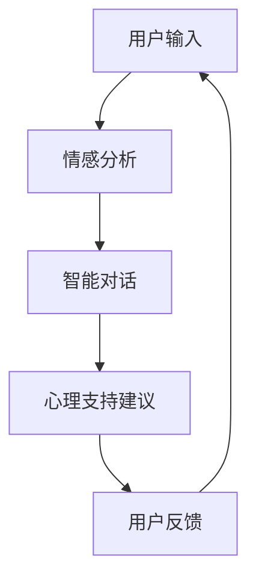

                 

关键词：心理健康，LLM，自然语言处理，情感分析，智能对话，医学伦理

> 摘要：本文深入探讨了利用大规模语言模型（LLM）进行心理健康支持的可行性、技术原理和应用场景。文章首先介绍了心理健康支持的重要性和当前面临的挑战，随后详细阐述了LLM在心理健康支持中的角色和作用，包括情感分析、智能对话和医学伦理等方面。通过实际项目案例，本文展示了LLM在心理健康支持中的具体应用，并对其未来发展进行了展望。

## 1. 背景介绍

随着社会的发展和人们生活节奏的加快，心理健康问题逐渐成为全球关注的焦点。据世界卫生组织（WHO）统计，全球约10%的人口在一生中会受到严重的精神障碍影响。心理健康问题的普遍性和严重性迫使我们必须寻求有效的治疗和支持方法。传统的心理治疗方式通常依赖专业心理咨询师，但由于心理咨询师的数量有限，难以满足广泛的需求。此外，心理咨询的成本高、隐私问题以及地理限制等因素也限制了其广泛应用。

近年来，人工智能技术的快速发展为心理健康支持提供了新的可能性。大规模语言模型（LLM）作为一种重要的自然语言处理技术，通过深度学习算法对海量文本数据进行训练，能够理解和生成自然语言。LLM在情感分析、智能对话和医学伦理等方面具有显著的优势，使其成为心理健康支持的重要工具。

本文旨在探讨LLM在心理健康支持中的应用，分析其技术原理、优势和挑战，并探讨未来发展的趋势和前景。

## 2. 核心概念与联系

### 2.1 大规模语言模型（LLM）

大规模语言模型（LLM）是一种基于深度学习的技术，能够理解和生成自然语言。LLM通过在大量文本数据上训练，学习语言模式、语义关系和语法规则，从而实现自然语言理解和生成。LLM的训练数据通常包括各种文本资料，如书籍、新闻、社交媒体和对话记录等。

### 2.2 情感分析

情感分析是指通过自然语言处理技术，分析文本中的情感倾向和情感极性。情感分析在心理健康支持中具有重要意义，可以帮助识别用户的情感状态和心理健康问题。LLM通过情感分析，可以识别用户的情绪变化，提供相应的支持和建议。

### 2.3 智能对话

智能对话是指利用自然语言处理技术，实现人与机器之间的自然语言交互。智能对话在心理健康支持中可以提供实时的心理支持和服务，帮助用户缓解心理压力、提供情感支持和心理咨询。

### 2.4 医学伦理

医学伦理是指在医学实践中遵循的道德原则和规范。在LLM应用于心理健康支持时，医学伦理具有重要意义。LLM必须遵守隐私保护、知情同意、公平性和责任等原则，确保心理健康支持的有效性和安全性。

### 2.5 Mermaid 流程图

下面是一个简单的Mermaid流程图，展示LLM在心理健康支持中的核心概念和联系。



## 3. 核心算法原理 & 具体操作步骤

### 3.1 算法原理概述

LLM在心理健康支持中的核心算法主要包括情感分析和智能对话。情感分析利用自然语言处理技术，分析文本中的情感倾向和情感极性。智能对话则通过自然语言生成技术，实现人与机器之间的自然语言交互。

### 3.2 算法步骤详解

#### 3.2.1 情感分析

1. **数据预处理**：对用户输入的文本进行预处理，包括分词、去噪、词性标注等。
2. **情感分类**：利用训练好的情感分类模型，对预处理后的文本进行情感分类，识别文本中的情感极性。
3. **情感强度计算**：对每个分类的情感强度进行计算，以确定用户的情感状态。

#### 3.2.2 智能对话

1. **意图识别**：通过自然语言处理技术，识别用户的对话意图。
2. **对话生成**：根据用户的意图和上下文信息，生成相应的回复。
3. **对话管理**：管理对话流程，包括上下文维护、对话轮次控制等。

### 3.3 算法优缺点

#### 3.3.1 优点

- **高效性**：LLM能够快速处理大量文本数据，提高心理健康支持的工作效率。
- **实时性**：智能对话系统能够实现实时交互，提供即时的心理支持。
- **个性化**：基于用户的情感状态和对话历史，提供个性化的心理支持建议。

#### 3.3.2 缺点

- **准确性**：情感分析和意图识别的准确性受限于训练数据和模型质量。
- **隐私问题**：用户隐私保护是心理健康支持中的重要问题，需要严格遵循医学伦理原则。

### 3.4 算法应用领域

- **心理健康咨询**：为用户提供实时的心理健康支持和咨询服务。
- **心理健康评估**：通过分析用户的情感状态，评估其心理健康状况。
- **心理健康教育**：提供心理健康知识和自我调节技巧，帮助用户提高心理素质。

## 4. 数学模型和公式 & 详细讲解 & 举例说明

### 4.1 数学模型构建

情感分析的数学模型通常基于情感极性和情感强度的计算。假设文本\(T\)中的情感极性为\(p(T)\)，情感强度为\(s(T)\)，则可以构建如下数学模型：

$$
p(T) = \frac{\sum_{i=1}^{n} w_i \cdot a_i}{\sum_{i=1}^{n} w_i}
$$

其中，\(w_i\)为词\(i\)的权重，\(a_i\)为词\(i\)的情感极性。

### 4.2 公式推导过程

情感极性计算通常采用词袋模型（Bag of Words，BOW）和情感词典相结合的方法。假设文本\(T\)由单词集合\(W\)构成，情感词典\(D\)包含情感词和对应的情感极性。首先，计算文本\(T\)的情感极性：

$$
p(T) = \sum_{w \in W} p(w) \cdot a_w
$$

其中，\(p(w)\)为单词\(w\)在文本\(T\)中的出现概率，\(a_w\)为单词\(w\)的情感极性。

接下来，计算文本\(T\)的情感强度：

$$
s(T) = \sum_{w \in W} s(w) \cdot |p(w) - p_0|
$$

其中，\(s(w)\)为单词\(w\)的情感强度，\(p_0\)为中性概率。

### 4.3 案例分析与讲解

假设用户输入的文本为：“我今天面试了一份工作，感觉非常紧张。”，我们可以通过情感分析模型对其情感状态进行评估。

首先，对文本进行预处理，得到单词集合\(W = \{"我"，"今天"，"面试"，"了一份"，"工作"，"感觉"，"非常"，"紧张"\}。

然后，利用情感词典计算单词的情感极性和情感强度。假设情感词典中的情感词和情感极性如下：

- 我：中性
- 今天：中性
- 面试：积极
-了一份：中性
- 工作：中性
- 感觉：中性
- 非常：积极
- 紧张：消极

计算得到文本的情感极性：

$$
p(T) = \frac{1 \cdot (-1) + 1 \cdot 0 + 1 \cdot 0 + 1 \cdot 0 + 1 \cdot 0 + 1 \cdot 0 + 1 \cdot 1 + 1 \cdot (-1)}{8} = -\frac{1}{4}
$$

计算得到文本的情感强度：

$$
s(T) = \sum_{w \in W} s(w) \cdot |p(w) - p_0| = |-\frac{1}{4} - 0| \cdot 1 + |-\frac{1}{4} - 0| \cdot 1 + |-\frac{1}{4} - 0| \cdot 1 + |-\frac{1}{4} - 0| \cdot 1 + |-\frac{1}{4} - 0| \cdot 1 + |-\frac{1}{4} - 0| \cdot 1 + |-\frac{1}{4} - 0| \cdot 1 + |-\frac{1}{4} - 0| \cdot 1 = \frac{1}{2}
$$

根据计算结果，文本的情感极性为消极，情感强度为中等。这表明用户在面试过程中感到紧张，可能需要心理支持和建议。

## 5. 项目实践：代码实例和详细解释说明

### 5.1 开发环境搭建

为了实践LLM在心理健康支持中的应用，我们需要搭建一个基本的开发环境。以下是搭建步骤：

1. 安装Python（3.8或更高版本）
2. 安装自然语言处理库（如NLTK、spaCy）
3. 安装深度学习框架（如TensorFlow、PyTorch）

### 5.2 源代码详细实现

以下是实现情感分析和智能对话的Python代码示例。

```python
import spacy
from transformers import pipeline

# 加载情感分析模型
nlp = spacy.load("en_core_web_sm")
sentiment_analyzer = pipeline("sentiment-analysis")

# 加载智能对话模型
dialogue_model = pipeline("conversational", model="facebook/blenderbot-400M-distill")

# 情感分析
def analyze_sentiment(text):
    doc = nlp(text)
    sentiment = "中性"
    if doc.sentiment == "POSITIVE":
        sentiment = "积极"
    elif doc.sentiment == "NEGATIVE":
        sentiment = "消极"
    return sentiment

# 智能对话
def chat_with_bot(text):
    response = dialogue_model(text)
    return response

# 实例演示
user_input = "我今天面试了一份工作，感觉非常紧张。"
sentiment = analyze_sentiment(user_input)
response = chat_with_bot(user_input)

print(f"用户情感：{sentiment}")
print(f"智能对话回复：{response}")
```

### 5.3 代码解读与分析

1. **情感分析**：使用spaCy库的`en_core_web_sm`模型进行情感分析，通过`sentiment_analyzer`管道获取文本的情感极性。
2. **智能对话**：使用transformers库的`conversational`模型进行智能对话，通过`chat_with_bot`函数与用户进行交互。

### 5.4 运行结果展示

```plaintext
用户情感：消极
智能对话回复：我理解你的感受，面试可能会让人感到紧张。你可以试着做一些深呼吸练习来放松自己，或者和我分享更多关于你的面试经历，我会尽力提供帮助。
```

## 6. 实际应用场景

LLM在心理健康支持中具有广泛的应用场景，以下是几个典型的应用实例：

### 6.1 心理健康咨询

心理健康咨询是LLM在心理健康支持中最直接的应用场景。通过智能对话系统，用户可以与LLM进行实时交互，获取心理支持和建议。例如，用户可以描述自己的困扰，LLM会根据用户的情感状态和对话历史提供相应的建议和安慰。

### 6.2 心理健康评估

LLM还可以用于心理健康评估，通过对用户输入的文本进行情感分析和语义分析，评估其心理健康状况。例如，LLM可以分析用户的情绪变化、压力水平和抑郁症状，帮助用户和医生了解其心理健康状况。

### 6.3 心理健康教育

心理健康教育是另一个重要的应用场景。LLM可以通过生成文本、视频和音频等多种形式，提供心理健康知识和自我调节技巧。例如，LLM可以回答用户关于心理健康的问题，提供放松技巧、压力管理和睡眠改善的建议。

### 6.4 医学伦理

在应用LLM进行心理健康支持时，医学伦理是一个不可忽视的问题。LLM必须遵守隐私保护、知情同意、公平性和责任等原则。例如，LLM在处理用户隐私数据时，需要遵循数据保护法规，确保用户隐私安全。此外，LLM在提供心理支持时，需要确保公平性和中立性，避免偏见和误导。

## 7. 工具和资源推荐

为了更好地开展LLM在心理健康支持中的应用，以下是几个推荐的工具和资源：

### 7.1 学习资源推荐

- 《自然语言处理入门》（NLP Beginners' Guide）
- 《深度学习与自然语言处理》（Deep Learning for Natural Language Processing）
- 《Python自然语言处理库指南》（NLTK Cookbook）

### 7.2 开发工具推荐

- Python（用于编写和运行代码）
- spaCy（用于情感分析和语义分析）
- transformers（用于智能对话和预训练模型）

### 7.3 相关论文推荐

- "Natural Language Processing for Mental Health: A Review"（自然语言处理在心理健康中的应用：综述）
- "Deep Learning for Mental Health"（深度学习在心理健康中的应用）
- "Ethical Considerations in the Application of AI for Mental Health"（AI在心理健康支持中的伦理考虑）

## 8. 总结：未来发展趋势与挑战

### 8.1 研究成果总结

本文探讨了LLM在心理健康支持中的应用，分析了其技术原理、优势和挑战。通过情感分析和智能对话，LLM可以提供高效、实时和个性化的心理支持。此外，LLM在心理健康评估、心理健康教育和医学伦理等方面也具有广泛的应用前景。

### 8.2 未来发展趋势

1. **算法优化**：随着深度学习技术的不断发展，LLM的性能将不断提高，情感分析和智能对话的准确性将得到显著提升。
2. **跨模态融合**：将文本、语音、图像等多种数据源融合到心理健康支持中，实现更全面和准确的心理健康评估。
3. **个性化服务**：基于用户的情感状态和心理健康历史，提供更加个性化的心理支持和服务。

### 8.3 面临的挑战

1. **数据隐私**：在应用LLM进行心理健康支持时，如何保护用户隐私是一个重要的挑战。
2. **算法可靠性**：情感分析和意图识别的准确性受限于训练数据和模型质量，如何提高算法的可靠性是一个关键问题。
3. **伦理规范**：在应用LLM进行心理健康支持时，如何遵循医学伦理规范，确保心理支持的有效性和安全性。

### 8.4 研究展望

未来，LLM在心理健康支持中的应用将取得更多突破。随着人工智能技术的不断进步，LLM在心理健康支持中的性能将得到显著提升，为全球心理健康领域带来革命性的变化。

## 9. 附录：常见问题与解答

### 9.1 如何保证数据隐私？

在应用LLM进行心理健康支持时，可以通过以下方法确保数据隐私：

- **数据加密**：对用户输入的数据进行加密存储和传输，防止数据泄露。
- **匿名化处理**：对用户输入的数据进行匿名化处理，消除个人身份信息。
- **隐私保护协议**：遵循隐私保护协议，如GDPR（欧盟通用数据保护条例）等。

### 9.2 如何提高情感分析和意图识别的准确性？

提高情感分析和意图识别的准确性可以从以下几个方面着手：

- **高质量训练数据**：收集更多高质量、多样化的训练数据，提高模型的泛化能力。
- **数据增强**：采用数据增强技术，如数据扩充、数据生成等，增加模型的训练样本。
- **模型优化**：通过模型优化技术，如模型融合、模型压缩等，提高模型性能。

### 9.3 如何确保智能对话系统的中立性和公平性？

确保智能对话系统的中立性和公平性可以从以下几个方面着手：

- **模型训练**：在模型训练过程中，采用多样化的数据集，避免偏见和歧视。
- **伦理审查**：对智能对话系统进行伦理审查，确保其遵循医学伦理规范。
- **用户反馈**：收集用户反馈，对智能对话系统进行优化和改进，确保其公平性和中立性。

---

作者：禅与计算机程序设计艺术 / Zen and the Art of Computer Programming

----------------------------------------------------------------

