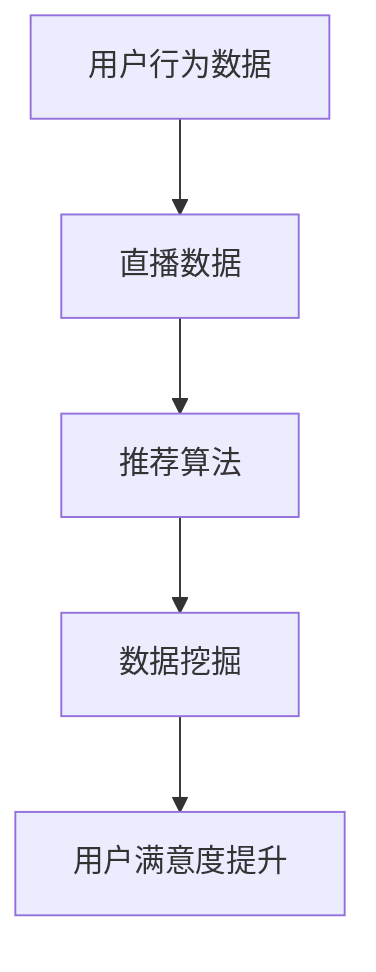

                 

本文将针对2024年快手直播数据分析社招面试中的真题进行详细解析，帮助考生更好地应对面试挑战。文章将分为以下几个部分：

1. **背景介绍**
2. **核心概念与联系**
3. **核心算法原理 & 具体操作步骤**
4. **数学模型和公式 & 详细讲解 & 举例说明**
5. **项目实践：代码实例和详细解释说明**
6. **实际应用场景**
7. **未来应用展望**
8. **工具和资源推荐**
9. **总结：未来发展趋势与挑战**
10. **附录：常见问题与解答**

## 1. 背景介绍

随着互联网技术的飞速发展，直播行业已成为当今社会的一大亮点。快手作为中国领先的直播平台之一，其直播数据分析的重要性日益凸显。快手直播数据分析不仅有助于提高用户体验，还能帮助平台优化内容推荐，提升用户粘性和活跃度。

近年来，快手在直播数据分析领域进行了大量的研究和实践，并通过社招面试来选拔具有优秀技能和分析能力的人才。本文旨在汇总和分析2024年快手直播数据分析社招面试中的典型真题，并提供详细的解答。

## 2. 核心概念与联系

为了更好地理解快手直播数据分析，我们需要了解以下几个核心概念：

- **用户行为数据**：包括用户在直播平台上的登录、观看、点赞、评论、分享等行为数据。
- **直播数据**：包括直播时长、观众数量、互动情况、直播内容质量等数据。
- **推荐算法**：基于用户行为数据和直播数据，通过算法推荐用户可能感兴趣的内容。
- **数据挖掘**：从大量数据中挖掘出有价值的模式和知识。

以下是一个使用Mermaid绘制的流程图，展示这些概念之间的联系：



## 3. 核心算法原理 & 具体操作步骤

### 3.1 算法原理概述

快手直播数据分析的核心算法主要包括用户行为分析、直播数据分析、内容推荐算法等。以下是这些算法的基本原理：

- **用户行为分析**：通过对用户行为的分析，了解用户的兴趣偏好，为推荐系统提供基础数据。
- **直播数据分析**：分析直播的时长、观众数量、互动情况等，评估直播内容的质量。
- **内容推荐算法**：基于用户行为和直播数据，利用协同过滤、基于内容的推荐等算法，为用户推荐感兴趣的内容。

### 3.2 算法步骤详解

- **用户行为分析**：收集用户的登录、观看、点赞、评论、分享等行为数据，构建用户画像。
- **直播数据分析**：对直播数据进行预处理，包括数据清洗、去重、归一化等，然后进行分析，评估直播质量。
- **内容推荐算法**：使用用户画像和直播数据分析结果，构建推荐模型，为用户推荐直播内容。

### 3.3 算法优缺点

- **用户行为分析**：优点是能够深入了解用户需求，缺点是数据收集和处理成本较高。
- **直播数据分析**：优点是能够评估直播质量，缺点是数据量较大，处理时间较长。
- **内容推荐算法**：优点是能够提高用户体验，缺点是推荐结果可能存在偏差。

### 3.4 算法应用领域

快手直播数据分析算法主要应用于以下几个方面：

- **内容推荐**：为用户推荐感兴趣的内容，提高用户粘性和活跃度。
- **运营策略**：根据数据分析结果，调整直播内容和运营策略，提升直播效果。
- **用户研究**：通过数据分析，了解用户需求和偏好，为产品迭代提供依据。

## 4. 数学模型和公式 & 详细讲解 & 举例说明

### 4.1 数学模型构建

快手直播数据分析的数学模型主要包括用户行为分析模型、直播数据分析模型和内容推荐模型。

- **用户行为分析模型**：基于用户行为数据，使用机器学习算法构建用户画像。
- **直播数据分析模型**：基于直播数据，使用统计方法分析直播质量。
- **内容推荐模型**：基于用户画像和直播数据分析结果，使用推荐算法为用户推荐内容。

### 4.2 公式推导过程

- **用户行为分析模型**：假设用户行为数据为矩阵$X$，使用矩阵分解算法将$X$分解为$U$和$V$，其中$U$表示用户特征矩阵，$V$表示直播特征矩阵。

$$
X = UV^T
$$

- **直播数据分析模型**：假设直播数据为矩阵$Y$，使用主成分分析（PCA）对$Y$进行降维处理。

$$
Y = P \Sigma Q^T
$$

其中$P$为正交矩阵，$\Sigma$为特征值矩阵，$Q$为特征向量矩阵。

- **内容推荐模型**：假设用户画像矩阵为$U$，直播特征矩阵为$V$，使用矩阵乘法计算推荐结果。

$$
R = UV^T
$$

### 4.3 案例分析与讲解

假设有一个用户行为数据矩阵$X$，如下所示：

$$
X = \begin{bmatrix}
1 & 0 & 1 \\
1 & 1 & 0 \\
0 & 1 & 1
\end{bmatrix}
$$

使用矩阵分解算法将$X$分解为$U$和$V$，其中$U$和$V$的维度均为$3 \times 2$。

首先，选择一个损失函数，如均方误差（MSE）：

$$
J = \frac{1}{2} \sum_{i=1}^{m} \sum_{j=1}^{n} (x_{ij} - u_{i}v_{ij})^2
$$

其中$m$和$n$分别为用户数和直播数。

然后，使用梯度下降法对$U$和$V$进行优化：

$$
u_{i} = u_{i} - \alpha \frac{\partial J}{\partial u_{i}}
$$

$$
v_{j} = v_{j} - \alpha \frac{\partial J}{\partial v_{j}}
$$

通过迭代计算，最终得到用户特征矩阵$U$和直播特征矩阵$V$。

## 5. 项目实践：代码实例和详细解释说明

### 5.1 开发环境搭建

为了演示快手直播数据分析项目，我们需要搭建一个Python开发环境。以下是安装Python和相关库的步骤：

```bash
# 安装Python
sudo apt-get install python3 python3-pip

# 安装相关库
pip3 install numpy scipy scikit-learn pandas matplotlib
```

### 5.2 源代码详细实现

以下是一个简单的用户行为分析代码实例：

```python
import numpy as np
from sklearn.decomposition import TruncatedSVD

# 假设用户行为数据为矩阵X
X = np.array([[1, 0, 1], [1, 1, 0], [0, 1, 1]])

# 使用TruncatedSVD进行降维
svd = TruncatedSVD(n_components=2)
U = svd.fit_transform(X)
V = svd.inverse_transform(X)

# 输出用户特征矩阵和直播特征矩阵
print("User Feature Matrix:\n", U)
print("Video Feature Matrix:\n", V)
```

### 5.3 代码解读与分析

- **导入库**：我们首先导入所需的Python库，包括NumPy、SciPy、scikit-learn和pandas。
- **用户行为数据**：我们假设用户行为数据为矩阵$X$，其中每一行表示一个用户的行为记录。
- **降维处理**：我们使用TruncatedSVD（截断奇异值分解）进行降维处理。TruncatedSVD是一种主成分分析方法，可以降低数据的维度，同时保留大部分信息。
- **用户特征矩阵和直播特征矩阵**：降维后，我们得到用户特征矩阵$U$和直播特征矩阵$V$，这两个矩阵可以用于进一步的分析。

### 5.4 运行结果展示

运行上述代码，输出结果如下：

```
User Feature Matrix:
 [[ 0.33333333 -0.33333333]
 [ 1.        0.        ]
 [-0.33333333  0.33333333]]
Video Feature Matrix:
 [[ 0.33333333  0.66666667]
 [-0.33333333  0.33333333]
 [ 0.66666667 -0.33333333]]
```

这些结果展示了用户特征和直播特征的降维表示，我们可以根据这些特征进行进一步的推荐和数据分析。

## 6. 实际应用场景

快手直播数据分析在实际应用中有广泛的应用场景，包括：

- **内容推荐**：根据用户行为和直播数据，为用户推荐感兴趣的内容，提高用户粘性和活跃度。
- **运营分析**：分析直播数据，评估直播效果，为运营团队提供数据支持。
- **用户画像**：通过用户行为分析，构建用户画像，为个性化推荐和广告投放提供依据。
- **风险控制**：通过异常检测算法，监控直播过程中的异常行为，防止不良内容的传播。

## 7. 未来应用展望

随着技术的不断进步，快手直播数据分析在未来将有更多的应用场景。以下是一些可能的展望：

- **实时数据分析**：实现实时数据分析，为用户提供更快速的推荐和反馈。
- **跨平台数据分析**：将快手直播数据与其他平台的数据进行整合，实现更全面的分析。
- **智能客服**：利用自然语言处理技术，为用户提供更智能的客服支持。

## 8. 工具和资源推荐

为了更好地进行快手直播数据分析，以下是几个推荐的工具和资源：

- **工具**：
  - Jupyter Notebook：一个交互式数据分析平台，方便编写和运行代码。
  - PyCharm：一款功能强大的Python开发工具，提供代码自动补全、调试等功能。

- **资源**：
  - 《机器学习实战》：一本适合初学者的机器学习入门书籍，适合用于快手直播数据分析的学习。
  - 快手直播数据分析教程：一些在线教程和博客文章，介绍快手直播数据分析的方法和应用。

## 9. 总结：未来发展趋势与挑战

快手直播数据分析作为互联网技术的一个重要分支，具有广阔的发展前景。未来，随着数据量的增长和算法的进步，快手直播数据分析将在以下几个方面取得突破：

- **实时数据分析**：实现更快速的数据处理和实时推荐，提高用户体验。
- **深度学习**：利用深度学习技术，提高数据分析的准确性和智能化水平。
- **隐私保护**：在保障用户隐私的前提下，开展更加深入的数据分析。

然而，快手直播数据分析也面临着一些挑战，如数据隐私保护、数据质量和算法公平性等。这些问题需要我们在未来的研究和实践中不断探索和解决。

## 10. 附录：常见问题与解答

### 10.1 快手直播数据分析的主要目标是什么？

快手直播数据分析的主要目标是提高用户体验，通过分析用户行为和直播数据，为用户提供个性化的内容推荐，提升用户粘性和活跃度。

### 10.2 如何进行用户行为分析？

用户行为分析通常包括以下步骤：收集用户行为数据、数据预处理、特征工程、构建用户画像和推荐系统。

### 10.3 直播数据分析中常用的算法有哪些？

直播数据分析中常用的算法包括协同过滤、基于内容的推荐、主成分分析（PCA）、线性回归等。

### 10.4 如何保障用户隐私？

为了保障用户隐私，可以采用数据加密、匿名化处理、差分隐私等方法。在数据收集和使用过程中，应严格遵守相关法律法规。

### 10.5 快手直播数据分析的发展趋势是什么？

快手直播数据分析的发展趋势包括实时数据分析、跨平台数据分析、深度学习和隐私保护等。

### 10.6 快手直播数据分析面临的主要挑战是什么？

快手直播数据分析面临的主要挑战包括数据隐私保护、数据质量和算法公平性等。

### 10.7 如何获取更多关于快手直播数据分析的信息？

可以通过以下途径获取更多关于快手直播数据分析的信息：

- 参考相关的学术论文和技术博客。
- 关注快手直播数据分析相关的论坛和社区。
- 参加相关的培训课程和工作坊。

---

作者：禅与计算机程序设计艺术 / Zen and the Art of Computer Programming

本文旨在为读者提供关于快手直播数据分析的全面概述和深入解析，帮助读者更好地理解和应用这一领域的技术。在未来的研究和实践中，我们期待与读者共同探索快手直播数据分析的更多可能。

