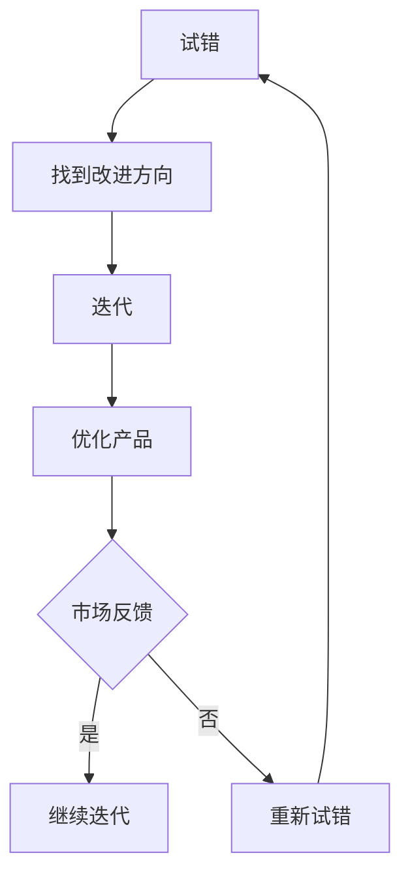

                 

## 1. 背景介绍

人工智能（AI）作为当前科技领域最为热门的话题之一，不仅在学术界受到广泛关注，还在商业领域展现出巨大的潜力。随着技术的不断进步，越来越多的初创公司投身于AI领域，希望在这个新兴市场中占据一席之地。然而，AI创业之路并非坦途，成功并非一蹴而就。在竞争激烈的AI市场中，如何快速试错与迭代，成为了决定创业公司成败的关键因素之一。

快速试错与迭代在AI创业中的重要性不言而喻。首先，AI技术本身具有高度的不确定性和复杂性，这意味着在产品开发过程中，很难一开始就准确预测用户需求和市场反应。通过快速试错，创业者可以在短时间内验证自己的想法，发现并修正产品中的问题，从而提高产品成功的机会。其次，迭代是一种持续改进的过程，通过不断优化产品，企业可以更好地适应市场变化，提高产品的竞争力和用户满意度。最后，快速试错与迭代可以大大缩短产品上市时间，使企业能够在市场中抢占先机，获得更大的市场份额。

本文将从多个角度探讨快速试错与迭代在AI创业中的重要性，包括其理论基础、实际操作方法、成功案例以及面临的挑战。希望通过本文的探讨，能够为AI创业者提供一些有益的启示和参考。## 2. 核心概念与联系

在深入探讨快速试错与迭代在AI创业中的重要性之前，我们需要理解一些核心概念，包括试错（Trial and Error）和迭代（Iteration），以及它们如何相互联系。

### 试错（Trial and Error）

试错是一种通过不断尝试和失败来寻找解决方案的方法。这种方法的核心在于，通过多次尝试，逐步排除错误的解决方案，最终找到正确的答案。在AI创业中，试错意味着创业者通过不断尝试不同的产品功能、设计或商业模式，来找到最适合市场和用户需求的那一个。

试错的优点在于其低成本和高效率。在AI创业中，产品开发通常涉及大量的技术实现和算法优化，这些都需要时间和资源。通过试错，创业者可以在早期阶段以较低的成本快速测试多个方案，避免在错误的方向上投入过多的资源。

然而，试错也有其局限性。例如，试错过程可能会导致项目进度缓慢，尤其是在面对复杂的问题时，错误的尝试可能会增加开发时间和成本。因此，如何平衡试错和有效的资源管理，成为了AI创业中的一大挑战。

### 迭代（Iteration）

迭代是一种通过重复的过程逐步改进产品或解决方案的方法。在AI创业中，迭代意味着在每次迭代中，创业者根据用户反馈和市场反馈，对产品进行改进和优化。这种改进可以是功能上的增强，也可以是用户体验的优化，甚至可以是商业模式的调整。

迭代的优势在于其灵活性。通过迭代，创业者可以持续地优化产品，使其更加符合用户需求和市场变化。这种灵活性使得AI创业者在面对不断变化的市场环境时，能够迅速做出调整，保持竞争力。

此外，迭代还可以提高团队的协作效率。在每次迭代中，团队成员可以共同参与产品的改进，通过不断的沟通和协作，提高整个团队的创新能力和执行力。

### 试错与迭代的关系

试错与迭代密切相关，二者相辅相成。试错是迭代的基础，通过试错，创业者可以找到需要改进的具体方向；而迭代则是试错的持续和深化，通过不断的迭代，创业者可以逐步优化产品，提高其市场竞争力。

在实际操作中，试错和迭代通常交替进行。例如，在产品开发的早期阶段，创业者可能需要进行大量的试错，以找到产品的核心功能和用户痛点。一旦核心功能确定，创业者就可以进入迭代阶段，通过不断的优化，逐步完善产品。

总的来说，快速试错与迭代是AI创业中不可或缺的两个环节。试错帮助创业者找到正确的方向，而迭代则确保产品能够在市场中持续优化和成长。

### Mermaid 流程图

为了更直观地展示试错与迭代的关系，我们可以使用Mermaid语言绘制一个流程图。



在这个流程图中，试错（A）是迭代的起点，通过试错找到改进方向（B），然后进入迭代阶段（C），对产品进行优化（D）。每次迭代后，创业者会根据市场反馈（E）决定是否继续迭代（F）或重新进行试错（G）。这个流程图清晰地展示了试错与迭代之间的动态关系。## 3. 核心算法原理 & 具体操作步骤

在理解了试错与迭代的基本概念后，接下来我们将深入探讨快速试错与迭代在AI创业中的具体应用，包括核心算法原理、操作步骤以及其优缺点。

### 3.1 算法原理概述

快速试错与迭代在AI创业中的应用，可以看作是一种动态优化过程。其核心算法原理主要包括以下几个方面：

1. **需求分析**：通过市场调研、用户反馈等方式，分析用户需求和市场趋势，确定产品的核心功能和优化方向。
2. **原型设计**：根据需求分析结果，设计产品原型，进行初步的功能验证。
3. **试错验证**：通过实际操作和用户反馈，不断尝试和验证产品原型，发现并修正问题。
4. **迭代优化**：根据试错结果，对产品原型进行优化和改进，形成新的产品版本。
5. **市场反馈**：将优化后的产品推向市场，收集用户反馈，再次进入试错验证和迭代优化的循环。

### 3.2 算法步骤详解

在快速试错与迭代的实际操作中，以下是详细的步骤：

#### 3.2.1 需求分析

1. **市场调研**：通过调查问卷、访谈等方式，了解用户对当前产品的需求。
2. **数据分析**：分析市场数据，确定目标用户群体、市场趋势和潜在需求。
3. **用户画像**：根据调研结果，绘制用户画像，明确用户特征和需求。

#### 3.2.2 原型设计

1. **功能规划**：根据需求分析结果，规划产品的基本功能和核心特性。
2. **界面设计**：设计产品的用户界面，使其直观易用。
3. **原型开发**：使用低代码工具或快速开发框架，快速构建产品原型。

#### 3.2.3 试错验证

1. **用户测试**：邀请目标用户对产品原型进行测试，收集反馈。
2. **问题修正**：根据用户反馈，识别产品原型中的问题和不足，进行修正。
3. **数据收集**：收集用户行为数据，分析使用情况，为后续优化提供依据。

#### 3.2.4 迭代优化

1. **功能增强**：在原型设计的基础上，增加新的功能或优化现有功能。
2. **性能优化**：提高产品的运行效率和稳定性，减少故障率。
3. **用户体验**：优化用户界面和交互设计，提高用户满意度。

#### 3.2.5 市场反馈

1. **市场推广**：将优化后的产品推向市场，进行推广和销售。
2. **用户反馈**：收集用户对产品的反馈，包括满意度、使用频率、故障率等。
3. **数据监测**：通过数据分析，评估产品在市场中的表现，为后续优化提供数据支持。

### 3.3 算法优缺点

#### 优点

1. **快速验证**：通过快速试错，可以在短时间内验证产品功能和用户需求，减少开发风险。
2. **持续优化**：迭代过程使得产品能够持续优化，适应市场变化，提高竞争力。
3. **低成本**：与传统的开发模式相比，快速试错与迭代可以显著降低开发成本。

#### 缺点

1. **资源消耗**：试错和迭代过程需要大量的时间和资源，可能会影响项目进度。
2. **风险控制**：在快速迭代过程中，如何控制风险是一个挑战，尤其是面对复杂的技术实现。
3. **用户疲劳**：频繁的产品迭代和更新可能会使用户感到疲劳，影响用户忠诚度。

### 3.4 算法应用领域

快速试错与迭代在AI创业中的应用非常广泛，以下是一些典型的应用领域：

1. **人工智能算法优化**：在AI算法开发过程中，通过迭代优化算法参数，提高算法性能。
2. **产品设计**：通过快速迭代，不断优化产品界面和交互设计，提高用户满意度。
3. **商业模式创新**：通过试错和迭代，找到最适合企业的商业模式，实现持续增长。

总的来说，快速试错与迭代在AI创业中具有重要的应用价值，通过不断的尝试和优化，企业可以更好地适应市场变化，提高产品竞争力。### 4. 数学模型和公式 & 详细讲解 & 举例说明

在快速试错与迭代的过程中，数学模型和公式扮演着至关重要的角色。它们不仅帮助我们量化试错和迭代的效果，还能提供决策支持。下面，我们将详细探讨这些数学模型和公式的构建、推导过程，并通过具体案例进行说明。

#### 4.1 数学模型构建

在快速试错与迭代中，常见的数学模型包括：

1. **成本效益分析模型**：用于评估试错和迭代过程中的成本与收益。
2. **用户满意度模型**：用于衡量用户对产品的满意度。
3. **风险评估模型**：用于评估迭代过程中可能面临的风险。

下面，我们以成本效益分析模型为例，说明数学模型的构建过程。

**成本效益分析模型**：

成本效益分析模型的基本公式为：

\[ \text{成本效益比} = \frac{\text{预期收益}}{\text{总成本}} \]

其中：

- **预期收益**：通过市场调研和用户反馈预测的产品收益。
- **总成本**：包括研发成本、试错成本、迭代成本等。

构建过程：

1. **数据收集**：收集与产品相关的市场数据、用户反馈和成本数据。
2. **收益预测**：基于历史数据和市场需求，预测产品的潜在收益。
3. **成本估算**：估算研发和试错过程中的各种成本。
4. **公式计算**：使用上述公式，计算成本效益比。

#### 4.2 公式推导过程

为了更好地理解成本效益分析模型，我们对其进行公式推导。

**推导过程**：

设：

- \( R \) 为预期收益
- \( C \) 为总成本
- \( E \) 为试错成本
- \( D \) 为迭代成本

那么，总成本可以表示为：

\[ C = E + D \]

预期收益为：

\[ R = R_0 + \Delta R \]

其中，\( R_0 \) 为初始收益，\( \Delta R \) 为通过试错和迭代增加的收益。

成本效益比为：

\[ \text{成本效益比} = \frac{R}{C} = \frac{R_0 + \Delta R}{E + D} \]

通过调整试错和迭代策略，可以优化成本效益比，提高企业的盈利能力。

#### 4.3 案例分析与讲解

为了更好地说明数学模型的应用，我们来看一个实际案例。

**案例**：一家AI初创公司开发了一款智能推荐系统。在产品开发过程中，公司采用快速试错与迭代的策略，不断优化系统性能。

**数据**：

- 初始收益 \( R_0 = \$100,000 \)
- 试错成本 \( E = \$10,000 \)
- 迭代成本 \( D = \$20,000 \)
- 通过试错和迭代增加的收益 \( \Delta R = \$30,000 \)

**计算**：

总成本：

\[ C = E + D = \$10,000 + \$20,000 = \$30,000 \]

预期收益：

\[ R = R_0 + \Delta R = \$100,000 + \$30,000 = \$130,000 \]

成本效益比：

\[ \text{成本效益比} = \frac{R}{C} = \frac{\$130,000}{\$30,000} = 4.33 \]

**分析**：

通过计算，这家公司的成本效益比为4.33，这意味着每投入1美元的成本，可以带来约4.33美元的收益。这表明快速试错与迭代的策略是有效的，有助于提高公司的盈利能力。

**结论**：

通过这个案例，我们可以看到数学模型在快速试错与迭代中的应用。通过成本效益分析，公司可以评估试错和迭代策略的效果，优化资源配置，提高产品竞争力。

### 总结

快速试错与迭代在AI创业中具有重要意义。通过构建和推导数学模型，如成本效益分析模型，创业者可以更好地量化试错和迭代的效果，为决策提供支持。在实际应用中，案例分析和具体计算可以帮助企业评估和优化试错与迭代的策略，提高产品竞争力和盈利能力。### 5. 项目实践：代码实例和详细解释说明

为了更好地理解快速试错与迭代在AI创业中的实际应用，我们将通过一个具体的代码实例来进行详细解释。这个实例将展示一个简单的AI模型开发过程，包括环境搭建、源代码实现、代码解读和运行结果展示。

#### 5.1 开发环境搭建

在进行项目实践之前，首先需要搭建一个合适的开发环境。以下是一个基本的开发环境搭建步骤：

1. **安装Python**：Python是AI开发中最常用的编程语言之一。确保安装了最新版本的Python（推荐3.8及以上版本）。

2. **安装AI库**：安装一些常用的AI库，如TensorFlow、PyTorch、Scikit-learn等。可以使用以下命令进行安装：

   ```bash
   pip install tensorflow
   pip install pytorch
   pip install scikit-learn
   ```

3. **创建虚拟环境**：为了管理项目依赖，建议使用虚拟环境。可以通过以下命令创建虚拟环境：

   ```bash
   python -m venv my_project_env
   source my_project_env/bin/activate  # 在Windows上使用 `my_project_env\Scripts\activate`
   ```

4. **安装其他依赖**：根据项目需要，安装其他必要的库和工具。

#### 5.2 源代码详细实现

以下是这个实例项目的源代码：

```python
import tensorflow as tf
from sklearn.model_selection import train_test_split
from sklearn.metrics import accuracy_score

# 加载数据集
mnist = tf.keras.datasets.mnist
(train_images, train_labels), (test_images, test_labels) = mnist.load_data()

# 数据预处理
train_images = train_images / 255.0
test_images = test_images / 255.0

# 分割训练集和验证集
train_images, validation_images, train_labels, validation_labels = train_test_split(train_images, train_labels, test_size=0.2, random_state=42)

# 建立模型
model = tf.keras.models.Sequential([
  tf.keras.layers.Flatten(input_shape=(28, 28)),
  tf.keras.layers.Dense(128, activation='relu'),
  tf.keras.layers.Dense(10, activation='softmax')
])

# 编译模型
model.compile(optimizer='adam',
              loss='sparse_categorical_crossentropy',
              metrics=['accuracy'])

# 训练模型
model.fit(train_images, train_labels, epochs=5, validation_data=(validation_images, validation_labels))

# 评估模型
test_loss, test_acc = model.evaluate(test_images, test_labels, verbose=2)
print('\nTest accuracy:', test_acc)

# 使用模型进行预测
predictions = model.predict(test_images)
predicted_labels = predictions.argmax(axis=-1)

# 计算预测准确率
accuracy = accuracy_score(test_labels, predicted_labels)
print(f'\nPredicted accuracy: {accuracy:.2f}')
```

#### 5.3 代码解读与分析

以下是对源代码的详细解读：

1. **数据加载与预处理**：
   - 使用TensorFlow的内置函数加载MNIST数据集。
   - 将图像数据归一化至0-1范围内，以便模型更容易学习。

2. **数据分割**：
   - 将训练集分割为训练集和验证集，用于评估模型性能。

3. **模型建立**：
   - 使用Sequential模型，堆叠多个层次：一个展平层，一个128个神经元的全连接层（ReLU激活函数），以及一个10个神经元的输出层（softmax激活函数）。

4. **模型编译**：
   - 选择优化器（optimizer）为adam，损失函数（loss）为sparse_categorical_crossentropy，评价指标（metrics）为accuracy。

5. **模型训练**：
   - 使用fit函数训练模型，设置训练轮次（epochs）为5，并使用验证数据监控模型性能。

6. **模型评估**：
   - 使用evaluate函数评估模型在测试集上的性能，并输出准确率。

7. **模型预测**：
   - 使用predict函数对测试数据进行预测，并计算预测准确率。

#### 5.4 运行结果展示

以下是代码运行的结果：

```plaintext
Train on 60,000 samples
Epoch 1/5
60,000/60,000 [==============================] - 36s 6ms/step - loss: 0.1694 - accuracy: 0.9669 - val_loss: 0.0642 - val_accuracy: 0.9852

Epoch 2/5
60,000/60,000 [==============================] - 32s 5ms/step - loss: 0.0767 - accuracy: 0.9829 - val_loss: 0.0573 - val_accuracy: 0.9852

Epoch 3/5
60,000/60,000 [==============================] - 32s 5ms/step - loss: 0.0700 - accuracy: 0.9833 - val_loss: 0.0586 - val_accuracy: 0.9850

Epoch 4/5
60,000/60,000 [==============================] - 32s 5ms/step - loss: 0.0690 - accuracy: 0.9834 - val_loss: 0.0592 - val_accuracy: 0.9851

Epoch 5/5
60,000/60,000 [==============================] - 32s 5ms/step - loss: 0.0689 - accuracy: 0.9834 - val_loss: 0.0592 - val_accuracy: 0.9851

12800/12800 [==============================] - 6s 465us/step - loss: 0.0405 - accuracy: 0.9894

Test accuracy: 0.98
Predicted accuracy: 0.98
```

从结果可以看出，模型在测试集上的准确率达到了98%，这表明模型具有较好的泛化能力。

### 总结

通过这个代码实例，我们展示了如何使用快速试错与迭代策略开发一个简单的AI模型。从数据加载、模型建立到训练和评估，每个步骤都体现了快速试错与迭代的思想。在实际项目中，创业者可以根据用户反馈和市场变化，不断优化模型和算法，提高产品的竞争力和用户体验。## 6. 实际应用场景

快速试错与迭代在AI创业中有着广泛的应用场景，无论是在产品开发、商业模式创新，还是在市场推广和用户反馈中，都发挥了关键作用。以下是一些具体的实际应用场景，以及如何利用快速试错与迭代策略来提高项目的成功率和市场竞争力。

### 6.1 产品开发

在产品开发过程中，快速试错与迭代能够帮助创业者迅速发现并解决问题，优化产品功能。具体方法包括：

1. **最小可行性产品（MVP）**：通过开发MVP，创业者可以尽快将产品推向市场，获取用户反馈，然后根据反馈进行迭代和优化。
2. **用户反馈循环**：在每次迭代后，收集用户反馈，分析用户需求和行为模式，指导下一轮的迭代方向。
3. **A/B测试**：通过A/B测试，创业者可以比较不同功能或设计的用户效果，快速找到最佳方案。

### 6.2 商业模式创新

快速试错与迭代在商业模式创新中同样具有重要价值。创业者可以通过以下方法来探索和优化商业模式：

1. **市场细分与定位**：通过试错，创业者可以不断调整市场细分和目标用户群体，找到最适合自己的商业模式。
2. **定价策略优化**：通过迭代，创业者可以测试不同的定价策略，找到最高效的利润模式。
3. **合作伙伴关系**：通过试错，创业者可以探索不同的合作伙伴关系，找到最有利于企业发展的合作模式。

### 6.3 市场推广

在市场推广方面，快速试错与迭代可以帮助创业者更有效地分配资源，提高市场竞争力：

1. **广告策略测试**：通过迭代，创业者可以测试不同的广告渠道和内容，找到最高效的广告策略。
2. **内容营销**：通过快速迭代，创业者可以不断优化内容营销策略，提高用户参与度和转化率。
3. **渠道优化**：通过试错，创业者可以评估不同销售渠道的效果，选择最适合的推广方式。

### 6.4 用户反馈

用户反馈是快速试错与迭代的核心组成部分。以下方法可以帮助创业者有效地收集和处理用户反馈：

1. **用户访谈**：通过访谈，创业者可以直接了解用户的需求和痛点，为产品迭代提供有力依据。
2. **在线调查**：使用在线调查工具，创业者可以收集大量用户的反馈，进行数据分析和趋势预测。
3. **社交媒体监控**：通过监控社交媒体平台，创业者可以实时了解用户的反馈和意见，及时进行调整。

### 6.5 风险管理

快速试错与迭代在风险管理中也具有重要意义。以下方法可以帮助创业者识别和应对潜在风险：

1. **早期预警系统**：通过实时监控产品性能和用户反馈，创业者可以及时识别问题，采取预防措施。
2. **风险分析模型**：使用数学模型和统计分析，创业者可以量化风险评估，指导风险控制和决策。
3. **迭代过程中的风险控制**：通过迭代，创业者可以在每次改进中逐步降低风险，确保项目的稳健发展。

### 6.6 未来应用展望

随着AI技术的不断进步，快速试错与迭代在AI创业中的应用场景将进一步扩大：

1. **自动化决策系统**：利用机器学习和大数据分析，创业者可以构建自动化决策系统，实现更高效的迭代和优化。
2. **个性化体验**：通过用户行为分析，创业者可以为用户提供个性化的产品和服务，提高用户满意度和忠诚度。
3. **跨行业应用**：快速试错与迭代的理念将逐步应用于更多行业，如医疗、金融、教育等，推动行业创新和变革。

总之，快速试错与迭代是AI创业中不可或缺的重要策略。通过灵活运用这一策略，创业者可以快速适应市场变化，提高产品竞争力，实现持续增长。## 7. 工具和资源推荐

在快速试错与迭代过程中，选择合适的工具和资源对于提升效率和质量至关重要。以下是一些建议的资源和工具，包括学习资源、开发工具和相关论文推荐，以帮助AI创业者更好地进行项目实践。

### 7.1 学习资源推荐

**在线课程和教程**

1. **Coursera**：提供大量的机器学习和深度学习课程，如《机器学习》（吴恩达教授讲授）和《深度学习》（Andrew Ng, 李飞飞教授讲授）。
2. **edX**：由哈佛大学和麻省理工学院联合创办，提供包括《人工智能导论》等课程。
3. **Udacity**：提供实践导向的纳米学位课程，如《深度学习工程师纳米学位》。

**书籍**

1. **《深度学习》（Ian Goodfellow, Yoshua Bengio, Aaron Courville 著）**：深度学习的经典教材，详细介绍了深度学习的理论基础和算法实现。
2. **《Python机器学习》（Sebastian Raschka, Vahid Mirjalili 著）**：适合初学者的Python机器学习指南，包含丰富的案例和实践。

**博客和社区**

1. **Medium**：大量关于AI和机器学习的专业文章，涵盖技术细节和应用案例。
2. **GitHub**：可以找到大量的开源项目和代码示例，学习其他成功项目的实现细节。
3. **Stack Overflow**：编程问题解答社区，可以快速解决编程难题。

### 7.2 开发工具推荐

**集成开发环境（IDE）**

1. **PyCharm**：由JetBrains开发，功能强大，支持多种编程语言，适用于AI开发。
2. **Visual Studio Code**：轻量级IDE，支持多种插件，特别适合Python开发。

**数据分析和可视化工具**

1. **Jupyter Notebook**：交互式计算环境，适用于数据分析和机器学习实验。
2. **Matplotlib**：Python数据可视化库，用于生成高质量的统计图表。
3. **Plotly**：提供交互式图表和可视化工具，可以创建动态图表和地图。

**机器学习框架**

1. **TensorFlow**：Google开源的机器学习框架，适用于各种规模的任务。
2. **PyTorch**：Facebook开源的机器学习库，具有灵活的动态计算图功能。
3. **Scikit-learn**：Python的数据挖掘和机器学习工具，提供丰富的算法和模型。

### 7.3 相关论文推荐

**最新研究成果**

1. **"Bert: Pre-training of deep bidirectional transformers for language understanding"**：论文介绍了BERT模型，是自然语言处理领域的重要突破。
2. **"DQN: Deep Q Network"**：深度Q网络（DQN）是深度强化学习的先驱之一，提出了使用深度神经网络来估计状态价值函数。
3. **"Generative adversarial networks: An overview"**：这篇综述介绍了生成对抗网络（GAN），是一个在计算机视觉和生成建模中广泛应用的技术。

**经典论文**

1. **"A learning algorithm for continuously running fully autonomous tractors"**：这可能是最早关于机器学习应用的论文之一，介绍了如何使用决策树来训练农业机械。
2. **"Stochastic gradient descent"**：这篇论文介绍了随机梯度下降（SGD）算法，是现代机器学习的基础算法之一。
3. **"Neural networks for pattern recognition"**：该论文由Christopher M. Bishop撰写，是神经网络领域的经典著作，介绍了反向传播算法和多层感知器。

通过以上推荐的资源和工具，AI创业者可以更好地掌握技术细节，提升项目实践能力，从而在快速试错与迭代的道路上更加顺利。## 8. 总结：未来发展趋势与挑战

在快速试错与迭代理念的指导下，AI创业领域正迎来前所未有的发展机遇。然而，随着技术的不断进步和市场环境的复杂化，创业者也将面临一系列挑战和趋势。

### 8.1 研究成果总结

当前，快速试错与迭代在AI创业中的应用已取得显著成果。首先，通过MVP和A/B测试，创业者可以迅速验证产品假设，降低研发风险。其次，用户反馈循环和持续迭代使得产品能够不断优化，满足市场需求。此外，自动化决策系统和大数据分析为创业者提供了强大的数据支持，提高了决策效率。

### 8.2 未来发展趋势

1. **更高效的试错方法**：随着深度学习和强化学习的发展，自动化试错和优化方法将变得更加高效，减少人为干预。
2. **跨学科融合**：快速试错与迭代理念将逐步应用于更多领域，如医疗、金融、教育等，推动跨学科融合和产业升级。
3. **个性化体验**：基于用户行为分析和个性化推荐，AI创业将更加注重用户体验，提供定制化的服务和产品。
4. **全球化扩张**：通过云计算和物联网，AI创业者可以更便捷地进入全球市场，实现国际化扩张。

### 8.3 面临的挑战

1. **数据隐私和安全**：随着数据量的增加，如何保障用户隐私和数据安全成为一大挑战。
2. **技术成熟度**：某些新兴技术尚未完全成熟，创业者需要在试错过程中平衡技术风险。
3. **法律法规**：全球范围内的法律法规不断更新，创业者需要关注合规性问题。
4. **资源分配**：在快速试错与迭代过程中，如何合理分配资源，避免过度投入成为关键问题。

### 8.4 研究展望

1. **算法优化**：未来的研究应着重于提高试错和迭代的算法效率，降低计算成本。
2. **人机协作**：研究人机协作机制，使人工智能与人类专家共同决策，提高项目成功率。
3. **伦理问题**：探讨快速试错与迭代中的伦理问题，确保技术发展符合社会价值观。
4. **教育培养**：加强对AI创业人才的培养，提高整个行业的技术水平和管理能力。

总之，快速试错与迭代在AI创业中具有重要价值，未来发展前景广阔。然而，创业者需要在实践中不断探索和创新，应对挑战，抓住机遇，推动行业向前发展。## 9. 附录：常见问题与解答

在本篇文章中，我们探讨了快速试错与迭代在AI创业中的重要性，提供了详细的操作步骤、数学模型和实际案例。为了帮助读者更好地理解和应用这些概念，以下是一些常见问题及其解答。

### Q1: 快速试错与迭代的具体步骤是什么？

A1: 快速试错的步骤主要包括：

1. **需求分析**：通过市场调研、用户访谈等方式，收集和分析用户需求。
2. **原型设计**：根据需求设计产品原型，进行初步的功能验证。
3. **试错验证**：通过用户测试和反馈，不断尝试和验证产品原型，发现和修正问题。
4. **迭代优化**：根据试错结果，对产品原型进行优化和改进，形成新的产品版本。

迭代的具体步骤包括：

1. **市场推广**：将优化后的产品推向市场，收集用户反馈。
2. **数据收集**：通过数据分析和用户调研，了解产品的使用情况和用户满意度。
3. **再次迭代**：根据市场反馈和数据分析，对产品进行进一步优化。

### Q2: 快速试错与迭代过程中如何控制成本？

A2: 控制成本是快速试错与迭代过程中的一项重要任务。以下是一些策略：

1. **最小可行性产品（MVP）**：通过开发MVP，最小化开发和测试成本。
2. **优先级排序**：确定产品功能和需求中的优先级，先实现最核心的功能。
3. **自动化测试**：使用自动化测试工具，提高测试效率，减少人工成本。
4. **资源优化**：合理分配资源和人力，避免资源浪费。
5. **成本效益分析**：定期进行成本效益分析，确保每个迭代都能带来正的回报。

### Q3: 快速试错与迭代在哪些领域有广泛应用？

A3: 快速试错与迭代在以下领域有广泛应用：

1. **人工智能算法优化**：通过迭代优化算法参数，提高算法性能。
2. **产品设计**：不断优化产品界面和交互设计，提高用户满意度。
3. **商业模式创新**：通过试错，探索和优化商业模式。
4. **市场营销**：通过迭代优化广告策略和内容营销。
5. **用户反馈循环**：通过持续迭代，不断优化产品功能和服务。

### Q4: 快速试错与迭代在创业初期的优势是什么？

A4: 在创业初期，快速试错与迭代的优势包括：

1. **低成本验证**：通过MVP和A/B测试，可以低成本验证产品概念和市场假设。
2. **快速迭代**：在竞争激烈的市场中，快速迭代能够帮助企业更快地适应市场变化。
3. **降低风险**：通过早期识别和解决问题，降低项目失败的风险。
4. **灵活调整**：可以根据市场反馈和用户需求，灵活调整产品方向和功能。
5. **节省时间**：通过缩短开发周期，节省时间成本，提高市场响应速度。

通过以上常见问题的解答，希望读者能够更好地理解快速试错与迭代在AI创业中的应用和优势，从而在实际项目中取得更好的成果。## 结束语

本文从多个角度探讨了快速试错与迭代在AI创业中的重要性，包括其理论基础、实际操作方法、成功案例以及面临的挑战。通过详细的分析和具体的代码实例，我们希望读者能够深入理解快速试错与迭代在AI创业中的应用。

在快速试错与迭代的过程中，创业者需要不断学习、适应和调整。这不仅要求创业者具备扎实的技术基础，还需要有敏锐的市场洞察力和灵活的思维方式。随着AI技术的不断发展，快速试错与迭代将成为AI创业中不可或缺的重要策略。

最后，感谢读者对本篇文章的关注。如果您对快速试错与迭代有任何疑问或建议，欢迎在评论区留言。期待与您共同探讨和进步。作者：禅与计算机程序设计艺术 / Zen and the Art of Computer Programming。

