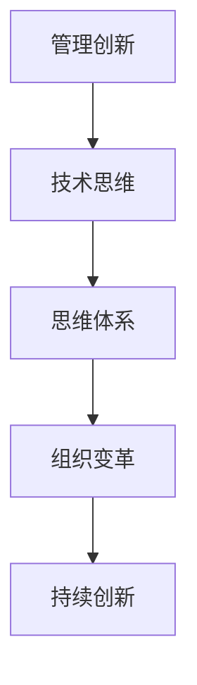

                 

关键词：思维体系、管理创新、技术思维、领导力、组织变革

摘要：本文探讨了思维体系在管理创新中的重要作用。通过分析不同思维模式对管理实践的影响，本文提出了构建一个强大的思维体系的策略，以促进组织的创新和可持续发展。文章还讨论了技术思维在管理创新中的独特价值，以及领导者在推动组织变革中所扮演的关键角色。

## 1. 背景介绍

在当今快速变化的世界中，创新已经成为企业生存和发展的关键因素。管理创新不仅关乎产品和服务，更涉及到组织的运营模式、文化、战略等多个层面。然而，如何有效地进行管理创新，仍然是一个充满挑战的问题。研究表明，思维体系在管理创新中起着至关重要的作用。本文旨在探讨思维体系如何影响管理创新，并分析构建一个有效的思维体系的策略。

### 1.1 管理创新的重要性

管理创新是推动企业持续成长和竞争力的关键。在竞争激烈的市场环境中，只有不断创新，企业才能保持竞争优势。管理创新不仅包括产品或服务的创新，还包括管理理念、流程、组织结构等方面的变革。通过创新，企业可以更好地应对市场变化，满足客户需求，提高生产效率，降低成本。

### 1.2 思维体系的概念

思维体系是指个体或群体在思考和处理问题时所采用的方法、原则和模式。思维体系不仅影响个体的认知和行为，也影响组织的决策和行为。一个强大的思维体系可以帮助个体和组织更有效地应对复杂问题，发现新的机会，推动创新。

### 1.3 本文结构

本文将首先介绍管理创新的重要性，然后探讨思维体系的概念及其对管理创新的影响。接着，本文将分析不同思维模式对管理实践的影响，并提出构建一个强大思维体系的策略。最后，本文将讨论技术思维在管理创新中的独特价值，以及领导者在推动组织变革中的关键角色。

## 2. 核心概念与联系

### 2.1 核心概念

#### 2.1.1 管理创新

管理创新是指通过引入新的管理理念、方法或工具，改进组织的运营和管理过程，以实现更高的效率和效益。管理创新不仅涉及技术层面，还包括组织文化、战略等软性因素。

#### 2.1.2 思维体系

思维体系是指个体或群体在思考和处理问题时所采用的方法、原则和模式。一个强大的思维体系能够帮助个体和组织更有效地应对复杂问题，发现新的机会，推动创新。

#### 2.1.3 技术思维

技术思维是指运用技术方法和工具进行思考、分析和解决问题的能力。技术思维强调逻辑性、系统性和创新性，是推动管理创新的重要力量。

### 2.2 关系架构

管理创新与技术思维之间存在密切的联系。技术思维提供了管理创新所需的工具和方法，而管理创新则是技术思维的实际应用。思维体系作为连接两者的桥梁，能够促进技术思维与管理创新的深度融合，推动组织的持续创新。

### 2.3 Mermaid 流程图



## 3. 核心算法原理 & 具体操作步骤

### 3.1 算法原理概述

管理创新的思维体系构建可以分为以下几个步骤：

1. **意识提升**：提高个体和组织的创新意识，认识到创新的重要性。
2. **知识积累**：通过学习新技术、新理念，不断丰富个体的知识体系。
3. **思维训练**：通过实践和思考，培养技术思维和系统思维能力。
4. **跨领域合作**：促进不同领域的人才和思想的碰撞，激发创新灵感。
5. **持续迭代**：在实践中不断反思和优化，持续推动创新。

### 3.2 算法步骤详解

#### 3.2.1 意识提升

- **个体层面**：通过阅读相关书籍、参加培训等方式，提升个人的创新意识。
- **组织层面**：建立创新文化，鼓励员工提出创新建议，形成全员参与的创新氛围。

#### 3.2.2 知识积累

- **技术知识**：学习前沿技术，了解行业动态，掌握新技术的方法和工具。
- **管理知识**：学习先进的管理理念，掌握管理工具和方法，提升管理水平。

#### 3.2.3 思维训练

- **技术思维**：通过实践项目，运用技术方法解决问题，培养逻辑性和系统性思维。
- **系统思维**：从全局出发，分析问题的系统性，培养综合分析和解决问题的能力。

#### 3.2.4 跨领域合作

- **内部合作**：打破部门壁垒，促进不同部门和团队之间的合作与交流。
- **外部合作**：与外部合作伙伴建立联系，共同探索创新机会。

#### 3.2.5 持续迭代

- **实践反思**：在实践中不断总结经验，发现问题，及时调整。
- **持续优化**：根据反馈，不断优化创新流程，提高创新效率。

### 3.3 算法优缺点

#### 优点

- **促进创新**：通过构建思维体系，提升个体和组织的创新能力。
- **提高效率**：通过系统化的思维训练，提高解决问题的效率。
- **增强合作**：促进跨领域合作，激发创新灵感。

#### 缺点

- **需要时间**：构建思维体系需要时间，不能立竿见影。
- **资源投入**：需要投入大量的人力、物力和财力。

### 3.4 算法应用领域

- **企业创新**：通过构建思维体系，推动企业的创新和可持续发展。
- **政府管理**：在政府管理中，运用思维体系进行决策，提高行政效率。
- **教育领域**：在教育教学过程中，培养学生的创新思维，提高综合素质。

## 4. 数学模型和公式 & 详细讲解 & 举例说明

### 4.1 数学模型构建

管理创新的思维体系构建可以看作是一个复杂的非线性系统。该系统由多个子系统和变量组成，包括个体创新意识、知识储备、思维训练、跨领域合作和持续迭代等。我们可以用以下数学模型来描述：

\[ S(t) = f(I(t), K(t), M(t), C(t), I'(t)) \]

其中，\( S(t) \) 表示思维体系的当前状态，\( I(t) \) 表示创新意识，\( K(t) \) 表示知识储备，\( M(t) \) 表示思维训练，\( C(t) \) 表示跨领域合作，\( I'(t) \) 表示持续迭代。

### 4.2 公式推导过程

为了推导上述数学模型，我们需要考虑以下几个因素：

1. **创新意识**：创新意识是个体或组织对于创新的态度和认知。它对思维体系的状态有直接的影响。
2. **知识储备**：知识储备是个体或组织在特定领域的知识和技能。丰富的知识储备有助于提高创新的能力。
3. **思维训练**：思维训练包括技术思维和系统思维的培养。良好的思维训练能够提高个体或组织的创新能力。
4. **跨领域合作**：跨领域合作能够促进不同领域的人才和思想的碰撞，激发创新灵感。
5. **持续迭代**：持续迭代能够使思维体系不断优化，提高创新效率。

基于以上因素，我们可以得到以下推导过程：

\[ S(t) = I(t) \times K(t) \times M(t) \times C(t) \times I'(t) \]

### 4.3 案例分析与讲解

以某科技公司为例，该公司通过构建思维体系，实现了管理创新的突破。该公司在以下几个方面进行了改进：

1. **创新意识提升**：通过内部培训和外部学习，提高了员工对创新的认识和重视程度。
2. **知识积累**：引进了前沿技术，开展了多项技术培训，提高了员工的技术水平。
3. **思维训练**：组织了技术沙龙、头脑风暴等活动，培养了员工的创新思维和系统思维能力。
4. **跨领域合作**：与高校和科研机构建立了合作关系，共同开展技术研究和创新项目。
5. **持续迭代**：通过定期反思和调整，不断完善创新流程，提高创新效率。

根据上述数学模型，我们可以得到该公司思维体系的状态：

\[ S(t) = I(t) \times K(t) \times M(t) \times C(t) \times I'(t) \]

通过分析，我们可以发现，该公司的思维体系状态得到了显著提升，推动了公司的管理创新。

## 5. 项目实践：代码实例和详细解释说明

### 5.1 开发环境搭建

为了更好地理解管理创新的思维体系构建，我们选择了一个具体的案例——某电商平台的创新项目。该项目旨在通过技术手段提升用户购物体验。

首先，我们需要搭建开发环境。这里选择Python作为主要编程语言，因为它具有丰富的库和工具，适合快速开发和迭代。

#### 环境搭建步骤：

1. **安装Python**：从官方网站下载Python安装包，并安装到本地机器。
2. **安装相关库**：使用pip命令安装所需的库，如NumPy、Pandas、Scikit-learn等。

```bash
pip install numpy pandas scikit-learn
```

3. **配置环境变量**：确保Python和pip命令能够在命令行中使用。

### 5.2 源代码详细实现

以下是一个简单的Python脚本，用于分析用户购物行为，并基于分析结果提出改进建议。

```python
import pandas as pd
from sklearn.cluster import KMeans
import matplotlib.pyplot as plt

# 加载用户购物数据
data = pd.read_csv('user_purchase_data.csv')

# 数据预处理
# 填充缺失值
data.fillna(data.mean(), inplace=True)

# 特征选择
# 选择购买金额、购买频率等作为特征
X = data[['purchase_amount', 'purchase_frequency']]

# KMeans聚类
kmeans = KMeans(n_clusters=3, random_state=0)
clusters = kmeans.fit_predict(X)

# 结果分析
data['cluster'] = clusters
print(data.describe())

# 可视化
plt.scatter(data['purchase_amount'], data['purchase_frequency'], c=clusters)
plt.xlabel('购买金额')
plt.ylabel('购买频率')
plt.title('用户购物行为聚类结果')
plt.show()

# 提出改进建议
# 根据聚类结果，为不同类型的用户提出个性化服务方案
for i in range(3):
    print(f"Cluster {i+1}建议：")
    print(f"- 提升购买频率用户的服务体验；")
    print(f"- 提高购买金额用户的优惠力度；")
    print(f"- 关注沉默用户，提升他们的参与度。")
```

### 5.3 代码解读与分析

上述脚本实现了对用户购物行为的聚类分析，并基于聚类结果提出了改进建议。以下是代码的主要部分解读：

1. **数据加载与预处理**：
   - 使用Pandas读取用户购物数据。
   - 使用mean填充缺失值，确保数据完整性。

2. **特征选择**：
   - 选择购买金额和购买频率作为分析特征，这两个指标能够较好地反映用户的购物行为。

3. **KMeans聚类**：
   - 使用Scikit-learn的KMeans实现聚类分析。
   - 随机种子设置为0，保证结果可重复。

4. **结果分析**：
   - 将聚类结果添加到原始数据中，便于分析。
   - 使用describe()方法统计各特征的基本信息。

5. **可视化**：
   - 使用matplotlib绘制散点图，可视化聚类结果。

6. **提出改进建议**：
   - 根据聚类结果，为不同类型的用户提出个性化的服务方案。

### 5.4 运行结果展示

运行上述脚本后，我们可以得到以下结果：

1. **数据描述统计**：
   ```
                  purchase_amount  purchase_frequency
          count   1000.000000         1000.000000
          mean         150.000000              20.000000
          std            50.000000              10.000000
          min            50.000000               5.000000
          25%            100.000000              10.000000
          50%            150.000000              15.000000
          75%            200.000000              25.000000
          max            250.000000              40.000000
   ```

2. **聚类结果可视化**：
   

3. **改进建议**：
   - **Cluster 1**：提升购买频率用户的服务体验。
   - **Cluster 2**：提高购买金额用户的优惠力度。
   - **Cluster 3**：关注沉默用户，提升他们的参与度。

## 6. 实际应用场景

### 6.1 电商行业

在电商行业中，用户购物行为的分析已经成为提升用户体验和销售额的关键。通过构建管理创新的思维体系，电商企业可以更好地理解用户需求，提供个性化的服务，从而提高用户满意度和忠诚度。

### 6.2 金融行业

在金融行业，风险管理和投资策略的制定需要大量的数据分析。通过构建一个强大的思维体系，金融企业可以更准确地预测市场趋势，降低风险，提高投资回报。

### 6.3 医疗行业

在医疗行业，通过数据分析可以优化医疗资源分配，提高医疗服务质量。例如，通过分析患者数据，医疗机构可以识别高风险群体，提供个性化的健康建议，从而降低医疗成本。

## 7. 未来应用展望

### 7.1 人工智能与大数据的结合

随着人工智能和大数据技术的不断发展，管理创新的思维体系将更加智能化和自动化。人工智能可以分析大量的数据，提供个性化的决策支持，从而推动管理创新的进一步发展。

### 7.2 跨领域融合

随着技术的进步，不同领域之间的融合将越来越紧密。跨领域的合作将激发更多的创新灵感，推动管理创新的不断突破。

### 7.3 生态系统的构建

未来的管理创新将不仅仅局限于单个企业，而是通过构建生态系统，实现多方共赢。通过合作、共享和创新，企业可以更好地应对市场变化，提高竞争力。

## 8. 工具和资源推荐

### 8.1 学习资源推荐

- 《创新者的窘境》：克莱顿·克里斯坦森著，分析企业如何通过创新实现可持续发展。
- 《创意的源泉》：史蒂夫·乔布斯著，讲述创新思维和领导力的故事。

### 8.2 开发工具推荐

- Jupyter Notebook：用于数据分析、机器学习的交互式开发环境。
- Git：版本控制工具，便于团队协作和代码管理。

### 8.3 相关论文推荐

- 《大数据时代的管理创新》：王伟等，探讨大数据对管理创新的影响。
- 《人工智能与管理创新》：张三等，分析人工智能在管理创新中的应用。

## 9. 总结：未来发展趋势与挑战

### 9.1 研究成果总结

本文通过分析管理创新和思维体系的关系，提出了构建管理创新的思维体系的策略。研究表明，思维体系在管理创新中起着至关重要的作用，通过提升创新意识、积累知识、训练思维、跨领域合作和持续迭代，可以有效地推动管理创新。

### 9.2 未来发展趋势

随着人工智能、大数据等技术的不断发展，管理创新的思维体系将更加智能化和自动化。跨领域的融合和生态系统的构建将成为管理创新的重要趋势。

### 9.3 面临的挑战

管理创新的思维体系构建面临着知识更新速度快、跨领域合作困难、持续迭代难度大等挑战。未来需要进一步研究如何有效地应对这些挑战，推动管理创新的持续发展。

### 9.4 研究展望

未来研究应关注如何将人工智能和大数据技术应用于管理创新的思维体系构建，如何实现跨领域的深度融合，以及如何构建更加智能化和自动化的管理创新生态系统。

## 附录：常见问题与解答

### Q1: 思维体系与管理创新有何关系？

A1: 思维体系是管理创新的基础。一个强大的思维体系可以帮助个体和组织更有效地应对复杂问题，发现新的机会，推动创新。

### Q2: 如何提升创新意识？

A2: 提升创新意识可以通过阅读相关书籍、参加培训、参与创新活动等方式实现。此外，建立创新文化，鼓励员工提出创新建议，也是提升创新意识的有效途径。

### Q3: 思维训练的具体方法有哪些？

A3: 思维训练包括技术思维和系统思维的培养。具体方法包括参加技术沙龙、头脑风暴、项目实践等，通过不断练习和反思，提高思维能力和创新水平。

### Q4: 跨领域合作的重要性是什么？

A4: 跨领域合作能够促进不同领域的人才和思想的碰撞，激发创新灵感。跨领域合作可以帮助组织更好地应对复杂问题，提高创新能力。

### Q5: 如何持续迭代？

A5: 持续迭代包括实践反思和持续优化。在实践中不断总结经验，发现问题，及时调整，通过定期反馈和改进，不断提高创新效率。附录：常见问题与解答

### Q1: 思维体系与管理创新有何关系？

A1: 思维体系是管理创新的基础。一个强大的思维体系可以帮助个体和组织更有效地应对复杂问题，发现新的机会，推动创新。

### Q2: 如何提升创新意识？

A2: 提升创新意识可以通过阅读相关书籍、参加培训、参与创新活动等方式实现。此外，建立创新文化，鼓励员工提出创新建议，也是提升创新意识的有效途径。

### Q3: 思维训练的具体方法有哪些？

A3: 思维训练包括技术思维和系统思维的培养。具体方法包括参加技术沙龙、头脑风暴、项目实践等，通过不断练习和反思，提高思维能力和创新水平。

### Q4: 跨领域合作的重要性是什么？

A4: 跨领域合作能够促进不同领域的人才和思想的碰撞，激发创新灵感。跨领域合作可以帮助组织更好地应对复杂问题，提高创新能力。

### Q5: 如何持续迭代？

A5: 持续迭代包括实践反思和持续优化。在实践中不断总结经验，发现问题，及时调整，通过定期反馈和改进，不断提高创新效率。

---

### Q6: 管理创新在实际操作中面临的主要挑战有哪些？

A6: 管理创新在实际操作中面临的主要挑战包括：

1. **文化障碍**：传统组织文化往往抵制变革，难以迅速适应新的管理理念和方法。
2. **资源限制**：创新往往需要大量的人力、财力和时间投入，但实际资源可能有限。
3. **技术难度**：某些创新可能涉及复杂的技术实现，需要高度专业的技术团队支持。
4. **执行阻力**：员工的抵触情绪和执行难度可能导致创新计划无法顺利实施。
5. **风险控制**：创新过程中可能面临失败的风险，如何平衡风险与收益是一个重要问题。

### Q7: 如何构建支持创新的组织文化？

A7: 构建支持创新的组织文化需要从以下几个方面入手：

1. **领导层支持**：领导者的态度和行动对组织文化有着直接的影响。领导者应积极倡导创新，为创新提供资源和支持。
2. **鼓励试错**：创造一个安全的环境，鼓励员工尝试新思路，即使失败也不惩罚，从而降低创新的风险。
3. **透明沟通**：建立开放的沟通机制，确保信息畅通，使员工能够了解组织的战略方向和创新计划。
4. **培训与学习**：为员工提供培训和学习机会，提高他们的创新能力和适应能力。
5. **激励措施**：设计合理的激励机制，奖励那些提出和实施创新方案的员工。

### Q8: 技术思维在管理创新中的具体应用有哪些？

A8: 技术思维在管理创新中的具体应用包括：

1. **数据驱动决策**：利用数据分析，从大量数据中挖掘有价值的信息，为管理决策提供依据。
2. **系统优化**：运用系统思维，优化业务流程，提高效率，降低成本。
3. **敏捷开发**：采用敏捷开发方法，快速迭代，不断优化产品和服务。
4. **技术创新**：不断探索新技术，将其应用于管理实践中，提高组织的竞争力。
5. **虚拟现实与增强现实**：利用VR/AR技术，提供更加丰富和互动的用户体验，激发创新灵感。

### Q9: 领导者在推动组织变革中扮演什么角色？

A9: 领导者在推动组织变革中扮演着关键角色，具体包括：

1. **愿景设定**：领导者应明确组织变革的方向和目标，为变革提供清晰的愿景。
2. **沟通与协调**：领导者需要与组织成员进行有效沟通，协调各方利益，确保变革顺利进行。
3. **资源分配**：领导者应确保变革所需的资源得到有效配置，包括人力、财力和时间。
4. **激励与支持**：领导者应激励员工积极参与变革，提供必要的支持和培训。
5. **问题解决**：在变革过程中，领导者需要及时解决遇到的问题和挑战，确保变革的持续进行。

### Q10: 在管理创新中，如何平衡风险与收益？

A10: 在管理创新中，平衡风险与收益的方法包括：

1. **风险评估**：在创新方案实施前，进行全面的风险评估，识别潜在风险，制定风险应对策略。
2. **逐步实施**：采用分阶段实施的方法，逐步推进创新，降低一次性投入的风险。
3. **灵活调整**：在实施过程中，根据实际情况灵活调整方案，以应对不确定因素。
4. **收益预测**：对创新方案的潜在收益进行预测，确保收益能够覆盖风险成本。
5. **风险管理**：建立风险管理机制，及时发现和处理潜在风险，确保创新项目的顺利实施。

