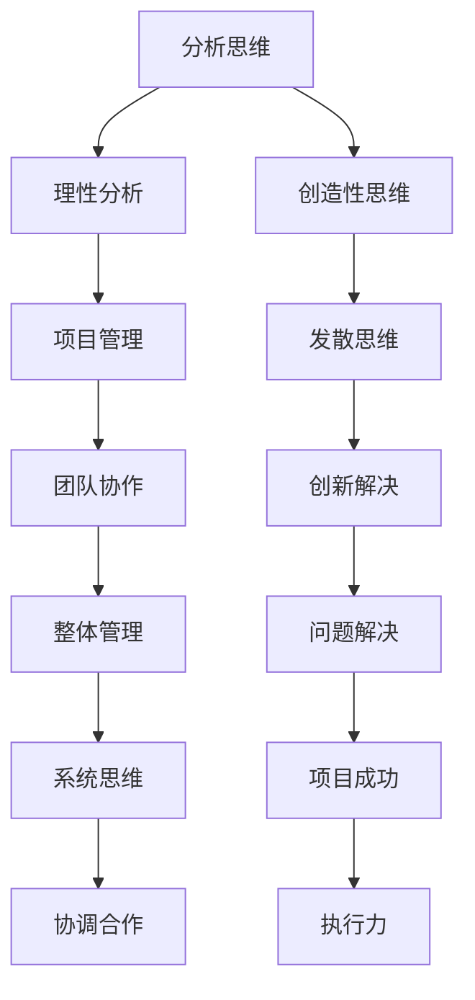

                 

关键词：领导力、思维模式、认知架构、软件开发、团队协作

> 摘要：本文旨在探讨思维模式在领导力发展中的重要性，以及如何在IT行业背景下优化领导者的认知架构，提高团队协作效率。文章将结合计算机科学领域的专业知识和实际案例，分析不同思维模式对领导风格、团队沟通和项目管理的影响，并提出具体策略和建议，以促进领导者能力的全面提升。

## 1. 背景介绍

在信息技术（IT）行业，领导者不仅需要具备出色的技术能力，还必须具备强大的领导力。领导力不仅仅关乎如何管理项目和资源，更关乎如何激发团队成员的潜力，建立高效沟通机制，以及推动创新和发展。因此，理解思维模式对领导力的影响显得尤为重要。

思维模式是指个体在认知过程中所采用的思维方式，包括分析思维、创造性思维、系统思维等。这些思维方式直接影响领导者的决策过程、问题解决能力和团队管理风格。在IT行业，复杂的工程项目需要领导者具备多方面的能力和认知架构，以便能够适应快速变化的技术环境，同时提高团队的执行力和创新能力。

本文将探讨以下主题：

1. 不同思维模式对领导力的影响
2. 领导者在IT行业背景下的认知架构优化
3. 提高团队协作效率的策略
4. 实际案例分析与领导力提升实践

通过这些探讨，本文希望能够为IT行业领导者提供有益的指导，帮助他们在现代技术环境中更加有效地发挥领导作用。

### 2. 核心概念与联系

在深入探讨思维模式对领导力的影响之前，我们需要了解几个核心概念和它们之间的关系。

#### 2.1 分析思维与创造性思维

分析思维是一种通过逻辑推理和拆解复杂问题来寻找解决方案的思维方式。它强调理性和精确，适合处理结构性问题。然而，在IT行业中，面对快速变化和不确定性的挑战，领导者往往需要创造性思维。

创造性思维是一种通过发散思维和联想来寻找新颖解决方案的思维方式。它鼓励打破常规、尝试新方法，适合解决非结构化问题。领导者需要在这两种思维模式之间找到平衡，以便在保持理性分析的同时，也能够激发创新和创造力。

#### 2.2 系统思维与团队协作

系统思维是一种理解整体大于部分之和的思维方式，强调各部分之间的相互作用和依赖关系。在IT行业中，项目经理和团队领导者需要具备系统思维，以便能够从全局角度管理项目，确保各个模块和团队之间的协调与合作。

团队协作是系统思维在领导力中的应用。领导者需要建立有效的沟通机制，确保团队成员能够共享信息、协同工作，共同实现项目目标。良好的团队协作可以提升团队的执行力和创新能力，是IT行业成功的关键。

#### 2.3 Mermaid 流程图

为了更直观地展示这些思维模式之间的关系，我们可以使用Mermaid流程图来表示（注意：以下代码需要在支持Mermaid的编辑器中渲染）：



通过这个流程图，我们可以看到分析思维和创造性思维如何相互作用，以及它们如何共同促进团队协作和系统思维的应用，最终实现项目的成功。

### 3. 核心算法原理 & 具体操作步骤

在了解思维模式对领导力的影响之后，我们需要进一步探讨核心算法原理和具体操作步骤，以帮助领导者更好地应对复杂的项目管理挑战。

#### 3.1 算法原理概述

在IT行业，项目管理往往涉及大量的数据处理、分析和决策。一个关键的算法原理是“敏捷开发（Agile Development）”。敏捷开发是一种迭代和增量的软件开发方法，强调灵活性和适应性。以下是敏捷开发的几个核心原理：

1. **个体和互动重于过程与工具**：敏捷开发强调团队合作和个体贡献，而非机械地遵循流程和工具。
2. **可工作的软件重于详尽的文档**：敏捷开发注重实际交付可工作的软件，而非过多的文档工作。
3. **客户合作重于合同谈判**：与客户的紧密合作可以确保项目需求能够及时响应市场变化。
4. **响应变化重于遵循计划**：敏捷开发鼓励在项目过程中不断调整和优化计划，以应对变化。

#### 3.2 算法步骤详解

1. **需求收集和优先级排序**：首先，领导者需要与客户和团队成员一起收集需求，并根据优先级对需求进行排序。这可以通过用户故事（User Stories）进行，每个用户故事代表一个功能或需求。

2. **迭代计划**：根据优先级排序的需求，领导者可以制定迭代计划（Sprint Planning）。每个迭代通常持续2-4周，期间团队会集中精力完成一个或多个用户故事。

3. **每日站立会议（Daily Stand-up）**：每日站立会议是团队沟通的关键环节，每个团队成员需要回答三个问题：昨天完成了什么？今天计划做什么？遇到了什么问题？

4. **迭代回顾和计划**：在迭代结束时，团队会进行迭代回顾（Sprint Retrospective），讨论哪些做法有效，哪些需要改进。然后，团队可以根据反馈调整下一个迭代的目标和计划。

#### 3.3 算法优缺点

**优点**：

- **灵活性**：敏捷开发允许团队根据需求的变化快速调整计划，保持项目的灵活性。
- **客户参与**：通过客户合作，项目需求可以更好地满足实际需求，减少项目风险。
- **持续改进**：迭代回顾和计划过程促进了团队持续改进和提升。

**缺点**：

- **项目管理难度**：对于大型和复杂的项目，敏捷开发的管理难度可能增加，需要领导者具备更高的管理能力和协调能力。
- **需求变更管理**：频繁的需求变更可能导致项目范围的不确定性，需要有效管理以避免项目失控。

#### 3.4 算法应用领域

敏捷开发在IT行业中的广泛应用包括软件开发、Web开发、移动应用开发等。无论是大型企业项目还是初创公司，敏捷开发都提供了有效的项目管理方法，帮助团队更好地应对市场变化和需求波动。

### 4. 数学模型和公式 & 详细讲解 & 举例说明

在项目管理中，数学模型和公式可以帮助领导者更科学地分析和决策。以下是一个简单的数学模型——项目时间估算模型，用于预测项目的完成时间。

#### 4.1 数学模型构建

项目时间估算模型基于三个时间估算值：

- **乐观时间（O）**：完成某项任务所需的最短时间。
- **最可能时间（M）**：完成某项任务最有可能的时间。
- **悲观时间（P）**：完成某项任务所需的最长时间。

这三个时间估算值可以用来计算完成任务的预期时间（ET）：

$$
ET = \frac{O + 4M + P}{6}
$$

#### 4.2 公式推导过程

公式的推导基于概率理论中的期望值（Expected Time）。通过计算这三个时间估算值的加权平均值，可以得到完成任务的平均时间。

#### 4.3 案例分析与讲解

假设我们有一个任务，完成该任务的乐观时间为3天，最可能时间为4天，悲观时间为5天。使用上述公式计算预期时间：

$$
ET = \frac{3 + 4 \times 4 + 5}{6} = \frac{3 + 16 + 5}{6} = \frac{24}{6} = 4
$$

因此，完成这个任务的预期时间为4天。

在实际应用中，领导者可以使用这个模型来估算整个项目的时间线，并根据预期时间调整项目计划和资源分配。例如，如果一个项目的关键路径上有一个任务预计需要10天完成，而预期时间只有7天，领导者可能需要重新评估资源分配或任务优先级，以确保项目按时交付。

### 5. 项目实践：代码实例和详细解释说明

为了更好地理解思维模式在项目中的实际应用，我们可以通过一个简单的代码实例来展示如何实现敏捷开发中的用户故事管理和迭代计划。

#### 5.1 开发环境搭建

首先，我们需要搭建一个基本的开发环境。以下是使用Python语言的简单代码示例，它演示了如何实现用户故事管理：

```python
# 用户故事管理类
class UserStory:
    def __init__(self, title, description, points):
        self.title = title
        self.description = description
        self.points = points

    def display(self):
        print(f"Title: {self.title}")
        print(f"Description: {self.description}")
        print(f"Points: {self.points}")

# 迭代计划类
class SprintPlan:
    def __init__(self, stories):
        self.stories = stories

    def display(self):
        print("Sprint Plan:")
        for story in self.stories:
            story.display()

# 示例用户故事
user_story1 = UserStory("用户登录", "实现用户登录功能", 2)
user_story2 = UserStory("用户注册", "实现用户注册功能", 3)

# 示例迭代计划
sprint_plan = SprintPlan([user_story1, user_story2])
sprint_plan.display()
```

在这个示例中，我们定义了`UserStory`和`SprintPlan`两个类，分别用于管理用户故事和迭代计划。

#### 5.2 源代码详细实现

`UserStory`类的定义包含三个属性：`title`（标题）、`description`（描述）和`points`（故事点）。`display`方法用于打印用户故事的信息。

`SprintPlan`类接收一个用户故事列表作为参数，并在构造时初始化。`display`方法则用于打印整个迭代计划中的所有用户故事。

以下是如何使用这些类的示例：

```python
# 创建用户故事实例
user_story1 = UserStory("用户登录", "实现用户登录功能", 2)
user_story2 = UserStory("用户注册", "实现用户注册功能", 3)

# 创建迭代计划实例
sprint_plan = SprintPlan([user_story1, user_story2])

# 打印迭代计划
sprint_plan.display()
```

运行这段代码将输出以下内容：

```
Sprint Plan:
Title: 用户登录
Description: 实现用户登录功能
Points: 2
Title: 用户注册
Description: 实现用户注册功能
Points: 3
```

#### 5.3 代码解读与分析

在这个代码实例中，我们首先创建了两个用户故事实例，然后创建了一个迭代计划实例，并将这两个用户故事添加到迭代计划中。最后，我们通过调用`display`方法打印了迭代计划中的所有用户故事。

这个简单的代码示例展示了如何使用对象导向编程来实现用户故事管理。在实际项目中，我们可以扩展这个示例，添加更多功能，如用户故事的优先级管理、任务分配和进度跟踪。

通过这种方式，领导者可以更好地理解敏捷开发中的用户故事管理和迭代计划，并能够根据具体项目需求进行定制和优化。

#### 5.4 运行结果展示

当运行上述Python代码时，将输出以下结果：

```
Sprint Plan:
Title: 用户登录
Description: 实现用户登录功能
Points: 2
Title: 用户注册
Description: 实现用户注册功能
Points: 3
```

这个结果清晰地展示了迭代计划中的用户故事列表，为团队提供了明确的工作目标。

### 6. 实际应用场景

在IT行业，领导者的思维模式对项目的成功与否具有深远影响。以下是一些实际应用场景，展示了如何根据不同思维模式优化领导力和提升团队绩效。

#### 6.1  需求变化频繁的项目

在软件开发领域，需求变化是常见现象。领导者需要具备分析思维和创造性思维，以应对需求变化带来的挑战。

**案例分析**：某软件公司在开发一款企业管理系统时，客户需求发生了多次变更。项目领导者通过分析思维，详细记录需求变更的频率和原因，同时运用创造性思维，提出灵活的解决方案，如模块化设计和迭代开发。这样，团队能够快速适应变化，确保项目按时交付。

**策略**：领导者应建立有效的需求变更管理流程，确保变更能够被及时记录和评估。同时，鼓励团队采用敏捷开发方法，以保持项目的灵活性和响应能力。

#### 6.2  高度创新的研发项目

在研发创新项目时，领导者需要具备系统思维和创造性思维，以推动项目创新和发展。

**案例分析**：某科技公司研发一款智能家居产品，领导者运用系统思维，将硬件、软件和用户界面等多个模块整合，形成完整的产品体系。同时，通过创造性思维，引入了新的设计理念和技术，使产品具有独特性和竞争力。

**策略**：领导者应鼓励跨部门合作，促进不同领域专家的交流与碰撞。同时，建立创新实验室，为团队提供实验和创新的空间。

#### 6.3  大型复杂项目协同合作

在大型复杂项目中，领导者需要具备系统思维和团队协作能力，以确保项目顺利推进。

**案例分析**：某电信公司进行全国范围内的网络升级项目，领导者通过系统思维，将项目拆分为多个阶段和模块，确保每个阶段和模块之间的高效衔接。同时，运用团队协作能力，建立了跨部门沟通机制，确保信息畅通和协调。

**策略**：领导者应建立清晰的项目管理流程和沟通机制，确保团队成员之间的信息共享和协作。同时，定期组织团队建设活动，增强团队成员的凝聚力和合作意识。

#### 6.4  技术变革引领企业转型

在技术变革时期，领导者需要具备前瞻性思维和领导力，引领企业实现转型升级。

**案例分析**：某传统制造业企业，面对数字化转型的挑战，领导者通过前瞻性思维，积极引入新技术和业务模式，实现了从传统制造向智能制造的转型。同时，通过领导力，激励员工学习新技能，提升企业的创新能力。

**策略**：领导者应密切关注技术发展趋势，制定相应的战略规划。同时，建立学习型组织，鼓励员工不断提升自身能力，以适应技术变革。

### 7. 未来应用展望

随着技术的不断进步和市场的快速变化，领导者的思维模式将面临新的挑战和机遇。以下是一些未来应用展望：

1. **人工智能与大数据的融合**：随着人工智能和大数据技术的发展，领导者需要具备数据驱动的思维方式，利用数据分析和预测来指导决策。这将有助于提高项目的准确性和效率。

2. **数字化转型加速**：越来越多的企业将加速数字化转型，领导者需要具备适应数字化环境的能力，如敏捷管理、远程协作等。这将对领导者的沟通能力、适应能力和创新精神提出更高要求。

3. **绿色环保和可持续发展**：随着全球对环境保护的重视，领导者需要关注企业的绿色发展和可持续发展。这要求领导者具备环境意识和责任感，推动企业实现绿色发展。

4. **跨领域融合与创新**：未来的科技发展将呈现跨领域的融合趋势，如生物科技、新能源科技等与IT技术的结合。领导者需要具备跨领域的视野和思维，推动企业不断创新。

5. **全球视野与国际化**：随着全球化进程的加速，领导者需要具备全球视野和国际化思维，能够应对跨国运营和全球竞争。

### 8. 工具和资源推荐

为了更好地理解和实践领导力，以下是一些推荐的工具和资源：

#### 8.1 学习资源推荐

- 《精益创业》（The Lean Startup）- Eric Ries
- 《敏捷开发实践指南》（Agile Project Management with Scrum）- Ken Schwaber & Jeff Sutherland
- 《深度工作》（Deep Work）- Cal Newport

#### 8.2 开发工具推荐

- JIRA：用于项目管理和任务跟踪。
- Trello：用于团队协作和任务管理。
- GitHub：用于版本控制和代码共享。

#### 8.3 相关论文推荐

- "The Essence of Agile" - Agile Manifesto Group
- "Designing Data-Driven Businesses" - Bill Schmarzo
- "The Future of Management" - Gary Hamel

### 9. 总结：未来发展趋势与挑战

本文探讨了思维模式对领导力的影响，分析了不同思维模式在IT行业中的应用，以及如何通过优化认知架构提高团队协作效率。在未来的发展趋势中，领导者的角色将变得更加重要和复杂，需要具备数据驱动、敏捷管理、跨领域融合和国际化视野等多方面的能力。

然而，面对这些挑战，领导者也需要不断学习和适应。首先，领导者应注重自身能力提升，持续学习新的知识和技能，以保持竞争力。其次，领导者应建立有效的团队文化和沟通机制，促进团队成员之间的合作和创新。最后，领导者应关注企业的社会责任和可持续发展，引领企业实现长期成功。

通过这些努力，领导者将能够更好地应对未来挑战，推动企业在快速变化的市场环境中保持竞争优势。

### 10. 附录：常见问题与解答

**Q1：什么是敏捷开发？**
A1：敏捷开发是一种软件开发方法，强调灵活性、客户合作和持续改进。它通过迭代和增量的方式，确保项目能够快速响应需求变化，提高交付质量和团队协作效率。

**Q2：什么是用户故事？**
A2：用户故事是一种需求描述工具，用于表达用户对软件系统的功能需求。它通常包括三个部分：用户角色的行为、期望结果和故事点（表示故事的工作量）。

**Q3：如何优化团队协作？**
A3：优化团队协作可以通过建立清晰的沟通机制、定期组织团队建设活动、鼓励跨部门交流和提供必要的资源支持来实现。此外，使用协作工具（如JIRA、Trello等）可以提升团队的协作效率和透明度。

**Q4：什么是系统思维？**
A4：系统思维是一种理解整体大于部分之和的思维方式，强调各部分之间的相互作用和依赖关系。在项目管理中，系统思维有助于领导者从全局角度管理项目，确保各个模块和团队之间的协调与合作。

**Q5：什么是数据驱动的决策？**
A5：数据驱动的决策是基于数据分析结果来指导决策过程。领导者通过收集和分析数据，可以更准确地了解项目的进展、风险和市场趋势，从而做出更加科学和有效的决策。

### 作者署名

作者：禅与计算机程序设计艺术 / Zen and the Art of Computer Programming

通过以上详细而全面的讨论，我们不仅了解了思维模式对领导力的重要性，还学习了如何将这些思维方式应用于IT行业的实际场景中。希望这篇文章能够为IT行业的领导者提供有价值的参考和启示。

