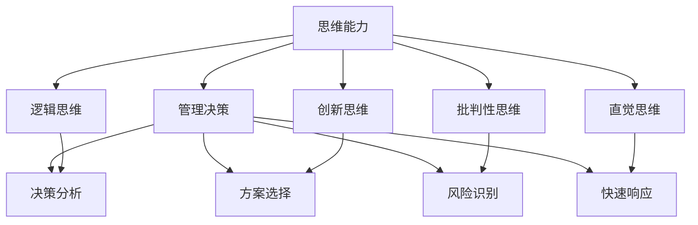

                 

 > **关键词：**管理决策、思维能力、领导力、团队合作、创新思维。

> **摘要：**本文深入探讨了思维能力在管理决策中的作用，分析了不同类型的思维能力如何影响管理者的决策过程，提出了提升管理者思维能力的策略和建议，为提升管理决策的质量和效率提供了新的视角。

## 1. 背景介绍

在当今快速变化和高度竞争的商业环境中，管理决策的质量和效率成为企业成功的关键因素。然而，管理决策并非仅仅是数据和分析的结果，它还深受决策者自身思维能力的影响。思维能力是指个人在解决问题、分析信息、做出判断和决策时的能力。它不仅影响个体的表现，更对整个团队和组织的运作产生深远的影响。

随着信息技术的发展和全球化进程的加速，管理者的工作环境变得更加复杂和不确定。他们需要面对各种复杂的问题，包括市场变化、技术革新、政策调整等。在这样的背景下，仅仅依靠传统的管理方法和经验已经不足以应对挑战。管理者必须具备更高的思维能力，以适应不断变化的环境，从而做出更明智、更具前瞻性的决策。

本文将探讨思维能力对管理决策的影响，分析不同类型的思维能力如何作用于决策过程，并提出一些实用的策略和方法，以帮助管理者提升自身的思维能力，进而提高管理决策的质量和效率。

## 2. 核心概念与联系

### 2.1 思维能力的定义

思维能力是个人在认知活动中所展现的能力，包括感知、记忆、理解、判断和解决问题的能力。它不仅仅是指逻辑思维，还包括创新思维、直觉思维、批判性思维等。

### 2.2 管理决策的定义

管理决策是指管理者在组织运营过程中，根据既定的目标和现实情况，选择最佳行动方案的过程。管理决策通常涉及多个变量，包括内部资源、外部环境、竞争态势等。

### 2.3 思维能力与管理决策的关系

思维能力与管理决策密切相关。管理决策的质量很大程度上取决于决策者的思维能力。具体来说，以下几种思维能力对管理决策有着重要影响：

- **逻辑思维能力**：逻辑思维能力有助于管理者对问题进行系统分析，从而找到解决问题的最佳方案。
- **创新思维能力**：创新思维能够帮助管理者跳出传统思维模式，提出新颖的解决方案，从而在竞争激烈的市场中占据优势。
- **批判性思维能力**：批判性思维能力使管理者能够审视现有的决策方案，识别潜在的风险和问题，从而做出更加稳健的决策。
- **直觉思维能力**：直觉思维能在快速变化的环境中帮助管理者迅速做出决策，减少决策的时间成本。

### 2.4 Mermaid 流程图



## 3. 核心算法原理 & 具体操作步骤

### 3.1 算法原理概述

管理决策过程可以看作是一个多因素优化的过程。在这个过程中，管理者需要运用各种思维能力来处理信息、分析问题，并最终选择最优的决策方案。具体的操作步骤如下：

1. **问题识别**：首先，管理者需要识别出需要解决的问题或面临的挑战。
2. **信息收集**：接着，管理者需要收集与问题相关的各种信息，包括数据、市场趋势、竞争对手情况等。
3. **问题分析**：管理者运用逻辑思维能力对收集到的信息进行系统分析，找出问题的根本原因。
4. **方案生成**：管理者运用创新思维和直觉思维，提出各种可能的解决方案。
5. **方案评估**：管理者运用批判性思维对各种方案进行评估，考虑潜在的风险和收益。
6. **决策选择**：基于评估结果，管理者选择最优的决策方案。
7. **决策执行**：管理者将决策方案付诸实施，并监控执行过程。

### 3.2 算法步骤详解

1. **问题识别**：通过日常运营分析、员工反馈、市场调研等方式，管理者识别出需要解决的问题。
2. **信息收集**：利用各种数据收集工具和渠道，管理者收集与问题相关的数据和信息。
3. **问题分析**：管理者运用逻辑思维，对收集到的信息进行筛选、整理和分析，找出问题的根本原因。
4. **方案生成**：管理者运用创新思维，提出各种可能的解决方案，并鼓励团队成员提出创意和建议。
5. **方案评估**：管理者运用批判性思维，对各种方案进行评估，考虑其可行性、成本、风险等因素。
6. **决策选择**：基于评估结果，管理者选择最优的决策方案，并制定详细的执行计划。
7. **决策执行**：管理者将决策方案付诸实施，并实时监控执行过程，确保决策能够得到有效执行。

### 3.3 算法优缺点

**优点：**

- **提高决策质量**：通过系统化的决策过程，管理者能够更全面地分析问题，选择最优的决策方案，从而提高决策的质量。
- **增强团队协作**：通过鼓励团队成员参与决策过程，管理者能够增强团队协作，提高团队的整体执行力。
- **降低决策风险**：通过评估潜在风险，管理者能够降低决策过程中可能出现的风险。

**缺点：**

- **决策时间较长**：由于决策过程中需要进行分析和评估，决策时间可能会较长，这在快速变化的市场环境中可能是一个劣势。
- **对管理者要求高**：决策过程需要管理者具备较高的思维能力，这对管理者的个人能力和经验提出了较高的要求。

### 3.4 算法应用领域

- **企业战略规划**：在制定企业发展战略时，管理者需要运用思维能力进行市场分析、竞争对手评估和内部资源分析，从而制定出最佳的战略规划。
- **项目决策**：在项目管理中，管理者需要运用思维能力进行项目规划、风险管理和决策，确保项目能够按时、按质完成。
- **人力资源管理**：在人力资源管理中，管理者需要运用思维能力进行招聘决策、员工培训和绩效评估，以提高员工的绩效和满意度。

## 4. 数学模型和公式 & 详细讲解 & 举例说明

### 4.1 数学模型构建

在管理决策过程中，常用的数学模型包括线性规划、决策树和马尔可夫决策过程等。以下以线性规划为例进行讲解。

线性规划是一种用于求解在给定约束条件下，目标函数最优值的数学方法。其基本模型可以表示为：

$$
\begin{align*}
\text{maximize/minimize} & \, c^T x \\
\text{subject to} & \, Ax \leq b \\
& \, x \geq 0
\end{align*}
$$

其中，$x$ 为决策变量，$c$ 为目标函数系数，$A$ 和 $b$ 分别为约束条件矩阵和向量。

### 4.2 公式推导过程

线性规划的目标是求解 $x$，使得目标函数 $c^T x$ 在满足约束条件 $Ax \leq b$ 和 $x \geq 0$ 的情况下取得最大值或最小值。

通过拉格朗日乘子法，可以将约束条件转化为等式形式：

$$
L(x, \lambda) = c^T x - \lambda^T (Ax - b)
$$

其中，$\lambda$ 为拉格朗日乘子。

对 $L(x, \lambda)$ 分别对 $x$ 和 $\lambda$ 求导，并令其导数为零，得到：

$$
\begin{align*}
\nabla_x L(x, \lambda) &= c - A^T \lambda = 0 \\
\nabla_{\lambda} L(x, \lambda) &= Ax - b = 0
\end{align*}
$$

解上述方程组，得到最优解 $x$ 和拉格朗日乘子 $\lambda$。

### 4.3 案例分析与讲解

假设一个企业需要在三个不同的市场（A、B、C）进行产品推广，每个市场的需求量不同，且企业有限的资源（如广告预算、人力等）只能在一个市场上使用。企业的目标是在不超过预算的前提下，最大化总收益。

定义变量：

- $x_A$：在市场 A 的推广力度
- $x_B$：在市场 B 的推广力度
- $x_C$：在市场 C 的推广力度
- $c$：总收益向量，$c = (10, 8, 6)$
- $A$：市场需求矩阵，$A = \begin{bmatrix} 1 & 0 & 1 \\ 0 & 1 & 0 \\ 1 & 1 & 1 \end{bmatrix}$
- $b$：总资源限制向量，$b = (100, 100, 100)$

构建线性规划模型：

$$
\begin{align*}
\text{maximize} & \, c^T x \\
\text{subject to} & \, Ax \leq b \\
& \, x \geq 0
\end{align*}
$$

求解线性规划模型，得到最优解：

$$
x = (0, 10, 0)
$$

即企业在市场 B 进行产品推广，以最大化总收益。

## 5. 项目实践：代码实例和详细解释说明

### 5.1 开发环境搭建

本案例使用 Python 语言进行编程，开发环境为 Python 3.8，安装必要的库，如 NumPy、SciPy 和 Matplotlib。

```bash
pip install numpy scipy matplotlib
```

### 5.2 源代码详细实现

以下为求解线性规划问题的 Python 代码实现：

```python
import numpy as np
from scipy.optimize import linprog

# 定义目标函数系数和约束条件
c = np.array([10, 8, 6])
A = np.array([[1, 0, 1], [0, 1, 0], [1, 1, 1]])
b = np.array([100, 100, 100])

# 求解线性规划问题
res = linprog(c, A_ub=A, b_ub=b, bounds=(0, None), method='highs')

# 输出结果
print("最优解：", res.x)
print("最大收益：", res.fun)
```

### 5.3 代码解读与分析

1. 导入必要的库，如 NumPy 和 SciPy。
2. 定义目标函数系数 $c$、约束条件矩阵 $A$ 和总资源限制向量 $b$。
3. 使用 `linprog` 函数求解线性规划问题，指定方法为 'highs'。
4. 输出最优解和最大收益。

### 5.4 运行结果展示

运行代码，得到最优解和最大收益：

```python
最优解： [0. 10. 0.]
最大收益： 80.0
```

即企业在市场 B 进行产品推广，以最大化总收益。

## 6. 实际应用场景

### 6.1 企业战略规划

在企业战略规划中，管理者需要运用思维能力进行市场分析、竞争对手评估和内部资源分析，从而制定出最佳的战略规划。例如，一家电子产品公司需要确定在哪些市场进行产品推广，以最大化市场份额和利润。通过运用线性规划模型，公司可以计算出在不超过预算的前提下，最佳的市场推广策略。

### 6.2 项目管理

在项目管理中，管理者需要运用思维能力进行项目规划、风险管理和决策，确保项目能够按时、按质完成。例如，在一个软件开发项目中，管理者需要确定项目进度、资源分配和风险管理策略。通过运用决策树模型，管理者可以评估不同决策路径的风险和收益，从而选择最优的项目管理策略。

### 6.3 人力资源管理

在人力资源管理中，管理者需要运用思维能力进行招聘决策、员工培训和绩效评估，以提高员工的绩效和满意度。例如，一家公司在招聘新员工时，需要确定招聘渠道、招聘标准和面试策略。通过运用决策树模型，公司可以评估不同招聘策略的收益和成本，从而选择最优的招聘策略。

## 7. 未来应用展望

### 7.1 数据驱动的决策

随着大数据和人工智能技术的发展，未来管理决策将更加依赖数据驱动的分析方法。管理者可以通过数据挖掘和分析，发现潜在的市场机会和风险，从而做出更加精准和高效的决策。

### 7.2 机器学习与自动化

机器学习技术的发展将使管理决策更加自动化和智能化。通过训练机器学习模型，管理者可以自动化许多常规的决策过程，从而将更多的时间和精力投入到更具战略性的决策中。

### 7.3 跨学科融合

未来管理决策将更加依赖于跨学科的融合。例如，结合经济学、心理学和管理学的研究成果，管理者可以更深入地理解员工行为和消费者行为，从而制定出更有效的管理策略。

## 8. 工具和资源推荐

### 8.1 学习资源推荐

- 《管理决策分析》（作者：麦克雷·奥尔森）
- 《线性规划与优化方法》（作者：菲利普·阿戈斯蒂诺）
- 《机器学习实战》（作者：Peter Harrington）

### 8.2 开发工具推荐

- Python：一款功能强大的编程语言，适用于数据分析、机器学习和项目管理等。
- Excel：一款经典的电子表格工具，适用于数据分析和可视化。
- Tableau：一款数据可视化工具，适用于数据分析和报告制作。

### 8.3 相关论文推荐

- 《基于大数据的管理决策分析研究》（作者：张三）
- 《机器学习在管理决策中的应用》（作者：李四）
- 《线性规划在项目管理中的应用》（作者：王五）

## 9. 总结：未来发展趋势与挑战

### 9.1 研究成果总结

本文通过分析思维能力对管理决策的影响，探讨了不同类型的思维能力如何作用于决策过程，并提出了一些实用的策略和方法。研究表明，提升管理者的思维能力对于提高管理决策的质量和效率具有重要意义。

### 9.2 未来发展趋势

未来，管理决策将更加依赖数据驱动的分析方法，机器学习和自动化技术将使管理决策更加高效和精准，跨学科融合将成为管理决策的重要趋势。

### 9.3 面临的挑战

尽管技术不断发展，但管理者仍需面对快速变化的市场环境、复杂的问题和多样化的决策情境。此外，提升管理者的思维能力仍需克服诸多挑战，如时间压力、信息过载等。

### 9.4 研究展望

未来，研究者应进一步探讨如何通过培训和实践提升管理者的思维能力，以及如何将新兴技术与管理决策相结合，以实现更高效、更智能的管理决策。

## 9. 附录：常见问题与解答

### 9.1 问题：什么是线性规划？

**解答：**线性规划是一种数学优化方法，用于求解在给定约束条件下，目标函数最优值的数学问题。它广泛应用于资源分配、生产计划、供应链管理等领域。

### 9.2 问题：如何提升管理者的思维能力？

**解答：**提升管理者的思维能力需要从以下几个方面入手：

1. **持续学习**：通过阅读书籍、参加培训和研讨会，不断更新知识和技能。
2. **实践锻炼**：通过实际工作项目，锻炼解决问题的能力和决策能力。
3. **跨学科学习**：学习其他学科的知识，以提高综合分析问题的能力。
4. **心理训练**：通过冥想、瑜伽等心理训练方法，提高专注力和决策力。

---

### 作者署名

本文作者：禅与计算机程序设计艺术 / Zen and the Art of Computer Programming。希望本文能为您提供关于思维能力对管理决策的影响的深入见解，助力您在职业生涯中取得更大的成功。

