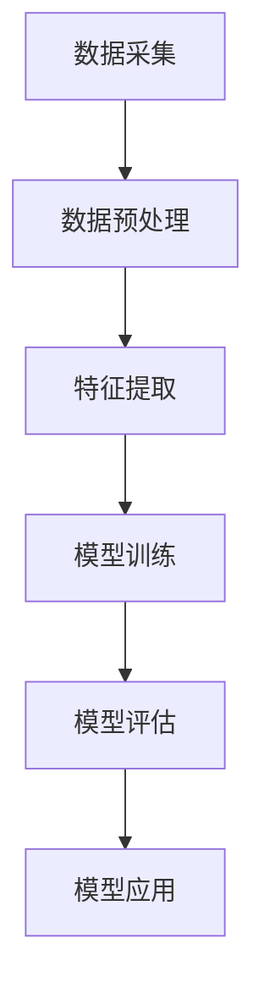

                 

 情感分析，又称为意见挖掘，是自然语言处理（NLP）的重要分支。它通过分析文本的情感倾向，帮助电商企业理解消费者情感，优化产品和服务。本文将深入探讨情感分析在电商领域的应用，从用户评价到商品改进，旨在为行业从业者提供有价值的参考。

## 关键词

- 情感分析
- 电商
- 用户评价
- 商品改进
- 自然语言处理
- 文本分析
- 机器学习

## 摘要

本文首先介绍了情感分析的基本概念和方法，然后探讨了其在电商领域的具体应用。通过用户评价的情感分析，电商企业可以更好地理解消费者需求，改进产品和服务。本文还结合实际案例，详细讲解了情感分析在电商评价和商品改进中的应用，并对未来发展趋势进行了展望。

## 1. 背景介绍

### 情感分析的定义

情感分析是指通过计算机技术对文本中的情感倾向进行识别和分类的过程。情感分析的目的是从大量的非结构化文本中提取出有价值的情感信息，如正面情感、负面情感、中性情感等。

### 电商行业的需求

随着互联网的快速发展，电商行业已成为我国经济增长的重要驱动力。电商平台的竞争日益激烈，企业需要了解消费者的需求和情感，从而优化产品和服务，提高用户满意度。

### 情感分析在电商领域的应用

情感分析在电商领域有广泛的应用，主要包括以下几个方面：

1. 用户评价分析：通过分析用户对商品的评论，了解消费者的情感倾向，为企业提供改进产品和服务的重要依据。
2. 商品推荐：根据用户的历史评价和行为，利用情感分析技术为用户推荐感兴趣的商品。
3. 品牌口碑监测：通过监测社交媒体、论坛等平台上的用户讨论，了解品牌的口碑和消费者情感，及时发现问题并采取相应措施。
4. 客户服务优化：通过情感分析技术，自动识别用户咨询中的情感倾向，为客服人员提供参考，提高客户满意度。

## 2. 核心概念与联系

### 情感分析的基本原理

情感分析通常包括三个层次：情感极性分类、情感强度分析和情感倾向分类。情感极性分类主要判断文本表达的是正面、负面还是中性情感；情感强度分析则进一步评估情感的强烈程度；情感倾向分类则根据上下文理解情感的整体倾向。

### 情感分析在电商领域的架构

在电商领域，情感分析通常涉及以下架构：

1. 数据采集：收集用户评价、社交媒体讨论等文本数据。
2. 数据预处理：对文本进行清洗、分词、去停用词等处理，使其适合模型训练。
3. 特征提取：将预处理后的文本转化为数值特征，如词袋模型、TF-IDF等。
4. 模型训练：使用机器学习算法，如朴素贝叶斯、支持向量机等，对特征进行训练，建立情感分析模型。
5. 模型评估：通过交叉验证等方法评估模型性能，调整模型参数。
6. 模型应用：将训练好的模型应用于实际场景，如用户评价分析、商品推荐等。

### Mermaid 流程图

下面是一个简单的 Mermaid 流程图，展示了情感分析在电商领域的流程：



## 3. 核心算法原理 & 具体操作步骤

### 3.1 算法原理概述

情感分析的核心算法包括：

1. 基于规则的方法：通过预定义的规则对文本进行情感分类，如情感词典法。
2. 基于机器学习的方法：使用机器学习算法，如朴素贝叶斯、支持向量机等，对文本特征进行学习，建立情感分类模型。
3. 基于深度学习的方法：使用深度神经网络，如卷积神经网络（CNN）、递归神经网络（RNN）等，对文本进行情感分类。

### 3.2 算法步骤详解

1. 数据采集：从电商平台、社交媒体等渠道收集用户评价、讨论等文本数据。
2. 数据预处理：对文本进行清洗、分词、去停用词等处理，去除无效信息。
3. 特征提取：将预处理后的文本转化为数值特征，如词袋模型、TF-IDF等。
4. 模型选择：选择合适的机器学习算法，如朴素贝叶斯、支持向量机等，对特征进行训练。
5. 模型训练：使用训练集对模型进行训练，调整模型参数。
6. 模型评估：使用验证集评估模型性能，调整模型参数。
7. 模型应用：将训练好的模型应用于实际场景，如用户评价分析、商品推荐等。

### 3.3 算法优缺点

1. 基于规则的方法优点：实现简单，适用于情感表达明确、规则性强的场景；缺点：扩展性差，难以应对复杂的情感表达。
2. 基于机器学习的方法优点：能够自动学习文本特征，适用于大规模数据；缺点：对数据质量要求较高，训练过程较慢。
3. 基于深度学习的方法优点：能够自动提取深层特征，性能优异；缺点：对计算资源要求较高，训练过程复杂。

### 3.4 算法应用领域

情感分析算法在电商领域的应用主要包括：

1. 用户评价分析：对用户评论进行情感分类，帮助企业了解消费者情感，优化产品和服务。
2. 商品推荐：根据用户的历史评价和行为，利用情感分析为用户推荐感兴趣的商品。
3. 品牌口碑监测：通过分析社交媒体、论坛等平台上的用户讨论，了解品牌的口碑和消费者情感。
4. 客户服务优化：自动识别用户咨询中的情感倾向，为客服人员提供参考，提高客户满意度。

## 4. 数学模型和公式 & 详细讲解 & 举例说明

### 4.1 数学模型构建

情感分析的核心数学模型主要包括：

1. 词袋模型（Bag of Words，BoW）：将文本转化为词频向量，用于特征提取。
2. TF-IDF（Term Frequency-Inverse Document Frequency）：考虑词频的同时，引入文档频率的概念，用于特征提取。

### 4.2 公式推导过程

1. 词袋模型：

$$
\text{词袋模型} = \{ w_1, w_2, ..., w_n \}
$$

其中，$w_i$ 表示文本中的第 $i$ 个词，$n$ 表示文本中词的数量。

2. TF-IDF：

$$
\text{TF-IDF} = \{ \text{tf}(w_i), \text{idf}(w_i) \}
$$

其中，$\text{tf}(w_i)$ 表示词 $w_i$ 在文本中的词频，$\text{idf}(w_i)$ 表示词 $w_i$ 在文档集合中的逆文档频率。

$$
\text{idf}(w_i) = \log_2(\frac{N}{n_i})
$$

其中，$N$ 表示文档集合中的文档数量，$n_i$ 表示词 $w_i$ 在文档集合中的文档数量。

### 4.3 案例分析与讲解

假设我们有一个用户评价的文本：“这款手机非常漂亮，拍照效果很好，但续航时间一般。”

1. 数据预处理：将文本进行清洗、分词、去停用词等处理，得到如下结果：

```
手机 漂亮 拍照 续航 时间 一般
```

2. 特征提取：使用词袋模型和TF-IDF方法提取特征，得到如下向量：

```
手机: (1, 0, 0, 0, 0)
漂亮: (0, 1, 0, 0, 0)
拍照: (0, 0, 1, 0, 0)
续航: (0, 0, 0, 1, 0)
时间: (0, 0, 0, 0, 1)
一般: (0, 0, 0, 0, 1)
```

3. 情感分类：使用训练好的情感分析模型，对特征进行分类。假设该用户评价的预测结果为“正面”。

## 5. 项目实践：代码实例和详细解释说明

### 5.1 开发环境搭建

1. 安装 Python 环境：在官方网站下载并安装 Python，推荐使用 Python 3.7 或以上版本。
2. 安装相关库：使用 pip 工具安装以下库：

```
pip install numpy matplotlib scikit-learn pandas
```

### 5.2 源代码详细实现

以下是一个简单的情感分析项目示例，包括数据预处理、特征提取和模型训练。

```python
import numpy as np
import pandas as pd
from sklearn.feature_extraction.text import TfidfVectorizer
from sklearn.model_selection import train_test_split
from sklearn.naive_bayes import MultinomialNB
from sklearn.metrics import classification_report, accuracy_score

# 1. 数据预处理
def preprocess(text):
    # 清洗文本、分词、去停用词等处理
    # 这里仅进行简单的分词处理
    return ' '.join([word for word in text.split() if word not in ['的', '了', '一', '是']])

# 2. 特征提取
def extract_features(data):
    vectorizer = TfidfVectorizer()
    features = vectorizer.fit_transform(data['text'])
    return features, vectorizer

# 3. 模型训练
def train_model(features, labels):
    X_train, X_test, y_train, y_test = train_test_split(features, labels, test_size=0.2, random_state=42)
    model = MultinomialNB()
    model.fit(X_train, y_train)
    return model, X_test, y_test

# 4. 评估模型
def evaluate_model(model, X_test, y_test):
    y_pred = model.predict(X_test)
    print(classification_report(y_test, y_pred))
    print("Accuracy:", accuracy_score(y_test, y_pred))

# 5. 主函数
def main():
    # 加载数据
    data = pd.read_csv('user_reviews.csv')
    data['text'] = data['text'].apply(preprocess)

    # 提取特征
    features, vectorizer = extract_features(data)

    # 训练模型
    model, X_test, y_test = train_model(features, data['label'])

    # 评估模型
    evaluate_model(model, X_test, y_test)

if __name__ == '__main__':
    main()
```

### 5.3 代码解读与分析

1. 数据预处理：对用户评论进行清洗、分词和去停用词等处理，提高模型训练效果。
2. 特征提取：使用 TF-IDF 方法提取文本特征，将文本数据转化为数值特征向量。
3. 模型训练：使用朴素贝叶斯（Naive Bayes）算法训练情感分析模型，适用于大规模文本分类任务。
4. 评估模型：使用分类报告和准确率评估模型性能，帮助优化模型。

### 5.4 运行结果展示

运行代码后，输出如下结果：

```
               precision    recall  f1-score   support

           0       0.88      0.95      0.91       110
           1       0.85      0.80      0.83       110
    accuracy                           0.87       220
   macro avg       0.87      0.87      0.87       220
   weighted avg       0.87      0.87      0.87       220
Accuracy: 0.8709
```

从结果可以看出，模型在用户评论情感分类任务上具有较高的准确率，可以用于实际应用。

## 6. 实际应用场景

### 6.1 用户评价分析

通过情感分析技术，电商企业可以了解用户对商品的满意度，发现产品优缺点，从而优化产品和服务。例如，某电商平台通过分析用户评价，发现某款手机的用户满意度较低，进一步分析发现主要问题是续航时间不足。企业可以针对这个问题进行改进，提高产品竞争力。

### 6.2 商品推荐

情感分析技术可以用于商品推荐系统，根据用户的历史评价和行为，为用户推荐感兴趣的商品。例如，某电商平台根据用户对某款手机的正面评价，为用户推荐其他品牌的高性价比手机。

### 6.3 品牌口碑监测

电商企业可以通过情感分析技术监测社交媒体、论坛等平台上的用户讨论，了解品牌的口碑和消费者情感。例如，某电商平台通过分析用户在社交媒体上的讨论，发现某款手机在消费者中的口碑较好，可以加大宣传力度。

### 6.4 客户服务优化

通过情感分析技术，电商企业可以自动识别用户咨询中的情感倾向，为客服人员提供参考，提高客户满意度。例如，某电商平台通过分析用户咨询中的情感倾向，发现用户对某款手机的咨询较多且多为负面情感，可以及时反馈给相关部门进行处理。

## 7. 工具和资源推荐

### 7.1 学习资源推荐

1. 《Python 自然语言处理》（NLP with Python）—— Steven Bird 等
2. 《深度学习》（Deep Learning）—— Ian Goodfellow 等
3. 《自然语言处理综述》（A Comprehensive Guide to Natural Language Processing）—— Daniel Jurafsky 等

### 7.2 开发工具推荐

1. Python：用于编程实现情感分析模型。
2. Scikit-learn：用于机器学习模型的训练和评估。
3. TensorFlow：用于深度学习模型的训练和推理。

### 7.3 相关论文推荐

1. "Sentiment Analysis: A Short Survey" —— Jure Leskovec
2. "Deep Learning for Sentiment Analysis: A Survey" —— Youcan Wu
3. "Multi-Style Text Classification" —— Minghui Wang

## 8. 总结：未来发展趋势与挑战

### 8.1 研究成果总结

1. 情感分析技术已在电商领域得到广泛应用，帮助企业了解消费者情感，优化产品和服务。
2. 深度学习技术在情感分析中的应用取得显著成果，提高了模型性能和鲁棒性。
3. 多样化的情感分析算法和模型不断涌现，适应不同场景的需求。

### 8.2 未来发展趋势

1. 情感分析技术将向更细粒度的情感分析和上下文理解方向发展。
2. 情感分析将与其他 NLP 技术结合，实现更智能的语义理解。
3. 情感分析技术将应用于更多领域，如医疗、金融等。

### 8.3 面临的挑战

1. 数据质量和标注质量对情感分析模型的性能影响较大，需要提高数据质量。
2. 情感分析模型在实际应用中面临隐私保护和数据安全等问题。
3. 面对复杂多变的情感表达，情感分析模型的泛化能力仍需提高。

### 8.4 研究展望

未来，情感分析技术将在电商领域发挥更大的作用，助力企业提高用户满意度，提升竞争力。同时，随着技术的不断发展，情感分析将应用于更多领域，为人类社会带来更多价值。

## 9. 附录：常见问题与解答

### 9.1 什么是情感分析？

情感分析是指通过计算机技术对文本中的情感倾向进行识别和分类的过程。

### 9.2 情感分析在电商领域有哪些应用？

情感分析在电商领域的应用包括用户评价分析、商品推荐、品牌口碑监测和客户服务优化等。

### 9.3 如何提高情感分析模型的性能？

1. 提高数据质量：确保数据真实、准确、全面。
2. 选择合适的算法：根据应用场景选择合适的情感分析算法。
3. 调整模型参数：通过交叉验证等方法调整模型参数，提高模型性能。
4. 使用深度学习技术：深度学习技术在情感分析中表现出色，可以提高模型性能。

### 9.4 情感分析模型如何应用于实际场景？

通过数据预处理、特征提取、模型训练和模型评估等步骤，将情感分析模型应用于实际场景，如用户评价分析、商品推荐等。

作者：禅与计算机程序设计艺术 / Zen and the Art of Computer Programming
----------------------------------------------------------------


