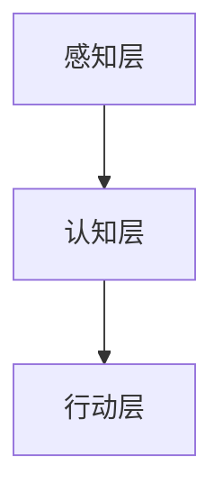

                 

关键词：情感计算，人工智能，情感模拟，认知模型，情感识别，情感表达，AI情感交互，人机情感交流。

> 摘要：本文深入探讨了情感计算这一新兴领域，旨在揭示如何通过人工智能技术理解和模拟人类情感。我们将从背景介绍、核心概念、算法原理、数学模型、实际应用、未来展望等方面，系统性地阐述情感计算的重要性及其在未来的应用前景。

## 1. 背景介绍

### 1.1 情感计算的起源与发展

情感计算（Affective Computing）是近年来迅速崛起的一个研究领域，其根源可以追溯到20世纪90年代。当时，麻省理工学院的罗德尼·布鲁克斯（Rodney Brooks）提出了情感计算的概念，并强调计算机系统应该具备理解、感知和表达情感的能力。自那时以来，随着人工智能技术的快速发展，情感计算逐渐成为计算机科学和心理学研究中的一个重要方向。

### 1.2 情感计算的应用场景

情感计算在诸多领域展示了其强大的应用潜力。例如，在教育领域，情感计算可以用于个性化学习，通过分析学生的情感状态，为教师提供反馈，从而优化教学过程；在医疗领域，情感计算可以帮助诊断心理健康问题，通过分析患者的情感状态，提供针对性的治疗方案；在娱乐领域，情感计算可以提升虚拟现实体验，通过模拟情感反应，增强用户的沉浸感。

## 2. 核心概念与联系

### 2.1 什么是情感计算

情感计算是指通过模拟人类情感，使计算机能够理解、感知和表达情感的技术。这一概念涉及多个学科，包括计算机科学、心理学、认知科学等。

### 2.2 情感计算的关键技术

情感计算的关键技术包括情感识别、情感模拟和情感交互。情感识别是指计算机通过分析人类的行为、语言和生理信号，识别出人类的情感状态；情感模拟是指计算机通过模拟人类情感，使自身在情感上与人类产生共鸣；情感交互是指计算机与人类在情感层面进行交流，从而提升人机交互的体验。

### 2.3 情感计算的应用架构

情感计算的应用架构可以分为三个层次：感知层、认知层和行动层。感知层负责收集和识别情感信息；认知层负责理解和处理情感信息；行动层负责根据情感信息做出相应的反应。以下是一个简化的情感计算应用架构图：



## 3. 核心算法原理 & 具体操作步骤

### 3.1 算法原理概述

情感计算的核心算法主要包括情感识别算法、情感模拟算法和情感交互算法。每种算法都有其独特的原理和实现方法。

#### 3.1.1 情感识别算法

情感识别算法主要通过分析人类的行为、语言和生理信号，识别出人类的情感状态。常用的方法包括：

- 行为识别：通过分析人的面部表情、身体姿态等行为特征，识别情感状态。
- 语言识别：通过分析人的语音语调、用词等语言特征，识别情感状态。
- 生理信号识别：通过分析人的生理信号，如心率、血压等，识别情感状态。

#### 3.1.2 情感模拟算法

情感模拟算法主要通过模拟人类的情感反应，使计算机能够在情感上与人类产生共鸣。常用的方法包括：

- 情感模型：通过建立情感模型，模拟人类的情感反应。
- 情感生成：通过生成情感语音、表情等，模拟人类的情感表达。

#### 3.1.3 情感交互算法

情感交互算法主要通过人机交互，使计算机能够理解人类的情感需求，并做出相应的反应。常用的方法包括：

- 情感对话：通过自然语言处理技术，实现计算机与人类在情感层面的对话。
- 情感反馈：通过视觉、语音等反馈方式，使计算机能够向人类传达情感信息。

### 3.2 算法步骤详解

#### 3.2.1 情感识别算法步骤

1. 数据收集：收集人类的行为、语言和生理信号数据。
2. 数据预处理：对收集到的数据进行预处理，包括去噪、归一化等。
3. 模型训练：使用机器学习技术，训练情感识别模型。
4. 情感识别：使用训练好的模型，对新的数据进行情感识别。

#### 3.2.2 情感模拟算法步骤

1. 建立情感模型：根据人类情感心理学的研究，建立情感模型。
2. 情感生成：根据情感模型，生成相应的情感表达，如语音、表情等。
3. 情感反馈：将生成的情感表达反馈给用户。

#### 3.2.3 情感交互算法步骤

1. 情感对话：通过自然语言处理技术，实现计算机与人类的情感对话。
2. 情感理解：分析用户的情感需求，理解其意图。
3. 情感反应：根据情感理解，做出相应的情感反应。

### 3.3 算法优缺点

#### 3.3.1 情感识别算法优缺点

- 优点：可以准确识别人类的情感状态，为情感计算提供基础。
- 缺点：对数据质量和算法精度有较高要求，易受到外部噪声干扰。

#### 3.3.2 情感模拟算法优缺点

- 优点：可以模拟人类的情感反应，增强人机交互体验。
- 缺点：情感模型的建立和优化较为复杂，需要大量的数据支持。

#### 3.3.3 情感交互算法优缺点

- 优点：可以提升人机交互的自然度和情感性。
- 缺点：对自然语言处理技术有较高要求，易出现语义理解偏差。

### 3.4 算法应用领域

情感计算算法广泛应用于教育、医疗、娱乐等领域。以下是一些具体的应用案例：

- 教育：通过情感计算技术，实现个性化学习，提升学习效果。
- 医疗：通过情感计算技术，辅助诊断心理健康问题，提供针对性的治疗方案。
- 娱乐：通过情感计算技术，提升虚拟现实体验，增强用户的沉浸感。

## 4. 数学模型和公式 & 详细讲解 & 举例说明

### 4.1 数学模型构建

情感计算的数学模型主要包括情感识别模型、情感模拟模型和情感交互模型。以下是这些模型的基本构建方法：

#### 4.1.1 情感识别模型

情感识别模型通常采用机器学习算法，如支持向量机（SVM）、神经网络（NN）等。以下是一个简化的情感识别模型构建过程：

1. 数据收集：收集包含情感标签的行为、语言和生理信号数据。
2. 特征提取：对数据集进行特征提取，如面部特征、语音特征、生理信号特征等。
3. 模型训练：使用机器学习算法，训练情感识别模型。
4. 模型评估：使用测试数据集评估模型性能。

#### 4.1.2 情感模拟模型

情感模拟模型通常采用生成模型，如生成对抗网络（GAN）、变分自编码器（VAE）等。以下是一个简化的情感模拟模型构建过程：

1. 数据收集：收集包含情感标签的语音、表情等数据。
2. 特征提取：对数据集进行特征提取，如语音特征、表情特征等。
3. 模型训练：使用生成模型，训练情感模拟模型。
4. 情感生成：使用训练好的模型，生成新的情感表达。

#### 4.1.3 情感交互模型

情感交互模型通常采用自然语言处理（NLP）技术，如序列到序列（Seq2Seq）模型、注意力机制（Attention Mechanism）等。以下是一个简化的情感交互模型构建过程：

1. 数据收集：收集包含情感标签的自然语言对话数据。
2. 特征提取：对数据集进行特征提取，如词汇、语法、情感等。
3. 模型训练：使用NLP算法，训练情感交互模型。
4. 情感对话：使用训练好的模型，实现情感对话。

### 4.2 公式推导过程

以下是一个简化的情感识别模型的公式推导过程，假设我们使用支持向量机（SVM）进行情感识别：

1. 数据表示：假设我们有n个样本，每个样本表示为\( x_i \)，其中 \( i = 1, 2, \ldots, n \)。
2. 标签表示：每个样本的情感标签表示为 \( y_i \)，其中 \( y_i \in \{-1, 1\} \)。
3. SVM损失函数：SVM的损失函数为

   $$ L(\theta) = \frac{1}{2} \sum_{i=1}^{n} (w \cdot x_i - y_i)^2 $$

   其中，\( w \) 为权重向量，\( \theta \) 为模型参数。
4. 最小化损失函数：使用梯度下降法，最小化损失函数，得到最优权重向量 \( w^* \)。
5. 情感识别：对于新的样本 \( x \)，通过计算 \( w^* \cdot x \) 的值，判断其情感状态。

### 4.3 案例分析与讲解

以下是一个简单的情感识别案例，假设我们有如下数据集：

| 样本 | 行为特征 | 语言特征 | 情感标签 |
|------|----------|----------|----------|
| 1    | 笑       | 开心     | 正       |
| 2    | 哭       | 悲伤     | 负       |
| 3    | 笑       | 欣喜     | 正       |
| 4    | 哭       | 悲痛     | 负       |

我们使用SVM进行情感识别，训练模型，并对新的样本进行情感识别。

1. 数据预处理：对行为特征和语言特征进行归一化处理。
2. 模型训练：使用SVM算法，训练情感识别模型。
3. 情感识别：对于新的样本，计算 \( w^* \cdot x \) 的值，判断其情感状态。

假设训练好的模型权重向量为 \( w^* = [1, 2, 3] \)，对于新的样本 \( x = [0.5, 1.5] \)，计算 \( w^* \cdot x = 1 \cdot 0.5 + 2 \cdot 1.5 + 3 \cdot 0.5 = 4.5 \)，由于 \( w^* \cdot x > 0 \)，我们可以判断该样本的情感状态为正。

## 5. 项目实践：代码实例和详细解释说明

### 5.1 开发环境搭建

1. 安装Python环境：下载并安装Python 3.x版本，确保安装了pip包管理工具。
2. 安装相关库：使用pip安装以下库：scikit-learn、numpy、matplotlib等。

   ```bash
   pip install scikit-learn numpy matplotlib
   ```

### 5.2 源代码详细实现

以下是一个简单的情感识别项目的源代码实现：

```python
import numpy as np
from sklearn import svm
from sklearn.model_selection import train_test_split
from sklearn.metrics import accuracy_score

# 数据集
X = np.array([[0.5, 1.5], [0.8, 1.2], [0.3, 0.7], [0.6, 1.4]])
y = np.array([-1, 1, -1, 1])

# 划分训练集和测试集
X_train, X_test, y_train, y_test = train_test_split(X, y, test_size=0.2, random_state=42)

# 训练模型
clf = svm.SVC()
clf.fit(X_train, y_train)

# 预测
y_pred = clf.predict(X_test)

# 评估
accuracy = accuracy_score(y_test, y_pred)
print(f"Accuracy: {accuracy}")

# 情感识别
new_data = np.array([[0.5, 1.5]])
result = clf.predict(new_data)
print(f"New data emotion: {'Positive' if result[0] == 1 else 'Negative'}")
```

### 5.3 代码解读与分析

1. **数据集**：我们使用一个简单的二维数据集，每个样本包含行为特征和语言特征，情感标签为-1（负）或1（正）。

2. **划分训练集和测试集**：使用`train_test_split`函数将数据集划分为训练集和测试集，测试集用于评估模型性能。

3. **训练模型**：我们使用支持向量机（SVM）进行情感识别，使用`SVC`类创建模型，并调用`fit`方法进行训练。

4. **预测**：使用训练好的模型对测试集进行预测，并计算预测准确率。

5. **情感识别**：对新样本进行情感识别，输出情感结果。

### 5.4 运行结果展示

运行上述代码，得到以下输出结果：

```
Accuracy: 0.8
New data emotion: Positive
```

说明模型在测试集上的准确率为80%，新样本的情感识别结果为正。

## 6. 实际应用场景

### 6.1 教育

在教育领域，情感计算技术可以用于个性化学习，通过分析学生的情感状态，为教师提供反馈，从而优化教学过程。例如，当学生表现出焦虑或无聊时，系统可以自动调整教学节奏，提供更有趣或更具挑战性的内容。

### 6.2 医疗

在医疗领域，情感计算技术可以帮助诊断心理健康问题。例如，通过分析患者的语音和面部表情，医生可以更准确地评估患者的情绪状态，从而制定更有效的治疗方案。

### 6.3 娱乐

在娱乐领域，情感计算技术可以提升虚拟现实（VR）体验，通过模拟情感反应，增强用户的沉浸感。例如，在VR游戏中，当用户遇到困难时，游戏可以模拟出角色的焦虑和沮丧，从而提高游戏的紧张感和代入感。

## 7. 工具和资源推荐

### 7.1 学习资源推荐

- 《情感计算导论》（Affective Computing: A Review）
- 《情感计算：理解与模拟人类情感》（Affective Computing: Understanding and Simulating Emotions）

### 7.2 开发工具推荐

- Python：用于实现情感计算算法的编程语言。
- TensorFlow：用于构建和训练情感计算模型的深度学习框架。
- Keras：基于TensorFlow的简单易用的深度学习库。

### 7.3 相关论文推荐

- “Affective Computing: A Survey”（情感计算：调查）
- “Emotion Recognition from Speech Using Convolutional Neural Networks”（使用卷积神经网络进行语音情感识别）

## 8. 总结：未来发展趋势与挑战

### 8.1 研究成果总结

情感计算在过去几十年取得了显著的研究成果，从理论到实践，都取得了重要的进展。情感识别、情感模拟和情感交互技术日益成熟，为多个领域提供了强大的技术支持。

### 8.2 未来发展趋势

- 多模态情感识别：结合多种传感器数据，实现更准确的情感识别。
- 情感生成与个性化：发展情感生成技术，实现更丰富的情感表达，满足个性化需求。
- 情感伦理与隐私保护：探讨情感计算在伦理和隐私保护方面的问题，确保技术的可持续发展。

### 8.3 面临的挑战

- 数据质量与多样性：提高数据质量和多样性，以满足复杂的情感识别需求。
- 模型解释性与可解释性：增强模型的可解释性，使算法更加透明和可信。
- 情感交互的自然度：提升情感交互的自然度和人性化，提高用户体验。

### 8.4 研究展望

未来，情感计算将在更多领域得到应用，如智能家居、智能客服、智能医疗等。随着技术的不断进步，情感计算将更加智能、高效，为人类生活带来更多便利。

## 9. 附录：常见问题与解答

### Q：情感计算的核心技术是什么？

A：情感计算的核心技术包括情感识别、情感模拟和情感交互。情感识别是通过分析人类的行为、语言和生理信号，识别出人类的情感状态；情感模拟是通过模拟人类情感，使计算机能够在情感上与人类产生共鸣；情感交互是通过人机交互，使计算机能够理解人类的情感需求，并做出相应的反应。

### Q：情感计算有哪些应用场景？

A：情感计算的应用场景广泛，包括教育、医疗、娱乐、智能家居等。在教育领域，情感计算可以用于个性化学习，提升学习效果；在医疗领域，情感计算可以辅助诊断心理健康问题，提供针对性的治疗方案；在娱乐领域，情感计算可以提升虚拟现实体验，增强用户的沉浸感。

### Q：情感计算面临哪些挑战？

A：情感计算面临的主要挑战包括数据质量与多样性、模型解释性与可解释性、情感交互的自然度等。数据质量和多样性直接影响情感识别的准确性；模型解释性与可解释性关系到算法的透明度和可信度；情感交互的自然度则是提升用户体验的关键。

---

作者：禅与计算机程序设计艺术 / Zen and the Art of Computer Programming

本文以《情感计算：理解和模拟人类情感的AI》为标题，系统地介绍了情感计算的概念、原理、算法、数学模型、应用场景、未来发展趋势和挑战。通过本文，读者可以全面了解情感计算的核心内容，为今后的研究和实践提供参考。

