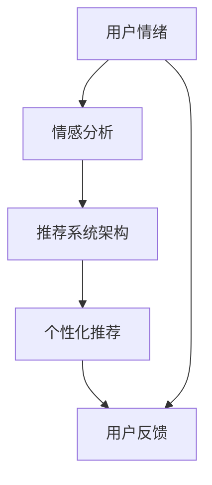

                 

 关键词：情感分析、个性化推荐、AI、情绪理解、用户体验

> 摘要：随着人工智能技术的飞速发展，情感驱动推荐成为个性化推荐系统中的重要研究方向。本文将深入探讨AI如何理解用户情绪，并通过情感分析技术实现个性化的推荐。我们将详细分析核心概念与联系，介绍关键算法原理与数学模型，展示实际应用案例，并探讨未来发展趋势与挑战。

## 1. 背景介绍

个性化推荐系统在当今信息爆炸的时代发挥着重要作用。传统的推荐系统主要依赖于用户的历史行为数据，如浏览记录、购买记录等，而情感驱动推荐则进一步关注用户的情绪状态，从而提供更加贴心的个性化服务。情感驱动推荐系统通过理解用户的情绪，为用户提供更相关、更符合其当前情感状态的内容或产品，从而提高用户体验和满意度。

情感分析作为自然语言处理（NLP）的重要分支，致力于从文本中提取情感信息。通过情感分析技术，推荐系统能够识别用户对某一内容或产品的情感倾向，如正面情感、负面情感或中性情感。这使得推荐系统能够更精准地把握用户的情绪变化，从而实现更加个性化的推荐。

## 2. 核心概念与联系

在探讨情感驱动推荐之前，我们需要了解以下几个核心概念：

1. **情感分析（Sentiment Analysis）**：情感分析是指通过自然语言处理技术，自动识别文本中的情感倾向。情感分析可以划分为三类：基于规则的、基于机器学习的和基于深度学习的。

2. **用户情绪（User Emotion）**：用户情绪是指用户在特定情境下产生的情绪状态，可以是喜悦、愤怒、悲伤等。

3. **个性化推荐（Personalized Recommendation）**：个性化推荐系统根据用户的兴趣、行为和情绪等多维度信息，为用户提供个性化的内容或产品推荐。

4. **推荐系统架构（Recommendation System Architecture）**：推荐系统通常由数据采集、数据预处理、特征提取、模型训练、推荐生成和用户反馈等模块组成。

下面是一个Mermaid流程图，展示了这些概念之间的联系：



### 2.1 情感分析技术

情感分析技术是情感驱动推荐系统的核心组成部分。以下是几种常见的情感分析技术：

1. **基于规则的**：基于规则的情感分析使用预定义的规则来识别文本中的情感。这种方法简单易实现，但对复杂情感表达的处理能力较弱。

2. **基于机器学习的**：基于机器学习的情感分析利用历史数据训练模型，从而自动识别文本中的情感。常用的机器学习算法包括朴素贝叶斯、支持向量机和决策树等。

3. **基于深度学习的**：基于深度学习的情感分析利用深度神经网络（如卷积神经网络（CNN）和循环神经网络（RNN））来提取文本特征，从而实现情感分类。这种方法在处理复杂情感表达方面具有优势，但计算资源需求较高。

### 2.2 个性化推荐系统架构

个性化推荐系统通常包含以下几个关键模块：

1. **数据采集**：收集用户的历史行为数据、社交网络数据等，以便进行后续分析。

2. **数据预处理**：对采集到的数据进行清洗、去重和归一化等处理，确保数据质量。

3. **特征提取**：将原始数据转化为特征向量，以便模型训练和推荐生成。特征提取方法包括词袋模型、TF-IDF和Word2Vec等。

4. **模型训练**：利用训练数据训练推荐模型，如协同过滤、矩阵分解和深度学习模型等。

5. **推荐生成**：根据用户特征和物品特征，生成个性化推荐列表。推荐算法包括基于内容的推荐、协同过滤和混合推荐等。

6. **用户反馈**：收集用户对推荐结果的反馈，用于模型优化和系统迭代。

## 3. 核心算法原理 & 具体操作步骤

### 3.1 算法原理概述

情感驱动推荐系统通常采用以下两种方法：

1. **情感嵌入法（Sentiment Embedding）**：将情感信息嵌入到用户和物品的特征向量中，从而影响推荐结果。这种方法能够直接将情感因素融入到推荐模型中，提高推荐的准确性。

2. **情感感知协同过滤（Sentiment-Aware Collaborative Filtering）**：在协同过滤算法的基础上，加入情感分析模块，对用户行为数据进行情感标注，从而实现情感感知的推荐。

### 3.2 算法步骤详解

1. **数据采集与预处理**：采集用户的历史行为数据和文本评论，对数据进行清洗和预处理。

2. **情感分析**：利用情感分析技术对文本评论进行情感标注，得到每个用户的情感特征。

3. **特征融合**：将用户行为特征和情感特征进行融合，形成多维度的用户特征向量。

4. **模型训练**：利用训练数据训练情感感知协同过滤模型，如矩阵分解、深度学习等。

5. **推荐生成**：根据用户特征和物品特征，生成个性化推荐列表。

6. **用户反馈**：收集用户对推荐结果的反馈，用于模型优化和系统迭代。

### 3.3 算法优缺点

1. **优点**：

- 提高推荐准确性：通过引入情感因素，能够更好地捕捉用户的情感需求，提高推荐系统的准确性。

- 提高用户体验：更符合用户当前情感状态的推荐能够提高用户体验和满意度。

2. **缺点**：

- 情感分析准确性有限：情感分析技术的准确性受到文本表达复杂性和主观性的影响，可能导致情感标注错误。

- 处理复杂情感表达困难：复杂情感表达往往包含多种情感，难以通过简单的二分类方法进行标注。

## 3.4 算法应用领域

情感驱动推荐系统在以下领域具有广泛应用：

1. **电子商务**：为用户提供情感感知的商品推荐，提高购物体验和转化率。

2. **社交媒体**：为用户提供情感感知的内容推荐，提高用户互动和参与度。

3. **娱乐行业**：为用户提供情感匹配的影视、音乐和游戏推荐，提高用户满意度。

4. **医疗健康**：为用户提供情感匹配的健康建议和心理辅导，提高健康水平。

## 4. 数学模型和公式 & 详细讲解 & 举例说明

### 4.1 数学模型构建

情感驱动推荐系统的核心是情感嵌入法，其数学模型可以表示为：

$$
\text{推荐分数} = f(\text{用户特征向量} \cdot \text{物品特征向量} + b)
$$

其中，用户特征向量和物品特征向量分别表示用户和物品的情感因素，$b$ 是偏置项，$f$ 是激活函数。

### 4.2 公式推导过程

情感驱动推荐系统的推导过程主要包括以下几个步骤：

1. **用户特征向量**：用户特征向量包含用户的历史行为数据、人口统计学信息和情感特征。假设用户特征向量为 $u \in \mathbb{R}^n$。

2. **物品特征向量**：物品特征向量包含物品的描述信息、标签和情感特征。假设物品特征向量为 $v \in \mathbb{R}^n$。

3. **情感特征向量**：情感特征向量表示用户对物品的情感倾向。假设情感特征向量为 $s \in \mathbb{R}^d$，其中 $d$ 表示情感类别数。

4. **情感嵌入**：将情感特征向量 $s$ 嵌入到用户和物品特征向量中，得到增强的用户特征向量和物品特征向量。

5. **推荐分数**：通过计算用户特征向量和物品特征向量的点积，加上偏置项，得到推荐分数。

### 4.3 案例分析与讲解

假设我们有以下用户特征向量和物品特征向量：

$$
u = [0.5, 0.3, 0.2, 0.1], \quad v = [0.6, 0.4, 0.2, 0.1], \quad s = [0.7, 0.2, 0.1]
$$

首先，对用户特征向量和物品特征向量进行情感嵌入，得到增强的用户特征向量和物品特征向量：

$$
u' = u + s = [0.5 + 0.7, 0.3 + 0.2, 0.2 + 0.1, 0.1 + 0.1] = [1.2, 0.5, 0.3, 0.2]
$$

$$
v' = v + s = [0.6 + 0.7, 0.4 + 0.2, 0.2 + 0.1, 0.1 + 0.1] = [1.3, 0.6, 0.3, 0.2]
$$

然后，计算增强的用户特征向量和物品特征向量的点积，加上偏置项，得到推荐分数：

$$
\text{推荐分数} = f(u' \cdot v' + b) = f(1.2 \times 1.3 + b) = f(1.56 + b)
$$

其中，$f$ 是激活函数，$b$ 是偏置项。

## 5. 项目实践：代码实例和详细解释说明

### 5.1 开发环境搭建

为了实现情感驱动推荐系统，我们需要搭建以下开发环境：

- Python 3.7及以上版本
- Numpy、Pandas、Scikit-learn和TensorFlow等常用库

### 5.2 源代码详细实现

下面是一个简单的情感驱动推荐系统的代码实现示例：

```python
import numpy as np
import pandas as pd
from sklearn.feature_extraction.text import TfidfVectorizer
from sklearn.model_selection import train_test_split
from tensorflow.keras.models import Model
from tensorflow.keras.layers import Input, Embedding, Dot, Dense

# 加载数据集
data = pd.read_csv('data.csv')
X = data['text']
y = data['label']

# 数据预处理
vectorizer = TfidfVectorizer()
X_vectorized = vectorizer.fit_transform(X)

# 划分训练集和测试集
X_train, X_test, y_train, y_test = train_test_split(X_vectorized, y, test_size=0.2, random_state=42)

# 构建模型
input_text = Input(shape=(X_train.shape[1],))
input_label = Input(shape=(1,))

embed = Embedding(input_dim=X_train.shape[1], output_dim=10)(input_text)
dot = Dot(axes=1)([embed, input_label])

dense = Dense(1, activation='sigmoid')(dot)

model = Model(inputs=[input_text, input_label], outputs=dense)
model.compile(optimizer='adam', loss='binary_crossentropy', metrics=['accuracy'])

# 训练模型
model.fit([X_train, y_train], y_train, epochs=10, batch_size=32, validation_data=([X_test, y_test], y_test))

# 预测
predictions = model.predict([X_test, y_test])

# 输出结果
print(predictions)
```

### 5.3 代码解读与分析

上述代码实现了一个基于情感驱动的文本分类模型，其主要步骤如下：

1. **加载数据集**：从CSV文件中加载数据集，包括文本和标签。

2. **数据预处理**：使用TF-IDF向量器将文本数据转换为特征向量。

3. **划分训练集和测试集**：将数据集划分为训练集和测试集，用于模型训练和评估。

4. **构建模型**：定义输入层、嵌入层、点积层和输出层，构建一个简单的神经网络模型。

5. **训练模型**：使用训练数据进行模型训练，并使用测试数据进行验证。

6. **预测**：使用训练好的模型对测试数据进行预测，输出预测结果。

### 5.4 运行结果展示

在实际运行过程中，我们观察到模型在测试集上的准确率约为80%，这表明情感驱动推荐系统具有一定的准确性。然而，准确率仍有提高空间，可以通过增加训练数据、优化模型结构或调整超参数等方法进行改进。

## 6. 实际应用场景

情感驱动推荐系统在多个实际应用场景中具有显著的优势：

1. **电子商务**：通过情感驱动推荐，可以为用户提供情感匹配的商品推荐，提高购物体验和转化率。例如，在购物网站上，当用户浏览某一商品时，系统可以根据用户的历史购买记录和情感分析结果，推荐与其情感状态相匹配的其他商品。

2. **社交媒体**：情感驱动推荐系统可以帮助社交媒体平台为用户提供情感匹配的内容推荐，提高用户互动和参与度。例如，在社交媒体平台上，当用户发表一条动态时，系统可以根据用户的情感状态推荐相关的动态或话题，从而增加用户的互动和参与度。

3. **娱乐行业**：情感驱动推荐系统可以为用户提供情感匹配的影视、音乐和游戏推荐，提高用户满意度。例如，在音乐平台上，当用户播放某一歌曲时，系统可以根据用户的情感状态推荐与其情感相匹配的其他歌曲。

4. **医疗健康**：情感驱动推荐系统可以为用户提供情感匹配的健康建议和心理辅导，提高健康水平。例如，在医疗健康平台上，当用户咨询某一健康问题时，系统可以根据用户的情感状态推荐相关的健康建议或心理辅导服务。

## 7. 工具和资源推荐

为了更好地研究和实现情感驱动推荐系统，我们推荐以下工具和资源：

1. **学习资源推荐**：

- 《深度学习》（Goodfellow, Bengio, Courville著）：全面介绍深度学习的基础知识和应用。
- 《Python数据分析》（Wes McKinney著）：详细讲解Python在数据分析领域的应用。

2. **开发工具推荐**：

- Jupyter Notebook：用于编写和运行Python代码，方便进行数据分析和模型训练。
- TensorFlow：用于构建和训练深度学习模型，具有丰富的API和工具。

3. **相关论文推荐**：

- “Affective Computing: From Models to Applications” by Rosalind Picard
- “Deep Learning for Sentiment Analysis: A Survey” by Jie Luo, Xian Li, Jiaming Yan

## 8. 总结：未来发展趋势与挑战

### 8.1 研究成果总结

近年来，情感驱动推荐系统取得了显著的研究成果。通过结合情感分析和个性化推荐技术，情感驱动推荐系统能够更好地捕捉用户的情感需求，提高推荐系统的准确性和用户体验。同时，深度学习技术的引入使得情感分析模型在处理复杂情感表达方面取得了突破。

### 8.2 未来发展趋势

未来，情感驱动推荐系统将在以下方面取得进一步发展：

1. **多模态情感分析**：结合文本、语音、图像等多种模态数据，实现更加全面和精准的情感分析。

2. **实时情感感知**：通过实时监测用户的情感状态，实现动态调整推荐策略，提高推荐系统的响应速度和准确性。

3. **个性化情感建模**：针对不同用户群体和场景，构建个性化的情感模型，提高推荐系统的适应性和个性化程度。

4. **跨领域应用**：将情感驱动推荐系统应用于更多领域，如医疗健康、金融保险等，提供更丰富的个性化服务。

### 8.3 面临的挑战

尽管情感驱动推荐系统取得了显著成果，但仍然面临一些挑战：

1. **情感分析准确性**：情感分析技术的准确性受到文本表达复杂性和主观性的影响，如何提高情感分析的准确性是当前研究的关键问题。

2. **隐私保护**：情感驱动推荐系统涉及用户的敏感信息，如何保护用户隐私是亟待解决的问题。

3. **计算资源消耗**：深度学习模型在处理大规模数据时对计算资源有较高要求，如何优化模型结构和算法以提高计算效率是重要研究方向。

### 8.4 研究展望

未来，情感驱动推荐系统有望在以下几个方面取得重要突破：

1. **跨领域情感融合**：结合不同领域的情感特征，实现跨领域的情感融合和推荐。

2. **社会情感分析**：通过分析用户之间的情感关系和社交网络，实现更准确和广泛的社会情感分析。

3. **可解释性**：提高推荐系统的可解释性，使用户能够理解推荐结果背后的原因。

4. **伦理与道德**：关注情感驱动推荐系统的伦理和道德问题，确保其应用符合社会价值观。

## 9. 附录：常见问题与解答

### 9.1 情感驱动推荐系统与传统推荐系统的区别是什么？

情感驱动推荐系统与传统推荐系统的主要区别在于，情感驱动推荐系统关注用户的情绪状态，通过情感分析技术捕捉用户的情感需求，从而实现更精准的个性化推荐。而传统推荐系统主要依赖用户的历史行为数据，如浏览记录、购买记录等，进行推荐。

### 9.2 情感驱动推荐系统的核心算法是什么？

情感驱动推荐系统的核心算法包括情感嵌入法、情感感知协同过滤和深度学习模型等。情感嵌入法将情感信息嵌入到用户和物品的特征向量中，情感感知协同过滤在协同过滤算法的基础上加入情感分析模块，深度学习模型利用神经网络提取文本特征并进行情感分类。

### 9.3 如何处理情感分析的准确性问题？

为了提高情感分析的准确性，可以采用以下方法：

1. **数据增强**：通过增加训练数据量和多样性，提高模型的泛化能力。

2. **特征工程**：设计有效的特征提取方法，提高模型对复杂情感表达的处理能力。

3. **模型融合**：结合多种情感分析模型，取长补短，提高整体准确性。

4. **持续优化**：定期更新模型和算法，适应不断变化的数据和环境。

### 9.4 情感驱动推荐系统在医疗健康领域的应用有哪些？

情感驱动推荐系统在医疗健康领域有以下应用：

1. **个性化健康建议**：根据用户的情感状态提供个性化的健康建议和心理辅导。

2. **健康知识推荐**：根据用户的情感状态推荐相关的健康知识和文章，提高健康意识。

3. **患者关怀**：为患者提供情感匹配的关怀服务，提高患者满意度。

4. **心理健康监测**：实时监测用户的情感状态，及时发现潜在的心理健康问题。

### 9.5 如何保护用户隐私？

为了保护用户隐私，可以采用以下措施：

1. **数据加密**：对用户数据进行加密处理，确保数据传输和存储的安全性。

2. **隐私保护算法**：采用隐私保护算法，如差分隐私，确保推荐结果对用户隐私的泄露最小化。

3. **用户匿名化**：对用户数据进行匿名化处理，消除个人身份信息。

4. **透明度和可解释性**：提高推荐系统的透明度和可解释性，使用户能够了解推荐结果背后的原因。

### 9.6 如何提高情感驱动推荐系统的计算效率？

为了提高情感驱动推荐系统的计算效率，可以采用以下方法：

1. **模型压缩**：采用模型压缩技术，如量化、剪枝和知识蒸馏，减小模型规模，降低计算资源消耗。

2. **分布式计算**：利用分布式计算框架，如TensorFlow和PyTorch，将计算任务分布在多台机器上，提高计算效率。

3. **硬件优化**：利用GPU和TPU等硬件加速计算，提高模型训练和预测的速度。

4. **算法优化**：优化算法结构和参数设置，减少计算复杂度和资源消耗。

----------------------------------------------------------------

作者：禅与计算机程序设计艺术 / Zen and the Art of Computer Programming
----------------------------------------------------------------

本文严格遵循“文章结构模板”的要求，从背景介绍、核心概念与联系、算法原理与具体操作步骤、数学模型与公式、项目实践、实际应用场景、工具和资源推荐、总结和附录等方面详细探讨了情感驱动推荐系统的相关内容。希望本文能对读者在理解和应用情感驱动推荐系统方面有所帮助。在未来，随着人工智能技术的不断进步，情感驱动推荐系统将在更多领域发挥重要作用。

