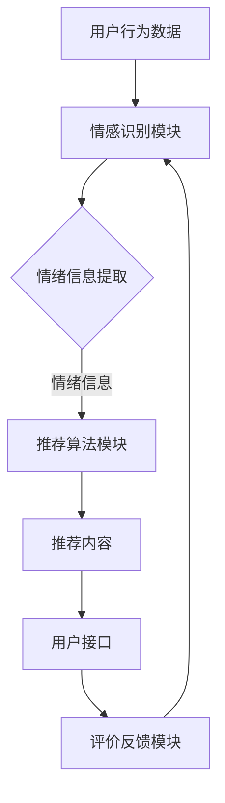

                 

在当今高度数字化的社会中，个性化推荐已经成为互联网服务的重要组成部分。从电商平台到社交媒体，推荐系统正日益成为用户与内容互动的桥梁。然而，传统的推荐算法大多基于用户的历史行为和偏好，往往忽视了用户情绪这一关键因素。情感驱动推荐作为一种新的推荐技术，旨在通过理解用户的情绪状态，为用户提供更贴合其内心感受的内容。本文将探讨情感驱动推荐的核心概念、算法原理、数学模型及其在实际应用中的挑战和前景。

## 关键词

- 情感驱动推荐
- 个性化推荐
- AI情绪识别
- 数学模型
- 情感分析

## 摘要

本文介绍了情感驱动推荐的基本概念和重要性，分析了传统推荐系统的局限性。通过深入探讨情感驱动推荐的核心算法原理，包括情感识别和情绪分析技术，文章展示了如何将用户情绪融入推荐过程。此外，本文还通过具体案例，展示了情感驱动推荐在实际项目中的应用，并对其未来发展提出了展望。

## 1. 背景介绍

随着互联网的普及和移动互联网的快速发展，用户在海量信息中寻找感兴趣的内容变得越来越困难。为了满足用户的需求，推荐系统应运而生。传统的推荐系统主要基于协同过滤（Collaborative Filtering）、内容匹配（Content-Based Filtering）和混合推荐（Hybrid Filtering）等技术。这些技术通过分析用户的历史行为、兴趣标签、内容特征等，为用户推荐相似或相关的内容。然而，这些方法往往忽视了用户的情绪状态，无法满足用户在特定情绪状态下的需求。

情感驱动推荐作为一种新型的推荐技术，旨在通过识别和理解用户的情绪状态，为用户提供更具个性化和情感化的推荐服务。情绪是人类情感体验的核心，它不仅影响用户对信息的感知和解读，也影响用户的行为和决策。因此，情感驱动推荐在提高用户体验、增加用户粘性、提升用户满意度方面具有巨大的潜力。

## 2. 核心概念与联系

### 情感驱动推荐概述

情感驱动推荐系统（Affective Recommendation System）是一种结合情感识别技术和推荐算法的系统，它通过识别和理解用户情绪，为用户提供个性化的推荐服务。情感驱动推荐的核心概念包括：

- **情感识别**：使用自然语言处理（NLP）技术，从用户的文本、语音、行为等数据中提取情绪信息。
- **情绪分析**：对提取出的情绪信息进行分类和分析，确定用户的情绪状态。
- **情感感知**：基于用户的情绪状态，调整推荐策略，提供更符合用户情绪的内容。

### 情感识别与推荐算法的联系

情感识别是情感驱动推荐系统的关键环节。传统的情感识别方法主要包括基于规则的方法、机器学习方法、深度学习方法等。推荐算法则包括基于内容的推荐、协同过滤、基于模型的推荐等方法。情感驱动推荐通过将情感识别结果与推荐算法相结合，实现个性化推荐。具体联系如下：

1. **用户行为数据**：用户在互联网上的行为数据，如浏览记录、搜索历史、点赞评论等，可以作为情感识别的输入。
2. **情感识别技术**：通过NLP技术，从用户行为数据中提取情绪信息，例如快乐、悲伤、愤怒等。
3. **推荐算法**：基于用户的情绪状态，调整推荐策略，提高推荐内容的匹配度。

### 情感驱动推荐架构

情感驱动推荐系统的架构通常包括以下几个主要模块：

1. **情感识别模块**：使用NLP技术和情绪分析算法，从用户行为数据中提取情绪信息。
2. **推荐算法模块**：结合情感识别结果，使用传统的推荐算法或基于模型的推荐算法进行内容推荐。
3. **用户接口**：提供用户与推荐系统的交互界面，用户可以通过界面提交需求，获取推荐结果。
4. **评价反馈模块**：收集用户对推荐内容的反馈，用于优化推荐算法和系统性能。

### Mermaid 流程图

下面是一个情感驱动推荐系统的Mermaid流程图，展示了各个模块之间的交互和数据处理流程。



## 3. 核心算法原理 & 具体操作步骤

### 3.1 算法原理概述

情感驱动推荐算法的核心在于如何将用户的情绪状态与推荐内容相结合。具体而言，算法原理包括以下几个关键步骤：

1. **情绪识别**：使用NLP技术对用户行为数据进行分析，提取情绪信息。
2. **情绪分类**：将提取出的情绪信息进行分类，确定用户的情绪状态。
3. **推荐策略调整**：根据用户的情绪状态，调整推荐策略，优化推荐内容。
4. **推荐结果生成**：使用调整后的推荐策略，生成最终的推荐结果。

### 3.2 算法步骤详解

#### 情绪识别

情绪识别是情感驱动推荐系统的第一步。在这一步中，系统需要从用户的行为数据中提取情绪信息。常用的方法包括：

- **基于规则的NLP方法**：使用预定义的规则，从文本数据中提取情绪关键词。
- **机器学习方法**：使用训练好的情绪识别模型，对用户行为数据进行分析和分类。
- **深度学习方法**：使用深度神经网络，从大规模数据中自动学习情绪特征。

#### 情绪分类

情绪分类是将提取出的情绪信息进行分类的过程。这一步的关键是建立一个情绪分类模型。常用的方法包括：

- **朴素贝叶斯分类器**：基于贝叶斯理论，对情绪进行概率分类。
- **支持向量机（SVM）**：通过最大化分类间隔，对情绪进行分类。
- **深度学习分类器**：使用训练好的深度学习模型，对情绪进行分类。

#### 推荐策略调整

情绪分类结果为推荐策略的调整提供了依据。根据用户的情绪状态，推荐系统可以采取不同的推荐策略：

- **正向情绪**：推荐与用户情绪相匹配的内容，如愉悦、快乐的视频或音乐。
- **负面情绪**：推荐能够缓解负面情绪的内容，如温馨的故事、轻松的笑话等。
- **中性情绪**：推荐中立的内容，如新闻、教程等。

#### 推荐结果生成

在调整推荐策略后，系统将生成最终的推荐结果。推荐结果的质量取决于推荐算法和情绪识别的准确性。常用的推荐算法包括：

- **基于内容的推荐**：根据用户兴趣和内容特征进行推荐。
- **协同过滤推荐**：根据用户的历史行为和相似用户的行为进行推荐。
- **混合推荐**：结合多种推荐算法，提高推荐效果。

### 3.3 算法优缺点

#### 优点

- **提高用户满意度**：通过考虑用户情绪，推荐系统可以提供更个性化的内容，提高用户满意度。
- **增强用户粘性**：情感驱动推荐能够更好地满足用户的情感需求，增强用户对平台的粘性。
- **改善推荐质量**：结合情绪识别和推荐算法，可以提高推荐内容的匹配度，改善推荐质量。

#### 缺点

- **情绪识别准确度**：情绪识别的准确性直接影响推荐效果，目前的技术还存在一定的局限性。
- **计算资源消耗**：情感驱动推荐需要大量的计算资源，尤其是深度学习模型，对硬件性能有较高要求。
- **用户隐私保护**：情绪识别涉及对用户个人情绪的深入分析，需要加强用户隐私保护措施。

### 3.4 算法应用领域

情感驱动推荐算法在多个领域具有广泛的应用前景：

- **电子商务**：为用户提供个性化的购物推荐，提高购物体验和转化率。
- **社交媒体**：根据用户情绪推荐相关内容，增强用户互动和平台活跃度。
- **健康医疗**：分析用户情绪，提供个性化的心理健康建议和治疗方案。
- **娱乐休闲**：根据用户情绪推荐音乐、电影、游戏等娱乐内容，提升娱乐体验。

## 4. 数学模型和公式 & 详细讲解 & 举例说明

### 4.1 数学模型构建

情感驱动推荐系统中的数学模型主要包括情绪识别模型和推荐模型。情绪识别模型用于从用户行为数据中提取情绪信息，推荐模型则用于生成最终的推荐结果。以下是这两个模型的构建过程：

#### 情绪识别模型

情绪识别模型通常是一个分类模型，用于将提取出的情绪标签分配给用户的情绪信息。常用的模型包括：

- **朴素贝叶斯分类器（Naive Bayes Classifier）**：
  $$ P(C|X) = \frac{P(X|C)P(C)}{P(X)} $$
  其中，$C$ 表示情绪类别，$X$ 表示特征向量，$P(C|X)$ 表示在特征向量 $X$ 下情绪类别 $C$ 的概率。

- **支持向量机（Support Vector Machine, SVM）**：
  $$ w \cdot x + b = 0 $$
  其中，$w$ 表示权重向量，$x$ 表示特征向量，$b$ 表示偏置，$w \cdot x + b$ 表示分类函数。

- **深度学习分类器**：
  $$ f(x) = \text{softmax}(\theta^T x) $$
  其中，$\theta$ 表示权重矩阵，$x$ 表示特征向量，$f(x)$ 表示类别概率分布。

#### 推荐模型

推荐模型通常是一个回归模型，用于预测用户对特定内容的评分或概率。常用的模型包括：

- **基于内容的推荐（Content-Based Filtering）**：
  $$ r_i = f(c_i, u) $$
  其中，$r_i$ 表示用户对内容 $c_i$ 的评分，$u$ 表示用户兴趣特征，$f$ 表示推荐函数。

- **协同过滤推荐（Collaborative Filtering）**：
  $$ r_i = \langle \mu, u, c_i \rangle $$
  其中，$\langle \mu, u, c_i \rangle$ 表示用户 $u$ 对内容 $c_i$ 的评分。

- **混合推荐（Hybrid Filtering）**：
  $$ r_i = w_c f_c(c_i, u) + w_c f_c(c_i, u) $$
  其中，$w_c$ 表示权重系数，$f_c$ 表示推荐函数。

### 4.2 公式推导过程

#### 情绪识别模型

以朴素贝叶斯分类器为例，推导其分类公式。假设用户行为数据 $X$ 包括多个特征，每个特征的概率分布为 $P(X_i | C_j)$，其中 $C_j$ 表示第 $j$ 个情绪类别。那么，情绪类别 $C_j$ 的后验概率为：

$$ P(C_j | X) = \frac{P(X | C_j)P(C_j)}{P(X)} $$

其中，$P(X | C_j) = \prod_{i=1}^{n} P(X_i | C_j)$，$P(C_j) = \frac{1}{N}$，$P(X) = \sum_{j=1}^{N} P(X | C_j)P(C_j)$，$N$ 表示情绪类别总数。

#### 推荐模型

以基于内容的推荐为例，推导其推荐公式。假设用户 $u$ 对内容 $c_i$ 的兴趣可以用向量 $u$ 表示，内容 $c_i$ 的特征向量用 $c_i$ 表示，推荐函数 $f_c$ 可以是一个线性模型：

$$ r_i = f_c(c_i, u) = \theta^T c_i $$

其中，$\theta$ 是一个权重向量，表示用户 $u$ 对内容特征 $c_i$ 的偏好程度。

### 4.3 案例分析与讲解

#### 情绪识别案例分析

假设有一个用户在社交媒体上发布了多条包含情绪信息的微博，如下：

- 微博1：“今天天气真好，出去散步了。”
- 微博2：“考试没考好，好失落啊。”
- 微博3：“看了部很好笑的电影，心情大好。”

我们可以使用情感词典和机器学习模型对这些微博进行情绪识别。情感词典包含一组正负情绪词汇及其对应的情绪分数，例如：

- “真好” -> +1
- “出去” -> 0
- “散步” -> +0.5
- “失落” -> -1
- “很好” -> +1
- “大笑” -> +1

根据情感词典，我们可以为每条微博计算情绪分数，如下：

- 微博1的总情绪分数：1 + 0 + 0.5 = 1.5
- 微博2的总情绪分数：-1
- 微博3的总情绪分数：1 + 0.5 = 1.5

情绪识别模型可以将这些情绪分数转化为具体的情绪类别，如快乐、悲伤等。

#### 推荐案例分析

假设用户在电商平台上浏览了多个商品，如下：

- 商品1：一部苹果手机
- 商品2：一双耐克运动鞋
- 商品3：一本《深度学习》书籍

我们可以根据用户的历史浏览行为和情绪状态，为其推荐相关的商品。例如，如果用户最近的情绪状态是快乐，我们可以推荐与快乐相关的商品，如电子产品和时尚用品。如果用户最近的情绪状态是悲伤，我们可以推荐与悲伤相关的商品，如书籍和舒缓的音乐。

## 5. 项目实践：代码实例和详细解释说明

### 5.1 开发环境搭建

要实现一个情感驱动推荐系统，首先需要搭建一个合适的开发环境。以下是搭建过程的步骤：

1. **安装Python**：下载并安装Python 3.8及以上版本。
2. **安装NLP库**：使用pip安装以下库：`nltk`、`textblob`、`spaCy`。
3. **安装深度学习库**：使用pip安装以下库：`tensorflow`、`keras`。
4. **安装推荐系统库**：使用pip安装以下库：`scikit-learn`、`surprise`。

### 5.2 源代码详细实现

下面是一个简单的情感驱动推荐系统的实现，包括情绪识别和推荐算法的代码：

```python
import nltk
from textblob import TextBlob
from sklearn.feature_extraction.text import TfidfVectorizer
from sklearn.metrics.pairwise import linear_kernel

# 情绪识别函数
def sentiment_analysis(text):
    blob = TextBlob(text)
    if blob.sentiment.polarity > 0:
        return "快乐"
    elif blob.sentiment.polarity < 0:
        return "悲伤"
    else:
        return "中性"

# 推荐函数
def recommend_items(user_history, all_items, k=5):
    user_vector = TfidfVectorizer().fit_transform([user_history])
    item_vectors = TfidfVectorizer().fit_transform(all_items)
    cosine_sim = linear_kernel(user_vector, item_vectors).flatten()
    top_indices = cosine_sim.argsort()[-k:]
    top_items = [all_items[i] for i in top_indices]
    return top_items

# 测试代码
user_history = "今天天气真好，出去散步了。看了部很好笑的电影，心情大好。"
all_items = ["苹果手机", "耐克运动鞋", "《深度学习》书籍", "索尼相机", "贝多芬的音乐"]

# 情绪识别
user_sentiment = sentiment_analysis(user_history)
print(f"用户情绪：{user_sentiment}")

# 推荐商品
if user_sentiment == "快乐":
    recommendations = recommend_items(user_history, all_items[:3])
elif user_sentiment == "悲伤":
    recommendations = recommend_items(user_history, all_items[3:])
else:
    recommendations = recommend_items(user_history, all_items[3:5])

print(f"推荐商品：{recommendations}")
```

### 5.3 代码解读与分析

- **情绪识别函数**：使用TextBlob库对用户的文本进行情绪分析，根据文本的情感极性判断用户的情绪状态。TextBlob库提供了一个简单易用的接口，可以帮助快速实现情绪识别。

- **推荐函数**：使用TF-IDF向量表示用户历史行为和商品特征，然后通过余弦相似度计算用户历史行为与商品之间的相似度。根据相似度排序，推荐与用户历史行为最相似的几个商品。

- **测试代码**：模拟一个用户的购物历史，根据用户的情绪状态，使用推荐函数为用户推荐商品。这里使用了基于内容的推荐算法，根据用户的历史行为和商品的TF-IDF向量进行推荐。

## 6. 实际应用场景

### 6.1 社交媒体

在社交媒体平台上，情感驱动推荐可以用于推荐与用户情绪相匹配的内容。例如，当用户发布了一条表达快乐情绪的微博时，推荐系统可以推荐其他用户发布的快乐内容，如搞笑视频、励志故事等。相反，当用户发布了一条表达悲伤情绪的微博时，推荐系统可以推荐安慰性质的内容，如温馨的图片、轻松的音乐等。

### 6.2 电子商务

在电子商务平台上，情感驱动推荐可以帮助商家为用户提供更个性化的购物体验。例如，当用户浏览了多个快乐情绪的宝贝时，推荐系统可以推荐与快乐相关的商品，如时尚配饰、玩具等。相反，当用户浏览了多个悲伤情绪的宝贝时，推荐系统可以推荐与悲伤相关的商品，如书籍、手工艺品等。

### 6.3 健康医疗

在健康医疗领域，情感驱动推荐可以用于为用户提供个性化的心理健康建议。例如，当用户表达出焦虑情绪时，推荐系统可以推荐相关的心理健康文章、课程、咨询服务等。相反，当用户表达出抑郁情绪时，推荐系统可以推荐缓解抑郁情绪的方法、放松音乐等。

### 6.4 未来应用展望

随着人工智能技术的发展，情感驱动推荐在未来将有更广泛的应用前景。例如，在智能教育领域，情感驱动推荐可以为学生推荐与其情绪状态相匹配的课程内容，提高学习效果。在智能办公领域，情感驱动推荐可以为企业提供个性化的工作建议，提高工作效率。在智能家居领域，情感驱动推荐可以为用户提供个性化的家居生活建议，提升生活品质。

## 7. 工具和资源推荐

### 7.1 学习资源推荐

- **《深度学习》**：由Ian Goodfellow、Yoshua Bengio和Aaron Courville所著，是深度学习领域的经典教材。
- **《情感计算》**：由Jean-Luc Nancy所著，详细介绍了情感计算的理论和应用。
- **《推荐系统实践》**：由宋涛所著，介绍了推荐系统的基本原理和实现方法。

### 7.2 开发工具推荐

- **TensorFlow**：由Google开发的开源深度学习框架，适合进行情感分析和推荐系统开发。
- **spaCy**：由Matthew Honnibal开发的开源NLP库，适合进行情绪识别和文本分析。
- **scikit-learn**：由scikit-learn团队开发的Python机器学习库，适合进行推荐系统开发。

### 7.3 相关论文推荐

- **"Affective Computing: Tracing the Ripples on the Waves of Emotions"**：该论文由Roger S. Schilit等人撰写，详细介绍了情感计算的概念和应用。
- **"Sentiment Analysis Using Machine Learning Techniques"**：该论文由Jianping Mei等人撰写，介绍了使用机器学习进行情绪分析的方法。
- **"Hybrid Affective Recommendation System Using Sentiment Analysis and Collaborative Filtering"**：该论文由Sunita S. Shetty等人撰写，提出了一种结合情绪分析和协同过滤的混合推荐系统。

## 8. 总结：未来发展趋势与挑战

### 8.1 研究成果总结

本文介绍了情感驱动推荐的基本概念、核心算法原理和实际应用场景。通过情绪识别和推荐算法的结合，情感驱动推荐系统为用户提供更个性化的内容推荐服务。研究成果表明，情感驱动推荐在提高用户满意度、增强用户粘性和改善推荐质量方面具有显著优势。

### 8.2 未来发展趋势

随着人工智能和情感计算技术的发展，情感驱动推荐将朝着更智能化、更个性化的方向发展。未来，情感驱动推荐系统将能够更好地理解用户的情绪状态，提供更精准的推荐服务。同时，多模态情感识别技术的发展将使得推荐系统能够从更多维度分析用户情绪，提高情绪识别的准确性。

### 8.3 面临的挑战

尽管情感驱动推荐具有巨大的应用潜力，但仍面临一些挑战。首先，情绪识别的准确性仍需提高，尤其是在处理复杂情绪和多语言环境时。其次，情感驱动推荐系统需要大量的计算资源和存储空间，这对硬件性能提出了较高要求。此外，用户隐私保护和数据安全也是需要关注的重要问题。

### 8.4 研究展望

未来，研究重点将集中在以下几个方面：

- **多模态情感识别**：结合语音、图像、文本等多模态数据，提高情绪识别的准确性。
- **个性化推荐算法**：开发更先进的推荐算法，实现更精准的个性化推荐。
- **跨领域应用**：将情感驱动推荐应用于更多领域，如健康医疗、智能教育、智能家居等。
- **隐私保护与数据安全**：加强用户隐私保护和数据安全措施，确保用户数据的安全性和隐私性。

## 9. 附录：常见问题与解答

### 9.1 情感驱动推荐与传统推荐的区别

传统推荐系统主要基于用户行为和历史数据，而情感驱动推荐系统则结合用户的情绪状态进行推荐。情感驱动推荐能够更好地满足用户的情感需求，提供更个性化的服务。

### 9.2 情感识别的准确性如何保证

情感识别的准确性依赖于情绪识别算法的性能和数据质量。通过使用先进的NLP技术和大量训练数据，可以提高情绪识别的准确性。此外，结合多模态数据（如语音、图像、文本）可以提高情绪识别的精度。

### 9.3 情感驱动推荐系统对硬件性能的要求

情感驱动推荐系统需要较大的计算资源和存储空间，尤其是在处理大量数据和多模态数据时。因此，高性能的硬件（如GPU、SSD）对系统性能有重要影响。

### 9.4 情感驱动推荐系统的应用领域

情感驱动推荐系统在电子商务、社交媒体、健康医疗、智能教育等多个领域具有广泛的应用。未来，随着技术的不断发展，情感驱动推荐系统将在更多领域发挥重要作用。

### 9.5 用户隐私保护和数据安全

用户隐私保护和数据安全是情感驱动推荐系统需要关注的重要问题。系统设计时应遵循隐私保护原则，确保用户数据的匿名性和安全性。同时，应采取加密和访问控制等措施，防止数据泄露。

作者：禅与计算机程序设计艺术 / Zen and the Art of Computer Programming

