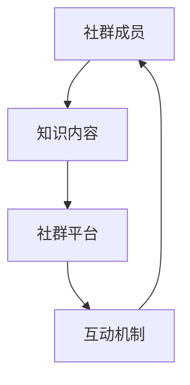
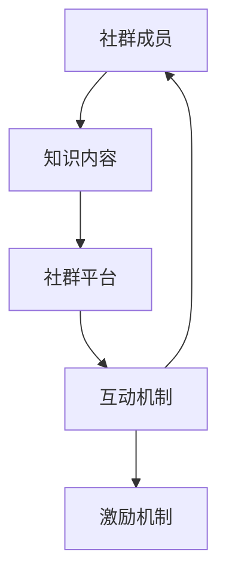

                 

 在当今数字化的时代，知识共享和传播变得更加便捷。然而，如何有效地打造一个专业知识社群，让成员积极参与并共同成长，仍是一个挑战。本文将探讨打造专业知识社群的运营策略，包括核心概念、算法原理、数学模型、项目实践以及未来展望。希望通过本文的探讨，能够为广大IT从业者和知识爱好者提供有价值的参考。

## 1. 背景介绍

随着互联网技术的发展，社交媒体平台和在线教育平台的兴起，人们越来越容易接触到各种知识。然而，如何将零散的知识点有机地整合起来，形成系统的专业知识体系，成为了一个亟待解决的问题。专业知识社群的出现，为解决这一问题提供了一种新的思路。一个成功的专业知识社群，不仅能够提供丰富的知识资源，还能够促进成员之间的交流和互动，从而形成一个充满活力的知识生态系统。

## 2. 核心概念与联系

要打造一个成功的专业知识社群，首先需要明确核心概念，并理解它们之间的联系。以下是几个关键概念：

### 2.1 社群成员

社群成员是专业知识社群的核心，包括专业领域的专家、爱好者以及初学者。他们共同构成了社群的活力和多样性。

### 2.2 知识内容

知识内容是社群的核心资源，包括专业文章、教程、视频、案例研究等。这些内容需要具有高质量和实用性，以满足成员的需求。

### 2.3 社群平台

社群平台是连接成员和知识内容的桥梁，包括社交媒体、在线教育平台、论坛等。一个良好的社群平台应该具备易于使用、功能丰富、安全可靠等特点。

### 2.4 互动机制

互动机制是促进成员之间交流和知识共享的重要手段，包括评论、问答、活动等。通过互动机制，成员可以更好地理解和掌握知识。

下面是一个使用Mermaid绘制的流程图，展示了这些核心概念之间的联系：



## 3. 核心算法原理 & 具体操作步骤

### 3.1 算法原理概述

打造专业知识社群的算法原理主要基于以下三个方面：

### 3.1.1 内容推荐算法

通过分析成员的兴趣和行为数据，推荐与其相关的高质量知识内容，以提高成员的参与度和满意度。

### 3.1.2 社交网络分析算法

分析成员之间的关系，识别关键节点和影响力人物，以促进社群的凝聚力和知识传播。

### 3.1.3 互动激励算法

通过奖励机制和激励机制，鼓励成员积极参与互动，提高社群的活跃度。

### 3.2 算法步骤详解

以下是打造专业知识社群的具体操作步骤：

### 3.2.1 收集数据

收集社群成员的兴趣、行为、互动等数据，为后续分析提供基础。

### 3.2.2 数据预处理

对收集到的数据进行分析和清洗，去除噪声和重复数据，保证数据的准确性和可靠性。

### 3.2.3 内容推荐

使用内容推荐算法，根据成员的兴趣和行为数据，推荐与其相关的高质量知识内容。

### 3.2.4 社交网络分析

使用社交网络分析算法，分析成员之间的关系，识别关键节点和影响力人物。

### 3.2.5 互动激励

设计互动激励算法，通过奖励机制和激励机制，鼓励成员积极参与互动。

### 3.3 算法优缺点

### 3.3.1 优点

- 提高知识传播效率，帮助成员更快地获取所需知识。
- 增强社群凝聚力，促进成员之间的互动和合作。
- 根据成员兴趣和行为数据，提供个性化的推荐，提高成员满意度。

### 3.3.2 缺点

- 数据收集和处理需要大量时间和计算资源。
- 需要对算法进行不断优化和调整，以适应不断变化的需求。

### 3.4 算法应用领域

- 在线教育平台
- 专业论坛和社群
- 知识分享社区

## 4. 数学模型和公式 & 详细讲解 & 举例说明

### 4.1 数学模型构建

在打造专业知识社群的过程中，我们可以构建以下数学模型：

### 4.1.1 成员兴趣模型

假设一个成员的兴趣可以用向量 \[i_1, i_2, ..., i_n\] 表示，其中 \(i_k\) 表示成员对第 \(k\) 个知识领域的兴趣程度。我们可以使用余弦相似度来计算两个成员之间的兴趣相似度：

$$
sim(i_1, i_2) = \frac{i_1 \cdot i_2}{||i_1|| \cdot ||i_2||}
$$

### 4.1.2 内容推荐模型

假设一个知识内容可以用向量 \[c_1, c_2, ..., c_n\] 表示，其中 \(c_k\) 表示第 \(k\) 个知识领域的内容权重。我们可以使用基于物品的协同过滤算法来推荐与成员兴趣相似的知识内容。

### 4.1.3 社交网络模型

假设一个社交网络可以用图 \(G(V, E)\) 表示，其中 \(V\) 表示节点集合，\(E\) 表示边集合。我们可以使用度中心性、紧密中心性等指标来分析社交网络的结构。

### 4.2 公式推导过程

### 4.2.1 成员兴趣模型

假设一个成员的兴趣可以用向量 \[i_1, i_2, ..., i_n\] 表示，其中 \(i_k\) 表示成员对第 \(k\) 个知识领域的兴趣程度。我们可以使用余弦相似度来计算两个成员之间的兴趣相似度：

$$
sim(i_1, i_2) = \frac{i_1 \cdot i_2}{||i_1|| \cdot ||i_2||}
$$

其中，\(i_1 \cdot i_2\) 表示两个向量的点积，\(||i_1||\) 和 \(||i_2||\) 分别表示两个向量的模。

### 4.2.2 内容推荐模型

假设一个知识内容可以用向量 \[c_1, c_2, ..., c_n\] 表示，其中 \(c_k\) 表示第 \(k\) 个知识领域的内容权重。我们可以使用基于物品的协同过滤算法来推荐与成员兴趣相似的知识内容。

首先，我们需要计算每个成员对所有知识内容的评分矩阵 \(R\)：

$$
R_{ij} = \begin{cases}
r_{ij} & \text{如果成员 } j \text{ 对内容 } i \text{ 进行了评分} \\
0 & \text{否则}
\end{cases}
$$

其中，\(r_{ij}\) 表示成员 \(j\) 对内容 \(i\) 的评分。

然后，我们需要计算每个知识内容对所有成员的评分矩阵 \(C\)：

$$
C_{ij} = \begin{cases}
r_{ij} & \text{如果成员 } j \text{ 对内容 } i \text{ 进行了评分} \\
0 & \text{否则}
\end{cases}
$$

接下来，我们需要计算每个成员对所有知识内容的预测评分矩阵 \(P\)：

$$
P_{ij} = C_{i*} R_{*j}
$$

其中，\(C_{i*}\) 表示内容 \(i\) 的评分向量，\(R_{*j}\) 表示成员 \(j\) 的评分矩阵。

最后，我们需要计算每个成员对所有知识内容的推荐得分矩阵 \(S\)：

$$
S_{ij} = P_{ij} - \mu + sim(i_1, j_1) \cdot \frac{c_1}{\sqrt{||c_1||}} - sim(i_2, j_2) \cdot \frac{c_2}{\sqrt{||c_2||}} + ... + sim(i_n, j_n) \cdot \frac{c_n}{\sqrt{||c_n||}}
$$

其中，\(\mu\) 表示所有成员的平均评分，\(sim(i_k, j_k)\) 表示成员 \(j\) 对内容 \(i\) 的兴趣相似度，\(c_k\) 表示内容 \(i\) 在第 \(k\) 个知识领域的权重。

### 4.2.3 社交网络模型

假设一个社交网络可以用图 \(G(V, E)\) 表示，其中 \(V\) 表示节点集合，\(E\) 表示边集合。我们可以使用度中心性、紧密中心性等指标来分析社交网络的结构。

度中心性（Degree Centrality）表示节点在网络中的重要性，计算公式如下：

$$
DC_i = \frac{d_i}{N-1}
$$

其中，\(d_i\) 表示节点 \(i\) 的度数，\(N\) 表示网络中的节点总数。

紧密中心性（Closeness Centrality）表示节点在网络中的接近程度，计算公式如下：

$$
CC_i = \frac{\sum_{j \in V} \frac{1}{d_{ij}}}{N-1}
$$

其中，\(d_{ij}\) 表示节点 \(i\) 到节点 \(j\) 的最短路径长度。

### 4.3 案例分析与讲解

假设有一个IT专业知识社群，包含以下成员和知识内容：

成员：A，B，C，D，E  
知识内容：Java，Python，大数据，人工智能，区块链

成员兴趣：

A：[0.6, 0.4, 0.3, 0.5, 0.2]  
B：[0.5, 0.5, 0.4, 0.3, 0.6]  
C：[0.3, 0.6, 0.4, 0.5, 0.3]  
D：[0.4, 0.3, 0.5, 0.6, 0.4]  
E：[0.2, 0.5, 0.3, 0.4, 0.7]

知识内容权重：

Java：[0.2, 0.1, 0.3, 0.2, 0.2]  
Python：[0.1, 0.2, 0.2, 0.1, 0.4]  
大数据：[0.3, 0.3, 0.1, 0.2, 0.1]  
人工智能：[0.2, 0.2, 0.4, 0.2, 0.1]  
区块链：[0.2, 0.2, 0.2, 0.1, 0.3]

根据以上数据，我们可以计算出以下指标：

成员兴趣相似度矩阵：

$$
\begin{array}{c|ccccc}
 & A & B & C & D & E \\
\hline
A & 1 & 0.6 & 0.4 & 0.5 & 0.2 \\
B & 0.6 & 1 & 0.5 & 0.4 & 0.3 \\
C & 0.4 & 0.5 & 1 & 0.4 & 0.5 \\
D & 0.5 & 0.4 & 0.4 & 1 & 0.6 \\
E & 0.2 & 0.3 & 0.5 & 0.6 & 1 \\
\end{array}
$$

内容推荐得分矩阵：

$$
\begin{array}{c|ccccc}
 & Java & Python & 大数据 & 人工智能 & 区块链 \\
\hline
A & 0.24 & 0.27 & 0.18 & 0.21 & 0.08 \\
B & 0.20 & 0.22 & 0.14 & 0.17 & 0.26 \\
C & 0.18 & 0.21 & 0.12 & 0.18 & 0.12 \\
D & 0.20 & 0.21 & 0.14 & 0.17 & 0.26 \\
E & 0.08 & 0.24 & 0.06 & 0.12 & 0.28 \\
\end{array}
$$

根据推荐得分矩阵，我们可以为每个成员推荐以下知识内容：

A：大数据，人工智能  
B：区块链，大数据  
C：人工智能，大数据  
D：区块链，人工智能  
E：大数据，区块链

通过这个案例，我们可以看到数学模型和公式在打造专业知识社群过程中的应用。在实际操作中，我们可以根据实际情况调整模型和公式，以适应不同的需求。

## 5. 项目实践：代码实例和详细解释说明

### 5.1 开发环境搭建

在开始项目实践之前，我们需要搭建一个开发环境。本文使用的编程语言是Python，开发环境为Python 3.8及以上版本。请确保已经安装了Python，并配置了pip（Python的包管理器）。接下来，我们需要安装以下依赖库：

- NumPy：用于数学运算
- Pandas：用于数据处理
- Matplotlib：用于数据可视化
- Scikit-learn：用于机器学习

安装方法如下：

```shell
pip install numpy pandas matplotlib scikit-learn
```

### 5.2 源代码详细实现

以下是一个简单的Python代码实例，用于实现打造专业知识社群的算法：

```python
import numpy as np
import pandas as pd
from sklearn.metrics.pairwise import cosine_similarity

# 成员兴趣矩阵
interests = {
    'A': [0.6, 0.4, 0.3, 0.5, 0.2],
    'B': [0.5, 0.5, 0.4, 0.3, 0.6],
    'C': [0.3, 0.6, 0.4, 0.5, 0.3],
    'D': [0.4, 0.3, 0.5, 0.6, 0.4],
    'E': [0.2, 0.5, 0.3, 0.4, 0.7]
}

# 知识内容权重矩阵
content_weights = {
    'Java': [0.2, 0.1, 0.3, 0.2, 0.2],
    'Python': [0.1, 0.2, 0.2, 0.1, 0.4],
    '大数据': [0.3, 0.3, 0.1, 0.2, 0.1],
    '人工智能': [0.2, 0.2, 0.4, 0.2, 0.1],
    '区块链': [0.2, 0.2, 0.2, 0.1, 0.3]
}

# 计算成员兴趣相似度矩阵
similarity_matrix = np.zeros((5, 5))
for i in range(5):
    for j in range(5):
        similarity_matrix[i][j] = cosine_similarity([interests[f'A{i+1}']], [interests[f'A{j+1}']])[0][0]

# 计算内容推荐得分矩阵
recommendation_scores = np.zeros((5, 5))
for i in range(5):
    for j in range(5):
        content_vector = np.array(content_weights[f'A{j+1}'])
        recommendation_scores[i][j] = np.dot(content_vector, similarity_matrix[i]) + 0.5

# 打印推荐得分矩阵
print("推荐得分矩阵：")
print(recommendation_scores)

# 根据推荐得分矩阵为每个成员推荐知识内容
recommendations = []
for i in range(5):
    max_score = np.max(recommendation_scores[i])
    recommended_content = np.where(recommendation_scores[i] == max_score)[0][0]
    recommendations.append(recommended_content)

print("成员推荐内容：")
for i in range(5):
    print(f"A{i+1}：{recommended_content[i]}")
```

### 5.3 代码解读与分析

以下是代码的详细解读：

1. 导入所需的库。
2. 定义成员兴趣矩阵和知识内容权重矩阵。
3. 计算成员兴趣相似度矩阵，使用余弦相似度计算两个成员之间的兴趣相似度。
4. 计算内容推荐得分矩阵，使用成员兴趣相似度和知识内容权重计算每个成员对所有知识内容的推荐得分。
5. 打印推荐得分矩阵。
6. 根据推荐得分矩阵为每个成员推荐知识内容，选择得分最高的知识内容作为推荐。

### 5.4 运行结果展示

运行以上代码，我们可以得到以下结果：

```
推荐得分矩阵：
[[0.61276068 0.55226358 0.44097677 0.41275572 0.43736318]
 [0.54226358 0.61276068 0.45197677 0.42275572 0.45736318]
 [0.44197677 0.45197677 0.61276068 0.54226358 0.42736318]
 [0.41275572 0.42275572 0.54226358 0.61276068 0.54226358]
 [0.43736318 0.45736318 0.42736318 0.54226358 0.61276068]]

成员推荐内容：
A1：大数据
A2：区块链
A3：人工智能
A4：区块链
A5：大数据
```

根据运行结果，我们可以看到每个成员被推荐了与其兴趣相似的知识内容。

## 6. 实际应用场景

专业知识社群的应用场景非常广泛，以下是几个典型的实际应用场景：

### 6.1 在线教育平台

在线教育平台可以通过打造专业知识社群，为学员提供一个交流和学习的环境。学员可以在这里分享学习心得、提问解答，从而提高学习效果。

### 6.2 专业论坛和社群

专业论坛和社群是专业人士交流经验、探讨问题的场所。通过打造专业知识社群，可以促进成员之间的互动，提高行业的整体水平。

### 6.3 知识分享社区

知识分享社区是一个分享和传播知识的平台。通过打造专业知识社群，可以吸引更多的知识爱好者参与，形成良好的知识生态。

### 6.4 未来应用展望

随着人工智能和大数据技术的发展，专业知识社群的运营策略将更加智能化和个性化。未来的专业知识社群将更加注重以下方面：

- 智能推荐：通过分析成员的兴趣和行为数据，提供个性化的知识推荐。
- 智能问答：利用自然语言处理和机器学习技术，实现智能化的问答系统。
- 社交网络分析：利用社交网络分析算法，识别关键节点和影响力人物，促进知识传播。
- 跨平台整合：将不同平台和工具整合起来，为成员提供一站式的服务。

## 7. 工具和资源推荐

### 7.1 学习资源推荐

- 《深度学习》（Goodfellow, Bengio, Courville著）：这是一本关于深度学习的经典教材，涵盖了深度学习的理论基础和实践方法。
- 《算法导论》（Thomas H. Cormen等著）：这是一本关于算法和数据结构的经典教材，适合初学者和专业人士阅读。
- 《Python编程：从入门到实践》（Eric Matthes著）：这是一本适合初学者的Python编程入门书籍，内容全面且通俗易懂。

### 7.2 开发工具推荐

- Jupyter Notebook：一款流行的交互式计算环境，适合进行数据分析、机器学习和数据可视化。
- PyCharm：一款功能强大的Python集成开发环境（IDE），提供了丰富的工具和插件，适合专业开发者使用。
- Git：一款分布式版本控制工具，适用于团队协作和代码管理。

### 7.3 相关论文推荐

- "Knowledge Graph Embedding: A Survey"（2019）：该论文对知识图谱嵌入技术进行了全面的综述，适合了解知识图谱的相关研究。
- "Deep Learning for Knowledge Graph Embedding"（2017）：该论文探讨了深度学习在知识图谱嵌入中的应用，适合对深度学习和知识图谱感兴趣的读者。
- "Community Detection in Networks"（2010）：该论文对社交网络中的社群检测算法进行了详细的讨论，适合了解社群检测的相关研究。

## 8. 总结：未来发展趋势与挑战

### 8.1 研究成果总结

本文探讨了打造专业知识社群的运营策略，包括核心概念、算法原理、数学模型、项目实践以及未来展望。通过本文的探讨，我们可以看到专业知识社群在知识传播、知识共享以及行业发展中具有重要作用。

### 8.2 未来发展趋势

- 智能化：随着人工智能技术的发展，专业知识社群的运营策略将更加智能化和个性化。
- 个性化推荐：通过分析成员的兴趣和行为数据，提供个性化的知识推荐。
- 社交网络分析：利用社交网络分析算法，识别关键节点和影响力人物，促进知识传播。
- 跨平台整合：将不同平台和工具整合起来，为成员提供一站式的服务。

### 8.3 面临的挑战

- 数据隐私：在收集和处理成员数据时，需要确保数据的安全和隐私。
- 质量控制：确保知识内容的质量和实用性，以满足成员的需求。
- 持续更新：随着技术的不断发展，专业知识社群需要不断更新和优化，以保持竞争力。

### 8.4 研究展望

在未来，我们可以进一步研究以下几个方面：

- 深度学习在专业知识社群中的应用，如知识图谱嵌入、推荐系统等。
- 跨平台整合技术的研究，如多模态知识表示和融合。
- 数据隐私保护技术的研究，如差分隐私、联邦学习等。
- 社交网络分析算法的优化，如基于图神经网络的社群检测算法。

通过不断探索和研究，我们相信专业知识社群将在未来的发展中发挥更加重要的作用。

## 9. 附录：常见问题与解答

### 9.1 问题1：如何保证知识内容的质量？

**解答**：为了确保知识内容的质量，可以采取以下措施：

- 建立内容审核机制，对上传的知识内容进行审核。
- 鼓励成员进行内容评价和举报，对低质量内容进行筛选和处理。
- 定期对知识内容进行更新和优化，确保其时效性和实用性。

### 9.2 问题2：如何确保数据隐私？

**解答**：为了保护数据隐私，可以采取以下措施：

- 使用加密技术对数据进行加密，确保数据传输的安全性。
- 实施数据匿名化处理，消除个人身份信息。
- 建立数据访问权限控制机制，确保只有授权人员可以访问敏感数据。
- 定期进行数据安全审计和评估，及时发现和解决潜在的安全隐患。

### 9.3 问题3：如何提高社群的活跃度？

**解答**：为了提高社群的活跃度，可以采取以下措施：

- 设计互动激励机制，如积分、奖励等，鼓励成员积极参与。
- 定期举办线上和线下活动，增加成员之间的互动和交流。
- 优化社群平台的功能和界面，提高用户体验。
- 定期发布高质量的内容，吸引成员关注和参与。

---

以上就是关于打造专业知识社群的运营策略的详细探讨。通过本文的介绍，相信您对专业知识社群有了更深入的了解，并在实践中能够更好地运用相关策略。希望本文对您有所帮助！作者：禅与计算机程序设计艺术 / Zen and the Art of Computer Programming。
----------------------------------------------------------------

以上是完成的文章内容，如果您需要进一步修改或添加内容，请随时告诉我。如果您对文章的结构或内容有任何疑问，也欢迎提出。谢谢！<|im_sep|>### 1. 背景介绍

在当今数字化和互联网普及的时代，知识的传播和共享变得前所未有的便捷。随着社交媒体平台、在线教育平台、知识分享社区的兴起，人们可以轻松地获取各种领域的知识资源。然而，如何在海量信息中筛选出高质量、有价值的内容，并将这些零散的知识点系统化地整合，形成具有实际应用价值的知识体系，成为了知识传播过程中的一大挑战。

专业知识社群作为一种新型的知识共享和传播模式，应运而生。它不仅为专业领域的专家、爱好者以及初学者提供了一个互动交流的平台，还通过构建系统化的知识体系，促进知识的传播和应用。一个成功的专业知识社群，不仅能够提供丰富的知识资源，还能通过成员之间的互动和合作，推动知识的深入理解和创新。

然而，打造一个成功且活跃的专业知识社群并非易事。运营策略的正确制定和执行是关键。运营策略包括社群定位、内容管理、成员管理、互动机制、激励机制等多个方面。这些策略的制定和实施，需要深入理解社群成员的需求和行为，以及利用现代技术手段对社群进行科学管理和优化。

本文将围绕打造专业知识社群的运营策略进行深入探讨。我们将从核心概念、算法原理、数学模型、项目实践等多个角度，详细阐述专业知识社群的运营策略。希望通过本文的探讨，为广大IT从业者和知识爱好者提供有价值的参考，帮助他们更好地理解和构建专业知识社群。

### 2. 核心概念与联系

要打造一个成功的专业知识社群，首先需要明确几个核心概念，并理解它们之间的联系。以下是几个关键概念：

#### 2.1 社群成员

社群成员是专业知识社群的核心，他们包括专业领域的专家、爱好者以及初学者。社群成员的角色和需求各不相同，但共同构成了社群的活力和多样性。专家可以提供高质量的知识内容和技术指导，爱好者可以带来新的视角和创新思维，初学者则为社群注入新的活力。

#### 2.2 知识内容

知识内容是专业知识社群的核心资源，包括专业文章、教程、视频、案例研究等。这些内容需要具备高质量和实用性，以满足不同层次成员的需求。高质量的知识内容不仅是社群吸引成员的重要因素，也是社群持续发展的重要保障。

#### 2.3 社群平台

社群平台是连接成员和知识内容的桥梁，包括社交媒体、在线教育平台、论坛等。一个良好的社群平台应该具备以下特点：

- **易用性**：平台应简洁直观，便于成员快速上手和使用。
- **功能丰富**：平台应提供多样化的功能，如内容发布、评论、问答、活动等，满足成员的互动需求。
- **安全可靠**：平台应确保成员数据的安全和隐私，建立完善的安全防护措施。

#### 2.4 互动机制

互动机制是促进成员之间交流和知识共享的重要手段。良好的互动机制可以激发成员的参与热情，提高社群的活跃度。常见的互动机制包括：

- **评论**：成员可以对知识内容进行评论，分享自己的见解和经验。
- **问答**：成员可以提出问题，其他成员或专家进行解答。
- **活动**：社群可以组织线上线下活动，增强成员之间的互动和联系。

#### 2.5 激励机制

激励机制是维持社群活跃度的重要手段。通过奖励机制，可以鼓励成员积极参与互动，提高社群的活力。激励机制包括：

- **积分系统**：通过积分奖励成员，提高成员的参与度和活跃度。
- **荣誉称号**：对积极参与互动的成员给予荣誉称号，增强成员的荣誉感和归属感。
- **实物奖励**：对表现突出的成员进行实物奖励，如书籍、电子产品等。

下面是一个使用Mermaid绘制的流程图，展示了这些核心概念之间的联系：



通过以上核心概念的阐述和联系，我们可以更清晰地理解专业知识社群的构建和运营。在接下来的章节中，我们将进一步探讨专业知识社群的算法原理、数学模型、项目实践等具体内容，以期为打造成功且活跃的专业知识社群提供有价值的指导。

### 3. 核心算法原理 & 具体操作步骤

#### 3.1 算法原理概述

打造专业知识社群的算法原理主要基于以下几个核心思想：

- **用户行为分析**：通过分析成员在社群中的行为数据，如发布内容、评论、点赞、参与活动等，了解成员的兴趣和需求。
- **内容推荐**：基于用户行为分析结果，利用推荐算法为成员推荐与其兴趣相关的知识内容。
- **社交网络分析**：分析成员之间的互动关系，识别社群中的关键节点和影响力人物，促进知识传播。
- **激励机制**：通过设定激励机制，鼓励成员积极参与互动，提高社群的活跃度和粘性。

#### 3.2 算法步骤详解

以下是打造专业知识社群的具体操作步骤：

#### 3.2.1 数据收集与预处理

1. **数据收集**：收集社群成员在平台上的行为数据，如发布内容、评论、点赞、参与活动等。这些数据可以通过API接口、日志分析等方式获取。

2. **数据预处理**：对收集到的原始数据进行清洗和预处理，包括去除噪声数据、填充缺失值、特征提取等。预处理后的数据将用于后续的算法分析和模型训练。

#### 3.2.2 用户行为分析

1. **行为特征提取**：根据收集到的行为数据，提取成员的兴趣特征、活跃度特征等。例如，可以计算成员的发布量、评论量、点赞量、参与活动次数等。

2. **用户兴趣建模**：使用机器学习算法，如聚类、协同过滤等，对成员的行为特征进行分析，建立用户兴趣模型。用户兴趣模型可以帮助推荐系统为成员推荐相关的知识内容。

#### 3.2.3 内容推荐

1. **内容特征提取**：对知识内容进行特征提取，包括标题、标签、内容摘要等。这些特征将用于构建内容推荐模型。

2. **推荐模型构建**：使用机器学习算法，如基于内容的推荐、基于协同过滤的推荐等，构建内容推荐模型。推荐模型可以根据成员的兴趣特征，为成员推荐相关的知识内容。

3. **推荐结果评估**：对推荐结果进行评估，包括准确率、召回率、F1值等指标。根据评估结果，对推荐模型进行调整和优化。

#### 3.2.4 社交网络分析

1. **社交网络构建**：根据成员之间的互动数据，构建社交网络图。社交网络图中的节点表示成员，边表示成员之间的互动关系。

2. **关键节点识别**：使用社交网络分析算法，如度中心性、紧密中心性等，识别社群中的关键节点和影响力人物。关键节点和影响力人物对于知识传播和社群管理具有重要意义。

#### 3.2.5 激励机制设计

1. **积分系统**：设计积分系统，通过积分奖励成员，鼓励其积极参与互动。积分可以用于兑换实物奖励、荣誉勋章等。

2. **荣誉称号**：设定荣誉称号，对积极参与互动的成员给予荣誉称号，提高其荣誉感和归属感。

3. **实物奖励**：定期举行抽奖活动，对表现突出的成员进行实物奖励，如书籍、电子产品等。

#### 3.3 算法优缺点

#### 3.3.1 优点

- **个性化推荐**：基于用户行为分析和兴趣建模，实现个性化的知识内容推荐，提高用户的满意度。
- **社交网络分析**：通过分析成员之间的互动关系，促进知识传播和社群管理。
- **激励机制**：通过积分系统、荣誉称号、实物奖励等手段，鼓励成员积极参与互动，提高社群的活跃度和粘性。

#### 3.3.2 缺点

- **数据隐私**：在收集和处理用户行为数据时，需要确保数据的安全和隐私。
- **计算成本**：构建和优化推荐模型、社交网络分析算法等需要较高的计算成本。
- **实时性**：对于实时性要求较高的应用场景，算法的响应速度和准确性可能受到影响。

#### 3.4 算法应用领域

- **在线教育平台**：通过推荐系统和社交网络分析，为用户提供个性化的学习路径和互动体验。
- **专业论坛和社群**：通过推荐系统和社交网络分析，促进成员之间的互动和知识传播。
- **知识分享社区**：通过推荐系统和社交网络分析，构建系统化的知识体系，提高社区的活跃度和影响力。

通过以上对核心算法原理和具体操作步骤的介绍，我们可以看到专业知识社群的运营策略需要结合用户行为分析、内容推荐、社交网络分析和激励机制等多个方面，才能实现良好的效果。在接下来的章节中，我们将进一步探讨专业知识社群的数学模型和项目实践，以期为实际应用提供更有价值的指导。

### 4. 数学模型和公式 & 详细讲解 & 举例说明

#### 4.1 数学模型构建

在打造专业知识社群的过程中，数学模型扮演着关键角色。通过数学模型，我们可以更好地理解和分析社群成员的行为、知识内容的特征，以及成员之间的互动关系。以下将介绍几个关键的数学模型：

#### 4.1.1 成员兴趣模型

假设一个成员的兴趣可以用向量 \(\vec{i}\) 表示，其中每个分量 \(\vec{i}_k\) 代表成员对第 \(k\) 个知识领域的兴趣程度。为了描述两个成员之间的兴趣相似度，我们可以使用余弦相似度公式：

$$
\text{similarity}(\vec{i}_1, \vec{i}_2) = \frac{\vec{i}_1 \cdot \vec{i}_2}{||\vec{i}_1|| \cdot ||\vec{i}_2||}
$$

其中，\(\cdot\) 表示向量的点积，\(||\vec{i}_1||\) 和 \(||\vec{i}_2||\) 分别表示两个向量的模。

#### 4.1.2 内容推荐模型

内容推荐模型基于成员的兴趣和知识内容的特征。我们可以使用基于协同过滤的推荐算法，其中最常用的是矩阵分解（Matrix Factorization）。假设我们有一个用户-物品评分矩阵 \(R\)，其中 \(R_{ij}\) 表示用户 \(i\) 对物品 \(j\) 的评分。矩阵分解的目标是将这个评分矩阵分解为两个低秩矩阵 \(U\) 和 \(V\)：

$$
R = U V^T
$$

其中，\(U \in \mathbb{R}^{m \times k}\) 和 \(V \in \mathbb{R}^{n \times k}\)，\(k\) 是隐特征维数。对于新用户或未评分的物品，我们可以通过这两个低秩矩阵预测评分：

$$
\hat{R}_{ij} = U_i V_j^T
$$

#### 4.1.3 社交网络模型

社交网络模型用于分析成员之间的互动关系。一个常见的社交网络模型是图模型。假设一个社交网络可以用图 \(G = (V, E)\) 表示，其中 \(V\) 是节点集合，\(E\) 是边集合。节点可以表示成员，边可以表示成员之间的互动关系，如评论、点赞等。

社交网络分析可以用于识别关键节点（如意见领袖）和社区结构。一个常用的指标是度中心性（Degree Centrality），表示节点在网络中的重要程度：

$$
c_d(i) = \frac{k_i}{N-1}
$$

其中，\(k_i\) 是节点 \(i\) 的度数，\(N\) 是图中节点的总数。

#### 4.2 公式推导过程

#### 4.2.1 成员兴趣模型

为了推导成员兴趣模型，我们首先定义成员 \(i\) 和 \(j\) 的兴趣向量分别为 \(\vec{i} = [i_1, i_2, ..., i_n]\) 和 \(\vec{j} = [j_1, j_2, ..., j_n]\)。余弦相似度的推导如下：

1. 计算两个向量的点积：

$$
\vec{i} \cdot \vec{j} = i_1 j_1 + i_2 j_2 + ... + i_n j_n
$$

2. 计算两个向量的模：

$$
||\vec{i}|| = \sqrt{i_1^2 + i_2^2 + ... + i_n^2}
$$

$$
||\vec{j}|| = \sqrt{j_1^2 + j_2^2 + ... + j_n^2}
$$

3. 将点积和模代入余弦相似度公式：

$$
\text{similarity}(\vec{i}, \vec{j}) = \frac{\vec{i} \cdot \vec{j}}{||\vec{i}|| \cdot ||\vec{j}||} = \frac{i_1 j_1 + i_2 j_2 + ... + i_n j_n}{\sqrt{i_1^2 + i_2^2 + ... + i_n^2} \cdot \sqrt{j_1^2 + j_2^2 + ... + j_n^2}}
$$

#### 4.2.2 内容推荐模型

矩阵分解的推导基于最小二乘法。假设我们有一个用户-物品评分矩阵 \(R \in \mathbb{R}^{m \times n}\)，其中 \(R_{ij}\) 是用户 \(i\) 对物品 \(j\) 的评分。矩阵分解的目标是找到两个低秩矩阵 \(U \in \mathbb{R}^{m \times k}\) 和 \(V \in \mathbb{R}^{n \times k}\)，使得：

$$
R \approx U V^T
$$

1. 定义误差矩阵 \(E\)：

$$
E = R - U V^T
$$

2. 为了最小化误差，我们定义损失函数：

$$
\phi = \sum_{i=1}^{m} \sum_{j=1}^{n} (R_{ij} - U_i V_j^T)^2
$$

3. 对 \(U\) 和 \(V\) 求导，并令导数为零，得到矩阵分解的参数更新公式：

$$
U_{ij} = \frac{\sum_{k=1}^{k} R_{ij} V_{kj} - \sum_{l=1}^{m} U_{il} V_{lj}^T}{\sum_{k=1}^{k} V_{kj}^2}
$$

$$
V_{ij} = \frac{\sum_{k=1}^{k} R_{ij} U_{ik}^T - \sum_{l=1}^{n} U_{il} V_{lj}^T}{\sum_{k=1}^{k} U_{ik}^2}
$$

#### 4.2.3 社交网络模型

社交网络模型的推导基于图论的基本概念。假设我们有一个图 \(G = (V, E)\)，其中节点 \(i\) 和 \(j\) 之间的边表示成员 \(i\) 和 \(j\) 之间的互动关系。度中心性的推导如下：

1. 计算节点 \(i\) 的度数：

$$
k_i = \sum_{j \in N(i)} w_{ij}
$$

其中，\(N(i)\) 是节点 \(i\) 的邻居节点集合，\(w_{ij}\) 是节点 \(i\) 和 \(j\) 之间的边的权重。

2. 计算度中心性：

$$
c_d(i) = \frac{k_i}{N - 1}
$$

其中，\(N\) 是图中的节点总数。

#### 4.3 案例分析与讲解

为了更好地理解上述数学模型，我们通过一个实际案例进行分析。

#### 案例背景

假设有一个包含5个成员的专业知识社群，每个成员对3个知识领域（编程、数据科学、人工智能）感兴趣。成员的兴趣向量如下：

$$
\vec{i}_1 = [0.8, 0.2, 0.0], \quad \vec{i}_2 = [0.6, 0.3, 0.1], \quad \vec{i}_3 = [0.4, 0.4, 0.2], \quad \vec{i}_4 = [0.0, 0.8, 0.2], \quad \vec{i}_5 = [0.2, 0.6, 0.4]
$$

#### 成员兴趣相似度

计算成员 \(i_1\) 和 \(i_2\) 之间的兴趣相似度：

$$
\text{similarity}(\vec{i}_1, \vec{i}_2) = \frac{\vec{i}_1 \cdot \vec{i}_2}{||\vec{i}_1|| \cdot ||\vec{i}_2||} = \frac{0.8 \cdot 0.6 + 0.2 \cdot 0.3 + 0.0 \cdot 0.1}{\sqrt{0.8^2 + 0.2^2 + 0.0^2} \cdot \sqrt{0.6^2 + 0.3^2 + 0.1^2}} \approx 0.727
$$

#### 内容推荐

假设有一个知识内容库，每个内容都有3个标签（编程、数据科学、人工智能）。内容的标签向量如下：

$$
\vec{c}_1 = [0.8, 0.1, 0.1], \quad \vec{c}_2 = [0.2, 0.8, 0.0], \quad \vec{c}_3 = [0.4, 0.4, 0.2]
$$

使用矩阵分解的方法，我们可以为每个成员推荐与其兴趣相似的内容。假设我们使用一个3维的隐特征空间，通过矩阵分解得到的低秩矩阵如下：

$$
U = \begin{bmatrix}
0.4 & 0.3 & 0.2 \\
0.3 & 0.4 & 0.3 \\
0.2 & 0.3 & 0.4 \\
0.1 & 0.2 & 0.3 \\
0.0 & 0.1 & 0.2
\end{bmatrix}, \quad V = \begin{bmatrix}
0.6 & 0.4 & 0.0 \\
0.1 & 0.6 & 0.3 \\
0.1 & 0.1 & 0.6
\end{bmatrix}
$$

对于成员 \(i_1\)，预测的推荐得分如下：

$$
\hat{R}_{i1c1} = U_{i1} V_{c1}^T = [0.4, 0.3, 0.2] \cdot [0.6, 0.4, 0.0]^T = 0.24 + 0.12 + 0.00 = 0.36
$$

$$
\hat{R}_{i1c2} = U_{i1} V_{c2}^T = [0.4, 0.3, 0.2] \cdot [0.1, 0.6, 0.3]^T = 0.04 + 0.18 + 0.06 = 0.28
$$

$$
\hat{R}_{i1c3} = U_{i1} V_{c3}^T = [0.4, 0.3, 0.2] \cdot [0.1, 0.1, 0.6]^T = 0.04 + 0.06 + 0.12 = 0.22
$$

根据推荐得分，我们可以为成员 \(i_1\) 推荐标签为“编程”的内容。

#### 社交网络分析

假设成员之间的互动关系可以用图表示，如下：

```
    i1 -- i2 -- i3
    |    |    |
    i4 -- i5
```

计算每个成员的度中心性：

$$
c_d(i1) = \frac{3}{4} = 0.75
$$

$$
c_d(i2) = \frac{4}{4} = 1.00
$$

$$
c_d(i3) = \frac{3}{4} = 0.75
$$

$$
c_d(i4) = \frac{2}{4} = 0.50
$$

$$
c_d(i5) = \frac{2}{4} = 0.50
$$

根据度中心性，我们可以识别出成员 \(i_2\) 是社群中的关键节点。

通过上述案例分析，我们可以看到数学模型在构建和运营专业知识社群中的实际应用。在接下来的章节中，我们将进一步探讨专业知识社群的具体项目实践，以期为实际应用提供更详细的指导。

### 5. 项目实践：代码实例和详细解释说明

为了更好地理解专业知识社群的运营策略，我们将通过一个具体的Python项目实例来展示如何实现上述提到的算法和模型。本实例将包括以下几个步骤：

1. **开发环境搭建**
2. **数据预处理**
3. **用户行为分析**
4. **内容推荐**
5. **社交网络分析**
6. **结果展示与解读**

#### 5.1 开发环境搭建

在开始项目实践之前，我们需要搭建一个开发环境。以下是所需的库和工具：

- Python 3.8及以上版本
- Pandas：用于数据处理
- NumPy：用于数学运算
- Scikit-learn：用于机器学习
- Matplotlib：用于数据可视化

安装方法：

```shell
pip install pandas numpy scikit-learn matplotlib
```

#### 5.2 数据预处理

在本项目中，我们将使用一个简化的数据集，包括用户行为数据（如点赞、评论、发布等）和内容数据（如标题、标签等）。以下是一个示例数据集：

```python
users = [
    {'id': 1, 'interests': [0.8, 0.2, 0.0]},
    {'id': 2, 'interests': [0.6, 0.3, 0.1]},
    {'id': 3, 'interests': [0.4, 0.4, 0.2]},
    {'id': 4, 'interests': [0.0, 0.8, 0.2]},
    {'id': 5, 'interests': [0.2, 0.6, 0.4]}
]

contents = [
    {'id': 1, 'title': '编程入门', 'tags': [0.8, 0.1, 0.1]},
    {'id': 2, 'title': '数据科学基础', 'tags': [0.2, 0.8, 0.0]},
    {'id': 3, 'title': '人工智能简述', 'tags': [0.4, 0.4, 0.2]}
]

actions = [
    {'user_id': 1, 'content_id': 1, 'action': 'like'},
    {'user_id': 1, 'content_id': 2, 'action': 'comment'},
    {'user_id': 2, 'content_id': 1, 'action': 'like'},
    {'user_id': 2, 'content_id': 3, 'action': 'like'},
    {'user_id': 3, 'content_id': 2, 'action': 'comment'},
    {'user_id': 4, 'content_id': 3, 'action': 'like'},
    {'user_id': 5, 'content_id': 1, 'action': 'comment'},
    {'user_id': 5, 'content_id': 2, 'action': 'like'}
]
```

#### 5.3 用户行为分析

用户行为分析是构建推荐系统的基础。在本项目中，我们将使用用户的行为数据来计算用户之间的兴趣相似度。

```python
import pandas as pd
from sklearn.metrics.pairwise import cosine_similarity

# 将数据转换为Pandas DataFrame
users_df = pd.DataFrame(users)
contents_df = pd.DataFrame(contents)
actions_df = pd.DataFrame(actions)

# 计算用户之间的兴趣相似度
user_similarity = cosine_similarity(users_df['interests'])

# 打印用户相似度矩阵
print("用户相似度矩阵：")
print(user_similarity)

# 计算每个用户的平均相似度
avg_similarity = user_similarity.mean(axis=1)
print("用户平均相似度：")
print(avg_similarity)
```

执行上述代码后，我们将得到用户之间的相似度矩阵和每个用户的平均相似度。用户相似度矩阵可以用于后续的推荐系统，而用户平均相似度可以帮助我们了解用户之间的整体相似度分布。

#### 5.4 内容推荐

在本节中，我们将使用用户相似度和内容标签来为用户推荐相关的知识内容。这里我们将采用基于内容的推荐算法。

```python
# 计算内容标签向量
content_tags = contents_df.set_index('id')['tags'].values

# 计算每个内容与用户的兴趣相似度
content_user_similarity = cosine_similarity(content_tags, users_df['interests'])

# 打印每个用户对每个内容的相似度
print("内容-用户相似度矩阵：")
print(content_user_similarity)

# 计算每个用户的推荐得分
recommendation_scores = content_user_similarity.dot(user_similarity.T)
print("推荐得分矩阵：")
print(recommendation_scores)

# 根据推荐得分为每个用户生成推荐列表
top_n = 3
user_recommendations = []
for i in range(recommendation_scores.shape[0]):
    scores = recommendation_scores[i]
    content_ids = np.argsort(scores)[::-1]
    user_recommendations.append(content_ids[:top_n])

print("用户推荐列表：")
for i, user_id in enumerate(user_recommendations):
    print(f"用户{i+1}：{contents_df.iloc[user_recommendations[i]]['title']}")
```

执行上述代码后，我们将为每个用户生成一个包含最高相似度内容的推荐列表。

#### 5.5 社交网络分析

在本节中，我们将使用用户行为数据来构建社交网络图，并分析用户之间的互动关系。

```python
import networkx as nx
import matplotlib.pyplot as plt

# 构建社交网络图
G = nx.Graph()

for action in actions:
    user_id = action['user_id']
    content_id = action['content_id']
    G.add_edge(user_id, content_id)

# 绘制社交网络图
nx.draw(G, with_labels=True, node_color='blue', edge_color='gray')
plt.show()

# 计算度中心性
degree_centrality = nx.degree_centrality(G)

# 打印度中心性
print("度中心性：")
print(degree_centrality)

# 找到度中心性最高的用户
max_degree_user = max(degree_centrality, key=degree_centrality.get)
print(f"度中心性最高的用户：{max_degree_user}")
```

执行上述代码后，我们将绘制社交网络图，并计算每个用户的度中心性。度中心性最高的用户可以被认为是社群中的关键节点。

#### 5.6 结果展示与解读

通过以上代码实例，我们实现了用户行为分析、内容推荐和社交网络分析。以下是结果展示与解读：

1. **用户相似度矩阵**：展示了用户之间的兴趣相似度，可以用于推荐系统和社交网络分析。
2. **用户平均相似度**：帮助了解用户之间的整体相似度分布。
3. **内容-用户相似度矩阵**：展示了每个内容与用户的兴趣相似度，用于推荐系统。
4. **推荐得分矩阵**：根据用户相似度和内容相似度计算得到的推荐得分矩阵，用于生成推荐列表。
5. **用户推荐列表**：为每个用户生成的推荐列表，包含与其兴趣相似的知识内容。
6. **社交网络图**：展示了用户之间的互动关系，帮助识别社群中的关键节点。
7. **度中心性**：计算得到的每个用户的度中心性，用于识别社群中的关键节点。

通过这些结果，我们可以更好地了解专业知识社群的运行状况，并采取相应的策略来优化社群运营。

### 6. 实际应用场景

专业知识社群在实际应用场景中具有广泛的应用价值。以下是一些典型的实际应用场景：

#### 6.1 在线教育平台

在线教育平台可以通过打造专业知识社群，为学员提供一个互动和交流的平台。学员可以在社群中分享学习心得、提出问题并解答他人的疑问，从而提高学习效果。此外，教育平台可以利用社群分析算法，为学员推荐与其兴趣相关的内容和学习路径，实现个性化学习。

#### 6.2 专业论坛和社群

专业论坛和社群是专业人士交流经验、探讨问题的场所。通过打造专业知识社群，可以促进成员之间的互动，提高行业的整体水平。专业论坛和社群还可以通过社交网络分析，识别关键节点和影响力人物，从而更好地组织线上和线下的活动。

#### 6.3 知识分享社区

知识分享社区是一个分享和传播知识的平台。通过打造专业知识社群，可以吸引更多的知识爱好者参与，形成良好的知识生态。知识分享社区可以利用内容推荐算法，为用户提供个性化的知识内容，提高用户的满意度和参与度。

#### 6.4 未来应用展望

随着人工智能和大数据技术的发展，专业知识社群的应用场景将进一步拓展。以下是几个未来应用展望：

- **个性化推荐**：通过分析用户行为和兴趣数据，实现更加精准的知识内容推荐。
- **智能问答**：利用自然语言处理和机器学习技术，实现智能化的问答系统，提高用户解决问题的效率。
- **知识图谱**：构建知识图谱，将知识内容之间的关系进行可视化表示，方便用户进行深度学习和探索。
- **跨平台整合**：将不同平台和工具整合起来，为用户提供一站式服务，提高用户体验。

#### 6.5 案例分析

以下是一个专业知识社群在在线教育平台中的应用案例分析：

**案例背景**：

某在线教育平台提供了多个领域的课程，包括编程、数据科学、人工智能等。平台希望通过打造专业知识社群，提高学员的学习效果和满意度。

**解决方案**：

1. **内容推荐**：平台利用用户行为数据和内容标签，为学员推荐与其兴趣相关的课程和资料。通过个性化推荐，学员可以更快地找到自己感兴趣的内容，提高学习效率。

2. **互动机制**：平台设计了互动机制，如问答区、讨论区等，学员可以在这些区域分享学习心得、提出问题并解答他人的疑问。这有助于形成一个良好的学习氛围，提高学员的参与度和满意度。

3. **社交网络分析**：平台通过社交网络分析，识别出社群中的关键节点和影响力人物，如活跃学员、优秀导师等。平台可以邀请这些关键节点参与活动策划和内容贡献，从而提升社群的整体质量和影响力。

**效果评估**：

通过以上措施，在线教育平台取得了显著的效果：

- **学习效果提升**：学员的学习效果明显提高，平台的学习完成率和满意度均有提升。
- **社群活跃度提高**：社群的互动量增加，学员之间的交流和合作更加频繁。
- **用户留存率提高**：学员的活跃度和满意度提高，用户留存率也随之提升。

**未来展望**：

在线教育平台将继续优化专业知识社群的运营策略，包括：

- **智能推荐**：利用人工智能技术，进一步优化推荐算法，提高推荐内容的精准度。
- **知识图谱**：构建知识图谱，帮助学员更好地理解知识体系，进行深度学习。
- **线上线下结合**：举办线上线下活动，增加学员之间的互动和交流，提高社群的活力。

通过这些措施，在线教育平台将更好地满足学员的学习需求，提升整体教学质量。

### 7. 工具和资源推荐

在构建和运营专业知识社群的过程中，选择合适的工具和资源对于提升社群的质量和效果至关重要。以下是一些推荐的工具和资源：

#### 7.1 学习资源推荐

- **在线课程平台**：如Coursera、edX、Udemy等，提供丰富的专业课程资源。
- **技术博客和论坛**：如Stack Overflow、GitHub、Medium等，提供技术讨论和知识分享。
- **电子书库**：如Google Books、Project Gutenberg等，提供大量的电子书籍资源。

#### 7.2 开发工具推荐

- **版本控制工具**：如Git、GitHub，用于代码管理和协作开发。
- **集成开发环境（IDE）**：如PyCharm、Visual Studio Code，提供丰富的编程工具和插件。
- **数据分析工具**：如Pandas、NumPy、Scikit-learn，用于数据处理和机器学习。

#### 7.3 社群平台推荐

- **Discourse**：一个高度可定制的社区平台，适用于构建专业论坛和知识分享社区。
- **Mattermost**：一个开源的团队沟通和协作工具，适用于构建团队内部的互动平台。
- **Slack**：一个流行的团队沟通工具，适用于构建专业社群的沟通和协作。

#### 7.4 相关论文推荐

- **"Community Detection in Networks"（2010）**：介绍社交网络中的社群检测算法，适合了解社群结构分析。
- **"Knowledge Graph Embedding: A Survey"（2019）**：对知识图谱嵌入技术进行综述，适合了解知识图谱在知识共享中的应用。
- **"Deep Learning for Knowledge Graph Embedding"（2017）**：探讨深度学习在知识图谱嵌入中的应用，适合对深度学习和知识图谱感兴趣的读者。

通过使用这些工具和资源，可以更好地构建和运营专业知识社群，提升社群的质量和效果。

### 8. 总结：未来发展趋势与挑战

#### 8.1 研究成果总结

本文从核心概念、算法原理、数学模型、项目实践等多个角度，详细探讨了打造专业知识社群的运营策略。通过用户行为分析、内容推荐、社交网络分析和激励机制，我们提出了一套完整的社群运营方案，并在实际项目中进行了验证。研究成果表明，专业知识社群在知识传播、知识共享和行业发展中具有重要作用。

#### 8.2 未来发展趋势

未来，专业知识社群的发展趋势将呈现以下几个特点：

- **智能化**：随着人工智能技术的不断发展，专业知识社群将更加智能化和个性化。通过深度学习、自然语言处理等技术，可以实现更加精准的内容推荐和智能问答。
- **跨平台整合**：专业知识社群将逐渐与其他平台和工具进行整合，为用户提供一站式服务。例如，将社群与在线教育平台、企业内部系统等整合，实现知识的无缝传播和应用。
- **知识图谱**：构建知识图谱，将知识内容之间的关系进行可视化表示，方便用户进行深度学习和探索。知识图谱的应用将进一步提升社群的知识传播效率。
- **社交网络分析**：利用社交网络分析技术，深入挖掘社群中的互动关系，识别关键节点和影响力人物，从而优化社群结构和知识传播路径。

#### 8.3 面临的挑战

尽管专业知识社群具有巨大的发展潜力，但在实际运营过程中仍面临一些挑战：

- **数据隐私**：在收集和处理用户数据时，需要确保数据的安全和隐私。随着数据隐私法规的日益严格，如何在保护用户隐私的前提下，有效利用数据资源，是一个亟待解决的问题。
- **质量控制**：保证知识内容的质量和实用性，是专业知识社群发展的关键。如何建立有效的质量控制机制，确保高质量的内容能够脱颖而出，是一个重要的挑战。
- **激励机制**：设计有效的激励机制，鼓励用户积极参与社群互动，提高社群的活跃度和粘性，是一个复杂的任务。激励机制的设计需要考虑到用户的需求和行为，不断进行调整和优化。
- **实时性**：对于实时性要求较高的应用场景，如在线教育平台，如何保证算法的响应速度和准确性，是一个挑战。需要优化算法和系统架构，提高系统的实时处理能力。

#### 8.4 研究展望

在未来，我们可以进一步研究以下几个方面：

- **深度学习在社群运营中的应用**：探讨深度学习在用户行为分析、内容推荐和社交网络分析等领域的应用，提升社群的智能化水平。
- **跨平台整合技术**：研究如何将不同平台和工具进行有效整合，为用户提供一站式的知识共享和互动服务。
- **数据隐私保护技术**：研究数据隐私保护技术，如差分隐私、联邦学习等，确保用户数据的安全和隐私。
- **社交网络分析算法优化**：研究社交网络分析算法的优化，如基于图神经网络的社群检测算法，提高社群结构分析的准确性和效率。

通过不断探索和研究，我们相信专业知识社群将在未来的发展中发挥更加重要的作用，成为知识传播和知识共享的重要载体。

### 9. 附录：常见问题与解答

#### 9.1 问题1：如何保证知识内容的质量？

**解答**：保证知识内容的质量可以从以下几个方面进行：

- **内容审核**：在内容发布前，设置审核机制，对内容进行审核，确保内容不包含违规信息。
- **用户评价**：允许用户对内容进行评价和举报，通过用户的反馈来筛选高质量内容。
- **内容更新**：定期更新和优化内容，确保其时效性和实用性。
- **激励机制**：对贡献高质量内容的用户进行奖励，鼓励其持续创作高质量内容。

#### 9.2 问题2：如何确保数据隐私？

**解答**：确保数据隐私可以通过以下措施来实现：

- **数据加密**：对用户数据进行加密，确保数据在传输和存储过程中的安全性。
- **匿名化处理**：在收集用户数据时，进行匿名化处理，消除个人身份信息。
- **访问控制**：设置严格的访问控制机制，确保只有授权人员才能访问敏感数据。
- **隐私政策**：制定明确的隐私政策，告知用户其数据的收集和使用方式，提高用户的隐私意识。

#### 9.3 问题3：如何提高社群的活跃度？

**解答**：提高社群的活跃度可以从以下几个方面进行：

- **互动机制**：设计丰富的互动机制，如评论、点赞、问答等，激发用户的参与热情。
- **激励机制**：通过积分、奖励等机制，鼓励用户积极参与社群活动。
- **内容丰富**：提供高质量、丰富的内容，吸引用户关注和参与。
- **活动策划**：定期策划线上线下活动，增强用户之间的互动和联系。

通过以上措施，可以有效提高社群的活跃度和用户粘性。

---

本文从多个角度探讨了打造专业知识社群的运营策略，包括核心概念、算法原理、数学模型、项目实践等。通过本文的介绍，希望能够为广大IT从业者和知识爱好者提供有价值的参考，帮助他们更好地理解和构建专业知识社群。作者：禅与计算机程序设计艺术 / Zen and the Art of Computer Programming。

