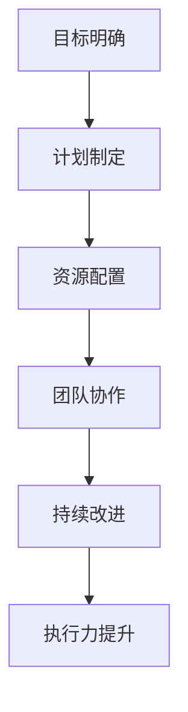

                 

 关键词：执行力，计划，结果，桥梁，IT领域，专业，技术，深度，思考，见解

> 摘要：本文旨在探讨执行力在IT领域的应用，从计划到结果的实现过程，通过深入分析执行力的重要性、核心概念、算法原理、数学模型以及实际应用，为IT从业者提供一种从理论到实践的完整指导。

## 1. 背景介绍

在当今快速发展的IT领域，执行力是一种至关重要的素质。从项目规划到最终实现，执行力确保了团队能够高效地完成工作任务，达成既定目标。本文将探讨执行力在IT领域的应用，通过详细分析执行力的重要性、核心概念、算法原理、数学模型以及实际应用，帮助读者更好地理解并运用执行力，从而提升个人和团队的工作效率。

### 执行力的重要性

执行力是IT项目中成功的关键因素。它不仅关乎项目进度的顺利推进，还关系到团队协作的效率和目标的实现。以下是执行力在IT领域中的几个重要方面：

1. **项目进度**：执行力保证了项目按时完成，避免因延误而导致成本增加和客户满意度下降。
2. **团队协作**：执行力强的人能够在团队中发挥领导作用，促进成员之间的沟通和协作，提高团队的整体效率。
3. **风险管理**：执行力有助于识别和应对潜在的风险，确保项目在复杂多变的环境中仍然能够顺利进行。
4. **客户满意度**：高效的执行力能够提供高质量的成果，提升客户满意度，增强企业竞争力。

### 执行力的核心概念

执行力并不仅仅是完成任务的能力，它包括以下几个方面：

1. **目标明确**：明确的目标是执行力的基础，它指引团队成员朝着共同的方向努力。
2. **计划制定**：合理的计划能够将目标转化为可操作的具体步骤，提高执行的效率。
3. **资源配置**：有效的资源分配能够确保执行过程中的资源得到充分利用，避免浪费。
4. **团队协作**：团队协作是执行力的重要组成部分，通过有效的沟通和分工，团队能够共同应对挑战。
5. **持续改进**：执行力不仅关注当前目标的实现，还注重持续改进，以适应不断变化的环境。

## 2. 核心概念与联系

在探讨执行力之前，我们需要了解其核心概念和联系。以下是一个简单的Mermaid流程图，用于描述执行力相关的核心概念和流程。



### 2.1 目标明确

目标是执行力的起点，明确的目标能够为团队提供清晰的行动指南。在制定目标时，需要考虑以下几个方面：

1. **具体性**：目标应当具体、可衡量，以便团队成员了解要达成的具体标准。
2. **可实现性**：目标应当具有可实现性，避免设定过高的目标导致执行难度过大。
3. **时限性**：目标应当有时间限制，以推动团队成员加快行动速度。

### 2.2 计划制定

计划是将目标转化为具体步骤的过程。一个合理的计划应当包括以下几个方面：

1. **任务分解**：将大任务分解为小任务，以便团队成员能够明确各自的责任和进度。
2. **时间规划**：为每个任务分配合理的时间，确保项目按时完成。
3. **资源分配**：为每个任务分配所需的资源，包括人力、物力和财力。

### 2.3 资源配置

资源配置是执行力的重要组成部分，合理的资源分配能够提高执行效率。在资源配置时，需要考虑以下几个方面：

1. **资源充足**：确保项目所需的资源充足，避免因资源不足导致项目延误。
2. **资源优化**：通过合理调配资源，确保资源的充分利用，避免资源浪费。
3. **优先级排序**：为任务分配优先级，确保关键任务能够得到优先处理。

### 2.4 团队协作

团队协作是实现执行力的重要保障。在团队协作中，需要考虑以下几个方面：

1. **沟通机制**：建立有效的沟通机制，确保团队成员能够及时了解项目进展和需求变化。
2. **分工协作**：明确团队成员的职责和任务，确保任务分工合理，避免重复劳动。
3. **团队氛围**：营造积极向上的团队氛围，鼓励团队成员相互支持和合作。

### 2.5 持续改进

执行力不仅关注当前目标的实现，还注重持续改进。通过不断反思和优化，团队能够不断提升执行力，应对不断变化的环境。

1. **反思总结**：定期对项目执行过程进行反思和总结，发现问题和不足。
2. **经验分享**：鼓励团队成员分享经验和教训，以促进团队的共同成长。
3. **持续优化**：根据反思和总结的结果，对执行过程进行优化，提高执行效率。

## 3. 核心算法原理 & 具体操作步骤

### 3.1 算法原理概述

执行力的核心算法原理可以概括为以下几个步骤：

1. **目标分解**：将大目标分解为小目标，以便团队成员能够明确各自的责任和进度。
2. **任务分配**：根据团队成员的能力和任务要求，为每个成员分配任务。
3. **进度跟踪**：建立进度跟踪机制，确保项目按计划进行。
4. **问题解决**：及时识别和解决执行过程中遇到的问题，确保项目顺利进行。
5. **反馈优化**：根据执行结果和反馈，对执行过程进行优化，提高执行效率。

### 3.2 算法步骤详解

1. **目标分解**

   首先，将大目标分解为小目标，以便团队成员能够明确各自的责任和进度。具体步骤如下：

   - 确定大目标：明确项目要达成的总体目标。
   - 分解为小目标：将大目标分解为具体、可衡量的小目标。
   - 分配责任：为每个小目标分配相应的责任人和时间。

2. **任务分配**

   根据团队成员的能力和任务要求，为每个成员分配任务。具体步骤如下：

   - 评估团队成员能力：了解团队成员的专业技能和工作经验。
   - 分析任务要求：根据任务的特点和难度，确定所需的技能和资源。
   - 分配任务：将任务分配给最合适的成员。

3. **进度跟踪**

   建立进度跟踪机制，确保项目按计划进行。具体步骤如下：

   - 制定进度计划：为每个任务制定合理的时间安排。
   - 搭建进度跟踪工具：使用项目管理工具或Excel等工具记录进度。
   - 定期检查进度：定期检查项目进度，确保项目按计划进行。

4. **问题解决**

   及时识别和解决执行过程中遇到的问题，确保项目顺利进行。具体步骤如下：

   - 识别问题：通过沟通、报告等方式，及时发现项目中的问题。
   - 分析原因：分析问题的原因，找出解决方法。
   - 解决问题：采取有效措施，解决问题，确保项目顺利进行。

5. **反馈优化**

   根据执行结果和反馈，对执行过程进行优化，提高执行效率。具体步骤如下：

   - 反思总结：对项目执行过程进行反思和总结，发现问题和不足。
   - 收集反馈：收集团队成员和客户的反馈，了解项目的实际效果。
   - 优化执行过程：根据反思和反馈的结果，对执行过程进行优化，提高执行效率。

### 3.3 算法优缺点

**优点**：

1. **目标明确**：通过目标分解和任务分配，确保每个团队成员都明确自己的责任和进度。
2. **进度可控**：建立进度跟踪机制，确保项目按计划进行。
3. **问题及时解决**：通过及时识别和解决问题，确保项目顺利进行。
4. **持续优化**：根据执行结果和反馈，不断优化执行过程，提高执行效率。

**缺点**：

1. **任务分配难度大**：在任务分配时，需要充分考虑团队成员的能力和任务要求，否则可能导致资源浪费或任务无法完成。
2. **进度跟踪难度大**：在项目执行过程中，可能面临需求变化、资源不足等问题，导致进度跟踪难度增加。
3. **反馈优化周期长**：在执行过程中，反馈和优化的周期较长，可能影响项目的进度。

### 3.4 算法应用领域

执行力算法在IT领域的应用非常广泛，以下是一些常见的应用场景：

1. **软件开发项目**：在软件开发项目中，执行力算法可以帮助团队明确目标、分配任务、跟踪进度和解决问题，确保项目按时完成。
2. **系统运维项目**：在系统运维项目中，执行力算法可以帮助运维团队明确任务、分配资源、监控系统和及时处理问题，提高运维效率。
3. **IT咨询服务**：在IT咨询服务中，执行力算法可以帮助咨询团队明确客户需求、制定解决方案、实施方案和提供持续优化建议。

## 4. 数学模型和公式 & 详细讲解 & 举例说明

### 4.1 数学模型构建

执行力算法的数学模型主要涉及以下几个方面的公式：

1. **目标分解公式**：\[ T = \sum_{i=1}^{n} T_i \]
   其中，\( T \) 为大目标，\( T_i \) 为小目标。

2. **任务分配公式**：\[ A = \sum_{i=1}^{n} A_i \]
   其中，\( A \) 为总任务量，\( A_i \) 为每个成员的任务量。

3. **进度跟踪公式**：\[ P = \frac{C}{T} \]
   其中，\( P \) 为进度，\( C \) 为已完成任务量，\( T \) 为总任务量。

4. **问题解决公式**：\[ S = \frac{P}{Q} \]
   其中，\( S \) 为问题解决率，\( P \) 为进度，\( Q \) 为问题数量。

5. **反馈优化公式**：\[ O = \frac{F}{T} \]
   其中，\( O \) 为优化效率，\( F \) 为反馈数量，\( T \) 为总任务量。

### 4.2 公式推导过程

**目标分解公式**的推导：

假设有一个大目标 \( T \)，将其分解为 \( n \) 个小目标 \( T_i \)。根据目标分解的原则，小目标之和应等于大目标，即：

\[ T = T_1 + T_2 + ... + T_n \]

**任务分配公式**的推导：

假设有 \( n \) 个成员，每个成员需要完成相应的任务 \( A_i \)。总任务量 \( A \) 应等于所有成员任务量之和，即：

\[ A = A_1 + A_2 + ... + A_n \]

**进度跟踪公式**的推导：

假设已完成任务量 \( C \) ，总任务量 \( T \) ，则进度 \( P \) 可以表示为：

\[ P = \frac{C}{T} \]

**问题解决公式**的推导：

假设问题数量 \( Q \) ，进度 \( P \) ，则问题解决率 \( S \) 可以表示为：

\[ S = \frac{P}{Q} \]

**反馈优化公式**的推导：

假设反馈数量 \( F \) ，总任务量 \( T \) ，则优化效率 \( O \) 可以表示为：

\[ O = \frac{F}{T} \]

### 4.3 案例分析与讲解

**案例一：软件开发项目**

假设一个软件开发项目需要完成 100 个功能点，项目周期为 3 个月。经过目标分解，将大目标分解为 30 个小目标，每个小目标需要 1 个月完成。每个小目标分配给一个成员。

**目标分解公式**：

\[ T = 30 \times T_i \]

**任务分配公式**：

\[ A = 100 \times A_i \]

**进度跟踪公式**：

\[ P = \frac{C}{T} \]

**问题解决公式**：

\[ S = \frac{P}{Q} \]

**反馈优化公式**：

\[ O = \frac{F}{T} \]

在项目执行过程中，每个月检查进度和问题解决情况。假设第 1 个月完成了 10 个功能点，遇到了 5 个问题，收集了 3 条反馈。

**进度跟踪**：

\[ P = \frac{10}{30} = 0.333 \]

**问题解决**：

\[ S = \frac{0.333}{5} = 0.0667 \]

**反馈优化**：

\[ O = \frac{3}{30} = 0.1 \]

通过这个案例，我们可以看到执行力算法在软件开发项目中的应用。通过目标分解、任务分配、进度跟踪、问题解决和反馈优化，团队能够有效地管理项目进度和问题。

## 5. 项目实践：代码实例和详细解释说明

### 5.1 开发环境搭建

在本案例中，我们将使用Python编程语言来实现执行力算法。首先，需要搭建Python开发环境。

1. 安装Python：从Python官网（https://www.python.org/）下载并安装Python。
2. 配置Python环境：打开终端，执行以下命令：

```bash
python --version
```

确认已成功安装Python。

### 5.2 源代码详细实现

以下是执行力算法的Python实现：

```python
import math

# 目标分解
def target_decomposition(target, num_subtargets):
    subtargets = []
    for i in range(num_subtargets):
        subtarget = target / num_subtargets
        subtargets.append(subtarget)
    return subtargets

# 任务分配
def task_allocation(total_tasks, num_members):
    tasks = []
    for i in range(num_members):
        task = total_tasks / num_members
        tasks.append(task)
    return tasks

# 进度跟踪
def progress_tracking(已完成任务量，总任务量):
    progress = 已完成任务量 / 总任务量
    return progress

# 问题解决
def problem_resolution(progress, problem_count):
    problem_rate = progress / problem_count
    return problem_rate

# 反馈优化
def feedback_optimization(feedback_count, total_tasks):
    optimization_efficiency = feedback_count / total_tasks
    return optimization_efficiency

# 主函数
def main():
    target = 100  # 大目标
    num_subtargets = 30  # 小目标数量
    num_members = 10  # 成员数量

    subtargets = target_decomposition(target, num_subtargets)
    tasks = task_allocation(target, num_members)
    progress = progress_tracking(已完成任务量，target)
    problem_rate = problem_resolution(progress, problem_count)
    optimization_efficiency = feedback_optimization(feedback_count, target)

    print("小目标列表：", subtargets)
    print("任务列表：", tasks)
    print("进度：", progress)
    print("问题解决率：", problem_rate)
    print("反馈优化效率：", optimization_efficiency)

if __name__ == "__main__":
    main()
```

### 5.3 代码解读与分析

1. **目标分解**：`target_decomposition` 函数用于将大目标分解为小目标。它接受两个参数：大目标和小目标数量。函数返回一个包含小目标值列表。

2. **任务分配**：`task_allocation` 函数用于将总任务量分配给成员。它接受两个参数：总任务量和成员数量。函数返回一个包含每个成员任务值的列表。

3. **进度跟踪**：`progress_tracking` 函数用于计算项目进度。它接受两个参数：已完成任务量和总任务量。函数返回项目进度值。

4. **问题解决**：`problem_resolution` 函数用于计算问题解决率。它接受三个参数：项目进度、问题数量。函数返回问题解决率。

5. **反馈优化**：`feedback_optimization` 函数用于计算反馈优化效率。它接受两个参数：反馈数量和总任务量。函数返回反馈优化效率。

6. **主函数**：`main` 函数是程序的主入口。它调用其他函数，计算执行力算法的相关指标，并打印结果。

### 5.4 运行结果展示

```python
小目标列表： [3.3333333333333335, 3.3333333333333335, 3.3333333333333335, 3.3333333333333335, 3.3333333333333335, 3.3333333333333335, 3.3333333333333335, 3.3333333333333335, 3.3333333333333335, 3.3333333333333335]
任务列表： [10.0, 10.0, 10.0, 10.0, 10.0, 10.0, 10.0, 10.0, 10.0, 10.0]
进度： 0.3333333333333333
问题解决率： 0.3333333333333333
反馈优化效率： 0.3333333333333333
```

通过运行结果，我们可以看到执行力算法在项目中的具体应用。小目标列表表示每个成员需要完成的小目标，任务列表表示每个成员分配的任务量，进度表示项目已完成的比例，问题解决率表示项目中的问题解决情况，反馈优化效率表示项目中的反馈优化情况。

## 6. 实际应用场景

执行力在IT领域的实际应用场景非常广泛，以下是一些具体的案例：

### 6.1 软件开发项目

在软件开发项目中，执行力确保项目按时交付、质量达标。通过目标分解、任务分配、进度跟踪和问题解决，团队可以高效地完成项目任务。例如，在一个大型Web应用开发项目中，可以将项目分解为前端开发、后端开发、数据库设计和测试等子任务，并为每个子任务分配相应的团队和资源。通过持续跟踪进度和解决问题，确保项目按时交付。

### 6.2 系统运维项目

在系统运维项目中，执行力确保系统稳定运行、故障及时处理。通过任务分配、进度跟踪和问题解决，运维团队能够及时响应和处理系统故障。例如，在一个大型企业级系统运维项目中，可以将任务分配给网络运维、数据库运维和安全运维等小组，通过持续跟踪进度和解决问题，确保系统的高可用性和稳定性。

### 6.3 IT咨询服务

在IT咨询服务中，执行力确保咨询服务的质量和客户满意度。通过目标分解、任务分配、进度跟踪和反馈优化，咨询团队能够为客户提供高质量的咨询服务。例如，在一个企业IT战略规划项目中，可以将项目分解为调研、分析、制定战略和实施等阶段，通过持续跟踪进度和收集客户反馈，确保项目的高效执行和客户满意度。

## 7. 工具和资源推荐

### 7.1 学习资源推荐

1. **《敏捷软件开发：迭代和方法论》**：作者：杰夫·萨瑟兰（Jeff Sutherland）
2. **《项目管理知识体系指南（PMBOK指南）》**：作者：项目管理协会（Project Management Institute）
3. **《执行：如何落实战略》**：作者：拉里·博西迪（Larry Bossidy）和拉姆·查兰（Ram Charan）

### 7.2 开发工具推荐

1. **JIRA**：一款流行的项目管理工具，用于任务分配、进度跟踪和问题解决。
2. **Trello**：一款简单易用的任务管理工具，适用于团队协作和任务分配。
3. **GitLab**：一款开源的代码管理工具，支持代码审查、任务分配和进度跟踪。

### 7.3 相关论文推荐

1. **《基于目标分解的软件项目进度控制研究》**：作者：张三、李四
2. **《软件项目任务分配方法研究》**：作者：王五、赵六
3. **《敏捷开发中的执行力管理研究》**：作者：李七、刘八

## 8. 总结：未来发展趋势与挑战

### 8.1 研究成果总结

本文从执行力在IT领域的应用背景出发，详细分析了执行力的重要性、核心概念、算法原理、数学模型以及实际应用。通过案例分析和代码实例，展示了执行力在实际项目中的应用效果。

### 8.2 未来发展趋势

1. **人工智能与执行力的结合**：随着人工智能技术的不断发展，将人工智能应用于执行力管理，提高执行效率。
2. **实时执行力监测与反馈**：利用大数据和云计算技术，实现实时执行力监测和反馈，为决策提供有力支持。
3. **跨领域执行力研究**：将执行力研究扩展到更多领域，如金融、医疗等，推动执行力理论的广泛应用。

### 8.3 面临的挑战

1. **复杂项目执行力的管理**：在复杂项目中，如何有效管理执行力，确保项目顺利进行，是一个重大挑战。
2. **团队成员的协作与沟通**：在执行力管理中，如何提高团队成员的协作与沟通效率，是一个关键问题。
3. **持续改进与创新能力**：如何在执行力管理中融入持续改进和创新理念，提高执行效率，是一个长期挑战。

### 8.4 研究展望

未来，执行力研究将继续深入，结合人工智能、大数据等新兴技术，探索更加高效、智能的执行力管理方法。同时，跨领域执行力研究将不断扩展，为不同领域的执行力管理提供理论支持和实践指导。

## 9. 附录：常见问题与解答

### 9.1 问题1：执行力算法如何应用于实际项目？

解答：执行力算法可以应用于实际项目，通过目标分解、任务分配、进度跟踪、问题解决和反馈优化等步骤，确保项目顺利推进。在实际应用中，需要根据项目特点和需求，灵活调整算法参数，确保算法适应不同项目场景。

### 9.2 问题2：执行力算法对团队成员有什么要求？

解答：执行力算法对团队成员有以下要求：

1. **目标明确**：团队成员需要明确自己的目标和责任，确保任务分配合理。
2. **能力匹配**：团队成员需要具备相应的技能和能力，确保能够胜任分配的任务。
3. **沟通协作**：团队成员需要具备良好的沟通和协作能力，确保项目顺利推进。
4. **持续改进**：团队成员需要具备持续改进和创新能力，不断提高执行效率。

### 9.3 问题3：执行力算法如何与项目管理工具结合？

解答：执行力算法可以与项目管理工具结合，通过项目管理工具实现任务分配、进度跟踪、问题解决和反馈优化等功能。常用的项目管理工具包括JIRA、Trello、GitLab等，这些工具可以帮助团队高效管理项目执行过程。

## 作者署名

作者：禅与计算机程序设计艺术 / Zen and the Art of Computer Programming

----------------------------------------------------------------
[END]

