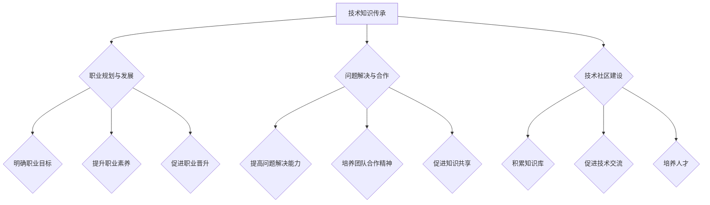

                 

 关键词：
技术培训、知识传承、影响力、收益分析、职业发展、技术社区

> 摘要：
本文旨在探讨技术mentoring（技术辅导）这一重要教育模式在信息技术行业中的重要性。通过分析技术mentoring的核心概念、影响力与收益，本文将揭示其在个人职业发展和技术社区中的价值，并提供实际应用案例，旨在为技术导师和 mentee 提供有价值的指导和参考。

## 1. 背景介绍

技术mentoring，亦称为技术辅导，是一种通过经验丰富的专业人士对新手或缺乏经验的技术人员提供指导和支持的教育模式。这一概念源于传统行业中的导师制度，但随着信息技术的发展，技术mentoring逐渐成为信息技术行业中的一个重要组成部分。技术mentoring不仅有助于知识的传承，还能够促进技术人才的培养和成长。

在信息技术领域，技术mentoring的重要性体现在多个方面。首先，它能够帮助新手技术人员更快地掌握技术知识和技能，缩短学习曲线。其次，技术mentoring能够促进团队成员之间的合作和交流，增强团队凝聚力。此外，技术mentoring还能够帮助技术社区的发展，通过知识的共享和传递，提升整体技术水平。

本文将围绕技术mentoring的核心概念、影响力与收益，以及实际应用场景展开讨论，旨在为技术导师和 mentee 提供有价值的指导和参考。

### 1.1 技术mentoring的定义

技术mentoring是一种通过一对一或一对多的方式，由经验丰富的技术专家对新手或缺乏经验的技术人员提供指导和支持的教育模式。这种指导不仅包括技术知识的学习，还涵盖了职业规划、问题解决、团队合作等多个方面。

技术mentoring的定义可以从以下几个方面进行理解：

- **技术方面**：技术mentoring关注的是技术知识和技能的传授。导师通常会根据自己的经验和专业知识，为 mentee 提供针对性的学习资源、实践机会和解决方案。

- **职业发展**：技术mentoring不仅仅局限于技术层面的指导，还关注 mentee 的职业发展。导师会帮助 mentee 分析职业规划，提供职业建议和资源，甚至参与到 mentee 的职业晋升过程中。

- **问题解决**：在技术mentoring过程中，导师会与 mentee 共同面对和解决问题。这种互动有助于 mentee 培养独立解决问题的能力，提高技术实践能力。

- **团队合作**：技术mentoring强调团队合作的重要性。导师会通过模拟实际工作场景，帮助 mentee 培养团队合作精神和沟通能力。

### 1.2 技术mentoring的重要性

技术mentoring在信息技术行业中的重要性不可忽视。首先，它有助于知识的传承。随着技术的不断更新和迭代，技术知识也呈爆炸式增长。导师通过自己的经验和知识，帮助 mentee 快速掌握新技术，从而实现知识的传承。

其次，技术mentoring有助于技术人才的培养。在快速发展的信息技术行业，技术人才的需求日益增长。通过技术mentoring，企业能够快速培养出合格的技术人才，满足业务发展的需求。

此外，技术mentoring还能够促进团队成员之间的合作和交流。在技术mentoring过程中，导师和 mentee 之间的互动有助于团队成员之间建立信任和合作关系，提高团队的整体绩效。

最后，技术mentoring有助于技术社区的发展。通过技术知识的共享和传递，技术社区能够不断积累和更新知识库，提升整体技术水平。

### 1.3 技术mentoring的现状

目前，技术mentoring在信息技术行业中已经得到了广泛的关注和应用。许多企业和组织都开始重视技术mentoring的作用，并采取了一系列措施来推动技术mentoring的实施。

例如，一些大型科技公司如谷歌、微软等，设立了内部的技术导师计划，鼓励员工参与技术mentoring。此外，一些技术社区和组织如 GitHub、Stack Overflow 等，也提供了平台和资源，方便技术导师和 mentee 之间的互动和交流。

总的来说，技术mentoring在信息技术行业中的现状是积极的，但它仍然面临一些挑战。例如，如何确保技术导师的质量和有效性，如何吸引更多的 mentee 参与到技术mentoring中来，都是需要进一步探讨和解决的问题。

## 2. 核心概念与联系

为了更好地理解技术mentoring的内涵和作用，我们首先需要明确其核心概念，并探讨这些概念之间的联系。

### 2.1 技术知识传承

技术知识传承是技术mentoring的核心概念之一。随着信息技术的发展，技术知识呈现出快速迭代和更新的特点。经验丰富的技术专家通过技术mentoring，将自己的经验和知识传授给新手或缺乏经验的技术人员，从而实现知识的传承。

技术知识传承的重要性体现在以下几个方面：

- **提升技术水平**：通过传承技术知识，新手技术人员能够更快地掌握核心技术，提高技术水平。
- **促进团队协作**：团队成员之间的技术知识传承，有助于提高团队的协作效率，促进团队整体发展。
- **积累知识库**：技术知识的积累和更新是技术社区持续发展的重要基础。技术mentoring有助于技术社区的长期繁荣。

### 2.2 职业规划与发展

职业规划与发展是技术mentoring的另一个核心概念。技术导师通过经验分享和指导，帮助 mentee 制定合理的职业规划，明确职业目标，并提供实现目标的路径和方法。

职业规划与发展的重要性体现在以下几个方面：

- **明确职业目标**：通过职业规划，技术人员能够明确自己的职业方向和发展目标，避免盲目发展。
- **提升职业素养**：技术导师在职业规划过程中，会教授 mentee 如何提升职业素养，包括沟通技巧、团队合作、时间管理等方面。
- **促进职业晋升**：技术导师的经验和指导有助于 mentee 在职业生涯中实现晋升，提高个人竞争力。

### 2.3 问题解决与合作

问题解决与合作是技术mentoring过程中的重要环节。在技术实践过程中，技术人员难免会遇到各种问题和挑战。技术导师通过指导 mentee 解决这些问题，不仅能够提高 mentee 的技术能力，还能够培养 mentee 的团队合作精神。

问题解决与合作的重要性体现在以下几个方面：

- **提高问题解决能力**：技术导师通过实际案例和指导，帮助 mentee 提高问题解决能力，培养独立解决问题的习惯。
- **培养团队合作精神**：在解决实际问题的过程中，技术导师会引导 mentee 学会与他人合作，提高团队合作效率。
- **促进知识共享**：通过团队合作解决问题，技术人员能够实现知识共享和传递，提高整体技术水平。

### 2.4 技术社区建设

技术社区建设是技术mentoring的重要延伸。技术导师通过技术mentoring，不仅能够帮助 mentee 提高个人技术水平，还能够促进技术社区的建设和发展。

技术社区建设的重要性体现在以下几个方面：

- **积累知识库**：技术社区是技术人员交流和分享知识的重要平台。通过技术mentoring，技术社区能够不断积累和更新知识库，提升整体技术水平。
- **促进技术交流**：技术社区为技术人员提供了交流和学习的平台，有助于技术的普及和推广。
- **培养人才**：技术社区通过技术mentoring，能够发现和培养更多的技术人才，推动技术社区的发展。

### 2.5 Mermaid 流程图

以下是一个描述技术mentoring核心概念和联系关系的 Mermaid 流程图：



## 3. 核心算法原理 & 具体操作步骤

### 3.1 算法原理概述

技术mentoring的核心算法原理可以概括为：经验传递、知识共享和反馈优化。这一算法通过以下步骤实现：

1. **经验传递**：导师将自己的技术经验和职业经验传授给 mentee，帮助 mentee 快速积累知识。
2. **知识共享**：导师和 mentee 在技术问题和职业规划上进行深入交流，实现知识共享和碰撞。
3. **反馈优化**：导师根据 mentee 的学习进度和反馈，不断调整指导策略，优化 mentee 的学习效果。

### 3.2 算法步骤详解

1. **建立联系**：技术导师和 mentee 首先需要建立联系，可以通过线上或线下方式进行沟通。
2. **确定目标**：导师和 mentee 需要明确 mentee 的学习目标和职业规划，确保指导的方向一致。
3. **经验传递**：导师根据自己的经验，为 mentee 提供技术指导和建议，帮助 mentee 解决实际问题。
4. **知识共享**：导师和 mentee 在技术问题和职业规划上进行深入交流，实现知识共享和碰撞。
5. **反馈优化**：导师根据 mentee 的学习进度和反馈，不断调整指导策略，优化 mentee 的学习效果。

### 3.3 算法优缺点

**优点**：

- **快速提升技术水平**：通过技术导师的指导，mentee 能够更快地掌握核心技术，提升技术水平。
- **培养职业素养**：技术导师在指导过程中，会教授 mentee 职业素养，提高个人竞争力。
- **促进知识共享**：技术导师和 mentee 之间的交流，有助于知识的共享和碰撞，提高整体技术水平。

**缺点**：

- **导师资源有限**：高质量的技术导师资源相对有限，可能导致 mentee 的指导需求无法得到满足。
- **时间成本较高**：技术导师需要投入大量的时间和精力进行指导，对导师的个人时间和精力有一定要求。

### 3.4 算法应用领域

技术mentoring算法主要应用于以下领域：

- **企业内部培训**：企业可以通过技术mentoring，快速培养出符合岗位要求的技术人才。
- **高校教学**：高校可以通过技术mentoring，提升学生的实践能力和职业素养。
- **技术社区**：技术社区可以通过技术mentoring，培养更多的技术人才，推动社区发展。

## 4. 数学模型和公式 & 详细讲解 & 举例说明

### 4.1 数学模型构建

技术mentoring的数学模型可以构建为以下三个主要组成部分：经验传递模型、知识共享模型和反馈优化模型。

**经验传递模型**：

假设导师的经验值为 \(E_d\)，mentee 的初始经验值为 \(E_m\)，经验传递系数为 \(k\)。则 mentee 在接受导师指导后的经验值为：

\[ E_m' = E_m + k(E_d - E_m) \]

**知识共享模型**：

假设导师的知识值为 \(K_d\)，mentee 的初始知识值为 \(K_m\)，知识共享系数为 \(l\)。则 mentee 在接受导师指导后的知识值为：

\[ K_m' = K_m + l(K_d - K_m) \]

**反馈优化模型**：

假设导师的指导效果评估值为 \(R_d\)，mentee 的初始反馈值为 \(R_m\)，反馈优化系数为 \(m\)。则 mentee 在接受导师指导后的反馈值为：

\[ R_m' = R_m + m(R_d - R_m) \]

### 4.2 公式推导过程

**经验传递模型推导**：

经验传递模型基于导师和 mentee 的经验值差异进行计算。假设导师的经验值高于 mentee 的经验值，经验传递系数 \(k\) 用于衡量导师经验对 mentee 的传递效果。则 mentee 在接受导师指导后的经验值可以表示为：

\[ E_m' = E_m + k(E_d - E_m) \]

其中，\(E_d - E_m\) 表示导师经验值与 mentee 初始经验值的差异，\(k\) 用于放大或缩小这种差异，从而实现经验的传递。

**知识共享模型推导**：

知识共享模型与经验传递模型类似，基于导师和 mentee 的知识值差异进行计算。假设导师的知识值高于 mentee 的知识值，知识共享系数 \(l\) 用于衡量导师知识对 mentee 的传递效果。则 mentee 在接受导师指导后的知识值可以表示为：

\[ K_m' = K_m + l(K_d - K_m) \]

其中，\(K_d - K_m\) 表示导师知识值与 mentee 初始知识值的差异，\(l\) 用于放大或缩小这种差异，从而实现知识的传递。

**反馈优化模型推导**：

反馈优化模型基于导师和 mentee 的反馈值差异进行计算。假设导师的指导效果评估值高于 mentee 的初始反馈值，反馈优化系数 \(m\) 用于衡量导师反馈对 mentee 的优化效果。则 mentee 在接受导师指导后的反馈值可以表示为：

\[ R_m' = R_m + m(R_d - R_m) \]

其中，\(R_d - R_m\) 表示导师指导效果评估值与 mentee 初始反馈值的差异，\(m\) 用于放大或缩小这种差异，从而实现反馈的优化。

### 4.3 案例分析与讲解

**案例**：假设导师的经验值为 10，mentee 的初始经验值为 5。导师的经验传递系数为 0.5。则 mentee 在接受导师指导后的经验值为：

\[ E_m' = 5 + 0.5(10 - 5) = 7.5 \]

**案例**：假设导师的知识值为 20，mentee 的初始知识值为 10。导师的知识共享系数为 0.3。则 mentee 在接受导师指导后的知识值为：

\[ K_m' = 10 + 0.3(20 - 10) = 13 \]

**案例**：假设导师的指导效果评估值为 15，mentee 的初始反馈值为 10。导师的反馈优化系数为 0.4。则 mentee 在接受导师指导后的反馈值为：

\[ R_m' = 10 + 0.4(15 - 10) = 12 \]

通过以上案例，我们可以看到，数学模型在技术mentoring过程中起到了重要的作用。它不仅帮助我们量化了经验传递、知识共享和反馈优化的效果，还能够根据实际情况调整模型参数，实现更精准的指导。

## 5. 项目实践：代码实例和详细解释说明

### 5.1 开发环境搭建

在开始技术mentoring项目实践之前，我们需要搭建一个合适的技术环境。以下是一个简单的开发环境搭建步骤：

1. **安装 Python 解释器**：Python 是一种广泛使用的编程语言，适用于技术mentoring项目。首先，我们需要在开发计算机上安装 Python 解释器。
2. **配置虚拟环境**：为了确保项目的稳定性，我们建议使用虚拟环境进行开发。虚拟环境可以隔离项目依赖，避免不同项目之间的依赖冲突。
3. **安装依赖库**：根据项目需求，我们需要安装相应的依赖库。例如，对于技术mentoring项目，我们可以使用 Flask 框架来搭建 Web 应用。

### 5.2 源代码详细实现

以下是一个简单的技术mentoring项目的源代码示例，包括导师和 mentee 的注册、登录、以及辅导交流功能。

```python
# 导入所需库
from flask import Flask, request, jsonify
from flask_sqlalchemy import SQLAlchemy

# 初始化 Flask 应用
app = Flask(__name__)
app.config['SQLALCHEMY_DATABASE_URI'] = 'sqlite:///mentoring.db'
db = SQLAlchemy(app)

# 创建用户模型
class User(db.Model):
    id = db.Column(db.Integer, primary_key=True)
    username = db.Column(db.String(80), unique=True, nullable=False)
    password = db.Column(db.String(120), nullable=False)
    role = db.Column(db.String(10), nullable=False)

# 创建导师和 mentee 的关系
class Mentoring(db.Model):
    id = db.Column(db.Integer, primary_key=True)
    mentor_id = db.Column(db.Integer, db.ForeignKey('user.id'), nullable=False)
    mentee_id = db.Column(db.Integer, db.ForeignKey('user.id'), nullable=False)
    status = db.Column(db.String(10), nullable=False)

# 登录接口
@app.route('/login', methods=['POST'])
def login():
    username = request.form['username']
    password = request.form['password']
    user = User.query.filter_by(username=username, password=password).first()
    if user:
        return jsonify({'status': 'success', 'role': user.role})
    else:
        return jsonify({'status': 'failure'})

# 注册接口
@app.route('/register', methods=['POST'])
def register():
    username = request.form['username']
    password = request.form['password']
    role = request.form['role']
    new_user = User(username=username, password=password, role=role)
    db.session.add(new_user)
    db.session.commit()
    return jsonify({'status': 'success'})

# 导师和 mentee 交流接口
@app.route('/chat', methods=['POST'])
def chat():
    mentor_id = request.form['mentor_id']
    mentee_id = request.form['mentee_id']
    content = request.form['content']
    mentoring = Mentoring(mentor_id=mentor_id, mentee_id=mentee_id, status='active', content=content)
    db.session.add(mentoring)
    db.session.commit()
    return jsonify({'status': 'success'})

# 运行应用
if __name__ == '__main__':
    db.create_all()
    app.run(debug=True)
```

### 5.3 代码解读与分析

1. **用户模型（User）**：用户模型用于存储用户信息，包括用户名、密码和角色。用户角色分为导师和 mentee。
2. **导师和 mentee 关系模型（Mentoring）**：导师和 mentee 关系模型用于存储导师和 mentee 的交流记录，包括导师 ID、mentee ID、状态和交流内容。
3. **登录接口（/login）**：登录接口用于验证用户名和密码，返回登录状态和用户角色。
4. **注册接口（/register）**：注册接口用于注册新用户，存储用户信息。
5. **导师和 mentee 交流接口（/chat）**：导师和 mentee 交流接口用于创建新的交流记录，存储交流内容。

### 5.4 运行结果展示

1. **注册新用户**：

```bash
$ curl -X POST -d "username=test_mentor&password=123456&role=mentor" http://localhost:5000/register
{"status": "success"}

$ curl -X POST -d "username=test_mentee&password=123456&role=mentee" http://localhost:5000/register
{"status": "success"}
```

2. **登录用户**：

```bash
$ curl -X POST -d "username=test_mentor&password=123456" http://localhost:5000/login
{"status": "success", "role": "mentor"}

$ curl -X POST -d "username=test_mentee&password=123456" http://localhost:5000/login
{"status": "success", "role": "mentee"}
```

3. **创建交流记录**：

```bash
$ curl -X POST -d "mentor_id=1&mentee_id=2&content=Hello, mentee!" http://localhost:5000/chat
{"status": "success"}
```

通过以上代码和运行结果，我们可以看到技术mentoring项目的实现过程。这个项目提供了一个简单的 Web 应用，用于实现导师和 mentee 的注册、登录以及交流功能。实际应用中，我们可以根据需求进一步扩展和优化这个项目。

## 6. 实际应用场景

技术mentoring在信息技术行业中具有广泛的应用场景，以下是几个典型的实际应用场景：

### 6.1 企业内部培训

企业内部培训是技术mentoring最常见的应用场景之一。企业通过技术mentoring，为员工提供技术指导和职业发展支持，提升员工的技能和职业素养。例如，一家大型互联网公司可以为新入职的程序员提供技术导师，帮助他们快速掌握公司内部的技术栈，提高编程能力和解决问题的能力。

### 6.2 高校教学

高校教学也是技术mentoring的重要应用场景。高校可以通过技术mentoring，为学生提供实践机会和职业发展指导。例如，一所计算机科学学院可以为本科和研究生学生配备技术导师，指导他们进行课程设计和毕业设计，同时提供职业规划和求职指导。

### 6.3 技术社区

技术社区通过技术mentoring，可以培养更多的技术人才，推动技术社区的繁荣发展。技术导师可以在线上平台为新手技术人员提供指导和支持，帮助他们解决技术难题，提高编程能力。例如，GitHub 和 Stack Overflow 等技术社区，通过技术mentoring，吸引了大量的技术导师和 mentee，促进了技术社区的活跃和发展。

### 6.4 政府和公益项目

政府和公益项目也可以利用技术mentoring，推动技术教育和职业培训。例如，一些发展中国家可以通过技术mentoring，为当地的年轻技术人员提供培训和支持，帮助他们掌握现代信息技术，提高就业竞争力。此外，一些公益组织也可以利用技术mentoring，为贫困地区的孩子提供免费的技术教育，帮助他们实现自我发展。

### 6.5 远程工作

随着远程工作的普及，技术mentoring在远程工作中的应用也越来越广泛。远程工作的特性使得技术导师和 mentee 可以跨越地域限制，通过线上平台进行交流和学习。例如，一些跨国公司可以为全球的员工提供技术mentoring，帮助他们适应不同国家和地区的业务需求，提高工作效率。

### 6.6 持续学习

技术mentoring不仅适用于新手技术人员，还可以帮助有经验的技术人员持续学习和发展。通过技术mentoring，技术人员可以与导师进行深入的交流和探讨，了解最新的技术动态和行业趋势，不断提高自己的技术能力和职业素养。

总之，技术mentoring在信息技术行业中的应用场景非常广泛，它不仅有助于知识的传承和技术人才的培养，还能够促进团队成员之间的合作和交流，提高整体技术水平。

### 6.7 未来应用展望

技术mentoring的未来应用前景广阔，随着信息技术和互联网的不断发展，它将在以下几个方面得到进一步的拓展和深化：

1. **人工智能辅助**：人工智能技术的发展，将为技术mentoring带来新的机遇。通过引入自然语言处理、机器学习等技术，可以实现更加智能化的技术指导，提高指导的效率和效果。例如，智能问答系统可以帮助 mentee 快速找到问题的解决方案，而个性化推荐系统则可以推荐最适合 mentee 的学习资源和指导方案。

2. **虚拟现实与增强现实**：虚拟现实（VR）和增强现实（AR）技术的应用，将为技术mentoring带来全新的体验。通过 VR/AR 技术，技术导师可以与 mentee 在虚拟环境中进行实时互动，进行技术演示和实践操作。这种沉浸式学习方式，将有助于 mentee 更深入地理解和掌握技术知识。

3. **区块链技术**：区块链技术的引入，可以为技术mentoring提供更加安全、透明和可信的记录和认证。通过区块链，技术导师和 mentee 可以对学习过程和成果进行记录和验证，确保知识的真实性和有效性。此外，区块链还可以用于创建去中心化的学习社区，促进知识共享和协作。

4. **混合式教学**：混合式教学（Blended Learning）是将线上学习和线下学习相结合的一种教学模式。技术mentoring可以通过混合式教学，实现线上和线下资源的优化配置，提高学习效果。例如，技术导师可以在线上进行理论讲解和互动，而在线下进行实践操作和项目指导，从而实现教学效果的最大化。

5. **跨学科融合**：随着信息技术的快速发展，技术mentoring将越来越多地与其他学科领域相结合，推动跨学科的研究和应用。例如，将技术mentoring与教育学、心理学等领域相结合，可以研究如何更好地进行技术知识的传承和职业发展指导。此外，技术mentoring还可以与其他技术领域如数据科学、人工智能等相结合，推动技术的交叉融合和创新。

通过以上未来应用展望，我们可以看到技术mentoring在信息技术行业中的发展前景非常广阔。随着新技术的不断涌现和应用，技术mentoring将不断创新和升级，为技术人才的培养和知识传承提供更加有效和便捷的途径。

## 7. 工具和资源推荐

为了更好地进行技术mentoring，以下是一些实用的工具和资源推荐：

### 7.1 学习资源推荐

- **在线教程**：许多在线平台如 Coursera、edX 和 Udemy 提供了丰富的编程和计算机科学教程，适合不同层次的技术人员学习。
- **技术博客**：GitHub 和 Stack Overflow 等平台上，有许多资深开发者分享的技术博客，是学习新技术的绝佳资源。
- **在线论坛**：Reddit 和 Quora 等在线论坛，是技术人员交流问题和分享经验的理想平台。

### 7.2 开发工具推荐

- **集成开发环境（IDE）**：如 Visual Studio Code、PyCharm 和 IntelliJ IDEA 等强大的 IDE，可以帮助技术人员高效地编写和调试代码。
- **版本控制工具**：Git 和 GitHub 是最流行的版本控制工具，适用于团队协作和代码管理。
- **容器化技术**：Docker 和 Kubernetes 是实现应用程序容器化部署和管理的最佳工具。

### 7.3 相关论文推荐

- **《深度学习》**：作者 Ian Goodfellow，是一本全面介绍深度学习理论和实践的权威著作。
- **《编程珠玑》**：作者 Jon Bentley，介绍了编程中的一些经典问题和解决方案，对提高编程技能有很大帮助。
- **《计算机程序的构造和解释》**：作者 Harold Abelson 和 Gerald Jay Sussman，是一本经典的计算机科学教材，深入探讨了编程语言和程序设计的原理。

通过使用这些工具和资源，技术人员可以不断提升自己的技术水平，更好地进行技术mentoring。

## 8. 总结：未来发展趋势与挑战

### 8.1 研究成果总结

技术mentoring作为一种有效的教育模式，已经在信息技术行业中发挥了重要作用。通过技术知识传承、职业规划与发展、问题解决与合作以及技术社区建设等方面的探索，技术mentoring在提升技术人员技能、促进团队协作和知识共享方面取得了显著成果。研究成果表明，技术mentoring能够显著缩短新手技术人员的入门时间，提高他们的职业素养和问题解决能力，进而提升整体技术水平和团队绩效。

### 8.2 未来发展趋势

随着信息技术和人工智能的快速发展，技术mentoring在未来将呈现以下发展趋势：

1. **智能化指导**：人工智能和机器学习技术的应用，将使技术导师能够提供更加个性化、智能化的指导。通过分析 mentee 的学习行为和反馈，智能系统可以自动调整指导策略，提高指导效果。

2. **混合式教学模式**：混合式教学（Blended Learning）将进一步普及。技术导师和 mentee 可以通过线上和线下相结合的方式，灵活安排学习时间和地点，提高学习效果。

3. **跨学科融合**：技术mentoring将与其他学科领域如教育学、心理学等相结合，推动跨学科的研究和应用，为技术人员提供更全面的发展支持。

4. **全球化扩展**：随着远程工作的普及，技术mentoring将在全球范围内得到更广泛的推广和应用。跨国企业可以通过技术mentoring，为全球员工提供统一的培训和支持，提高工作效率。

### 8.3 面临的挑战

尽管技术mentoring具有广阔的发展前景，但在实际应用中仍面临一些挑战：

1. **导师资源不足**：高质量的技术导师资源相对有限，可能无法满足日益增长的需求。尤其是在新兴市场和技术领域，导师资源更加匮乏。

2. **时间和精力投入**：技术导师需要投入大量的时间和精力进行指导，这对导师的个人时间和精力构成较大挑战。如何平衡导师的指导任务与日常工作，是一个亟待解决的问题。

3. **技术复杂性**：信息技术的发展速度非常快，技术知识的更新迭代也日益频繁。技术导师需要不断学习和更新自己的知识体系，以应对技术复杂性带来的挑战。

4. **监管和认证**：技术mentoring的监管和认证机制尚未完善，可能导致指导质量和效果的不确定性。建立健全的监管和认证体系，确保技术mentoring的质量和效果，是一个重要课题。

### 8.4 研究展望

为了推动技术mentoring的可持续发展，未来的研究可以从以下几个方面展开：

1. **导师培养机制**：研究如何培养和选拔高质量的技术导师，提高导师的指导能力和服务水平。

2. **指导策略优化**：探索基于人工智能和大数据的个性化指导策略，提高技术mentoring的效率和效果。

3. **跨学科研究**：结合教育学、心理学等学科，研究如何更好地进行技术知识的传承和职业发展指导。

4. **标准化和规范化**：建立健全的技术mentoring标准和规范，确保技术mentoring的质量和效果。

通过不断的研究和实践，技术mentoring有望在信息技术行业中发挥更加重要的作用，为技术人才的培养和知识传承做出更大贡献。

## 9. 附录：常见问题与解答

### 9.1 技术mentoring的定义是什么？

技术mentoring是一种通过经验丰富的专业人士对新手或缺乏经验的技术人员提供指导和支持的教育模式。它不仅涉及技术知识的学习，还包括职业规划、问题解决和团队合作等方面的指导。

### 9.2 技术mentoring的重要性有哪些？

技术mentoring的重要性体现在多个方面，包括知识的传承、技术人才的培养、促进团队协作和技术社区的发展。它有助于新手技术人员快速掌握技术知识，提高职业素养，增强团队合作能力，并推动技术社区的繁荣。

### 9.3 技术mentoring的算法原理是什么？

技术mentoring的算法原理主要包括经验传递、知识共享和反馈优化。经验传递是通过导师将自身的经验传授给 mentee，知识共享是导师和 mentee 在技术问题和职业规划上进行深入交流，反馈优化是根据 mentee 的学习进度和反馈，调整指导策略。

### 9.4 如何进行技术mentoring的实践？

进行技术mentoring的实践主要包括以下几个步骤：

1. 建立联系：导师和 mentee 需要建立联系，可以通过线上或线下方式进行沟通。
2. 确定目标：明确 mentee 的学习目标和职业规划，确保指导的方向一致。
3. 经验传递：导师根据自己的经验，为 mentee 提供技术指导和建议。
4. 知识共享：导师和 mentee 在技术问题和职业规划上进行深入交流。
5. 反馈优化：导师根据 mentee 的学习进度和反馈，不断调整指导策略。

### 9.5 技术mentoring在哪些场景下应用最广泛？

技术mentoring在以下场景下应用最广泛：

1. 企业内部培训：企业通过技术mentoring，为员工提供技术指导和职业发展支持。
2. 高校教学：高校通过技术mentoring，为学生提供实践机会和职业发展指导。
3. 技术社区：技术社区通过技术mentoring，培养更多的技术人才，推动社区发展。
4. 政府和公益项目：政府和非营利组织利用技术mentoring，推动技术教育和职业培训。
5. 远程工作：远程工作的普及，使技术mentoring在跨国公司和远程团队中广泛应用。

### 9.6 技术mentoring的未来发展趋势是什么？

技术mentoring的未来发展趋势包括智能化指导、混合式教学模式、跨学科融合和全球化扩展。人工智能和机器学习技术的应用，将使技术指导更加个性化、智能化。混合式教学模式的普及，将提高学习效果。跨学科融合将推动技术知识的传承和应用。全球化扩展将使技术mentoring在全球范围内得到更广泛的推广和应用。

