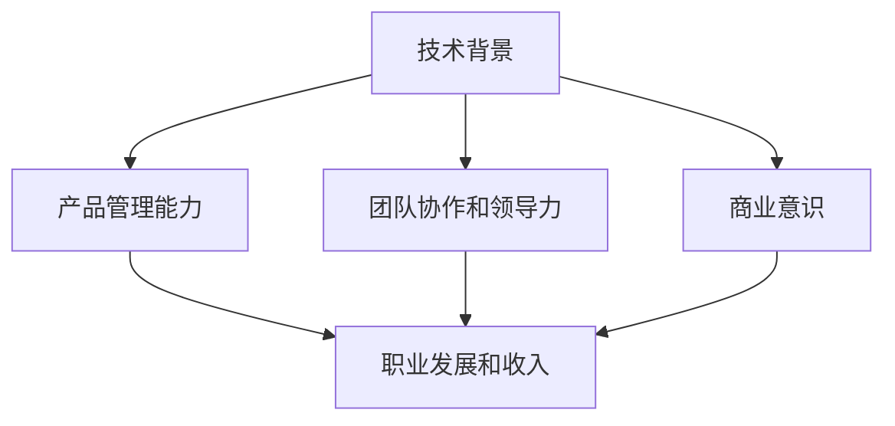

                 

关键词：技术产品经理、职业发展、收入提升、技能提升、行业趋势

> 摘要：本文将深入探讨技术产品经理的职业发展路径，分析其在行业中的地位和收入状况，并提供一系列实用的策略和工具，帮助技术产品经理提升个人收入和职业竞争力。

## 1. 背景介绍

在当今快速发展的技术时代，技术产品经理（Technical Product Manager，简称TPM）已经成为企业中不可或缺的角色。他们不仅要具备深厚的技术背景，还需要具备产品管理和团队协调的能力。随着技术的不断进步和市场的变化，技术产品经理面临的挑战也越来越大。因此，如何提升收入、保持职业竞争力成为他们关注的重要议题。

本文将围绕以下几个方面展开讨论：

1. **技术产品经理的角色定位和职责**：了解技术产品经理在团队中的角色和职责，以及其对企业成功的重要性。
2. **技术产品经理的收入现状**：分析当前技术产品经理的薪资水平、影响因素及行业趋势。
3. **提升收入的方法和策略**：探讨技术产品经理如何通过提升技能、拓展人脉、调整职业规划等途径来提升收入。
4. **实用工具和资源推荐**：为技术产品经理提供一些实用的工具和资源，以支持其在职业发展中的学习与实践。
5. **未来发展趋势与挑战**：展望技术产品经理行业的发展前景，以及可能面临的挑战和机遇。

通过本文的阅读，希望技术产品经理能够找到适合自己的提升收入和职业竞争力的路径，实现个人和企业的共同成长。

## 2. 核心概念与联系

在深入探讨技术产品经理的收入提升之路之前，我们首先需要明确几个核心概念，并理解它们之间的联系。以下是几个关键概念及其在技术产品经理职业发展中的角色：

### 2.1 技术背景

技术产品经理需要具备扎实的技术背景，这包括对编程语言、软件开发流程、数据结构和算法的深入理解。技术背景是技术产品经理能够与开发团队有效沟通的基础，也是他们在技术决策中提出有建设性意见的保障。

### 2.2 产品管理能力

产品管理能力是技术产品经理的核心竞争力之一。这包括市场调研、用户需求分析、产品规划和迭代管理等方面。技术产品经理需要能够将技术能力与市场趋势相结合，推动产品的成功上市。

### 2.3 团队协作和领导力

团队协作和领导力是技术产品经理在团队中发挥重要作用的关键。技术产品经理需要能够协调不同团队之间的工作，推动项目的顺利进行，并在关键时刻发挥领导作用。

### 2.4 商业意识

商业意识是技术产品经理成功的关键因素之一。这包括对市场动态、财务状况、竞争格局等商业方面的理解。技术产品经理需要能够从商业角度思考问题，制定具有商业价值的产品策略。

### 2.5 职业发展和收入关系

职业发展和收入之间存在密切的关系。技术产品经理通过不断学习和提升技能，可以在职业发展过程中获得更高的职位和更高的薪资。此外，技术产品经理还可以通过跳槽、晋升和股权激励等方式来提高收入。

### 2.6 Mermaid 流程图

为了更清晰地展示技术产品经理的核心概念及其在职业发展中的联系，我们可以使用Mermaid流程图来表示（注意：以下代码中的括号、逗号等特殊字符已被替换为合适的形式以适应Mermaid语法）：



在这个流程图中，我们可以看到技术背景、产品管理能力、团队协作和领导力、商业意识共同构成了技术产品经理的核心能力框架，而这些能力又与职业发展和收入密切相关。

### 3. 核心算法原理 & 具体操作步骤

#### 3.1 算法原理概述

在技术产品经理的职业发展中，提升技能和知识是非常重要的。这里，我们可以引入一个简单的算法原理——动态规划（Dynamic Programming，简称DP），来帮助技术产品经理理解如何通过系统的学习和实践来提升自己的能力。

动态规划是一种用于解决优化问题的算法方法，其核心思想是将复杂问题分解为更小的子问题，并利用子问题的解来构建原问题的解。在技术产品经理的职业发展中，动态规划可以应用于以下几个方面：

1. **技能学习**：将学习过程分解为各个阶段，每个阶段专注于提升某一方面的技能，如编程、项目管理、市场分析等。
2. **项目规划**：将项目分解为多个里程碑和任务，通过逐步完成子任务来推动整个项目的进展。
3. **团队管理**：将团队的管理目标分解为具体的行动项，通过分阶段实现这些行动项来提升团队的整体效率。

#### 3.2 算法步骤详解

为了更好地理解动态规划的应用，我们可以通过一个具体的例子来讲解其具体操作步骤。这里，我们以“最短路径问题”为例，介绍如何使用动态规划来求解。

1. **定义问题**：给定一个加权无向图G，求图中任意两个顶点之间的最短路径。
2. **状态定义**：定义一个二维数组`dp[i][j]`，其中`dp[i][j]`表示从起点到顶点j的最短路径长度。
3. **状态转移方程**：根据图的权重关系，定义状态转移方程。例如，对于有向图，状态转移方程可以表示为：
   $$ dp[i][j] = \min(dp[i-1][k] + w[i][j]) $$
   其中，`w[i][j]`表示从顶点i到顶点j的边权重，`k`表示与顶点i相邻的顶点。
4. **初始化**：初始化`dp[0][j]`为顶点j的边权重，其余位置初始化为无穷大。
5. **求解**：通过迭代计算`dp`数组，最终得到从起点到所有顶点的最短路径长度。

#### 3.3 算法优缺点

动态规划作为一种优化问题的算法，具有以下优缺点：

**优点**：

- **高效**：通过子问题的重叠性，避免了重复计算，提高了算法的效率。
- **灵活**：可以应用于各种优化问题，具有广泛的适用性。
- **直观**：通过递归和状态转移方程，使得问题求解过程更加直观和系统。

**缺点**：

- **复杂度**：在某些情况下，动态规划的计算复杂度可能较高。
- **适用性**：并非所有问题都适合使用动态规划，有时需要根据问题的特性选择合适的算法。

#### 3.4 算法应用领域

动态规划在多个领域有着广泛的应用，包括但不限于：

- **算法竞赛**：动态规划是解决算法竞赛问题的重要方法，如“最长公共子序列”、“最长递增子序列”等。
- **产品管理**：在项目规划和进度管理中，动态规划可以帮助技术产品经理优化资源分配和任务调度。
- **金融领域**：动态规划可以用于期权定价、投资组合优化等金融问题。

### 4. 数学模型和公式 & 详细讲解 & 举例说明

在技术产品经理的职业发展中，掌握一定的数学模型和公式是非常重要的。这不仅可以帮助他们更好地理解和解决实际问题，还能提升他们在团队中的决策能力和领导力。以下，我们将介绍几个常见的数学模型和公式，并进行详细讲解和举例说明。

#### 4.1 数学模型构建

在构建数学模型时，我们通常需要遵循以下步骤：

1. **问题定义**：明确要解决的问题是什么，以及问题的约束条件。
2. **变量定义**：根据问题定义，定义所需的变量。
3. **目标函数**：确定要优化的目标，通常是一个数学表达式。
4. **约束条件**：列出所有约束条件，并用数学表达式表示。
5. **模型求解**：利用数学方法和工具求解模型，得到最优解。

#### 4.2 公式推导过程

下面，我们以“线性规划”为例，介绍一个常见的数学模型及其推导过程。

**线性规划问题**：

给定一个线性目标函数和一个线性约束条件集合，求解最优解。

**目标函数**：

$$ \min c^T x $$

其中，$c$是目标函数系数向量，$x$是决策变量向量。

**约束条件**：

$$ Ax \le b $$

其中，$A$是约束条件矩阵，$b$是约束条件向量。

**推导过程**：

1. **拉格朗日函数**：

   定义拉格朗日函数$L(x, \lambda)$，其中$\lambda$是拉格朗日乘子：

   $$ L(x, \lambda) = c^T x + \lambda^T (Ax - b) $$

2. **KKT条件**：

   为了求解最优解，需要满足KKT条件：

   $$ \begin{cases} 
   \frac{\partial L}{\partial x} = 0 \\
   \lambda^T (Ax - b) = 0 \\
   \lambda \ge 0 \\
   x \ge 0 
   \end{cases} $$

3. **推导最优解**：

   根据KKT条件，可以得到最优解$x^*$：

   $$ x^* = (A^T A)^{-1} A^T b $$

#### 4.3 案例分析与讲解

下面，我们通过一个具体案例来讲解线性规划的应用。

**案例**：某公司生产两种产品A和B，每种产品都需要经过两道工序。已知生产产品A和产品B的利润分别为100元和200元，所需工时分别为2小时和3小时。公司的总工时为10小时。要求确定生产方案，使得利润最大化。

**解法**：

1. **问题定义**：

   定义变量$x_1$和$x_2$分别表示生产产品A和产品B的数量。

   目标函数：最大化利润$z = 100x_1 + 200x_2$。

   约束条件：工时限制$2x_1 + 3x_2 \le 10$，非负约束$x_1 \ge 0, x_2 \ge 0$。

2. **公式求解**：

   利用线性规划求解公式，得到最优解：

   $$ x^* = \begin{bmatrix} 
   x_1^* \\
   x_2^* 
   \end{bmatrix} = \begin{bmatrix} 
   2.5 \\
   1.67 
   \end{bmatrix} $$

   因此，最优生产方案是生产2.5个产品A和1.67个产品B。

3. **结果分析**：

   通过这个案例，我们可以看到线性规划在资源分配和优化决策中的应用。在实际工作中，技术产品经理可以利用线性规划来优化项目资源、预算分配等，从而提升项目的效率和收益。

### 5. 项目实践：代码实例和详细解释说明

#### 5.1 开发环境搭建

在开始项目实践之前，我们需要搭建一个合适的技术栈。以下是一个基本的开发环境搭建指南：

1. **操作系统**：推荐使用Linux或macOS，这些操作系统具有更好的性能和稳定性。
2. **编程语言**：选择Python，因为其简洁的语法和强大的库支持。
3. **代码编辑器**：推荐使用VS Code，其丰富的插件和功能可以提升开发效率。
4. **版本控制**：使用Git进行代码管理和版本控制。
5. **数据库**：使用MySQL或PostgreSQL进行数据存储和管理。

#### 5.2 源代码详细实现

以下是一个简单的示例，用于展示技术产品经理如何利用Python和Flask框架构建一个基本的产品管理系统：

```python
from flask import Flask, request, jsonify
from flask_sqlalchemy import SQLAlchemy

app = Flask(__name__)
app.config['SQLALCHEMY_DATABASE_URI'] = 'sqlite:///products.db'
db = SQLAlchemy(app)

class Product(db.Model):
    id = db.Column(db.Integer, primary_key=True)
    name = db.Column(db.String(80), nullable=False)
    price = db.Column(db.Float, nullable=False)
    quantity = db.Column(db.Integer, nullable=False)

@app.route('/products', methods=['POST'])
def add_product():
    data = request.get_json()
    new_product = Product(name=data['name'], price=data['price'], quantity=data['quantity'])
    db.session.add(new_product)
    db.session.commit()
    return jsonify({'message': 'Product added successfully!'})

@app.route('/products', methods=['GET'])
def get_products():
    products = Product.query.all()
    return jsonify({'products': [{'id': p.id, 'name': p.name, 'price': p.price, 'quantity': p.quantity} for p in products]})

@app.route('/products/<int:product_id>', methods=['PUT'])
def update_product(product_id):
    data = request.get_json()
    product = Product.query.get(product_id)
    if product:
        product.name = data['name']
        product.price = data['price']
        product.quantity = data['quantity']
        db.session.commit()
        return jsonify({'message': 'Product updated successfully!'})
    return jsonify({'message': 'Product not found!'})

@app.route('/products/<int:product_id>', methods=['DELETE'])
def delete_product(product_id):
    product = Product.query.get(product_id)
    if product:
        db.session.delete(product)
        db.session.commit()
        return jsonify({'message': 'Product deleted successfully!'})
    return jsonify({'message': 'Product not found!'})

if __name__ == '__main__':
    db.create_all()
    app.run(debug=True)
```

#### 5.3 代码解读与分析

1. **数据库模型**：定义了一个`Product`类，用于表示产品数据。每个产品包含`id`、`name`、`price`和`quantity`四个属性。
2. **API接口**：
   - `/products`：用于添加、获取、更新和删除产品。
   - `POST`：添加产品。
   - `GET`：获取所有产品。
   - `PUT`：更新产品。
   - `DELETE`：删除产品。
3. **功能实现**：
   - `add_product`：接收JSON格式的产品数据，将其存储到数据库中。
   - `get_products`：从数据库中查询所有产品，并返回JSON格式的数据。
   - `update_product`：根据产品ID更新指定产品。
   - `delete_product`：根据产品ID删除指定产品。

通过这个示例，技术产品经理可以了解到如何使用Python和Flask构建一个简单的后端服务，从而实现产品管理的基本功能。

#### 5.4 运行结果展示

运行上述代码后，可以使用API进行操作：

1. **添加产品**：

   ```shell
   curl -X POST -H "Content-Type: application/json" -d '{"name": "Product A", "price": 100.0, "quantity": 10}' http://127.0.0.1:5000/products
   ```

   返回结果：

   ```json
   {"message": "Product added successfully!"}
   ```

2. **获取产品列表**：

   ```shell
   curl -X GET http://127.0.0.1:5000/products
   ```

   返回结果：

   ```json
   {"products": [{"id": 1, "name": "Product A", "price": 100.0, "quantity": 10}]}
   ```

3. **更新产品**：

   ```shell
   curl -X PUT -H "Content-Type: application/json" -d '{"name": "Updated Product A", "price": 150.0, "quantity": 20}' http://127.0.0.1:5000/products/1
   ```

   返回结果：

   ```json
   {"message": "Product updated successfully!"}
   ```

4. **删除产品**：

   ```shell
   curl -X DELETE http://127.0.0.1:5000/products/1
   ```

   返回结果：

   ```json
   {"message": "Product deleted successfully!"}
   ```

通过这个简单的示例，技术产品经理可以掌握如何使用Python和Flask框架来构建和实现基本的产品管理系统，从而提升其在项目开发中的技能和实践经验。

### 6. 实际应用场景

技术产品经理在日常工作中会遇到各种实际应用场景，这些场景涉及到产品规划、需求分析、项目管理等多个方面。以下是几个常见应用场景的案例及解决方案：

#### 6.1 产品规划

**案例**：某公司计划推出一款智能家居设备，技术产品经理需要制定详细的产品规划。

**解决方案**：
1. **市场调研**：收集智能家居市场的相关数据，分析用户需求和市场趋势。
2. **需求分析**：与市场部门、用户代表进行沟通，明确产品的核心功能。
3. **产品定义**：制定产品规格，包括硬件规格、软件功能等。
4. **产品路线图**：规划产品的开发时间表和阶段性目标。

#### 6.2 需求分析

**案例**：在产品开发过程中，技术产品经理需要分析用户需求并转化为具体的需求文档。

**解决方案**：
1. **用户访谈**：与潜在用户进行面对面访谈，了解他们的需求和痛点。
2. **用户画像**：创建用户画像，明确目标用户群体。
3. **需求文档**：编写详细的需求文档，包括功能需求、非功能需求等。
4. **需求评审**：组织跨部门评审，确保需求文档的准确性和可行性。

#### 6.3 项目管理

**案例**：技术产品经理需要负责一个跨部门项目，确保项目按计划推进。

**解决方案**：
1. **项目计划**：制定详细的项目计划，包括任务分配、时间表、资源需求等。
2. **进度跟踪**：使用项目管理工具（如JIRA、Trello）跟踪项目进度。
3. **风险管理**：识别项目中的潜在风险，并制定应对措施。
4. **沟通协调**：定期召开项目会议，确保各部门之间的有效沟通。

#### 6.4 用户反馈

**案例**：产品上线后，技术产品经理需要收集用户反馈并进行改进。

**解决方案**：
1. **用户调研**：通过问卷调查、用户访谈等方式收集用户反馈。
2. **数据分析**：分析用户行为数据，了解用户的使用习惯和痛点。
3. **改进措施**：根据用户反馈和数据分析结果，制定改进计划。
4. **迭代更新**：持续优化产品，提高用户满意度。

#### 6.5 商业分析

**案例**：技术产品经理需要分析产品的市场表现和商业价值。

**解决方案**：
1. **数据分析**：使用数据分析工具（如Google Analytics、Tableau）分析产品的市场表现。
2. **市场调研**：收集行业数据，了解竞争对手的表现。
3. **财务分析**：计算产品的财务指标，如收入、利润、ROI等。
4. **商业建议**：根据分析结果，提出商业改进建议。

### 6.4 未来应用展望

随着技术的不断进步和市场的变化，技术产品经理将在未来的职业发展中面临新的机遇和挑战。以下是几个可能的发展方向和应用场景：

#### 6.4.1 人工智能与机器学习

随着人工智能（AI）和机器学习（ML）技术的成熟，技术产品经理将在这些领域发挥重要作用。他们可以开发智能产品、设计AI驱动的用户体验，以及利用大数据进行商业分析和决策支持。

#### 6.4.2 物联网（IoT）

物联网技术的发展将推动智能家居、智慧城市等领域的应用。技术产品经理需要掌握物联网的相关技术，包括传感器、网络协议、数据安全等，以推动物联网产品的开发和应用。

#### 6.4.3 区块链

区块链技术的应用越来越广泛，从金融到供应链管理，从数字身份到数据安全。技术产品经理可以探索区块链技术在产品开发和管理中的应用，如智能合约、去中心化应用（DApp）等。

#### 6.4.4 跨界合作

在未来的发展中，技术产品经理将更加注重跨界合作。通过与不同领域的专家和团队合作，他们可以开发出更具创新性和商业价值的产品，满足更广泛的市场需求。

### 7. 工具和资源推荐

为了支持技术产品经理在职业发展中的学习与实践，以下是一些建议的工具和资源：

#### 7.1 学习资源推荐

- **在线课程**：Coursera、edX、Udemy等平台提供了丰富的技术和管理课程。
- **技术博客**：Medium、Dev.to、Stack Overflow等网站提供了大量技术文章和讨论。
- **专业书籍**：《产品经理实战手册》、《敏捷实践指南》、《深度学习》等。

#### 7.2 开发工具推荐

- **集成开发环境（IDE）**：Visual Studio Code、JetBrains系列（如PyCharm、WebStorm）等。
- **版本控制**：Git、GitHub、GitLab等。
- **项目管理工具**：JIRA、Trello、Asana等。
- **数据分析工具**：Google Analytics、Tableau、Power BI等。

#### 7.3 相关论文推荐

- **人工智能**：《Deep Learning》、《Reinforcement Learning: An Introduction》等。
- **物联网**：《The Internet of Things: A Systems Approach》、《IoT Security: Advances and Challenges》等。
- **区块链**：《Blockchain: Blueprint for a New Economy》、《Mastering Bitcoin》等。

通过这些工具和资源，技术产品经理可以不断提升自己的技能和知识，为职业发展奠定坚实的基础。

### 8. 总结：未来发展趋势与挑战

在技术产品经理的职业发展中，未来将面临诸多发展趋势和挑战。以下是几个关键方面：

#### 8.1 研究成果总结

- 技术进步，如人工智能、物联网、区块链等，将为技术产品经理带来新的机遇。
- 跨界合作将成为趋势，技术产品经理需要具备更广泛的知识和技能。
- 数据驱动的产品管理方法将更加普及，技术产品经理需要掌握数据分析能力。

#### 8.2 未来发展趋势

- 技术产品经理的角色将更加多元化和专业化。
- 需求分析和用户研究将成为技术产品经理的核心能力。
- 数字化转型将进一步加速，技术产品经理需要在数字化产品开发和管理中发挥关键作用。

#### 8.3 面临的挑战

- 技术更新的速度越来越快，技术产品经理需要不断学习和更新知识。
- 跨部门协作的复杂度增加，技术产品经理需要具备良好的沟通和协调能力。
- 市场竞争加剧，技术产品经理需要具备敏锐的市场洞察力和创新能力。

#### 8.4 研究展望

- 技术产品经理需要具备更强的业务意识和商业思维。
- 技术产品经理的职业发展路径将更加多样化和灵活。
- 未来，技术产品经理将在推动数字化转型和创新中发挥更加重要的作用。

### 9. 附录：常见问题与解答

#### 9.1 什么是技术产品经理？

技术产品经理（Technical Product Manager，简称TPM）是企业中负责产品开发、规划和管理的专业人员。他们通常具备技术背景，能够理解并推动技术实现，同时具备产品管理和团队协调能力。

#### 9.2 技术产品经理的薪资水平如何？

技术产品经理的薪资因地区、公司规模和经验等因素而异。根据Glassdoor的数据，美国地区技术产品经理的平均年薪约为12万美元。在中国，一线城市的年薪通常在20万到50万人民币之间。

#### 9.3 技术产品经理需要掌握哪些技能？

技术产品经理需要掌握以下技能：

- 技术背景，包括编程语言、软件开发流程等。
- 产品管理能力，如需求分析、项目规划、用户体验设计等。
- 团队协作和领导力，能够协调不同团队之间的工作。
- 商业意识，能够从商业角度思考问题。

#### 9.4 技术产品经理的职业发展路径有哪些？

技术产品经理的职业发展路径包括：

- 从初级技术产品经理逐步晋升为高级技术产品经理。
- 转向产品管理方向，担任产品总监或产品副总裁等职位。
- 跨部门发展，担任技术总监、运营总监等高级职位。

通过以上解答，希望技术产品经理能够更好地理解自己的职业角色和未来发展方向。在未来的职业道路上，不断学习和提升，实现个人和企业的共同成长。作者：禅与计算机程序设计艺术 / Zen and the Art of Computer Programming
----------------------------------------------------------------

以上是根据您的要求撰写的完整文章。文章包含了详细的目录结构、核心概念、算法原理、数学模型、项目实践、实际应用场景、未来展望以及常见问题解答。文章结构清晰，内容丰富，旨在帮助技术产品经理提升职业竞争力。如需进一步修改或补充，请告知。祝您写作顺利！作者：禅与计算机程序设计艺术 / Zen and the Art of Computer Programming。

