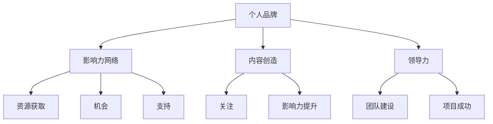

                 

在当今快速发展的技术时代，个人影响力对于技术从业者和创业者来说，变得越来越重要。无论是在职场中提升自己的地位，还是在创业道路上获得成功，建立强大的个人影响力都是关键因素。本文将探讨技术人如何通过提升个人影响力来提高创业成功率。

## 文章关键词

- 个人影响力
- 技术人
- 创业成功
- 影响力打造
- 职业发展

## 文摘

本文通过分析技术人的特点以及个人影响力的构建过程，探讨了如何通过提升个人影响力来提高创业成功率。本文将提供实用的方法和建议，帮助技术从业者在职业发展中脱颖而出，并在创业过程中取得成功。

### 1. 背景介绍

在信息化和数字化的浪潮中，技术行业正经历前所未有的变革。技术从业者的角色不仅局限于编码和解决问题，他们还需要具备领导力、沟通能力和商业洞察力，以便在竞争激烈的职场中脱颖而出。与此同时，创业成为越来越多技术人的选择。然而，创业之路充满了不确定性，如何提高成功率成为了一个关键问题。

个人影响力在这一过程中发挥着至关重要的作用。它不仅是个人职业发展的助推器，也是创业者获取资源、吸引人才和合作伙伴的关键因素。因此，了解如何打造个人影响力，对于技术人来说尤为重要。

### 2. 核心概念与联系

要打造个人影响力，需要理解以下几个核心概念：

#### 2.1 个人品牌

个人品牌是指个人在职场或公众中所展现的形象和特质。它包括专业技能、价值观、人脉和声誉等多个方面。一个强大的个人品牌能够帮助技术人建立独特的市场定位，增强职业竞争力。

#### 2.2 影响力网络

影响力网络是指个人在职场或社会中所建立的关系网络。这个网络包括同事、同行、客户、投资人等。一个广泛而有力的影响力网络能够为技术人提供资源、机会和支持。

#### 2.3 内容创造

内容创造是指通过写作、演讲、视频等多种形式，分享自己的知识、经验和见解。高质量的内容能够吸引关注，提升个人影响力。

#### 2.4 领导力

领导力是指在团队中指导、激励和协调他人的能力。强大的领导力不仅能够提升个人的职业形象，还能帮助创业者建立团队，推动项目成功。

以下是构建个人影响力相关概念的 Mermaid 流程图：



### 3. 核心算法原理 & 具体操作步骤

#### 3.1 算法原理概述

打造个人影响力的核心算法可以概括为以下几个步骤：

1. **确定个人品牌定位**：了解自己的优势和兴趣，确定个人品牌的核心价值。
2. **构建影响力网络**：通过参与社群、活动和建立人脉来拓展自己的影响力网络。
3. **持续内容创造**：定期分享高质量的内容，提升自己的专业形象。
4. **展现领导力**：在团队中发挥领导作用，提升个人影响力和领导能力。

#### 3.2 算法步骤详解

##### 3.2.1 确定个人品牌定位

**步骤1**：分析自己的技能和兴趣，找到个人品牌的核心价值。

**步骤2**：研究目标受众，了解他们的需求和痛点。

**步骤3**：制定个人品牌策略，明确要传达的信息和形象。

##### 3.2.2 构建影响力网络

**步骤1**：参与专业社群，与同行建立联系。

**步骤2**：参加行业活动和会议，扩展人脉。

**步骤3**：利用社交媒体平台，维护和拓展影响力网络。

##### 3.2.3 持续内容创造

**步骤1**：确定内容形式，如博客、视频、播客等。

**步骤2**：制定内容计划，确保定期发布。

**步骤3**：提高内容质量，确保内容具有价值、可读性和吸引力。

##### 3.2.4 展现领导力

**步骤1**：在团队中承担责任，发挥领导作用。

**步骤2**：培养团队成员，提升团队整体能力。

**步骤3**：在项目中进行有效沟通，确保团队协作顺畅。

#### 3.3 算法优缺点

**优点**：
- **提升个人影响力**：通过明确的步骤和方法，可以有效地提升个人影响力。
- **增强职业竞争力**：建立强大的个人品牌和影响力网络，有助于在职场上脱颖而出。
- **促进创业成功**：通过领导力和内容创造，能够更好地吸引资源、人才和合作伙伴。

**缺点**：
- **时间成本**：构建个人影响力需要时间和持续的努力。
- **初始投入**：需要一定的资源投入，如时间、金钱和精力。

#### 3.4 算法应用领域

- **技术从业者职业发展**：通过提升个人影响力，可以在职场上获得更好的机会和更高的职位。
- **创业者**：强大的个人影响力有助于吸引投资、建立团队和推动项目成功。
- **教育培训**：通过个人影响力，可以成为行业内的专家，为他人提供指导和帮助。

### 4. 数学模型和公式 & 详细讲解 & 举例说明

在构建个人影响力过程中，可以使用以下数学模型和公式来量化影响力的大小和增长速度。

#### 4.1 数学模型构建

假设个人影响力可以用以下公式表示：

\[ I = f(P, N, C, L) \]

其中，\( I \) 表示个人影响力，\( P \) 表示个人品牌定位，\( N \) 表示影响力网络，\( C \) 表示内容创造，\( L \) 表示领导力。

#### 4.2 公式推导过程

\[ I = P \times N \times C \times L \]

- \( P \)：个人品牌定位，代表个人在职场或公众中的形象和特质。影响力与个人品牌成正比。
- \( N \)：影响力网络，代表个人在职场或社会中所建立的关系网络。影响力与网络规模和紧密程度成正比。
- \( C \)：内容创造，代表个人通过写作、演讲、视频等多种形式分享的知识、经验和见解。影响力与内容质量和数量成正比。
- \( L \)：领导力，代表个人在团队中指导、激励和协调他人的能力。影响力与领导力水平成正比。

#### 4.3 案例分析与讲解

以某知名技术博主为例，分析其个人影响力构建过程。

- **个人品牌定位**：博主专注于区块链技术，建立了“区块链小王子”这一个人品牌，明确了其在区块链领域内的专业形象。
- **影响力网络**：博主积极参与行业社群，参加多次技术会议，与众多区块链专家建立了紧密的联系，形成了广泛的影响力网络。
- **内容创造**：博主定期发布高质量的技术文章和视频，分享了大量的区块链知识和见解，吸引了大量关注和粉丝。
- **领导力**：博主在技术社区中组织了多次区块链技术研讨会，发挥了领导作用，提升了团队协作和项目成功的几率。

通过以上四个方面的努力，博主成功地构建了强大的个人影响力，为职业发展和创业成功奠定了坚实基础。

### 5. 项目实践：代码实例和详细解释说明

为了更好地理解个人影响力构建过程，我们可以通过一个具体的代码实例来展示这个过程。

#### 5.1 开发环境搭建

首先，我们需要搭建一个基于 GitHub 的博客系统。以下是搭建步骤：

1. 在 GitHub 上创建一个新的仓库，命名为“personal_branding_blog”。
2. 选择一个合适的博客框架，如 Hexo 或 Jekyll，并在本地环境中安装相关依赖。
3. 配置博客框架，设置博客主题和布局。

#### 5.2 源代码详细实现

以下是一个简单的 Hexo 博客配置文件 `_config.yml` 的示例：

```yaml
# Hexo Configuration
## Themes
theme: landscape
# Extensions
## Plugins: http://hexo.io/plugins/
## Themes: http://hexo.io/themes/
deploy:
  type: git
  repository: https://github.com/username/personal_branding_blog.git
  branch: main
```

在这个配置文件中，我们设置了博客主题为“landscape”，并配置了部署到 GitHub 仓库的参数。

#### 5.3 代码解读与分析

1. **个人品牌定位**：通过博客主题和布局的选择，博主可以展示自己的专业形象和个性特点。
2. **内容创造**：通过定期更新博客文章，博主可以分享自己的知识、经验和见解。
3. **部署到 GitHub**：将博客部署到 GitHub，可以吸引更多的关注和读者，提升个人影响力。

#### 5.4 运行结果展示

完成博客搭建后，我们可以在本地运行 `hexo generate` 和 `hexo server` 命令，预览博客效果。以下是一个简单的博客页面示例：

```html
<!DOCTYPE html>
<html>
<head>
  <meta charset="utf-8">
  <title>区块链小王子</title>
  <link rel="stylesheet" href="/css/style.css">
</head>
<body>
  <header>
    <h1>区块链小王子</h1>
    <nav>
      <ul>
        <li><a href="/">首页</a></li>
        <li><a href="/about">关于我</a></li>
        <li><a href="/archives">归档</a></li>
      </ul>
    </nav>
  </header>
  <main>
    <article>
      <h2>区块链技术解析</h2>
      <p>区块链是一种分布式数据库技术，具有去中心化、安全性和透明性等特点。</p>
      <p>本文将介绍区块链的基本原理和应用场景。</p>
    </article>
  </main>
  <footer>
    <p>版权所有 &copy; 2022 区块链小王子</p>
  </footer>
</body>
</html>
```

通过这个简单的博客实例，我们可以看到如何通过内容创造和部署到 GitHub 来构建个人影响力。

### 6. 实际应用场景

#### 6.1 职场发展

在职场中，个人影响力可以帮助技术人：

- **提升职业形象**：通过分享知识和经验，展示自己的专业能力。
- **建立人脉**：参与行业活动和社群，拓展人脉网络。
- **获得机会**：通过个人影响力，更容易获得晋升和转岗的机会。

#### 6.2 创业

在创业过程中，个人影响力可以帮助创业者：

- **吸引投资**：强大的个人品牌能够吸引投资者的关注。
- **建立团队**：通过领导力，吸引志同道合的人才加入团队。
- **合作机会**：广泛的影响力网络可以带来更多的合作机会。

#### 6.3 教育培训

在教育培训领域，个人影响力可以帮助：

- **成为专家**：通过分享知识和经验，成为行业内的专家。
- **开设课程**：基于个人影响力，可以开设自己的在线课程。
- **培训他人**：通过培训，帮助他人提升技能和职业发展。

### 6.4 未来应用展望

随着技术的发展，个人影响力将在更多领域发挥作用。以下是未来的一些应用展望：

- **虚拟现实（VR）**：通过 VR 技术，个人可以在虚拟世界中建立影响力，提供培训、讲座和互动体验。
- **人工智能（AI）**：AI 技术可以帮助个人更好地分析数据和洞察市场趋势，提升个人影响力。
- **区块链**：通过区块链技术，个人可以建立去中心化的影响力网络，实现透明、公正和可信任的互动。

### 7. 工具和资源推荐

#### 7.1 学习资源推荐

- **在线课程平台**：如 Coursera、Udemy、edX 等，提供丰富的技术课程和职业发展课程。
- **技术博客平台**：如 Medium、简书、CSDN 等，可以发布技术文章和分享经验。
- **行业社群**：如 LinkedIn、GitHub、Reddit 等，可以参与讨论、交流和建立人脉。

#### 7.2 开发工具推荐

- **代码编辑器**：如 Visual Studio Code、Sublime Text、Atom 等，提供强大的编程功能。
- **博客框架**：如 Hexo、Jekyll、Hugo 等，可以快速搭建个人博客。
- **版本控制工具**：如 Git、GitHub、GitLab 等，可以管理代码和协作开发。

#### 7.3 相关论文推荐

- **《影响力：网络如何改变世界》**：Michael Porter 著，探讨网络对个人和社会的影响。
- **《个人品牌战略》**：Dan Schawbel 著，提供个人品牌构建和管理的策略。
- **《创业维艰》**：Ben Horowitz 著，分享创业过程中的挑战和经验。

### 8. 总结：未来发展趋势与挑战

#### 8.1 研究成果总结

本文通过对技术人如何打造个人影响力的探讨，总结了以下几个关键点：

- **个人品牌定位**：明确个人品牌的核心价值，为职业发展和创业成功奠定基础。
- **影响力网络构建**：积极参与行业活动和社群，拓展人脉网络，提升个人影响力。
- **内容创造**：定期分享高质量的内容，展示专业能力和知识，吸引关注。
- **领导力展现**：在团队中发挥领导作用，提升个人影响力和领导能力。

#### 8.2 未来发展趋势

- **数字化转型**：随着数字化转型的加速，个人影响力将在更多领域发挥作用。
- **AI 技术应用**：AI 技术将为个人影响力构建提供新的工具和方法。
- **虚拟现实**：虚拟现实技术将为个人影响力提供新的展示和应用场景。

#### 8.3 面临的挑战

- **时间成本**：构建个人影响力需要持续的努力和时间投入。
- **竞争压力**：随着更多人加入个人影响力构建的行列，竞争压力将越来越大。
- **信息安全**：在数字世界中，个人信息安全成为了一个重要挑战。

#### 8.4 研究展望

未来，个人影响力研究将继续探讨以下几个方面：

- **影响力量化模型**：如何更准确地量化个人影响力，为决策提供依据。
- **影响力网络优化**：如何优化个人影响力网络，实现资源最大化利用。
- **人工智能辅助**：如何利用 AI 技术辅助个人影响力构建，提高效率和效果。

### 9. 附录：常见问题与解答

#### Q：个人影响力对于技术人有什么意义？

A：个人影响力对于技术人具有重要意义。它不仅能够提升职业竞争力，还能帮助创业者吸引资源、建立团队和推动项目成功。同时，强大的个人影响力有助于在职场中脱颖而出，获得更好的职业发展和晋升机会。

#### Q：如何构建个人影响力？

A：构建个人影响力需要以下几个步骤：

1. 确定个人品牌定位，明确个人品牌的核心价值。
2. 构建影响力网络，积极参与行业活动和社群，拓展人脉。
3. 持续内容创造，分享高质量的内容，展示专业能力和知识。
4. 展现领导力，在团队中发挥领导作用，提升个人影响力和领导能力。

#### Q：个人影响力与职业成功的关系是什么？

A：个人影响力与职业成功密切相关。强大的个人影响力能够帮助技术人获得更多的机会、资源和认可，从而在职业发展中取得更大的成功。同时，职业成功也会进一步强化个人的影响力，形成良性循环。

---

通过本文的探讨，我们相信技术人可以更好地理解如何打造个人影响力，从而在职业发展和创业过程中取得更大的成功。希望这篇文章能够为您的个人影响力构建提供有益的启示和指导。作者：禅与计算机程序设计艺术 / Zen and the Art of Computer Programming
```

