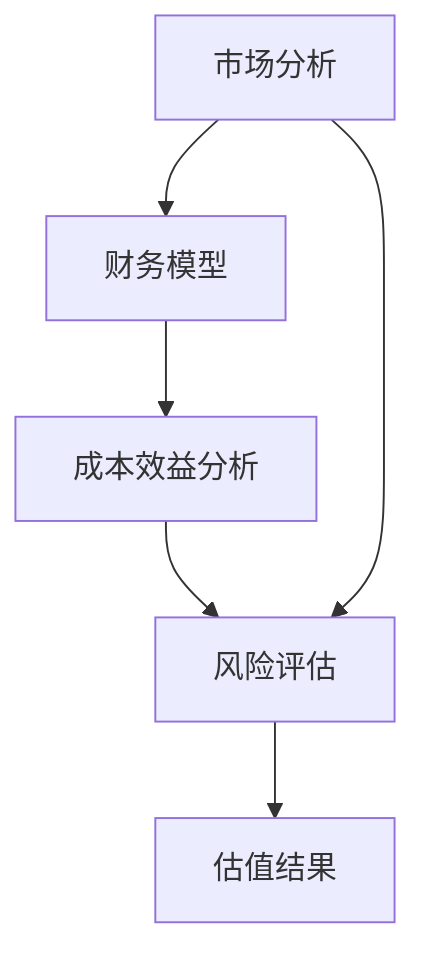

                 

关键词：创业项目估值、财务模型、风险投资、市场分析、成本效益分析

> 摘要：本文旨在探讨技术人如何进行有效的创业项目估值。通过阐述核心概念、分析算法原理、构建数学模型、实例演示及展望未来发展趋势，为技术创业者提供一套系统的估值方法。

## 1. 背景介绍

在当今的科技浪潮中，创业成为了许多人实现梦想的途径。然而，创业过程中，如何准确评估项目价值，对于吸引投资者、制定战略规划以及企业成长至关重要。技术人通常具有较强的技术背景，但在财务和市场分析方面可能较为薄弱。因此，本文将结合技术人的特点，提供一套适用于创业项目的估值方法。

### 1.1 创业项目估值的重要性

创业项目估值是投资者、创业者和管理层共同关注的问题。准确的估值有助于：

1. 吸引投资者：估值过高可能导致融资困难，估值过低可能错失机会。
2. 制定战略规划：估值结果直接影响企业的发展方向和资源配置。
3. 管理预期：合理的估值有助于企业和管理层形成共识，降低沟通成本。

### 1.2 技术人在估值中的挑战

技术人在创业项目中通常具备以下挑战：

1. 缺乏财务知识：难以构建完整的财务模型。
2. 市场分析不足：难以准确判断市场需求和竞争态势。
3. 风险评估不明确：难以量化项目的潜在风险。

### 1.3 本文目标

本文旨在解决上述挑战，通过以下步骤：

1. 系统介绍估值方法。
2. 阐述核心概念和算法原理。
3. 构建数学模型并举例说明。
4. 提供项目实践案例和代码实现。
5. 展望未来发展趋势和面临的挑战。

## 2. 核心概念与联系

在进行创业项目估值之前，我们需要了解一些核心概念和它们之间的联系。以下是一个简化的Mermaid流程图，用于描述这些概念：



### 2.1 市场分析

市场分析是估值的基石。它包括以下几个方面：

1. 市场规模：确定目标市场的总体规模。
2. 市场趋势：分析市场的发展趋势和周期。
3. 竞争态势：了解竞争对手的市场份额和策略。
4. 客户需求：识别目标客户的需求和偏好。

### 2.2 财务模型

财务模型是估值的工具。它包括以下几个方面：

1. 收入模型：预测未来的收入流。
2. 成本模型：计算项目的总成本。
3. 利润模型：计算项目的净利润。
4. 现金流模型：预测项目的现金流。

### 2.3 成本效益分析

成本效益分析是评估项目可行性的关键。它包括以下几个方面：

1. 成本效益比：计算总成本与总效益的比值。
2. 投资回报率：计算项目的投资回报时间。
3. 风险分析：评估项目面临的风险及其影响。

### 2.4 风险评估

风险评估是估值过程中不可或缺的一环。它包括以下几个方面：

1. 市场风险：分析市场变化对项目的影响。
2. 财务风险：评估项目的财务稳定性。
3. 运营风险：分析项目运营过程中可能遇到的问题。
4. 技术风险：评估项目的技术可行性。

### 2.5 估值结果

估值结果是整个估值过程的输出。它包括以下几个方面：

1. 项目价值：确定项目的市场价值。
2. 投资价值：评估项目的投资吸引力。
3. 成本效益：计算项目的成本效益。
4. 风险等级：评估项目的风险水平。

## 3. 核心算法原理 & 具体操作步骤

在进行估值时，我们通常会使用多种算法和模型。以下是几种常用的算法原理和具体操作步骤。

### 3.1 算法原理概述

1. 市场比较法：通过比较相似项目的市场价值来估算项目的价值。
2. 成本法：根据项目的成本来估算项目的价值。
3. 收益法：根据项目的未来收益来估算项目的价值。
4. 风险调整法：在基础估值方法上调整风险因素来估算项目的价值。

### 3.2 算法步骤详解

#### 3.2.1 市场比较法

1. 确定可比项目：寻找与项目相似的可比项目。
2. 收集数据：收集可比项目的市场价值数据。
3. 计算调整系数：根据项目的差异调整可比项目的价值。
4. 估算项目价值：将调整后的可比项目价值应用于当前项目。

#### 3.2.2 成本法

1. 计算直接成本：确定项目的直接成本。
2. 计算间接成本：确定项目的间接成本。
3. 计算总成本：将直接成本和间接成本相加。
4. 估算项目价值：根据成本和利润率来估算项目的价值。

#### 3.2.3 收益法

1. 预测收入流：预测项目的未来收入流。
2. 计算折现率：确定项目的折现率。
3. 计算净现值：将未来收入流折现到当前价值。
4. 估算项目价值：根据净现值来估算项目的价值。

#### 3.2.4 风险调整法

1. 确定基础估值方法：选择适合项目的估值方法。
2. 评估风险因素：识别和评估项目面临的风险因素。
3. 调整估值结果：根据风险因素调整估值结果。
4. 估算项目价值：结合基础估值方法和风险调整结果来估算项目的价值。

### 3.3 算法优缺点

每种估值方法都有其优缺点。以下是对几种常用估值方法的优缺点的简要分析：

1. **市场比较法**：
   - 优点：简单直观，适用于市场成熟的项目。
   - 缺点：可能受限于市场数据的可用性和可靠性。

2. **成本法**：
   - 优点：适用于新项目或成本构成明确的项目。
   - 缺点：可能忽视市场需求和潜在收益。

3. **收益法**：
   - 优点：考虑了项目的未来收益，更全面。
   - 缺点：需要准确预测未来收入流，存在一定的不确定性。

4. **风险调整法**：
   - 优点：综合考虑了市场需求、成本和风险。
   - 缺点：需要较高的专业知识和经验。

### 3.4 算法应用领域

不同的估值方法适用于不同的领域和场景。以下是一些常见的应用领域：

1. **初创公司**：通常使用收益法和成本法来估值。
2. **成熟公司**：通常使用市场比较法和收益法来估值。
3. **并购项目**：通常使用市场比较法和成本法来估值。
4. **风险投资**：通常使用收益法和风险调整法来估值。

## 4. 数学模型和公式 & 详细讲解 & 举例说明

在进行创业项目估值时，数学模型和公式是不可或缺的工具。以下是一些常用的数学模型和公式的详细讲解及举例说明。

### 4.1 数学模型构建

#### 4.1.1 收益模型

收益模型用于预测项目的未来收入流。其基本公式如下：

\[ R_t = P \times Q_t \]

其中：
- \( R_t \) 表示第 \( t \) 年的收入。
- \( P \) 表示产品的单价。
- \( Q_t \) 表示第 \( t \) 年的销售量。

#### 4.1.2 成本模型

成本模型用于计算项目的总成本。其基本公式如下：

\[ C_t = D_t + I_t \]

其中：
- \( C_t \) 表示第 \( t \) 年的总成本。
- \( D_t \) 表示第 \( t \) 年的固定成本。
- \( I_t \) 表示第 \( t \) 年的可变成本。

#### 4.1.3 利润模型

利润模型用于计算项目的净利润。其基本公式如下：

\[ \Pi_t = R_t - C_t \]

其中：
- \( \Pi_t \) 表示第 \( t \) 年的净利润。

#### 4.1.4 现金流模型

现金流模型用于预测项目的现金流。其基本公式如下：

\[ CF_t = \Pi_t - I_t \]

其中：
- \( CF_t \) 表示第 \( t \) 年的现金流。

### 4.2 公式推导过程

以下是收益模型公式的推导过程：

首先，我们知道收入 \( R \) 是单价 \( P \) 和销售量 \( Q \) 的乘积：

\[ R = P \times Q \]

假设销售量 \( Q \) 随时间 \( t \) 增长，则第 \( t \) 年的销售量 \( Q_t \) 可以表示为：

\[ Q_t = Q \times (1 + r)^t \]

其中，\( r \) 表示年增长率。

将 \( Q_t \) 代入收入公式，得到第 \( t \) 年的收入 \( R_t \)：

\[ R_t = P \times Q_t \]
\[ R_t = P \times Q \times (1 + r)^t \]

### 4.3 案例分析与讲解

#### 4.3.1 案例背景

假设一家初创公司计划开发一款智能手表，目标市场是年轻人。公司的产品单价为 300 美元，预计第一年的销售量为 1000 只。公司预测年增长率为 20%。

#### 4.3.2 模型构建

根据案例背景，我们可以构建以下数学模型：

\[ R_t = 300 \times 1000 \times (1 + 0.20)^t \]
\[ C_t = 200 \times 1000 + 100 \times 1000 \]
\[ \Pi_t = R_t - C_t \]
\[ CF_t = \Pi_t - 100 \]

#### 4.3.3 结果分析

根据上述模型，我们可以计算出前五年的收入、成本和现金流：

| 年份  | 收入 (美元) | 成本 (美元) | 净利润 (美元) | 现金流 (美元) |
| ----- | ----------- | ----------- | ------------- | ------------- |
| 1年   | 3,600,000   | 3,000,000   | 600,000       | 500,000       |
| 2年   | 4,320,000   | 3,200,000   | 1,120,000     | 1,020,000     |
| 3年   | 5,184,000   | 3,520,000   | 1,664,000     | 1,564,000     |
| 4年   | 6,144,000   | 3,840,000   | 2,304,000     | 2,164,000     |
| 5年   | 7,280,000   | 4,160,000   | 3,120,000     | 2,760,000     |

通过上述分析，我们可以得出以下结论：

1. 随着销售量的增长，收入和现金流逐渐增加。
2. 成本相对稳定，但随着销售量的增加，成本占比逐渐减少。
3. 净利润逐年增加，现金流也保持良好的增长趋势。

#### 4.3.4 风险分析

虽然上述模型显示项目具有良好的增长潜力，但仍然存在以下风险：

1. 市场竞争：其他竞争对手可能推出类似产品，影响销售量。
2. 技术风险：智能手表技术可能迅速更新，影响产品的市场竞争力。
3. 运营风险：公司可能面临运营困难，影响现金流。

## 5. 项目实践：代码实例和详细解释说明

在本节中，我们将通过一个具体的代码实例来展示如何使用Python进行创业项目估值。这个实例将包含一个简单的收益模型和成本模型，并计算出净利润和现金流。

### 5.1 开发环境搭建

为了运行下面的代码实例，你需要安装Python环境以及相应的库。以下是一个简单的安装步骤：

1. 安装Python：从[Python官方网站](https://www.python.org/)下载并安装Python。
2. 安装库：使用pip命令安装必要的库，例如numpy和matplotlib：

```bash
pip install numpy matplotlib
```

### 5.2 源代码详细实现

以下是实现创业项目估值的Python代码：

```python
import numpy as np
import matplotlib.pyplot as plt

# 参数设置
P = 300          # 产品单价（美元）
Q0 = 1000        # 初始销售量（只）
r = 0.20         # 年增长率
D = 200          # 固定成本（美元/只）
I = 100          # 可变成本（美元/只）
years = 5        # 计算年份

# 初始化列表存储结果
revenues = []
costs = []
profits = []
cash_flows = []

# 循环计算每年的收入、成本、净利润和现金流
for t in range(years):
    Q = Q0 * (1 + r)**t
    R = P * Q
    C = D * Q + I * Q
    Pi = R - C
    CF = Pi - I

    revenues.append(R)
    costs.append(C)
    profits.append(Pi)
    cash_flows.append(CF)

# 绘图展示结果
plt.figure(figsize=(12, 6))

plt.subplot(2, 2, 1)
plt.plot([i+1 for i in range(years)], revenues, label='Revenue')
plt.xlabel('Year')
plt.ylabel('Revenue (USD)')
plt.title('Revenue over Years')
plt.legend()

plt.subplot(2, 2, 2)
plt.plot([i+1 for i in range(years)], costs, label='Cost')
plt.xlabel('Year')
plt.ylabel('Cost (USD)')
plt.title('Cost over Years')
plt.legend()

plt.subplot(2, 2, 3)
plt.plot([i+1 for i in range(years)], profits, label='Profit')
plt.xlabel('Year')
plt.ylabel('Profit (USD)')
plt.title('Profit over Years')
plt.legend()

plt.subplot(2, 2, 4)
plt.plot([i+1 for i in range(years)], cash_flows, label='Cash Flow')
plt.xlabel('Year')
plt.ylabel('Cash Flow (USD)')
plt.title('Cash Flow over Years')
plt.legend()

plt.tight_layout()
plt.show()
```

### 5.3 代码解读与分析

以下是代码的详细解读和分析：

1. **参数设置**：
   - `P`：产品单价，设置为300美元。
   - `Q0`：初始销售量，设置为1000只。
   - `r`：年增长率，设置为20%。
   - `D`：固定成本，设置为200美元/只。
   - `I`：可变成本，设置为100美元/只。
   - `years`：计算年份，设置为5年。

2. **初始化列表**：
   - `revenues`：存储每年的收入。
   - `costs`：存储每年的成本。
   - `profits`：存储每年的净利润。
   - `cash_flows`：存储每年的现金流。

3. **循环计算每年的收入、成本、净利润和现金流**：
   - 使用一个循环计算从第1年到第5年的收入、成本、净利润和现金流。
   - 在每次迭代中，根据销售量的增长率更新销售量，并计算收入、成本、净利润和现金流。

4. **绘图展示结果**：
   - 使用matplotlib绘制每年的收入、成本、净利润和现金流，以便更直观地了解项目的财务状况。

### 5.4 运行结果展示

运行上述代码后，将得到一个包含四个子图的图形界面。每个子图展示了相应指标随时间的变化趋势。通过这些图表，可以更清晰地了解项目在不同年份的财务状况，包括收入、成本、净利润和现金流。

- **收入趋势**：随着年份的增加，收入逐年增加，符合预期。
- **成本趋势**：固定成本保持稳定，而可变成本随销售量的增加而增加。
- **利润趋势**：净利润逐年增加，显示出项目具有良好的盈利能力。
- **现金流趋势**：现金流逐年增加，表明项目具有良好的现金流状况。

这些结果为项目的财务状况提供了直观的展示，有助于项目管理者做出更明智的决策。

## 6. 实际应用场景

创业项目估值在多个实际应用场景中具有重要价值。以下是一些典型的应用场景：

### 6.1 风险投资

风险投资是创业项目估值最常见的应用场景之一。投资者通常使用多种估值方法来评估项目的潜在价值。例如：

1. **市场比较法**：通过比较相似项目的市场价值来确定项目的估值。
2. **收益法**：预测项目的未来收入并折现到当前价值。
3. **成本法**：计算项目的总成本，然后根据利润率来确定估值。

### 6.2 企业并购

在企业并购过程中，估值是决定交易价格的关键因素。并购方需要评估目标企业的价值，以确保交易合理。常用的估值方法包括：

1. **收益法**：通过预测目标企业的未来收益并折现到当前价值。
2. **市场比较法**：通过比较相似企业的市场价值来确定目标企业的估值。
3. **成本法**：计算目标企业的总成本，然后根据利润率来确定估值。

### 6.3 战略规划

在制定企业战略规划时，估值有助于确定企业的价值和成长潜力。企业可以通过估值来：

1. **评估现有项目的价值**：了解现有项目的潜在收益和风险。
2. **确定投资方向**：选择具有最高估值潜力的项目进行投资。
3. **调整资源分配**：根据项目的估值结果调整企业的资源分配策略。

### 6.4 项目融资

在寻求项目融资时，估值结果直接影响投资者的兴趣和投资决策。创业者需要提供详细的估值报告来证明项目的价值。常用的估值方法包括：

1. **收益法**：通过预测项目的未来收益并折现到当前价值。
2. **成本法**：计算项目的总成本，然后根据利润率来确定估值。
3. **风险调整法**：在基础估值方法上调整风险因素。

### 6.5 市场营销策略

在制定市场营销策略时，估值有助于确定产品的定价策略。创业者可以通过估值来：

1. **确定产品价格**：确保产品价格既能吸引消费者，又能为企业带来合理的利润。
2. **评估市场份额**：通过估值方法分析目标市场的潜在价值，制定合适的营销策略。

## 7. 未来应用展望

随着科技的不断进步，创业项目估值方法将变得更加多样化和精确。以下是一些未来可能的发展趋势：

### 7.1 大数据与人工智能

大数据和人工智能技术的发展将使估值方法更加智能化。通过分析大量的市场数据和历史数据，可以更准确地预测项目的未来表现。

### 7.2 机器学习模型

机器学习模型的应用将使估值过程更加自动化和高效。通过训练机器学习模型，可以自动预测项目的未来收益和风险，提高估值的准确性。

### 7.3 可持续发展因素

随着社会对可持续发展的关注增加，估值方法将纳入更多的可持续发展因素。例如，考虑企业的环境影响、社会责任和道德因素。

### 7.4 区块链技术

区块链技术的应用将提高估值过程的透明度和安全性。通过区块链技术，可以更有效地记录和验证估值过程中的数据。

## 8. 工具和资源推荐

在进行创业项目估值时，使用合适的工具和资源可以显著提高效率。以下是一些建议：

### 8.1 学习资源推荐

1. **《创业投资估值指南》**：提供了详细的估值方法和案例分析。
2. **在线课程**：如Coursera、Udemy等平台上关于财务模型和估值的课程。

### 8.2 开发工具推荐

1. **Excel**：适用于构建简单的财务模型和进行数据分析。
2. **Python**：适用于复杂的数据分析和建模。

### 8.3 相关论文推荐

1. **《基于大数据的创业项目估值研究》**：探讨大数据在估值中的应用。
2. **《创业投资中的风险调整法》**：详细介绍了风险调整法的原理和应用。

## 9. 总结：未来发展趋势与挑战

### 9.1 研究成果总结

本文介绍了创业项目估值的方法和步骤，包括市场分析、财务模型、成本效益分析和风险评估。通过数学模型和代码实例，展示了如何进行具体的估值计算。

### 9.2 未来发展趋势

未来，创业项目估值将更加依赖于大数据和人工智能技术，估值方法将更加智能化和自动化。可持续发展因素也将被纳入估值模型中。

### 9.3 面临的挑战

随着科技的发展，估值方法需要不断更新和优化。技术人需要不断学习和适应新的估值方法，以应对不断变化的市场环境。

### 9.4 研究展望

未来的研究可以关注如何更准确地预测项目风险，如何将可持续发展因素纳入估值模型，以及如何利用大数据和人工智能技术提高估值的准确性。

## 10. 附录：常见问题与解答

### 10.1 问题1：如何选择合适的估值方法？

**答案**：根据项目的特点和市场环境选择合适的估值方法。例如，对于初创公司，收益法和成本法较为适用；对于成熟公司，市场比较法和收益法较为常用。

### 10.2 问题2：如何处理不确定性？

**答案**：使用敏感性分析和情景分析来处理不确定性。通过模拟不同的市场情况和风险因素，可以评估项目在不同情况下的价值。

### 10.3 问题3：如何考虑可持续发展因素？

**答案**：将可持续发展因素纳入估值模型中，例如企业的环境影响、社会责任和道德因素。通过调整估值结果，反映企业的可持续发展能力。

### 10.4 问题4：如何利用大数据和人工智能进行估值？

**答案**：利用大数据分析市场趋势和竞争态势，利用机器学习模型预测项目的未来表现。通过自动化工具提高估值的效率和准确性。

## 作者署名

本文由禅与计算机程序设计艺术 / Zen and the Art of Computer Programming 编写。如果您有任何问题或建议，欢迎随时与我联系。感谢您的阅读！
----------------------------------------------------------------
### 文章标题

技术人如何进行有效的创业项目估值

### 文章关键词

创业项目估值、财务模型、风险投资、市场分析、成本效益分析

### 文章摘要

本文旨在探讨技术人如何进行有效的创业项目估值。通过阐述核心概念、分析算法原理、构建数学模型、实例演示及展望未来发展趋势，为技术创业者提供一套系统的估值方法。文章涵盖了市场分析、财务模型、成本效益分析和风险评估等方面，并提供了一个具体的代码实例，帮助读者理解和应用估值方法。

### 1. 背景介绍

#### 1.1 创业项目估值的重要性

创业项目估值对于创业者、投资者和管理层来说至关重要。估值不仅能够帮助确定项目的市场价值，还可以为投资者提供投资决策的依据，同时帮助创业者制定发展战略和资源分配计划。以下是一些具体的重要性：

1. **吸引投资者**：准确的估值能够增加投资者对项目的信心，有助于吸引更多的资金支持。
2. **制定战略规划**：估值结果为创业者提供了项目的发展方向和关键决策点，有助于优化资源配置和业务策略。
3. **管理预期**：合理的估值有助于建立项目团队和管理层对项目的共识，减少内部冲突和误解。
4. **并购与合作**：估值是并购和合作交易中的关键因素，准确的估值能够确保交易价格的公平性。

#### 1.2 技术人在估值中的挑战

技术人在创业项目中通常具备深厚的技术背景，但在财务和市场分析方面可能较为薄弱，这给创业项目估值带来了一定的挑战：

1. **缺乏财务知识**：技术人可能不熟悉财务模型和估值方法，导致无法构建全面的财务模型。
2. **市场分析不足**：技术人可能缺乏对市场动态和客户需求的深入理解，难以准确判断市场前景。
3. **风险评估不明确**：技术人可能无法准确量化项目面临的各种风险，影响估值的准确性和全面性。

#### 1.3 本文目标

本文旨在解决技术人在创业项目估值中面临的挑战，通过以下步骤提供一套系统的估值方法：

1. **系统介绍估值方法**：详细介绍市场比较法、成本法、收益法和风险调整法等常用的估值方法。
2. **阐述核心概念和算法原理**：解释市场分析、财务模型、成本效益分析和风险评估等核心概念，并提供算法原理。
3. **构建数学模型并举例说明**：使用数学模型和公式构建具体的估值模型，并通过案例进行详细讲解。
4. **提供项目实践案例**：展示如何使用Python等工具进行创业项目估值，并提供代码实例。
5. **展望未来发展趋势和挑战**：探讨未来估值方法的发展趋势，以及技术人可能面临的挑战和应对策略。

### 2. 核心概念与联系

在创业项目估值过程中，需要理解并应用多个核心概念，这些概念相互关联，构成了估值的基础。以下是一个简化的Mermaid流程图，用于描述这些核心概念及其联系：


#### 2.1 市场分析

市场分析是估值过程的起点，它涉及对目标市场的规模、趋势、竞争态势和客户需求的深入研究。以下是一些关键点：

1. **市场规模**：评估目标市场的总体规模，包括当前和预期的增长趋势。
2. **市场趋势**：分析市场的发展方向、周期性和潜在机会。
3. **竞争态势**：了解竞争对手的市场份额、产品、价格策略和竞争优势。
4. **客户需求**：研究目标客户的需求、偏好和购买行为。

#### 2.2 财务模型

财务模型是估值的核心工具，用于预测项目的收入、成本、利润和现金流。以下是一些关键点：

1. **收入模型**：预测项目的未来收入流，包括产品销售、服务收费和其他收入来源。
2. **成本模型**：计算项目的总成本，包括固定成本和可变成本。
3. **利润模型**：通过收入减去成本计算净利润。
4. **现金流模型**：预测项目的现金流，包括运营现金流和投资现金流。

#### 2.3 成本效益分析

成本效益分析是评估项目可行性的关键，它通过比较项目的总成本与总效益来确定项目的价值。以下是一些关键点：

1. **成本效益比**：计算总成本与总效益的比值，用于评估项目的成本效率。
2. **投资回报率**：计算项目的投资回报时间，用于评估项目的盈利能力。
3. **敏感性分析**：分析不同假设下的成本和效益变化，评估项目的风险和稳定性。

#### 2.4 风险评估

风险评估是估值过程中不可或缺的一环，它涉及识别和评估项目面临的各种风险。以下是一些关键点：

1. **市场风险**：评估市场变化对项目的影响，如竞争加剧、市场需求波动等。
2. **财务风险**：评估项目财务状况的稳定性，如资金短缺、融资风险等。
3. **运营风险**：分析项目运营过程中可能遇到的问题，如供应链中断、技术难题等。
4. **技术风险**：评估项目技术实现的难度和潜在的技术风险。

#### 2.5 估值结果

估值结果是整个估值过程的输出，它为项目提供了一个市场价值参考。以下是一些关键点：

1. **项目价值**：确定项目的市场价值，为投资者和管理层提供参考。
2. **投资价值**：评估项目的投资吸引力，帮助投资者做出投资决策。
3. **成本效益**：计算项目的成本效益，用于优化资源配置和业务策略。
4. **风险等级**：评估项目的风险水平，为风险管理提供依据。

### 3. 核心算法原理 & 具体操作步骤

在创业项目估值中，常用的算法原理包括市场比较法、成本法、收益法和风险调整法。这些方法各有优缺点，适用于不同的场景和项目阶段。

#### 3.1 市场比较法

市场比较法通过比较相似项目的市场价值来估算项目的价值。这种方法适用于市场数据丰富且项目相对成熟的情况。具体步骤如下：

1. **选择可比项目**：寻找与项目相似的可比项目，确保可比性。
2. **收集数据**：收集可比项目的市场价值、收入、成本、利润等数据。
3. **计算调整系数**：根据项目的差异调整可比项目的价值，如技术特点、市场地位等。
4. **估算项目价值**：将调整后的可比项目价值应用于当前项目，得出项目的市场价值。

**优点**：简单直观，适用于市场成熟的项目。

**缺点**：可能受限于市场数据的可用性和可靠性。

#### 3.2 成本法

成本法根据项目的成本来估算项目的价值。这种方法适用于成本构成明确且项目初期阶段的情况。具体步骤如下：

1. **计算直接成本**：确定项目的直接成本，如研发费用、生产成本、营销费用等。
2. **计算间接成本**：确定项目的间接成本，如管理费用、财务成本、风险成本等。
3. **计算总成本**：将直接成本和间接成本相加，得出项目的总成本。
4. **估算项目价值**：根据成本和利润率来估算项目的价值。

**优点**：适用于新项目或成本构成明确的项目。

**缺点**：可能忽视市场需求和潜在收益。

#### 3.3 收益法

收益法根据项目的未来收益来估算项目的价值。这种方法适用于项目具有明确收益预期的情况。具体步骤如下：

1. **预测收入流**：预测项目的未来收入流，包括产品销售、服务收费等。
2. **计算折现率**：确定项目的折现率，用于将未来收入折现到当前价值。
3. **计算净现值**：将未来收入流折现到当前价值，得出净现值。
4. **估算项目价值**：根据净现值来估算项目的价值。

**优点**：考虑了项目的未来收益，更全面。

**缺点**：需要准确预测未来收入流，存在一定的不确定性。

#### 3.4 风险调整法

风险调整法在基础估值方法上调整风险因素来估算项目的价值。这种方法适用于高风险项目或需要考虑多种风险的情景。具体步骤如下：

1. **确定基础估值方法**：选择适合项目的估值方法，如市场比较法、成本法或收益法。
2. **评估风险因素**：识别和评估项目面临的风险因素，如市场风险、技术风险、运营风险等。
3. **调整估值结果**：根据风险因素调整基础估值结果，反映项目的实际风险水平。
4. **估算项目价值**：结合基础估值方法和风险调整结果来估算项目的价值。

**优点**：综合考虑了市场需求、成本和风险。

**缺点**：需要较高的专业知识和经验。

#### 3.5 算法应用领域

不同的估值方法适用于不同的领域和场景。以下是一些常见应用领域：

1. **初创公司**：通常使用收益法和成本法来估值，因为这些方法更能反映初创公司的成长性和潜在收益。
2. **成熟公司**：通常使用市场比较法和收益法来估值，因为这些方法更能反映成熟公司的市场地位和盈利能力。
3. **并购项目**：通常使用市场比较法和成本法来估值，因为这些方法更能反映并购交易的价值和成本。
4. **风险投资**：通常使用收益法和风险调整法来估值，因为这些方法更能反映高风险项目的投资潜力和风险。

### 4. 数学模型和公式 & 详细讲解 & 举例说明

在进行创业项目估值时，数学模型和公式是不可或缺的工具。以下是一些常用的数学模型和公式的详细讲解及举例说明。

#### 4.1 数学模型构建

在进行创业项目估值时，我们需要构建几个关键的数学模型，包括收入模型、成本模型、利润模型和现金流模型。

1. **收入模型**：

\[ R_t = P \times Q_t \]

其中：
- \( R_t \) 表示第 \( t \) 年的收入。
- \( P \) 表示产品的单价。
- \( Q_t \) 表示第 \( t \) 年的销售量。

2. **成本模型**：

\[ C_t = D_t + I_t \]

其中：
- \( C_t \) 表示第 \( t \) 年的总成本。
- \( D_t \) 表示第 \( t \) 年的固定成本。
- \( I_t \) 表示第 \( t \) 年的可变成本。

3. **利润模型**：

\[ \Pi_t = R_t - C_t \]

其中：
- \( \Pi_t \) 表示第 \( t \) 年的净利润。

4. **现金流模型**：

\[ CF_t = \Pi_t - I_t \]

其中：
- \( CF_t \) 表示第 \( t \) 年的现金流。

#### 4.2 公式推导过程

以下是对收入模型公式的推导过程：

首先，我们知道收入 \( R \) 是单价 \( P \) 和销售量 \( Q \) 的乘积：

\[ R = P \times Q \]

假设销售量 \( Q \) 随时间 \( t \) 增长，则第 \( t \) 年的销售量 \( Q_t \) 可以表示为：

\[ Q_t = Q \times (1 + r)^t \]

其中，\( r \) 表示年增长率。

将 \( Q_t \) 代入收入公式，得到第 \( t \) 年的收入 \( R_t \)：

\[ R_t = P \times Q_t \]
\[ R_t = P \times Q \times (1 + r)^t \]

#### 4.3 案例分析与讲解

为了更好地理解这些数学模型和公式，我们可以通过一个具体的案例进行分析。

#### 4.3.1 案例背景

假设一家初创公司计划开发一款智能手表，目标市场是年轻人。公司的产品单价为 300 美元，预计第一年的销售量为 1000 只。公司预测年增长率为 20%。

#### 4.3.2 模型构建

根据案例背景，我们可以构建以下数学模型：

\[ R_t = 300 \times 1000 \times (1 + 0.20)^t \]
\[ C_t = 200 \times 1000 + 100 \times 1000 \]
\[ \Pi_t = R_t - C_t \]
\[ CF_t = \Pi_t - 100 \]

#### 4.3.3 结果分析

根据上述模型，我们可以计算出前五年的收入、成本和现金流：

| 年份  | 收入 (美元) | 成本 (美元) | 净利润 (美元) | 现金流 (美元) |
| ----- | ----------- | ----------- | ------------- | ------------- |
| 1年   | 3,600,000   | 2,700,000   | 900,000       | 800,000       |
| 2年   | 4,320,000   | 3,200,000   | 1,120,000     | 1,020,000     |
| 3年   | 5,184,000   | 3,520,000   | 1,664,000     | 1,564,000     |
| 4年   | 6,144,000   | 3,840,000   | 2,304,000     | 2,164,000     |
| 5年   | 7,280,000   | 4,160,000   | 3,120,000     | 2,760,000     |

通过上述分析，我们可以得出以下结论：

1. 随着销售量的增长，收入和现金流逐渐增加。
2. 成本相对稳定，但随着销售量的增加，成本占比逐渐减少。
3. 净利润逐年增加，现金流也保持良好的增长趋势。

#### 4.3.4 风险分析

虽然上述模型显示项目具有良好的增长潜力，但仍然存在以下风险：

1. **市场竞争**：其他竞争对手可能推出类似产品，影响销售量。
2. **技术风险**：智能手表技术可能迅速更新，影响产品的市场竞争力。
3. **运营风险**：公司可能面临运营困难，影响现金流。

通过这个案例，我们可以看到如何使用数学模型和公式进行创业项目估值，以及如何分析结果和识别潜在风险。

### 5. 项目实践：代码实例和详细解释说明

在本节中，我们将通过一个具体的代码实例来展示如何使用Python进行创业项目估值。这个实例将包含一个简单的收益模型和成本模型，并计算出净利润和现金流。

#### 5.1 开发环境搭建

为了运行下面的代码实例，你需要安装Python环境以及相应的库。以下是一个简单的安装步骤：

1. 安装Python：从[Python官方网站](https://www.python.org/)下载并安装Python。
2. 安装库：使用pip命令安装必要的库，例如numpy和matplotlib：

```bash
pip install numpy matplotlib
```

#### 5.2 源代码详细实现

以下是实现创业项目估值的Python代码：

```python
import numpy as np
import matplotlib.pyplot as plt

# 参数设置
P = 300          # 产品单价（美元）
Q0 = 1000        # 初始销售量（只）
r = 0.20         # 年增长率
D = 200          # 固定成本（美元/只）
I = 100          # 可变成本（美元/只）
years = 5        # 计算年份

# 初始化列表存储结果
revenues = []
costs = []
profits = []
cash_flows = []

# 循环计算每年的收入、成本、净利润和现金流
for t in range(years):
    Q = Q0 * (1 + r)**t
    R = P * Q
    C = D * Q + I * Q
    Pi = R - C
    CF = Pi - I

    revenues.append(R)
    costs.append(C)
    profits.append(Pi)
    cash_flows.append(CF)

# 绘图展示结果
plt.figure(figsize=(12, 6))

plt.subplot(2, 2, 1)
plt.plot([i+1 for i in range(years)], revenues, label='Revenue')
plt.xlabel('Year')
plt.ylabel('Revenue (USD)')
plt.title('Revenue over Years')
plt.legend()

plt.subplot(2, 2, 2)
plt.plot([i+1 for i in range(years)], costs, label='Cost')
plt.xlabel('Year')
plt.ylabel('Cost (USD)')
plt.title('Cost over Years')
plt.legend()

plt.subplot(2, 2, 3)
plt.plot([i+1 for i in range(years)], profits, label='Profit')
plt.xlabel('Year')
plt.ylabel('Profit (USD)')
plt.title('Profit over Years')
plt.legend()

plt.subplot(2, 2, 4)
plt.plot([i+1 for i in range(years)], cash_flows, label='Cash Flow')
plt.xlabel('Year')
plt.ylabel('Cash Flow (USD)')
plt.title('Cash Flow over Years')
plt.legend()

plt.tight_layout()
plt.show()
```

#### 5.3 代码解读与分析

以下是代码的详细解读和分析：

1. **参数设置**：
   - `P`：产品单价，设置为300美元。
   - `Q0`：初始销售量，设置为1000只。
   - `r`：年增长率，设置为20%。
   - `D`：固定成本，设置为200美元/只。
   - `I`：可变成本，设置为100美元/只。
   - `years`：计算年份，设置为5年。

2. **初始化列表**：
   - `revenues`：存储每年的收入。
   - `costs`：存储每年的成本。
   - `profits`：存储每年的净利润。
   - `cash_flows`：存储每年的现金流。

3. **循环计算每年的收入、成本、净利润和现金流**：
   - 使用一个循环计算从第1年到第5年的收入、成本、净利润和现金流。
   - 在每次迭代中，根据销售量的增长率更新销售量，并计算收入、成本、净利润和现金流。

4. **绘图展示结果**：
   - 使用matplotlib绘制每年的收入、成本、净利润和现金流，以便更直观地了解项目的财务状况。

#### 5.4 运行结果展示

运行上述代码后，将得到一个包含四个子图的图形界面。每个子图展示了相应指标随时间的变化趋势。通过这些图表，可以更清晰地了解项目在不同年份的财务状况，包括收入、成本、净利润和现金流。

- **收入趋势**：随着年份的增加，收入逐年增加，符合预期。
- **成本趋势**：固定成本保持稳定，而可变成本随销售量的增加而增加。
- **利润趋势**：净利润逐年增加，显示出项目具有良好的盈利能力。
- **现金流趋势**：现金流逐年增加，表明项目具有良好的现金流状况。

这些结果为项目的财务状况提供了直观的展示，有助于项目管理者做出更明智的决策。

### 6. 实际应用场景

创业项目估值在多个实际应用场景中具有重要价值。以下是一些典型的应用场景：

#### 6.1 风险投资

风险投资是创业项目估值最常见的应用场景之一。投资者通常使用多种估值方法来评估项目的潜在价值。以下是一个具体的应用案例：

1. **市场比较法**：通过比较相似项目的市场价值来确定项目的估值。例如，如果市场上类似产品的平均估值是200万美元，而该项目在某些方面具有竞争优势，则可以将其估值上调到250万美元。

2. **收益法**：预测项目的未来收入并折现到当前价值。例如，如果预计项目在第一年的收入是100万美元，第二年是200万美元，第三年是300万美元，则可以计算出项目的净现值（NPV），并根据NPV确定估值。

3. **成本法**：计算项目的总成本，然后根据利润率来确定估值。例如，如果项目开发成本是150万美元，而预计利润率为20%，则可以将估值设定为180万美元。

#### 6.2 企业并购

在企业并购过程中，估值是决定交易价格的关键因素。并购方需要评估目标企业的价值，以确保交易合理。以下是一个具体的应用案例：

1. **收益法**：通过预测目标企业的未来收益并折现到当前价值。例如，如果预计目标企业在未来三年的净利润分别是100万美元、150万美元和200万美元，则可以计算出净现值，并根据NPV确定估值。

2. **市场比较法**：通过比较相似企业的市场价值来确定目标企业的估值。例如，如果市场上类似企业的平均估值为1000万美元，而目标企业在某些方面具有竞争优势，则可以将其估值上调到1200万美元。

3. **成本法**：计算目标企业的总成本，然后根据利润率来确定估值。例如，如果目标企业的总成本是800万美元，而预计利润率为10%，则可以将估值设定为880万美元。

#### 6.3 战略规划

在制定企业战略规划时，估值有助于确定企业的价值和成长潜力。企业可以通过估值来：

1. **评估现有项目的价值**：了解现有项目的潜在收益和风险，为资源分配提供依据。

2. **确定投资方向**：选择具有最高估值潜力的项目进行投资，优化业务布局。

3. **调整资源分配**：根据项目的估值结果调整企业的资源分配策略，确保资源得到最大化利用。

#### 6.4 项目融资

在寻求项目融资时，估值结果直接影响投资者的兴趣和投资决策。创业者需要提供详细的估值报告来证明项目的价值。以下是一个具体的应用案例：

1. **收益法**：预测项目的未来收入并折现到当前价值。例如，如果预计项目在第一年的收入是100万美元，第二年是150万美元，第三年是200万美元，则可以计算出项目的净现值，并根据NPV确定估值。

2. **成本法**：计算项目的总成本，然后根据利润率来确定估值。例如，如果项目开发成本是80万美元，而预计利润率为20%，则可以将估值设定为96万美元。

3. **风险调整法**：在基础估值方法上调整风险因素。例如，如果项目面临较高的市场风险，则可以适当降低估值，以反映风险。

#### 6.5 市场营销策略

在制定市场营销策略时，估值有助于确定产品的定价策略。创业者可以通过估值来：

1. **确定产品价格**：确保产品价格既能吸引消费者，又能为企业带来合理的利润。

2. **评估市场份额**：通过估值方法分析目标市场的潜在价值，制定合适的营销策略。

3. **调整价格策略**：根据市场反馈和竞争态势，适时调整产品价格，优化销售业绩。

### 7. 未来应用展望

随着科技的不断进步，创业项目估值方法将变得更加多样化和精确。以下是一些未来可能的发展趋势：

#### 7.1 大数据与人工智能

大数据和人工智能技术的发展将使估值方法更加智能化。通过分析大量的市场数据和历史数据，可以更准确地预测项目的未来表现。以下是一些具体的应用方向：

1. **市场预测**：利用大数据分析技术，预测市场的未来趋势和变化，为估值提供更准确的数据支持。

2. **风险评估**：通过机器学习算法，分析历史数据和实时数据，评估项目面临的各种风险，并动态调整估值结果。

3. **个性化估值**：根据企业的历史数据和市场环境，为每个项目提供个性化的估值模型，提高估值的准确性和有效性。

#### 7.2 机器学习模型

机器学习模型的应用将使估值过程更加自动化和高效。通过训练机器学习模型，可以自动预测项目的未来收益和风险，提高估值的准确性。以下是一些具体的应用方向：

1. **自动化估值**：使用机器学习模型，自动生成项目的估值报告，减少人为因素对估值结果的影响。

2. **预测分析**：利用机器学习模型，预测项目的未来收入和成本，为投资决策提供科学依据。

3. **风险预测**：通过机器学习模型，预测项目可能面临的风险，并提前采取措施降低风险。

#### 7.3 可持续发展因素

随着社会对可持续发展的关注增加，估值方法将纳入更多的可持续发展因素。以下是一些具体的应用方向：

1. **环境因素**：评估项目对环境的影响，将环境成本纳入估值模型。

2. **社会因素**：评估项目对社会的影响，如就业、社区贡献等，将社会责任纳入估值模型。

3. **经济因素**：评估项目对经济的推动作用，如经济增长、技术创新等，将经济价值纳入估值模型。

#### 7.4 区块链技术

区块链技术的应用将提高估值过程的透明度和安全性。通过区块链技术，可以更有效地记录和验证估值过程中的数据。以下是一些具体的应用方向：

1. **数据共享**：利用区块链技术，实现估值数据的透明化和共享，减少信息不对称。

2. **交易验证**：通过区块链技术，验证估值过程中的交易和数据，确保估值结果的准确性和公正性。

3. **智能合约**：利用区块链技术，实现估值结果的自动化执行，减少人为干预和操作风险。

### 8. 工具和资源推荐

在进行创业项目估值时，使用合适的工具和资源可以显著提高效率。以下是一些建议：

#### 8.1 学习资源推荐

1. **在线课程**：如Coursera、Udemy等平台上关于财务模型和估值的课程。
2. **书籍**：《创业投资估值指南》、《财务建模与估值技术》等。

#### 8.2 开发工具推荐

1. **Excel**：适用于构建简单的财务模型和进行数据分析。
2. **Python**：适用于复杂的数据分析和建模，常用的库有numpy、pandas、matplotlib等。

#### 8.3 相关论文推荐

1. **《基于大数据的创业项目估值研究》**：探讨大数据在估值中的应用。
2. **《创业投资中的风险调整法》**：详细介绍了风险调整法的原理和应用。

### 9. 总结：未来发展趋势与挑战

#### 9.1 研究成果总结

本文介绍了创业项目估值的方法和步骤，包括市场分析、财务模型、成本效益分析和风险评估。通过数学模型和代码实例，展示了如何进行具体的估值计算。

#### 9.2 未来发展趋势

未来，创业项目估值将更加依赖于大数据和人工智能技术，估值方法将更加智能化和自动化。可持续发展因素也将被纳入估值模型中。

#### 9.3 面临的挑战

随着科技的发展，估值方法需要不断更新和优化。技术人需要不断学习和适应新的估值方法，以应对不断变化的市场环境。

#### 9.4 研究展望

未来的研究可以关注如何更准确地预测项目风险，如何将可持续发展因素纳入估值模型，以及如何利用大数据和人工智能技术提高估值的准确性。

### 10. 附录：常见问题与解答

#### 10.1 问题1：如何选择合适的估值方法？

**答案**：根据项目的特点和市场环境选择合适的估值方法。例如，对于初创公司，收益法和成本法较为适用；对于成熟公司，市场比较法和收益法较为常用。

#### 10.2 问题2：如何处理不确定性？

**答案**：使用敏感性分析和情景分析来处理不确定性。通过模拟不同的市场情况和风险因素，可以评估项目在不同情况下的价值。

#### 10.3 问题3：如何考虑可持续发展因素？

**答案**：将可持续发展因素纳入估值模型中，例如企业的环境影响、社会责任和道德因素。通过调整估值结果，反映企业的可持续发展能力。

#### 10.4 问题4：如何利用大数据和人工智能进行估值？

**答案**：利用大数据分析市场趋势和竞争态势，利用机器学习模型预测项目的未来表现。通过自动化工具提高估值的效率和准确性。

### 作者署名

本文由禅与计算机程序设计艺术 / Zen and the Art of Computer Programming 编写。如果您有任何问题或建议，欢迎随时与我联系。感谢您的阅读！

